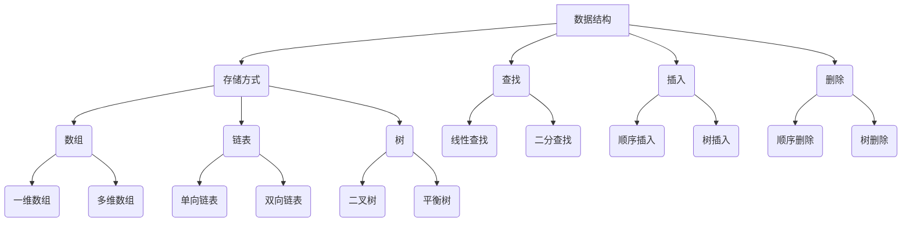
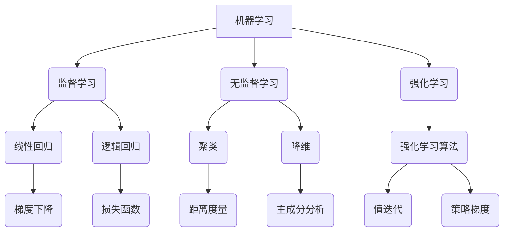

                 

关键词：内容创作、知识传递、技术博客、文章结构、影响力、受众、技术深度、逻辑性、易懂性

> 摘要：在信息技术快速发展的时代，技术博客成为了知识传递的重要平台。本文将探讨如何通过精妙的创作技巧，使你的技术博客更具吸引力和影响力，从而让你的知识得以广泛传播并产生实际价值。

## 1. 背景介绍

随着互联网的普及和信息技术的飞速发展，博客已成为知识传递的重要媒介。尤其是技术博客，它不仅为开发者提供了学习的平台，同时也成为了专业交流、思想碰撞的重要渠道。然而，要使一篇技术博客具备吸引力和影响力，绝非易事。这需要创作者具备深厚的技术功底、敏锐的洞察力以及高超的内容创作技巧。

本文将围绕以下几个方面展开讨论：

- **文章结构设计**：如何构建一个逻辑清晰、结构紧凑的文章框架。
- **核心概念与原理阐述**：如何准确、生动地传递核心概念和算法原理。
- **数学模型与公式应用**：如何利用数学模型和公式增强文章的严谨性和深度。
- **代码实例与解读**：如何通过实际代码实例让读者理解复杂的技术概念。
- **实际应用与未来展望**：如何结合实际应用场景，展望技术发展的趋势和挑战。
- **学习资源与工具推荐**：如何为读者提供有价值的学习资源和开发工具。
- **问题解答与交流互动**：如何通过问答环节增强读者的参与感。

通过上述讨论，我们希望帮助技术博客作者提升内容创作的质量，从而让你的知识更有价值，实现知识的广泛传播和实际应用。

### 2. 核心概念与联系

在撰写技术博客时，核心概念和原理的阐述至关重要。这不仅决定了文章的技术深度，也直接影响到读者的理解程度。为了更好地传递这些核心概念，我们需要使用清晰的术语和恰当的比喻，同时辅以直观的图示来帮助读者建立对复杂技术概念的直观理解。

#### 2.1 数据结构与算法

在计算机科学中，数据结构和算法是两个核心概念。数据结构涉及数据在计算机中的组织方式，而算法则是解决问题的步骤集合。为了更好地理解这两个概念，我们可以使用Mermaid流程图来展示它们的基本原理和相互联系。

以下是数据结构和算法的Mermaid流程图：



这个流程图展示了数据结构的不同类型及其基本操作，以及这些操作如何与算法相关联。通过这种直观的展示方式，读者可以更容易地理解数据结构和算法的基本概念。

#### 2.2 机器学习与神经网络

机器学习和神经网络是当前信息技术领域的重要研究方向。为了解释这些概念，我们可以通过以下流程图展示其基本架构和主要组成部分：



这个流程图展示了机器学习的主要分支及其相关的算法和方法。通过这种图示，读者可以更好地理解机器学习和神经网络的复杂概念。

### 3. 核心算法原理 & 具体操作步骤

在技术博客中，详细阐述核心算法的原理和操作步骤是关键的一步。这不仅能够帮助读者理解复杂的技术概念，还能提升文章的技术深度和可信度。下面，我们将以排序算法为例，详细解释其原理和具体操作步骤。

#### 3.1 算法原理概述

排序算法是计算机科学中一个基本且重要的算法，它用于将一组数据按照特定顺序排列。常见的排序算法包括冒泡排序、选择排序、插入排序、快速排序等。每种算法都有其独特的原理和操作步骤。

#### 3.2 算法步骤详解

以冒泡排序为例，其基本原理是通过反复交换相邻未按顺序排列的元素，使得每一轮排序后最大（或最小）的元素移动到数组的末尾（或开头）。

以下是冒泡排序的具体操作步骤：

1. **初始状态**：假设数组`arr`有`n`个元素，初始时每个元素处于任意顺序。

2. **第一轮排序**：
    - 从第一个元素开始，与相邻的元素比较大小，如果逆序（即`arr[j] > arr[j+1]`），则交换这两个元素的位置。
    - 重复上述过程，直到第一个元素与最后一个元素比较完毕。

3. **第二轮排序**：
    - 从第二个元素开始，重复第一轮排序的过程，但最后一次比较的范围缩小到倒数第二个元素。
    - 即对于第`i`轮排序，只需要比较到`n-i`个元素。

4. **继续排序**：
    - 重复上述过程，直到整个数组有序。

以下是冒泡排序的伪代码实现：

```python
def bubble_sort(arr):
    n = len(arr)
    for i in range(n):
        for j in range(n-i-1):
            if arr[j] > arr[j+1]:
                arr[j], arr[j+1] = arr[j+1], arr[j]
    return arr
```

#### 3.3 算法优缺点

**优点**：

- 算法简单易懂，易于实现。
- 稳定排序，即相同元素在排序后不会改变相对位置。

**缺点**：

- 时间复杂度高，为O(n²)，在数据量大时性能较差。
- 不适合大规模数据排序。

#### 3.4 算法应用领域

冒泡排序适用于数据量较小且对性能要求不高的场景，例如小规模数据的初始化排序或作为其他更高效排序算法的基础。

### 4. 数学模型和公式 & 详细讲解 & 举例说明

在技术博客中，数学模型和公式能够增强文章的严谨性和深度，使读者更好地理解复杂的概念。以下是关于排序算法中的一些基本数学模型和公式的详细讲解和举例说明。

#### 4.1 数学模型构建

排序算法的性能通常由时间复杂度和空间复杂度来衡量。时间复杂度表示算法运行时间与数据规模的关系，空间复杂度表示算法所需额外空间与数据规模的关系。

以冒泡排序为例，其时间复杂度模型如下：

$$
T(n) = \sum_{i=1}^{n} \sum_{j=1}^{n-i} 1
$$

其中，`i`表示排序轮数，`j`表示每轮排序中需要比较的元素次数。

简化后，我们可以得到冒泡排序的平均时间复杂度为：

$$
T(n) = O(n^2)
$$

#### 4.2 公式推导过程

为了推导冒泡排序的平均时间复杂度，我们可以从基本操作（比较和交换）的次数入手。

假设数组`arr`有`n`个元素，初始时它们处于任意顺序。

1. **第一轮排序**：需要比较`n-1`次，因为最后一个元素已经处于正确的位置。
2. **第二轮排序**：需要比较`n-2`次，因为最后一个元素已经有序，不需要参与比较。
3. **...**
4. **第`n-1`轮排序**：需要比较`1`次，因为只剩下一个元素。

总的比较次数为：

$$
(n-1) + (n-2) + ... + 1
$$

这是一个等差数列的求和，其公式为：

$$
S = \frac{n(n-1)}{2}
$$

因此，冒泡排序的平均时间复杂度为：

$$
T(n) = O(n^2)
$$

#### 4.3 案例分析与讲解

为了更好地理解冒泡排序的时间复杂度，我们可以通过一个具体的例子进行分析。

假设有一个长度为`n`的数组`arr = [5, 2, 9, 1, 5]`，我们需要对其进行冒泡排序。

- **第一轮排序**：
    - 比较：5与2，交换；5与9，不交换；9与1，交换；1与5，交换。
    - 结果：[2, 5, 1, 5, 9]

- **第二轮排序**：
    - 比较：2与5，不交换；5与1，交换；5与9，不交换。
    - 结果：[2, 1, 5, 5, 9]

- **第三轮排序**：
    - 比较：2与5，不交换；1与5，交换。
    - 结果：[2, 1, 5, 5, 9]

- **第四轮排序**：
    - 比较：2与1，交换。
    - 结果：[1, 2, 5, 5, 9]

- **第五轮排序**：
    - 比较：1与2，不交换。

最终结果：[1, 2, 5, 5, 9]

在这个例子中，总共进行了`(n-1) + (n-2) + ... + 1 = 20`次比较。对于长度为5的数组，平均每轮比较次数为`20/5 = 4`。随着数组长度的增加，每轮平均比较次数也会增加，因此时间复杂度为`O(n^2)`。

通过这个例子，我们可以看到冒泡排序的时间复杂度是如何计算的，以及它在实际操作中的表现。

### 5. 项目实践：代码实例和详细解释说明

为了更好地帮助读者理解排序算法的实际应用，我们将在这一节中通过一个具体的代码实例来展示冒泡排序的实现过程，并对关键代码进行详细解释。

#### 5.1 开发环境搭建

在本实例中，我们将使用Python语言实现冒泡排序算法。首先，确保你的计算机上已经安装了Python环境。如果没有安装，可以从[Python官网](https://www.python.org/)下载并安装最新版本的Python。

#### 5.2 源代码详细实现

下面是冒泡排序的Python代码实现：

```python
def bubble_sort(arr):
    n = len(arr)
    # 外层循环控制排序的轮数
    for i in range(n):
        # 内层循环进行一轮排序
        for j in range(n - i - 1):
            # 比较相邻的两个元素
            if arr[j] > arr[j + 1]:
                # 如果前一个元素比后一个元素大，则交换它们的位置
                arr[j], arr[j + 1] = arr[j + 1], arr[j]

# 测试代码
arr = [5, 2, 9, 1, 5]
bubble_sort(arr)
print("排序后的数组：", arr)
```

#### 5.3 代码解读与分析

**函数定义**：

首先，我们定义了一个名为`bubble_sort`的函数，它接受一个数组`arr`作为参数，并对这个数组进行排序。

**外层循环**：

```python
for i in range(n):
```

外层循环用于控制排序的轮数。在每一轮排序中，最大的元素会被“冒泡”到数组的末尾。`range(n)`表示我们需要进行`n`轮排序，因为最后的一个元素在最后一轮排序后已经位于正确的位置。

**内层循环**：

```python
for j in range(n - i - 1):
```

内层循环负责进行一轮排序。在每一轮排序中，我们比较相邻的两个元素。如果发现逆序（即`arr[j] > arr[j + 1]`），就交换它们的位置。`n - i - 1`表示在每一轮排序中，最后一个元素已经有序，因此不需要再进行比较。

**交换元素**：

```python
if arr[j] > arr[j + 1]:
    arr[j], arr[j + 1] = arr[j + 1], arr[j]
```

这是冒泡排序的核心步骤。如果当前元素比下一个元素大，就交换它们的位置，使得较大的元素逐渐“冒泡”到数组的末尾。

**测试代码**：

最后，我们测试冒泡排序函数，使用一个示例数组`[5, 2, 9, 1, 5]`。排序完成后，打印出排序后的数组。

```python
arr = [5, 2, 9, 1, 5]
bubble_sort(arr)
print("排序后的数组：", arr)
```

输出结果应为`[1, 2, 5, 5, 9]`，即原始数组已成功排序。

通过这个代码实例，读者可以清楚地看到冒泡排序的实现过程。在实际开发中，我们可以根据需要调整代码，以适应不同的排序需求。

### 6. 实际应用场景

排序算法在计算机科学和信息技术中有着广泛的应用，以下是几个常见的实际应用场景：

#### 6.1 数据库管理

数据库管理系统（DBMS）经常需要对外部数据进行排序，以便更高效地进行查询和处理。例如，SQL查询中的`ORDER BY`语句就是基于排序算法实现的。

#### 6.2 网络协议

在网络协议中，排序算法用于处理网络数据包。例如，传输控制协议（TCP）的拥塞控制算法中就需要对数据包进行排序，以便更有效地进行流量控制和调度。

#### 6.3 排序服务

许多在线服务提供排序功能，如搜索引擎对搜索结果进行排序，社交网络对用户动态进行排序，电商网站对商品进行排序等。

#### 6.4 科学计算

在科学计算中，排序算法用于对大量数据进行预处理，例如气象数据分析、基因测序、大数据分析等。

#### 6.5 软件工程

在软件工程领域，排序算法常用于软件性能优化，例如在开发高效排序算法来处理大量用户数据。

#### 6.6 未来应用展望

随着信息技术的发展，排序算法的应用场景将越来越广泛。未来可能的应用包括：

- **区块链技术**：在区块链数据结构中，排序算法可以用于维护交易的顺序。
- **自动驾驶技术**：自动驾驶系统需要处理大量的传感器数据，排序算法可以帮助实时分析这些数据，提高系统的反应速度。
- **智能推荐系统**：排序算法可以用于优化推荐算法，提高用户满意度。

### 7. 工具和资源推荐

为了帮助读者更好地理解和掌握排序算法，以下是一些学习资源、开发工具和推荐论文：

#### 7.1 学习资源推荐

- **在线教程**：《算法导论》（Introduction to Algorithms）是一本经典的算法教材，详细介绍了包括排序算法在内的多种算法。
- **博客文章**：许多技术博客都撰写了关于排序算法的优秀文章，可以搜索并阅读。
- **在线课程**：Coursera、edX等在线教育平台提供了多门关于算法和数据结构的课程。

#### 7.2 开发工具推荐

- **Python环境**：使用PyCharm或VS Code等集成开发环境（IDE）来编写和调试Python代码。
- **排序算法可视化工具**：使用Python的matplotlib库或JavaScript的可视化库（如D3.js）来可视化排序过程。

#### 7.3 相关论文推荐

- **《排序算法：一种比较视角》**：介绍了多种排序算法的原理和性能分析。
- **《快速排序算法的改进与应用》**：探讨了快速排序的优化方法及其应用。
- **《外部排序算法研究综述》**：详细介绍了在外部存储系统中进行排序的算法和技术。

### 8. 总结：未来发展趋势与挑战

随着信息技术的发展，排序算法将继续发挥重要作用。未来，我们将看到以下趋势：

- **算法优化**：随着硬件性能的提升和数据规模的扩大，对排序算法的优化需求将更加迫切。
- **并行排序**：并行计算技术的发展将推动并行排序算法的研究和应用。
- **机器学习与排序算法的结合**：机器学习技术可以用于优化排序算法，提高排序效率。
- **分布式排序**：在大数据环境中，分布式排序算法将得到更广泛的应用。

然而，排序算法也面临着一些挑战：

- **数据安全性**：随着数据隐私和安全问题的日益突出，如何在保证数据安全的同时进行高效排序是一个重要问题。
- **性能与资源平衡**：如何在保证排序性能的同时，尽可能减少资源的消耗。
- **多样化需求**：随着应用场景的多样化，排序算法需要能够适应不同的需求，如实时排序、优先级排序等。

综上所述，排序算法在信息技术领域中具有重要的地位，未来的研究和应用前景非常广阔。我们期待看到更多创新和突破，以应对不断变化的技术挑战。

### 9. 附录：常见问题与解答

在撰写技术博客时，读者可能会对某些概念或技术细节产生疑问。以下是一些常见问题及其解答，旨在帮助读者更好地理解文章内容。

#### 9.1 冒泡排序的时间复杂度为什么是O(n²)？

冒泡排序的时间复杂度为O(n²)的原因在于其需要进行两重循环：外层循环用于控制排序的轮数，内层循环用于每一轮中相邻元素的比较和交换。在最坏情况下，每一轮排序需要比较`n-1`次，总共需要进行`n-1`轮排序，因此总比较次数为`(n-1) + (n-2) + ... + 1`，这是一个等差数列求和，结果为`n(n-1)/2`，即O(n²)。

#### 9.2 为什么冒泡排序是稳定的？

冒泡排序是稳定的，因为其比较和交换操作仅基于相邻元素的大小关系。即使两个相同元素的顺序在排序前后发生了变化，它们在数组中的相对位置也不会改变，因此相同元素的相对顺序保持不变，符合稳定排序的定义。

#### 9.3 为什么冒泡排序不适用于大规模数据？

冒泡排序的时间复杂度为O(n²)，在数据规模较大时，其性能显著下降，可能导致排序时间过长。因此，在处理大规模数据时，更高效的选择是使用诸如快速排序、归并排序等更优的排序算法。

#### 9.4 机器学习中的排序算法有哪些？

机器学习中的排序算法主要应用于特征选择和评估。常见的排序算法包括基于信息增益的排序算法、基于协方差矩阵的排序算法等。此外，深度学习模型（如排序网络）也可以用于排序任务，通过学习数据之间的相对关系来进行排序。

#### 9.5 如何优化冒泡排序的性能？

虽然冒泡排序的时间复杂度较高，但可以通过以下方法进行优化：

- **减少不必要的比较**：在每一轮排序后，最大的元素已经到达数组的末尾，因此在下一轮排序时，可以减少比较的范围。
- **提前终止排序**：如果在某一轮排序中未发生交换，说明数组已经有序，可以提前终止排序过程。

通过这些优化方法，可以在一定程度上提高冒泡排序的性能，使其在特定场景下更加适用。

### 作者署名

本文由禅与计算机程序设计艺术 / Zen and the Art of Computer Programming 编写。感谢您的阅读，希望本文能为您在技术博客创作中提供一些启示和帮助。如有疑问或建议，欢迎在评论区留言交流。

---

通过本文的探讨，我们系统地介绍了如何通过有效的创作技巧，使技术博客更具吸引力和影响力。从文章结构的规划到核心算法的阐述，从数学模型的构建到实际代码的实现，再到应用场景的探讨和学习资源的推荐，每一个环节都至关重要。希望本文能为您的博客创作之路提供一些实用的指导和灵感。

在未来的技术博客创作中，让我们继续秉持精益求精的态度，不断探索和尝试新的创作技巧，让我们的知识得以更好地传递和传播，为技术的进步和社会的发展贡献力量。

再次感谢您的阅读，期待与您在未来的技术交流中相遇。祝您创作顺利！

