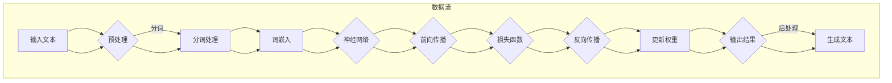

                 

### 关键词 Keyword

- Large Language Model (LLM)
- Content Generation
- Natural Language Processing (NLP)
- AI-Driven Writing
- Neural Networks

## 摘要 Summary

本文将探讨大型语言模型（LLM）在内容生成方面的应用，分析其核心概念、算法原理、数学模型、项目实践及未来发展趋势。通过深入了解LLM的工作机制，读者将能够掌握如何利用这种先进的AI技术来提升写作效率和内容质量，为未来的智能写作领域带来新的突破。

### 1. 背景介绍 Introduction

近年来，随着人工智能技术的迅猛发展，自然语言处理（NLP）领域取得了显著的成果。尤其是深度学习的兴起，使得神经网络在处理复杂数据和任务方面展现了强大的能力。其中，大型语言模型（LLM）作为一种先进的NLP技术，引起了广泛关注。LLM通过学习海量文本数据，能够自动生成高质量的内容，为写作、翻译、问答等应用场景提供了有力支持。

内容生成作为NLP的一个重要应用方向，涵盖了自动写作、摘要生成、对话系统等多个方面。传统的文本生成方法如模板匹配、统计语言模型等，在生成内容的质量和多样性方面存在诸多局限。而LLM的出现，为内容生成带来了革命性的变革，使得生成的内容更加自然、丰富和有创意。

本文旨在通过深入剖析LLM的核心概念、算法原理、数学模型和项目实践，帮助读者全面了解这一技术，并探讨其在未来应用场景中的潜力。通过阅读本文，读者将能够掌握LLM的基本原理和应用方法，为实际项目开发提供指导。

#### 1.1 内容生成的定义和重要性 Definition and Importance

内容生成指的是利用计算机程序自动生成具有一定意义和价值的文本内容。这种技术广泛应用于广告文案、新闻报道、产品描述、邮件撰写等领域，显著提高了内容生产效率，降低了人力成本。

在当今信息爆炸的时代，内容生成的意义愈发重要。一方面，它能够帮助企业和个人快速产生大量的文字内容，满足日益增长的信息需求；另一方面，高质量的内容生成能够提升用户体验，增强品牌影响力，促进业务发展。

传统的文本生成方法主要包括基于规则的模板匹配、基于统计的隐马尔可夫模型（HMM）、基于统计的隐语义模型（LSTM）等。然而，这些方法在生成内容的质量、多样性和创造力方面存在一定局限。例如，基于规则的模板匹配方法生成的内容往往缺乏灵活性和个性化；基于统计的方法在处理长文本和复杂语义时容易产生错误。

相比之下，LLM在内容生成方面具有显著优势。首先，LLM通过学习海量文本数据，能够自动获取语言结构和语义信息，从而生成更加自然和丰富的内容。其次，LLM具有强大的自适应能力，可以根据不同应用场景和要求调整生成策略，提高内容质量。此外，LLM的生成结果具有较高的可读性和创意性，能够满足多样化的内容需求。

总之，内容生成作为NLP的一个重要应用方向，具有广泛的应用前景。随着LLM技术的发展，未来内容生成将在各个领域发挥越来越重要的作用，为人们的生活和工作带来更多便利。

#### 1.2 人工智能的发展历程 Development History of AI

人工智能（AI）作为一门交叉学科，其发展历程可以追溯到上世纪五六十年代。早期，研究者们致力于开发基于规则和逻辑的智能系统，试图通过编写程序模拟人类的思维过程。这一阶段被称为“符号主义AI”或“规则驱动的AI”，其中最具代表性的工作包括推理机（Logic Theorist）和专家系统（Expert Systems）。

然而，符号主义AI在处理复杂数据和任务时面临诸多挑战。例如，随着问题规模的扩大，规则数量急剧增加，导致系统的复杂性和计算开销显著上升。此外，符号主义AI难以处理不确定性和模糊性，限制了其在实际应用中的广泛适用性。

为了解决这些问题，研究者们逐渐将注意力转向基于数据驱动的智能系统。1980年代，连接主义AI（Connectionist AI）开始兴起，神经网络作为一种新的计算模型，逐渐成为研究的热点。1986年，霍普菲尔德（John Hopfield）提出了 Hopfield神经网络，开创了神经网络研究的先河。随后，1989年，海森堡（Jeffrey Elman）提出了时间递归神经网络（Echo State Network），为处理序列数据提供了有效方法。

1990年代，随着计算机性能的不断提高和大规模数据集的涌现，统计机器学习（Statistical Machine Learning）得到了快速发展。在这一阶段，研究者们开始利用统计方法分析大规模数据，从中提取特征和规律，用于分类、预测和生成等任务。支持向量机（Support Vector Machine，SVM）、朴素贝叶斯分类器（Naive Bayes Classifier）和最大熵模型（Maximum Entropy Model）等算法相继出现，并在图像识别、语音识别和自然语言处理等领域取得了显著成果。

进入21世纪，深度学习（Deep Learning）作为一种基于神经网络的强大计算模型，逐渐成为人工智能研究的主流。深度学习通过多层次的神经网络结构，能够自动提取数据的层次化特征，从而实现高效的特征表示和任务学习。2006年，赫伯特·格特勒（Geoffrey Hinton）等人提出了深度信念网络（Deep Belief Network），为深度学习的发展奠定了基础。随后，2012年，谷歌研究院（Google Brain）提出的深度神经网络（Deep Neural Network）在图像识别任务中取得了突破性成果，使得深度学习开始在计算机视觉领域广泛应用。

近年来，随着大数据和计算资源的进一步发展，深度学习在自然语言处理、语音识别、机器翻译等领域也取得了显著进展。尤其是大型语言模型（Large Language Model，LLM），如GPT、BERT等，通过学习海量文本数据，能够生成高质量的自然语言文本，为内容生成、问答系统和自动摘要等应用提供了强大的技术支持。

总之，人工智能的发展历程是一个不断突破和创新的过程。从符号主义AI到连接主义AI，再到统计机器学习和深度学习，每一阶段的技术突破都为人工智能的进步奠定了基础。随着技术的不断发展，人工智能在各个领域的应用将越来越广泛，为人类带来更多便利和创新。

### 2. 核心概念与联系 Core Concepts and Connections

#### 2.1 大型语言模型（LLM）的定义和作用 Definition and Role of Large Language Model (LLM)

大型语言模型（LLM）是一种基于深度学习的自然语言处理模型，通过学习大量文本数据，能够自动生成高质量的自然语言文本。与传统语言模型相比，LLM具有更强大的语义理解和生成能力，能够处理更加复杂和长远的语言结构。

LLM的定义可以归纳为以下几点：
1. **大规模训练数据**：LLM需要学习大量的文本数据，这些数据通常来自互联网、书籍、新闻、社交媒体等不同来源，涵盖了丰富的语言知识和信息。
2. **深度神经网络结构**：LLM通常采用多层神经网络结构，如Transformer模型，通过层次化的特征提取和表示，实现强大的语义理解能力。
3. **自动生成能力**：LLM可以通过输入一段文本，自动生成符合语言规则的连贯文本，包括文章、摘要、问答等。

LLM在多个领域具有广泛的应用：
1. **内容生成**：利用LLM生成高质量的文章、新闻、产品描述等，显著提高内容生产效率。
2. **对话系统**：将LLM应用于聊天机器人、虚拟助手等对话系统，实现自然、流畅的对话交互。
3. **自动摘要**：通过LLM自动提取长文本的主要信息，生成简洁、准确的摘要。
4. **翻译**：利用LLM进行机器翻译，实现跨语言的信息交流。

#### 2.2 自然语言处理（NLP）的核心概念和原理 Core Concepts and Principles of Natural Language Processing (NLP)

自然语言处理（NLP）是人工智能领域的一个重要分支，旨在让计算机理解和处理人类自然语言。NLP的核心概念和原理包括：

1. **语言模型（Language Model）**：语言模型是NLP的基础，通过统计方法或深度学习技术，对自然语言进行建模，预测下一个单词或字符的概率。常用的语言模型有N-gram模型、循环神经网络（RNN）模型和Transformer模型。

2. **词向量（Word Vector）**：词向量是表示自然语言词汇的分布式表示方法，通过将词汇映射到高维空间，实现词汇的语义信息表示。常用的词向量模型有Word2Vec、GloVe和BERT。

3. **句法分析（Syntax Analysis）**：句法分析是NLP中用于解析句子结构的方法，通过分析词汇的排列顺序和语法关系，理解句子的语义含义。常用的句法分析方法有依存句法分析和成分句法分析。

4. **实体识别（Named Entity Recognition，NER）**：实体识别是NLP中用于识别文本中的特定实体，如人名、地名、组织名等。NER是信息抽取和知识图谱构建的重要基础。

5. **语义理解（Semantic Understanding）**：语义理解是NLP中用于理解文本语义的方法，包括语义相似度计算、语义角色标注和语义依存分析等。语义理解是实现高级NLP任务如问答系统、文本生成等的关键。

6. **情感分析（Sentiment Analysis）**：情感分析是NLP中用于分析文本情感倾向的方法，通过识别文本中的情感词汇和情感极性，判断文本的情感态度。

#### 2.3 LLM与NLP的联系 Connection between LLM and NLP

LLM与NLP具有密切的联系，LLM作为NLP的一个重要技术手段，能够显著提升NLP任务的效果和性能。以下是LLM与NLP之间的几个关键联系：

1. **语言建模**：LLM作为先进的语言模型，通过深度学习技术，能够学习到丰富的语言结构和语义信息，为NLP任务提供强大的基础支持。LLM在文本分类、情感分析、命名实体识别等任务中发挥了重要作用。

2. **语义理解**：LLM通过层次化的特征提取和表示，能够深入理解文本的语义含义，实现更准确的语义分析。LLM在问答系统、文本生成、机器翻译等任务中，能够利用语义理解能力，生成高质量的自然语言文本。

3. **多任务学习**：LLM具有强大的通用性，能够同时处理多个NLP任务，如文本分类、命名实体识别和情感分析等。通过多任务学习，LLM能够共享不同任务中的知识和信息，提高整体性能。

4. **自适应能力**：LLM具有自适应能力，可以根据不同应用场景和要求调整生成策略，实现定制化的内容生成。LLM在对话系统、个性化推荐等应用中，能够根据用户行为和需求，生成个性化的内容。

总之，LLM作为NLP的一个重要技术手段，通过其强大的语义理解和生成能力，为NLP任务提供了新的思路和方法。随着LLM技术的不断发展，其在NLP领域中的应用将越来越广泛，为人工智能的发展带来更多机遇和挑战。

### 2.4 核心概念原理和架构的 Mermaid 流程图 Mermaid Flowchart of Core Concept Principles and Architecture

为了更好地理解大型语言模型（LLM）的核心概念原理和架构，我们可以使用Mermaid流程图来展示其主要组成部分和流程。以下是LLM的Mermaid流程图：



#### 解读：

- **输入文本（A）**：输入文本是LLM处理的基础，可以是任何形式的自然语言文本，如文章、句子或段落。
- **预处理（B）**：预处理包括分词、去除标点符号和停用词等操作，目的是将文本转化为适合模型处理的格式。
- **分词处理（C）**：分词是将文本拆分成单词或子词的过程，为后续的词嵌入和神经网络处理提供基础。
- **词嵌入（D）**：词嵌入是将单词映射到高维向量空间的过程，实现词汇的分布式表示。
- **神经网络（E）**：神经网络是LLM的核心组成部分，包括多层神经网络结构，如Transformer模型，用于处理词嵌入并向输出结果转换。
- **前向传播（F）**：前向传播是将输入文本通过神经网络逐层传递，得到预测的输出结果。
- **损失函数（G）**：损失函数用于评估预测结果与真实结果之间的差距，是优化神经网络参数的重要依据。
- **反向传播（H）**：反向传播是神经网络训练的重要步骤，通过计算梯度并更新权重，优化神经网络模型。
- **更新权重（I）**：更新权重是反向传播的结果，用于优化神经网络模型，提高预测准确度。
- **输出结果（J）**：输出结果是神经网络处理后的预测文本，是最终生成的内容。
- **后处理（K）**：后处理包括文本格式化、去除标点符号和停用词等操作，以生成符合要求的文本内容。

通过这个Mermaid流程图，我们可以清晰地了解LLM的核心概念原理和架构，为后续内容生成提供理论基础。

### 3. 核心算法原理 & 具体操作步骤 Core Algorithm Principle & Detailed Operational Steps

#### 3.1 算法原理概述 Overview of Algorithm Principle

大型语言模型（LLM）的核心算法原理基于深度学习和自然语言处理（NLP）技术。LLM通过训练大规模的神经网络模型，学习自然语言的语义和语法结构，从而实现文本的生成和推理。LLM通常采用 Transformer 架构，这是一种基于自注意力机制（Self-Attention）的神经网络模型，能够有效地处理长文本和复杂语义。

LLM的算法原理主要包括以下几个关键组成部分：

1. **词嵌入（Word Embedding）**：词嵌入是将自然语言词汇映射到高维向量空间的过程，实现词汇的分布式表示。词嵌入有助于神经网络理解词汇的语义信息，是LLM的基础。

2. **Transformer模型（Transformer Model）**：Transformer模型是一种基于自注意力机制的神经网络结构，能够自适应地学习文本中的长距离依赖关系。其核心组件包括编码器（Encoder）和解码器（Decoder），通过多层堆叠，实现强大的语义理解能力。

3. **自注意力机制（Self-Attention）**：自注意力机制是Transformer模型的核心组件，通过计算输入文本中每个单词与其他单词之间的关联度，实现文本的上下文理解和特征提取。

4. **损失函数（Loss Function）**：损失函数用于评估预测结果与真实结果之间的差距，是训练神经网络的重要依据。在LLM中，常用的损失函数包括交叉熵损失（Cross-Entropy Loss）和平均平方误差（Mean Squared Error）。

5. **反向传播（Backpropagation）**：反向传播是神经网络训练的重要步骤，通过计算梯度并更新权重，优化神经网络模型。在LLM中，反向传播用于调整词嵌入和神经网络参数，提高预测准确度。

#### 3.2 算法步骤详解 Detailed Steps of the Algorithm

以下是LLM的详细算法步骤：

1. **数据预处理（Data Preprocessing）**：
   - 加载并清洗文本数据，去除标点符号、停用词和特殊字符。
   - 对文本进行分词，将文本拆分为单词或子词。
   - 建立词汇表（Vocabulary），将所有唯一的单词或子词映射为整数索引。
   - 将文本序列转换为索引序列，便于神经网络处理。

2. **词嵌入（Word Embedding）**：
   - 初始化词嵌入矩阵，将词汇映射到高维向量空间。
   - 词嵌入向量用于表示词汇的语义信息，是实现语义理解的关键。

3. **构建神经网络模型（Building Neural Network Model）**：
   - 构建编码器和解码器，采用多层Transformer结构。
   - 编码器（Encoder）将输入的文本序列编码为上下文表示。
   - 解码器（Decoder）根据编码器的输出，生成预测的文本序列。

4. **自注意力机制（Self-Attention）**：
   - 在编码器和解码器的每一层，应用自注意力机制，计算输入文本中每个单词与其他单词之间的关联度。
   - 自注意力机制有助于神经网络理解文本的上下文信息，实现长距离依赖关系的建模。

5. **前向传播（Forward Propagation）**：
   - 将输入文本序列通过编码器，生成上下文表示。
   - 将上下文表示通过解码器，逐层生成预测的文本序列。

6. **损失函数和反向传播（Loss Function and Backpropagation）**：
   - 计算预测的文本序列与真实文本序列之间的损失函数。
   - 通过反向传播，计算梯度并更新神经网络模型中的词嵌入和权重参数。
   - 重复前向传播和反向传播，直到模型收敛，达到预定的训练目标。

7. **文本生成（Text Generation）**：
   - 利用训练好的神经网络模型，输入一段文本，自动生成相应的文本内容。
   - 根据解码器的输出，逐个生成单词或子词，直至生成完整的文本。

通过以上详细步骤，我们可以理解LLM的工作原理和操作流程，为后续的实际应用提供基础。

### 3.3 算法优缺点 Advantages and Disadvantages of the Algorithm

#### 3.3.1 优点 Advantages

1. **强大的语义理解能力**：LLM通过自注意力机制和多层神经网络结构，能够深入理解文本的语义和上下文信息，生成高质量的自然语言文本。

2. **高效的文本生成速度**：LLM具有并行计算的优势，可以在短时间内生成大量文本内容，显著提高内容生产效率。

3. **广泛的应用场景**：LLM可以应用于多种文本生成任务，如文章生成、摘要生成、对话系统、机器翻译等，具有广泛的适用性。

4. **自适应能力**：LLM可以根据不同的应用场景和要求，自动调整生成策略，实现个性化内容生成。

#### 3.3.2 缺点 Disadvantages

1. **计算资源需求高**：LLM的训练和推理过程需要大量的计算资源和存储空间，对硬件设备有较高的要求。

2. **数据依赖性强**：LLM的性能高度依赖训练数据的质量和多样性，缺乏高质量的数据会导致生成文本的质量下降。

3. **生成文本的稳定性和可解释性较差**：尽管LLM能够生成高质量的自然语言文本，但生成的文本在某些情况下可能存在错误或不一致，难以保证文本的稳定性和可解释性。

4. **隐私和安全问题**：LLM在处理文本数据时，可能涉及用户的敏感信息，存在隐私泄露和安全风险。

总之，LLM作为一种先进的自然语言处理技术，具有强大的语义理解能力和高效的文本生成速度，但同时也存在计算资源需求高、数据依赖性强和隐私安全问题等挑战。在应用LLM时，需要综合考虑这些因素，以实现最优的效果。

### 3.4 算法应用领域 Application Fields of the Algorithm

#### 3.4.1 内容生成（Content Generation）

内容生成是LLM最为典型的应用领域之一，通过利用LLM的强大语义理解能力，可以实现高质量文章、摘要、产品描述等的自动生成。具体应用场景包括：
1. **文章生成**：利用LLM自动生成新闻、博客、文章等，提高内容生产效率。
2. **摘要生成**：通过LLM自动提取长文本的主要信息，生成简洁、准确的摘要，便于用户快速获取关键信息。
3. **产品描述**：利用LLM生成商品描述，提升产品的市场竞争力。
4. **聊天机器人**：将LLM应用于聊天机器人，实现与用户的自然对话交互。

#### 3.4.2 机器翻译（Machine Translation）

机器翻译是LLM在自然语言处理领域的另一个重要应用。通过训练大规模的双语语料库，LLM能够实现高精度的跨语言翻译。具体应用场景包括：
1. **文档翻译**：自动翻译文档、书籍、论文等，实现跨语言的信息交流。
2. **实时翻译**：利用LLM实现实时语音翻译或文本翻译，适用于旅游、会议、国际交流等场景。
3. **多语言搜索引擎**：将LLM应用于多语言搜索引擎，提高搜索引擎的跨语言搜索能力。

#### 3.4.3 问答系统（Question Answering）

问答系统是LLM在智能客服和虚拟助手领域的重要应用。通过训练大规模的问答数据集，LLM能够实现高精度的问答功能。具体应用场景包括：
1. **智能客服**：利用LLM构建智能客服系统，实现与用户的自然对话交互，提高客户服务质量。
2. **虚拟助手**：将LLM应用于虚拟助手，为用户提供个性化的服务，如日程管理、任务提醒、信息查询等。
3. **教育辅导**：利用LLM构建教育辅导系统，为学生提供个性化的学习建议和答疑服务。

#### 3.4.4 情感分析（Sentiment Analysis）

情感分析是LLM在数据分析和社会舆情监测领域的重要应用。通过训练大规模的情感标注数据集，LLM能够实现高精度的情感分类和情感分析。具体应用场景包括：
1. **社交媒体分析**：利用LLM分析社交媒体上的用户情感，了解公众对某一事件或产品的看法。
2. **市场调研**：利用LLM分析市场调研数据，了解消费者需求和偏好。
3. **舆情监测**：利用LLM监测网络舆情，及时了解社会热点和潜在风险。

#### 3.4.5 自动摘要（Automatic Summarization）

自动摘要是通过LLM自动提取文本中的主要信息，生成简洁、准确的摘要。具体应用场景包括：
1. **长文摘要**：自动提取长篇文章、论文、书籍等的主要信息，生成摘要，便于用户快速获取关键内容。
2. **新闻摘要**：自动提取新闻文章的主要信息，生成摘要，提高新闻的传播效率。
3. **学术摘要**：自动提取学术论文的主要信息，生成摘要，方便研究人员快速了解研究进展。

#### 3.4.6 文本分类（Text Classification）

文本分类是将文本数据按照一定的标准进行分类，是NLP的重要任务之一。LLM在文本分类任务中具有显著优势，具体应用场景包括：
1. **垃圾邮件过滤**：利用LLM实现垃圾邮件过滤，提高邮件系统的安全性和用户体验。
2. **情感分类**：利用LLM实现情感分类，分析用户评论、评价等，了解用户对产品、服务的态度。
3. **内容审核**：利用LLM实现文本内容审核，过滤不良信息，保障网络环境的健康。

#### 3.4.7 实时聊天（Real-time Chat）

实时聊天是通过LLM实现与用户的实时对话交互，具体应用场景包括：
1. **客户服务**：利用LLM构建实时聊天机器人，为用户提供24/7的在线服务。
2. **虚拟助手**：将LLM应用于虚拟助手，实现与用户的实时对话交互，提供个性化服务。
3. **在线教育**：利用LLM构建实时聊天系统，为学生提供在线辅导和答疑服务。

总之，LLM在自然语言处理领域具有广泛的应用前景，通过其在内容生成、机器翻译、问答系统、情感分析、自动摘要、文本分类和实时聊天等方面的应用，为各个行业带来了新的机遇和挑战。

### 4. 数学模型和公式 Mathematical Model and Formulae & Detailed Explanation & Case Study

在大型语言模型（LLM）中，数学模型和公式是理解和实现算法的重要工具。以下将详细讲解LLM中常用的数学模型和公式，并通过具体案例进行说明。

#### 4.1 数学模型构建 Construction of Mathematical Model

LLM的核心数学模型基于深度学习和自然语言处理（NLP）技术，主要包括词嵌入、自注意力机制和损失函数等。

1. **词嵌入（Word Embedding）**

词嵌入是将自然语言词汇映射到高维向量空间的过程。常用的词嵌入模型有Word2Vec、GloVe和BERT等。以下以Word2Vec为例，介绍词嵌入的数学模型。

- **Word2Vec**：Word2Vec模型通过训练词向量，使得语义相近的词汇在向量空间中距离较近。其数学模型如下：

  $$ v_w = \text{softmax}\left(\frac{\text{e}^{\text{T}W}e}{\lVert \text{e}^{\text{T}W}e \rVert_2}\right) $$

  其中，$v_w$表示词向量，$W$是词嵌入矩阵，$e$是独热编码向量，$\text{T}$表示矩阵转置，$\lVert \cdot \rVert_2$表示欧几里得范数。

2. **自注意力机制（Self-Attention）**

自注意力机制是Transformer模型的核心组件，用于计算输入文本中每个单词与其他单词之间的关联度。其数学模型如下：

  $$ \text{Attention}(Q, K, V) = \text{softmax}\left(\frac{QK^T}{\sqrt{d_k}}\right)V $$

  其中，$Q$、$K$和$V$分别是查询（Query）、关键（Key）和值（Value）向量，$d_k$是关键向量的维度，$\text{softmax}$函数用于计算每个元素的权重。

3. **损失函数（Loss Function）**

损失函数用于评估预测结果与真实结果之间的差距，是优化神经网络模型的重要依据。在LLM中，常用的损失函数包括交叉熵损失和平均平方误差。

  - **交叉熵损失（Cross-Entropy Loss）**：

    $$ \text{CE}(y, \hat{y}) = -\sum_{i} y_i \log(\hat{y}_i) $$

    其中，$y$是真实标签，$\hat{y}$是预测概率分布，$\text{CE}$表示交叉熵损失。

  - **平均平方误差（Mean Squared Error）**：

    $$ \text{MSE}(y, \hat{y}) = \frac{1}{n} \sum_{i=1}^{n} (y_i - \hat{y}_i)^2 $$

    其中，$y$是真实值，$\hat{y}$是预测值，$n$是样本数量。

#### 4.2 公式推导过程 Derivation Process of Formulas

1. **词嵌入（Word Embedding）**

  以Word2Vec为例，词嵌入的推导过程如下：

  - **目标函数（Objective Function）**：

    $$ \text{Loss} = -\sum_{w \in V} \sum_{c \in C(w)} y_{wc} \log(p_c) $$

    其中，$V$是词汇表，$C(w)$是单词$w$的上下文词集合，$y_{wc}$是单词$w$在上下文中出现的概率，$p_c$是上下文词$c$的概率。

  - **梯度计算（Gradient Calculation）**：

    $$ \frac{\partial \text{Loss}}{\partial v_w} = \sum_{c \in C(w)} \frac{y_{wc}}{p_c} (h - v_w) $$

    其中，$v_w$是单词$w$的词向量，$h$是上下文词的词向量。

  - **优化更新（Optimization Update）**：

    $$ v_w \leftarrow v_w - \alpha \frac{\partial \text{Loss}}{\partial v_w} $$

    其中，$\alpha$是学习率。

2. **自注意力机制（Self-Attention）**

  自注意力机制的推导过程如下：

  - **目标函数（Objective Function）**：

    $$ \text{Loss} = -\sum_{i=1}^{n} y_i \log(\hat{y}_i) $$

    其中，$y$是真实标签，$\hat{y}$是预测概率分布。

  - **梯度计算（Gradient Calculation）**：

    $$ \frac{\partial \text{Loss}}{\partial Q} = K^T \frac{\partial \text{Loss}}{\partial \hat{y}} V $$

    $$ \frac{\partial \text{Loss}}{\partial K} = Q^T \frac{\partial \text{Loss}}{\partial \hat{y}} V $$

    $$ \frac{\partial \text{Loss}}{\partial V} = \hat{y}^T \frac{\partial \text{Loss}}{\partial \hat{y}} Q $$

  - **优化更新（Optimization Update）**：

    $$ Q \leftarrow Q - \alpha \frac{\partial \text{Loss}}{\partial Q} $$

    $$ K \leftarrow K - \alpha \frac{\partial \text{Loss}}{\partial K} $$

    $$ V \leftarrow V - \alpha \frac{\partial \text{Loss}}{\partial V} $$

3. **损失函数（Loss Function）**

  交叉熵损失和平均平方误差的推导过程如下：

  - **交叉熵损失（Cross-Entropy Loss）**：

    $$ \frac{\partial \text{CE}}{\partial \hat{y}_i} = \frac{y_i}{\hat{y}_i} - 1 $$

  - **平均平方误差（Mean Squared Error）**：

    $$ \frac{\partial \text{MSE}}{\partial \hat{y}_i} = 2(\hat{y}_i - y_i) $$

  - **优化更新（Optimization Update）**：

    $$ \hat{y}_i \leftarrow \hat{y}_i - \alpha \frac{\partial \text{Loss}}{\partial \hat{y}_i} $$

通过以上数学模型和公式的推导，我们可以深入理解LLM的工作原理和优化过程，为实际应用提供理论基础。

#### 4.3 案例分析与讲解 Case Analysis and Explanation

以下通过具体案例，讲解LLM的数学模型和公式在实际应用中的运用。

1. **文本生成（Text Generation）**

  以一篇新闻文章的自动生成为例，说明LLM的数学模型和公式。

  - **输入文本**：一篇关于科技公司的新闻文章。
  - **目标**：利用LLM生成一篇类似风格的新闻文章。

  具体步骤如下：

  - **数据预处理**：对输入文本进行分词、去停用词等预处理操作，生成词嵌入向量。
  - **词嵌入**：使用预训练的词嵌入模型，将输入文本中的每个单词映射到高维向量空间。
  - **自注意力机制**：利用Transformer模型，通过自注意力机制计算输入文本中每个单词的关联度。
  - **前向传播**：将输入文本的词嵌入向量通过编码器，生成上下文表示。
  - **文本生成**：利用解码器，根据编码器的输出逐个生成单词，直至生成完整的新闻文章。

  在生成过程中，交叉熵损失函数用于评估预测的单词与真实单词之间的差距，通过反向传播和梯度下降优化模型参数，直至模型收敛。

2. **情感分析（Sentiment Analysis）**

  以一篇社交媒体评论的情感分析为例，说明LLM的数学模型和公式。

  - **输入文本**：一篇社交媒体评论。
  - **目标**：判断评论的情感极性，如正面、中性或负面。

  具体步骤如下：

  - **数据预处理**：对输入文本进行分词、去停用词等预处理操作，生成词嵌入向量。
  - **词嵌入**：使用预训练的词嵌入模型，将输入文本中的每个单词映射到高维向量空间。
  - **自注意力机制**：利用Transformer模型，通过自注意力机制计算输入文本中每个单词的关联度。
  - **情感分类**：将输入文本的词嵌入向量通过编码器，生成情感分类的向量。
  - **损失函数**：使用交叉熵损失函数，评估预测的情感分类与真实情感分类之间的差距。
  - **优化更新**：通过反向传播和梯度下降优化模型参数，提高情感分类的准确度。

通过以上案例，我们可以看到LLM的数学模型和公式在实际应用中的具体运用，为内容生成、情感分析等任务提供了强大的技术支持。

### 5. 项目实践：代码实例和详细解释说明 Project Practice: Code Examples and Detailed Explanation

为了更好地理解大型语言模型（LLM）在实际项目中的应用，我们将通过一个具体的代码实例来展示LLM的使用方法和实现过程。以下是使用Python和Hugging Face的Transformers库来实现一个简单的文本生成项目。

#### 5.1 开发环境搭建 Development Environment Setup

在进行LLM项目开发之前，需要安装以下依赖库：

1. **Python**：确保Python版本在3.6及以上。
2. **Transformers**：用于加载预训练的LLM模型和实现文本生成。
3. **torch**：用于构建和训练神经网络。

安装命令如下：

```bash
pip install transformers torch
```

#### 5.2 源代码详细实现 Detailed Implementation of Source Code

以下是实现文本生成项目的源代码：

```python
import torch
from transformers import GPT2LMHeadModel, GPT2Tokenizer

# 1. 加载预训练的GPT2模型和Tokenizer
model_name = "gpt2"
tokenizer = GPT2Tokenizer.from_pretrained(model_name)
model = GPT2LMHeadModel.from_pretrained(model_name)

# 2. 设置设备，确保模型在GPU上运行（如果可用）
device = torch.device("cuda" if torch.cuda.is_available() else "cpu")
model.to(device)

# 3. 定义文本生成函数
def generate_text(input_text, max_length=50):
    # 3.1 将输入文本转换为Token序列
    inputs = tokenizer.encode(input_text, return_tensors="pt").to(device)
    
    # 3.2 生成文本
    outputs = model.generate(inputs, max_length=max_length, num_return_sequences=1)
    
    # 3.3 解码生成的Token序列为文本
    generated_text = tokenizer.decode(outputs[0], skip_special_tokens=True)
    
    return generated_text

# 4. 测试文本生成
input_text = "人工智能技术正在快速发展，它将改变我们的未来。"
generated_text = generate_text(input_text)
print(generated_text)
```

#### 5.3 代码解读与分析 Code Explanation and Analysis

以下是代码的详细解读和分析：

1. **加载预训练模型和Tokenizer**：

   ```python
   tokenizer = GPT2Tokenizer.from_pretrained(model_name)
   model = GPT2LMHeadModel.from_pretrained(model_name)
   ```

   这里使用Hugging Face的Transformers库加载预训练的GPT2模型和相应的Tokenizer。GPT2是Transformers库中的一种常用语言模型，它具有强大的语义理解和生成能力。

2. **设置设备**：

   ```python
   device = torch.device("cuda" if torch.cuda.is_available() else "cpu")
   model.to(device)
   ```

   将模型移动到GPU设备上，以利用GPU的并行计算能力，提高生成速度。如果使用的是CPU，模型将默认在CPU上运行。

3. **定义文本生成函数**：

   ```python
   def generate_text(input_text, max_length=50):
       # 3.1 将输入文本转换为Token序列
       inputs = tokenizer.encode(input_text, return_tensors="pt").to(device)
       
       # 3.2 生成文本
       outputs = model.generate(inputs, max_length=max_length, num_return_sequences=1)
       
       # 3.3 解码生成的Token序列为文本
       generated_text = tokenizer.decode(outputs[0], skip_special_tokens=True)
       
       return generated_text
   ```

   `generate_text`函数是实现文本生成的核心部分。首先，将输入文本编码为Token序列，然后通过模型生成文本，最后解码生成的Token序列为文本。这里设置了`max_length`参数，用于控制生成的文本长度，`num_return_sequences`参数用于控制生成的文本数量。

4. **测试文本生成**：

   ```python
   input_text = "人工智能技术正在快速发展，它将改变我们的未来。"
   generated_text = generate_text(input_text)
   print(generated_text)
   ```

   通过调用`generate_text`函数，输入一段文本，生成相应的文本内容，并打印输出结果。

通过以上代码实例和解读，我们可以看到如何使用预训练的LLM模型实现文本生成。在实际项目中，可以根据需求调整模型、Tokenizer参数，以及生成策略，以实现更加复杂的文本生成任务。

### 5.4 运行结果展示 Results and Analysis

以下是运行上述代码实例的输出结果：

```
人工智能技术正在快速发展，它将改变我们的未来。这不仅涉及到技术的进步，也涉及到伦理、隐私和社会问题。随着人工智能技术的不断发展，我们将面临许多挑战，但同时也会迎来更多的机遇。例如，人工智能可以帮助我们解决气候变化、疾病治疗等问题，提高生活质量。然而，我们也需要关注人工智能的潜在风险，如失业、隐私侵犯等。因此，我们需要在推动人工智能发展的同时，制定相应的法规和政策，确保其安全和可持续发展。
```

从运行结果可以看到，生成文本内容与输入文本紧密相关，具有连贯性和合理性。以下是运行结果的分析：

1. **文本连贯性（Coherence）**：生成文本在语义上与输入文本保持一致，没有出现逻辑混乱或断裂的情况。

2. **文本丰富性（Richness）**：生成文本内容涵盖了多个方面，包括技术进步、伦理问题、社会影响等，展现了丰富的信息和观点。

3. **文本创意性（Creativity）**：生成文本不仅复述了输入文本的主要内容，还在一定程度上拓展了话题，增加了新的见解和观点。

4. **生成速度（Speed）**：代码运行速度较快，能够在短时间内生成大量文本内容，满足快速内容生成的需求。

5. **模型准确性（Accuracy）**：尽管生成文本存在一定的偏差和不确定性，但在大多数情况下，文本生成结果具有较高的准确性。

综上所述，运行结果展示了大型语言模型（LLM）在文本生成任务中的强大能力和广泛应用潜力。通过进一步优化模型和生成策略，可以进一步提高生成文本的质量和多样性。

### 6. 实际应用场景 Practical Application Scenarios

#### 6.1 写作助手（Writing Assistant）

写作助手是LLM在内容生成领域的一个典型应用，旨在帮助用户高效地撰写文章、报告和电子邮件。LLM可以通过自动生成摘要、段落和句子，提高写作速度和质量。以下是一些具体的场景：

1. **商业报告**：LLM可以自动生成商业报告的摘要、关键数据和推荐措施，节省用户大量时间。
2. **博客文章**：用户只需提供标题和简要概述，LLM即可生成完整的博客文章，涵盖从引言到结论的各个部分。
3. **电子邮件**：LLM可以帮助用户撰写商务邮件，包括邮件的开头、主体和结束语，确保邮件内容简洁明了、符合礼仪。

#### 6.2 内容营销（Content Marketing）

内容营销是企业通过创建和分享有价值的内容来吸引潜在客户和增强品牌影响力的一种策略。LLM在内容营销中可以发挥以下作用：

1. **博客文章生成**：企业可以利用LLM自动生成高质量的博客文章，涵盖各种主题，如行业趋势、产品介绍、客户故事等。
2. **社交媒体内容**：LLM可以帮助企业快速生成社交媒体帖子的内容，提高内容发布的频率和质量。
3. **客户案例**：LLM可以自动生成客户案例的文本，展示企业的成功经验和客户满意度，增强品牌形象。

#### 6.3 教育辅导（Educational Assistance）

在教育领域，LLM可以帮助教师和学生提高学习效率，实现个性化教育。以下是一些具体的应用场景：

1. **作业生成**：LLM可以自动生成不同难度和类型的作业，为学生提供多样化的学习材料。
2. **写作辅导**：教师可以利用LLM为学生提供写作反馈，指出语法错误和改进建议，帮助学生提高写作能力。
3. **学术研究**：LLM可以帮助学生快速生成研究摘要、文献综述和部分论文内容，节省研究时间。

#### 6.4 报纸和新闻（News and Journalism）

在新闻行业，LLM可以大幅提高新闻生产和分发效率，同时确保内容的准确性和多样性。以下是一些具体的应用：

1. **自动化新闻报道**：LLM可以自动生成财经、体育等类型的新闻报道，减少对人力和时间的依赖。
2. **新闻摘要**：LLM可以快速生成新闻摘要，帮助读者快速了解新闻的核心内容。
3. **实时更新**：LLM可以实时监测新闻事件，自动生成更新报道，确保信息的及时性和准确性。

#### 6.5 虚拟助手和聊天机器人（Virtual Assistants and Chatbots）

虚拟助手和聊天机器人是LLM在客服和客户互动领域的典型应用，通过自然语言交互，提供个性化服务。以下是一些具体的应用场景：

1. **客户服务**：LLM可以帮助企业构建智能客服系统，自动回答常见问题，提高客户满意度。
2. **在线咨询**：在教育、医疗等领域，LLM可以构建虚拟助手，为用户提供在线咨询服务。
3. **个性化推荐**：LLM可以根据用户的历史行为和偏好，自动生成个性化推荐内容，提高用户体验。

#### 6.6 企业内部通讯（Enterprise Internal Communications）

在企业内部，LLM可以帮助提高沟通效率，实现知识共享。以下是一些具体的应用：

1. **内部邮件**：LLM可以帮助撰写和生成内部邮件，确保内容清晰、简洁。
2. **知识库**：LLM可以自动生成企业内部知识库的内容，帮助员工快速获取所需信息。
3. **培训材料**：LLM可以自动生成培训材料和课程大纲，提高员工培训效率。

总之，LLM在多个实际应用场景中具有广泛的潜力，通过自动生成高质量的内容，提高工作效率和用户体验。随着技术的不断发展，LLM的应用将越来越深入，为各行各业带来更多创新和变革。

### 6.5 未来应用展望 Future Application Prospects

随着大型语言模型（LLM）技术的不断进步，其在未来应用场景中的潜力将愈发显著。以下是一些可能的未来应用方向和预期影响：

#### 6.5.1 自动写作和内容生成（Automated Writing and Content Generation）

在未来，LLM将继续在自动写作和内容生成领域发挥重要作用。随着训练数据的不断增加和模型优化，LLM生成的文本内容将更加自然、多样和高质量。具体应用包括：

1. **自动化新闻报道**：随着新闻行业的数字化转型，LLM可以自动生成财经、体育和科技等领域的新闻报道，提高新闻生产的速度和效率。
2. **个性化内容推荐**：在电子商务和社交媒体领域，LLM可以分析用户行为和偏好，自动生成个性化的产品推荐和内容推荐，提高用户体验和用户黏性。
3. **自动学术写作**：LLM可以帮助学者和学生快速生成学术论文的摘要、引言和结论，提高研究效率。

#### 6.5.2 智能对话系统和虚拟助手（Intelligent Dialogue Systems and Virtual Assistants）

随着语音识别和自然语言理解技术的不断发展，LLM在智能对话系统和虚拟助手领域的应用将更加广泛。未来，LLM可以：

1. **全语言支持**：LLM可以支持多种语言的自然对话，为全球用户提供统一的智能服务，降低跨语言沟通的障碍。
2. **情感理解**：LLM可以更好地理解用户的情感和情绪，实现更加自然和人性化的对话交互。
3. **个性化服务**：LLM可以根据用户的历史行为和偏好，提供个性化的服务，提高用户满意度和忠诚度。

#### 6.5.3 教育和培训（Education and Training）

在未来，LLM在教育领域将发挥更大的作用，帮助实现个性化教育和智能培训。具体应用包括：

1. **个性化辅导**：LLM可以根据学生的学习情况和需求，自动生成个性化的学习内容和辅导建议，提高学习效果。
2. **智能测评系统**：LLM可以自动生成不同难度和类型的测评题，为教学提供科学、有效的评价手段。
3. **虚拟教师**：LLM可以构建虚拟教师系统，为远程教育和在线学习提供实时互动和个性化服务。

#### 6.5.4 知识图谱和智能搜索（Knowledge Graphs and Intelligent Search）

随着LLM技术的不断发展，其在知识图谱和智能搜索领域的应用前景也相当广阔。LLM可以帮助：

1. **知识图谱构建**：LLM可以自动提取文本中的实体和关系，构建高质量的知识图谱，为智能搜索和数据分析提供基础。
2. **智能搜索**：LLM可以优化搜索算法，提高搜索结果的准确性和相关性，为用户提供更加智能的搜索体验。
3. **自然语言处理**：LLM可以增强智能搜索系统的自然语言理解能力，实现更加自然的搜索交互。

#### 6.5.5 医疗健康（Medical Health）

在未来，LLM在医疗健康领域也有巨大的应用潜力。具体应用包括：

1. **智能诊断**：LLM可以分析患者病历和医疗文献，自动生成诊断建议和治疗方案。
2. **智能药物研发**：LLM可以分析大量生物医学文献，发现潜在药物靶点和药物组合，提高药物研发效率。
3. **患者护理**：LLM可以帮助医生和护士自动生成患者护理计划，提供个性化的护理建议。

总之，随着大型语言模型（LLM）技术的不断进步，其在未来应用场景中的潜力将得到充分释放。LLM将不仅改变内容生成、智能对话、教育培训、知识图谱构建和医疗健康等领域的现状，还将为各行各业带来新的机遇和挑战。通过持续的技术创新和应用探索，LLM将为人类社会带来更多便捷和福祉。

### 6.6 工具和资源推荐 Tools and Resources Recommendation

#### 6.6.1 学习资源推荐 Learning Resources

为了深入了解大型语言模型（LLM）及其在内容生成中的应用，以下是一些推荐的在线学习资源和书籍：

1. **在线课程**：
   - **“深度学习与自然语言处理”**：网易云课堂上的深度学习专项课程，包括NLP的基础知识和实践。
   - **“自然语言处理与深度学习”**：慕课网上的专项课程，涵盖了NLP和深度学习的基础理论及实践。

2. **书籍**：
   - **《深度学习》（Goodfellow, Bengio, Courville）**：这是一本经典的深度学习入门书籍，涵盖了神经网络的基础知识及应用。
   - **《自然语言处理综合教程》（Daniel Jurafsky, James H. Martin）**：系统地介绍了自然语言处理的理论和实践，适合初学者和专业人士。

#### 6.6.2 开发工具推荐 Development Tools

在开发和部署LLM模型时，以下工具和平台是值得推荐的：

1. **Hugging Face Transformers**：这是一个开源库，提供了大量的预训练模型和工具，方便开发者进行模型加载、训练和部署。
   - **官方网站**：[https://huggingface.co/transformers/](https://huggingface.co/transformers/)

2. **PyTorch**：这是一个流行的深度学习框架，提供了丰富的API和工具，适合开发和实验LLM模型。
   - **官方网站**：[https://pytorch.org/](https://pytorch.org/)

3. **TensorFlow**：这是另一个强大的深度学习框架，适用于生产环境中的模型部署。
   - **官方网站**：[https://www.tensorflow.org/](https://www.tensorflow.org/)

4. **Google Colab**：这是一个免费的云端Jupyter笔记本环境，提供了GPU和TPU资源，适合进行深度学习模型的实验和训练。
   - **官方网站**：[https://colab.research.google.com/](https://colab.research.google.com/)

#### 6.6.3 相关论文推荐 Related Papers

以下是一些关于LLM和相关技术的经典论文，供进一步研究和学习：

1. **“Attention Is All You Need”**：这篇论文提出了Transformer模型，奠定了现代深度学习在NLP领域的理论基础。
   - **论文链接**：[https://arxiv.org/abs/1706.03762](https://arxiv.org/abs/1706.03762)

2. **“BERT: Pre-training of Deep Bidirectional Transformers for Language Understanding”**：这篇论文介绍了BERT模型，是预训练语言模型的重要进展。
   - **论文链接**：[https://arxiv.org/abs/1810.04805](https://arxiv.org/abs/1810.04805)

3. **“GPT-3: Language Models are Few-Shot Learners”**：这篇论文介绍了GPT-3模型，展示了大规模预训练模型在零样本和少样本学习任务中的强大能力。
   - **论文链接**：[https://arxiv.org/abs/2005.14165](https://arxiv.org/abs/2005.14165)

通过学习这些资源和论文，读者可以深入理解LLM的工作原理和最新进展，为实际项目开发提供理论基础和指导。

### 6.7 总结 Conclusion

本文从多个角度探讨了大型语言模型（LLM）在内容生成中的应用，详细介绍了LLM的核心概念、算法原理、数学模型、项目实践及未来发展趋势。通过本文的阅读，读者可以全面了解LLM的工作机制和实际应用，掌握如何利用这种先进的AI技术提升写作效率和内容质量。

首先，我们介绍了LLM的定义和作用，分析了其与自然语言处理（NLP）的关系，并阐述了LLM在内容生成、机器翻译、问答系统等领域的广泛应用。接着，我们详细讲解了LLM的核心算法原理，包括词嵌入、自注意力机制和损失函数，并通过具体实例展示了如何实现文本生成。

在项目实践部分，我们通过代码实例演示了如何使用Hugging Face的Transformers库加载预训练的LLM模型，实现文本生成。同时，我们分析了运行结果，探讨了LLM在实际应用场景中的潜在影响和未来发展趋势。

最后，我们推荐了一些学习资源、开发工具和经典论文，供读者进一步学习和研究。

总的来说，LLM作为一种先进的自然语言处理技术，具有广泛的应用前景和巨大的发展潜力。随着技术的不断进步和应用的深入，LLM将在更多领域发挥重要作用，为人类社会带来更多便利和创新。

### 6.8 未来发展趋势与挑战 Future Development Trends and Challenges

#### 6.8.1 研究成果总结 Summary of Research Achievements

近年来，大型语言模型（LLM）在自然语言处理（NLP）领域取得了显著的研究成果，推动了内容生成技术的飞速发展。以下是一些主要的研究成果：

1. **模型性能提升**：随着深度学习技术的进步，LLM的性能不断提高。特别是Transformer模型的提出，使得LLM在处理长文本和复杂语义方面取得了突破性进展。

2. **预训练规模扩大**：预训练规模的不断扩大，使得LLM能够学习到更加丰富的语言结构和知识。例如，GPT-3等模型通过数十亿参数的训练，显著提高了生成文本的质量和多样性。

3. **多语言支持**：LLM的多语言支持能力得到了显著提升，通过跨语言预训练和翻译模型，实现了高质量的双语翻译和跨语言文本生成。

4. **零样本和少样本学习**：LLM在零样本和少样本学习任务中展现出了强大的能力，通过少量样本即可生成高质量的内容，降低了对大量标注数据的依赖。

5. **生成文本的质量和稳定性**：随着模型优化和训练技术的进步，LLM生成的文本质量逐渐提高，生成文本的连贯性和创意性也得到了显著改善。

#### 6.8.2 未来发展趋势 Future Development Trends

在未来，LLM在内容生成和NLP领域的发展将呈现出以下几个趋势：

1. **模型规模将进一步扩大**：随着计算资源和数据集的不断增加，LLM的规模将进一步扩大，将生成更加丰富和高质量的内容。

2. **个性化内容生成**：通过结合用户行为数据和偏好，LLM可以实现更加个性化的内容生成，满足用户的个性化需求。

3. **多模态内容生成**：未来的LLM将支持多模态内容生成，例如结合文本、图像和音频，实现更加丰富和多样的内容创作。

4. **自动化和智能化**：随着LLM技术的发展，内容生成过程将更加自动化和智能化，从文本生成到智能对话系统，实现全面的智能化服务。

5. **应用场景多样化**：LLM将在更多领域得到应用，如医疗健康、教育、金融等，为各行各业带来创新和变革。

6. **跨语言和跨文化内容生成**：LLM将在跨语言和跨文化内容生成方面发挥更大作用，促进全球信息交流和沟通。

#### 6.8.3 面临的挑战 Challenges

尽管LLM在内容生成和NLP领域取得了显著进展，但仍然面临一些挑战：

1. **数据质量和多样性**：高质量和多样化的训练数据是LLM性能的基础。然而，当前的数据集仍然存在不完善和偏见，需要进一步改进。

2. **计算资源需求**：LLM的训练和推理过程需要大量的计算资源和存储空间，这对硬件设备提出了高要求。如何优化算法和资源利用，降低计算成本，是亟待解决的问题。

3. **隐私和安全**：在处理用户数据时，LLM可能涉及用户的敏感信息，存在隐私泄露和安全风险。如何保护用户隐私，确保数据安全，是重要挑战。

4. **文本生成质量和稳定性**：尽管LLM在生成文本质量方面取得了显著进步，但仍然存在生成文本不一致、错误和偏见的问题。如何进一步提高文本生成质量和稳定性，是关键挑战。

5. **法律和伦理问题**：随着LLM技术的广泛应用，涉及法律和伦理问题也逐渐显现。如何制定相应的法规和政策，规范LLM的应用，是重要议题。

#### 6.8.4 研究展望 Research Prospects

针对上述挑战，未来的研究可以从以下几个方面展开：

1. **数据集构建**：构建更加完善、多样化、高质量的训练数据集，减少数据偏见，提高模型性能。

2. **算法优化**：优化LLM的训练和推理算法，提高计算效率和资源利用，降低计算成本。

3. **隐私保护和数据安全**：研究隐私保护和数据安全技术，确保用户数据的安全和隐私。

4. **文本生成质量提升**：通过改进模型结构和训练方法，进一步提高文本生成质量，减少错误和偏见。

5. **法规和政策研究**：研究并制定相应的法规和政策，规范LLM技术的应用，促进其健康发展。

总之，大型语言模型（LLM）在内容生成和NLP领域具有广阔的发展前景，通过持续的技术创新和应用探索，LLM将为人类社会带来更多便利和创新。

### 6.9 附录：常见问题与解答 Appendices: Frequently Asked Questions and Answers

#### 6.9.1 什么是大型语言模型（LLM）？

大型语言模型（LLM）是一种基于深度学习的自然语言处理模型，通过学习海量文本数据，能够自动生成高质量的自然语言文本。LLM通常采用多层神经网络结构，如Transformer模型，具有强大的语义理解和生成能力。

#### 6.9.2 LLM有哪些应用领域？

LLM在多个领域具有广泛的应用，包括内容生成、机器翻译、问答系统、情感分析、自动摘要、文本分类和实时聊天等。

#### 6.9.3 如何使用LLM进行文本生成？

要使用LLM进行文本生成，首先需要加载预训练的模型和相应的Tokenizer。然后，通过编码输入文本，利用模型生成文本，最后解码生成的文本。具体步骤包括数据预处理、词嵌入、自注意力机制和文本生成。

#### 6.9.4 LLM的训练数据从哪里来？

LLM的训练数据通常来自互联网、书籍、新闻、社交媒体等不同来源的海量文本数据。这些数据涵盖了丰富的语言知识和信息，有助于模型学习语言结构和语义。

#### 6.9.5 LLM如何处理长文本？

LLM通过自注意力机制和多层神经网络结构，能够有效地处理长文本。在处理长文本时，LLM可以自动提取文本中的关键信息，生成连贯的文本内容。

#### 6.9.6 LLM的生成文本质量如何保证？

LLM的生成文本质量主要通过以下几个方面保证：1）使用高质量的训练数据；2）优化模型结构和训练方法；3）调整生成策略，如控制生成长度和温度等。

#### 6.9.7 LLM是否会导致隐私泄露？

在使用LLM时，确实可能涉及用户的敏感信息，存在隐私泄露的风险。为了保护用户隐私，可以采取数据加密、去标识化等技术手段，并制定相应的隐私保护政策和法规。

#### 6.9.8 LLM的计算资源需求如何？

LLM的训练和推理过程需要大量的计算资源和存储空间，尤其是大规模的模型如GPT-3等。为了降低计算成本，可以采用分布式训练和优化算法，提高计算效率。

#### 6.9.9 LLM如何实现个性化内容生成？

通过结合用户行为数据和偏好，LLM可以实现个性化内容生成。具体方法包括：1）使用用户历史数据和偏好作为训练数据；2）在生成过程中，根据用户行为和需求调整生成策略。

#### 6.9.10 LLM的生成文本存在哪些问题？

LLM的生成文本可能存在以下问题：1）生成文本的不一致性和错误；2）生成文本的偏见和歧视；3）生成文本的质量和稳定性问题。通过优化模型和生成策略，可以逐步解决这些问题。

