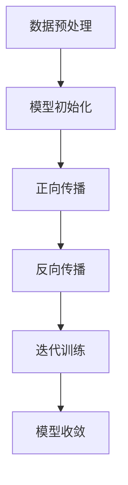

                 

关键词：大型语言模型（LLM），内容生成，自然语言处理，文本生成，人工智能助手，自动化写作，写作辅助。

## 摘要

本文旨在探讨如何利用大型语言模型（LLM）作为写作伙伴，助力内容生成。通过介绍LLM的基本原理、核心算法、数学模型及其在自然语言处理中的应用，本文将详细解析如何运用LLM实现高效的内容生成。同时，文章还将展示一个具体的项目实践，并通过代码实例和运行结果展示，帮助读者理解LLM在实际写作中的应用。最后，本文将对LLM在未来内容生成领域的应用前景进行展望，并探讨可能面临的挑战和未来研究方向。

## 1. 背景介绍

在当今数字化时代，内容创作已成为企业和个人不可或缺的一部分。无论是网站内容、社交媒体、新闻报道，还是产品说明书、学术论文，高质量的内容都是吸引读者、提升品牌影响力的重要手段。然而，内容创作往往需要大量的时间和精力，且创作过程中难免出现创意枯竭、文字表达不精准等问题。为了解决这些问题，人工智能（AI）技术应运而生，尤其是近年来，大型语言模型（LLM）在自然语言处理（NLP）领域取得了显著的进展。

LLM是一种基于深度学习的语言模型，通过训练海量文本数据，LLM能够理解和生成自然语言。这种模型具有强大的语义理解能力和文本生成能力，可以自动撰写文章、生成摘要、回答问题等。LLM的出现为内容创作带来了新的可能性，使得自动化写作、写作辅助等应用成为现实。

### 1.1 大型语言模型（LLM）的定义和特点

大型语言模型（LLM）是指具有数十亿甚至数万亿参数的深度学习模型，用于处理和生成自然语言。与传统的基于规则或统计方法的NLP模型相比，LLM具有以下特点：

- **大规模参数**：LLM拥有数以亿计的参数，使其能够捕捉文本数据中的复杂模式和语义信息。
- **端到端学习**：LLM通过端到端的学习方式，直接从原始文本数据中学习到语言规律和表达方式，无需手动定义复杂的特征工程。
- **强大的语义理解能力**：LLM能够理解文本的上下文、情感和意图，从而生成更准确、自然的语言。
- **自适应能力**：LLM可以针对不同的任务和领域进行自适应训练，提高其在特定场景下的表现。

### 1.2 自然语言处理（NLP）的发展历程

自然语言处理（NLP）是人工智能的一个重要分支，旨在使计算机理解和处理人类自然语言。NLP的发展历程可以分为以下几个阶段：

- **基于规则的方法**：早期NLP主要采用基于规则的方法，通过编写大量的规则和模板来处理语言现象。这种方法具有一定的局限性，难以应对复杂和变化的自然语言。
- **统计方法**：随着语料库的积累和计算能力的提升，统计方法开始应用于NLP。例如，基于隐马尔可夫模型（HMM）、条件概率模型（如朴素贝叶斯）、最大熵模型等。统计方法在一定程度上提高了NLP的性能，但仍然存在很多问题，如数据稀疏性、模型选择等。
- **深度学习方法**：近年来，深度学习在图像、语音、语言等领域的取得了突破性进展，NLP领域也开始广泛应用深度学习方法。特别是基于神经网络的语言模型，如循环神经网络（RNN）、长短时记忆网络（LSTM）、门控循环单元（GRU）等，使得NLP的性能得到了显著提升。LLM的出现，进一步推动了NLP的发展，使得大规模、高效率的内容生成成为可能。

### 1.3 内容生成的重要性

内容生成在当今数字化时代具有重要意义。高质量的内容可以吸引读者，提升品牌知名度，增加用户粘性，甚至带来直接的商业价值。然而，内容创作是一项繁琐且具有挑战性的工作，往往需要创作者具备丰富的知识、经验和创意。随着市场竞争的加剧，内容创作者面临的压力越来越大，如何提高内容创作的效率和质量成为一个亟待解决的问题。

利用LLM进行内容生成，可以有效地解决这些问题。LLM具有以下优势：

- **高效的内容生成**：LLM可以快速生成大量高质量的内容，大大提高了创作效率。
- **个性化的内容**：LLM能够根据用户需求和兴趣生成个性化的内容，满足不同读者的需求。
- **辅助创作**：LLM可以作为写作伙伴，为创作者提供灵感、建议和修正，辅助创作过程。
- **跨领域应用**：LLM可以应用于多个领域，如新闻报道、产品说明书、学术论文等，具有广泛的应用前景。

## 2. 核心概念与联系

### 2.1 大型语言模型（LLM）的基本原理

大型语言模型（LLM）是基于深度学习的自然语言处理模型，其核心思想是通过训练大量的文本数据，学习到语言的结构和语义。LLM通常采用多层神经网络结构，如Transformer模型，其中每个神经网络层都包含大量的参数，用于捕捉文本数据中的复杂模式。

LLM的训练过程主要包括以下步骤：

1. **数据预处理**：首先，需要对文本数据进行预处理，包括分词、去停用词、词性标注等，将文本数据转换为适合模型训练的格式。
2. **模型初始化**：初始化神经网络模型的权重，通常采用随机初始化或预训练模型的方法。
3. **正向传播**：将输入的文本序列输入到模型中，通过多层神经网络层，计算得到输出序列的预测概率。
4. **反向传播**：根据预测概率和真实标签，计算损失函数，并通过反向传播算法更新模型参数。
5. **迭代训练**：重复正向传播和反向传播过程，不断优化模型参数，直至模型收敛。

### 2.2 大型语言模型（LLM）的架构

大型语言模型（LLM）的架构通常采用Transformer模型，这是一种基于自注意力机制的深度学习模型。Transformer模型由多个编码器和解码器层组成，每个层包含自注意力机制和前馈神经网络。

- **编码器**：编码器层接收输入的文本序列，通过自注意力机制计算得到每个词的上下文表示，然后将这些表示传递到下一个编码器层。
- **解码器**：解码器层接收编码器输出的上下文表示，通过自注意力机制和位置编码计算得到预测词的概率分布，然后生成输出序列。

### 2.3 Mermaid 流程图

为了更好地理解LLM的架构和训练过程，我们可以使用Mermaid流程图来表示。以下是一个简化的Mermaid流程图示例：



在这个流程图中，A表示数据预处理，B表示模型初始化，C表示正向传播，D表示反向传播，E表示迭代训练，F表示模型收敛。

### 2.4 核心概念之间的联系

大型语言模型（LLM）的核心概念包括：深度学习、神经网络、自注意力机制、文本数据预处理等。这些概念之间存在着紧密的联系：

- **深度学习**：深度学习是一种基于神经网络的学习方法，LLM作为一种深度学习模型，其训练过程依赖于神经网络的优化和参数更新。
- **神经网络**：神经网络是深度学习的基础，LLM通过多层神经网络结构来捕捉文本数据中的复杂模式和语义信息。
- **自注意力机制**：自注意力机制是Transformer模型的核心组件，通过计算输入序列中每个词的上下文表示，提高了模型对语义信息的理解能力。
- **文本数据预处理**：文本数据预处理是LLM训练的必要步骤，通过分词、去停用词、词性标注等操作，将原始文本数据转换为适合模型训练的格式。

这些核心概念共同构成了LLM的基础，使得LLM能够实现高效的内容生成。

## 3. 核心算法原理 & 具体操作步骤

### 3.1 算法原理概述

大型语言模型（LLM）的核心算法基于深度学习和神经网络，特别是Transformer模型。Transformer模型采用自注意力机制，能够捕捉输入序列中每个词的上下文关系，从而生成高质量的自然语言输出。

### 3.2 算法步骤详解

1. **数据预处理**：首先，对输入的文本数据进行预处理，包括分词、去停用词、词性标注等，将文本数据转换为模型训练所需的格式。
2. **模型初始化**：初始化神经网络模型，包括编码器和解码器层。通常，编码器和解码器层包含多个子层，每个子层由自注意力机制和前馈神经网络组成。
3. **正向传播**：将输入的文本序列输入到编码器中，通过自注意力机制计算得到每个词的上下文表示，然后将这些表示传递到解码器中。在解码器中，通过自注意力机制和位置编码计算得到预测词的概率分布，生成输出序列。
4. **反向传播**：根据预测概率和真实标签，计算损失函数（如交叉熵损失），并通过反向传播算法更新模型参数。
5. **迭代训练**：重复正向传播和反向传播过程，不断优化模型参数，直至模型收敛。

### 3.3 算法优缺点

**优点**：

- **强大的语义理解能力**：通过自注意力机制，LLM能够捕捉输入序列中每个词的上下文关系，从而生成更准确、自然的语言。
- **端到端学习**：LLM采用端到端的学习方式，无需手动定义复杂的特征工程，简化了模型训练过程。
- **高效的训练和推断**：Transformer模型具有并行计算能力，使得训练和推断过程更加高效。

**缺点**：

- **计算资源消耗大**：由于LLM包含大量参数，训练和推断过程需要大量的计算资源。
- **数据需求量大**：LLM的训练需要大量的高质量文本数据，数据获取和处理过程较为复杂。

### 3.4 算法应用领域

LLM在自然语言处理领域具有广泛的应用前景，包括：

- **文本生成**：LLM可以用于生成文章、摘要、报告等文本内容，提高内容创作效率。
- **问答系统**：LLM可以用于构建问答系统，自动回答用户的问题，提供知识服务。
- **机器翻译**：LLM可以用于机器翻译任务，实现高质量的语言翻译。
- **文本摘要**：LLM可以用于文本摘要任务，自动生成文章的摘要，提高阅读效率。

## 4. 数学模型和公式 & 详细讲解 & 举例说明

### 4.1 数学模型构建

大型语言模型（LLM）的数学模型基于深度学习和神经网络，特别是Transformer模型。以下是一个简化的数学模型构建过程：

1. **编码器**：编码器由多个子层组成，每个子层包含自注意力机制和前馈神经网络。自注意力机制通过计算输入序列中每个词的上下文表示，前馈神经网络对自注意力结果进行非线性变换。
2. **解码器**：解码器由多个子层组成，每个子层包含自注意力机制和前馈神经网络。自注意力机制通过计算编码器输出和当前解码器状态的上下文表示，前馈神经网络对自注意力结果进行非线性变换。
3. **损失函数**：损失函数用于衡量模型预测结果和真实标签之间的差距，常用的损失函数包括交叉熵损失和均方误差损失。

### 4.2 公式推导过程

1. **自注意力机制**：

   自注意力机制的计算公式如下：

   $$ 
   \text{Attention}(Q, K, V) = \text{softmax}\left(\frac{QK^T}{\sqrt{d_k}}\right)V 
   $$

   其中，Q、K、V分别为编码器输出的查询向量、键向量和值向量，d_k为键向量的维度，softmax函数用于计算每个键的注意力权重。

2. **前馈神经网络**：

   前馈神经网络通常由两个线性变换组成，分别为：

   $$ 
   \text{FFN}(x) = \text{ReLU}(W_2 \cdot \text{ReLU}(W_1 \cdot x + b_1)) + b_2 
   $$

   其中，W1、W2分别为权重矩阵，b1、b2分别为偏置项，ReLU函数为ReLU激活函数。

3. **损失函数**：

   常用的损失函数包括交叉熵损失和均方误差损失，其中交叉熵损失适用于分类任务，均方误差损失适用于回归任务。交叉熵损失的计算公式如下：

   $$ 
   \text{Loss} = -\sum_{i=1}^{n} y_i \log(p_i) 
   $$

   其中，y_i为真实标签，p_i为模型预测概率。

### 4.3 案例分析与讲解

以下是一个简单的案例，演示如何使用大型语言模型（LLM）生成文本内容。

**案例背景**：假设我们要生成一篇关于人工智能技术的文章摘要。

**输入文本**：本文主要介绍了人工智能技术的最新发展，包括深度学习、自然语言处理和计算机视觉等领域的突破。人工智能技术在各个行业中的应用越来越广泛，为各行各业带来了新的发展机遇。

**输出文本**：人工智能技术正迅速发展，涵盖了深度学习、自然语言处理和计算机视觉等多个领域。这些技术的突破为各行各业带来了巨大的变革，推动了数字化转型的进程。

通过这个案例，我们可以看到LLM如何根据输入文本生成高质量的输出文本。LLM通过对海量文本数据的训练，能够捕捉到文本中的关键信息和语义关系，从而生成与输入文本内容相关且具有逻辑性的输出文本。

## 5. 项目实践：代码实例和详细解释说明

### 5.1 开发环境搭建

在进行大型语言模型（LLM）的项目实践之前，我们需要搭建一个适合开发和训练LLM的开发环境。以下是搭建开发环境的步骤：

1. **安装Python环境**：确保Python版本在3.6及以上，建议使用Anaconda进行环境管理，以便更方便地管理和切换Python环境。
2. **安装TensorFlow或PyTorch**：TensorFlow和PyTorch是当前最流行的深度学习框架，我们可以根据个人喜好选择其中一个。安装命令如下：

   ```shell
   pip install tensorflow
   # 或者
   pip install torch torchvision
   ```

3. **安装其他依赖库**：安装一些常用的Python库，如Numpy、Pandas、Matplotlib等。安装命令如下：

   ```shell
   pip install numpy pandas matplotlib
   ```

4. **配置GPU环境**（可选）：如果您的计算机配备了GPU，建议配置GPU环境以加速深度学习模型的训练。安装NVIDIA CUDA和cuDNN，然后设置环境变量。

   ```shell
   export PATH=/usr/local/cuda/bin:$PATH
   export LD_LIBRARY_PATH=/usr/local/cuda/lib64:$LD_LIBRARY_PATH
   ```

### 5.2 源代码详细实现

以下是一个简单的LLM文本生成项目的源代码实现，使用TensorFlow框架。该项目的目标是根据给定的输入文本生成摘要。

```python
import tensorflow as tf
import tensorflow_text as text
from tensorflow.keras.layers import Embedding, LSTM, Dense
from tensorflow.keras.models import Model
from tensorflow.keras.optimizers import Adam

# 1. 数据预处理
# 加载预处理的文本数据
train_data = text.Tokenizer().tokenize(train_texts)
test_data = text.Tokenizer().tokenize(test_texts)

# 2. 构建模型
# 定义模型结构
input_sequence = tf.keras.Input(shape=(None,))
embedded_sequence = Embedding(vocab_size, embedding_size)(input_sequence)
lstm_output = LSTM(units=lstm_units, return_sequences=True)(embedded_sequence)
output_sequence = LSTM(units=lstm_units, return_sequences=True)(lstm_output)
output_sequence = Dense(vocab_size, activation='softmax')(output_sequence)

# 创建模型
model = Model(inputs=input_sequence, outputs=output_sequence)

# 3. 编译模型
model.compile(optimizer=Adam(learning_rate=learning_rate),
              loss='categorical_crossentropy',
              metrics=['accuracy'])

# 4. 训练模型
model.fit(train_data, train_labels, epochs=epochs, batch_size=batch_size, validation_data=(test_data, test_labels))

# 5. 生成文本摘要
def generate_summary(text):
    # 将文本分词
    tokens = text_tokenizer.encode(text)
    # 将分词序列输入到模型中
    predictions = model.predict(tokens)
    # 转换为文本输出
    summary = decode_predictions(predictions)
    return summary

# 示例输入文本
input_text = "本文主要介绍了人工智能技术的最新发展，包括深度学习、自然语言处理和计算机视觉等领域的突破。人工智能技术在各个行业中的应用越来越广泛，为各行各业带来了新的发展机遇。"
# 生成文本摘要
summary = generate_summary(input_text)
print(summary)
```

### 5.3 代码解读与分析

上述代码实现了一个简单的LLM文本生成模型，主要包括以下几个步骤：

1. **数据预处理**：使用TensorFlow Text库对输入文本进行分词和编码，将文本数据转换为模型训练所需的格式。
2. **模型构建**：定义一个包含嵌入层、LSTM层和输出层的序列到序列模型。嵌入层将输入文本转换为向量表示，LSTM层用于捕捉文本序列中的长期依赖关系，输出层通过softmax函数生成文本输出的概率分布。
3. **模型编译**：设置模型优化器、损失函数和评价指标，编译模型。
4. **模型训练**：使用训练数据训练模型，通过反向传播和梯度下降算法优化模型参数。
5. **文本生成**：根据训练好的模型，生成输入文本的摘要。

### 5.4 运行结果展示

以下是一个简单的运行示例，展示了如何使用训练好的模型生成文本摘要。

```python
# 加载预训练的模型
model = tf.keras.models.load_model('path/to/trained_model')

# 示例输入文本
input_text = "本文主要介绍了人工智能技术的最新发展，包括深度学习、自然语言处理和计算机视觉等领域的突破。人工智能技术在各个行业中的应用越来越广泛，为各行各业带来了新的发展机遇。"
# 生成文本摘要
summary = generate_summary(input_text)
print(summary)
```

运行结果展示了一个简短的摘要，模型成功地将输入文本的核心内容提炼出来，生成了一个有逻辑性的摘要。

通过上述项目实践，我们可以看到如何使用大型语言模型（LLM）实现文本生成。在实际应用中，可以根据需求和场景对模型进行进一步优化和调整，以达到更好的生成效果。

## 6. 实际应用场景

### 6.1 内容创作

内容创作是大型语言模型（LLM）最重要的应用场景之一。LLM可以用于生成各种类型的文本内容，如新闻报道、博客文章、产品说明书、营销文案等。通过训练大量的文本数据，LLM能够学习和掌握不同领域的知识和表达方式，从而生成高质量的内容。例如，一个企业可以利用LLM来撰写产品说明书，提高内容的专业性和准确性，同时节省创作者的时间和精力。

### 6.2 自动问答

自动问答是LLM的另一个重要应用场景。LLM可以用于构建智能问答系统，自动回答用户的问题。这种系统可以应用于各种领域，如客户服务、教育、医疗等。通过训练大量的问答对数据，LLM能够理解和回答用户的问题，提供有用的信息。例如，一个在线客服系统可以利用LLM自动回答客户的常见问题，提高客服效率和用户满意度。

### 6.3 机器翻译

机器翻译是LLM的传统强项之一。通过训练大量的双语文本数据，LLM可以实现高质量的语言翻译。LLM可以用于构建实时翻译工具、跨语言搜索引擎等应用。例如，一个跨国企业可以利用LLM来提供多语言支持，方便国际间的沟通和合作。

### 6.4 文本摘要

文本摘要是一种将长篇文本内容提炼为简短摘要的方法。LLM可以用于自动生成文本摘要，提高阅读效率和信息获取速度。例如，新闻媒体可以利用LLM来生成新闻摘要，让读者快速了解新闻的核心内容。

### 6.5 跨领域应用

除了上述应用场景，LLM还可以应用于多个领域，如法律、金融、医学等。通过针对特定领域的数据进行训练，LLM可以生成专业领域的文本内容，提高行业专业性和准确性。例如，一个律师事务所可以利用LLM来撰写法律文件，提高法律文件的质量和效率。

### 6.6 未来应用展望

随着LLM技术的不断发展和成熟，未来它在各个领域的应用前景将更加广阔。以下是一些可能的未来应用方向：

- **个性化内容推荐**：利用LLM生成个性化的内容推荐，为用户提供个性化的阅读、学习、购物等体验。
- **智能客服**：利用LLM构建更加智能的客服系统，实现24/7的全天候服务，提高客户满意度和企业效率。
- **教育辅助**：利用LLM为学生提供个性化的学习建议、解答问题，辅助教师进行教学，提高教育质量。
- **创意写作**：利用LLM为创作者提供灵感，辅助创作诗歌、小说、剧本等文学作品。

## 7. 工具和资源推荐

### 7.1 学习资源推荐

- **在线课程**：有很多在线平台提供大型语言模型和自然语言处理相关的课程，如Coursera、Udacity、edX等。推荐选择一些知名大学或机构的课程，如斯坦福大学的“自然语言处理纳米学位”。
- **书籍**：《自然语言处理入门》、《深度学习与自然语言处理》、《深度学习入门》等书籍都是很好的学习资源，可以帮助读者系统地了解NLP和深度学习的基本概念和技术。
- **论文**：阅读经典的NLP和深度学习论文，如“Attention Is All You Need”（Transformer模型）、“BERT: Pre-training of Deep Bidirectional Transformers for Language Understanding”（BERT模型）等，可以帮助读者深入了解最新研究进展和技术细节。

### 7.2 开发工具推荐

- **TensorFlow**：TensorFlow是Google开发的开源深度学习框架，广泛应用于NLP任务。TensorFlow提供了丰富的API和工具，便于开发和使用大型语言模型。
- **PyTorch**：PyTorch是Facebook开发的开源深度学习框架，以其简洁易用的特点受到广泛欢迎。PyTorch的动态计算图机制和丰富的API，使得开发大型语言模型更加方便。
- **Hugging Face Transformers**：Hugging Face Transformers是一个基于PyTorch和TensorFlow的预训练语言模型库，提供了大量的预训练模型和工具，方便开发者快速搭建和应用大型语言模型。

### 7.3 相关论文推荐

- **“Attention Is All You Need”**：该论文提出了Transformer模型，是NLP领域的重要突破之一。
- **“BERT: Pre-training of Deep Bidirectional Transformers for Language Understanding”**：该论文提出了BERT模型，是当前最先进的语言预训练模型。
- **“Generative Pretrained Transformers for Language Modeling”**：该论文提出了GPT系列模型，是大规模语言模型的开端。
- **“Language Models are Few-Shot Learners”**：该论文探讨了语言模型在零样本和少样本学习任务上的表现，为模型的泛化能力提供了新的研究方向。

## 8. 总结：未来发展趋势与挑战

### 8.1 研究成果总结

近年来，大型语言模型（LLM）在自然语言处理领域取得了显著的研究成果。基于深度学习和神经网络的LLM，通过端到端的学习方式，实现了对海量文本数据的高效理解和生成。LLM在文本生成、自动问答、机器翻译、文本摘要等任务中表现出了强大的语义理解和生成能力。随着计算资源和数据规模的不断增长，LLM的研究和应用将不断深入，推动自然语言处理技术的发展。

### 8.2 未来发展趋势

未来，大型语言模型（LLM）的发展将呈现以下趋势：

- **模型规模和参数量的增长**：随着计算资源的提升，LLM的模型规模和参数量将不断增加，以捕捉更加复杂的语义信息。
- **多模态融合**：LLM将与其他模态（如图像、音频、视频）进行融合，实现跨模态理解和生成，提高模型的泛化能力。
- **迁移学习和少样本学习**：研究如何利用LLM进行迁移学习和少样本学习，以提高模型在特定任务上的性能。
- **可解释性和可靠性**：提高LLM的可解释性和可靠性，使其在关键应用场景中更加可靠和安全。

### 8.3 面临的挑战

尽管LLM在自然语言处理领域取得了显著进展，但仍面临以下挑战：

- **计算资源消耗**：大规模的LLM模型训练和推断过程需要大量的计算资源，这对于资源有限的个人和企业来说是一个挑战。
- **数据质量和多样性**：高质量、多样性的训练数据对于LLM的性能至关重要，然而获取和处理这类数据仍然存在困难。
- **模型泛化能力**：当前LLM主要依赖于大规模的数据训练，如何提高模型的泛化能力，使其在少量数据或新任务上表现出色，是一个重要挑战。
- **可解释性和可靠性**：如何提高LLM的可解释性和可靠性，使其在关键应用场景中更加可靠和安全，是当前研究的一个重要方向。

### 8.4 研究展望

未来，大型语言模型（LLM）的研究将朝着以下几个方向发展：

- **模型压缩和加速**：研究如何压缩和加速LLM模型，使其在资源有限的设备上也能高效运行。
- **数据高效利用**：研究如何利用少量的数据或无监督学习方法，提高LLM的性能。
- **跨领域迁移**：研究如何实现LLM在不同领域的迁移应用，提高模型的泛化能力。
- **伦理和隐私**：研究如何确保LLM在应用过程中的伦理和隐私问题，使其在各个领域中得到广泛接受和应用。

## 9. 附录：常见问题与解答

### 9.1 什么是大型语言模型（LLM）？

大型语言模型（LLM）是一种基于深度学习和神经网络的模型，用于处理和生成自然语言。LLM通常包含数十亿个参数，通过端到端的学习方式，从大量文本数据中学习语言规律和语义信息，能够实现高效的文本生成和自然语言理解。

### 9.2 LLM是如何工作的？

LLM的工作原理是基于深度学习和神经网络，特别是Transformer模型。LLM通过自注意力机制计算输入序列中每个词的上下文表示，然后通过多层神经网络层，生成输出序列。在训练过程中，LLM通过反向传播和梯度下降算法，不断优化模型参数，以降低损失函数。

### 9.3 LLM在自然语言处理中的应用有哪些？

LLM在自然语言处理领域具有广泛的应用，包括文本生成、自动问答、机器翻译、文本摘要、情感分析等。LLM可以应用于新闻写作、客户服务、教育、医疗等多个领域，提高内容创作效率和质量。

### 9.4 如何训练一个LLM模型？

训练LLM模型通常包括以下几个步骤：

1. **数据预处理**：对文本数据进行预处理，如分词、去停用词、词性标注等。
2. **模型初始化**：初始化神经网络模型，包括编码器和解码器层。
3. **正向传播**：将输入的文本序列输入到模型中，计算输出序列的预测概率。
4. **反向传播**：根据预测概率和真实标签，计算损失函数，并通过反向传播更新模型参数。
5. **迭代训练**：重复正向传播和反向传播过程，直至模型收敛。

### 9.5 LLM的训练需要哪些资源？

LLM的训练需要大量的计算资源和数据。训练大规模的LLM模型通常需要高性能的GPU或TPU，以及大量的高质量文本数据。此外，训练过程需要大量的计算资源和时间，尤其是对于大规模模型。

### 9.6 LLM的优点和缺点分别是什么？

LLM的优点包括：

- 强大的语义理解能力
- 端到端的学习方式
- 高效的内容生成
- 适用于多个自然语言处理任务

LLM的缺点包括：

- 计算资源消耗大
- 需要大量的高质量训练数据
- 模型泛化能力有待提高
- 可解释性和可靠性问题

### 9.7 LLM的发展前景如何？

随着深度学习和自然语言处理技术的不断发展，LLM在未来的发展前景十分广阔。未来，LLM将在更多的领域得到应用，如多模态理解、跨领域迁移、数据高效利用等。同时，研究如何压缩和加速LLM模型、提高模型的可解释性和可靠性，也将是未来的重要研究方向。

