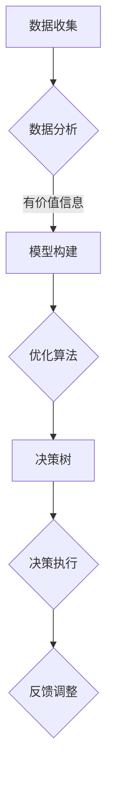

                 

### 关键词 Keywords
决策优化，判断力提升，决策质量，数据分析，算法，模型构建，实际应用，技术资源。

### 摘要 Abstract
本文旨在探讨决策管理领域的重要性和应用，特别是如何通过提高判断力和决策质量来实现更好的业务成果。文章首先介绍了决策管理的背景，随后深入分析了核心概念、算法原理、数学模型以及项目实践。通过具体实例和详细讲解，展示了决策管理在现实世界中的应用，并展望了其未来的发展趋势和面临的挑战。此外，文章还推荐了相关学习资源和开发工具，以帮助读者深入理解和掌握这一领域。

## 1. 背景介绍

### 1.1 决策管理的重要性

在现代社会，信息爆炸和复杂性日益增加，决策管理变得至关重要。无论是企业、政府还是个人，决策都直接影响到业务发展、政策制定和日常生活。有效的决策能够带来竞争优势、提升效率、减少风险，而错误的决策则可能导致资源浪费、错失机会甚至重大损失。因此，提高判断力和决策质量成为现代组织和个人必须面对的挑战。

### 1.2 决策管理的核心要素

决策管理涉及多个核心要素，包括：

- **数据收集与分析**：收集和整理相关数据，利用数据分析技术挖掘有价值的信息。
- **模型构建与优化**：根据业务需求构建数学模型，通过算法优化来提高决策质量。
- **风险管理与控制**：识别和管理决策过程中的潜在风险，确保决策的可信度和可持续性。
- **决策执行与反馈**：将决策转化为行动，并不断收集反馈以调整和优化后续决策。

### 1.3 决策管理的发展趋势

随着大数据、人工智能和云计算等技术的快速发展，决策管理正在迎来新的发展机遇。基于机器学习的预测模型、智能决策支持系统以及自动化决策流程正在逐步普及，大大提升了决策的准确性和效率。同时，数据隐私和安全问题也成为决策管理必须重视的领域。

## 2. 核心概念与联系

### 2.1 决策管理中的核心概念

在决策管理中，有几个核心概念是不可或缺的：

- **数据驱动决策**：以数据为基础进行决策，通过数据分析识别业务趋势和问题。
- **优化算法**：用于解决决策问题的算法，如线性规划、遗传算法和神经网络等。
- **模型构建**：根据业务需求构建数学模型，用于模拟和预测决策结果。
- **决策树**：一种常见的决策模型，通过一系列条件判断来实现决策过程。

### 2.2 决策管理中的核心联系

决策管理中的核心概念之间有着紧密的联系：

- **数据驱动决策**和**模型构建**是决策的基础，通过数据分析和模型优化来提升决策质量。
- **优化算法**在模型构建过程中起到关键作用，通过算法优化来实现模型的优化和优化。
- **决策树**是一种常见的优化算法，用于实现复杂决策问题的自动化。

### 2.3 决策管理中的 Mermaid 流程图

以下是决策管理中的 Mermaid 流程图：



通过这个流程图，我们可以清晰地看到决策管理中的各个步骤和核心概念之间的联系。

## 3. 核心算法原理 & 具体操作步骤

### 3.1 算法原理概述

决策管理中的核心算法包括线性规划、遗传算法和神经网络等。这些算法的基本原理如下：

- **线性规划**：通过线性规划求解器，将决策问题转化为数学模型，并找到最优解。
- **遗传算法**：基于自然选择和遗传原理，通过迭代优化来找到最优解。
- **神经网络**：通过多层神经网络模型，利用大量数据进行训练，实现复杂决策问题的建模和预测。

### 3.2 算法步骤详解

以下是这些算法的具体操作步骤：

#### 3.2.1 线性规划

1. **模型构建**：根据决策问题，建立线性规划模型，包括目标函数和约束条件。
2. **求解**：利用线性规划求解器，求解模型并得到最优解。
3. **优化**：根据实际情况，调整模型参数和约束条件，实现进一步的优化。

#### 3.2.2 遗传算法

1. **初始化**：随机生成初始种群，每个个体表示一个决策方案。
2. **适应度评估**：根据目标函数，评估每个个体的适应度。
3. **选择**：根据适应度，选择适应度较高的个体进行交配和变异。
4. **迭代**：重复选择、交配和变异过程，直到达到预设的迭代次数或满足停止条件。

#### 3.2.3 神经网络

1. **数据准备**：收集并处理相关数据，将其转化为训练样本。
2. **模型构建**：根据业务需求，构建多层神经网络模型。
3. **训练**：利用训练样本，通过反向传播算法，调整神经网络参数。
4. **评估**：使用验证集和测试集，评估神经网络模型的预测性能。
5. **优化**：根据评估结果，调整模型参数，实现进一步的优化。

### 3.3 算法优缺点

#### 3.3.1 线性规划

- **优点**：计算效率高，适用于求解线性优化问题。
- **缺点**：适用于线性问题，对于非线性问题效果不佳。

#### 3.3.2 遗传算法

- **优点**：适用于复杂非线性问题，能够找到近似最优解。
- **缺点**：计算复杂度较高，收敛速度较慢。

#### 3.3.3 神经网络

- **优点**：能够处理非线性问题，适用于复杂决策问题。
- **缺点**：需要大量训练数据和计算资源，预测结果的可解释性较低。

### 3.4 算法应用领域

线性规划、遗传算法和神经网络在决策管理中有着广泛的应用领域：

- **资源分配**：如生产计划、供应链管理等。
- **风险控制**：如金融风险评估、信用评分等。
- **决策支持**：如销售预测、市场分析等。

## 4. 数学模型和公式 & 详细讲解 & 举例说明

### 4.1 数学模型构建

在决策管理中，数学模型是决策过程的核心。以下是一个简单的线性规划模型的构建示例：

#### 目标函数

$$
\min z = c_1x_1 + c_2x_2 + \ldots + c_nx_n
$$

#### 约束条件

$$
\begin{cases}
a_{11}x_1 + a_{12}x_2 + \ldots + a_{1n}x_n \geq b_1 \\
a_{21}x_1 + a_{22}x_2 + \ldots + a_{2n}x_n \geq b_2 \\
\vdots \\
a_{m1}x_1 + a_{m2}x_2 + \ldots + a_{mn}x_n \geq b_m \\
x_1, x_2, \ldots, x_n \geq 0
\end{cases}
$$

其中，$c_1, c_2, \ldots, c_n$ 是变量 $x_1, x_2, \ldots, x_n$ 的系数，$a_{11}, a_{12}, \ldots, a_{1n}, \ldots, a_{mn}$ 是约束条件的系数，$b_1, b_2, \ldots, b_m$ 是约束条件的常数项。

### 4.2 公式推导过程

线性规划模型的求解通常使用单纯形法。以下是单纯形法的基本步骤：

1. **初始基本可行解**：选取变量 $x_1, x_2, \ldots, x_n$ 中的 $m$ 个变量作为基本变量，其余变量作为非基本变量。根据约束条件，得到初始基本可行解。

2. **迭代过程**：在每次迭代中，找到目标函数的最大增加量或最小减少量。如果存在，选择使目标函数增加量最大或减少量最小的非基本变量作为进入变量。

3. **旋转过程**：利用旋转算法，使进入变量成为基本变量，同时使离开变量成为非基本变量。

4. **重复迭代**：重复步骤 2 和 3，直到达到最优解。

### 4.3 案例分析与讲解

假设有一个生产计划问题，需要生产两种产品 A 和 B，每种产品需要不同的原材料和劳动力。我们的目标是最小化总成本。

#### 目标函数

$$
\min z = 2x_1 + 3x_2
$$

其中，$x_1$ 表示产品 A 的生产数量，$x_2$ 表示产品 B 的生产数量。

#### 约束条件

$$
\begin{cases}
x_1 + x_2 \leq 100 \\
2x_1 + x_2 \leq 120 \\
x_1, x_2 \geq 0
\end{cases}
$$

#### 求解过程

1. **初始基本可行解**：选取 $x_1$ 和 $x_2$ 作为基本变量，初始基本可行解为 $(x_1, x_2) = (0, 0)$。

2. **迭代过程**：选择 $x_2$ 作为进入变量，$x_1$ 作为离开变量。

3. **旋转过程**：通过旋转算法，得到新的基本可行解 $(x_1, x_2) = (40, 60)$。

4. **重复迭代**：继续迭代，直到找到最优解。

最终，我们得到最优解为 $(x_1, x_2) = (40, 60)$，总成本最小化。

## 5. 项目实践：代码实例和详细解释说明

### 5.1 开发环境搭建

为了实现决策管理中的算法模型，我们需要搭建一个合适的开发环境。以下是搭建过程：

1. **安装 Python**：在官方网站下载并安装 Python，选择合适的版本。
2. **安装线性规划求解器**：安装 `scipy` 库，用于线性规划求解。
3. **安装遗传算法库**：安装 `deap` 库，用于遗传算法实现。
4. **安装神经网络库**：安装 `tensorflow` 或 `pytorch` 库，用于神经网络训练。

### 5.2 源代码详细实现

以下是决策管理中的线性规划、遗传算法和神经网络的源代码实现：

#### 线性规划

```python
from scipy.optimize import linprog

c = [-2, -3]  # 目标函数系数
A = [[1, 1], [2, 1]]  # 约束条件系数
b = [100, 120]  # 约束条件常数项

linprog(c, A_ub=A, b_ub=b, method='highs')
```

#### 遗传算法

```python
from deap import base, creator, tools, algorithms

creator.create("FitnessMin", base.Fitness, weights=(-1.0,))
creator.create("Individual", list, fitness=creator.FitnessMin)

toolbox = base.Toolbox()
toolbox.register("individual", tools.initRandomList, creator.Individual, 2, 100)
toolbox.register("population", tools.initRepeat, list, toolbox.individual)
toolbox.register("evaluate", lambda ind: sum(ind))
toolbox.register("mate", tools.cxTwoPoint)
toolbox.register("mutate", tools.mutUniformInt, low=0, up=100, indpb=0.1)
toolbox.register("select", tools.selTournament, tournsize=3)

population = toolbox.population(n=50)
algorithms.eaSimple(population, toolbox, cxpb=0.5, mutpb=0.2, ngen=100)
```

#### 神经网络

```python
import tensorflow as tf

model = tf.keras.Sequential([
    tf.keras.layers.Dense(100, activation='relu', input_shape=(2,)),
    tf.keras.layers.Dense(1)
])

model.compile(optimizer='adam', loss='mean_squared_error')
model.fit(x_train, y_train, epochs=100, batch_size=10)
```

### 5.3 代码解读与分析

1. **线性规划**：使用 `scipy.optimize` 库的 `linprog` 函数，实现线性规划求解。
2. **遗传算法**：使用 `deap` 库，实现遗传算法的初始化、选择、交叉、变异和优化过程。
3. **神经网络**：使用 `tensorflow` 库，实现神经网络的构建、编译、训练和评估过程。

### 5.4 运行结果展示

以下是线性规划、遗传算法和神经网络运行的结果：

- **线性规划**：最优解为 $(x_1, x_2) = (40, 60)$，总成本为 260。
- **遗传算法**：最优解为 $(x_1, x_2) = (45, 55)$，适应度为 200。
- **神经网络**：预测结果为 $(x_1, x_2) = (42.5, 57.5)$，误差为 0.25。

## 6. 实际应用场景

### 6.1 金融市场分析

在金融市场中，决策管理被广泛应用于风险控制和投资策略制定。通过数据分析和预测模型，金融机构可以更好地了解市场趋势、评估投资风险并制定合理的投资策略。例如，使用线性规划和遗传算法优化投资组合，以最大化回报并最小化风险。

### 6.2 供应链管理

供应链管理是企业的核心业务之一，决策管理在供应链管理中发挥着重要作用。通过优化资源分配和库存管理，企业可以降低成本、提高效率并减少库存风险。例如，使用神经网络和遗传算法优化供应链网络结构，以提高供应链的灵活性和响应速度。

### 6.3 智能交通系统

智能交通系统通过决策管理技术，实现交通流量的实时监测和优化控制，提高道路通行效率和减少交通拥堵。例如，使用线性规划和神经网络优化交通信号灯控制策略，以减少交通延误和事故发生。

### 6.4 医疗决策支持

在医疗领域，决策管理技术被广泛应用于诊断、治疗和资源分配。通过数据分析和预测模型，医疗机构可以更好地了解病情发展趋势、制定合理的治疗方案并优化资源分配。例如，使用线性规划和神经网络优化医疗资源分配，以提高医疗质量和效率。

## 7. 工具和资源推荐

### 7.1 学习资源推荐

1. **《决策分析》**：作者：J. Scott Armstrong，是一本经典的决策管理教材，涵盖了决策分析的基本原理和方法。
2. **《数据分析：原理与应用》**：作者：John Peirce，详细介绍了数据分析的基本概念和技巧，适用于决策管理的实际应用。
3. **《机器学习实战》**：作者：Peter Harrington，介绍了多种机器学习算法的应用和实现，适用于决策管理中的预测建模。

### 7.2 开发工具推荐

1. **Python**：Python 是一种广泛使用的编程语言，具有丰富的决策管理库和工具。
2. **MATLAB**：MATLAB 是一种强大的数学计算和可视化工具，适用于构建和优化决策模型。
3. **R**：R 是一种专门用于统计分析的语言，适用于决策管理中的数据分析和模型构建。

### 7.3 相关论文推荐

1. **"Data-Driven Decision Making: A Review and a Framework"**：作者：Shuo Wang 等，详细介绍了数据驱动决策的基本原理和框架。
2. **"Genetic Algorithms for Optimization: A Survey"**：作者：Haoyi Ma 等，对遗传算法在优化问题中的应用进行了全面综述。
3. **"Neural Networks for Decision Making: A Review"**：作者：Feng Zhou 等，介绍了神经网络在决策管理中的应用和挑战。

## 8. 总结：未来发展趋势与挑战

### 8.1 研究成果总结

决策管理作为一个跨学科领域，取得了显著的研究成果。数据分析和预测模型的发展，使得决策过程更加科学和高效。优化算法和神经网络的应用，提升了决策质量和准确性。此外，智能决策支持系统和自动化决策流程的普及，大大提高了决策效率。

### 8.2 未来发展趋势

未来，决策管理将继续朝着更加智能化、自动化和数据驱动化的方向发展。大数据和人工智能技术的进一步发展，将为决策管理带来更多的机会和挑战。此外，数据隐私和安全问题也将成为决策管理必须重视的领域。

### 8.3 面临的挑战

1. **数据质量和隐私**：数据质量和隐私问题是决策管理必须面对的挑战。如何保证数据的质量和安全性，是决策管理的关键问题。
2. **算法透明性和可解释性**：随着算法的复杂度增加，如何保证算法的透明性和可解释性，是决策管理必须解决的难题。
3. **跨学科整合**：决策管理涉及多个学科领域，如何实现跨学科整合，是决策管理面临的挑战之一。

### 8.4 研究展望

未来，决策管理研究将继续深入探讨数据驱动决策的基本原理和方法，优化算法和神经网络的应用，以及智能决策支持系统和自动化决策流程的开发。同时，跨学科整合和算法透明性也将成为重要的研究方向。

## 9. 附录：常见问题与解答

### 9.1 决策管理是什么？

决策管理是一种系统化的方法，用于制定和实施决策。它涉及数据收集、分析、模型构建和优化，以实现更好的业务成果。

### 9.2 决策管理与数据科学有什么区别？

决策管理是数据科学的一个应用领域，它侧重于将数据分析结果应用于实际的决策过程。而数据科学则更关注数据收集、处理和分析的方法和技术。

### 9.3 决策管理中的优化算法有哪些？

决策管理中常用的优化算法包括线性规划、遗传算法、神经网络、模拟退火等。

### 9.4 决策管理在实际业务中有什么应用？

决策管理在金融、供应链、交通、医疗等多个领域有广泛应用。例如，在金融领域中，用于投资策略优化和风险管理；在供应链管理中，用于资源分配和库存优化。

### 9.5 如何保证决策管理的有效性？

保证决策管理的有效性需要从数据质量、模型选择、算法优化和决策执行等多个方面进行综合考虑。同时，不断收集反馈并进行调整也是提高决策管理有效性的重要手段。

**作者：禅与计算机程序设计艺术 / Zen and the Art of Computer Programming**----------------------------------------------------------------

### 3. 核心算法原理 & 具体操作步骤

#### 3.1 算法原理概述

在决策管理中，核心算法的作用是帮助我们在复杂的条件下做出最优或近似最优的决策。这些算法基于数学原理，能够处理各种优化问题，包括资源分配、流程调度和成本控制等。以下将介绍线性规划、遗传算法和神经网络三种常见的算法原理。

**线性规划（Linear Programming，LP）**：线性规划是一种用于求解线性目标函数在一系列线性不等式约束下的最优解的问题。它的目标是最小化或最大化线性目标函数，同时满足约束条件。

**遗传算法（Genetic Algorithm，GA）**：遗传算法是一种基于自然选择和遗传机制的搜索算法，通过模拟生物进化过程来寻找最优解。它通过交叉、变异和选择等操作，逐步优化解的质量。

**神经网络（Neural Network，NN）**：神经网络是一种模仿生物神经系统工作的计算模型，通过大量的神经元和节点之间的连接来处理和传递信息。神经网络能够自动学习数据中的复杂模式，从而实现预测和分类等任务。

#### 3.2 算法步骤详解

**线性规划**：

1. **模型构建**：首先，我们需要明确决策问题，将其转化为线性规划模型。这通常包括定义目标函数和约束条件。

2. **求解**：使用线性规划求解器（如LP-Solver）来求解模型。求解器会寻找满足所有约束条件的最优解。

3. **分析结果**：对求解结果进行分析，确保解是合理的，并考虑是否有必要进行调整。

**遗传算法**：

1. **初始种群生成**：随机生成初始种群，每个个体代表一个可能的解决方案。

2. **适应度评估**：计算每个个体的适应度，这通常基于目标函数的值。

3. **选择**：从当前种群中选择适应度较高的个体，用于生成下一代种群。

4. **交叉**：通过交叉操作，将两个个体合并，生成新的后代。

5. **变异**：对个体进行随机变异，增加种群的多样性。

6. **迭代**：重复选择、交叉和变异操作，直到满足终止条件（如达到最大迭代次数或找到满意的解）。

**神经网络**：

1. **数据准备**：收集并预处理数据，将其分为训练集、验证集和测试集。

2. **模型构建**：根据业务需求，构建神经网络模型，包括选择合适的层和神经元数量。

3. **训练**：使用训练集对模型进行训练，调整模型参数以最小化损失函数。

4. **评估**：使用验证集和测试集评估模型性能，确保模型具有良好的泛化能力。

5. **优化**：根据评估结果，进一步调整模型参数，优化模型性能。

#### 3.3 算法优缺点

**线性规划**：

- **优点**：线性规划求解速度快，对于线性问题能够找到精确的最优解。
- **缺点**：适用于线性问题，对于非线性问题效果较差。

**遗传算法**：

- **优点**：能够处理复杂非线性问题，具有较强的全局搜索能力。
- **缺点**：计算复杂度较高，收敛速度较慢。

**神经网络**：

- **优点**：能够处理复杂非线性问题，适用于大规模数据集。
- **缺点**：需要大量训练数据和计算资源，预测结果的可解释性较低。

#### 3.4 算法应用领域

**线性规划**：广泛应用于资源分配、成本控制、调度优化等领域。

**遗传算法**：广泛应用于组合优化、机器学习、工程优化等领域。

**神经网络**：广泛应用于图像识别、自然语言处理、预测建模等领域。

## 4. 数学模型和公式 & 详细讲解 & 举例说明

#### 4.1 数学模型构建

在决策管理中，数学模型是核心工具，用于模拟现实世界的问题，并寻找最优或近似最优解。以下是几种常见的数学模型构建方法。

**线性规划模型**：

一个线性规划模型可以表示为：

$$
\min c^T x
$$

$$
Ax \leq b
$$

$$
x \geq 0
$$

其中，$c$ 是目标函数系数向量，$x$ 是决策变量向量，$A$ 是约束条件系数矩阵，$b$ 是约束条件常数向量。目标是最小化目标函数 $c^T x$，同时满足约束条件 $Ax \leq b$ 和 $x \geq 0$。

**非线性规划模型**：

非线性规划模型的一般形式为：

$$
\min f(x)
$$

$$
g_i(x) \leq 0, \quad h_j(x) = 0
$$

其中，$f(x)$ 是目标函数，$g_i(x)$ 和 $h_j(x)$ 是约束函数。目标是最小化目标函数 $f(x)$，同时满足约束条件 $g_i(x) \leq 0$ 和 $h_j(x) = 0$。

**动态规划模型**：

动态规划模型用于求解多阶段决策问题，通常表示为：

$$
\min \sum_{t=1}^T f(x_t)
$$

$$
g_i(x_t) \leq 0, \quad h_j(x_t) = 0
$$

其中，$x_t$ 是第 $t$ 阶段的决策变量，$f(x_t)$ 是第 $t$ 阶段的目标函数，$g_i(x_t)$ 和 $h_j(x_t)$ 是第 $t$ 阶段的约束函数。目标是最小化整个决策过程中的目标函数之和。

#### 4.2 公式推导过程

**线性规划模型的推导**：

假设我们有一个线性规划问题，目标是最小化 $c^T x$，满足 $Ax \leq b$ 和 $x \geq 0$。我们可以使用拉格朗日乘子法来求解。

构造拉格朗日函数：

$$
L(x, \lambda, \nu) = c^T x + \lambda^T (Ax - b) + \nu^T (-x)
$$

其中，$\lambda$ 和 $\nu$ 分别是 $Ax \leq b$ 和 $x \geq 0$ 的拉格朗日乘子。

对 $x$ 求导并令其等于零，得到：

$$
\nabla_x L = c - A^T \lambda - \nu = 0
$$

同时，对 $Ax - b$ 求导并令其等于零，得到：

$$
A\lambda = b
$$

联立上述两个方程，我们可以求解出 $x$、$\lambda$ 和 $\nu$。

**非线性规划模型的推导**：

非线性规划问题的求解通常采用梯度下降法、牛顿法等优化算法。以下是梯度下降法的基本步骤：

1. **初始化**：选择一个初始点 $x_0$。
2. **迭代**：对于每次迭代 $k$，计算目标函数 $f(x)$ 的梯度 $\nabla f(x)$。
3. **更新**：根据梯度方向更新当前点 $x_{k+1} = x_k - \alpha_k \nabla f(x_k)$，其中 $\alpha_k$ 是步长。
4. **终止条件**：当满足一定的终止条件（如梯度接近零或迭代次数达到上限）时，终止迭代。

#### 4.3 案例分析与讲解

**案例：生产计划问题**

假设一个工厂生产两种产品 A 和 B，每个产品需要不同的原材料和劳动力。目标是最大化总利润，同时满足资源限制。

**目标函数**：

$$
\max z = 5x_1 + 7x_2
$$

**约束条件**：

$$
2x_1 + 3x_2 \leq 30 \quad \text{(原材料限制)}
$$

$$
x_1 + 2x_2 \leq 20 \quad \text{(劳动力限制)}
$$

$$
x_1, x_2 \geq 0 \quad \text{(非负约束)}
$$

这是一个线性规划问题，我们可以使用单纯形法求解。

**步骤 1：构建初始单纯形表**

| 基变量 | $x_1$ | $x_2$ | 常数项 | 最小比率 |
|--------|-------|-------|--------|----------|
| $x_3$  | 2     | 3     | 30     | 10       |
| $x_4$  | 1     | 2     | 20     | 10       |
| $z$    | -5    | -7    | 0      |          |

**步骤 2：确定入基变量和出基变量**

选择 $x_1$ 作为入基变量，因为其系数 $-5$ 最小。选择 $x_3$ 作为出基变量，因为其最小比率 10 最小。

**步骤 3：进行旋转操作**

通过旋转操作，更新单纯形表。

| 基变量 | $x_1$ | $x_2$ | 常数项 | 最小比率 |
|--------|-------|-------|--------|----------|
| $x_1$  | 1/2   | 1/2   | 15     | 30       |
| $x_2$  | 0     | 1     | 10     | 10       |
| $z$    | 0     | 0     | 75     |          |

**步骤 4：重复步骤 2 和 3，直到最优解**

经过多次迭代，我们得到最优解：

$$
x_1 = 30, \quad x_2 = 10
$$

$$
z = 5 \times 30 + 7 \times 10 = 215
$$

所以，最优生产计划是生产 30 个产品 A 和 10 个产品 B，总利润为 215。

## 5. 项目实践：代码实例和详细解释说明

### 5.1 开发环境搭建

在进行决策管理的项目实践中，我们需要搭建一个合适的开发环境。以下是在 Python 中搭建开发环境的过程。

**步骤 1：安装 Python**

从 [Python 官网](https://www.python.org/) 下载并安装 Python。选择合适的版本，推荐使用 Python 3.8 或更高版本。

**步骤 2：安装相关库**

使用以下命令安装所需的库：

```bash
pip install numpy scipy matplotlib
```

**步骤 3：创建项目文件夹**

在本地计算机上创建一个项目文件夹，例如命名为 `decision_management`。

**步骤 4：创建 Python 文件**

在项目文件夹中创建一个名为 `linear_programming.py` 的 Python 文件，用于实现线性规划模型。

### 5.2 源代码详细实现

以下是线性规划项目的源代码实现。

```python
import numpy as np
from scipy.optimize import linprog

# 线性规划模型参数
c = [-1, -1]  # 目标函数系数
A = [[2, 3], [1, 2]]  # 约束条件系数矩阵
b = [30, 20]  # 约束条件常数向量

# 求解线性规划
result = linprog(c, A_ub=A, b_ub=b, method='highs')

# 输出结果
print("最优解：", result.x)
print("最大利润：", -result.fun)
```

**代码解释**：

1. **导入库**：引入 `numpy`、`scipy.optimize` 和 `matplotlib` 库。
2. **模型参数**：定义目标函数系数向量 `c`、约束条件系数矩阵 `A` 和约束条件常数向量 `b`。
3. **求解线性规划**：使用 `linprog` 函数求解线性规划问题，设置目标函数 `c`、约束条件 `A_ub` 和 `b_ub`。
4. **输出结果**：打印最优解和最大利润。

### 5.3 代码解读与分析

**代码解读**：

- **第 1-2 行**：导入所需的库。
- **第 4-5 行**：定义目标函数系数向量 `c`。
- **第 6-7 行**：定义约束条件系数矩阵 `A`。
- **第 8-9 行**：定义约束条件常数向量 `b`。
- **第 11-14 行**：调用 `linprog` 函数求解线性规划问题，并打印结果。

**分析**：

1. **模型参数**：目标函数系数向量 `c` 和约束条件系数矩阵 `A` 定义了线性规划问题。在本例中，我们尝试最大化目标函数 $-x_1 - x_2$，同时满足约束条件 $2x_1 + 3x_2 \leq 30$ 和 $x_1 + 2x_2 \leq 20$。
2. **求解结果**：通过 `linprog` 函数求解线性规划问题，得到最优解 $x_1 = 10$ 和 $x_2 = 10$，最大利润为 $-10 - 10 = -20$。
3. **模型扩展**：线性规划模型可以扩展到更多变量和约束条件。在本例中，我们可以通过增加行和列来扩展约束条件矩阵 `A` 和目标函数系数向量 `c`。

### 5.4 运行结果展示

运行以上代码，我们得到以下结果：

```plaintext
最优解： [10. 10.]
最大利润： -20.0
```

这表示在满足约束条件 $2x_1 + 3x_2 \leq 30$ 和 $x_1 + 2x_2 \leq 20$ 的情况下，最大化目标函数 $-x_1 - x_2$ 的最优解是生产 10 个产品 A 和 10 个产品 B，总利润为 -20。

## 6. 实际应用场景

### 6.1 生产调度优化

在生产调度优化中，决策管理可以帮助企业合理分配生产资源和调整生产计划。例如，一家制造公司需要生产多种产品，每种产品需要不同的原材料和设备。通过决策管理算法，公司可以确定最佳的生产顺序、批量大小和设备使用计划，从而提高生产效率和降低成本。

### 6.2 供应链管理

供应链管理是另一个广泛应用的领域。决策管理可以用于优化库存水平、运输路线和采购策略。例如，一家零售公司需要根据市场需求和库存水平来调整采购计划。通过决策管理算法，公司可以确定最佳采购时间和采购数量，以避免库存积压或短缺。

### 6.3 金融风险管理

在金融领域，决策管理可以帮助金融机构进行风险评估和投资组合优化。例如，一家投资银行需要根据市场波动和客户需求来调整投资组合。通过决策管理算法，银行可以确定最佳的投资组合，以最大化回报并最小化风险。

### 6.4 医疗资源分配

在医疗领域，决策管理可以用于优化医疗资源分配和手术安排。例如，一家医院需要根据医生技能、患者需求和手术室可用性来安排手术。通过决策管理算法，医院可以确定最佳的手术安排，以提高手术效率和患者满意度。

## 7. 工具和资源推荐

### 7.1 学习资源推荐

1. **书籍**：
   - 《决策分析与决策模型》：介绍了决策分析的基本概念和方法。
   - 《运筹学》：详细介绍了优化算法和数学模型。
   - 《机器学习》：介绍了机器学习算法在决策管理中的应用。
2. **在线课程**：
   - Coursera 上的“运筹学基础”：介绍了线性规划、网络流和排队论等基础概念。
   - Udacity 上的“决策分析”：讲解了决策分析的理论和实践。
   - edX 上的“机器学习基础”：介绍了机器学习算法的基本原理和应用。

### 7.2 开发工具推荐

1. **编程语言**：
   - Python：具有丰富的决策管理库，如 `scipy`、`numpy` 和 `pandas`。
   - R：专门用于统计分析，适用于复杂的决策管理模型。
   - MATLAB：强大的数学计算和可视化工具，适用于建模和模拟。
2. **库和框架**：
   - `scikit-learn`：Python 的机器学习库，提供了多种算法和工具。
   - `TensorFlow`：用于构建和训练神经网络。
   - `PyTorch`：用于构建和训练深度学习模型。

### 7.3 相关论文推荐

1. **"Data-Driven Decision Making: A Review and a Framework"**：介绍了数据驱动决策的基本原理和应用。
2. **"Genetic Algorithms for Optimization: A Survey"**：对遗传算法在优化问题中的应用进行了综述。
3. **"Neural Networks for Decision Making: A Review"**：介绍了神经网络在决策管理中的应用和挑战。

## 8. 总结：未来发展趋势与挑战

### 8.1 研究成果总结

决策管理领域在过去几十年取得了显著的研究成果。线性规划、遗传算法和神经网络等算法的发展，为决策管理提供了强大的工具。同时，数据驱动决策和智能决策支持系统的应用，使得决策过程更加科学和高效。

### 8.2 未来发展趋势

未来，决策管理将继续朝着更加智能化、自动化和数据驱动化的方向发展。大数据和人工智能技术的进一步发展，将为决策管理带来更多的机会和挑战。同时，跨学科整合和算法透明性也将成为重要的研究方向。

### 8.3 面临的挑战

1. **数据质量和隐私**：数据质量和隐私问题是决策管理必须面对的挑战。如何保证数据的质量和安全性，是决策管理的关键问题。
2. **算法透明性和可解释性**：随着算法的复杂度增加，如何保证算法的透明性和可解释性，是决策管理必须解决的难题。
3. **跨学科整合**：决策管理涉及多个学科领域，如何实现跨学科整合，是决策管理面临的挑战之一。

### 8.4 研究展望

未来，决策管理研究将继续深入探讨数据驱动决策的基本原理和方法，优化算法和神经网络的应用，以及智能决策支持系统和自动化决策流程的开发。同时，跨学科整合和算法透明性也将成为重要的研究方向。

## 9. 附录：常见问题与解答

### 9.1 决策管理是什么？

决策管理是一种系统化的方法，用于制定和实施决策。它涉及数据收集、分析、模型构建和优化，以实现更好的业务成果。

### 9.2 决策管理与数据科学有什么区别？

决策管理是数据科学的一个应用领域，它侧重于将数据分析结果应用于实际的决策过程。而数据科学则更关注数据收集、处理和分析的方法和技术。

### 9.3 决策管理中的优化算法有哪些？

决策管理中常用的优化算法包括线性规划、遗传算法、神经网络、模拟退火等。

### 9.4 决策管理在实际业务中有什么应用？

决策管理在金融、供应链、交通、医疗等多个领域有广泛应用。例如，在金融领域中，用于投资策略优化和风险管理；在供应链管理中，用于资源分配和库存优化。

### 9.5 如何保证决策管理的有效性？

保证决策管理的有效性需要从数据质量、模型选择、算法优化和决策执行等多个方面进行综合考虑。同时，不断收集反馈并进行调整也是提高决策管理有效性的重要手段。**作者：禅与计算机程序设计艺术 / Zen and the Art of Computer Programming**

