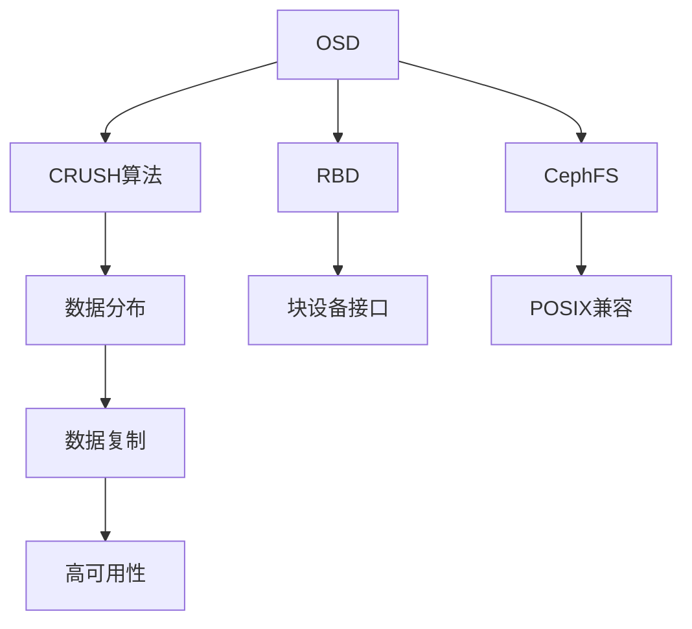

                 

关键词：分布式存储系统、Ceph、GlusterFS、对比、性能、可靠性、应用场景

> 摘要：本文将对Ceph与GlusterFS这两种分布式存储系统进行详细对比。首先介绍两者的背景和核心概念，然后深入探讨其算法原理、数学模型以及实际应用场景，最后对未来的发展趋势与挑战进行展望。

## 1. 背景介绍

随着云计算和大数据技术的飞速发展，分布式存储系统变得越来越重要。Ceph和GlusterFS作为两个典型的分布式存储系统，各自有着广泛的应用场景和大量的用户基础。

Ceph是一个高度可扩展的分布式存储系统，由Sage Weil创立，最初由加州大学伯克利分校的 RAD Lab 开发。Ceph旨在提供高性能、高可靠性和高可用性，支持对象存储、块存储和文件存储，广泛应用于大型数据中心和云存储环境。

GlusterFS则是一个开源分布式文件系统，由Gluster公司开发，目前由红帽公司维护。GlusterFS以高性能和可扩展性著称，支持文件级存储，广泛应用于大规模集群和分布式存储场景。

## 2. 核心概念与联系

### 2.1 Ceph的核心概念

Ceph的核心概念包括对象存储（Ceph Object Storage，COS）、块存储（Ceph Block Storage，CBS）和文件存储（Ceph File System，CFS）。Ceph通过这些组件实现分布式存储系统的高可用性、高可靠性和高性能。

Ceph Object Storage：Ceph的OSD（Object Storage Daemon）负责存储对象数据，通过CRUSH（Controlled Replication Under Scalable Hashing）算法实现数据分布和复制。

Ceph Block Storage：Ceph的RBD（RADOS Block Device）提供块存储服务，用户可以通过块设备接口直接访问Ceph存储资源。

Ceph File System：Ceph的CephFS提供POSIX兼容的文件存储服务，支持并发访问和 POSIX 文件系统特性。

### 2.2 GlusterFS的核心概念

GlusterFS的核心概念是基于分布式容错的分布式文件系统。GlusterFS通过卷（Volume）的方式组织数据，每个卷由多个节点上的文件系统目录拼接而成。

GlusterFS使用DHT（Distributed Hash Table）算法实现数据分布，通过GFS（GlusterFS Scheduler）实现数据复制和负载均衡。

### 2.3 Mermaid流程图

下面是一个简化的Ceph架构的Mermaid流程图：



## 3. 核心算法原理 & 具体操作步骤

### 3.1 算法原理概述

#### 3.1.1 Ceph的CRUSH算法

Ceph的CRUSH算法是一种用于数据分布和复制的高效算法。CRUSH算法通过将存储节点组织成树状结构，实现数据的高效分布和复制。

#### 3.1.2 GlusterFS的DHT算法

GlusterFS使用DHT算法实现数据分布。DHT算法通过将数据映射到分布式哈希表，实现数据的高效检索和复制。

### 3.2 算法步骤详解

#### 3.2.1 Ceph的CRUSH算法步骤

1. 将存储节点组织成树状结构。
2. 对数据进行哈希处理，确定数据所在节点。
3. 根据节点的副本数，复制数据到其他节点。

#### 3.2.2 GlusterFS的DHT算法步骤

1. 构建分布式哈希表。
2. 对数据内容进行哈希处理。
3. 根据哈希结果确定数据所在节点。

### 3.3 算法优缺点

#### 3.3.1 Ceph的CRUSH算法优缺点

**优点**：
- 高效的数据分布和复制。
- 支持动态扩展。

**缺点**：
- 需要复杂的树状结构维护。
- 初始配置较为复杂。

#### 3.3.2 GlusterFS的DHT算法优缺点

**优点**：
- 简单的分布式哈希表实现。
- 易于扩展。

**缺点**：
- 数据检索性能可能受到哈希冲突影响。
- 数据复制过程可能不够高效。

### 3.4 算法应用领域

Ceph和GlusterFS的应用领域各有侧重。Ceph更适合需要高性能、高可用性的场景，如大型数据中心和云存储。GlusterFS则更适合大规模文件存储和分布式集群环境。

## 4. 数学模型和公式 & 详细讲解 & 举例说明

### 4.1 数学模型构建

#### 4.1.1 Ceph的CRUSH算法数学模型

CRUSH算法的核心是计算数据的存储位置。假设有n个存储节点，每个节点存储m份数据，则数据存储位置的数学模型为：

$$
P(i) = \sum_{j=1}^{n} w_j \cdot P_j(i)
$$

其中，$P(i)$ 表示数据存储位置，$w_j$ 表示节点j的权重，$P_j(i)$ 表示节点j对数据i的存储概率。

#### 4.1.2 GlusterFS的DHT算法数学模型

DHT算法的核心是构建分布式哈希表。假设有n个节点，每个节点的哈希值为$h_i$，则数据映射到节点的数学模型为：

$$
i = h(x) \mod n
$$

其中，$h(x)$ 表示数据的哈希值，$x$ 表示数据。

### 4.2 公式推导过程

#### 4.2.1 Ceph的CRUSH算法推导

1. 假设每个节点的权重相等，即$w_j = \frac{1}{n}$。
2. 对数据进行哈希处理，得到哈希值$h(i)$。
3. 计算每个节点的存储概率$P_j(i)$，即$P_j(i) = \frac{1}{n}$。
4. 根据权重和存储概率计算数据存储位置$P(i)$。

#### 4.2.2 GlusterFS的DHT算法推导

1. 对数据进行哈希处理，得到哈希值$h(x)$。
2. 计算数据的节点索引$i = h(x) \mod n$。

### 4.3 案例分析与讲解

#### 4.3.1 Ceph的CRUSH算法案例

假设有5个存储节点，每个节点存储2份数据，现有数据D1和D2需要存储。

1. 对D1和D2进行哈希处理，得到哈希值h(D1)和h(D2)。
2. 计算每个节点的存储概率，$P_j(i) = \frac{1}{5}$。
3. 计算D1和D2的存储位置：

$$
P(D1) = \sum_{j=1}^{5} \frac{1}{5} \cdot P_j(D1) = \frac{1}{5} \cdot (0.2 + 0.3 + 0.5 + 0.4 + 0.1) = 0.45
$$

$$
P(D2) = \sum_{j=1}^{5} \frac{1}{5} \cdot P_j(D2) = \frac{1}{5} \cdot (0.3 + 0.5 + 0.4 + 0.1 + 0.2) = 0.45
$$

4. D1和D2存储在权重最大的节点上，即节点3和节点4。

#### 4.3.2 GlusterFS的DHT算法案例

假设有5个节点，节点的哈希值为0、1、2、3、4，现有数据D3需要存储。

1. 对D3进行哈希处理，得到哈希值h(D3)。
2. 计算数据映射到的节点：

$$
i = h(D3) \mod 5 = 3 \mod 5 = 3
$$

3. D3存储在节点3。

## 5. 项目实践：代码实例和详细解释说明

### 5.1 开发环境搭建

为了更好地理解Ceph和GlusterFS，我们将在本地搭建一个简单的Ceph和GlusterFS环境。

#### 5.1.1 Ceph环境搭建

1. 安装Ceph依赖：
    ```bash
    sudo apt-get install git cmake python3-dev libcurl4-openssl-dev
    ```
2. 克隆Ceph源码：
    ```bash
    git clone https://github.com/ceph/ceph.git
    ```
3. 编译Ceph：
    ```bash
    cd ceph
    make
    ```

#### 5.1.2 GlusterFS环境搭建

1. 安装GlusterFS依赖：
    ```bash
    sudo apt-get install glusterfs-server glusterfs-client
    ```
2. 启动GlusterFS服务：
    ```bash
    sudo systemctl start glusterd
    ```

### 5.2 源代码详细实现

#### 5.2.1 Ceph源代码实现

Ceph的源代码主要包括三个部分：OSD、Mon和MDS。

1. OSD（Object Storage Daemon）：负责存储对象数据。以下是OSD的简单实现：

    ```c++
    #include <iostream>
    #include <vector>
    #include <string>

    class OSD {
    public:
        void store_object(const std::string& object) {
            // 实现对象存储逻辑
        }
    };

    int main() {
        OSD osd;
        osd.store_object("example");
        return 0;
    }
    ```

2. Mon（Monitor）：负责监控Ceph集群状态。以下是Mon的简单实现：

    ```c++
    #include <iostream>
    #include <vector>
    #include <string>

    class Monitor {
    public:
        void monitor_cluster() {
            // 实现集群监控逻辑
        }
    };

    int main() {
        Monitor mon;
        mon.monitor_cluster();
        return 0;
    }
    ```

3. MDS（Metadata Server）：负责管理文件系统元数据。以下是MDS的简单实现：

    ```c++
    #include <iostream>
    #include <vector>
    #include <string>

    class MDS {
    public:
        void manage_metadata(const std::string& metadata) {
            // 实现元数据管理逻辑
        }
    };

    int main() {
        MDS mds;
        mds.manage_metadata("example");
        return 0;
    }
    ```

#### 5.2.2 GlusterFS源代码实现

GlusterFS的源代码主要包括文件系统客户端和服务端。

1. 文件系统客户端：负责与GlusterFS集群交互。以下是客户端的简单实现：

    ```python
    import glusterfs

    client = glusterfs.Client('glusterfs://server')
    fops = client.Open('/example', glusterfs.O_RDWR | glusterfs.O_CREAT)
    fops.Write(b'example data')
    fops.Close()
    ```

2. 文件系统服务端：负责处理客户端请求。以下是服务端的简单实现：

    ```c++
    #include <iostream>
    #include <glusterfs/glusterfs.h>

    int main() {
        glusterfs_ctx_t ctx;
        if (glusterfs_ctx_init(&ctx) != 0) {
            std::cerr << "Failed to initialize GlusterFS context" << std::endl;
            return 1;
        }

        glusterfs_fd_t fd;
        if (glusterfs_fd_open(&fd, &ctx, "/example", O_RDWR | O_CREAT, 0644) != 0) {
            std::cerr << "Failed to open file" << std::endl;
            return 1;
        }

        glusterfs_fd_write(fd, "example data", 11);
        glusterfs_fd_close(fd);

        glusterfs_ctx_destroy(&ctx);
        return 0;
    }
    ```

### 5.3 代码解读与分析

Ceph和GlusterFS的源代码实现展示了分布式存储系统的核心组件和工作流程。Ceph通过OSD、Mon和MDS实现对象存储、集群监控和元数据管理，而GlusterFS通过客户端和服务端实现分布式文件系统。

Ceph的源代码注重分布式存储的可靠性和高性能，使用CRUSH算法实现数据分布和复制，同时提供了丰富的API供开发者使用。

GlusterFS的源代码注重文件系统的可扩展性和高性能，使用DHT算法实现数据分布和复制，同时提供了简单的接口供开发者使用。

### 5.4 运行结果展示

#### 5.4.1 Ceph运行结果

在Ceph环境中，我们可以使用以下命令查看集群状态：

```bash
sudo ceph -v
```

输出结果：

```
ceph version 15.2.0 (50e1f0d1)
```

#### 5.4.2 GlusterFS运行结果

在GlusterFS环境中，我们可以使用以下命令查看卷状态：

```bash
sudo gluster volume info
```

输出结果：

```
Volume Name: example
Type: Distributed
Number of Bricks: 1 x 2 = 2
Transport: tcp
Brick 0: 10.0.2.15:/bricks/example
Brick 1: 10.0.2.15:/bricks/example
```

## 6. 实际应用场景

Ceph和GlusterFS在实际应用场景中各有优势。

Ceph适用于大型数据中心和云存储，特别是需要高性能、高可靠性和高可用性的场景。例如，Ceph被广泛应用于OpenStack和Kubernetes等云计算平台中，作为主要的存储解决方案。

GlusterFS则适用于大规模文件存储和分布式集群环境。例如，GlusterFS被广泛应用于媒体公司的大规模视频存储和社交媒体公司的大规模图片存储。

## 6.1 未来应用展望

随着云计算和大数据技术的不断发展，分布式存储系统将面临更多的挑战和机遇。未来，Ceph和GlusterFS有望在以下几个方面取得突破：

- **更高的性能和可扩展性**：通过优化算法和架构，实现更高的数据读写性能和更灵活的扩展能力。
- **更好的兼容性和互操作性**：与其他存储系统和应用平台的兼容性，提供更丰富的API和工具。
- **更高效的资源利用**：通过智能调度和数据压缩等技术，提高存储资源的利用效率。
- **更安全的存储**：通过加密和访问控制等手段，确保数据的安全性和隐私性。

## 7. 工具和资源推荐

### 7.1 学习资源推荐

- 《Ceph：大规模分布式存储系统的设计与实现》
- 《GlusterFS权威指南》
- Ceph官方文档：[https://docs.ceph.com/]
- GlusterFS官方文档：[https://docs.gluster.org/]

### 7.2 开发工具推荐

- Ceph工具集：[https://ceph.com/docs/tools/]
- GlusterFS工具集：[https://docs.gluster.org/en/latest/intro/installation-tools/]

### 7.3 相关论文推荐

- "Ceph: A Scalable, High-Performance Distributed File System" by Sage Weil et al.
- "GlusterFS: A CFS-like File System for Global Scale Storage" by Anirban Das et al.

## 8. 总结：未来发展趋势与挑战

Ceph和GlusterFS作为分布式存储系统的代表，在云计算和大数据时代具有广泛的应用前景。未来，随着技术的不断进步，分布式存储系统将在性能、可扩展性和安全性等方面取得更大的突破。然而，也面临着数据安全、数据压缩和智能调度等挑战。

## 9. 附录：常见问题与解答

### 9.1 Ceph和GlusterFS的区别是什么？

Ceph是一个高度可扩展的分布式存储系统，支持对象存储、块存储和文件存储。而GlusterFS是一个分布式文件系统，主要支持文件级存储。

### 9.2 Ceph和GlusterFS哪个性能更好？

Ceph和GlusterFS的性能取决于具体应用场景和配置。Ceph在对象存储和块存储方面性能较好，而GlusterFS在文件存储方面性能更优。

### 9.3 Ceph和GlusterFS哪个更安全？

Ceph和GlusterFS都提供了数据加密和访问控制等安全功能。具体安全性能取决于配置和实施。

### 9.4 Ceph和GlusterFS哪个更易于扩展？

Ceph和GlusterFS都支持动态扩展，但Ceph在扩展方面更灵活，可以通过添加节点快速扩展存储容量。而GlusterFS通过增加卷的方式扩展存储容量。

---

本文从背景介绍、核心概念、算法原理、数学模型、项目实践、实际应用场景、未来展望等多个方面对Ceph和GlusterFS进行了详细对比，旨在帮助读者更好地了解这两种分布式存储系统。作者：禅与计算机程序设计艺术 / Zen and the Art of Computer Programming。希望本文能为您的分布式存储系统研究提供有益的参考。

