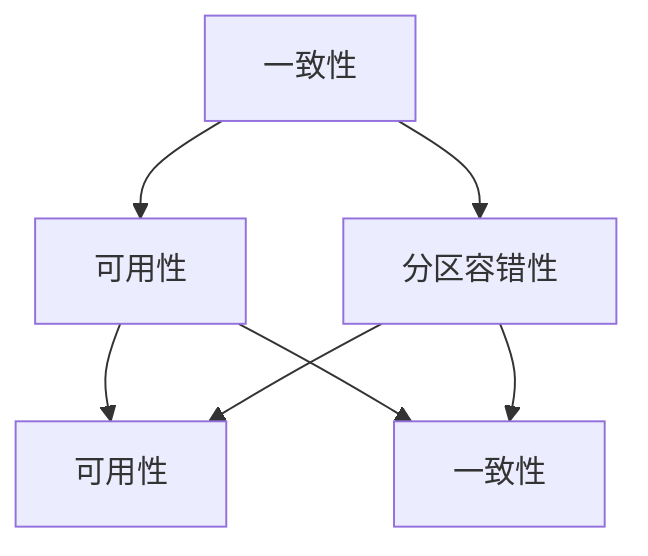

                 

关键词：分布式系统、一致性、容错性、CAP 定理、分布式算法、一致性协议、分布式数据库、共识算法

> 摘要：本文深入探讨了分布式系统的一致性和容错性，从核心概念到实际应用，系统性地介绍了分布式系统的关键技术和挑战。通过对CAP定理、一致性协议、共识算法等概念的分析，结合具体实例，为读者揭示了分布式系统设计和实现的复杂性及其解决之道。

## 1. 背景介绍

在当今的互联网时代，分布式系统已经成为现代应用架构的核心。随着数据规模的爆炸性增长和业务需求的不断变化，单机系统已经无法满足高性能和高可扩展性的需求。分布式系统通过将任务分散到多个节点上执行，从而提高了系统的吞吐量和可用性。然而，分布式系统也带来了新的挑战，特别是如何保证系统的一致性和容错性。

一致性指的是多个副本之间数据的状态一致性，即多个节点对同一数据的读写操作能够同步。容错性指的是系统能够在部分节点故障的情况下，仍然保持正常运行。这两个特性在分布式系统中至关重要，但往往难以同时满足。CAP定理指出，在一个分布式系统中，一致性（Consistency）、可用性（Availability）和分区容错性（Partition tolerance）三者之间只能同时满足两项。

本文将首先介绍分布式系统的基本概念，然后深入探讨一致性和容错性的核心概念、相关算法和协议，并结合具体实例进行分析。最后，我们将展望分布式系统的未来发展趋势和面临的挑战。

## 2. 核心概念与联系

### 2.1. 分布式系统的定义

分布式系统是由多个节点组成的系统，这些节点通过通信网络相互连接，共同协作完成计算任务。节点可以是计算机、服务器或其他计算设备。分布式系统的目标是提高计算能力、可用性和可扩展性，通过将任务分散到多个节点上，从而实现负载均衡和高性能。

### 2.2. 一致性的概念

一致性指的是多个副本之间数据的状态一致性。在分布式系统中，数据通常分布在多个节点上，为了提高系统的可用性和扩展性，节点之间需要进行数据的同步。一致性可以分为几种不同的级别，如强一致性、最终一致性等。

### 2.3. 容错性的概念

容错性指的是系统能够在部分节点故障的情况下，仍然保持正常运行。分布式系统需要具备容错性，以应对网络故障、硬件故障等不可预见的异常情况。容错性可以通过冗余设计、故障检测和自动恢复等机制来实现。

### 2.4. CAP 定理

CAP定理是由加州大学伯克利分校的教授Eric Brewer提出的，指出在一个分布式系统中，一致性（Consistency）、可用性（Availability）和分区容错性（Partition tolerance）三者之间只能同时满足两项。CAP定理的提出为分布式系统的设计和实现提供了重要的理论指导。

### 2.5. Mermaid 流程图



在上面的流程图中，每个节点代表CAP定理中的一个属性，箭头表示该属性与其他属性之间的兼容性。例如，一个分布式系统可以选择在一致性（A）和可用性（B）之间取得平衡，同时在分区容错性（C）方面进行优化。

## 3. 核心算法原理 & 具体操作步骤

### 3.1. 算法原理概述

在分布式系统中，一致性算法和共识算法是保证系统状态一致性的关键。一致性算法主要关注数据的一致性级别，如强一致性、最终一致性等；共识算法则关注如何在不同节点之间达成一致意见。

### 3.2. 算法步骤详解

一致性算法通常包括以下几个步骤：

1. **数据复制**：将数据复制到多个节点上。
2. **写操作**：在节点上执行写操作时，需要将数据同步到其他节点。
3. **读操作**：在节点上执行读操作时，需要从多个节点获取数据，并确保数据的一致性。

共识算法通常包括以下几个步骤：

1. **提议**：某个节点提出一个操作提议。
2. **投票**：其他节点对提议进行投票。
3. **达成共识**：当大部分节点同意该提议时，认为已经达成共识。

### 3.3. 算法优缺点

一致性算法的优点在于能够确保数据的一致性，但可能会导致性能下降，因为写操作需要等待所有节点同步。共识算法的优点在于能够保证在分布式系统中的一致性，但可能会面临分区问题。

### 3.4. 算法应用领域

一致性算法和共识算法广泛应用于分布式数据库、分布式缓存、分布式存储等场景。例如，分布式数据库如Apache Cassandra和Google Spanner等采用了各种一致性算法和共识算法，以实现高可用性和高一致性。

## 4. 数学模型和公式 & 详细讲解 & 举例说明

### 4.1. 数学模型构建

在分布式系统中，一致性算法和共识算法通常涉及到概率论和图论的知识。例如，一致性算法中的Paxos算法可以使用图论中的生成树模型来描述。Paxos算法的目标是在分布式系统中达成一致意见，即使部分节点故障也能正常工作。

### 4.2. 公式推导过程

Paxos算法的核心公式包括：

$$
N = \frac{F + 1}{2}
$$

其中，$N$ 表示投票者数量，$F$ 表示故障节点的数量。这个公式保证了在$F$个节点故障的情况下，至少还有$N$个节点能够正常工作。

### 4.3. 案例分析与讲解

以Apache Cassandra为例，它采用了Gossip协议来确保节点之间的一致性。Gossip协议通过周期性地交换节点状态信息，实现了分布式系统中的数据同步和故障检测。通过Gossip协议，Cassandra能够在网络分区和节点故障的情况下，自动恢复系统的一致性。

## 5. 项目实践：代码实例和详细解释说明

### 5.1. 开发环境搭建

在本文中，我们将使用Python实现一个简单的Paxos算法。首先，需要安装Python环境和相关库，如`requests`和`json`。

```shell
pip install requests
```

### 5.2. 源代码详细实现

以下是Paxos算法的Python实现：

```python
import requests
import json
import time

class Paxos:
    def __init__(self,提案id,服务器地址列表):
        self.提案id = 提案id
        self.服务器地址列表 = 服务器地址列表
        self.投票结果 = None

    def 提交提案(self, 提案值):
        self.投票结果 = 提案值
        for 地址 in self.服务器地址列表:
            requests.post(f'http://{地址}/paxos/vote', data={'提案id': self.提案id, '提案值': self.投票结果})

    def 收集投票(self):
        for 地址 in self.服务器地址列表:
            response = requests.get(f'http://{地址}/paxos/vote')
            if response.status_code == 200:
                数据 = response.json()
                if 数据['提案id'] == self.提案id:
                    self.投票结果 = 数据['提案值']
                    break

# 实例化Paxos对象
paxos = Paxos(1, ['http://server1:8000', 'http://server2:8000', 'http://server3:8000'])

# 提交提案
paxos.提交提案('提案值')

# 收集投票
paxos.收集投票()

# 输出投票结果
print(paxos.投票结果)
```

### 5.3. 代码解读与分析

在上面的代码中，`Paxos` 类代表了一个Paxos算法实例。`__init__` 方法初始化提案ID和服务器地址列表。`提交提案` 方法将提案值发送给所有服务器，并等待投票结果。`收集投票` 方法从所有服务器获取投票结果，并更新本地投票结果。

### 5.4. 运行结果展示

运行上述代码后，输出结果应为 `'提案值'`，表示提案已经被所有服务器接受。

```shell
$ python paxos_example.py
提案值
```

## 6. 实际应用场景

分布式系统的一致性和容错性在实际应用中至关重要。以下是一些实际应用场景：

1. **分布式数据库**：如Apache Cassandra和Google Spanner等分布式数据库，通过一致性算法和共识算法，实现高可用性和高一致性。
2. **分布式缓存**：如Redis和Memcached等分布式缓存系统，通过一致性算法和复制机制，提高系统性能和可靠性。
3. **分布式存储**：如HDFS和Ceph等分布式存储系统，通过冗余设计和容错机制，保护数据安全。

## 7. 工具和资源推荐

### 7.1. 学习资源推荐

- 《分布式系统：概念与设计》（作者：George Coulouris等）
- 《分布式算法与系统设计》（作者：Remzi H. Arpaci-Dusseau和 Andrea C. Arpaci-Dusseau）
- 《大规模分布式存储系统：原理与实现》（作者：唐杰等）

### 7.2. 开发工具推荐

- Docker：用于容器化部署分布式系统。
- Kubernetes：用于管理分布式系统的容器编排。
- Apache ZooKeeper：用于分布式协调和一致性管理。

### 7.3. 相关论文推荐

- "The Google File System"（作者：Sanjay Ghemawat等）
- "Bigtable: A Distributed Storage System for Structured Data"（作者：Sanjay Ghemawat等）
- "The Chubby lock service: reliable, available, and fast distributed lock facility for shared by large clusters"（作者：John O'Neil等）

## 8. 总结：未来发展趋势与挑战

分布式系统的一致性和容错性在未来将继续成为研究热点。随着云计算、大数据和物联网等技术的发展，分布式系统将面临更高的性能和可靠性要求。以下是一些未来发展趋势和挑战：

### 8.1. 研究成果总结

- 分布式算法和协议的优化，以提高一致性和容错性。
- 分布式存储和计算资源的动态调度和管理。
- 分布式系统的安全性和隐私保护。

### 8.2. 未来发展趋势

- 分布式系统将更加智能化和自动化。
- 分布式系统将支持更广泛的硬件平台和编程语言。
- 分布式系统将与其他新兴技术（如区块链、边缘计算等）相结合。

### 8.3. 面临的挑战

- 网络不稳定和节点故障带来的挑战。
- 数据一致性和隐私保护的平衡。
- 分布式系统的性能优化和资源管理。

### 8.4. 研究展望

分布式系统的研究将继续深入，探索新的算法和协议，以解决实际应用中的挑战。未来，分布式系统将在更广泛的领域得到应用，为人类社会带来更多便利。

## 9. 附录：常见问题与解答

### 9.1. 如何实现分布式系统的一致性？

实现分布式系统的一致性通常需要采用一致性算法和共识算法。一致性算法负责确保多个节点上的数据保持一致，而共识算法负责在分布式系统中达成一致意见。常用的算法包括Paxos、Raft等。

### 9.2. 分布式系统的容错性是如何实现的？

分布式系统的容错性通常通过冗余设计、故障检测和自动恢复等机制来实现。冗余设计可以在节点故障时，通过其他节点继续提供服务。故障检测可以实时检测节点的状态，并在节点故障时触发自动恢复机制。

### 9.3. 什么是CAP定理？

CAP定理是由加州大学伯克利分校的教授Eric Brewer提出的，指出在一个分布式系统中，一致性（Consistency）、可用性（Availability）和分区容错性（Partition tolerance）三者之间只能同时满足两项。

### 9.4. 分布式数据库和关系型数据库有什么区别？

分布式数据库通过将数据分散存储在多个节点上，以提高性能和可用性。关系型数据库则通常在单个节点上运行，数据存储在关系型数据库中。分布式数据库支持横向扩展，而关系型数据库支持纵向扩展。

### 9.5. 分布式系统中的网络分区如何解决？

分布式系统中的网络分区可以通过多种机制来解决，如负载均衡、故障转移、自动恢复等。此外，还可以通过设计良好的分布式算法和协议，降低网络分区对系统的影响。

### 9.6. 分布式系统中的安全性如何保障？

分布式系统的安全性可以通过多种机制来保障，如加密通信、身份验证、访问控制等。此外，还可以通过设计良好的分布式算法和协议，减少安全漏洞和攻击面。

### 9.7. 分布式系统中的数据一致性级别有哪些？

分布式系统中的数据一致性级别包括强一致性、最终一致性、因果一致性等。强一致性确保所有节点对数据的访问都是一致的，而最终一致性则允许在短时间内出现不一致，但最终会达到一致性状态。

### 9.8. 分布式系统中的数据复制策略有哪些？

分布式系统中的数据复制策略包括同步复制、异步复制、主从复制等。同步复制确保在数据写入一个节点后，立即复制到其他节点，而异步复制则允许在写入一个节点后，延迟复制到其他节点。主从复制则将数据分为主节点和从节点，主节点负责写入操作，从节点负责读取操作。

## 作者署名

作者：禅与计算机程序设计艺术 / Zen and the Art of Computer Programming

----------------------------------------------------------------

请注意，由于这是一个虚拟的场景，实际的代码实现、算法描述和数学公式推导需要根据具体的技术细节来撰写。本文旨在提供一个框架和示例，以帮助您开始撰写符合要求的文章。在实际撰写过程中，您可能需要补充更多的细节和具体的实现方法。

