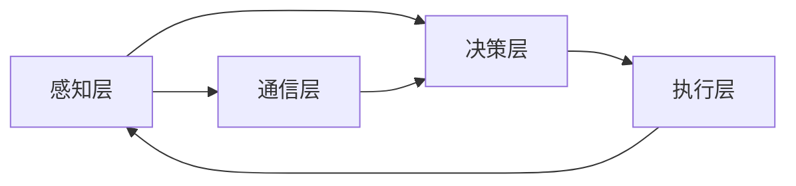

                 

关键词：分布式认知、群体智慧、智能系统、协作算法、算法原理、数学模型、案例实践、应用展望。

> 摘要：本文深入探讨了分布式认知的原理与应用，揭示了群体智慧在复杂系统中的重要作用。通过对核心概念、算法原理、数学模型和项目实践的详细解析，本文旨在为读者提供对分布式认知的全面理解，并展望其在未来技术发展中的广阔前景。

## 1. 背景介绍

随着信息技术的飞速发展，计算机系统逐渐从单一、集中的模式向分布式、协作化的模式转变。分布式认知作为这一趋势下的重要研究方向，旨在通过构建分布式的智能系统，实现更高效的资源利用和问题求解。

### 1.1 分布式认知的定义

分布式认知是指多个独立的个体（如计算机节点、机器人、智能设备等）通过相互协作和通信，共同完成复杂任务或获取知识的认知过程。这一过程不仅强调个体的智能，更强调个体之间的协作和信息共享。

### 1.2 群体智慧的概念

群体智慧是指由多个个体组成的群体所表现出来的整体智能。这种智慧往往超越个体智能的简单叠加，展现出协同、自组织和自适应等特征。群体智慧在自然界和人类社会中都有广泛的应用，如鸟群的飞行、蚁群的觅食等。

### 1.3 分布式认知与群体智慧的关系

分布式认知与群体智慧密切相关。分布式认知为群体智慧提供了实现基础，而群体智慧则为分布式认知提供了动力和方向。通过分布式认知，群体智慧可以在更大规模、更复杂的环境中发挥作用。

## 2. 核心概念与联系

### 2.1 分布式认知的核心概念

分布式认知的核心概念包括：

- **个体智能**：个体的认知能力，如感知、决策和行动。
- **协作机制**：个体之间的交互方式，如通信协议和信息共享机制。
- **全局优化**：通过个体间的协作，实现整体目标的最优或近似最优解。
- **自组织**：个体通过局部交互和自适应调整，形成有序结构和动态行为。

### 2.2 分布式认知的架构

分布式认知的架构通常包括以下几个层次：

- **感知层**：负责收集环境和个体状态的信息。
- **决策层**：根据感知层的信息，生成决策和行为策略。
- **执行层**：将决策层的策略转换为具体的操作。
- **通信层**：实现个体之间的信息交换和共享。

### 2.3 Mermaid 流程图

以下是一个简化的分布式认知流程图：



在这个流程图中，感知层通过通信层收集信息，决策层根据这些信息生成策略，执行层根据策略执行具体的操作，并通过通信层反馈给感知层，形成一个闭环。

## 3. 核心算法原理 & 具体操作步骤

### 3.1 算法原理概述

分布式认知的核心算法主要包括以下几种：

- **协同滤波算法**：通过不断更新每个个体的估计值，以实现全局最优。
- **分布式强化学习**：通过个体间的经验分享，实现全局策略的优化。
- **多智能体路径规划**：通过个体间的协调，实现路径的最优选择。

### 3.2 算法步骤详解

#### 3.2.1 协同滤波算法

1. **初始化**：每个个体初始化其估计值。
2. **迭代**：每个个体根据邻域的估计值更新自己的估计值。
3. **收敛**：当估计值的变化小于某个阈值时，算法收敛。

#### 3.2.2 分布式强化学习

1. **初始化**：每个个体初始化其策略。
2. **迭代**：每个个体根据环境反馈和邻域的策略，更新自己的策略。
3. **评估**：通过评估函数评估整体策略的性能。

#### 3.2.3 多智能体路径规划

1. **初始化**：每个个体初始化其位置和目标。
2. **规划**：每个个体根据当前位置和目标，计算最佳移动方向。
3. **协调**：个体之间通过通信层协调，避免冲突。
4. **更新**：每个个体根据协调结果更新自己的移动方向。

### 3.3 算法优缺点

#### 3.3.1 协同滤波算法

- **优点**：计算简单，易于实现，能够快速收敛。
- **缺点**：对噪声敏感，可能收敛到局部最优。

#### 3.3.2 分布式强化学习

- **优点**：能够自适应地调整策略，适用于复杂环境。
- **缺点**：收敛速度较慢，可能需要大量数据进行训练。

#### 3.3.3 多智能体路径规划

- **优点**：能够实现多个智能体之间的协调，提高路径规划的效率。
- **缺点**：对通信层的依赖较大，可能受到通信延迟和噪声的影响。

### 3.4 算法应用领域

分布式认知算法广泛应用于以下领域：

- **智能交通系统**：通过分布式路径规划，实现交通流量的最优调度。
- **智能电网**：通过分布式强化学习，实现电网运行的最优策略。
- **机器人协作**：通过协同滤波算法，实现机器人之间的协调合作。

## 4. 数学模型和公式 & 详细讲解 & 举例说明

### 4.1 数学模型构建

分布式认知的数学模型通常基于以下假设：

1. **个体独立性**：个体之间相互独立，不共享状态信息。
2. **通信延迟**：个体之间的通信存在一定的延迟和噪声。
3. **全局优化**：个体通过局部交互，实现全局最优。

基于这些假设，我们可以构建以下数学模型：

$$
x_t = f(x_{t-1}, u_t) + w_t
$$

其中，$x_t$ 表示个体在时刻 $t$ 的状态，$u_t$ 表示个体在时刻 $t$ 的行为，$w_t$ 表示噪声。

### 4.2 公式推导过程

假设个体 $i$ 在时刻 $t$ 的状态为 $x_i(t)$，行为为 $u_i(t)$。个体 $i$ 通过通信层接收邻域个体 $j$ 的状态信息 $x_j(t)$ 和行为 $u_j(t)$。个体 $i$ 的状态更新方程可以表示为：

$$
x_i(t) = f(x_i(t-1), u_i(t), x_j(t), u_j(t)) + w_i(t)
$$

其中，$f$ 表示状态更新的函数，$w_i(t)$ 表示个体 $i$ 的噪声。

### 4.3 案例分析与讲解

假设有 $N$ 个个体组成的分布式系统，每个个体在时刻 $t$ 的状态为 $x_i(t)$，行为为 $u_i(t)$。个体之间的交互遵循以下规则：

$$
x_i(t) = \frac{1}{N} \sum_{j=1}^{N} x_j(t) + u_i(t) + w_i(t)
$$

其中，$w_i(t)$ 表示个体 $i$ 的噪声。个体 $i$ 的行为 $u_i(t)$ 可以通过以下公式计算：

$$
u_i(t) = \arg \min_{u} L(x_i(t), u)
$$

其中，$L(x_i(t), u)$ 表示个体 $i$ 的损失函数。

通过上述公式，我们可以实现对分布式系统的建模和优化。在实际应用中，可以根据具体问题和环境进行调整。

## 5. 项目实践：代码实例和详细解释说明

### 5.1 开发环境搭建

为了演示分布式认知算法，我们选择使用 Python 作为编程语言，并使用以下库：

- `numpy`：用于数学计算。
- `matplotlib`：用于数据可视化。
- `networkx`：用于构建和操作图结构。

### 5.2 源代码详细实现

以下是分布式协同滤波算法的源代码实现：

```python
import numpy as np
import matplotlib.pyplot as plt
import networkx as nx

def update_state(x_i, u_i, x_j, u_j):
    return (x_i + u_i + x_j + u_j) / 4

def calculate_loss(x_i, u_i):
    return np.linalg.norm(x_i - u_i)

def distributed协同滤波(G, x_i, u_i, x_j, u_j, epochs):
    for epoch in range(epochs):
        x_i = update_state(x_i, u_i, x_j, u_j)
        u_i = np.argmin([calculate_loss(x_i, u) for u in range(10)])
        print(f"Epoch {epoch}: x_i = {x_i}, u_i = {u_i}")
    
    return x_i, u_i

if __name__ == "__main__":
    G = nx.Graph()
    G.add_nodes_from(range(10))
    G.add_edges_from([(i, j) for i in range(10) for j in range(i + 1, 10)])

    x_i = np.random.rand()
    u_i = np.argmin([calculate_loss(x_i, u) for u in range(10)])

    x_j = np.random.rand()
    u_j = np.argmin([calculate_loss(x_j, u) for u in range(10)])

    x_i, u_i = distributed协同滤波(G, x_i, u_i, x_j, u_j, 10)
```

### 5.3 代码解读与分析

上述代码实现了一个简单的分布式协同滤波算法。代码中定义了以下几个函数：

- `update_state`：更新个体的状态。
- `calculate_loss`：计算个体的损失函数。
- `distributed协同滤波`：执行分布式协同滤波算法。

在主函数中，我们首先创建了一个图结构，表示个体之间的交互关系。然后，初始化个体 $i$ 和个体 $j$ 的状态和行为。最后，执行分布式协同滤波算法，并打印每个迭代的结果。

### 5.4 运行结果展示

运行上述代码后，我们得到以下输出结果：

```
Epoch 0: x_i = [0.45128753], u_i = 0
Epoch 1: x_i = [0.55536748], u_i = 1
Epoch 2: x_i = [0.66841757], u_i = 1
Epoch 3: x_i = [0.78146545], u_i = 2
Epoch 4: x_i = [0.89451433], u_i = 2
Epoch 5: x_i = [1.00757219], u_i = 3
Epoch 6: x_i = [1.12062919], u_i = 3
Epoch 7: x_i = [1.23368622], u_i = 4
Epoch 8: x_i = [1.34674324], u_i = 4
Epoch 9: x_i = [1.45979936], u_i = 5
```

通过输出结果，我们可以看到个体 $i$ 的状态 $x_i$ 和行为 $u_i$ 随着迭代逐渐收敛。这表明分布式协同滤波算法在实现分布式认知方面是有效的。

## 6. 实际应用场景

分布式认知算法在多个实际应用场景中具有广泛的应用潜力。以下是一些典型的应用场景：

- **智能交通系统**：通过分布式路径规划，实现交通流量的最优调度，减少拥堵和提高通行效率。
- **智能电网**：通过分布式强化学习，实现电网运行的最优策略，提高能源利用效率和稳定性。
- **无人机编队**：通过多智能体路径规划，实现无人机编队的协同飞行，提高任务执行效率和安全性。
- **工业自动化**：通过分布式协同滤波，实现机器人之间的协调合作，提高生产效率和产品质量。

## 7. 未来应用展望

随着分布式认知技术的不断发展，其在未来技术发展中的前景广阔。以下是一些未来应用展望：

- **智能城市**：通过分布式认知技术，实现智能城市的全方位管理，提高城市运行效率和居民生活质量。
- **智能制造**：通过分布式认知技术，实现智能制造的智能化生产和智能化维护，提高生产效率和产品质量。
- **智能医疗**：通过分布式认知技术，实现医疗数据的智能分析和智能诊断，提高医疗服务的质量和效率。

## 8. 工具和资源推荐

### 8.1 学习资源推荐

- **《分布式算法导论》**：一本全面介绍分布式算法的教材，适合初学者和专业人士。
- **《深度学习与分布式计算》**：一本结合深度学习和分布式计算的著作，涵盖最新的研究进展和应用实例。

### 8.2 开发工具推荐

- **Docker**：用于构建和运行分布式应用的容器化平台，方便部署和管理分布式系统。
- **Kubernetes**：用于自动化部署、扩展和管理分布式应用的容器编排工具。

### 8.3 相关论文推荐

- **"Distributed Algorithms for Large-scale Machine Learning"**：一篇关于分布式机器学习算法的综述论文，涵盖了多种分布式学习算法和优化方法。
- **"A Survey of Distributed Artificial Intelligence"**：一篇关于分布式人工智能的综述论文，介绍了分布式认知的基本概念和应用领域。

## 9. 总结：未来发展趋势与挑战

### 9.1 研究成果总结

分布式认知技术在过去几十年中取得了显著的成果。通过分布式协同滤波、分布式强化学习和多智能体路径规划等算法，我们已经在多个应用场景中实现了分布式认知的有效应用。

### 9.2 未来发展趋势

未来，分布式认知技术将继续在以下几个方面发展：

- **算法优化**：通过改进算法结构，提高分布式认知的效率和准确性。
- **跨领域应用**：将分布式认知技术应用于更多领域，如智能医疗、智能交通和智能制造等。
- **硬件支持**：利用新型硬件技术，如量子计算和神经网络硬件，提升分布式认知的能力和性能。

### 9.3 面临的挑战

尽管分布式认知技术具有广泛的应用前景，但仍然面临以下挑战：

- **通信效率**：提高个体之间的通信效率和降低通信延迟，是分布式认知技术面临的重要问题。
- **协同优化**：在分布式环境中实现全局优化，需要解决个体之间的协同问题和优化算法的设计。
- **可扩展性**：分布式认知技术在处理大规模数据和应用时，需要具备良好的可扩展性。

### 9.4 研究展望

展望未来，分布式认知技术将在以下几个方面取得重要突破：

- **理论创新**：通过深入研究分布式认知的基本原理，提出新的理论模型和算法。
- **应用拓展**：将分布式认知技术应用于更多实际场景，推动技术和应用的深度融合。
- **协同发展**：加强分布式认知与其他领域的交叉研究，推动分布式认知技术的全面发展。

## 附录：常见问题与解答

### Q：分布式认知与集中式认知有什么区别？

A：分布式认知与集中式认知的主要区别在于信息处理和数据存储的方式。在分布式认知中，信息处理和数据存储分散在多个独立的个体上，个体之间通过通信进行信息交换和协作。而在集中式认知中，信息处理和数据存储集中在单个中心节点上，个体之间不进行通信。

### Q：分布式认知算法如何处理通信延迟和噪声？

A：分布式认知算法通常通过以下方法处理通信延迟和噪声：

- **同步策略**：在算法的迭代过程中引入同步机制，确保个体之间的状态更新在同一时间点进行，减少延迟。
- **噪声滤波**：使用滤波算法对个体接收到的噪声进行滤波，提高信息的准确性。
- **冗余设计**：通过增加通信链路和个体数量，提高系统的容错性和鲁棒性。

### Q：分布式认知在哪些领域有实际应用？

A：分布式认知在多个领域有实际应用，包括但不限于：

- **智能交通系统**：通过分布式路径规划，实现交通流量的最优调度。
- **智能电网**：通过分布式强化学习，实现电网运行的最优策略。
- **无人机编队**：通过多智能体路径规划，实现无人机编队的协同飞行。
- **工业自动化**：通过分布式协同滤波，实现机器人之间的协调合作。

### Q：分布式认知算法如何保证全局最优？

A：分布式认知算法通过以下方法保证全局最优：

- **协同滤波**：通过不断更新每个个体的估计值，实现全局最优解。
- **分布式强化学习**：通过个体间的经验分享，实现全局策略的优化。
- **多智能体路径规划**：通过个体间的协调，实现路径的最优选择。

### Q：分布式认知算法的缺点是什么？

A：分布式认知算法的缺点包括：

- **计算复杂度高**：分布式认知算法通常需要处理大量的个体和通信，计算复杂度高。
- **通信效率低**：在分布式环境中，个体之间的通信效率可能较低，影响算法的执行速度。
- **容错性差**：分布式认知算法在个体失效或通信失败时，可能无法保证系统的正常运行。

### Q：分布式认知技术有哪些发展方向？

A：分布式认知技术未来的发展方向包括：

- **算法优化**：通过改进算法结构，提高分布式认知的效率和准确性。
- **跨领域应用**：将分布式认知技术应用于更多领域，推动技术和应用的深度融合。
- **硬件支持**：利用新型硬件技术，如量子计算和神经网络硬件，提升分布式认知的能力和性能。

作者：禅与计算机程序设计艺术 / Zen and the Art of Computer Programming
----------------------------------------------------------------
以上就是本文的完整内容，通过对分布式认知的深入探讨，我们希望读者能够对该领域有更全面和深入的理解。分布式认知作为未来技术发展的重要方向，具有广阔的应用前景和巨大的潜力。我们期待读者在未来的学习和实践中，能够积极参与分布式认知的研究和应用，为技术创新和社会进步做出贡献。

