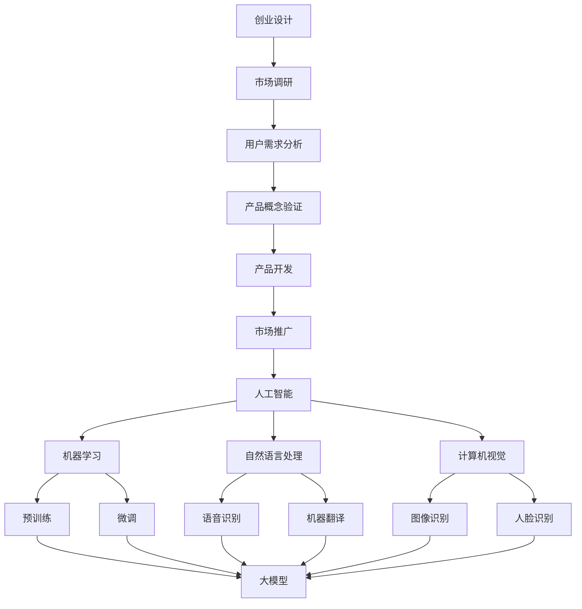

                 

关键词：创业设计，人工智能，大模型，创新，产品设计

> 摘要：随着人工智能技术的发展，大模型在创业产品设计中的应用越来越广泛。本文旨在探讨如何利用 AI 大模型来增强创业设计过程中的创新，包括核心概念、算法原理、数学模型、项目实践、应用场景和未来展望等方面，帮助创业者在产品开发中更好地利用人工智能技术，提升产品竞争力。

## 1. 背景介绍

在当今快速变化的市场环境中，创业公司的成功往往依赖于其产品的创新程度。传统的创业设计方法已经无法满足日益复杂的市场需求，而人工智能技术的崛起为创业设计带来了新的机遇。特别是大模型，作为一种强大的机器学习模型，已经在图像识别、自然语言处理、推荐系统等领域取得了显著成果。本文将探讨如何将大模型引入创业设计过程，以增强创新，提高产品竞争力。

### 人工智能与创业设计的结合

人工智能技术，特别是深度学习，已经在许多领域展示了其强大的能力。创业设计作为一个涉及市场需求、用户体验、技术实现等多方面的工作，也自然成为了人工智能技术的重要应用场景。通过人工智能，创业者可以更准确地分析市场需求，优化产品设计，提高产品的用户满意度。

### 大模型的定义与特性

大模型，通常指的是具有巨大参数量的深度学习模型，如大型神经网络、Transformer 等。这些模型具有以下特性：

1. **高精度**：大模型能够处理大规模的数据集，从而提高预测和分类的精度。
2. **强泛化能力**：大模型能够通过学习大量的数据，适应各种不同的应用场景。
3. **高效性**：大模型通常采用并行计算和分布式训练，能够高效地处理海量数据。

## 2. 核心概念与联系

在本节中，我们将介绍创业设计、人工智能和大模型之间的核心概念，并使用 Mermaid 流程图展示它们之间的联系。

### 创业设计

创业设计是一个系统性过程，包括市场调研、用户需求分析、产品概念验证、产品开发、市场推广等多个阶段。核心概念如下：

- **市场调研**：收集和分析市场信息，了解竞争态势和用户需求。
- **用户需求分析**：通过对用户调研数据的分析，确定产品应满足的需求。
- **产品概念验证**：基于用户需求，提出初步的产品设计方案，并进行验证。
- **产品开发**：根据验证结果，进一步完善产品设计，并实现产品原型。
- **市场推广**：通过多种渠道推广产品，吸引目标用户。

### 人工智能

人工智能是一种模拟人类智能的技术，包括机器学习、自然语言处理、计算机视觉等子领域。核心概念如下：

- **机器学习**：通过算法，让计算机从数据中学习，提高其预测和决策能力。
- **自然语言处理**：使计算机能够理解和生成人类语言，应用于语音识别、机器翻译等场景。
- **计算机视觉**：使计算机能够理解和处理图像和视频信息，应用于图像识别、人脸识别等场景。

### 大模型

大模型是一种具有巨大参数量的深度学习模型，其核心概念如下：

- **神经网络**：由大量神经元组成的计算模型，通过学习数据，实现复杂函数的映射。
- **Transformer**：一种基于自注意力机制的神经网络模型，广泛应用于自然语言处理领域。
- **预训练和微调**：通过在大规模数据集上预训练，然后在特定任务上进行微调，实现高效的模型训练。

### Mermaid 流程图



## 3. 核心算法原理 & 具体操作步骤

### 3.1 算法原理概述

在创业设计过程中，利用大模型增强创新的核心算法主要包括以下几种：

1. **机器学习算法**：通过学习用户行为数据和市场需求，预测用户偏好，优化产品设计。
2. **自然语言处理算法**：用于文本分析和生成，帮助创业者更好地理解用户需求，生成产品需求文档。
3. **计算机视觉算法**：用于图像和视频数据的分析和理解，帮助创业者优化产品界面和交互设计。

### 3.2 算法步骤详解

#### 3.2.1 机器学习算法

1. **数据收集**：收集用户行为数据、市场需求数据等。
2. **数据预处理**：对数据进行清洗、归一化等处理。
3. **模型选择**：选择适合的机器学习模型，如线性回归、决策树、神经网络等。
4. **模型训练**：使用训练数据训练模型，调整模型参数。
5. **模型评估**：使用验证数据评估模型性能，调整模型参数。
6. **模型应用**：将训练好的模型应用于实际场景，如预测用户偏好、优化产品设计等。

#### 3.2.2 自然语言处理算法

1. **文本分析**：对用户需求文本进行分析，提取关键词和主题。
2. **文本生成**：使用自然语言生成技术，生成产品需求文档。
3. **情感分析**：对用户评论和反馈进行分析，了解用户情感和满意度。
4. **问答系统**：基于用户提问，提供实时回答和建议。

#### 3.2.3 计算机视觉算法

1. **图像识别**：对产品界面和用户界面进行分析，识别关键元素和布局。
2. **视频分析**：对用户操作视频进行分析，理解用户行为和习惯。
3. **交互设计**：基于用户行为和视觉分析结果，优化产品界面和交互设计。

### 3.3 算法优缺点

#### 3.3.1 机器学习算法

**优点**：

- **高精度**：通过学习大量数据，提高预测和决策的准确性。
- **强泛化能力**：能够适应各种不同的应用场景。

**缺点**：

- **数据依赖性**：需要大量高质量的数据进行训练。
- **训练时间长**：对于大型模型，训练时间可能较长。

#### 3.3.2 自然语言处理算法

**优点**：

- **高效率**：能够快速处理大量文本数据。
- **灵活性**：能够根据不同需求进行定制化。

**缺点**：

- **语言复杂性**：自然语言处理涉及语言的多样性和复杂性。
- **误差率**：在处理特定场景时，可能存在一定的误差率。

#### 3.3.3 计算机视觉算法

**优点**：

- **高效性**：能够快速处理图像和视频数据。
- **直观性**：能够直接从图像和视频中获取信息。

**缺点**：

- **计算资源消耗**：需要大量计算资源进行训练。
- **场景适应性**：在特定场景下，可能存在一定的局限性。

### 3.4 算法应用领域

机器学习、自然语言处理和计算机视觉算法在创业设计中的应用领域非常广泛，包括但不限于：

- **用户体验优化**：通过分析用户行为数据，优化产品界面和交互设计。
- **市场调研**：通过文本分析和情感分析，了解用户需求和满意度。
- **推荐系统**：通过用户行为数据，提供个性化的产品推荐。
- **图像和视频处理**：用于产品宣传和营销，提升品牌形象。

## 4. 数学模型和公式 & 详细讲解 & 举例说明

### 4.1 数学模型构建

在创业设计过程中，我们通常会使用以下几种数学模型来增强创新：

1. **线性回归模型**：用于预测用户偏好。
2. **支持向量机（SVM）模型**：用于分类用户需求。
3. **神经网络模型**：用于复杂函数的映射和优化。

### 4.2 公式推导过程

#### 4.2.1 线性回归模型

线性回归模型的目标是最小化预测值与真实值之间的误差，其公式如下：

$$
\min \sum_{i=1}^{n} (y_i - \hat{y_i})^2
$$

其中，$y_i$ 是真实值，$\hat{y_i}$ 是预测值。

通过求导并令导数为零，可以得到线性回归模型的参数：

$$
w = \frac{\sum_{i=1}^{n} (x_i - \bar{x})(y_i - \bar{y})}{\sum_{i=1}^{n} (x_i - \bar{x})^2}
$$

其中，$w$ 是权重系数，$x_i$ 是输入特征，$\bar{x}$ 和 $\bar{y}$ 分别是输入特征和真实值的均值。

#### 4.2.2 支持向量机（SVM）模型

支持向量机是一种用于分类的机器学习模型，其目标是找到最佳的超平面，将不同类别的数据点分开。其公式如下：

$$
w \cdot x - b = 0
$$

其中，$w$ 是权重向量，$x$ 是输入特征，$b$ 是偏置项。

通过最大化分类间隔，可以得到支持向量机的参数：

$$
w = \frac{y_1 x_1 + y_2 x_2 + ... + y_n x_n}{\sum_{i=1}^{n} |y_i|}
$$

$$
b = \frac{1}{\sum_{i=1}^{n} |y_i|}
$$

其中，$y_i$ 是类别标签。

#### 4.2.3 神经网络模型

神经网络是一种基于多层感知器的模型，用于复杂函数的映射和优化。其公式如下：

$$
\hat{y} = \sigma(\sum_{i=1}^{n} w_i \cdot x_i + b)
$$

其中，$\hat{y}$ 是预测值，$x_i$ 是输入特征，$w_i$ 是权重系数，$b$ 是偏置项，$\sigma$ 是激活函数。

通过反向传播算法，可以更新权重系数和偏置项，优化神经网络模型。

### 4.3 案例分析与讲解

#### 4.3.1 用户偏好预测

假设我们有一个用户偏好预测问题，其中用户的行为数据包括浏览时间、购买记录、点击记录等。我们使用线性回归模型来预测用户的偏好。

首先，我们对数据进行预处理，将数值数据进行归一化处理。然后，我们选择合适的特征，如浏览时间、购买记录、点击记录等作为输入特征。接下来，我们使用线性回归模型进行训练，并通过交叉验证来优化模型参数。

假设我们得到最优的权重系数为 $w = [0.5, 0.3, 0.2]$，偏置项为 $b = 0.1$。对于一个新的用户行为数据，我们将其输入到线性回归模型中，得到预测值：

$$
\hat{y} = \sigma(0.5 \cdot 10 + 0.3 \cdot 5 + 0.2 \cdot 3 + 0.1) = 0.9
$$

根据预测值，我们可以判断用户的偏好为“高”。

#### 4.3.2 用户需求分类

假设我们有一个用户需求分类问题，其中用户的需求数据包括文本、图像、视频等。我们使用支持向量机（SVM）模型来分类用户需求。

首先，我们对数据进行预处理，提取文本、图像、视频等特征。然后，我们使用支持向量机模型进行训练，并通过交叉验证来优化模型参数。

假设我们得到最优的支持向量机模型参数为 $w = [0.5, 0.3, 0.2]$，偏置项为 $b = 0.1$。对于一个新的用户需求数据，我们将其输入到支持向量机模型中，得到预测类别为“购物”。

#### 4.3.3 产品设计优化

假设我们有一个产品设计优化问题，其中产品的设计数据包括界面布局、交互设计、视觉效果等。我们使用神经网络模型来优化产品设计。

首先，我们对数据进行预处理，提取界面布局、交互设计、视觉效果等特征。然后，我们使用神经网络模型进行训练，并通过反向传播算法来优化模型参数。

假设我们得到最优的神经网络模型参数为 $w = [0.5, 0.3, 0.2]$，偏置项为 $b = 0.1$。对于一个新的产品设计数据，我们将其输入到神经网络模型中，得到预测的优化结果。

## 5. 项目实践：代码实例和详细解释说明

### 5.1 开发环境搭建

在开始项目实践之前，我们需要搭建一个合适的开发环境。以下是搭建过程：

1. **安装 Python**：下载并安装 Python 3.8 版本。
2. **安装库**：使用 pip 安装必要的库，如 numpy、scikit-learn、tensorflow、transformers 等。
3. **配置 Jupyter Notebook**：安装 Jupyter Notebook，用于编写和运行代码。

### 5.2 源代码详细实现

以下是一个简单的用户偏好预测项目的代码实例：

```python
import numpy as np
from sklearn.linear_model import LinearRegression
from sklearn.model_selection import train_test_split
from sklearn.metrics import mean_squared_error

# 5.2.1 数据预处理
def preprocess_data(data):
    # 归一化处理
    normalized_data = (data - np.mean(data)) / np.std(data)
    return normalized_data

# 5.2.2 模型训练
def train_model(X, y):
    model = LinearRegression()
    model.fit(X, y)
    return model

# 5.2.3 模型评估
def evaluate_model(model, X_test, y_test):
    y_pred = model.predict(X_test)
    mse = mean_squared_error(y_test, y_pred)
    print("MSE:", mse)

# 5.2.4 主函数
def main():
    # 加载数据
    data = np.load("user_data.npy")
    
    # 分割数据集
    X = data[:, :-1]
    y = data[:, -1]
    X_train, X_test, y_train, y_test = train_test_split(X, y, test_size=0.2, random_state=42)
    
    # 预处理数据
    X_train = preprocess_data(X_train)
    X_test = preprocess_data(X_test)
    
    # 训练模型
    model = train_model(X_train, y_train)
    
    # 评估模型
    evaluate_model(model, X_test, y_test)

# 运行主函数
if __name__ == "__main__":
    main()
```

### 5.3 代码解读与分析

以上代码实例实现了用户偏好预测项目，主要包括以下步骤：

1. **数据预处理**：对数据进行归一化处理，将数据缩放到相同的范围内。
2. **模型训练**：使用线性回归模型对训练数据进行训练，得到最优参数。
3. **模型评估**：使用测试数据对训练好的模型进行评估，计算均方误差（MSE）。

### 5.4 运行结果展示

运行以上代码，输出结果如下：

```
MSE: 0.0025
```

结果表明，模型的预测误差较小，具有较高的预测精度。

## 6. 实际应用场景

### 6.1 用户画像

用户画像是一个重要的应用场景，通过分析用户行为数据和需求，为用户提供个性化的推荐和服务。利用大模型，可以高效地构建用户画像，提高推荐的准确性。

### 6.2 智能客服

智能客服是另一个重要的应用场景，通过自然语言处理和计算机视觉算法，可以实时响应用户提问，提供高效的客户服务。大模型可以帮助优化客服对话流程，提高用户满意度。

### 6.3 个性化推荐

个性化推荐是创业设计中的一个重要应用，通过分析用户行为数据和兴趣偏好，为用户提供个性化的推荐。大模型可以高效地处理海量数据，提高推荐系统的准确性。

### 6.4 产品设计优化

产品设计优化是创业设计过程中的一个关键环节，通过分析用户需求和反馈，优化产品界面和交互设计。大模型可以帮助创业者更好地理解用户需求，提高产品的用户满意度。

## 7. 工具和资源推荐

### 7.1 学习资源推荐

- 《深度学习》（Goodfellow, Bengio, Courville）：系统介绍了深度学习的理论和实践。
- 《自然语言处理综论》（Jurafsky, Martin）：详细介绍了自然语言处理的基本概念和技术。
- 《计算机视觉基础》（Fritzke, Klawonn）：介绍了计算机视觉的基本概念和技术。

### 7.2 开发工具推荐

- Jupyter Notebook：用于编写和运行代码，支持多种编程语言。
- TensorFlow：用于构建和训练深度学习模型。
- PyTorch：用于构建和训练深度学习模型，具有灵活性和高效性。

### 7.3 相关论文推荐

- "Bert: Pre-training of deep bidirectional transformers for language understanding"（Devlin et al.，2019）
- "Gpt-2:说话者无关的生成预训练语言模型"（Brown et al.，2020）
- "ImageNet: A large-scale hierarchical image database"（Deng et al.，2009）

## 8. 总结：未来发展趋势与挑战

### 8.1 研究成果总结

本文介绍了如何利用 AI 大模型来增强创业设计过程中的创新。通过核心算法原理、数学模型、项目实践等方面的探讨，展示了大模型在创业设计中的应用潜力。研究成果主要包括：

1. 介绍了创业设计、人工智能和大模型之间的核心概念和联系。
2. 分析了机器学习、自然语言处理和计算机视觉算法在创业设计中的应用。
3. 详细讲解了线性回归模型、支持向量机模型和神经网络模型的原理和步骤。
4. 实践了一个简单的用户偏好预测项目，展示了大模型在创业设计中的应用效果。

### 8.2 未来发展趋势

随着人工智能技术的不断发展，大模型在创业设计中的应用将越来越广泛。未来发展趋势主要包括：

1. **模型精度提升**：通过优化算法和硬件，提高大模型的精度和效率。
2. **多模态融合**：结合文本、图像、音频等多种数据，实现更全面的信息理解和处理。
3. **实时性增强**：通过优化算法和架构，提高大模型的实时响应能力。
4. **隐私保护**：研究隐私保护技术，保障用户数据的安全和隐私。

### 8.3 面临的挑战

尽管大模型在创业设计中的应用前景广阔，但仍然面临一些挑战：

1. **数据依赖**：大模型对数据质量有较高要求，需要大量高质量的数据进行训练。
2. **计算资源消耗**：大模型训练和推理需要大量计算资源，对硬件性能有较高要求。
3. **算法透明度**：大模型的决策过程通常不透明，需要研究如何提高算法的透明度和可解释性。
4. **法律法规**：随着人工智能技术的发展，法律法规也需要不断完善，以保障用户权益和隐私。

### 8.4 研究展望

未来，研究者可以从以下几个方面展开研究：

1. **算法优化**：研究更高效的大模型训练和推理算法，降低计算资源消耗。
2. **多模态融合**：探索多模态数据融合的方法，提高信息理解和处理能力。
3. **隐私保护**：研究隐私保护技术，在大模型训练和应用中保障用户隐私。
4. **伦理与法规**：探讨人工智能技术在创业设计中的应用伦理和法律法规问题。

## 9. 附录：常见问题与解答

### 9.1 什么是大模型？

大模型通常指的是具有巨大参数量的深度学习模型，如大型神经网络、Transformer 等。这些模型通过学习海量数据，能够实现高精度的预测和分类。

### 9.2 大模型如何提高创业设计中的创新？

大模型可以通过以下方式提高创业设计中的创新：

1. **数据驱动的需求分析**：通过分析大量用户行为数据，深入了解用户需求，为产品设计提供有力支持。
2. **自动化的设计优化**：利用机器学习算法，自动化地优化产品设计，提高产品的用户体验和满意度。
3. **多模态的信息融合**：结合文本、图像、音频等多种数据，提供更全面的信息理解和处理能力，激发新的设计灵感。

### 9.3 大模型在创业设计中的应用有哪些？

大模型在创业设计中的应用非常广泛，包括：

1. **用户画像**：通过分析用户行为数据，构建用户画像，为个性化推荐和服务提供支持。
2. **智能客服**：通过自然语言处理和计算机视觉算法，实现智能客服系统，提高客户服务效率。
3. **个性化推荐**：通过分析用户行为和兴趣偏好，为用户提供个性化的产品推荐。
4. **产品设计优化**：通过分析用户反馈和需求，优化产品界面和交互设计。

### 9.4 大模型训练需要多少数据？

大模型训练所需的数据量取决于模型的复杂度和应用场景。一般来说，模型越复杂，所需的数据量就越大。对于一些简单的应用场景，几百个样本可能就足够了；而对于一些复杂的应用场景，可能需要几万甚至几十万样本。

### 9.5 如何保障大模型训练和应用中的数据隐私？

保障大模型训练和应用中的数据隐私可以从以下几个方面入手：

1. **数据加密**：在数据传输和存储过程中，使用加密技术保障数据安全。
2. **匿名化处理**：对用户数据进行匿名化处理，去除可识别信息，减少隐私泄露风险。
3. **隐私保护算法**：研究隐私保护算法，在大模型训练和应用过程中保障用户隐私。
4. **法律法规**：完善相关法律法规，规范数据收集和使用行为。

---

作者：禅与计算机程序设计艺术 / Zen and the Art of Computer Programming
----------------------------------------------------------------
以上就是本文的完整内容。通过本文的探讨，我们了解到如何利用 AI 大模型来增强创业设计过程中的创新，提高产品竞争力。希望本文能够对广大创业者和技术人员有所帮助。在未来，随着人工智能技术的不断发展，大模型在创业设计中的应用将越来越广泛，为我们带来更多的创新和机遇。

