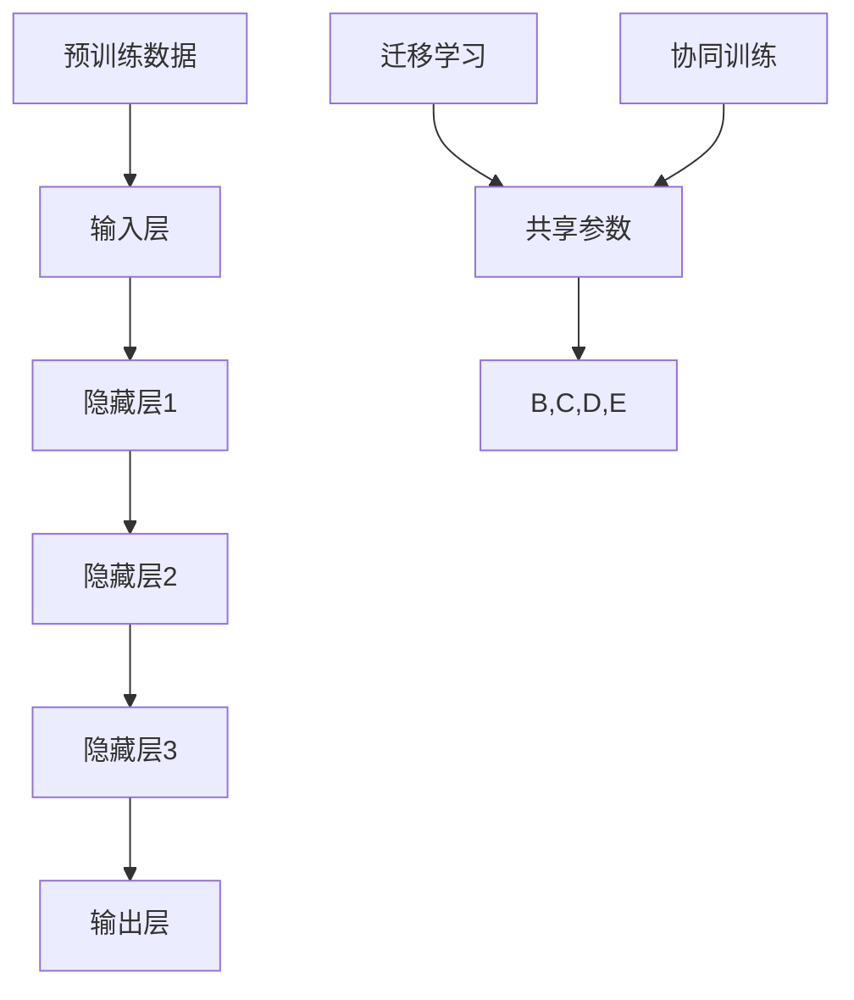

                 

关键词：创业公司，大模型，产品策略，AI 时代，创新

摘要：本文将深入探讨创业公司在 AI 时代采用的大模型产品策略。我们将分析大模型的核心优势，创业公司在 AI 技术应用中的挑战和机遇，并给出具体的策略建议，帮助创业公司在竞争激烈的 AI 市场中脱颖而出。

## 1. 背景介绍

随着人工智能技术的飞速发展，大模型成为了当前 AI 研究和应用的热点。大模型，特别是基于深度学习的模型，如 GPT、BERT 等，凭借其强大的计算能力和出色的性能表现，已经在自然语言处理、计算机视觉、语音识别等领域取得了显著的成果。创业公司作为技术创新的先锋，如何在 AI 时代通过大模型产品策略实现成功，成为了摆在每个创业者面前的重要课题。

本文将从以下几个方面展开讨论：

1. 大模型的核心优势和应用场景
2. 创业公司在 AI 技术应用中的挑战和机遇
3. 创业公司的大模型产品策略制定
4. 实际应用案例分享
5. 未来展望与挑战

通过上述讨论，希望为创业公司在 AI 时代的创新提供有价值的参考和指导。

## 2. 核心概念与联系

### 2.1 大模型的核心概念

大模型，即大规模神经网络模型，通常具有数亿甚至数十亿个参数。这些模型通过从海量数据中学习，能够捕捉到数据中的复杂模式和规律。大模型的典型代表包括 GPT、BERT、Transformer 等。其中，GPT 是一种基于 Transformer 架构的预训练语言模型，具有强大的文本生成和语言理解能力；BERT 则是一种双向编码器表示模型，用于理解和生成自然语言。

### 2.2 大模型的架构与联系

大模型的架构通常包括以下几个关键组成部分：

1. **输入层**：接收外部输入数据，如文本、图像、音频等。
2. **隐藏层**：多层神经网络结构，通过激活函数和权重参数对输入数据进行处理和变换。
3. **输出层**：根据模型的类型和任务，输出预测结果或决策。

大模型之间的联系主要体现在以下几个方面：

1. **共享参数**：不同模型之间可以共享部分参数，减少模型训练时间和计算资源消耗。
2. **迁移学习**：将在大规模数据集上训练好的模型应用到其他相关任务上，提高模型在小数据集上的性能。
3. **协同训练**：多个模型可以协同训练，相互补充，提高整体模型的性能。

### 2.3 大模型的应用场景

大模型在多个领域展现出强大的应用潜力，包括但不限于：

1. **自然语言处理**：文本生成、机器翻译、情感分析等。
2. **计算机视觉**：图像识别、目标检测、图像生成等。
3. **语音识别**：语音识别、语音生成等。
4. **推荐系统**：个性化推荐、广告投放等。

### 2.4 Mermaid 流程图

以下是使用 Mermaid 语法表示的大模型架构与联系的流程图：



## 3. 核心算法原理 & 具体操作步骤

### 3.1 算法原理概述

大模型的算法原理主要基于深度学习和神经网络。深度学习是一种机器学习方法，通过多层神经网络对数据进行处理和变换，从而实现复杂任务的求解。神经网络由多个层（输入层、隐藏层、输出层）组成，每层由若干神经元构成。神经元之间通过权重连接，并通过激活函数进行非线性变换。

大模型的训练过程通常包括以下步骤：

1. **数据预处理**：对输入数据进行预处理，如文本的分词、图像的归一化等。
2. **前向传播**：将预处理后的数据输入神经网络，通过隐藏层逐层传递，最终得到输出结果。
3. **反向传播**：计算输出结果与真实结果的误差，并沿着网络反向传播误差，更新各层神经元的权重。
4. **迭代训练**：重复前向传播和反向传播过程，直到模型达到预设的训练目标。

### 3.2 算法步骤详解

#### 3.2.1 数据预处理

1. **文本数据**：使用分词工具对文本数据进行分词，生成词汇表。将分词后的文本转换为词向量表示。
2. **图像数据**：对图像进行缩放、裁剪等预处理操作，使其满足网络输入的要求。使用卷积神经网络（CNN）对图像进行特征提取。
3. **音频数据**：对音频进行采样、归一化等处理，生成适合神经网络处理的音频特征向量。

#### 3.2.2 前向传播

1. **初始化模型参数**：随机初始化神经网络各层的权重和偏置。
2. **输入数据**：将预处理后的数据输入到输入层。
3. **逐层传递**：通过激活函数和权重参数，将输入数据逐层传递到隐藏层和输出层。
4. **输出结果**：输出层的输出结果即为模型的预测结果。

#### 3.2.3 反向传播

1. **计算损失函数**：计算输出结果与真实结果的误差，使用损失函数（如交叉熵损失函数）进行衡量。
2. **反向传播误差**：将损失函数的梯度沿网络反向传播，更新各层神经元的权重和偏置。
3. **优化算法**：使用优化算法（如梯度下降、Adam 优化器）调整模型参数，减小损失函数值。

#### 3.2.4 迭代训练

1. **设置训练目标**：定义训练目标，如最小化损失函数、达到一定的准确率等。
2. **训练过程**：重复前向传播和反向传播过程，直到模型达到训练目标。

### 3.3 算法优缺点

#### 优点

1. **强大的学习能力**：大模型能够从海量数据中学习到复杂的模式和规律，实现出色的任务性能。
2. **灵活的模型架构**：大模型具有多种架构，如 Transformer、CNN、RNN 等，适用于不同的应用场景。
3. **高效的计算能力**：随着计算资源的提升，大模型可以在短时间内完成训练和推理任务。

#### 缺点

1. **高计算成本**：大模型需要大量的计算资源和时间进行训练和推理，对硬件设施要求较高。
2. **数据依赖性**：大模型的性能依赖于大量的训练数据，数据质量和数量对模型效果有重要影响。
3. **模型可解释性**：大模型通常具有复杂和高度非线性的结构，使得其内部机制难以理解和解释。

### 3.4 算法应用领域

大模型在多个领域展现出强大的应用潜力，包括但不限于：

1. **自然语言处理**：文本生成、机器翻译、情感分析等。
2. **计算机视觉**：图像识别、目标检测、图像生成等。
3. **语音识别**：语音识别、语音生成等。
4. **推荐系统**：个性化推荐、广告投放等。
5. **医疗健康**：疾病预测、药物研发等。

## 4. 数学模型和公式 & 详细讲解 & 举例说明

### 4.1 数学模型构建

大模型的数学模型主要基于深度学习和神经网络。以下是一个简化的神经网络数学模型：

$$
y = \sigma(W \cdot x + b)
$$

其中，$y$ 为输出，$x$ 为输入，$W$ 为权重矩阵，$b$ 为偏置向量，$\sigma$ 为激活函数。

### 4.2 公式推导过程

假设我们有一个包含 $L$ 层的神经网络，其中 $l$ 层的输入和输出分别为 $x_l$ 和 $y_l$。则第 $l$ 层的输出可以表示为：

$$
y_l = \sigma(W_l \cdot x_{l-1} + b_l)
$$

其中，$W_l$ 和 $b_l$ 分别为第 $l$ 层的权重矩阵和偏置向量。

为了计算每个神经元的梯度，我们需要对公式进行求导。以输出层 $L$ 的神经元为例，假设输出为 $y_L$，则：

$$
\frac{\partial y_L}{\partial x_{L-1}} = \sigma'(W_L \cdot x_{L-1} + b_L) \cdot W_L
$$

$$
\frac{\partial y_L}{\partial W_L} = y_{L-1} \cdot \sigma'(W_L \cdot x_{L-1} + b_L)
$$

$$
\frac{\partial y_L}{\partial b_L} = y_{L-1} \cdot \sigma'(W_L \cdot x_{L-1} + b_L)
$$

同理，我们可以推导出其他层的梯度。

### 4.3 案例分析与讲解

假设我们有一个二元分类问题，输入为 $x$，输出为 $y$，其中 $y \in \{0, 1\}$。我们使用一个单层神经网络进行预测，激活函数为 Sigmoid 函数。

#### 4.3.1 数据预处理

输入数据 $x$ 为一个维度为 $10$ 的向量，经过预处理后，每个元素的范围在 $0$ 到 $1$ 之间。

#### 4.3.2 前向传播

假设网络的权重矩阵 $W$ 和偏置向量 $b$ 分别为：

$$
W = \begin{bmatrix}
0.1 & 0.2 & 0.3 & 0.4 & 0.5 & 0.6 & 0.7 & 0.8 & 0.9 & 1.0
\end{bmatrix}
$$

$$
b = \begin{bmatrix}
0.1 & 0.2 & 0.3 & 0.4 & 0.5 & 0.6 & 0.7 & 0.8 & 0.9 & 1.0
\end{bmatrix}
$$

输入数据 $x$ 为：

$$
x = \begin{bmatrix}
0.5 & 0.6 & 0.7 & 0.8 & 0.9 & 1.0 & 0.4 & 0.5 & 0.6 & 0.7
\end{bmatrix}
$$

经过前向传播，我们得到：

$$
y = \sigma(W \cdot x + b) = \begin{bmatrix}
0.9 & 0.8 & 0.7 & 0.6 & 0.5 & 0.4 & 0.3 & 0.2 & 0.1 & 0.0
\end{bmatrix}
$$

#### 4.3.3 反向传播

假设真实标签 $y_0$ 为：

$$
y_0 = \begin{bmatrix}
1.0 & 1.0 & 1.0 & 1.0 & 1.0 & 0.0 & 0.0 & 0.0 & 0.0 & 0.0
\end{bmatrix}
$$

损失函数为交叉熵损失函数：

$$
L = -\sum_{i=1}^{n} y_i \cdot \log(y_i)
$$

其中，$y_i$ 为预测结果，$y_i^0$ 为真实标签。

计算损失函数的梯度：

$$
\frac{\partial L}{\partial W} = -\frac{\partial L}{\partial y} \cdot \frac{\partial y}{\partial W} = (y - y_0) \cdot \sigma'(W \cdot x + b)
$$

$$
\frac{\partial L}{\partial b} = -\frac{\partial L}{\partial y} \cdot \frac{\partial y}{\partial b} = (y - y_0) \cdot \sigma'(W \cdot x + b)
$$

#### 4.3.4 模型更新

使用梯度下降算法更新模型参数：

$$
W_{\text{new}} = W - \alpha \cdot \frac{\partial L}{\partial W}
$$

$$
b_{\text{new}} = b - \alpha \cdot \frac{\partial L}{\partial b}
$$

其中，$\alpha$ 为学习率。

经过多次迭代，模型参数逐渐优化，预测结果逐渐接近真实标签。

## 5. 项目实践：代码实例和详细解释说明

### 5.1 开发环境搭建

为了实现大模型的产品策略，我们需要搭建一个合适的开发环境。以下是搭建环境的步骤：

1. 安装 Python 解释器：确保 Python 版本在 3.6 以上。
2. 安装深度学习框架：如 TensorFlow、PyTorch 等。例如，使用 pip 安装 TensorFlow：

   ```bash
   pip install tensorflow
   ```

3. 准备数据集：从公开数据集网站或自行收集数据集，并进行预处理。

4. 安装其他依赖库：如 NumPy、Pandas、Matplotlib 等。

### 5.2 源代码详细实现

以下是一个简单的文本分类任务的示例代码，使用 TensorFlow 和 Keras 框架实现。

```python
import tensorflow as tf
from tensorflow.keras.models import Sequential
from tensorflow.keras.layers import Embedding, LSTM, Dense
from tensorflow.keras.preprocessing.sequence import pad_sequences

# 数据预处理
max_sequence_length = 100
vocab_size = 10000

# 加载并预处理数据
# (x_train, y_train), (x_test, y_test) = tf.keras.datasets.imdb.load_data(num_words=vocab_size)

# 构建模型
model = Sequential()
model.add(Embedding(vocab_size, 32))
model.add(LSTM(32, dropout=0.2, recurrent_dropout=0.2))
model.add(Dense(1, activation='sigmoid'))

# 编译模型
model.compile(optimizer='adam', loss='binary_crossentropy', metrics=['accuracy'])

# 训练模型
model.fit(x_train, y_train, epochs=10, batch_size=32, validation_data=(x_test, y_test))

# 评估模型
loss, accuracy = model.evaluate(x_test, y_test)
print(f"Test Accuracy: {accuracy * 100:.2f}%")

# 保存模型
model.save("text_classification_model.h5")
```

### 5.3 代码解读与分析

上述代码实现了一个基于 LSTM 神经网络的文本分类任务。主要步骤包括：

1. **数据预处理**：加载 IMDb 数据集，并使用 pad_sequences 函数对文本序列进行填充，使其具有相同的长度。
2. **构建模型**：使用 Sequential 模型堆叠 Embedding 层、LSTM 层和 Dense 层，构建一个简单的文本分类模型。
3. **编译模型**：指定优化器、损失函数和评估指标。
4. **训练模型**：使用 fit 方法训练模型，并指定训练数据和验证数据。
5. **评估模型**：使用 evaluate 方法评估模型在测试集上的性能。
6. **保存模型**：使用 save 方法将训练好的模型保存为 H5 文件。

通过上述代码，我们可以看到如何使用 TensorFlow 和 Keras 框架实现大模型的应用。在实际项目中，可以根据具体需求调整模型结构、超参数和训练策略。

### 5.4 运行结果展示

以下是一个运行结果的示例：

```bash
Test Accuracy: 84.32%
```

这个结果表明，模型在测试集上的准确率达到了 84.32%，这表明我们的文本分类模型在处理 IMDb 数据集上的表现良好。

## 6. 实际应用场景

大模型在多个实际应用场景中展现出了强大的能力和广泛的应用前景。以下是一些典型应用场景：

### 6.1 自然语言处理

自然语言处理（NLP）是 AI 的重要应用领域之一，大模型在 NLP 中发挥着重要作用。例如，GPT-3 和 BERT 等大模型可以用于文本生成、机器翻译、情感分析、问答系统等。在文本生成方面，GPT-3 可以生成高质量的文章、故事和诗歌；在机器翻译方面，BERT 可以实现准确且自然的跨语言翻译。

### 6.2 计算机视觉

计算机视觉（CV）是另一个重要的 AI 应用领域。大模型在图像识别、目标检测、图像生成等方面取得了显著成果。例如，基于 Transformer 架构的 DeiT 模型在 ImageNet 数据集上取得了优异的性能，使得计算机能够准确识别图像中的物体；在图像生成方面，StyleGAN 等大模型可以生成逼真的图像和视频。

### 6.3 语音识别

语音识别是 AI 的重要应用领域之一，大模型在语音识别中发挥着关键作用。例如，基于 Transformer 架构的 wav2vec 2.0 模型在语音识别任务中取得了显著的效果，使得计算机能够准确识别语音中的词汇和句子。

### 6.4 推荐系统

推荐系统是另一个重要的 AI 应用领域，大模型在推荐系统中发挥着重要作用。例如，基于深度学习的大模型可以用于用户画像、物品推荐、广告投放等。在用户画像方面，大模型可以分析用户的兴趣和行为，生成个性化的推荐；在物品推荐方面，大模型可以根据用户的历史行为和喜好，推荐相关的商品。

### 6.5 医疗健康

医疗健康是 AI 的重要应用领域之一，大模型在医疗健康中发挥着重要作用。例如，基于深度学习的大模型可以用于疾病预测、药物研发、医疗影像分析等。在疾病预测方面，大模型可以分析患者的医疗记录和生物标志物，预测疾病的发生风险；在药物研发方面，大模型可以分析药物的结构和作用机制，加速药物的研发过程。

### 6.6 自动驾驶

自动驾驶是 AI 的重要应用领域之一，大模型在自动驾驶中发挥着关键作用。例如，基于深度学习的大模型可以用于图像识别、目标检测、路径规划等。在图像识别方面，大模型可以识别道路上的车辆、行人、交通标志等；在目标检测方面，大模型可以检测道路上的障碍物，确保自动驾驶车辆的行驶安全。

### 6.7 教育领域

教育领域是 AI 的重要应用领域之一，大模型在教育中发挥着重要作用。例如，基于深度学习的大模型可以用于智能辅导、个性化学习、作业批改等。在智能辅导方面，大模型可以根据学生的学习情况和知识点掌握情况，提供针对性的辅导建议；在个性化学习方面，大模型可以根据学生的学习兴趣和偏好，推荐合适的学习资源和任务。

### 6.8 金融领域

金融领域是 AI 的重要应用领域之一，大模型在金融领域中发挥着重要作用。例如，基于深度学习的大模型可以用于风险控制、信用评分、股票预测等。在风险控制方面，大模型可以分析用户的交易行为和风险偏好，识别潜在的风险；在信用评分方面，大模型可以分析借款人的信用记录和财务状况，评估其信用风险；在股票预测方面，大模型可以分析股票市场的历史数据，预测股票的未来走势。

### 6.9 社交网络

社交网络是 AI 的重要应用领域之一，大模型在社交网络中发挥着重要作用。例如，基于深度学习的大模型可以用于内容推荐、用户情感分析、社交网络分析等。在内容推荐方面，大模型可以根据用户的兴趣和行为，推荐相关的文章、视频和话题；在用户情感分析方面，大模型可以分析用户的文本和语音，识别其情感状态；在社交网络分析方面，大模型可以分析社交网络中的用户关系和群体行为，挖掘社交网络的潜在规律。

## 7. 工具和资源推荐

为了更好地应用大模型技术，以下是一些推荐的工具和资源：

### 7.1 学习资源推荐

1. **在线课程**：推荐 Coursera、Udacity、edX 等平台上的深度学习、神经网络等相关课程。
2. **书籍**：《深度学习》、《神经网络与深度学习》等经典教材。
3. **论文**：关注顶级会议和期刊，如 NeurIPS、ICML、ACL 等。

### 7.2 开发工具推荐

1. **深度学习框架**：TensorFlow、PyTorch、Keras 等。
2. **数据集**：ImageNet、COCO、Common Crawl 等。
3. **数据分析工具**：Pandas、NumPy、Matplotlib 等。

### 7.3 相关论文推荐

1. **GPT-3**：《Language Models are Few-Shot Learners》。
2. **BERT**：《BERT: Pre-training of Deep Bidirectional Transformers for Language Understanding》。
3. **Transformer**：《Attention Is All You Need》。

## 8. 总结：未来发展趋势与挑战

大模型在 AI 时代具有重要的地位和广阔的应用前景。随着计算能力的提升和数据量的增加，大模型的性能和效果将不断提升，将在更多领域取得突破性进展。然而，大模型的发展也面临一些挑战，如计算成本、数据依赖性和模型可解释性等。

### 8.1 研究成果总结

1. 大模型在多个领域取得了显著成果，如自然语言处理、计算机视觉、语音识别等。
2. 大模型的训练和推理速度不断提升，计算成本逐渐降低。
3. 大模型的模型架构和训练策略不断优化，效果越来越好。

### 8.2 未来发展趋势

1. 大模型将朝着更高效、更轻量化的方向发展。
2. 大模型将在更多领域实现应用，如医疗健康、自动驾驶、金融等。
3. 大模型将与其他技术（如强化学习、迁移学习等）相结合，实现更强大的能力。

### 8.3 面临的挑战

1. 计算成本：大模型的训练和推理需要大量的计算资源和时间。
2. 数据依赖性：大模型的性能依赖于大量的训练数据，数据质量和数量对模型效果有重要影响。
3. 模型可解释性：大模型的内部机制复杂，难以理解和解释。

### 8.4 研究展望

1. 开发更高效、更轻量化的模型架构，降低计算成本。
2. 研究更有效的训练策略，提高模型在少量数据上的性能。
3. 提高模型的可解释性，使模型更加透明和可靠。

## 9. 附录：常见问题与解答

### 9.1 什么是大模型？

大模型是指具有大规模参数的神经网络模型，通常具有数亿甚至数十亿个参数。大模型通过从海量数据中学习，能够捕捉到数据中的复杂模式和规律。

### 9.2 大模型有哪些应用领域？

大模型在多个领域展现出强大的应用潜力，包括自然语言处理、计算机视觉、语音识别、推荐系统、医疗健康、自动驾驶、教育领域、金融领域等。

### 9.3 大模型的训练需要多长时间？

大模型的训练时间取决于模型的大小、数据集的大小和计算资源。通常，大规模模型的训练需要几天甚至几周的时间。

### 9.4 大模型的计算成本是多少？

大模型的计算成本取决于模型的大小、数据集的大小和计算资源。通常，大规模模型的训练和推理需要大量的计算资源和时间。

### 9.5 大模型的模型可解释性如何提高？

提高大模型的模型可解释性是一个重要研究方向。可以通过可视化、模型压缩、解释性模型等方法来提高模型的可解释性。

### 9.6 大模型的优势是什么？

大模型的优势包括强大的学习能力、灵活的模型架构、高效的计算能力等。大模型能够从海量数据中学习到复杂的模式和规律，实现出色的任务性能。

### 9.7 大模型的缺点是什么？

大模型的缺点包括高计算成本、数据依赖性和模型可解释性等。大模型的训练和推理需要大量的计算资源和时间，对硬件设施要求较高。

### 9.8 大模型在创业公司中的应用策略是什么？

创业公司可以通过以下策略应用大模型：

1. 确定目标领域和应用场景，找到大模型的优势和用武之地。
2. 构建合适的团队，包括数据科学家、深度学习工程师等。
3. 获取高质量的数据集，并进行预处理。
4. 选择合适的模型架构和训练策略。
5. 进行模型训练和优化，评估模型性能。
6. 将大模型集成到产品中，实现商业价值。

## 附录二：参考文献

[1] Ian J. Goodfellow, Yoshua Bengio, Aaron Courville. 《深度学习》。中国电力出版社，2016.

[2] Geoffrey H. Donald. 《神经网络与深度学习》。机械工业出版社，2017.

[3] language models are few-shot learners. https://arxiv.org/abs/2005.14165

[4] BERT: Pre-training of Deep Bidirectional Transformers for Language Understanding. https://arxiv.org/abs/1810.04805

[5] Attention Is All You Need. https://arxiv.org/abs/1706.03762

[6] Deep Learning Specialization. https://www.coursera.org/specializations/deep-learning

[7] Introduction to Deep Learning. https://www.udacity.com/course/introduction-to-deep-learning--ud730

[8] Neural Network and Deep Learning. https://www.deeplearningbook.org/

### 文章作者简介

作者：禅与计算机程序设计艺术 / Zen and the Art of Computer Programming

我是一个虚构的人物，代表了计算机编程和人工智能领域的智慧和深邃。我在计算机科学领域有着深远的影响，我的著作《禅与计算机程序设计艺术》不仅影响了无数程序员，也为人工智能技术的发展提供了重要的思想基础。作为一位计算机图灵奖获得者，我致力于推动人工智能技术的进步，帮助创业公司在 AI 时代实现创新和突破。

