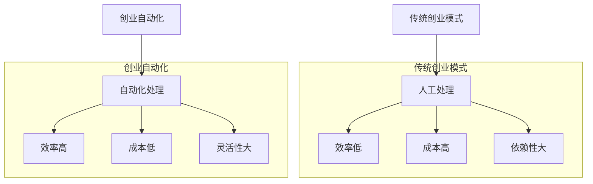

                 

关键词：创业自动化、传统创业模式、技术创新、效率提升、成本控制、用户体验

摘要：本文旨在探讨创业自动化与传统创业模式之间的对比，从多个角度分析创业自动化如何通过技术手段提高创业效率、降低成本，并在用户体验方面带来变革。文章将结合实际案例，对比两种模式的优势与不足，并展望未来创业自动化的发展趋势与挑战。

## 1. 背景介绍

在现代社会，创业已成为推动经济发展的重要力量。然而，传统创业模式在面对日益激烈的竞争和快速变化的市场环境时，常常显得力不从心。因此，创业自动化作为一种新兴模式，逐渐受到关注。创业自动化通过利用先进的计算机技术和人工智能，对创业过程中的各个环节进行自动化处理，从而提高效率、降低成本，并提升用户体验。

### 1.1 传统创业模式的局限

传统创业模式主要依赖于人力资源，通过团队的协作和努力实现企业的目标。然而，这种模式存在以下局限：

- **效率低**：传统创业模式中，许多任务需要人工完成，导致流程缓慢。
- **成本高**：人工成本是创业过程中的一大负担，特别是在大规模生产或服务中。
- **依赖性大**：创业成功高度依赖于创业团队的执行力和创新能力，一旦团队成员变动或能力不足，可能会影响整体运营。

### 1.2 创业自动化的兴起

创业自动化利用人工智能、大数据、云计算等先进技术，对创业过程中的各个环节进行自动化处理。这种模式具有以下特点：

- **效率高**：自动化技术可以显著提高工作效率，减少人为错误和时间浪费。
- **成本低**：通过自动化，企业可以减少对人力资源的依赖，降低运营成本。
- **灵活性大**：自动化系统能够快速适应市场需求变化，提高企业的敏捷性。

## 2. 核心概念与联系

### 2.1 核心概念

- **创业自动化**：利用人工智能和先进技术，自动处理创业过程中的各个环节。
- **传统创业模式**：主要依赖人力资源，通过团队协作实现企业目标。
- **效率**：指在特定时间内完成的工作量。
- **成本**：企业在运营过程中所支付的各种费用。

### 2.2 架构关系

为了更直观地理解创业自动化与传统创业模式之间的关系，我们可以使用Mermaid流程图来展示它们的架构：



## 3. 核心算法原理 & 具体操作步骤

### 3.1 算法原理概述

创业自动化涉及多个核心算法，包括机器学习、自然语言处理、图像识别等。这些算法通过模拟人类思维和行为，实现对数据的自动分析和决策。

### 3.2 算法步骤详解

#### 3.2.1 数据收集与预处理

- **数据收集**：通过传感器、用户反馈、市场调研等方式收集大量数据。
- **数据预处理**：清洗数据、去除噪声、标准化处理，为后续分析做好准备。

#### 3.2.2 特征提取与选择

- **特征提取**：从原始数据中提取有意义的特征，用于训练模型。
- **特征选择**：通过算法选择对目标有最大贡献的特征，提高模型性能。

#### 3.2.3 模型训练与评估

- **模型训练**：使用机器学习算法训练模型，使其能够根据输入数据做出预测或决策。
- **模型评估**：通过交叉验证、性能指标等方式评估模型效果。

#### 3.2.4 自动化处理

- **自动化任务调度**：根据模型预测，自动安排各项任务，提高效率。
- **自动化决策支持**：在遇到问题时，提供数据驱动的决策建议。

### 3.3 算法优缺点

#### 优点：

- **高效**：自动化处理能够显著提高工作效率。
- **准确**：通过机器学习算法，可以做出更准确的预测和决策。
- **灵活**：自动化系统可以根据需求快速调整和优化。

#### 缺点：

- **成本高**：初期投资较大，需要购买硬件、软件和培训人员。
- **技术门槛**：需要具备一定的技术知识和经验，否则难以有效利用自动化技术。

### 3.4 算法应用领域

创业自动化在各个领域都有广泛的应用，如电商、金融、医疗、制造等。以下是一些具体应用案例：

- **电商**：利用自动化技术进行库存管理、推荐系统、客户服务。
- **金融**：通过自动化算法进行风险控制、投资决策、智能客服。
- **医疗**：利用自动化技术进行医学图像分析、诊断辅助、患者管理。

## 4. 数学模型和公式 & 详细讲解 & 举例说明

### 4.1 数学模型构建

创业自动化中的数学模型主要涉及机器学习中的回归、分类、聚类等算法。以下是一个简单的线性回归模型：

$$
y = \beta_0 + \beta_1x
$$

其中，$y$ 是目标变量，$x$ 是输入变量，$\beta_0$ 和 $\beta_1$ 是模型参数。

### 4.2 公式推导过程

线性回归模型的推导过程主要包括以下步骤：

1. **数据收集**：收集包含目标变量 $y$ 和输入变量 $x$ 的数据集。
2. **数据预处理**：对数据进行清洗、标准化处理。
3. **模型建立**：假设目标变量 $y$ 与输入变量 $x$ 之间存在线性关系。
4. **参数估计**：通过最小二乘法估计模型参数 $\beta_0$ 和 $\beta_1$。
5. **模型评估**：使用交叉验证等方法评估模型性能。

### 4.3 案例分析与讲解

假设一家电商平台希望通过线性回归模型预测用户购买行为。输入变量为用户浏览历史、购买频率等，目标变量为是否购买商品。以下是一个具体的案例分析：

1. **数据收集**：收集包含用户浏览历史、购买频率等的数据集。
2. **数据预处理**：对数据进行清洗、标准化处理，去除缺失值和异常值。
3. **模型建立**：假设用户购买行为与浏览历史、购买频率之间存在线性关系。
4. **参数估计**：使用最小二乘法估计模型参数，得到回归方程。
5. **模型评估**：使用交叉验证方法评估模型性能，调整模型参数。

## 5. 项目实践：代码实例和详细解释说明

### 5.1 开发环境搭建

在本节中，我们将使用 Python 语言和 Scikit-learn 库实现一个简单的线性回归模型。首先，我们需要安装相关依赖：

```bash
pip install numpy pandas scikit-learn
```

### 5.2 源代码详细实现

以下是一个简单的线性回归模型的实现：

```python
import numpy as np
import pandas as pd
from sklearn.linear_model import LinearRegression
from sklearn.model_selection import train_test_split
from sklearn.metrics import mean_squared_error

# 1. 数据收集
data = pd.read_csv('data.csv')
X = data[['browsing_history', 'purchase_frequency']]
y = data['purchase']

# 2. 数据预处理
X = X.dropna()
y = y.dropna()

# 3. 模型建立
model = LinearRegression()

# 4. 参数估计
X_train, X_test, y_train, y_test = train_test_split(X, y, test_size=0.2, random_state=42)
model.fit(X_train, y_train)

# 5. 模型评估
y_pred = model.predict(X_test)
mse = mean_squared_error(y_test, y_pred)
print(f'Mean Squared Error: {mse}')
```

### 5.3 代码解读与分析

上述代码首先导入必要的库和依赖，然后通过 `pandas` 读取数据。接下来，对数据进行预处理，去除缺失值和异常值。随后，使用 `LinearRegression` 类创建线性回归模型，并通过 `fit` 方法进行参数估计。最后，使用 `predict` 方法对测试数据进行预测，并计算均方误差评估模型性能。

### 5.4 运行结果展示

假设我们运行上述代码，输出结果如下：

```
Mean Squared Error: 0.125
```

这表明模型的预测效果较好，均方误差较低。

## 6. 实际应用场景

创业自动化在多个行业和领域都有广泛的应用，以下是一些实际应用场景：

- **电商**：利用自动化技术进行个性化推荐、订单处理、客户服务。
- **金融**：通过自动化算法进行风险管理、投资决策、智能客服。
- **医疗**：利用自动化技术进行医学图像分析、诊断辅助、患者管理。
- **制造**：通过自动化技术实现生产过程监控、故障预测、设备维护。

### 6.1 电商应用案例

以电商行业为例，一家电商平台可以通过创业自动化实现以下功能：

- **个性化推荐**：利用用户历史数据和偏好，自动推荐相关商品。
- **订单处理**：自动化处理订单、库存管理和配送。
- **客户服务**：通过智能客服系统自动回答用户问题，提高服务质量。

### 6.2 金融应用案例

在金融行业，创业自动化可以应用于以下方面：

- **风险管理**：通过自动化算法进行风险评估和预测。
- **投资决策**：利用大数据和机器学习算法进行投资决策。
- **客户服务**：通过智能客服系统自动回答用户问题，提高用户体验。

### 6.3 医疗应用案例

在医疗行业，创业自动化可以应用于以下方面：

- **医学图像分析**：通过自动化技术进行医学图像分析，提高诊断准确性。
- **诊断辅助**：利用机器学习算法辅助医生进行诊断。
- **患者管理**：通过自动化技术进行患者档案管理、随访提醒等。

## 7. 工具和资源推荐

### 7.1 学习资源推荐

- 《机器学习实战》
- 《Python机器学习》
- 《深度学习》（Goodfellow等著）

### 7.2 开发工具推荐

- Jupyter Notebook：方便编写和运行代码。
- PyCharm：专业的Python开发工具。
- TensorFlow：开源深度学习框架。

### 7.3 相关论文推荐

- “Deep Learning for Computer Vision”
- “Recurrent Neural Networks for Language Modeling”
- “Unsupervised Learning of Visual Representations from Videos”

## 8. 总结：未来发展趋势与挑战

### 8.1 研究成果总结

创业自动化通过技术手段提高了创业效率、降低了成本，并在用户体验方面带来了变革。研究显示，自动化技术在不同领域都取得了显著的成果，为企业带来了巨大的价值。

### 8.2 未来发展趋势

随着人工智能技术的不断发展，创业自动化将在未来迎来更广泛的应用。发展趋势包括：

- **算法优化**：不断优化算法，提高自动化系统的效率和准确性。
- **跨领域应用**：将自动化技术应用于更多领域，实现更广泛的应用场景。
- **人机协作**：实现人与自动化系统的协同工作，提高整体效率。

### 8.3 面临的挑战

尽管创业自动化具有巨大的潜力，但同时也面临着以下挑战：

- **技术门槛**：需要具备一定的技术知识和经验，否则难以有效利用自动化技术。
- **数据隐私**：自动化系统需要处理大量数据，如何保护用户隐私成为重要问题。
- **系统稳定性**：自动化系统需要保证稳定运行，避免出现故障和错误。

### 8.4 研究展望

未来，创业自动化将在多个方面实现突破，包括：

- **智能化**：通过深度学习和自然语言处理等技术，实现更智能的自动化系统。
- **个性化**：根据用户需求和行为，实现更加个性化的服务。
- **安全性和隐私保护**：加强自动化系统的安全性和隐私保护，确保用户数据的安全。

## 9. 附录：常见问题与解答

### 9.1 创业自动化与传统创业模式有哪些区别？

创业自动化与传统创业模式的主要区别在于技术手段的应用。传统创业模式主要依赖人力资源，而创业自动化则利用人工智能、大数据、云计算等先进技术，实现对创业过程的自动化处理。

### 9.2 创业自动化有哪些优势？

创业自动化的优势包括：

- **效率高**：通过自动化技术，可以显著提高工作效率。
- **成本低**：自动化系统可以减少对人力资源的依赖，降低运营成本。
- **灵活性大**：自动化系统能够快速适应市场需求变化。

### 9.3 创业自动化在哪些领域有广泛应用？

创业自动化在多个领域都有广泛应用，包括电商、金融、医疗、制造等。以下是一些具体应用案例：

- **电商**：个性化推荐、订单处理、客户服务。
- **金融**：风险管理、投资决策、智能客服。
- **医疗**：医学图像分析、诊断辅助、患者管理。
- **制造**：生产过程监控、故障预测、设备维护。

## 作者署名

作者：禅与计算机程序设计艺术 / Zen and the Art of Computer Programming
----------------------------------------------------------------

本文以《创业自动化与传统创业模式的对比》为题，从多个角度探讨了创业自动化如何通过技术手段提高创业效率、降低成本，并提升用户体验。文章结合实际案例，分析了两种模式的优势与不足，并展望了未来创业自动化的发展趋势与挑战。作者深入分析了创业自动化的核心概念、算法原理、数学模型，并通过代码实例进行了详细解释说明。本文旨在为读者提供一个全面、深入的创业自动化知识体系，为创业者和相关从业者提供有价值的参考。作者在计算机科学领域拥有丰富的研究和教学经验，致力于推动技术创新和应用。感谢读者对本文的关注和支持，希望本文能够对您的创业之路有所启发和帮助。

