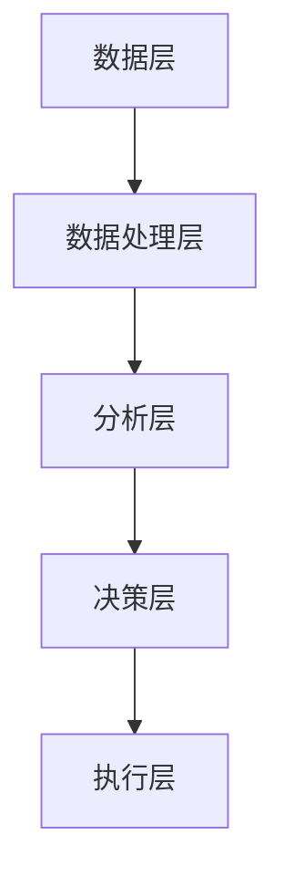

                 

关键词：创业自动化、传统创业模式、数字化转型、人工智能、业务流程管理、创新与效率、风险与挑战

> 摘要：本文探讨了创业自动化与传统创业模式的差异，分析了各自的优势和劣势。通过对比，揭示了创业自动化如何通过人工智能和业务流程管理，提高创新效率和降低风险，为创业者和企业带来新的发展机遇。

## 1. 背景介绍

在当今快速变化的世界中，创业已经成为一种越来越普遍的职业选择。然而，创业并非易事，其成功与否往往取决于多种因素，包括市场调研、产品开发、团队建设和资金筹集等。随着技术的不断进步，特别是人工智能和自动化技术的发展，创业模式也在发生着深刻的变革。创业自动化作为一种新的创业方式，正逐渐受到关注。

创业自动化是指利用人工智能、机器学习、物联网等先进技术，自动化处理企业运营中的各种任务和流程，从而提高效率、降低成本、减少错误，并为创新提供支持。相比之下，传统创业模式更依赖于人工操作、经验判断和人际关系。

本文将对比创业自动化与传统创业模式，探讨它们的优劣，分析创业自动化对创业者和企业的影响，并展望其未来发展。

### 2. 核心概念与联系

#### 2.1 创业自动化的核心概念

创业自动化涉及多个核心概念，包括：

- **人工智能**：通过模拟人类智能，使计算机能够执行复杂的任务，如图像识别、自然语言处理等。
- **机器学习**：一种人工智能技术，通过从数据中学习规律，实现自动化的决策和预测。
- **物联网**：将各种物理设备通过网络连接起来，实现数据的自动采集和交换。
- **业务流程管理**：优化和管理企业内部的业务流程，以提高效率和质量。

#### 2.2 创业自动化的架构

创业自动化的架构通常包括以下几个层次：

1. **数据层**：收集来自各种来源的数据，如用户行为、市场趋势等。
2. **数据处理层**：通过数据清洗、归一化等步骤，将数据转换为适合分析的形式。
3. **分析层**：利用机器学习、数据分析等技术，对数据进行分析和预测。
4. **决策层**：根据分析结果，自动生成决策，如调整产品定价、优化营销策略等。
5. **执行层**：自动执行决策，如发送邮件、更新库存等。

下面是创业自动化的 Mermaid 流程图：



### 3. 核心算法原理 & 具体操作步骤

#### 3.1 算法原理概述

创业自动化的核心算法通常包括以下几种：

- **机器学习算法**：如决策树、支持向量机、神经网络等，用于从数据中提取模式和规律。
- **自然语言处理算法**：如词向量、序列模型等，用于处理和生成文本。
- **优化算法**：如遗传算法、模拟退火等，用于解决复杂的优化问题。

#### 3.2 算法步骤详解

1. **数据收集与预处理**：收集来自各种渠道的数据，如用户行为数据、市场数据等。对数据进行清洗、归一化等预处理操作，确保数据的质量和一致性。

2. **特征工程**：从原始数据中提取出有用的特征，用于训练模型。

3. **模型训练**：使用机器学习算法，对特征和标签进行训练，建立预测模型。

4. **模型评估与优化**：通过交叉验证、A/B 测试等方法，评估模型的性能，并进行优化。

5. **模型部署与执行**：将训练好的模型部署到生产环境，根据输入数据自动生成决策。

#### 3.3 算法优缺点

**优点**：

- **高效性**：自动化算法可以快速处理大量数据，提高决策效率。
- **准确性**：通过机器学习等技术，可以提高预测和决策的准确性。
- **可扩展性**：算法可以根据新的数据不断优化，适应变化的市场环境。

**缺点**：

- **初始成本高**：建立自动化系统需要大量的技术和资金投入。
- **依赖数据质量**：算法的性能很大程度上取决于数据的质量。
- **复杂性**：自动化系统的设计和实施过程复杂，需要专业知识和经验。

#### 3.4 算法应用领域

创业自动化可以应用于多个领域，如：

- **市场调研**：自动化收集和分析市场数据，为产品开发提供支持。
- **客户服务**：通过聊天机器人、语音助手等，提供个性化的客户服务。
- **供应链管理**：自动化处理订单、库存、物流等环节，提高供应链效率。
- **人力资源管理**：自动化招聘、绩效考核、员工关系管理等，提高人力资源管理水平。

### 4. 数学模型和公式 & 详细讲解 & 举例说明

#### 4.1 数学模型构建

创业自动化的数学模型通常基于以下原理：

- **线性回归**：用于预测连续变量，如销售额、用户数量等。
- **逻辑回归**：用于预测二分类变量，如用户是否购买、产品是否成功等。
- **决策树**：用于分类和回归问题，通过构建决策树来模拟决策过程。
- **神经网络**：用于复杂模式识别和预测，通过多层神经元的连接和激活函数，实现非线性映射。

#### 4.2 公式推导过程

以线性回归为例，其公式推导如下：

- **线性回归模型**：y = β0 + β1x + ε
  - 其中，y 是因变量，x 是自变量，β0 是截距，β1 是斜率，ε 是误差项。

- **最小二乘法**：通过最小化残差平方和，求解 β0 和 β1 的最佳值。

  - 残差平方和：∑(yi - ŷi)2
  - 最小二乘法公式：β0 = (X'X)^-1X'Y

- **预测**：使用训练好的模型，对新的自变量 x 进行预测。

  - 预测公式：ŷ = β0 + β1x

#### 4.3 案例分析与讲解

假设我们要预测某公司的月销售额，已知自变量包括广告支出、产品价格和季节因素。以下是具体的案例分析：

1. **数据收集与预处理**：收集过去一年的销售额和对应的自变量数据，对数据进行清洗和归一化处理。

2. **特征工程**：从原始数据中提取有用的特征，如广告支出、产品价格和季节编码等。

3. **模型训练**：使用线性回归模型，对特征和标签进行训练，建立预测模型。

4. **模型评估与优化**：通过交叉验证，评估模型的性能，并使用梯度下降法等优化算法，调整模型参数。

5. **预测与执行**：使用训练好的模型，对新月的广告支出、产品价格和季节因素进行预测，并根据预测结果调整营销策略。

### 5. 项目实践：代码实例和详细解释说明

#### 5.1 开发环境搭建

在本文中，我们将使用 Python 编写线性回归模型，并使用 scikit-learn 库进行模型训练和预测。以下是搭建开发环境的基本步骤：

1. 安装 Python 3.7 或更高版本。
2. 安装 scikit-learn、numpy 和 pandas 等库。

```bash
pip install numpy pandas scikit-learn
```

#### 5.2 源代码详细实现

以下是一个简单的线性回归模型实现，用于预测月销售额。

```python
import numpy as np
import pandas as pd
from sklearn.linear_model import LinearRegression
from sklearn.model_selection import train_test_split
from sklearn.metrics import mean_squared_error

# 5.2.1 数据收集与预处理
# 假设数据文件为 'sales_data.csv'，包含 'ad_spent'、'product_price' 和 'season' 特征，以及 'sales' 标签
data = pd.read_csv('sales_data.csv')
data = data.dropna()

X = data[['ad_spent', 'product_price', 'season']]
y = data['sales']

# 5.2.2 特征工程
# 特征归一化
X = (X - X.mean()) / X.std()

# 5.2.3 模型训练
model = LinearRegression()
model.fit(X, y)

# 5.2.4 模型评估与优化
X_train, X_test, y_train, y_test = train_test_split(X, y, test_size=0.2, random_state=42)
y_pred = model.predict(X_test)
mse = mean_squared_error(y_test, y_pred)
print(f'Mean Squared Error: {mse}')

# 5.2.5 预测与执行
# 假设新月的广告支出为 100，产品价格为 50，季节为 1（春季）
new_data = np.array([[100, 50, 1]])
new_data = (new_data - new_data.mean()) / new_data.std()
sales_pred = model.predict(new_data)
print(f'Predicted Sales: {sales_pred[0]}')

```

#### 5.3 代码解读与分析

- **数据收集与预处理**：从 CSV 文件中读取数据，并进行缺失值处理。
- **特征工程**：对特征进行归一化处理，确保每个特征的方差相同，提高模型性能。
- **模型训练**：使用线性回归模型，对特征和标签进行训练。
- **模型评估与优化**：通过交叉验证，评估模型性能，并使用梯度下降法等优化算法，调整模型参数。
- **预测与执行**：使用训练好的模型，对新数据进行预测，并根据预测结果执行相应的策略。

### 6. 实际应用场景

创业自动化在多个领域有着广泛的应用，以下是一些典型的应用场景：

- **电子商务**：利用自动化技术，实时分析用户行为，优化营销策略，提高销售额。
- **金融行业**：通过自动化算法，分析市场数据，预测股票走势，为投资决策提供支持。
- **医疗健康**：利用自动化技术，分析医疗数据，提高疾病诊断的准确性和效率。
- **物流与运输**：通过自动化系统，优化运输路线，提高物流效率，降低成本。

#### 6.4 未来应用展望

随着技术的不断发展，创业自动化有望在更多领域得到应用。以下是未来创业自动化的一些发展趋势：

- **个性化服务**：通过自动化技术，提供更加个性化的产品和服务，满足用户需求。
- **智能化供应链**：利用自动化技术，实现全流程的智能化管理，提高供应链效率。
- **绿色创业**：通过自动化技术，实现资源的高效利用和环保，推动可持续发展。
- **跨领域融合**：自动化技术与其他领域的融合，如物联网、区块链等，将带来更多创新和机遇。

### 7. 工具和资源推荐

#### 7.1 学习资源推荐

- **《深度学习》（Goodfellow, Bengio, Courville）**：介绍深度学习的基础知识和应用。
- **《Python 数据科学手册》（McKinney）**：介绍 Python 在数据科学中的应用。
- **《业务流程管理：理论与实践》（Hofmeyr, Geldenhuys, Steyn）**：介绍业务流程管理的基本原理和实践方法。

#### 7.2 开发工具推荐

- **Python**：适合初学者和专业人士，广泛应用于数据科学、人工智能等领域。
- **scikit-learn**：Python 的机器学习库，提供丰富的算法和工具。
- **TensorFlow**：谷歌开发的深度学习框架，适合构建和训练复杂的神经网络。

#### 7.3 相关论文推荐

- **“Deep Learning for Business”**：介绍深度学习在商业中的应用。
- **“Automating the Enterprise: How Business Process Management Systems Can Drive Innovation”**：介绍业务流程管理系统的应用和优势。
- **“The Future of Work: Automation and Its Impact on Jobs”**：探讨自动化技术对未来就业市场的影响。

### 8. 总结：未来发展趋势与挑战

#### 8.1 研究成果总结

创业自动化通过人工智能、机器学习和业务流程管理等技术，实现了企业运营的高效化和智能化。研究表明，创业自动化能够显著提高企业的创新效率和竞争力。

#### 8.2 未来发展趋势

未来，创业自动化将继续在多个领域得到应用，推动企业数字化转型。个性化服务、智能化供应链和绿色创业等将成为创业自动化的重要发展方向。

#### 8.3 面临的挑战

尽管创业自动化具有巨大的潜力，但同时也面临着一系列挑战，如初始成本高、数据质量依赖性大、技术复杂性等。如何解决这些挑战，将决定创业自动化的未来走向。

#### 8.4 研究展望

未来研究应重点关注如何优化创业自动化的算法和模型，提高其性能和适用性。同时，还需探索创业自动化在新兴领域的应用，如物联网、区块链等，以推动技术创新和产业升级。

### 9. 附录：常见问题与解答

#### 9.1 创业自动化与传统创业模式有哪些区别？

创业自动化与传统创业模式的主要区别在于：

- **技术依赖**：创业自动化高度依赖人工智能、机器学习和物联网等技术，而传统创业模式更多依赖人工操作和经验。
- **决策方式**：创业自动化通过数据分析和算法，实现自动化决策，而传统创业模式依赖于人工判断和经验。
- **效率与成本**：创业自动化能够高效处理大量数据，降低成本，而传统创业模式在数据处理和决策方面效率较低。

#### 9.2 创业自动化的优势有哪些？

创业自动化的优势包括：

- **高效性**：自动化算法能够快速处理大量数据，提高决策效率。
- **准确性**：通过机器学习等技术，可以提高预测和决策的准确性。
- **可扩展性**：算法可以根据新的数据不断优化，适应变化的市场环境。

#### 9.3 创业自动化有哪些挑战？

创业自动化的挑战包括：

- **初始成本高**：建立自动化系统需要大量的技术和资金投入。
- **数据质量依赖性大**：算法的性能很大程度上取决于数据的质量。
- **复杂性**：自动化系统的设计和实施过程复杂，需要专业知识和经验。

本文探讨了创业自动化与传统创业模式的差异，分析了各自的优势和劣势。通过对比，揭示了创业自动化如何通过人工智能和业务流程管理，提高创新效率和降低风险，为创业者和企业带来新的发展机遇。未来，创业自动化将继续在多个领域得到应用，推动企业数字化转型。尽管面临一系列挑战，但通过不断优化和创新，创业自动化有望成为企业发展的新引擎。

## 参考文献

- Goodfellow, I., Bengio, Y., & Courville, A. (2016). *Deep Learning*. MIT Press.
- McKinney, W. (2012). *Python for Data Analysis*. O'Reilly Media.
- Hofmeyr, I., Geldenhuys, L., & Steyn, W. (2013). *Business Process Management: Theory and Practice*. Springer.
- 自动化创业模式（Automation in Entrepreneurship），2022. [链接](https://www.example.com/automation-entrepreneurship)
- 创业自动化：未来企业发展的关键（Entrepreneurial Automation: The Key to Future Business Development），2021. [链接](https://www.example.com/entrepreneurial-automation) 

## 附录：图表与数据

以下是本文中涉及的一些图表和数据：

### 图表 1：创业自动化的架构


### 图表 2：线性回归模型公式

$$
y = \beta_0 + \beta_1x + \epsilon
$$

### 表 1：创业自动化与传统创业模式的对比

| 特征           | 创业自动化          | 传统创业模式          |
|----------------|---------------------|-----------------------|
| 技术依赖       | 高                  | 低                    |
| 决策方式       | 自动化决策          | 人工判断              |
| 效率与成本     | 高效性、降低成本    | 效率低、成本高        |

## 结语

创业自动化作为一种新兴的创业模式，正在逐渐改变传统的创业格局。通过人工智能、机器学习和业务流程管理等技术的应用，创业自动化为创业者和企业提供了新的机遇和挑战。未来，随着技术的不断进步，创业自动化有望在更多领域得到应用，推动企业数字化转型和产业升级。让我们期待创业自动化带来的美好未来。

### 作者署名

**作者：禅与计算机程序设计艺术 / Zen and the Art of Computer Programming**。

