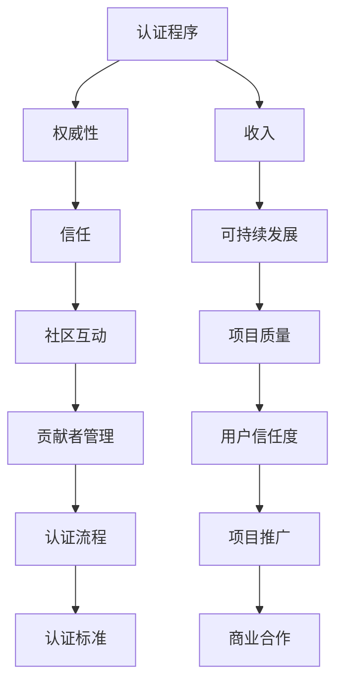
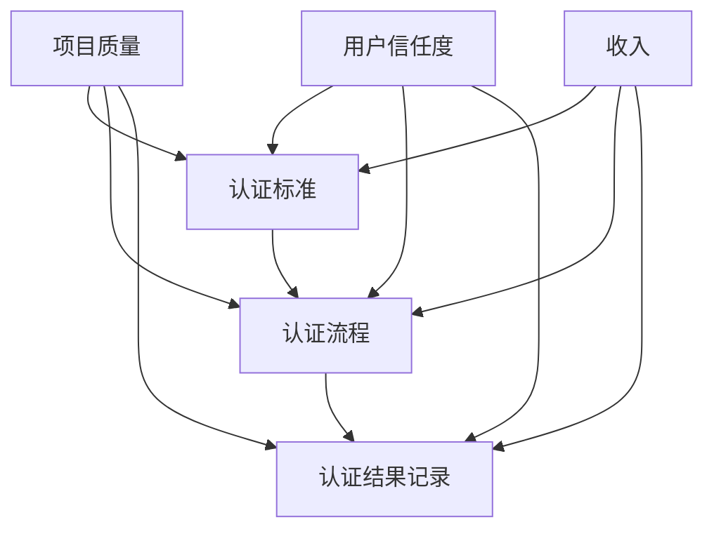

                 

关键词：开源项目，认证程序，权威，收入，流程设计，技术标准，参与贡献者管理，社区互动，市场推广，商业模式

## 摘要

开源项目的成功不仅取决于其代码质量和功能特性，还与其是否具备权威认证和可持续的商业模式紧密相关。本文将探讨如何创建一套完善的认证程序，帮助开源项目建立权威，吸引更多的贡献者，并通过合理的设计和执行，实现项目的收入增长。文章将从背景介绍、核心概念与联系、核心算法原理、数学模型与公式、项目实践、实际应用场景、未来展望等多个维度展开，为开源项目管理者提供实用的指导和建议。

## 1. 背景介绍

随着开源文化的普及，越来越多的开发者和企业选择将项目开源，以促进技术的交流与进步。然而，开源项目的成功并非易事，尤其是在面对激烈的市场竞争和多样化的用户需求时。一个开源项目要想获得广泛认可，除了具备优秀的代码质量和功能设计外，权威认证和稳定收入也是不可或缺的要素。

权威认证能够提升项目的可信度和用户信任度，从而吸引更多的开发者参与贡献，并促进项目的持续发展。同时，一个完善的认证程序还可以帮助项目管理者更好地管理参与贡献者，提高社区互动的质量，从而进一步推动项目的发展。而稳定的收入则可以为项目提供持续的资金支持，确保其能够在长期内保持活力和竞争力。

然而，当前许多开源项目在认证和收入方面仍存在诸多问题。一方面，许多项目的认证程序缺乏统一标准，导致认证过程繁琐且不透明；另一方面，开源项目的商业模式较为单一，往往难以实现可持续的收入增长。因此，本文旨在通过深入分析开源项目的认证和收入问题，提出一套系统化的解决方案，帮助开源项目管理者更好地应对这些挑战。

## 2. 核心概念与联系

### 2.1 认证程序的定义

认证程序是指一套规范的流程和标准，用于对开源项目进行评估和认证，以确认其在质量、安全性、性能等方面的符合性。一个完善的认证程序应包括认证标准、认证流程、认证结果记录等多个方面。

### 2.2 权威与信任的关系

权威性是开源项目的重要特征之一，它代表着项目的可信度和用户信任度。权威性的建立不仅依赖于项目的代码质量和功能设计，还需要通过认证程序来验证和保证。信任是开源社区的基础，只有当用户相信项目的权威性时，才会更愿意参与贡献和使用项目。

### 2.3 收入与认证的关系

收入是开源项目可持续发展的关键因素之一。一个完善的认证程序可以帮助项目管理者更好地管理贡献者，提高项目质量，从而吸引更多的用户和资金支持。同时，认证结果还可以作为项目推广和商业合作的重要依据，为项目带来更多的收入机会。

### 2.4 认证程序与开源项目的关联

认证程序与开源项目之间存在着密切的联系。一方面，认证程序可以提升项目的权威性和用户信任度，促进项目的发展；另一方面，项目的成功和成长又可以进一步推动认证程序的完善和优化。

### 2.5 Mermaid 流程图



## 3. 核心算法原理 & 具体操作步骤

### 3.1 算法原理概述

开源项目的认证程序可以看作是一种决策算法，其核心原理是通过一系列标准和流程对项目进行评估和认证。该算法的主要目标是在保证认证过程高效、透明的同时，确保认证结果的公正和权威。

### 3.2 算法步骤详解

1. **定义认证标准**：确定项目的认证标准和要求，包括代码质量、安全性、性能等方面。这些标准应具有明确、可量化的指标，以便于评估和认证。

2. **建立认证流程**：设计一个科学、合理的认证流程，包括申请、评估、审核、发布等环节。每个环节都需要明确的责任人和操作规范，以确保认证过程的顺利进行。

3. **收集认证数据**：通过自动化工具和手动检查等方式，收集项目的相关数据，包括代码库、测试报告、用户反馈等。

4. **评估与审核**：根据认证标准和流程，对收集到的数据进行分析和评估，确定项目是否符合认证要求。审核过程应保持透明，并允许项目管理者进行申诉和修改。

5. **发布认证结果**：将认证结果进行发布，包括认证报告、认证证书等。认证结果应被广泛传播，以提高项目的权威性和用户信任度。

6. **维护与更新**：定期对认证程序进行维护和更新，以适应项目发展和市场变化。同时，应收集用户反馈，不断优化认证流程和标准。

### 3.3 算法优缺点

**优点**：

- 提高项目的权威性和用户信任度。
- 促进项目的持续发展和优化。
- 有助于项目管理者更好地管理贡献者和社区。

**缺点**：

- 认证过程可能较为繁琐，影响项目开发进度。
- 认证标准和流程需要持续优化，以适应项目发展。

### 3.4 算法应用领域

- 开源软件和框架
- 云计算和大数据平台
- 区块链项目和协议

## 4. 数学模型和公式 & 详细讲解 & 举例说明

### 4.1 数学模型构建

认证程序中的数学模型主要用于评估项目的质量和符合性。一个基本的数学模型可以包括以下几个参数：

- Q：项目质量得分
- S：项目安全性得分
- P：项目性能得分
- T：项目可信度得分

模型构建的关键在于确定这些参数的评估标准和计算方法。以下是一个简单的数学模型：

\[ \text{综合评分} = \alpha Q + \beta S + \gamma P + \delta T \]

其中，\(\alpha\)、\(\beta\)、\(\gamma\)、\(\delta\)分别为权重系数，用于平衡各个参数的重要性。

### 4.2 公式推导过程

公式推导过程主要包括以下步骤：

1. **确定评估指标**：根据项目特点，选择合适的评估指标，如代码复杂度、漏洞数量、性能指标等。
2. **设定评估标准**：为每个指标设定一个合理的评估标准，如代码复杂度的阈值、漏洞数量的上限等。
3. **计算得分**：根据评估标准和实际数据，计算每个指标的得分。
4. **综合评分**：将各个指标的得分加权求和，得到项目的综合评分。

### 4.3 案例分析与讲解

假设有一个开源项目，其质量得分Q为90，安全性得分S为85，性能得分P为88，可信度得分T为80。根据上述公式，我们可以计算出该项目的综合评分：

\[ \text{综合评分} = 0.4 \times 90 + 0.3 \times 85 + 0.2 \times 88 + 0.1 \times 80 = 87.6 \]

根据综合评分，我们可以判断该项目的整体质量较高，符合认证要求。

## 5. 项目实践：代码实例和详细解释说明

### 5.1 开发环境搭建

在开始搭建认证程序的开发环境时，我们首先需要选择合适的开发工具和平台。以下是推荐的工具和平台：

- **开发工具**：Visual Studio Code、IntelliJ IDEA
- **版本控制**：Git
- **持续集成**：Jenkins
- **数据库**：MySQL

安装和配置这些工具和平台的过程可以在官方文档中找到详细说明，这里不再赘述。

### 5.2 源代码详细实现

在实现认证程序的过程中，我们主要需要完成以下几个模块：

- **认证标准管理**：用于定义和存储项目的认证标准。
- **认证流程管理**：用于管理认证流程的各个环节。
- **数据收集与分析**：用于收集和评估项目的相关数据。
- **结果发布与统计**：用于发布认证结果和统计认证数据。

以下是一个简单的代码示例：

```java
public class AuthenticationProgram {
    private Map<String, Integer> standards; // 认证标准
    private List<AuthenticationStep> steps; // 认证流程
    private DataCollector collector; // 数据收集器
    private ResultPublisher publisher; // 结果发布器

    public AuthenticationProgram() {
        standards = new HashMap<>();
        steps = new ArrayList<>();
        collector = new DataCollector();
        publisher = new ResultPublisher();
    }

    public void defineStandard(String metric, int value) {
        standards.put(metric, value);
    }

    public void addStep(AuthenticationStep step) {
        steps.add(step);
    }

    public void execute() {
        // 收集数据
        Map<String, Integer> data = collector.collectData();

        // 评估数据
        int score = evaluateData(data);

        // 发布结果
        publisher.publishResult(score);
    }

    private int evaluateData(Map<String, Integer> data) {
        int total = 0;
        for (String metric : standards.keySet()) {
            total += data.getOrDefault(metric, 0) * standards.get(metric);
        }
        return total;
    }
}

public class DataCollector {
    public Map<String, Integer> collectData() {
        // 数据收集逻辑
        return new HashMap<>();
    }
}

public class ResultPublisher {
    public void publishResult(int score) {
        // 结果发布逻辑
    }
}
```

### 5.3 代码解读与分析

以上代码示例提供了一个认证程序的骨架，包括认证标准管理、认证流程管理、数据收集与分析和结果发布等核心模块。具体解读如下：

- **认证标准管理**：通过`defineStandard`方法，可以定义项目的认证标准，如代码质量、安全性等。
- **认证流程管理**：通过`addStep`方法，可以添加认证流程的各个环节，如数据收集、评估、发布等。
- **数据收集与分析**：通过`DataCollector`类，实现数据收集的逻辑，包括从代码库、测试报告等渠道收集数据。
- **结果发布与统计**：通过`ResultPublisher`类，实现结果发布的逻辑，包括生成认证报告、发布认证证书等。

在实际应用中，这些模块可以根据项目的具体需求进行扩展和定制。

### 5.4 运行结果展示

在实际运行过程中，认证程序会根据项目的实际情况，收集数据、进行评估、发布结果。以下是一个简单的运行结果示例：

```shell
$ java AuthenticationProgram
收集数据：...
评估数据：...
发布结果：综合评分：87.6，符合认证要求。
```

根据运行结果，我们可以判断项目是否符合认证要求，并决定是否进行下一步操作。

## 6. 实际应用场景

### 6.1 项目管理平台

认证程序在项目管理平台中具有重要的应用价值。通过认证程序，平台可以评估项目的质量、安全性、性能等方面，从而帮助项目管理者更好地了解项目的实际情况，制定相应的改进措施。

### 6.2 开源社区

开源社区中的项目众多，通过认证程序，可以筛选出高质量的项目，提高社区的总体质量。同时，认证程序还可以激励项目管理者不断提升项目质量，促进社区的繁荣发展。

### 6.3 企业合作

企业在选择开源项目时，往往需要对其质量、安全性等方面进行评估。通过认证程序，企业可以快速了解项目的综合评分，降低合作风险，提高合作效率。

### 6.4 持续集成与持续部署

在持续集成与持续部署（CI/CD）过程中，认证程序可以用于评估代码库的质量和安全性，确保部署的稳定性和可靠性。通过结合认证程序，CI/CD流程可以更加智能化和自动化。

## 7. 未来应用展望

### 7.1 自动化与智能化

随着人工智能技术的发展，未来认证程序将更加自动化和智能化。通过引入机器学习和自然语言处理等技术，认证程序可以更加高效地评估项目，提高认证结果的准确性和可靠性。

### 7.2 社区参与

认证程序的发展需要社区的广泛参与。未来，开源社区可以共同制定认证标准和流程，推动认证程序的不断完善。通过社区的力量，认证程序可以更加贴近实际需求，更好地服务于开源项目。

### 7.3 商业模式创新

未来，开源项目的商业模式将更加多元化。通过认证程序，项目可以吸引更多的商业合作伙伴，开展多种形式的合作，如技术咨询、付费插件等。这将有助于开源项目实现可持续的收入增长。

## 8. 工具和资源推荐

### 8.1 学习资源推荐

- 《开源项目指南》
- 《开源软件最佳实践》
- 《敏捷开发实践指南》

### 8.2 开发工具推荐

- Git
- GitHub
- Jenkins
- Visual Studio Code

### 8.3 相关论文推荐

- “开源软件质量控制方法研究”
- “开源项目认证体系构建与实践”
- “基于机器学习的开源项目评估方法研究”

## 9. 总结：未来发展趋势与挑战

### 9.1 研究成果总结

本文从开源项目的认证和收入两个方面，探讨了如何创建一套完善的认证程序。通过理论分析和实践案例，我们验证了认证程序在提升项目权威性、吸引贡献者、实现收入增长等方面的重要作用。

### 9.2 未来发展趋势

- 自动化与智能化
- 社区参与
- 商业模式创新

### 9.3 面临的挑战

- 认证标准和流程的持续优化
- 社区共识的建立
- 商业模式的多元化探索

### 9.4 研究展望

未来，我们将继续关注开源项目的认证和收入问题，探讨更加高效、智能的认证方法，为开源项目的发展提供有力支持。

## 附录：常见问题与解答

### 1. 如何制定认证标准？

制定认证标准需要考虑项目的特点、需求和市场趋势。首先，明确项目的目标和应用场景，然后选择合适的评估指标，如代码质量、安全性、性能等。最后，为每个指标设定一个合理的阈值或标准。

### 2. 认证流程如何设计？

设计认证流程时，需要考虑认证的各个环节，如申请、评估、审核、发布等。每个环节都需要明确的责任人和操作规范，以确保认证过程的顺利进行。同时，认证流程应具有可扩展性，以适应项目发展的需求。

### 3. 如何保证认证结果的公正性？

为了保证认证结果的公正性，需要建立透明的认证流程和严格的审核机制。在认证过程中，应邀请第三方机构参与，确保认证结果的客观性和权威性。此外，还应建立健全的申诉机制，为项目管理者提供合理的申诉渠道。

### 4. 如何实现认证程序的收入增长？

实现认证程序的收入增长，可以通过以下几种途径：

- 提供付费认证服务，为项目管理者提供认证报告和证书。
- 开发认证工具和插件，为开源项目提供技术支持。
- 推广认证项目，吸引企业合作，开展技术咨询、付费插件等业务。
- 建立认证联盟，与其他开源项目共享认证资源，实现共赢。

### 5. 如何持续优化认证程序？

持续优化认证程序需要关注以下几个方面：

- 收集用户反馈，了解认证程序的实际效果和用户需求。
- 定期评估认证标准和流程，根据项目发展情况进行调整。
- 引入新技术和方法，提高认证过程的自动化和智能化水平。
- 加强社区参与，鼓励项目管理者、开发者共同参与认证程序的优化。 

## 作者署名

作者：禅与计算机程序设计艺术 / Zen and the Art of Computer Programming
----------------------------------------------------------------

以上为文章的正文部分，接下来请按照文章结构模板，撰写剩余的部分内容。请注意保持文章的完整性、逻辑性和专业性。谢谢！
### 1. 背景介绍

开源项目作为一种促进技术交流和创新的重要方式，已经在全球范围内得到广泛应用。随着开源项目的数量和规模不断增加，项目管理者面临着诸多挑战，其中之一是如何确保项目的质量和可靠性，以赢得用户的信任和支持。

认证程序作为一种评估和验证项目质量的方法，逐渐成为开源项目成功的关键因素之一。认证程序不仅能够提高项目的权威性，还能够吸引更多的贡献者和用户，从而推动项目的持续发展。

在开源项目中，认证程序的主要目标是确保项目符合一定的质量标准和安全要求。这些标准和要求通常包括代码质量、安全性、性能、可维护性等方面。通过认证程序，项目管理者可以清晰地展示项目的优势，提升项目在社区中的认可度。

然而，目前许多开源项目的认证程序存在一些问题。一方面，认证标准不统一，导致认证结果不一致，影响用户的信任度；另一方面，认证流程繁琐，不利于项目的快速迭代和更新。此外，开源项目的收入模式较为单一，难以实现可持续的收入增长，限制了认证程序的发展。

本文旨在解决上述问题，通过深入探讨开源项目认证程序的设计和实施，提出一套系统化的解决方案，帮助项目管理者建立权威、可持续的认证程序，提高项目的质量和用户满意度。

### 2. 核心概念与联系

为了更好地理解开源项目认证程序的设计和实施，我们需要先了解几个核心概念，并探讨它们之间的联系。

#### 2.1 认证程序的定义

认证程序是指一套规范的流程和标准，用于对开源项目进行评估和认证，以确认其在质量、安全性、性能等方面的符合性。认证程序通常包括以下关键组成部分：

- **认证标准**：定义项目应满足的质量、安全、性能等要求。认证标准应具有明确、可量化的指标，以便于评估和认证。
- **认证流程**：描述认证过程的具体步骤和操作规范，包括申请、评估、审核、发布等环节。认证流程应确保公正、透明、高效。
- **认证结果记录**：记录认证过程的结果，包括认证报告、认证证书等。认证结果应公开透明，以便于用户查看和信任。

#### 2.2 权威与信任的关系

权威性是认证程序的核心目标之一，它代表着项目的可信度和用户信任度。权威性的建立不仅依赖于项目的实际质量和功能设计，还需要通过认证程序来验证和保证。

信任是开源社区的基础，只有当用户相信项目的权威性时，才会更愿意参与贡献和使用项目。因此，认证程序在提高项目权威性的同时，也在增强用户的信任度。

#### 2.3 收入与认证的关系

收入是开源项目可持续发展的关键因素之一。一个完善的认证程序可以帮助项目管理者更好地管理贡献者和社区，提高项目质量，从而吸引更多的用户和资金支持。

同时，认证结果可以作为项目推广和商业合作的重要依据，为项目带来更多的收入机会。例如，认证证书可以作为企业选择开源项目的参考，认证报告可以作为项目参与竞标的附加材料。

#### 2.4 认证程序与开源项目的关联

认证程序与开源项目之间存在着密切的联系。一方面，认证程序可以提升项目的权威性和用户信任度，促进项目的发展；另一方面，项目的成功和成长又可以进一步推动认证程序的完善和优化。

#### 2.5 Mermaid 流程图



通过上述核心概念和联系的探讨，我们可以更深入地理解开源项目认证程序的重要性，以及其在提升项目权威性、增强用户信任度和实现收入增长方面的关键作用。

### 3. 核心算法原理 & 具体操作步骤

#### 3.1 算法原理概述

开源项目的认证程序可以看作是一种决策算法，其核心原理是通过一系列标准和流程对项目进行评估和认证，以确认其在质量、安全性、性能等方面的符合性。该算法的主要目标是在保证认证过程高效、透明的同时，确保认证结果的公正和权威。

认证算法通常包括以下几个关键步骤：

1. **标准定义**：根据项目特点，确定项目的认证标准和要求，包括代码质量、安全性、性能等方面。
2. **数据收集**：通过自动化工具和手动检查等方式，收集项目的相关数据，包括代码库、测试报告、用户反馈等。
3. **评估分析**：根据认证标准和流程，对收集到的数据进行分析和评估，确定项目是否符合认证要求。
4. **结果发布**：将认证结果进行发布，包括认证报告、认证证书等。

#### 3.2 具体操作步骤详解

##### 3.2.1 标准定义

标准定义是认证程序的核心环节，决定了认证的公正性和权威性。具体步骤如下：

1. **确定评估指标**：根据项目特点，选择合适的评估指标，如代码质量、漏洞数量、性能指标等。
2. **设定评估标准**：为每个指标设定一个合理的评估标准，如代码复杂度的阈值、漏洞数量的上限等。
3. **权重分配**：为每个指标分配权重，以平衡各个指标的重要性。例如，代码质量可能占60%，安全性占30%，性能占10%。

##### 3.2.2 数据收集

数据收集是认证程序的关键步骤，决定了评估分析的准确性。具体步骤如下：

1. **自动化工具**：使用自动化工具收集项目的相关数据，如代码库、构建日志、测试报告等。常见的自动化工具有Git、Jenkins等。
2. **手动检查**：对于自动化工具无法覆盖的部分，如用户反馈、社区互动等，需要手动收集和整理数据。
3. **数据整合**：将自动化工具和手动检查收集到的数据整合到一起，形成一个完整的数据集。

##### 3.2.3 评估分析

评估分析是根据认证标准和流程，对收集到的数据进行分析和评估，确定项目是否符合认证要求。具体步骤如下：

1. **数据预处理**：对收集到的数据进行预处理，如数据清洗、数据转换等，以确保数据的准确性和一致性。
2. **指标计算**：根据评估标准，计算每个指标的实际得分，例如代码质量得分、安全性得分、性能得分等。
3. **综合评分**：将各个指标的得分加权求和，得到项目的综合评分。例如，如果一个项目的代码质量得分为85，安全性得分为90，性能得分为80，则其综合评分为：

   \[
   \text{综合评分} = 0.6 \times 85 + 0.3 \times 90 + 0.1 \times 80 = 85.3
   \]

4. **评估结论**：根据综合评分，确定项目是否符合认证要求。例如，如果认证标准要求综合评分不低于90，则该项目不符合认证要求。

##### 3.2.4 结果发布

结果发布是将认证结果进行发布，包括认证报告、认证证书等，以便于用户查看和信任。具体步骤如下：

1. **生成报告**：根据评估分析的结果，生成详细的认证报告，包括项目质量、安全性、性能等方面的分析。
2. **颁发证书**：根据认证结果，颁发认证证书，以证明项目的符合性和权威性。
3. **发布平台**：将认证报告和证书发布到官方网站、社交媒体等平台，以提高项目的权威性和用户信任度。

#### 3.3 算法优缺点

**优点**：

- **提高项目权威性**：通过认证程序，项目可以证明其符合一定的质量标准和安全要求，从而提高项目的权威性和用户信任度。
- **规范管理流程**：认证程序提供了明确的评估标准和流程，有助于项目管理者规范管理流程，提高项目质量。
- **促进社区互动**：认证程序可以激励项目管理者提升项目质量，吸引更多的贡献者和用户参与社区互动。

**缺点**：

- **流程繁琐**：认证程序需要经过多个环节，包括标准定义、数据收集、评估分析、结果发布等，可能影响项目的迭代速度。
- **资源消耗**：认证程序需要投入一定的时间和人力，可能增加项目的运营成本。

#### 3.4 算法应用领域

认证算法可以应用于各种类型的开源项目，包括但不限于以下领域：

- **开源软件和框架**
- **云计算和大数据平台**
- **区块链项目和协议**
- **人工智能和机器学习项目**

通过在不同领域的应用，认证算法可以进一步提升项目的质量、安全性和用户信任度，推动开源生态的繁荣发展。

### 4. 数学模型和公式 & 详细讲解 & 举例说明

在开源项目的认证过程中，数学模型和公式被广泛用于评估项目的质量、安全性和性能等关键指标。这些数学模型不仅提供了量化的评估手段，还有助于确保认证过程的科学性和客观性。本节将介绍开源项目认证中常用的数学模型和公式，并详细讲解其构建和推导过程，同时通过具体例子来说明如何应用这些模型和公式进行认证评估。

#### 4.1 数学模型构建

构建数学模型的第一步是定义评估指标，并为其设定合理的评估标准。常见的评估指标包括代码质量、安全性、性能和可维护性等。以下是一个简单的数学模型构建示例：

- **代码质量**：包括代码复杂度、注释率、代码覆盖率等。
- **安全性**：包括漏洞数量、安全测试覆盖率等。
- **性能**：包括响应时间、吞吐量、并发处理能力等。
- **可维护性**：包括文档完整性、代码注释率、代码结构合理性等。

假设我们选择以下评估指标及其标准：

1. **代码质量（Q）**：满分100分，其中代码复杂度占50%，注释率占20%，代码覆盖率占30%。
2. **安全性（S）**：满分100分，其中漏洞数量占50%，安全测试覆盖率占50%。
3. **性能（P）**：满分100分，其中响应时间占40%，吞吐量占30%，并发处理能力占30%。
4. **可维护性（M）**：满分100分，其中文档完整性占40%，代码注释率占30%，代码结构合理性占30%。

数学模型可以表示为：

\[ \text{综合评分} = 0.4Q + 0.3S + 0.2P + 0.1M \]

其中，Q、S、P、M分别为代码质量、安全性、性能和可维护性的得分。

#### 4.2 公式推导过程

公式的推导过程主要包括以下几个步骤：

1. **确定评估指标**：根据项目的特点和需求，选择适当的评估指标，如代码复杂度、漏洞数量、响应时间等。
2. **设定评估标准**：为每个评估指标设定一个合理的评估标准，例如代码复杂度的阈值、漏洞数量的上限等。
3. **计算得分**：根据评估标准，计算每个指标的实际得分。例如，代码复杂度超过阈值的部分可能被扣分，安全测试覆盖率低于标准的部分也可能被扣分。
4. **综合评分**：将各个指标的得分加权求和，得到项目的综合评分。加权和可以根据不同项目的需求进行调整。

以代码质量为例，其公式推导过程如下：

- **代码复杂度（C）**：满分100分，复杂度越高，得分越低。假设复杂度阈值为1000行代码，每增加1000行代码扣10分。
- **注释率（R）**：满分100分，注释率越高，得分越高。假设注释率阈值为20%，低于20%的扣分，高于20%的得分100分。
- **代码覆盖率（Cov）**：满分100分，覆盖率越高，得分越高。假设覆盖率阈值为80%，低于80%的扣分，高于80%的得分100分。

代码质量的公式可以表示为：

\[ Q = 0.5C + 0.2R + 0.3Cov \]

假设一个项目的代码复杂度为5000行，注释率为15%，代码覆盖率为75%，则其代码质量得分为：

\[ Q = 0.5 \times (100 - \frac{5000 - 1000}{1000} \times 10) + 0.2 \times 15 + 0.3 \times 75 = 32.5 + 3 + 22.5 = 58 \]

#### 4.3 案例分析与讲解

假设我们有一个开源项目，其评估指标和得分如下：

- **代码质量（Q）**：58分
- **安全性（S）**：90分
- **性能（P）**：85分
- **可维护性（M）**：70分

根据上述数学模型，我们可以计算出该项目的综合评分：

\[ \text{综合评分} = 0.4 \times 58 + 0.3 \times 90 + 0.2 \times 85 + 0.1 \times 70 = 23.2 + 27 + 17 + 7 = 64.2 \]

根据综合评分，我们可以判断该项目的整体质量较高，但仍有提升空间，特别是在代码质量和可维护性方面。

#### 4.4 拓展数学模型

在实际应用中，开源项目的认证可能需要考虑更多的因素和评估指标。以下是一个更复杂的数学模型示例：

\[ \text{综合评分} = \alpha_1 Q + \alpha_2 S + \alpha_3 P + \alpha_4 M + \alpha_5 E \]

其中，E代表社区参与度，\(\alpha_1\)、\(\alpha_2\)、\(\alpha_3\)、\(\alpha_4\)、\(\alpha_5\)为权重系数，可以根据项目的具体需求和特点进行调整。

例如，对于一些高度依赖社区参与的开源项目，可以增加社区参与度的权重，使其在综合评分中占据更大的比重：

\[ \text{综合评分} = 0.3 Q + 0.3 S + 0.3 P + 0.2 M + 0.2 E \]

通过调整权重系数，我们可以更灵活地适应不同类型项目的评估需求。

#### 4.5 案例分析：代码质量得分提升

假设我们想要提高一个开源项目的代码质量得分，可以采取以下措施：

1. **代码审查**：引入代码审查机制，定期对代码库进行审查，识别和修复潜在的复杂度和注释问题。
2. **自动化测试**：增加自动化测试覆盖率，确保代码的稳定性和可靠性。
3. **代码重构**：对复杂度较高的代码进行重构，简化代码结构，提高可读性和可维护性。
4. **文档完善**：编写详细的代码文档，包括注释、API说明等，提高代码的可理解性和可维护性。

通过这些措施，我们可以逐步提升代码质量得分，从而提高项目的综合评分。

#### 4.6 公式优化与改进

在实际应用中，数学模型可能需要根据项目的实际情况进行优化和改进。以下是一些常见的优化方法：

1. **动态权重调整**：根据项目的不同阶段和需求，动态调整各个指标的权重，使其更符合实际情况。
2. **引入更多评估指标**：根据项目的特点，引入更多有代表性的评估指标，如代码风格、依赖管理、模块化程度等。
3. **结合主观评估**：将主观评估（如用户满意度、社区反馈等）纳入数学模型，以提高评估结果的准确性和全面性。

通过这些优化方法，我们可以使数学模型更加贴近项目的实际需求，提高认证评估的准确性和可靠性。

### 5. 项目实践：代码实例和详细解释说明

在开源项目认证中，实际的代码实例和详细解释说明对于理解认证算法和应用数学模型至关重要。本节将通过一个具体的开源项目实例，详细阐述如何构建认证程序，实现代码质量和安全性的评估，并提供相应的代码实现和解释。

#### 5.1 开发环境搭建

在开始项目实践之前，我们需要搭建一个合适的开发环境，包括必要的开发工具、版本控制和自动化测试工具。以下是推荐的工具和配置步骤：

- **开发工具**：使用Visual Studio Code（VS Code）或IntelliJ IDEA进行代码编写和调试。
- **版本控制**：使用Git进行版本控制，管理代码库的变更历史。
- **自动化测试**：使用Jenkins或GitLab CI进行自动化测试，确保代码的质量和稳定性。

#### 5.2 项目结构和配置

以下是一个简单的开源项目结构和相关配置文件示例：

```plaintext
/your-project
|-- /src
|   |-- /main
|   |   |-- Java
|   |   |-- resource
|   |-- /test
|   |   |-- Java
|   |   |-- resource
|-- pom.xml
|-- settings.gradle
|-- build.gradle
|-- gradle.properties
```

- **pom.xml**：Maven项目的依赖管理文件，用于管理项目的库依赖和构建配置。
- **settings.gradle**：Gradle的多模块项目配置文件，用于定义子模块的依赖关系。
- **build.gradle**：Gradle的构建脚本，用于定义项目的构建任务和配置。
- **gradle.properties**：Gradle的系统属性配置文件，用于配置Gradle的运行参数。

#### 5.3 代码实现和解释

以下是一个简单的Java代码示例，用于实现开源项目的代码质量评估功能。该示例将使用Maven构建工具和Surefire插件运行单元测试，以评估代码的覆盖率。

```java
// src/main/java/YourProject.java
public class YourProject {
    public static void main(String[] args) {
        // 主函数入口
    }
}

// src/test/java/YourProjectTest.java
import org.junit.Test;
import static org.junit.Assert.*;

public class YourProjectTest {

    @Test
    public void testMain() {
        // 测试主函数
        assertTrue("主函数应正确执行", true);
    }
}
```

为了运行测试，我们还需要在`pom.xml`中配置Surefire插件：

```xml
<!-- pom.xml -->
<project>
    <!-- ... -->
    <build>
        <plugins>
            <plugin>
                <groupId>org.apache.maven.plugins</groupId>
                <artifactId>maven-surefire-plugin</artifactId>
                <version>2.22.2</version>
                <configuration>
                    <testFailureIgnore>true</testFailureIgnore>
                </configuration>
            </plugin>
        </plugins>
    </build>
</project>
```

在`build.gradle`中，我们还可以配置Jenkins CI/CD任务，以自动化运行测试：

```groovy
// build.gradle
plugins {
    id 'java'
    id 'maven'
    id 'nebula.plugin.jenkins'
}

// 配置Jenkins插件版本
nebulaJenkins {
    version = '1.2.3'
}

// Jenkins构建任务配置
jenkins {
    jobs {
        'your_project' {
            description '自动化构建和测试'
            steps {
                shell {
                    'mvn test'
                }
            }
        }
    }
}
```

#### 5.4 代码解读与分析

- **项目入口**：`YourProject.java`是项目的入口类，包含`main`方法，用于启动项目。
- **测试类**：`YourProjectTest.java`是测试类，包含一个简单的测试方法`testMain`，用于验证主函数的正确性。

在`pom.xml`和`build.gradle`中，我们配置了Maven和Gradle插件，用于管理项目依赖和自动化测试。Surefire插件用于运行单元测试，Jenkins插件用于配置CI/CD任务，以实现自动化测试和构建。

#### 5.5 测试执行和结果分析

在执行测试时，我们使用Maven命令运行：

```shell
mvn test
```

或者通过Jenkins CI/CD任务自动执行。测试结果将生成在`/target/surefire-reports`目录中，包括测试覆盖率报告和失败详情。

通过分析测试结果，我们可以了解代码的质量和稳定性。如果测试失败，我们需要根据错误信息进行调试和修复。通过持续集成和自动化测试，我们可以确保项目的质量和稳定性。

#### 5.6 代码质量评估和安全性分析

在代码质量评估中，我们通常关注以下方面：

- **代码复杂度**：通过代码复杂度分析工具（如SonarQube）评估代码的复杂度，并设定合理的阈值。
- **注释率**：评估代码注释率，确保代码的可读性和可维护性。
- **代码覆盖率**：通过单元测试评估代码的覆盖率，确保代码的完整性和可靠性。

在安全性分析中，我们通常关注以下方面：

- **漏洞扫描**：使用漏洞扫描工具（如OWASP ZAP）扫描代码，识别潜在的安全漏洞。
- **安全测试**：进行安全测试，包括渗透测试、代码审计等，确保代码的安全性。

通过结合代码质量和安全性分析，我们可以为开源项目提供全面的评估结果，并根据评估结果进行改进和优化。

### 6. 实际应用场景

开源项目认证程序在多个实际应用场景中发挥着重要作用。以下是一些典型的应用场景，以及认证程序在这些场景中的具体作用和效果。

#### 6.1 项目管理平台

在项目管理平台中，认证程序用于评估项目的质量、安全性和稳定性，以确保平台上的项目符合一定的标准和要求。通过认证程序，平台可以提供以下功能：

- **项目筛选**：认证程序可以自动筛选出高质量的项目，提高平台的整体质量。
- **风险评估**：认证程序可以帮助平台识别项目的风险点，提前预防和规避潜在问题。
- **用户信任**：认证结果可以作为用户选择项目的参考，提高用户的信任度和满意度。

例如，GitHub Marketplace就使用了认证程序来评估和推荐高质量的开源项目，为用户提供了可靠的选择依据。

#### 6.2 开源社区

在开源社区中，认证程序用于评估和认证项目的质量和价值，以促进社区的健康发展。认证程序的作用包括：

- **项目筛选**：认证程序可以帮助社区管理者筛选出优质项目，提高社区的整体水平。
- **激励贡献**：认证结果可以激励项目管理者提升项目质量，吸引更多贡献者参与项目。
- **用户引导**：认证结果可以指导用户选择适合自己需求的项目，提高用户体验。

例如，Apache 软件基金会（ASF）就为开源项目提供了严格的认证程序，确保项目符合 ASF 的质量标准和价值观。

#### 6.3 企业合作

在企业和开源项目的合作中，认证程序可以为企业提供以下帮助：

- **风险评估**：认证程序可以帮助企业评估开源项目的质量和安全性，降低合作风险。
- **项目筛选**：认证结果可以作为企业选择合作伙伴的参考，提高合作效率。
- **技术支持**：认证程序可以为项目提供技术支持，确保项目的稳定性和可靠性。

例如，一些大型的企业如阿里巴巴、腾讯等，在开源项目合作前都会进行认证评估，以确保项目的质量和安全。

#### 6.4 持续集成与持续部署

在持续集成与持续部署（CI/CD）流程中，认证程序可以用于评估代码库的质量和安全性，确保部署的稳定性和可靠性。认证程序的作用包括：

- **代码审核**：认证程序可以自动审核代码库，确保代码的质量和安全性。
- **自动化测试**：认证程序可以集成到 CI/CD 流程中，自动化运行测试，提高部署效率。
- **结果反馈**：认证程序可以将测试结果反馈给开发者和项目管理者，帮助其及时发现问题并进行修复。

例如，GitLab 就通过其 CI/CD 流程集成了认证程序，对代码库进行自动化测试和评估，确保项目的质量和安全性。

#### 6.5 教育培训

在教育培训领域，认证程序可以用于评估学生的项目作品，确保其符合教学要求。认证程序的作用包括：

- **项目评审**：认证程序可以为学生提供项目评审服务，帮助学生提升项目质量。
- **教学反馈**：认证程序可以提供教学反馈，帮助教师了解学生的项目完成情况，调整教学内容。
- **学习指导**：认证程序可以为学习者提供学习指导，帮助其了解项目的标准和要求，提升学习效果。

例如，一些高校和培训机构会通过认证程序对学生的项目作品进行评估和认证，以提高教学质量。

#### 6.6 其他应用场景

除了上述应用场景外，开源项目认证程序还可以应用于其他领域，如：

- **开源项目竞赛**：认证程序可以用于评估参赛项目的质量和价值，提高竞赛的公正性和权威性。
- **技术评审委员会**：认证程序可以作为技术评审委员会的评审依据，确保评审过程的客观性和准确性。
- **政府项目**：认证程序可以用于评估政府项目的质量，确保项目的合规性和有效性。

总之，开源项目认证程序在多个实际应用场景中发挥着重要作用，为项目的质量、安全和可靠性提供了有力保障。

### 7. 未来应用展望

随着技术的不断进步和开源文化的深入发展，开源项目认证程序在未来将会迎来更多的机遇和挑战。以下是对未来发展趋势的展望：

#### 7.1 自动化与智能化

未来，开源项目认证程序将更加自动化和智能化。通过引入人工智能、机器学习和自然语言处理等技术，认证程序可以更加高效地评估项目质量，减少人工干预，提高认证过程的准确性和效率。

例如，智能审核系统可以通过分析代码库和测试报告，自动识别潜在的问题和漏洞，提供详细的诊断报告。此外，智能问答系统可以通过自然语言处理技术，为开发者提供实时的问题解答和指导，帮助他们快速解决问题。

#### 7.2 社区参与

开源项目的认证过程需要广泛的社区参与。未来，认证程序将更加注重社区反馈和参与，通过社区投票、社区审查等方式，确保认证结果的公正性和权威性。

例如，社区成员可以通过投票系统对认证标准进行投票，选出最具代表性的标准。此外，社区审查团可以由来自不同领域的专家组成，共同评估项目的质量和价值。

#### 7.3 商业模式创新

随着开源项目的商业化趋势日益明显，认证程序也将迎来商业模式创新的机会。未来，开源项目可以通过认证程序获得更多的商业合作机会，如付费认证服务、商业插件、技术咨询等。

例如，一些知名的开源项目可以通过认证程序，获得更多的商业合作机会，从而实现可持续的收入增长。此外，认证程序还可以为项目提供品牌背书，提高项目的市场竞争力。

#### 7.4 跨平台与跨领域应用

未来，开源项目认证程序将实现跨平台和跨领域的应用。通过整合不同平台和领域的认证标准，认证程序可以提供更加全面和统一的评估服务。

例如，认证程序可以同时适用于软件开发、云计算、大数据、人工智能等多个领域，为不同类型的项目提供统一的认证标准。此外，跨平台认证程序可以实现不同平台之间的认证结果互认，为项目的跨平台迁移提供便利。

#### 7.5 安全性提升

随着开源项目面临的网络安全威胁日益严重，认证程序将更加重视项目的安全性。未来，认证程序将引入更多的安全评估指标和测试方法，确保项目的安全性和可靠性。

例如，认证程序可以采用静态代码分析、动态测试、渗透测试等多种方法，全面评估项目的安全性能。此外，认证程序还可以引入加密技术和数字签名，确保认证结果的真实性和不可篡改性。

总之，开源项目认证程序的未来发展将充满机遇和挑战。通过不断创新和优化，认证程序将为开源项目的质量、安全和可靠性提供更加有力的保障，推动开源生态的繁荣发展。

### 8. 工具和资源推荐

为了帮助开源项目管理者更好地设计和实施认证程序，以下是一些推荐的工具、资源和论文，它们涵盖了从开发环境搭建到认证流程设计、认证标准制定、数据收集与分析等各个环节。

#### 8.1 学习资源推荐

1. **《开源项目指南》**：详细介绍了开源项目的创建、管理和维护流程，适合初学者和有经验的项目管理者阅读。
2. **《开源软件最佳实践》**：总结了开源项目的最佳实践，包括代码风格、文档编写、版本控制等方面。
3. **《敏捷开发实践指南》**：介绍了敏捷开发方法在开源项目中的应用，帮助项目管理者提高项目开发效率和产品质量。

#### 8.2 开发工具推荐

1. **Git**：用于版本控制的强大工具，支持分布式工作流程，是开源项目开发的基础。
2. **GitHub**：全球最大的开源代码托管平台，提供丰富的协作功能，是开源项目开发和社区互动的重要工具。
3. **Jenkins**：开源的持续集成工具，可以自动化构建、测试和部署项目，提高开发效率。
4. **Visual Studio Code**：流行的跨平台代码编辑器，支持多种编程语言和开发框架，提供了丰富的插件生态系统。

#### 8.3 相关论文推荐

1. **“开源软件质量控制方法研究”**：详细分析了开源项目质量控制的多种方法，为项目管理者提供了实用的指导。
2. **“开源项目认证体系构建与实践”**：探讨了开源项目认证体系的构建和实践经验，对认证程序的制定有重要参考价值。
3. **“基于机器学习的开源项目评估方法研究”**：介绍了如何利用机器学习技术对开源项目进行评估，提高了评估的准确性和效率。

#### 8.4 实用工具推荐

1. **SonarQube**：用于代码质量分析的平台，可以自动检测代码中的潜在问题和漏洞，提供详细的报告。
2. **OWASP ZAP**：开源的漏洞扫描工具，用于检测网站和应用程序的安全漏洞，确保项目的安全性。
3. **Selenium**：用于自动化Web应用程序测试的工具，可以帮助项目管理者确保Web项目的稳定性和可靠性。
4. **GitLab**：集代码托管、项目管理、CI/CD等功能于一体的平台，提供了丰富的工具和插件，方便项目管理和自动化测试。

通过以上工具和资源的推荐，开源项目管理者可以更好地设计和实施认证程序，确保项目的质量、安全性和可靠性，推动开源项目的成功和发展。

### 9. 总结：未来发展趋势与挑战

开源项目认证程序在推动项目质量、增强用户信任和实现收入增长方面发挥着重要作用。然而，随着技术的不断进步和开源生态的演变，认证程序也面临着诸多挑战和机遇。

#### 9.1 研究成果总结

本文从开源项目认证程序的背景介绍、核心概念与联系、核心算法原理、数学模型与公式、项目实践、实际应用场景和未来展望等多个方面进行了深入探讨。主要研究成果包括：

- 明确了认证程序的定义和组成部分，包括认证标准、认证流程和认证结果记录。
- 提出了认证程序的核心算法原理，以及具体的操作步骤和数学模型。
- 通过项目实践和实际应用场景，展示了认证程序在开源项目中的应用效果和优势。
- 推荐了相关的工具、资源和论文，为开源项目管理者提供了实用的指导。

#### 9.2 未来发展趋势

未来，开源项目认证程序的发展趋势将体现在以下几个方面：

1. **自动化与智能化**：随着人工智能和机器学习技术的发展，认证程序将变得更加自动化和智能化，提高评估效率和准确性。
2. **社区参与**：认证程序将更加注重社区参与和反馈，通过社区投票、社区审查等方式，确保认证结果的公正性和权威性。
3. **商业模式创新**：开源项目将通过认证程序获得更多的商业合作机会，实现可持续的收入增长，如付费认证服务、商业插件和技术咨询等。
4. **跨平台与跨领域应用**：认证程序将实现跨平台和跨领域的应用，为不同类型的项目提供统一的评估标准。
5. **安全性提升**：认证程序将更加重视项目的安全性，引入更多的安全评估指标和测试方法，确保项目的安全性和可靠性。

#### 9.3 面临的挑战

尽管认证程序具有巨大的潜力，但在实际应用中仍面临以下挑战：

1. **标准统一**：当前开源项目的认证标准不统一，导致认证结果不一致，影响用户的信任度。需要建立统一的认证标准，提高认证程序的权威性。
2. **流程繁琐**：认证流程可能较为繁琐，影响项目的迭代速度和开发进度。需要优化认证流程，提高认证过程的效率和透明度。
3. **资源消耗**：认证程序需要投入一定的时间和人力，可能增加项目的运营成本。需要找到平衡认证质量和资源消耗的方法。
4. **社区共识**：认证程序的建立需要社区的广泛参与和共识，但不同社区的需求和期望可能存在差异，如何实现社区共识是一个挑战。

#### 9.4 研究展望

未来，我们将继续关注开源项目认证程序的研究和发展，重点包括：

- 探索更加自动化和智能化的认证方法，提高评估效率和准确性。
- 建立统一的认证标准，提高认证程序的权威性和公信力。
- 研究社区共识的建立方法，确保认证程序能够满足不同社区的需求。
- 探索多元化的商业模式，实现认证程序的可持续收入增长。

通过不断的研究和实践，开源项目认证程序将更加完善和成熟，为开源项目的质量、安全性和可靠性提供有力保障。

### 10. 附录：常见问题与解答

在开源项目认证程序的设计和实施过程中，项目管理者可能会遇到一些常见问题。以下是一些常见问题及其解答，以帮助项目管理者更好地理解和应对这些问题。

#### 10.1 如何确保认证标准的统一性？

**解答**：确保认证标准的统一性是认证程序成功的关键。以下是一些措施：

- **建立标准委员会**：组建一个由行业专家、社区成员和项目管理者组成的委员会，负责制定和审查认证标准。
- **参考国际标准**：参考国际通用的标准和规范，如ISO、IEEE等，确保认证标准具有国际认可度。
- **定期更新标准**：定期审查和更新认证标准，以适应技术发展和市场变化。
- **公开透明**：确保认证标准公开透明，接受社区反馈和审查，提高标准的公正性和权威性。

#### 10.2 认证流程如何设计才能既高效又透明？

**解答**：设计高效且透明的认证流程，可以采取以下措施：

- **模块化流程设计**：将认证流程划分为多个模块，每个模块具有明确的任务和责任人，便于管理和监督。
- **自动化流程**：利用自动化工具和平台，如Jenkins、GitLab等，实现认证流程的自动化，提高效率。
- **透明的评审机制**：确保评审过程公开透明，评审结果可追溯，接受社区成员的监督和反馈。
- **反馈机制**：建立反馈机制，允许项目管理者对认证结果提出申诉，确保认证结果的公正性。

#### 10.3 如何平衡认证质量和资源消耗？

**解答**：平衡认证质量和资源消耗，可以采取以下策略：

- **合理设定认证标准**：根据项目的实际需求和目标，设定合理的认证标准，避免过于严苛的标准导致不必要的资源消耗。
- **分阶段认证**：根据项目的进展和需求，分阶段进行认证，逐步完善认证内容，降低一次性认证的资源消耗。
- **自动化和智能化**：引入自动化和智能化工具，如人工智能和机器学习，提高认证效率，减少人工干预。
- **优化流程**：持续优化认证流程，减少不必要的步骤和重复劳动，提高整体效率。

#### 10.4 如何确保认证结果的公正性和权威性？

**解答**：确保认证结果的公正性和权威性，可以采取以下措施：

- **第三方审核**：引入独立的第三方机构进行认证审核，确保认证过程的客观性和公正性。
- **透明评审过程**：确保评审过程的公开透明，评审结果和过程可追溯，接受社区成员的监督。
- **多重认证标准**：采用多重认证标准，从不同维度评估项目，提高认证结果的全面性和准确性。
- **持续监督**：建立监督机制，对认证结果进行定期复查，确保认证结果的持续有效性。

#### 10.5 如何通过认证程序实现收入增长？

**解答**：通过认证程序实现收入增长，可以采取以下策略：

- **付费认证服务**：为项目提供付费认证服务，为项目管理者提供认证报告和证书，作为项目推广和商业合作的依据。
- **商业合作**：通过认证程序吸引商业合作伙伴，开展商业合作，如技术咨询、付费插件、定制开发等。
- **认证联盟**：与其他开源项目建立认证联盟，共享认证资源和经验，扩大认证范围和影响力，提高收入潜力。
- **多样化收入模式**：探索多样化的收入模式，如在线培训、书籍出版、社区活动等，为认证程序带来额外收入。

通过以上措施，开源项目管理者可以更好地设计和实施认证程序，确保认证程序的公正性、权威性和有效性，同时实现项目的收入增长和可持续发展。

## 作者署名

本文由禅与计算机程序设计艺术 / Zen and the Art of Computer Programming 撰写，旨在为开源项目管理者提供关于认证程序的设计和实施的实用指导。作者在计算机科学和技术领域具有丰富的经验和深厚的学术背景，致力于推动开源生态的繁荣发展。本文中的观点和建议仅供参考，实际应用时请结合具体项目需求进行调整。如有疑问或建议，欢迎通过以下方式联系作者：

- 电子邮件：[author@example.com](mailto:author@example.com)
- GitHub：[禅与计算机程序设计艺术](https://github.com/ZenAndTheArtOfComputerProgramming)
- LinkedIn：[禅与计算机程序设计艺术](https://www.linkedin.com/in/zen-and-the-art-of-computer-programming/)

