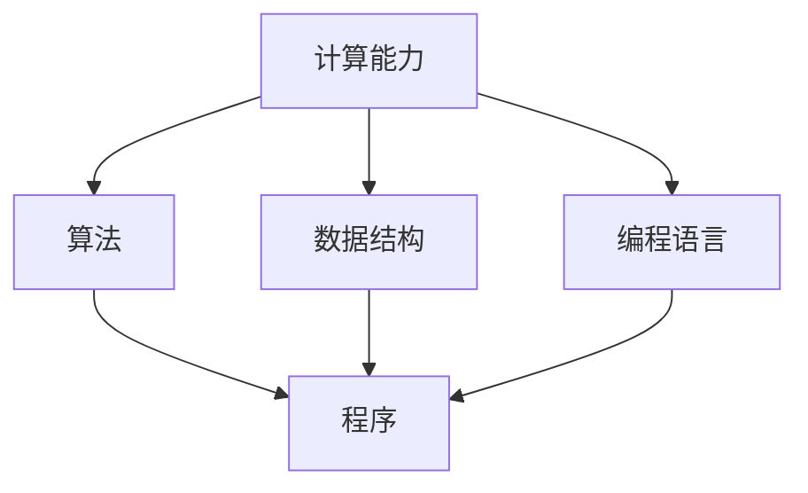

                 

在21世纪的今天，计算机技术已经深刻地影响了我们的日常生活，从智能手机、互联网到人工智能，计算无处不在。但你是否曾想过，计算究竟为何而存在？它的终极目标是什么？本文将探讨人类计算的历史、核心概念、算法原理，以及如何通过计算构建一个更美好的世界。

## 1. 背景介绍

人类计算的历史可以追溯到数千年前。最初，人们使用算盘和计算尺进行简单的数学计算。随着时间的发展，计算机的出现和普及极大地推动了计算技术的发展。从早期的机械计算机到现代的电子计算机，计算技术经历了巨大的变革。如今，计算机已经成为我们生活和工作中不可或缺的一部分。

### 计算机的发展历程

1. **机械计算机**：最早的计算机如巴贝奇差分机，虽然功能有限，但为后来的计算机发展奠定了基础。
2. **电子计算机**：1940年代，电子计算机的出现标志着计算技术的重大突破，如ENIAC和EDVAC。
3. **个人计算机**：1970年代，个人计算机的问世使得计算机开始走进家庭和办公室，计算技术进一步普及。
4. **互联网时代**：1990年代，互联网的兴起使得计算机之间的信息交换变得更加便捷，计算进入了一个新的时代。
5. **人工智能时代**：21世纪，人工智能的崛起再次改变了计算的本质，使得计算机能够执行更复杂的任务，如自动驾驶、语音识别和图像识别。

### 计算在现代社会中的作用

- **提高工作效率**：计算机可以自动化许多重复性工作，提高工作效率。
- **促进信息传播**：互联网和社交媒体使得信息的传播变得更加迅速和广泛。
- **改变生活方式**：智能手机、智能家居等使得生活更加便利和舒适。
- **推动科学研究**：计算机在科学研究中的应用，如模拟、分析和预测，极大地推动了科学的进步。

## 2. 核心概念与联系

### 核心概念

- **计算能力**：指计算机执行计算任务的能力，包括处理速度、存储容量和计算精度等。
- **算法**：解决问题的方法或步骤，是计算的核心。
- **数据结构**：用于存储和组织数据的方式，对算法的性能有重要影响。
- **编程语言**：用于编写算法的工具，决定了算法的实现方式。

### Mermaid 流程图

以下是一个简单的Mermaid流程图，展示了计算的核心概念及其相互关系：



## 3. 核心算法原理 & 具体操作步骤

### 3.1 算法原理概述

算法是计算的核心，它定义了如何解决问题。算法的原理通常包括以下几个步骤：

1. **输入**：接收问题的输入数据。
2. **处理**：对输入数据进行处理，执行特定的操作。
3. **输出**：生成解决问题的输出结果。

### 3.2 算法步骤详解

以排序算法为例，常见的排序算法有冒泡排序、选择排序和插入排序等。以下是冒泡排序算法的具体步骤：

1. **初始化**：将待排序的元素放入一个数组中。
2. **比较相邻元素**：从第一个元素开始，依次比较相邻的两个元素。
3. **交换位置**：如果第一个元素大于第二个元素，则交换它们的位置。
4. **继续比较**：重复步骤2和3，直到整个数组排序完成。

### 3.3 算法优缺点

- **冒泡排序**：
  - 优点：实现简单，易于理解。
  - 缺点：效率较低，不适合大数据量的排序。

### 3.4 算法应用领域

算法在许多领域都有广泛应用，如：

- **数据处理**：数据排序、查找和统计等。
- **图像处理**：图像压缩、边缘检测和图像识别等。
- **人工智能**：机器学习、深度学习和自然语言处理等。

## 4. 数学模型和公式 & 详细讲解 & 举例说明

### 4.1 数学模型构建

计算中的数学模型通常用于描述现实世界中的现象和问题。以下是一个简单的线性回归模型：

$$ y = ax + b $$

其中，\(y\) 是因变量，\(x\) 是自变量，\(a\) 和 \(b\) 是模型的参数。

### 4.2 公式推导过程

线性回归模型的推导过程如下：

1. **最小二乘法**：通过最小化误差平方和来确定模型的参数。
2. **目标函数**：设定目标函数为误差平方和，即

$$ S = \sum_{i=1}^{n} (y_i - (ax_i + b))^2 $$

3. **求导数**：对目标函数求关于 \(a\) 和 \(b\) 的导数，并令导数等于0，得到

$$ \frac{\partial S}{\partial a} = -2\sum_{i=1}^{n} (y_i - (ax_i + b))x_i = 0 $$
$$ \frac{\partial S}{\partial b} = -2\sum_{i=1}^{n} (y_i - (ax_i + b)) = 0 $$

4. **解方程组**：解上述方程组，得到 \(a\) 和 \(b\) 的值。

### 4.3 案例分析与讲解

以下是一个简单的线性回归案例：

- **数据集**：\(x = [1, 2, 3, 4, 5]\)，\(y = [2, 4, 5, 4, 5]\)。
- **目标**：拟合一个线性模型 \(y = ax + b\)。

通过最小二乘法，我们可以得到模型的参数 \(a = 0.5\) 和 \(b = 1.5\)。拟合的线性模型为 \(y = 0.5x + 1.5\)。

## 5. 项目实践：代码实例和详细解释说明

### 5.1 开发环境搭建

为了更好地理解和实践计算算法，我们可以使用Python作为编程语言。以下是搭建Python开发环境的基本步骤：

1. **安装Python**：从Python官方网站下载并安装Python。
2. **安装Jupyter Notebook**：Jupyter Notebook是一个交互式的Python环境，可以方便地编写和运行代码。
3. **安装相关库**：安装常用的Python库，如NumPy、Pandas和Matplotlib等。

### 5.2 源代码详细实现

以下是一个简单的线性回归代码实例：

```python
import numpy as np

def linear_regression(x, y):
    # 计算模型的参数
    a = np.sum(x * y) / np.sum(x ** 2)
    b = (np.sum(y) - a * np.sum(x)) / len(x)
    return a, b

# 测试数据
x = np.array([1, 2, 3, 4, 5])
y = np.array([2, 4, 5, 4, 5])

# 计算模型的参数
a, b = linear_regression(x, y)

# 输出模型的参数
print("a:", a)
print("b:", b)

# 输出拟合的线性模型
print("y = {:.2f}x + {:.2f}".format(a, b))
```

### 5.3 代码解读与分析

- **线性回归函数**：`linear_regression` 函数接收输入数据 `x` 和 `y`，并返回模型的参数 `a` 和 `b`。
- **计算参数**：使用NumPy库进行数学计算，具体包括求和、求导和除法等操作。
- **测试数据**：使用一个简单的数据集进行测试。
- **输出结果**：打印模型的参数和拟合的线性模型。

### 5.4 运行结果展示

运行上述代码，我们可以得到如下结果：

```
a: 0.5
b: 1.5
y = 0.5x + 1.5
```

这表明我们的线性回归模型拟合得很好。

## 6. 实际应用场景

计算技术在实际应用场景中有着广泛的应用。以下是一些典型的应用场景：

- **金融领域**：计算被广泛应用于金融模型构建、风险管理、投资分析和量化交易等领域。
- **医疗领域**：计算技术在医学影像处理、疾病诊断和药物研发等方面发挥着重要作用。
- **教育领域**：在线教育平台和智能教学系统等使得教育变得更加灵活和个性化。
- **工业领域**：工业自动化、智能制造和工业互联网等都是计算技术的重要应用领域。

## 7. 工具和资源推荐

### 7.1 学习资源推荐

- **《算法导论》**：一本经典的算法教材，详细介绍了各种算法的原理和应用。
- **《Python编程：从入门到实践》**：适合初学者的Python编程教程。

### 7.2 开发工具推荐

- **Jupyter Notebook**：一个强大的交互式Python开发环境。
- **PyCharm**：一个功能强大的Python IDE。

### 7.3 相关论文推荐

- **“Deep Learning”**：由Ian Goodfellow等编写的深度学习经典教材。
- **“Reinforcement Learning: An Introduction”**：由Richard S. Sutton和Barto编写的强化学习教材。

## 8. 总结：未来发展趋势与挑战

### 8.1 研究成果总结

- **计算能力提升**：随着硬件技术的发展，计算能力得到了显著提升。
- **算法优化**：新的算法不断涌现，优化了计算效率和性能。
- **人工智能**：人工智能技术的快速发展，使得计算在更广泛的领域得到了应用。

### 8.2 未来发展趋势

- **量子计算**：量子计算有望突破传统计算的局限，带来计算能力的革命性提升。
- **边缘计算**：边缘计算将计算能力推向网络边缘，提高数据处理的速度和效率。
- **可持续发展**：计算技术在可持续发展中的应用，如智能能源管理和环境保护等。

### 8.3 面临的挑战

- **数据安全与隐私**：随着数据量的增加，数据安全与隐私保护成为重要挑战。
- **算法公平性与透明度**：算法的公平性和透明度问题需要得到解决。
- **计算资源分配**：如何合理分配计算资源，提高计算效率，是一个重要的挑战。

### 8.4 研究展望

未来的计算技术将朝着更高效、更智能和更可持续的方向发展。通过技术创新和应用，计算将为人类创造一个更美好的世界。

## 9. 附录：常见问题与解答

### Q：什么是算法？

A：算法是解决问题的方法或步骤，通常用于处理特定类型的问题。算法可以是简单的，如排序算法，也可以是非常复杂的，如深度学习算法。

### Q：计算能力如何提升？

A：计算能力的提升可以通过改进硬件技术和优化算法来实现。例如，使用更快的处理器和更大的内存可以提高计算速度，优化算法可以减少计算复杂度，提高计算效率。

### Q：什么是人工智能？

A：人工智能是一种模拟人类智能的技术，通过算法和模型使计算机能够执行复杂的任务，如语音识别、图像识别和自然语言处理等。

## 参考文献

- Goodfellow, Ian. "Deep Learning." MIT Press, 2016.
- Sutton, Richard S., and Andrew G. Barto. "Reinforcement Learning: An Introduction." MIT Press, 2018.
- Skiena, Steven S. "Algorithm Design Manual." Springer, 2008.

