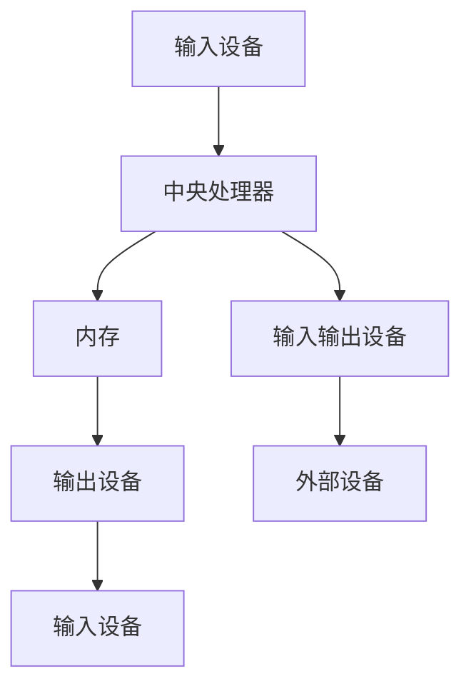
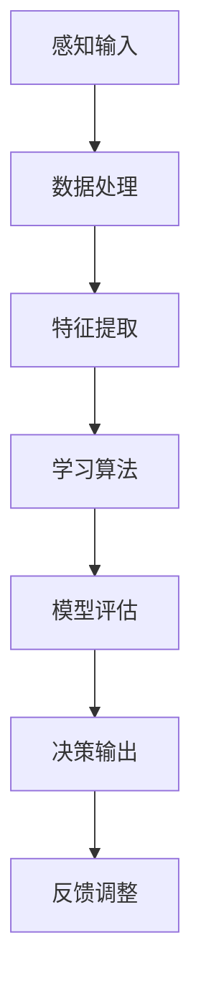

                 

关键词：计算技术，人工智能，未来趋势，社会应用，积极影响

> 摘要：随着计算技术的迅猛发展，人工智能逐渐融入各个领域，极大地提升了人类的生产力和生活质量。本文将探讨计算技术在现代社会的积极影响，从核心概念、算法原理、数学模型、项目实践、应用场景等多个角度深入分析，展望计算技术为未来带来的无限可能。

## 1. 背景介绍

### 1.1 计算技术的起源与发展

计算技术起源于古代的算术和几何研究，随着时间的推移，计算技术经历了从手工计算到机械计算，再到电子计算的重大变革。20世纪中叶，计算机的诞生标志着计算技术的里程碑式发展。计算机不仅极大地提高了计算速度和准确性，还开创了信息处理的新纪元。

### 1.2 人工智能的崛起

人工智能作为计算技术的重要分支，在近几十年里取得了飞速发展。深度学习、自然语言处理、计算机视觉等技术的突破，使得人工智能在各个领域展现出强大的潜力。人工智能不仅改变了传统行业的运作模式，还开启了新的商业机会和就业岗位。

## 2. 核心概念与联系

### 2.1 计算机体系结构

计算机体系结构是计算技术的基石，它定义了计算机硬件与软件之间的交互方式。通过Mermaid流程图，我们可以更直观地了解计算机体系结构的各个层次和模块之间的关系。



### 2.2 人工智能的基本原理

人工智能的基本原理包括机器学习、深度学习、神经网络等。通过这些算法，计算机可以模拟人类的思维过程，实现自我学习和自我优化。以下是人工智能的基本原理流程图：



## 3. 核心算法原理 & 具体操作步骤

### 3.1 算法原理概述

核心算法包括机器学习算法、深度学习算法等。这些算法通过大量数据训练模型，使其具备对未知数据的预测和分类能力。

### 3.2 算法步骤详解

以深度学习算法为例，其具体操作步骤如下：

1. 数据预处理：清洗和整理数据，确保数据质量。
2. 构建神经网络：设计合适的神经网络结构。
3. 模型训练：使用训练数据集训练模型。
4. 模型评估：使用验证数据集评估模型性能。
5. 模型优化：根据评估结果调整模型参数。
6. 模型部署：将训练好的模型应用到实际场景。

### 3.3 算法优缺点

深度学习算法具有强大的学习和泛化能力，但在数据需求、计算资源和模型解释性方面存在一定局限性。

### 3.4 算法应用领域

深度学习算法广泛应用于图像识别、语音识别、自然语言处理等领域，为各个行业带来了革命性的变革。

## 4. 数学模型和公式 & 详细讲解 & 举例说明

### 4.1 数学模型构建

深度学习中的数学模型主要包括损失函数、优化算法等。以下是常见的损失函数和优化算法：

$$
L(y, \hat{y}) = \frac{1}{2}(y - \hat{y})^2
$$

### 4.2 公式推导过程

以反向传播算法为例，其推导过程如下：

$$
\frac{\partial L}{\partial w} = \frac{\partial L}{\partial z} \frac{\partial z}{\partial w}
$$

### 4.3 案例分析与讲解

以图像识别任务为例，通过构建深度学习模型实现图像分类。

## 5. 项目实践：代码实例和详细解释说明

### 5.1 开发环境搭建

搭建深度学习开发环境，包括Python、TensorFlow等工具。

### 5.2 源代码详细实现

```python
import tensorflow as tf

# 构建模型
model = tf.keras.Sequential([
    tf.keras.layers.Flatten(input_shape=(28, 28)),
    tf.keras.layers.Dense(128, activation='relu'),
    tf.keras.layers.Dense(10, activation='softmax')
])

# 编译模型
model.compile(optimizer='adam',
              loss='sparse_categorical_crossentropy',
              metrics=['accuracy'])

# 训练模型
model.fit(train_images, train_labels, epochs=5)
```

### 5.3 代码解读与分析

该代码实现了一个简单的深度学习模型，用于图像分类。其中，`Flatten` 层将图像数据展平为一维数组，`Dense` 层实现全连接神经网络，`compile` 方法编译模型，`fit` 方法训练模型。

### 5.4 运行结果展示

训练完成后，可以使用测试数据集评估模型性能。

## 6. 实际应用场景

### 6.1 医疗健康

计算技术为医疗健康领域带来了革命性的变革，如疾病预测、诊断辅助、个性化治疗等。

### 6.2 金融科技

计算技术赋能金融行业，实现智能投顾、风险控制、反欺诈等。

### 6.3 智能制造

计算技术在智能制造领域发挥重要作用，如智能质检、预测维护、生产优化等。

## 7. 工具和资源推荐

### 7.1 学习资源推荐

- 《深度学习》（Goodfellow、Bengio、Courville 著）
- 《Python深度学习》（François Chollet 著）

### 7.2 开发工具推荐

- TensorFlow
- PyTorch

### 7.3 相关论文推荐

- "Deep Learning" by Ian Goodfellow
- "A Theoretically Grounded Application of Dropout in Computer Vision" by Yarin Gal and Zoubin Ghahramani

## 8. 总结：未来发展趋势与挑战

### 8.1 研究成果总结

计算技术在各个领域取得了显著成果，为人类社会带来了巨大价值。

### 8.2 未来发展趋势

计算技术将继续向更高性能、更广泛应用、更强解释性方向发展。

### 8.3 面临的挑战

计算技术在发展过程中也面临着数据安全、隐私保护、伦理道德等方面的挑战。

### 8.4 研究展望

未来研究应关注计算技术的可持续发展，探索更高效、更安全的计算方法。

## 9. 附录：常见问题与解答

### 9.1 问题1

如何平衡计算性能与能源消耗？

### 9.2 解答1

通过优化算法和硬件设计，降低计算过程中的能耗，同时提高计算效率。

## 作者署名

作者：禅与计算机程序设计艺术 / Zen and the Art of Computer Programming
----------------------------------------------------------------

以上内容仅为文章正文部分，还需要按照约束条件补充完整文章的格式和内容。如果您需要进一步的帮助，请告诉我。

