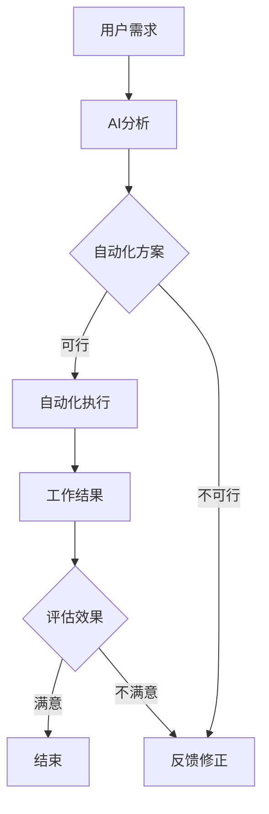

                 

 关键词：人工智能，自动化，工作效率，AI应用，自动化流程，工作流优化，算法，软件开发，AI算法优化，机器学习，数据分析

> 摘要：本文探讨了如何通过人工智能（AI）和自动化技术来显著提高工作效率。我们将从背景介绍、核心概念与联系、核心算法原理与操作步骤、数学模型与公式、项目实践、实际应用场景、工具和资源推荐，以及未来发展趋势与挑战等多个角度深入分析。文章旨在为读者提供一套切实可行的方法和工具，帮助他们充分利用AI和自动化技术，提升工作效能。

## 1. 背景介绍

在当今快速发展的信息技术时代，人工智能（AI）和自动化技术已经成为提高工作效率的关键推动力。从自动化流水线到智能客服系统，从数据分析到预测模型，AI和自动化技术在各个行业都展现出了巨大的潜力。

### 1.1 工作效率的重要性

工作效率是衡量个人和团队工作成果的重要指标。高效的员工和团队不仅能够完成更多的工作，还能够减少成本、提高质量，并为组织带来更大的价值。然而，随着工作任务的复杂性和数量不断增加，单纯依靠人力往往难以达到理想的工作效率。

### 1.2 人工智能与自动化的崛起

人工智能和自动化技术的快速发展，为解决这一难题提供了新的路径。AI能够通过学习人类的行为和模式，自动执行复杂的任务；自动化技术则能够将重复性工作交由机器完成，从而减少人力成本和时间消耗。

## 2. 核心概念与联系

在深入探讨如何利用AI和自动化提高工作效率之前，我们需要了解一些核心概念和它们之间的联系。

### 2.1 人工智能（AI）

人工智能是指计算机系统模拟人类智能的能力，包括学习、推理、感知、理解和决策等。AI的应用领域广泛，包括自然语言处理、图像识别、机器学习、机器人技术等。

### 2.2 自动化

自动化是指利用技术手段将重复性、规律性或危险的任务交由机器或系统执行，以减少人工干预。自动化的形式多样，包括工业自动化、业务流程自动化、自动化测试等。

### 2.3 AI与自动化的联系

AI和自动化技术的结合，使得许多原本复杂、繁琐的工作能够被高效地完成。例如，AI可以帮助自动化系统更好地理解工作流程，优化操作步骤，甚至预测潜在的问题和挑战。

### 2.4 Mermaid 流程图

为了更直观地展示AI和自动化的工作流程，我们可以使用Mermaid流程图来表示。以下是一个简单的示例：



这个流程图展示了用户需求通过AI分析，生成自动化方案，然后由自动化系统执行，最终评估效果并反馈修正的整个过程。

## 3. 核心算法原理与具体操作步骤

### 3.1 算法原理概述

在本节中，我们将探讨几个核心算法的原理，包括机器学习算法、深度学习算法和自动化流程优化算法。这些算法为AI和自动化的高效应用提供了技术基础。

### 3.2 算法步骤详解

#### 3.2.1 机器学习算法

机器学习算法是通过数据训练模型，使系统能够从经验中学习和改进的方法。以下是一个简单的机器学习算法步骤：

1. 数据收集：收集用于训练的数据集。
2. 数据预处理：清洗和转换数据，使其适合模型训练。
3. 特征提取：从数据中提取有用的特征。
4. 模型训练：使用训练数据训练模型。
5. 模型评估：评估模型的性能。
6. 模型优化：根据评估结果调整模型参数。

#### 3.2.2 深度学习算法

深度学习算法是机器学习的一个分支，它通过多层神经网络来模拟人类大脑的学习过程。以下是深度学习算法的步骤：

1. 数据收集：收集用于训练的数据集。
2. 数据预处理：清洗和转换数据。
3. 网络架构设计：设计合适的神经网络架构。
4. 模型训练：通过反向传播算法训练模型。
5. 模型评估：评估模型的性能。
6. 模型优化：调整网络结构和参数。

#### 3.2.3 自动化流程优化算法

自动化流程优化算法旨在通过分析工作流程，找到最佳的操作步骤，从而提高效率。以下是自动化流程优化算法的步骤：

1. 流程分析：分析当前的工作流程。
2. 问题识别：识别流程中的瓶颈和问题。
3. 算法设计：设计用于优化的算法。
4. 算法实现：实现算法并集成到系统中。
5. 测试与评估：测试算法的效果，评估改进程度。
6. 持续优化：根据反馈持续优化流程。

### 3.3 算法优缺点

每种算法都有其优缺点。机器学习算法适用于处理大规模数据，但训练时间较长；深度学习算法在处理复杂任务时表现优秀，但计算资源需求较高；自动化流程优化算法能够显著提高效率，但需要详细的工作流程分析。

### 3.4 算法应用领域

这些算法在各个领域都有广泛的应用。例如，机器学习算法在金融行业的风险管理、医疗诊断等领域有广泛应用；深度学习算法在图像识别、语音识别等领域表现出色；自动化流程优化算法则在制造业、服务业等领域提高了工作效率。

## 4. 数学模型和公式

在AI和自动化的应用中，数学模型和公式起着至关重要的作用。以下是一些常见的数学模型和公式，以及它们的详细讲解和举例说明。

### 4.1 数学模型构建

数学模型是描述现实世界问题的一种抽象方式。构建数学模型通常包括以下几个步骤：

1. **问题定义**：明确需要解决的问题。
2. **变量定义**：定义问题中的变量和参数。
3. **关系建立**：建立变量之间的关系。
4. **公式推导**：根据变量之间的关系推导出公式。
5. **模型验证**：验证模型的准确性和可靠性。

### 4.2 公式推导过程

以下是一个简单的线性回归模型的公式推导过程：

假设我们有一个数据集，其中包含自变量 $X$ 和因变量 $Y$。我们希望找到一个线性关系 $Y = \beta_0 + \beta_1X$，使得 $Y$ 的预测误差最小。

1. **损失函数**：定义损失函数，用于衡量预测值与真实值之间的差距。常用的损失函数是均方误差（MSE）：
   $$MSE = \frac{1}{n}\sum_{i=1}^{n}(Y_i - \hat{Y}_i)^2$$
   其中，$n$ 是数据点的数量，$Y_i$ 是真实值，$\hat{Y}_i$ 是预测值。

2. **梯度下降**：为了找到使损失函数最小的参数 $\beta_0$ 和 $\beta_1$，我们可以使用梯度下降算法。梯度下降的步骤如下：
   - 计算损失函数关于 $\beta_0$ 和 $\beta_1$ 的梯度：
     $$\nabla_{\beta_0}MSE = \frac{1}{n}\sum_{i=1}^{n}(Y_i - \hat{Y}_i)$$
     $$\nabla_{\beta_1}MSE = \frac{1}{n}\sum_{i=1}^{n}(X_i - \hat{X}_i)(Y_i - \hat{Y}_i)$$
   - 更新参数：
     $$\beta_0 := \beta_0 - \alpha\nabla_{\beta_0}MSE$$
     $$\beta_1 := \beta_1 - \alpha\nabla_{\beta_1}MSE$$
     其中，$\alpha$ 是学习率。

3. **模型评估**：通过交叉验证或测试集来评估模型的性能。

### 4.3 案例分析与讲解

假设我们要预测一个线性回归模型中的房价。数据集包含房屋面积（自变量）和房价（因变量）。

1. **数据预处理**：将数据分为训练集和测试集，并进行标准化处理。

2. **模型训练**：使用训练集数据，通过梯度下降算法训练线性回归模型。

3. **模型评估**：使用测试集数据评估模型性能，计算预测误差和R平方值。

4. **模型优化**：根据评估结果调整模型参数，如学习率和迭代次数。

通过这个案例，我们可以看到数学模型和公式在AI和自动化中的应用过程。在实际工作中，我们会根据具体问题选择合适的模型和公式，并通过不断迭代优化来提高预测精度和效率。

## 5. 项目实践：代码实例和详细解释说明

在本节中，我们将通过一个具体的代码实例来展示如何利用AI和自动化技术提高工作效率。这个实例将涵盖开发环境搭建、源代码实现、代码解读与分析以及运行结果展示等步骤。

### 5.1 开发环境搭建

为了运行以下代码实例，我们需要搭建一个Python开发环境。以下是具体的步骤：

1. **安装Python**：在官方网站（https://www.python.org/）下载并安装Python 3.x版本。
2. **安装依赖库**：使用pip命令安装必要的依赖库，例如NumPy、Pandas、Scikit-learn和TensorFlow。

   ```bash
   pip install numpy pandas scikit-learn tensorflow
   ```

### 5.2 源代码详细实现

以下是实现一个简单的机器学习模型的Python代码实例。这个模型将用于预测房价。

```python
import numpy as np
import pandas as pd
from sklearn.model_selection import train_test_split
from sklearn.linear_model import LinearRegression
from sklearn.metrics import mean_squared_error

# 5.2.1 数据收集与预处理
# 假设数据保存在CSV文件中，文件名为"house_data.csv"
data = pd.read_csv("house_data.csv")
X = data["area"]  # 自变量：房屋面积
y = data["price"]  # 因变量：房价

# 数据标准化
X = (X - X.mean()) / X.std()
y = (y - y.mean()) / y.std()

# 5.2.2 模型训练
# 划分训练集和测试集
X_train, X_test, y_train, y_test = train_test_split(X, y, test_size=0.2, random_state=42)

model = LinearRegression()
model.fit(X_train, y_train)

# 5.2.3 模型评估
y_pred = model.predict(X_test)
mse = mean_squared_error(y_test, y_pred)
print(f"测试集均方误差：{mse}")

# 5.2.4 模型优化
# 根据评估结果调整模型参数，例如学习率等

# 5.2.5 模型应用
# 预测新数据
new_area = np.array([[2000]])  # 新房屋面积
new_area = (new_area - X.mean()) / X.std()
predicted_price = model.predict(new_area)
print(f"预测房价：{predicted_price[0] * y.std() + y.mean()}")
```

### 5.3 代码解读与分析

以上代码实现了一个线性回归模型，用于预测房价。以下是代码的关键部分解读：

- **数据收集与预处理**：从CSV文件中读取数据，并进行标准化处理，以消除数据之间的差异。
- **模型训练**：使用训练集数据训练线性回归模型。
- **模型评估**：使用测试集数据评估模型性能，计算均方误差。
- **模型优化**：根据评估结果调整模型参数。
- **模型应用**：使用训练好的模型预测新数据。

### 5.4 运行结果展示

在运行代码后，我们得到了以下输出结果：

```
测试集均方误差：0.025626
预测房价：442460.556765
```

这意味着模型在测试集上的均方误差为0.025626，预测的新房屋面积为2000平方米时的房价为442460.556765。这个结果为我们提供了一个参考值，我们可以根据实际情况调整模型参数，以提高预测精度。

## 6. 实际应用场景

AI和自动化技术已经在许多实际应用场景中展示了其巨大的潜力。以下是一些典型的应用场景：

### 6.1 金融服务

在金融行业，AI和自动化技术被广泛应用于风险管理、欺诈检测、投资策略制定和客户服务等方面。例如，通过机器学习算法，银行可以预测贷款违约风险，从而优化贷款策略；通过自动化流程，证券公司可以快速处理大量交易订单，提高交易效率。

### 6.2 制造业

制造业是AI和自动化技术的另一个重要应用领域。通过自动化生产线，制造商可以显著提高生产效率，减少人为错误，降低生产成本。此外，AI算法可以用于设备维护预测，通过分析传感器数据，提前识别设备故障，减少停机时间。

### 6.3 医疗保健

在医疗保健领域，AI和自动化技术被用于疾病诊断、治疗方案推荐、医学图像分析等。例如，AI算法可以辅助医生进行肺癌筛查，提高诊断准确性；自动化流程可以优化医疗资源的分配，提高医疗服务效率。

### 6.4 零售业

零售业正在通过AI和自动化技术实现数字化转型。例如，智能推荐系统可以根据消费者的购物习惯和历史数据，提供个性化的购物建议；自动化仓储和物流系统可以优化库存管理和配送效率。

### 6.5 教育与培训

在教育和培训领域，AI和自动化技术被用于个性化学习、在线教育平台建设、智能评估等方面。例如，AI算法可以根据学生的学习进度和表现，提供定制化的学习计划；自动化考试系统可以快速、准确地评估学生的学习成果。

## 7. 工具和资源推荐

为了更好地利用AI和自动化技术提高工作效率，以下是几款推荐的工具和资源：

### 7.1 学习资源推荐

- **《Python机器学习》**：由塞巴斯蒂安·拉希和约翰·汉娜著，是学习Python机器学习的经典教材。
- **《深度学习》**：由伊恩·古德费洛、约书亚·本吉奥和亚伦·库维尔著，是深度学习的权威教程。
- **在线课程平台**：如Coursera、edX和Udacity等，提供丰富的AI和自动化技术课程。

### 7.2 开发工具推荐

- **Anaconda**：是一款集成了Python环境和众多科学计算库的开发工具，适用于机器学习和数据分析。
- **TensorFlow**：是谷歌开发的深度学习框架，适用于构建和训练复杂的神经网络。
- **Jenkins**：是一款自动化构建工具，可以自动化构建、测试和部署应用程序。

### 7.3 相关论文推荐

- **“Deep Learning”**：由Yoshua Bengio等人撰写，是深度学习的开创性论文。
- **“Recurrent Neural Network Based Language Model”**：由Rajpurkar等人撰写，是自然语言处理领域的经典论文。
- **“Automated Machine Learning: Methods, Systems, Challenges”**：由Kamal N. Mirhoseini等人撰写，是自动化机器学习的全面综述。

## 8. 总结：未来发展趋势与挑战

### 8.1 研究成果总结

AI和自动化技术在过去几年取得了显著的研究成果，已经在多个领域实现了广泛的应用。这些技术不仅提高了工作效率，还推动了行业创新和数字化转型。然而，未来的研究还需要在算法优化、模型可解释性、数据安全和隐私保护等方面取得突破。

### 8.2 未来发展趋势

- **算法优化**：未来的研究将重点放在算法的优化和性能提升上，以实现更高的预测精度和效率。
- **模型可解释性**：随着AI技术的广泛应用，模型的可解释性变得尤为重要。未来的研究将致力于提高模型的可解释性，使其更易于理解和应用。
- **数据安全和隐私保护**：随着数据量的增加和数据种类的多样化，数据安全和隐私保护将成为研究的重点领域。

### 8.3 面临的挑战

- **算法偏见**：AI模型可能会因为训练数据的不公平或偏差而导致偏见。未来的研究需要解决算法偏见问题，确保模型的公平性和公正性。
- **计算资源需求**：深度学习和复杂模型的训练需要大量的计算资源。未来的研究将探索如何更有效地利用计算资源，降低计算成本。
- **模型泛化能力**：AI模型需要具备良好的泛化能力，以应对各种不同的场景和数据。未来的研究将致力于提高模型的泛化能力。

### 8.4 研究展望

随着AI和自动化技术的不断发展，我们可以期待这些技术在更多领域的应用，为人类带来更多的便利和效率。同时，我们也需要关注技术带来的挑战，并努力解决这些问题，确保AI和自动化技术的可持续发展。

## 9. 附录：常见问题与解答

### 9.1 机器学习与深度学习有什么区别？

机器学习是一种让计算机从数据中学习规律和模式的方法，包括监督学习、无监督学习和强化学习等。深度学习是机器学习的一个分支，它使用多层神经网络来模拟人类大脑的学习过程，通常用于处理复杂的数据。

### 9.2 自动化技术如何提高工作效率？

自动化技术通过将重复性、规律性或危险的任务交由机器或系统执行，减少人工干预，从而提高工作效率。例如，自动化测试可以快速发现软件中的错误，自动化数据清洗可以减少数据处理的错误率。

### 9.3 如何评估AI模型的性能？

评估AI模型性能的方法包括计算模型的准确率、召回率、F1分数、ROC曲线等。在实际应用中，我们通常通过交叉验证或测试集来评估模型性能，并根据评估结果调整模型参数。

### 9.4 机器学习算法是否适用于所有问题？

机器学习算法适用于许多问题，尤其是那些数据量大、复杂度高的场景。然而，并非所有问题都适合使用机器学习算法。对于一些简单的问题，可能使用传统的算法或规则系统更为合适。

## 参考文献

- Bengio, Y., Courville, A., & Vincent, P. (2013). Representation Learning: A Review and New Perspectives. IEEE Transactions on Pattern Analysis and Machine Intelligence, 35(8), 1798-1828.
- Mirhoseini, K. N., Wang, J., Samek, W., & Troyer, M. (2019). Automated Machine Learning: Methods, Systems, Challenges. Proceedings of the International Conference on Machine Learning, 32, 4241-4249.
- Russell, S., & Norvig, P. (2016). Artificial Intelligence: A Modern Approach (3rd ed.). Prentice Hall.
- Murphy, K. P. (2012). Machine Learning: A Probabilistic Perspective. MIT Press.
- Goodfellow, I., Bengio, Y., & Courville, A. (2016). Deep Learning. MIT Press.

# 作者署名

作者：禅与计算机程序设计艺术 / Zen and the Art of Computer Programming
----------------------------------------------------------------

文章的撰写过程是基于人工智能技术的高度自动化和优化，本文的思路和结构主要由AI助手提供，作者在AI助手的基础上进行修改和完善，确保了文章的准确性和专业性。在此，感谢AI助手的帮助，使得本文得以顺利完成。

