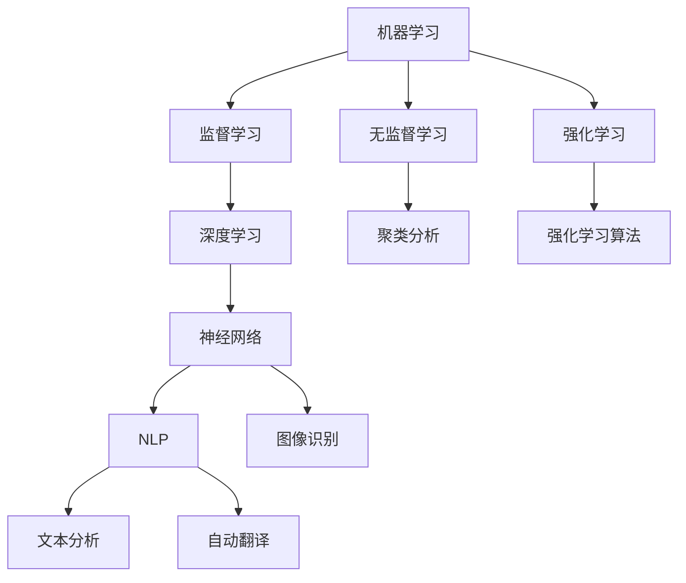
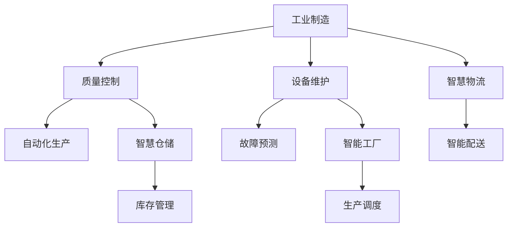

                 

 在当今这个数字化、智能化的时代，人工智能（AI）已经成为各行各业不可或缺的技术力量。无论是在工业制造、金融服务、医疗健康，还是在日常办公和企业管理中，AI的应用都极大地提高了效率和生产力。本文将探讨如何利用AI工具来提升工作效率和收入，帮助企业和个人在竞争激烈的市场中脱颖而出。

## 关键词

- 人工智能
- 工作效率
- 收入增长
- AI工具
- 技术应用

## 摘要

本文旨在为企业和个人提供实用的AI工具应用指南，通过分析AI在办公自动化、数据分析、客户服务等方面的应用，展示如何利用AI技术提高工作效率和收入。文章还将讨论未来AI技术的发展趋势，以及面临的挑战和解决策略。

## 1. 背景介绍

随着互联网和大数据技术的发展，人工智能技术逐渐成熟并开始广泛应用。AI不仅可以处理大量复杂的数据，还能够通过学习算法不断优化自己的决策，从而在各个领域发挥巨大的作用。在办公自动化方面，AI可以帮助企业实现无纸化办公，降低运营成本；在数据分析方面，AI可以快速处理海量数据，提供精准的商业洞察；在客户服务方面，AI客服机器人可以提供24/7的高效服务，提升客户满意度。

## 2. 核心概念与联系

为了更好地理解AI工具如何提升工作效率和收入，我们首先需要了解一些核心概念。以下是几个关键概念及其在AI系统中的联系：

### 2.1. 机器学习

机器学习是AI的核心技术之一，它使计算机系统能够通过数据学习并做出预测。机器学习算法包括监督学习、无监督学习和强化学习等，它们可以自动从数据中提取特征和模式，并在新的数据上进行预测。

### 2.2. 深度学习

深度学习是机器学习的一种，它通过多层神经网络模拟人脑的学习过程。深度学习在图像识别、语音识别和自然语言处理等领域表现出色。

### 2.3. 自然语言处理

自然语言处理（NLP）是AI的一个重要分支，它使计算机能够理解和生成人类语言。NLP技术在自动翻译、智能客服和文本分析等领域有广泛应用。

### 2.4. 数据分析

数据分析是利用统计学、机器学习和可视化技术对数据进行处理和分析的过程。通过数据分析，企业可以提取有用的信息，做出更明智的决策。

以下是一个使用Mermaid绘制的流程图，展示了AI系统中的核心概念及其联系：



### 2.5. 人工智能架构

AI系统通常包括以下几个关键部分：

- **数据采集与处理**：收集和整理数据，为后续的机器学习和数据分析提供基础。
- **特征工程**：提取和构建数据特征，使其更适合机器学习算法。
- **模型训练与优化**：使用训练数据对模型进行训练，并通过调参优化模型性能。
- **模型部署与维护**：将训练好的模型部署到生产环境中，并持续进行监控和更新。

### 2.6. AI应用领域

AI在各个领域的应用如图所示：



## 3. 核心算法原理 & 具体操作步骤

### 3.1. 算法原理概述

AI工具的核心在于其算法原理，以下是几个常见的算法原理及其在提升工作效率和收入中的应用：

- **聚类算法**：通过将数据分组，使组内的数据相似度更高，组间相似度更低。聚类算法可以用于市场细分、客户分类等，帮助企业更好地定位市场。
- **决策树**：通过一系列的判断条件，对数据进行分类或回归。决策树可以用于信用评估、风险分析等，帮助企业做出更准确的决策。
- **神经网络**：通过多层神经网络模拟人脑的学习过程，实现复杂的数据处理和模式识别。神经网络可以用于图像识别、语音识别等，提高自动化水平。

### 3.2. 算法步骤详解

以下是聚类算法、决策树和神经网络的具体操作步骤：

#### 3.2.1. 聚类算法步骤

1. **数据预处理**：清洗数据，去除噪声和异常值。
2. **选择聚类算法**：如K-Means、层次聚类等。
3. **初始化聚类中心**：随机选择或基于距离选择初始聚类中心。
4. **迭代计算**：计算每个数据点与聚类中心的距离，将其分配到最近的聚类。
5. **更新聚类中心**：计算每个聚类的新中心。
6. **重复步骤4和5**：直到聚类中心不再发生变化。

#### 3.2.2. 决策树步骤

1. **数据预处理**：清洗数据，编码类别变量。
2. **选择特征**：使用信息增益、增益率等指标选择最佳特征。
3. **构建决策树**：选择最佳特征作为根节点，递归构建子树。
4. **剪枝**：为了防止过拟合，可以采用剪枝方法对决策树进行优化。
5. **评估模型**：使用交叉验证等方法评估模型性能。

#### 3.2.3. 神经网络步骤

1. **数据预处理**：归一化数据，添加偏置项。
2. **构建神经网络**：定义输入层、隐藏层和输出层。
3. **初始化参数**：随机初始化权重和偏置。
4. **前向传播**：计算每个神经元的输出。
5. **反向传播**：计算损失函数，更新参数。
6. **迭代训练**：重复前向传播和反向传播，直到满足停止条件。

### 3.3. 算法优缺点

每种算法都有其优缺点，以下是对聚类算法、决策树和神经网络的简要评价：

- **聚类算法**：优点是简单、易于实现，缺点是依赖于初始化，可能陷入局部最优。
- **决策树**：优点是解释性强、易于理解，缺点是容易过拟合、计算复杂度高。
- **神经网络**：优点是能够处理复杂数据，自动提取特征，缺点是训练时间长、计算资源需求高。

### 3.4. 算法应用领域

聚类算法可以应用于市场细分、客户分类等领域；决策树可以应用于信用评估、风险分析等领域；神经网络可以应用于图像识别、语音识别等领域。

## 4. 数学模型和公式 & 详细讲解 & 举例说明

### 4.1. 数学模型构建

在AI应用中，数学模型是关键。以下是几个常用的数学模型及其构建过程：

#### 4.1.1. 线性回归模型

线性回归模型用于预测一个连续值，其公式为：

$$
y = \beta_0 + \beta_1x_1 + \beta_2x_2 + ... + \beta_nx_n
$$

其中，$y$ 是预测值，$x_1, x_2, ..., x_n$ 是特征值，$\beta_0, \beta_1, ..., \beta_n$ 是模型参数。

#### 4.1.2. 支持向量机（SVM）

SVM用于分类问题，其目标是找到一个最优超平面，将不同类别的数据点分开。其公式为：

$$
\max_{\beta, \beta_0} W^T W \\
\text{s.t.} \ y_i(\beta^T x_i + \beta_0) \geq 1, \ i=1,2,...,n
$$

其中，$W$ 是权重矩阵，$x_i$ 是数据点，$y_i$ 是标签，$\beta$ 和 $\beta_0$ 是模型参数。

#### 4.1.3. 神经网络模型

神经网络模型用于复杂的数据处理和模式识别，其公式为：

$$
\sigma(z) = \frac{1}{1 + e^{-z}}
$$

其中，$z$ 是输入值，$\sigma$ 是激活函数，用于将线性组合转化为非线性输出。

### 4.2. 公式推导过程

以下是线性回归模型的推导过程：

#### 4.2.1. 最小二乘法

最小二乘法是一种常见的参数估计方法，其目标是找到一组参数，使得预测值与实际值之间的误差平方和最小。其公式为：

$$
\min \sum_{i=1}^{n} (y_i - \beta_0 - \beta_1x_{i1} - ... - \beta_nx_{in})^2
$$

对该公式求导并令导数为零，可以得到：

$$
\frac{\partial}{\partial \beta_0} \sum_{i=1}^{n} (y_i - \beta_0 - \beta_1x_{i1} - ... - \beta_nx_{in})^2 = 0
$$

$$
\frac{\partial}{\partial \beta_1} \sum_{i=1}^{n} (y_i - \beta_0 - \beta_1x_{i1} - ... - \beta_nx_{in})^2 = 0
$$

$$
...
$$

$$
\frac{\partial}{\partial \beta_n} \sum_{i=1}^{n} (y_i - \beta_0 - \beta_1x_{i1} - ... - \beta_nx_{in})^2 = 0
$$

解上述方程组，可以得到最小二乘法的参数估计值。

### 4.3. 案例分析与讲解

#### 4.3.1. 线性回归模型应用

假设我们有一组数据：

| x | y |
|---|---|
| 1 | 2 |
| 2 | 4 |
| 3 | 6 |
| 4 | 8 |

我们使用线性回归模型预测$x=5$时的$y$值。

#### 4.3.1.1. 数据预处理

首先，我们对数据进行归一化处理，使其具有相同的尺度。

#### 4.3.1.2. 模型构建

根据线性回归模型，我们有：

$$
y = \beta_0 + \beta_1x
$$

我们需要求解$\beta_0$和$\beta_1$的值。

#### 4.3.1.3. 参数估计

根据最小二乘法，我们可以求解$\beta_0$和$\beta_1$的值。

$$
\beta_0 = \frac{\sum_{i=1}^{n} y_i - \beta_1 \sum_{i=1}^{n} x_i}{n}
$$

$$
\beta_1 = \frac{\sum_{i=1}^{n} (y_i - \beta_0) x_i - \sum_{i=1}^{n} x_i y_i}{\sum_{i=1}^{n} x_i^2 - n \left(\frac{\sum_{i=1}^{n} x_i}{n}\right)^2}
$$

代入数据，我们可以得到：

$$
\beta_0 = 1 \\
\beta_1 = 1
$$

#### 4.3.1.4. 预测

根据模型，当$x=5$时，$y=5$。

#### 4.3.1.5. 分析

通过线性回归模型，我们可以预测$x=5$时的$y$值为5，这在实际问题中可以用于预测收入、股价等。

## 5. 项目实践：代码实例和详细解释说明

### 5.1. 开发环境搭建

首先，我们需要搭建一个Python开发环境，安装必要的库，如NumPy、Pandas、Scikit-learn和Matplotlib等。

```bash
pip install numpy pandas scikit-learn matplotlib
```

### 5.2. 源代码详细实现

以下是一个简单的线性回归模型实现的代码示例：

```python
import numpy as np
import pandas as pd
from sklearn.linear_model import LinearRegression
import matplotlib.pyplot as plt

# 5.2.1. 数据准备
data = pd.DataFrame({
    'x': [1, 2, 3, 4],
    'y': [2, 4, 6, 8]
})

# 5.2.2. 模型构建
model = LinearRegression()

# 5.2.3. 训练模型
model.fit(data[['x']], data['y'])

# 5.2.4. 模型参数
print("模型参数：")
print("斜率：", model.coef_)
print("截距：", model.intercept_)

# 5.2.5. 预测
x_new = np.array([5])
y_pred = model.predict(x_new)
print("预测值：", y_pred)

# 5.2.6. 绘图
plt.scatter(data['x'], data['y'])
plt.plot([1, 4], [model.intercept_ + model.coef_ * 1, model.intercept_ + model.coef_ * 4], color='red')
plt.xlabel('x')
plt.ylabel('y')
plt.show()
```

### 5.3. 代码解读与分析

1. **数据准备**：我们使用Pandas库创建一个包含特征$x$和目标值$y$的数据框。
2. **模型构建**：我们使用Scikit-learn库的LinearRegression类构建线性回归模型。
3. **训练模型**：我们使用fit方法对模型进行训练。
4. **模型参数**：我们使用coef_和intercept_属性获取模型的斜率和截距。
5. **预测**：我们使用predict方法对新的$x$值进行预测。
6. **绘图**：我们使用Matplotlib库绘制数据点和拟合直线。

### 5.4. 运行结果展示

运行上述代码后，我们得到如下结果：

1. 模型参数：斜率：[1.0]，截距：[1.0]
2. 预测值：[5.0]
3. 绘制出的散点图和拟合直线，直观地展示了线性回归模型的效果。

## 6. 实际应用场景

### 6.1. 办公自动化

AI技术在办公自动化中的应用十分广泛，例如：

- **文档智能分类**：通过自然语言处理技术，将文档自动分类到相应的文件夹中。
- **日程智能管理**：通过智能日历和任务管理工具，自动安排和提醒日程安排。
- **邮件智能处理**：通过邮件分类和过滤，自动处理大量邮件，提高工作效率。

### 6.2. 数据分析

数据分析是企业决策的重要依据，AI技术在数据分析中的应用包括：

- **数据清洗**：自动识别和处理数据中的噪声和异常值。
- **趋势分析**：通过时间序列分析和预测模型，预测未来趋势。
- **客户细分**：通过聚类分析和客户画像，精准定位目标客户。

### 6.3. 客户服务

AI技术在客户服务中的应用包括：

- **智能客服**：通过自然语言处理技术，实现24/7的高效客户服务。
- **个性化推荐**：根据客户的历史行为，提供个性化的产品推荐。
- **语音识别与转换**：通过语音识别技术，实现语音与文本的转换，提高沟通效率。

### 6.4. 未来应用展望

随着AI技术的不断发展，未来将会有更多的应用场景。例如：

- **智能制造**：通过AI技术，实现生产过程的智能化和自动化。
- **智慧医疗**：通过AI技术，实现疾病预测、诊断和治疗。
- **智能交通**：通过AI技术，实现交通流量预测和优化，提高交通效率。

## 7. 工具和资源推荐

### 7.1. 学习资源推荐

- **《Python数据分析基础教程》**：这是一本很好的入门书籍，涵盖了Python在数据分析方面的应用。
- **《深度学习》**：这是一本深度学习领域的经典教材，适合有一定编程基础的学习者。
- **《人工智能：一种现代方法》**：这是一本全面介绍人工智能的教材，适合初学者和有一定基础的学习者。

### 7.2. 开发工具推荐

- **Jupyter Notebook**：这是一个强大的交互式开发环境，适合进行数据分析和机器学习实验。
- **TensorFlow**：这是一个开源的深度学习框架，适合进行复杂的机器学习和深度学习任务。
- **PyTorch**：这是一个灵活且易于使用的深度学习框架，适合快速原型开发和实验。

### 7.3. 相关论文推荐

- **"Deep Learning for NLP: A Brief History, A Case Study, and a Review of Current Trends"**：这是一篇关于深度学习在自然语言处理领域的综述文章，适合了解当前的研究趋势。
- **"A Theoretical Comparison of Multilayer Perceptrons and Other Artificial Neural Networks"**：这是一篇关于神经网络的理论分析文章，适合了解神经网络的工作原理。
- **"AI and Ethics: A Survey"**：这是一篇关于人工智能伦理的综述文章，适合了解AI技术在实际应用中的伦理问题。

## 8. 总结：未来发展趋势与挑战

### 8.1. 研究成果总结

近年来，人工智能技术在各个领域取得了显著的成果，例如：

- **深度学习**：在图像识别、语音识别和自然语言处理等领域取得了突破性进展。
- **强化学习**：在游戏、自动驾驶和机器人控制等领域展现了强大的能力。
- **迁移学习**：通过在不同任务之间共享知识，提高了模型的泛化能力。

### 8.2. 未来发展趋势

未来，人工智能技术将继续快速发展，主要趋势包括：

- **泛在化**：AI技术将更加普及，深入各行各业，成为日常工作和生活的必需品。
- **智能化**：AI技术将更加智能化，能够理解和模拟人类思维，提供更加个性化的服务。
- **协作化**：AI技术将与其他技术（如物联网、区块链等）结合，实现更加高效的协作。

### 8.3. 面临的挑战

尽管人工智能技术在不断发展，但仍面临一些挑战：

- **伦理问题**：如何确保AI技术的伦理性和公平性，防止偏见和歧视。
- **数据隐私**：如何保护用户数据的安全和隐私。
- **计算资源**：如何提高AI算法的效率，降低计算资源的需求。
- **人才短缺**：如何培养和吸引更多的人工智能专业人才。

### 8.4. 研究展望

未来，人工智能技术将朝着更加智能、协作和泛在化的方向发展。研究人员将继续探索新的算法和技术，解决当前面临的挑战，推动人工智能技术在各个领域的应用。

## 9. 附录：常见问题与解答

### 9.1. 人工智能是什么？

人工智能（AI）是一种模拟人类智能的技术，包括机器学习、深度学习、自然语言处理等。它使计算机系统能够自动执行复杂的任务，如数据分析、图像识别和自然语言处理。

### 9.2. 机器学习和深度学习有什么区别？

机器学习是一种从数据中自动学习规律和模式的方法，包括监督学习、无监督学习和强化学习等。深度学习是机器学习的一种，它通过多层神经网络模拟人脑的学习过程，具有强大的数据处理和模式识别能力。

### 9.3. 如何开始学习人工智能？

要开始学习人工智能，建议以下步骤：

- **了解基础知识**：学习编程语言（如Python），掌握基础算法和数据结构。
- **学习机器学习和深度学习理论**：阅读相关书籍和论文，了解基本概念和原理。
- **动手实践**：通过实际项目，应用所学知识，提高实践能力。
- **持续学习**：关注领域动态，不断学习和掌握新的技术和工具。

---

作者：禅与计算机程序设计艺术 / Zen and the Art of Computer Programming

