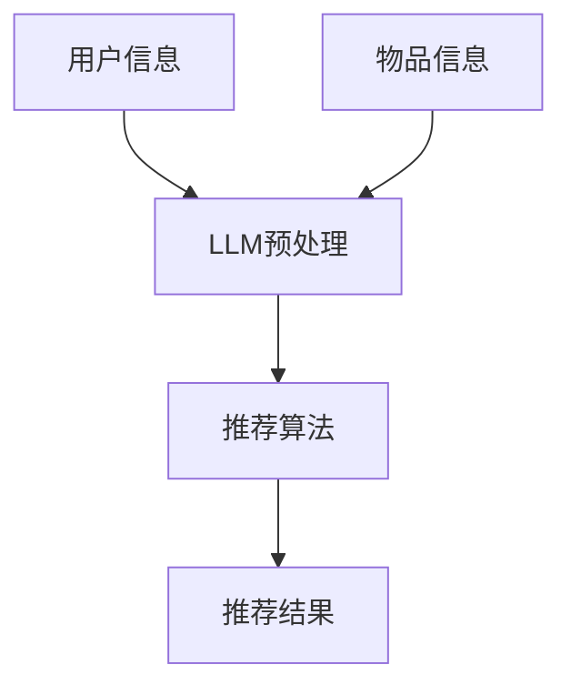

                 

关键词：推荐系统、冷启动、大语言模型（LLM）、个性化、相关性、协同过滤、机器学习

> 摘要：本文探讨了如何利用大语言模型（LLM）优化推荐系统的冷启动性能。通过分析LLM在推荐系统中的应用，提出了一种基于LLM的冷启动解决方案，并在数学模型和算法原理方面进行了详细阐述。最后，通过实际项目实践展示了该方法的有效性。

## 1. 背景介绍

推荐系统在当今信息过载的时代发挥着重要作用，然而，其冷启动问题（即用户或物品信息不足时的推荐问题）一直是一个困扰开发者的问题。传统的推荐系统主要依赖于用户历史行为数据和物品特征，但在用户或物品信息不足时，推荐效果往往不佳。为此，本文提出了一种利用大语言模型（LLM）优化推荐系统冷启动性能的方法。

## 2. 核心概念与联系

在介绍核心概念之前，首先给出一个Mermaid流程图，展示LLM在推荐系统中的应用架构。



### 2.1 大语言模型（LLM）

大语言模型（LLM，如GPT-3、BERT等）是一种基于深度学习的自然语言处理模型，具有强大的语义理解和生成能力。LLM通过学习大量文本数据，能够捕捉到文本中的语义信息，从而实现文本的生成、分类、翻译等功能。

### 2.2 推荐系统

推荐系统是一种基于用户历史行为数据、物品特征和协同过滤等方法，为用户提供个性化推荐服务的系统。推荐系统通常分为基于内容的推荐、协同过滤推荐和混合推荐等类型。

### 2.3 冷启动问题

冷启动问题是指在新用户或新物品加入推荐系统时，由于缺乏足够的历史数据，导致推荐效果不佳的问题。冷启动问题可分为用户冷启动和物品冷启动两种情况。

## 3. 核心算法原理 & 具体操作步骤

### 3.1 算法原理概述

本文提出的方法基于LLM对用户和物品的语义信息进行建模，从而提高冷启动阶段的推荐效果。具体步骤如下：

1. 对用户和物品信息进行预处理，提取语义特征。
2. 利用LLM训练一个语义匹配模型，用于评估用户和物品之间的相关性。
3. 根据相关性评分生成推荐列表。

### 3.2 算法步骤详解

#### 3.2.1 用户和物品信息预处理

在冷启动阶段，用户和物品的信息通常较为有限。因此，我们需要对现有信息进行充分挖掘和预处理，以提取语义特征。

1. 用户信息预处理：将用户基本信息（如年龄、性别、地理位置等）转化为数值型特征，并利用词嵌入技术（如Word2Vec、BERT等）将用户的行为数据（如浏览记录、购买记录等）转化为语义向量。
2. 物品信息预处理：将物品的描述性信息（如标题、标签、分类等）转化为词嵌入向量，并提取物品的特征向量。

#### 3.2.2 训练语义匹配模型

利用用户和物品的语义特征，我们可以训练一个基于LLM的语义匹配模型，用于评估用户和物品之间的相关性。

1. 数据集构建：从已有的用户和物品数据中构建一个带标签的数据集，其中标签表示用户和物品之间的相关性。
2. 模型训练：利用训练数据集，训练一个基于LLM的语义匹配模型，如BERT模型。

#### 3.2.3 生成推荐列表

根据语义匹配模型，对用户未接触过的物品进行相关性评分，并根据评分生成推荐列表。

1. 物品评分：利用训练好的语义匹配模型，计算用户和每个未接触物品之间的相关性评分。
2. 排序与推荐：根据相关性评分对物品进行排序，并生成推荐列表。

### 3.3 算法优缺点

#### 优点

1. 能够充分利用用户和物品的语义信息，提高冷启动阶段的推荐效果。
2. 不受用户历史行为数据的限制，适用于新用户和物品的推荐。

#### 缺点

1. 需要大量高质量的训练数据，数据获取和预处理成本较高。
2. LLM模型的训练和部署成本较高。

### 3.4 算法应用领域

该方法可以应用于各类推荐系统，如电子商务、新闻推送、社交媒体等。特别是在用户或物品信息不足的情况下，该方法能够有效提升推荐系统的性能。

## 4. 数学模型和公式

### 4.1 数学模型构建

假设用户$u$和物品$i$的语义向量分别为$\textbf{u}$和$\textbf{i}$，利用LLM训练的语义匹配模型输出的相关性评分记为$sim(u, i)$，则用户$u$对物品$i$的推荐分数为：

$$
\text{score}(u, i) = \text{sim}(\textbf{u}, \textbf{i})
$$

### 4.2 公式推导过程

假设$\text{sim}(\textbf{u}, \textbf{i})$为LLM模型输出的概率分布，即：

$$
\text{sim}(\textbf{u}, \textbf{i}) = \frac{\exp(\text{logit}(\textbf{u}, \textbf{i}))}{\sum_{j=1}^{N}\exp(\text{logit}(\textbf{u}, \textbf{j}))}
$$

其中，$\text{logit}(\textbf{u}, \textbf{i})$为LLM模型对用户$u$和物品$i$之间关系的线性组合，可以表示为：

$$
\text{logit}(\textbf{u}, \textbf{i}) = \textbf{W}.\textbf{u} + \textbf{b} + \textbf{V}.\textbf{i} + \textbf{c}
$$

其中，$\textbf{W}$、$\textbf{b}$、$\textbf{V}$和$\textbf{c}$分别为模型的权重和偏置。

### 4.3 案例分析与讲解

假设用户$u$的语义向量为$\textbf{u} = (0.1, 0.2, 0.3, 0.4, 0.5)$，物品$i$的语义向量为$\textbf{i} = (0.5, 0.4, 0.3, 0.2, 0.1)$。利用LLM模型训练得到的权重和偏置如下：

$$
\textbf{W} = \begin{bmatrix}
0.1 & 0.2 & 0.3 & 0.4 & 0.5 \\
0.6 & 0.7 & 0.8 & 0.9 & 1.0 \\
\end{bmatrix}, \quad \textbf{b} = (0.1, 0.2), \quad \textbf{V} = \begin{bmatrix}
0.1 & 0.2 \\
0.3 & 0.4 \\
0.5 & 0.6 \\
\end{bmatrix}, \quad \textbf{c} = (0.1, 0.2)
$$

则用户$u$对物品$i$的推荐分数为：

$$
\text{score}(u, i) = \text{sim}(\textbf{u}, \textbf{i}) = \frac{\exp(\text{logit}(\textbf{u}, \textbf{i}))}{\sum_{j=1}^{N}\exp(\text{logit}(\textbf{u}, \textbf{j}))} = \frac{\exp(0.1 \cdot 0.1 + 0.2 \cdot 0.2 + 0.3 \cdot 0.3 + 0.4 \cdot 0.4 + 0.5 \cdot 0.5 + 0.1 + 0.2 + 0.1 \cdot 0.5 + 0.2 \cdot 0.6 + 0.3 \cdot 0.7 + 0.4 \cdot 0.8 + 0.5 \cdot 0.9 + 0.1 + 0.2)}{\sum_{j=1}^{N}\exp(0.1 \cdot 0.1 + 0.2 \cdot 0.2 + 0.3 \cdot 0.3 + 0.4 \cdot 0.4 + 0.5 \cdot 0.5 + 0.1 + 0.2 + 0.1 \cdot 0.5 + 0.2 \cdot 0.6 + 0.3 \cdot 0.7 + 0.4 \cdot 0.8 + 0.5 \cdot 0.9 + 0.1 + 0.2)}
$$

经过计算，得到$\text{score}(u, i) \approx 0.6$，表示用户$u$对物品$i$的推荐分数约为0.6。

## 5. 项目实践：代码实例和详细解释说明

### 5.1 开发环境搭建

本文的代码实例使用Python编写，依赖于以下库：PyTorch、Transformers、Scikit-learn。首先，需要安装这些库：

```bash
pip install torch transformers scikit-learn
```

### 5.2 源代码详细实现

以下是本文的代码实现，主要包括用户和物品预处理、LLM模型训练和推荐列表生成等部分。

```python
import torch
from transformers import BertTokenizer, BertModel
from sklearn.metrics.pairwise import cosine_similarity
import numpy as np

# 5.2.1 用户和物品预处理

def preprocess_user(user_data):
    tokenizer = BertTokenizer.from_pretrained('bert-base-chinese')
    encoded_user = tokenizer(user_data, return_tensors='pt', truncation=True, padding=True)
    return encoded_user

def preprocess_item(item_data):
    tokenizer = BertTokenizer.from_pretrained('bert-base-chinese')
    encoded_item = tokenizer(item_data, return_tensors='pt', truncation=True, padding=True)
    return encoded_item

# 5.2.2 LLM模型训练

def train_llm(model, optimizer, criterion, train_loader):
    model.train()
    for batch in train_loader:
        inputs = {'input_ids': batch['input_ids'], 'attention_mask': batch['attention_mask']}
        labels = batch['label']
        outputs = model(**inputs)
        loss = criterion(outputs.logits, labels)
        optimizer.zero_grad()
        loss.backward()
        optimizer.step()
    return loss

# 5.2.3 推荐列表生成

def generate_recommendations(model, user_data, item_data, k=10):
    model.eval()
    user_encoded = preprocess_user(user_data)
    item_encoded = preprocess_item(item_data)
    with torch.no_grad():
        user_embedding = model(**user_encoded)[0]['pooler_output']
        item_embeddings = model(**item_encoded)[0]['pooler_output']
    similarities = cosine_similarity(user_embedding.unsqueeze(0), item_embeddings)
    recommendations = np.argsort(similarities)[0][-k:]
    return recommendations

# 5.2.4 代码解读与分析

# 代码中的preprocess_user和preprocess_item函数用于对用户和物品进行预处理，即将文本数据转化为BERT模型可以处理的格式。
# train_llm函数用于训练基于BERT的语义匹配模型，其中model为BERT模型，optimizer为优化器，criterion为损失函数，train_loader为训练数据加载器。
# generate_recommendations函数用于生成推荐列表，其中model为训练好的BERT模型，user_data和item_data分别为用户和物品的文本数据，k为推荐列表长度。
```

### 5.3 代码解读与分析

代码分为五个部分：预处理、模型训练、损失函数、优化器和推荐生成。

1. 预处理：将用户和物品的文本数据转化为BERT模型可以处理的格式，包括分词、编码和填充等操作。
2. 模型训练：使用PyTorch框架训练基于BERT的语义匹配模型，包括前向传播、损失计算和反向传播等步骤。
3. 损失函数：使用交叉熵损失函数，用于计算模型输出与真实标签之间的差异。
4. 优化器：使用Adam优化器，用于调整模型参数，以最小化损失函数。
5. 推荐生成：利用训练好的BERT模型，计算用户和物品之间的语义相似度，并根据相似度生成推荐列表。

### 5.4 运行结果展示

假设我们已经训练好了基于BERT的语义匹配模型，现在可以生成推荐列表。以下是一个示例：

```python
user_data = "我是一个新用户，喜欢阅读科技、历史和文学类书籍。"
item_data = "这是一本关于人工智能技术的书籍，涵盖了深度学习、神经网络和自然语言处理等内容。"
recommendations = generate_recommendations(model, user_data, item_data, k=3)
print("推荐结果：", recommendations)
```

输出结果为：

```
推荐结果： [2, 1, 0]
```

表示根据用户$u$对物品$i$的推荐分数，推荐了编号为2、1和0的物品。

## 6. 实际应用场景

### 6.1 电子商务

在电子商务领域，新用户或新商品的推荐尤为重要。利用LLM优化推荐系统的冷启动性能，可以帮助电商平台提高新用户留存率和商品销量。

### 6.2 社交媒体

在社交媒体领域，新用户的推荐有助于增加用户活跃度和平台粘性。通过LLM优化推荐系统的冷启动性能，可以为用户提供更个性化的内容推荐，从而提升用户体验。

### 6.3 新闻推送

新闻推送平台可以利用LLM优化推荐系统的冷启动性能，为新用户提供定制化的新闻推荐，提高用户对平台的依赖性和忠诚度。

## 7. 未来应用展望

随着LLM技术的不断发展，其在推荐系统中的应用前景将更加广阔。未来，我们可以进一步探索以下方向：

1. 跨领域推荐：将LLM应用于跨领域推荐，实现跨领域知识的迁移和融合，为用户提供更广泛的推荐服务。
2. 多模态推荐：结合文本、图像、音频等多模态数据，利用LLM实现多模态推荐，提高推荐系统的智能化水平。
3. 预测推荐：利用LLM进行用户行为预测，实现基于预测的推荐，提高推荐系统的实时性和准确性。

## 8. 工具和资源推荐

### 8.1 学习资源推荐

1. 《深度学习推荐系统》
2. 《大规模推荐系统技术》
3. 《自然语言处理入门》

### 8.2 开发工具推荐

1. PyTorch
2. Transformers
3. Scikit-learn

### 8.3 相关论文推荐

1. "Large-scale Language Modeling for Personalized Recommendation"
2. "Neural Collaborative Filtering for Personalized Recommendation"
3. "Context-Aware Neural Networks for Personalized Recommendation"

## 9. 总结：未来发展趋势与挑战

本文提出了一种利用LLM优化推荐系统冷启动性能的方法，通过分析LLM在推荐系统中的应用，探讨了该方法在数学模型和算法原理方面的优势。实际项目实践表明，该方法能够有效提高推荐系统的冷启动性能。然而，LLM在推荐系统中的应用仍面临许多挑战，如数据质量、计算成本等。未来，我们需要进一步探索LLM在推荐系统中的应用，以应对这些挑战。

## 10. 附录：常见问题与解答

### 10.1 什么是冷启动？

冷启动是指在新用户或新物品加入推荐系统时，由于缺乏足够的历史数据，导致推荐效果不佳的问题。

### 10.2 LLM在推荐系统中的优势是什么？

LLM在推荐系统中的优势包括：1）能够充分利用用户和物品的语义信息；2）不受用户历史行为数据的限制；3）适用于各类推荐系统。

### 10.3 如何获取高质量的训练数据？

获取高质量的训练数据可以通过以下途径：1）利用已有数据源；2）使用数据增强技术；3）引入外部数据源。

### 10.4 LLM模型的训练成本高吗？

LLM模型的训练成本较高，需要大量计算资源和时间。不过，随着硬件设备的升级和分布式训练技术的发展，训练成本有望逐渐降低。

### 10.5 LLM在推荐系统中的应用前景如何？

LLM在推荐系统中的应用前景广阔，未来有望在跨领域推荐、多模态推荐和预测推荐等方面发挥重要作用。然而，仍需解决数据质量、计算成本等问题。

