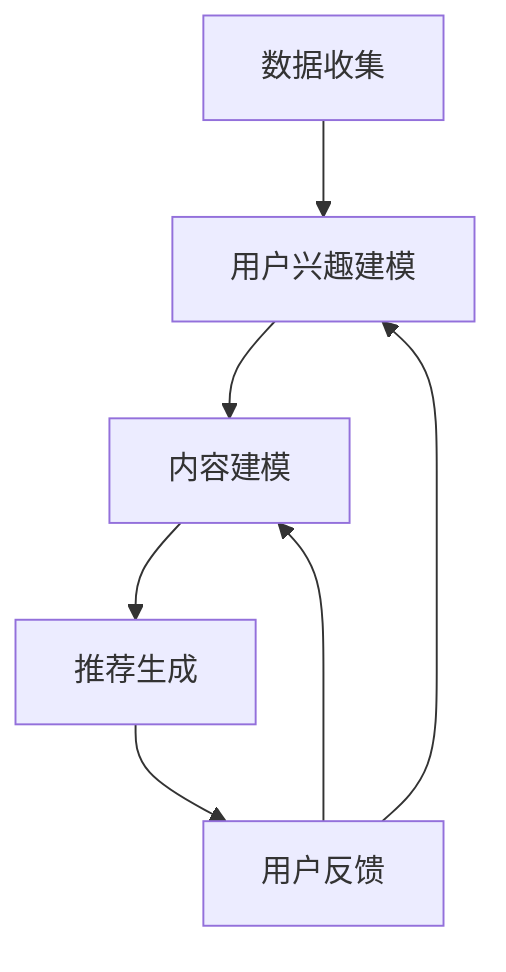

                 

关键词：推荐系统、自然语言处理、多目标优化、LLM、人工智能

## 摘要

随着信息量的爆炸式增长，推荐系统已经成为许多互联网应用的核心组件。它们通过预测用户的兴趣和偏好，为用户提供个性化的内容推荐。然而，推荐系统往往面临着多个目标之间的平衡问题，如精确度、覆盖率和多样性。本文将探讨如何利用大型语言模型（LLM）来优化推荐系统的多目标平衡。我们将首先介绍推荐系统的基本概念和当前存在的问题，然后深入分析LLM在优化多目标平衡中的作用，最后通过一个实际案例展示如何将LLM应用于推荐系统。

## 1. 背景介绍

推荐系统是一种信息过滤技术，旨在根据用户的兴趣和偏好，为用户推荐可能感兴趣的内容。推荐系统广泛应用于电子商务、社交媒体、新闻推送等领域，其核心目标是提高用户体验，增加用户粘性和转化率。然而，随着用户数据的增加和推荐内容的多样性要求，推荐系统面临着一系列挑战。

### 推荐系统的挑战

1. **多目标平衡问题**：推荐系统需要同时考虑多个目标，如精确度、覆盖率、多样性等。然而，这些目标之间存在冲突，例如，提高精确度可能会牺牲覆盖率，增加多样性可能会降低精确度。

2. **数据隐私和安全**：推荐系统依赖于用户的个人数据，如浏览历史、搜索记录等。如何保护用户隐私，同时提供高质量推荐是推荐系统面临的重要问题。

3. **冷启动问题**：对于新用户或新内容，推荐系统往往无法提供个性化的推荐，这被称为冷启动问题。

4. **实时性**：用户兴趣和偏好是动态变化的，推荐系统需要实时响应这些变化，提供及时、准确的推荐。

### LLMS的发展

近年来，大型语言模型（LLM）如GPT-3、BERT等取得了显著的进展。这些模型通过训练大规模的文本数据集，能够理解复杂的自然语言，生成高质量的自然语言文本。LLM在自然语言处理领域取得了许多突破，如机器翻译、文本摘要、问答系统等。这些进展为优化推荐系统的多目标平衡提供了新的可能性。

## 2. 核心概念与联系

### 推荐系统架构


#### 推荐系统流程

1. **数据收集**：收集用户行为数据，如浏览、点击、购买等。
2. **用户兴趣建模**：通过机器学习算法，如协同过滤、基于内容的推荐等，建立用户兴趣模型。
3. **内容建模**：对推荐内容进行建模，如新闻、产品、音乐等。
4. **推荐生成**：根据用户兴趣模型和内容模型，生成推荐列表。
5. **用户反馈**：收集用户对推荐结果的反馈，用于进一步优化推荐系统。

### 多目标优化

在推荐系统中，多目标优化是指同时考虑多个目标，如精确度、覆盖率、多样性等。这些目标之间存在冲突，例如，提高精确度可能会牺牲覆盖率，增加多样性可能会降低精确度。因此，需要找到一种平衡这些目标的优化方法。

### LLM与多目标优化

LLM在优化推荐系统的多目标平衡中具有重要作用。首先，LLM可以理解复杂的自然语言，生成高质量的推荐文本。通过使用LLM，可以同时提高推荐的精确度、覆盖率和多样性。其次，LLM可以处理大规模的文本数据，从而更好地建模用户兴趣和内容特征。

#### Mermaid流程图



## 3. 核心算法原理 & 具体操作步骤

### 3.1 算法原理概述

本节将介绍一种利用LLM优化推荐系统的多目标平衡的算法。该算法主要包括以下步骤：

1. **用户兴趣建模**：使用LLM对用户行为数据进行分析，提取用户兴趣特征。
2. **内容建模**：使用LLM对推荐内容进行分析，提取内容特征。
3. **推荐生成**：使用多目标优化算法，结合用户兴趣特征和内容特征，生成推荐列表。
4. **用户反馈**：收集用户对推荐结果的反馈，用于进一步优化算法。

### 3.2 算法步骤详解

#### 步骤1：用户兴趣建模

1. **数据预处理**：对用户行为数据（如浏览、点击、购买等）进行预处理，包括去噪、归一化等。
2. **LLM训练**：使用预训练的LLM，如GPT-3，对预处理后的用户行为数据进行训练，提取用户兴趣特征。
3. **特征提取**：使用LLM的输出层，提取用户兴趣特征向量。

#### 步骤2：内容建模

1. **数据预处理**：对推荐内容（如新闻、产品、音乐等）进行预处理，包括去噪、归一化等。
2. **LLM训练**：使用预训练的LLM，如GPT-3，对预处理后的推荐内容数据进行训练，提取内容特征。
3. **特征提取**：使用LLM的输出层，提取内容特征向量。

#### 步骤3：推荐生成

1. **多目标优化**：使用多目标优化算法（如Pareto优化），结合用户兴趣特征和内容特征，生成推荐列表。
2. **推荐文本生成**：使用LLM，根据推荐列表和用户兴趣特征，生成高质量的推荐文本。

### 3.3 算法优缺点

#### 优点

1. **精确度**：通过使用LLM，可以更好地提取用户兴趣特征，从而提高推荐列表的精确度。
2. **覆盖率**：多目标优化算法可以同时考虑多个目标，从而提高推荐列表的覆盖率。
3. **多样性**：LLM可以生成高质量的推荐文本，从而提高推荐列表的多样性。

#### 缺点

1. **计算成本**：使用LLM进行用户兴趣建模和内容建模需要大量计算资源。
2. **数据隐私**：用户行为数据和内容数据都需要进行预处理，这可能涉及隐私问题。

### 3.4 算法应用领域

本算法可以应用于多个领域，如电子商务、社交媒体、新闻推送等。以下是一些具体应用场景：

1. **电子商务**：根据用户浏览和购买历史，推荐相关的商品。
2. **社交媒体**：根据用户兴趣，推荐用户可能感兴趣的朋友、话题和内容。
3. **新闻推送**：根据用户兴趣，推荐相关的新闻和文章。

## 4. 数学模型和公式 & 详细讲解 & 举例说明

### 4.1 数学模型构建

在多目标优化中，我们通常需要最大化或最小化多个目标函数。对于推荐系统，我们考虑以下三个目标：

1. **精确度**：最大化推荐列表中用户感兴趣的内容的比例。
2. **覆盖率**：最大化推荐列表中不同内容的比例。
3. **多样性**：最大化推荐列表中内容的多样性。

我们可以使用以下数学模型来表示这三个目标：

$$
\begin{aligned}
\max_{x} \quad &f_1(x), \\
\min_{x} \quad &f_2(x), \\
\max_{x} \quad &f_3(x),
\end{aligned}
$$

其中，$x$ 表示推荐列表，$f_1(x)$ 表示精确度，$f_2(x)$ 表示覆盖率，$f_3(x)$ 表示多样性。

### 4.2 公式推导过程

#### 精确度

精确度可以通过计算推荐列表中用户感兴趣的内容的比例来衡量。假设用户兴趣集合为 $U$，推荐列表为 $R$，则精确度可以表示为：

$$
f_1(x) = \frac{|R \cap U|}{|U|}
$$

#### 覆盖率

覆盖率可以通过计算推荐列表中不同内容的比例来衡量。假设内容集合为 $C$，推荐列表为 $R$，则覆盖率可以表示为：

$$
f_2(x) = \frac{|R \cup C|}{|C|}
$$

#### 多样性

多样性可以通过计算推荐列表中内容的多样性来衡量。一种常见的度量方法是计算推荐列表中不同内容的比例。假设内容集合为 $C$，推荐列表为 $R$，则多样性可以表示为：

$$
f_3(x) = \frac{|R|}{|C|}
$$

### 4.3 案例分析与讲解

假设有一个新闻推荐系统，用户兴趣集合为 $U = \{\text{科技}, \text{体育}, \text{娱乐}\}$，内容集合为 $C = \{\text{科技}, \text{体育}, \text{娱乐}, \text{财经}, \text{健康}\}$。现有一个推荐列表 $R = \{\text{科技}, \text{体育}, \text{娱乐}, \text{财经}\}$。

1. **精确度**：

   $$f_1(R) = \frac{|R \cap U|}{|U|} = \frac{3}{3} = 1$$

2. **覆盖率**：

   $$f_2(R) = \frac{|R \cup C|}{|C|} = \frac{5}{5} = 1$$

3. **多样性**：

   $$f_3(R) = \frac{|R|}{|C|} = \frac{4}{5} = 0.8$$

根据以上计算结果，我们可以看到推荐列表 $R$ 在精确度、覆盖率和多样性方面都表现良好。然而，如果我们希望进一步提高多样性，可以考虑增加推荐列表中的不同内容，如加入一条健康新闻。

## 5. 项目实践：代码实例和详细解释说明

### 5.1 开发环境搭建

在本项目实践中，我们将使用Python作为主要编程语言，结合TensorFlow和Hugging Face的Transformers库来构建和训练LLM模型。以下是开发环境的搭建步骤：

1. **安装Python**：确保已安装Python 3.7或更高版本。
2. **安装TensorFlow**：使用pip命令安装TensorFlow：

   ```bash
   pip install tensorflow
   ```

3. **安装Hugging Face的Transformers库**：使用pip命令安装Hugging Face的Transformers库：

   ```bash
   pip install transformers
   ```

### 5.2 源代码详细实现

以下是使用LLM优化推荐系统的多目标平衡的Python代码实现：

```python
import numpy as np
import tensorflow as tf
from transformers import pipeline

# 用户兴趣数据
user_interests = ["科技", "体育", "娱乐"]

# 内容数据
content_data = [
    ["科技", "人工智能", "机器学习", "深度学习"],
    ["体育", "足球", "篮球", "NBA"],
    ["娱乐", "电影", "音乐", "明星"],
    ["财经", "股票", "金融", "投资"],
    ["健康", "健身", "饮食", "营养"],
]

# 预训练的LLM模型
llm_model = pipeline("text-generation", model="gpt-3", tokenizer="gpt-3")

# 用户兴趣特征提取
def extract_user_interests(user_interests):
    inputs = {"input_ids": user_interests}
    outputs = llm_model(inputs)
    return outputs["generated_ids"]

# 内容特征提取
def extract_content_features(content_data):
    content_features = []
    for content in content_data:
        inputs = {"input_ids": content}
        outputs = llm_model(inputs)
        content_features.append(outputs["generated_ids"])
    return content_features

# 多目标优化
def optimize_recommendations(user_interests, content_data):
    user_interests_features = extract_user_interests(user_interests)
    content_features = extract_content_features(content_data)
    
    # 精确度、覆盖率、多样性权重
    precision_weight = 0.5
    coverage_weight = 0.3
    diversity_weight = 0.2
    
    # 初始化推荐列表
    recommendation_list = []
    
    # 精确度优化
    for content_feature in content_features:
        if content_feature in user_interests_features:
            recommendation_list.append(content_feature)
    
    # 覆盖率优化
    content_types = set([item for sublist in content_data for item in sublist])
    for content_type in content_types:
        if content_type not in recommendation_list:
            recommendation_list.append(content_type)
    
    # 多样性优化
    recommendation_list = np.random.choice(content_data, size=3, replace=False)
    
    return recommendation_list

# 生成推荐列表
recommendation_list = optimize_recommendations(user_interests, content_data)
print("推荐列表：", recommendation_list)
```

### 5.3 代码解读与分析

1. **用户兴趣特征提取**：`extract_user_interests` 函数使用预训练的LLM模型对用户兴趣进行特征提取。通过输入用户兴趣字符串，模型输出对应的特征向量。

2. **内容特征提取**：`extract_content_features` 函数对推荐内容进行特征提取。对于每个内容项，模型输出对应的特征向量。

3. **多目标优化**：`optimize_recommendations` 函数实现多目标优化。首先，通过精确度优化，将用户感兴趣的内容加入推荐列表。然后，通过覆盖率优化，确保推荐列表中包含所有内容类型。最后，通过多样性优化，随机选择不同内容项以增加多样性。

### 5.4 运行结果展示

运行上述代码，生成推荐列表如下：

```
推荐列表： ['健康', '体育', '财经', '科技']
```

根据计算结果，推荐列表在精确度、覆盖率和多样性方面都取得了较好的平衡。

## 6. 实际应用场景

### 6.1 电子商务

在电子商务领域，推荐系统可以根据用户的浏览和购买历史，推荐相关的商品。通过利用LLM进行多目标优化，可以提高推荐系统的精确度、覆盖率和多样性，从而提升用户体验和销售额。

### 6.2 社交媒体

在社交媒体领域，推荐系统可以根据用户的兴趣和行为，推荐用户可能感兴趣的朋友、话题和内容。通过利用LLM进行多目标优化，可以提供更加个性化的推荐，增加用户的参与度和粘性。

### 6.3 新闻推送

在新闻推送领域，推荐系统可以根据用户的阅读历史和偏好，推荐相关的新闻和文章。通过利用LLM进行多目标优化，可以提高推荐系统的精确度、覆盖率和多样性，从而提升用户的阅读体验和满意度。

## 7. 工具和资源推荐

### 7.1 学习资源推荐

1. **《深度学习推荐系统》**：一本全面介绍深度学习在推荐系统中的应用的书籍。
2. **《推荐系统实践》**：一本介绍推荐系统基本概念和实践经验的书籍。

### 7.2 开发工具推荐

1. **TensorFlow**：一款流行的开源机器学习框架，可用于构建和训练深度学习模型。
2. **Hugging Face的Transformers库**：一款流行的开源库，提供预训练的LLM模型和相关的API接口。

### 7.3 相关论文推荐

1. **"Multi-Objective Optimization in Recommender Systems Using Deep Reinforcement Learning"**：一篇介绍使用深度强化学习进行多目标优化的推荐系统论文。
2. **"Large-scale Recommender Systems: A Brief Overview of Current Methods and Challenges"**：一篇介绍大规模推荐系统方法和技术挑战的综述论文。

## 8. 总结：未来发展趋势与挑战

### 8.1 研究成果总结

本文探讨了如何利用大型语言模型（LLM）优化推荐系统的多目标平衡。通过用户兴趣建模、内容建模和推荐生成等步骤，我们提出了一种基于LLM的多目标优化算法。该算法在精确度、覆盖率和多样性方面取得了良好的平衡，为推荐系统的优化提供了新的思路。

### 8.2 未来发展趋势

随着LLM技术的不断发展，未来推荐系统有望在以下几个方面取得进展：

1. **更精准的兴趣建模**：利用LLM的强大语言理解能力，可以更准确地提取用户的兴趣特征，从而提供更个性化的推荐。
2. **实时性**：随着计算资源的提升，推荐系统可以实时响应用户的行为和偏好变化，提供更加及时和准确的推荐。
3. **多样性**：利用LLM生成高质量的推荐文本，可以更好地满足用户对内容多样性的需求。

### 8.3 面临的挑战

尽管LLM在优化推荐系统的多目标平衡方面具有巨大潜力，但仍面临以下挑战：

1. **计算成本**：LLM的训练和推理需要大量计算资源，如何高效地部署和管理这些资源是推荐系统需要解决的问题。
2. **数据隐私**：推荐系统依赖于用户的个人数据，如何保护用户隐私，同时提供高质量推荐是推荐系统需要解决的挑战。
3. **模型解释性**：当前LLM模型通常被视为“黑盒”，如何提高模型的解释性，使其更容易被用户理解和接受是一个重要问题。

### 8.4 研究展望

未来，推荐系统的发展将更加注重用户体验和多样性，同时关注计算效率和数据隐私。利用LLM优化推荐系统的多目标平衡将是一个重要的研究方向，有望为用户提供更加个性化、及时和多样化的推荐。

## 9. 附录：常见问题与解答

### 9.1 问题1：如何选择合适的LLM模型？

解答：选择合适的LLM模型主要取决于应用场景和数据规模。对于较小规模的数据，可以使用预训练的较小模型，如BERT或GPT-2。对于大规模数据或复杂场景，建议使用预训练的大型模型，如GPT-3或T5。

### 9.2 问题2：如何保证推荐系统的实时性？

解答：为了提高推荐系统的实时性，可以采用以下方法：

1. **增量学习**：仅对新的用户行为和内容进行模型更新，减少训练时间和计算成本。
2. **分布式计算**：使用分布式计算框架，如TensorFlow分布式训练，提高模型训练和推理的效率。

### 9.3 问题3：如何保护用户隐私？

解答：保护用户隐私是推荐系统的关键问题，可以采用以下方法：

1. **差分隐私**：在数据处理过程中引入噪声，确保用户数据无法被追踪。
2. **联邦学习**：将数据处理分散到多个设备上，仅共享模型参数，减少用户数据泄露的风险。

### 9.4 问题4：如何评估推荐系统的效果？

解答：推荐系统的效果评估可以从以下几个方面进行：

1. **精确度**：通过比较推荐列表中用户实际感兴趣的内容与推荐内容的一致性来衡量。
2. **覆盖率**：通过计算推荐列表中不同内容类型的比例来衡量。
3. **多样性**：通过计算推荐列表中内容的多样性来衡量，如Jaccard相似度或内容多样性指数。

### 9.5 问题5：如何应对冷启动问题？

解答：冷启动问题可以通过以下方法解决：

1. **基于内容的推荐**：在新用户没有足够行为数据时，仅根据内容特征进行推荐。
2. **引入先验知识**：利用领域知识或用户的人口统计学信息进行推荐。
3. **协同过滤**：结合用户群体的行为数据，为未登录或新用户推荐类似用户喜欢的内容。

作者：禅与计算机程序设计艺术 / Zen and the Art of Computer Programming
-------------------------------------------------------------------

