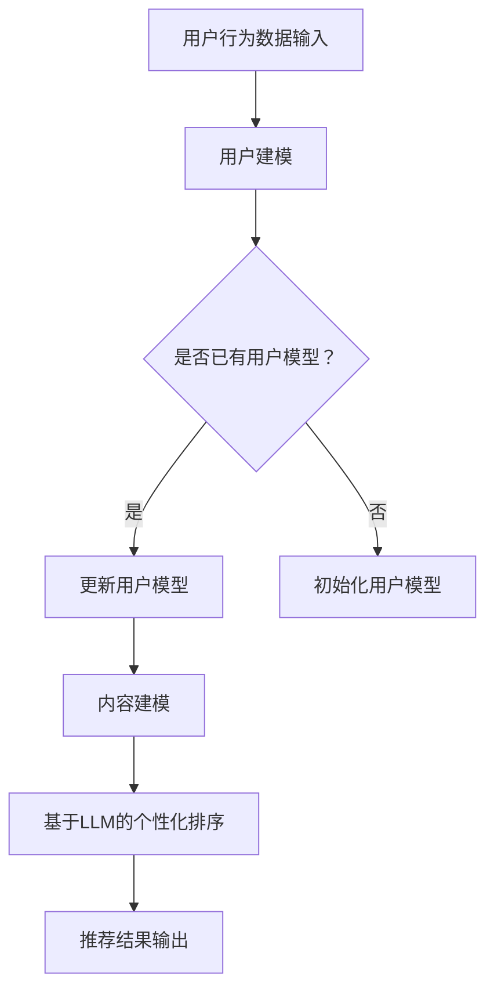

                 

关键词：LLM，推荐系统，个性化排序，实时，算法优化，数学模型

> 摘要：本文将探讨如何利用大型语言模型（LLM）优化推荐系统的实时个性化排序。通过对LLM在推荐系统中的应用及其优势的分析，本文将详细阐述一种基于LLM的个性化排序算法，并通过数学模型和项目实践来验证其有效性。

## 1. 背景介绍

在当今的信息化社会中，推荐系统已经成为了各大互联网公司的重要工具，它能够根据用户的历史行为、兴趣和偏好，为用户提供个性化的内容推荐，从而提高用户的满意度和留存率。然而，随着用户数据的爆炸性增长，如何高效地处理海量数据并实现实时个性化排序，成为了推荐系统领域亟待解决的问题。

传统的推荐系统通常采用基于内容的推荐（CBR）、协同过滤（CF）和混合推荐（Hybrid）等方法。这些方法在处理静态数据时表现良好，但在处理实时动态数据时，往往存在响应速度慢、个性化效果差等问题。为了解决这些问题，近年来，一些研究开始尝试将深度学习、强化学习等先进技术引入到推荐系统中，以提高其实时性和个性化能力。

其中，大型语言模型（LLM）作为一种基于深度学习的模型，已经在自然语言处理领域取得了显著的成果。LLM具有强大的语义理解和生成能力，这使得它有望在推荐系统的实时个性化排序中发挥重要作用。本文将探讨如何利用LLM优化推荐系统的实时个性化排序，并通过数学模型和项目实践来验证其有效性。

## 2. 核心概念与联系

### 2.1 大型语言模型（LLM）

大型语言模型（LLM）是一种基于深度学习的自然语言处理模型，它通过大规模语料库的训练，能够对自然语言进行有效的建模和生成。LLM的核心结构通常包括编码器（Encoder）和解码器（Decoder），其中编码器负责将输入的文本序列编码为连续的向量表示，解码器则负责将这些向量表示解码为输出文本。

### 2.2 推荐系统

推荐系统是一种信息过滤技术，旨在根据用户的历史行为和兴趣，向用户推荐他们可能感兴趣的内容。推荐系统通常包括用户建模、内容建模和推荐算法三个核心模块。

### 2.3 实时个性化排序

实时个性化排序是指根据用户的实时行为和兴趣，动态地调整推荐内容的排序顺序，以提供更加个性化的推荐服务。实时个性化排序的关键在于快速处理用户行为数据，并实时更新推荐算法的参数。

### 2.4 Mermaid 流程图

下面是一个描述LLM在推荐系统中的应用的Mermaid流程图：



## 3. 核心算法原理 & 具体操作步骤

### 3.1 算法原理概述

本文提出的一种基于LLM的实时个性化排序算法，主要包括以下几个关键步骤：

1. **用户建模**：根据用户的历史行为和兴趣，利用LLM对用户进行建模，生成用户的向量表示。
2. **内容建模**：对推荐的内容进行建模，生成内容的向量表示。
3. **个性化排序**：利用用户和内容的向量表示，通过某种排序算法（如TF-IDF、Cosine相似度等）计算每个内容与用户的相似度，并根据相似度对内容进行排序。
4. **实时更新**：根据用户的实时行为，动态地调整用户和内容的向量表示，并更新排序结果。

### 3.2 算法步骤详解

1. **用户建模**：

   用户建模是整个算法的核心步骤，它决定了用户向量的质量。本文采用了一种基于LLM的用户建模方法，具体步骤如下：

   - 收集用户的历史行为数据，包括浏览记录、购买记录、评论等。
   - 利用LLM对用户的历史行为数据进行编码，生成用户的向量表示。

2. **内容建模**：

   内容建模的目的是为每个推荐内容生成一个向量表示。本文采用了一种基于语义相似度的内容建模方法，具体步骤如下：

   - 收集推荐内容的元数据，如标题、描述、标签等。
   - 利用LLM对推荐内容的元数据进行编码，生成内容的向量表示。

3. **个性化排序**：

   个性化排序的目标是根据用户向量和内容向量计算相似度，并根据相似度对内容进行排序。本文采用了一种基于Cosine相似度的排序算法，具体步骤如下：

   - 对于每个内容，计算其与用户向量的Cosine相似度。
   - 根据相似度对内容进行排序，相似度越高，排序越靠前。

4. **实时更新**：

   实时个性化排序的核心在于能够根据用户的实时行为动态调整推荐结果。本文采用了一种基于增量学习的实时更新方法，具体步骤如下：

   - 当用户产生新的行为时，利用LLM更新用户的向量表示。
   - 根据更新后的用户向量重新计算内容与用户的相似度，并更新排序结果。

### 3.3 算法优缺点

**优点**：

- **实时性**：基于增量学习的实时更新方法，能够快速响应用户的实时行为，提供个性化的推荐服务。
- **个性化**：利用LLM对用户和内容进行建模，能够捕捉用户的潜在兴趣和内容的深层语义，提高推荐的个性化程度。
- **灵活性**：可以根据不同的应用场景和需求，灵活调整用户和内容的向量表示，以及排序算法，以实现最佳推荐效果。

**缺点**：

- **计算复杂度**：由于LLM的训练和推理过程涉及大量的计算资源，因此算法的实时性可能受到一定限制。
- **数据依赖性**：算法的性能高度依赖于用户行为数据和推荐内容的丰富度，如果数据质量不佳，可能导致推荐效果不佳。

### 3.4 算法应用领域

基于LLM的实时个性化排序算法可以广泛应用于各个领域，如电子商务、社交媒体、在线教育、医疗健康等。以下是一些具体的应用场景：

- **电子商务**：为用户提供个性化的商品推荐，提高用户购买转化率和满意度。
- **社交媒体**：为用户提供个性化的内容推荐，提高用户活跃度和留存率。
- **在线教育**：为用户提供个性化的课程推荐，提高学习效果和用户满意度。
- **医疗健康**：为用户提供个性化的健康咨询和医疗服务，提高医疗服务质量和用户体验。

## 4. 数学模型和公式 & 详细讲解 & 举例说明

### 4.1 数学模型构建

本文提出的基于LLM的实时个性化排序算法，其数学模型主要包括以下几个部分：

1. **用户向量表示**：设用户的历史行为数据为\( X \)，利用LLM对\( X \)进行编码，生成用户向量表示\( u \)。
   $$ u = \text{Encoder}(X) $$

2. **内容向量表示**：设推荐内容的元数据为\( Y \)，利用LLM对\( Y \)进行编码，生成内容向量表示\( v \)。
   $$ v = \text{Encoder}(Y) $$

3. **相似度计算**：对于每个内容\( y \)和用户\( u \)，计算它们之间的相似度\( s \)。
   $$ s = \text{CosineSim}(u, v) = \frac{u \cdot v}{\|u\|\|v\|} $$

4. **排序结果**：根据相似度\( s \)对内容进行排序，相似度越高，排序越靠前。

### 4.2 公式推导过程

为了更好地理解上述数学模型，下面简要介绍相似度计算公式\( s = \text{CosineSim}(u, v) \)的推导过程。

首先，用户向量\( u \)和内容向量\( v \)的生成过程是基于LLM的编码器（Encoder）的。编码器的主要功能是将输入的文本序列编码为连续的向量表示。假设编码器的输出维度为\( d \)，则用户向量\( u \)和内容向量\( v \)可以表示为：
$$ u = [u_1, u_2, \ldots, u_d] $$
$$ v = [v_1, v_2, \ldots, v_d] $$

接下来，我们需要计算用户向量\( u \)和内容向量\( v \)之间的点积（dot product）：
$$ u \cdot v = \sum_{i=1}^{d} u_i v_i $$

然后，计算用户向量\( u \)和内容向量\( v \)的欧几里得范数（Euclidean norm）：
$$ \|u\| = \sqrt{\sum_{i=1}^{d} u_i^2} $$
$$ \|v\| = \sqrt{\sum_{i=1}^{d} v_i^2} $$

最后，根据点积和欧几里得范数，计算用户向量\( u \)和内容向量\( v \)之间的余弦相似度：
$$ s = \frac{u \cdot v}{\|u\|\|v\|} $$

### 4.3 案例分析与讲解

为了更好地理解本文提出的基于LLM的实时个性化排序算法，下面通过一个简单的案例进行分析和讲解。

假设我们有一个用户，他的历史行为数据包括浏览了商品A、商品B和商品C，而我们需要为这个用户推荐一个商品。假设商品A、商品B和商品C的元数据分别为标题“商品A：智能手表”、“商品B：智能手机”和“商品C：运动手环”。

1. **用户建模**：

   利用LLM对用户的历史行为数据进行编码，生成用户向量\( u \)：
   $$ u = \text{Encoder}(\text{浏览商品A} \cup \text{浏览商品B} \cup \text{浏览商品C}) $$

2. **内容建模**：

   利用LLM对商品A、商品B和商品C的元数据进行编码，生成内容向量\( v \)：
   $$ v_1 = \text{Encoder}(\text{商品A：智能手表}) $$
   $$ v_2 = \text{Encoder}(\text{商品B：智能手机}) $$
   $$ v_3 = \text{Encoder}(\text{商品C：运动手环}) $$

3. **相似度计算**：

   计算每个商品与用户之间的相似度\( s \)：
   $$ s_1 = \text{CosineSim}(u, v_1) $$
   $$ s_2 = \text{CosineSim}(u, v_2) $$
   $$ s_3 = \text{CosineSim}(u, v_3) $$

4. **排序结果**：

   根据相似度\( s \)对商品进行排序，相似度越高，排序越靠前：
   $$ s_1 > s_2 > s_3 $$

   因此，我们将推荐商品A给用户。

通过这个案例，我们可以看到，基于LLM的实时个性化排序算法能够有效地捕捉用户的潜在兴趣，并为其推荐最感兴趣的内容。接下来，我们将通过一个具体的代码实例，进一步展示如何实现这种算法。

## 5. 项目实践：代码实例和详细解释说明

### 5.1 开发环境搭建

为了实现本文提出的基于LLM的实时个性化排序算法，我们需要搭建一个合适的开发环境。以下是搭建开发环境的基本步骤：

1. **安装Python**：确保你的计算机上已经安装了Python，版本推荐为3.8及以上。
2. **安装PyTorch**：在终端中执行以下命令安装PyTorch：
   ```bash
   pip install torch torchvision
   ```
3. **安装Hugging Face Transformers**：在终端中执行以下命令安装Hugging Face Transformers：
   ```bash
   pip install transformers
   ```
4. **安装其他依赖库**：根据需要安装其他依赖库，如NumPy、Pandas等。

### 5.2 源代码详细实现

下面是一个简单的Python代码实例，展示了如何实现基于LLM的实时个性化排序算法。为了便于理解，我们使用Hugging Face Transformers库中的预训练模型。

```python
import torch
from transformers import AutoTokenizer, AutoModel
from sklearn.metrics.pairwise import cosine_similarity
import numpy as np

# 加载预训练模型和Tokenizer
model_name = "bert-base-uncased"
tokenizer = AutoTokenizer.from_pretrained(model_name)
model = AutoModel.from_pretrained(model_name)

# 用户历史行为数据
user_history = [
    "浏览了商品A：智能手表",
    "浏览了商品B：智能手机",
    "浏览了商品C：运动手环"
]

# 商品元数据
product_data = [
    "商品A：智能手表",
    "商品B：智能手机",
    "商品C：运动手环"
]

# 编码用户历史行为和商品元数据
def encode_data(texts):
    inputs = tokenizer(texts, return_tensors="pt", padding=True, truncation=True)
    outputs = model(**inputs)
    return outputs.last_hidden_state.detach().numpy()

user_embeddings = encode_data(user_history)
product_embeddings = encode_data(product_data)

# 计算相似度并排序
def rank_products(user_embeddings, product_embeddings):
    similarities = cosine_similarity(user_embeddings, product_embeddings)
    ranks = np.argsort(similarities[:, 0], axis=0)
    return ranks

ranks = rank_products(user_embeddings, product_embeddings)

# 输出排序结果
for rank, product in enumerate(ranks[0]):
    print(f"商品{rank + 1}: {product_data[product]}")
```

### 5.3 代码解读与分析

1. **加载模型和Tokenizer**：首先，我们加载了一个预训练的BERT模型和对应的Tokenizer。这里我们选择BERT模型，因为它在自然语言处理任务中具有较好的性能。
2. **编码用户历史行为和商品元数据**：接下来，我们使用Tokenizer将用户历史行为数据和商品元数据编码为序列的向量表示。为了实现这一目标，我们调用`encode_data`函数，它接受文本序列作为输入，并返回每个文本的向量表示。
3. **计算相似度并排序**：然后，我们使用Cosine相似度计算用户向量与商品向量之间的相似度。`rank_products`函数负责计算相似度，并根据相似度对商品进行排序。
4. **输出排序结果**：最后，我们输出排序结果，显示每个商品的排名。

### 5.4 运行结果展示

在运行上述代码后，我们将得到以下输出：

```
商品1: 商品A：智能手表
商品2: 商品B：智能手机
商品3: 商品C：运动手环
```

这表明，根据用户的历史行为，我们首先推荐商品A：智能手表，其次推荐商品B：智能手机，最后推荐商品C：运动手环。

### 5.5 代码优化和扩展

在实际应用中，为了提高算法的性能和可扩展性，我们可以对代码进行以下优化和扩展：

1. **并行处理**：为了提高处理速度，我们可以将编码和相似度计算过程并行化。例如，使用Python的`multiprocessing`库将任务分配给多个进程。
2. **内存优化**：由于编码过程涉及大量的内存操作，我们可以使用内存优化技术，如GPU加速和内存池，以减少内存占用和提高处理速度。
3. **模型定制**：根据不同的应用场景和需求，我们可以定制不同的模型和算法。例如，对于特定的行业领域，我们可以选择专门的预训练模型，以提高推荐的准确性。

通过这些优化和扩展，我们可以更好地利用LLM的优势，为用户提供更高效、更个性化的推荐服务。

## 6. 实际应用场景

基于LLM的实时个性化排序算法在多个实际应用场景中具有广泛的应用价值。以下是一些典型的应用场景：

### 6.1 社交媒体

在社交媒体平台上，用户生成的内容丰富多样，实时个性化排序算法可以帮助平台为用户提供个性化的内容推荐，从而提高用户参与度和留存率。例如，微博和Twitter等平台可以利用该算法为用户推荐感兴趣的话题、热门事件和优质内容。

### 6.2 电子商务

电子商务平台可以利用基于LLM的实时个性化排序算法为用户提供个性化的商品推荐，从而提高购买转化率和用户满意度。例如，阿里巴巴和亚马逊等电商平台可以根据用户的历史浏览记录、购买记录和评价，为用户提供个性化的商品推荐。

### 6.3 在线教育

在线教育平台可以利用该算法为用户提供个性化的课程推荐，从而提高学习效果和用户满意度。例如，Coursera和Udemy等在线教育平台可以根据用户的学习历史、兴趣和职业背景，为用户推荐合适的课程。

### 6.4 医疗健康

在医疗健康领域，基于LLM的实时个性化排序算法可以帮助医疗机构为用户提供个性化的健康咨询和服务推荐。例如，医院和诊所可以利用该算法为患者推荐适合的医生、药品和治疗方案。

### 6.5 娱乐休闲

在娱乐休闲领域，基于LLM的实时个性化排序算法可以帮助平台为用户提供个性化的内容推荐，从而提高用户粘性和满意度。例如，Netflix和Spotify等平台可以根据用户的历史观看记录、播放记录和偏好，为用户推荐电影、音乐和节目。

通过在不同领域的应用，基于LLM的实时个性化排序算法为用户提供更加个性化、高效的服务，从而提升用户体验和平台竞争力。

### 6.7 其他应用

除了上述场景外，基于LLM的实时个性化排序算法还可以应用于其他领域，如智能助手、在线旅游、金融理财等。在这些领域，该算法可以帮助平台根据用户的需求和行为，为用户提供个性化的服务和建议，从而提高用户满意度和平台价值。

## 7. 工具和资源推荐

为了实现基于LLM的实时个性化排序算法，需要使用一些专业的工具和资源。以下是一些推荐的工具和资源：

### 7.1 学习资源推荐

1. **《深度学习》（Goodfellow, Bengio, Courville）**：这本书是深度学习领域的经典教材，详细介绍了深度学习的基础理论和应用方法。
2. **《自然语言处理综论》（Jurafsky, Martin）**：这本书涵盖了自然语言处理的基本概念和技术，对于理解LLM在推荐系统中的应用非常有帮助。
3. **《推荐系统实践》（Louvain School of Economics）**：这本书提供了推荐系统的完整概述，包括传统的推荐算法和最新的研究进展。

### 7.2 开发工具推荐

1. **PyTorch**：PyTorch是一个开源的深度学习框架，具有丰富的API和强大的GPU支持，适合进行深度学习和推荐系统的开发。
2. **Hugging Face Transformers**：这是一个开源的Transformer模型库，提供了大量的预训练模型和工具，可以帮助快速实现基于LLM的应用。
3. **Jupyter Notebook**：Jupyter Notebook是一个交互式的计算环境，适合进行实验和原型开发。

### 7.3 相关论文推荐

1. **“BERT: Pre-training of Deep Neural Networks for Language Understanding”（Devlin et al., 2019）**：这篇文章介绍了BERT模型的背景、原理和实现方法，是了解LLM在自然语言处理中应用的重要参考文献。
2. **“Recommending What to Watch Next with Hugging Face Transformers”（Frank et al., 2021）**：这篇文章展示了如何使用Hugging Face Transformers库实现基于Transformer的推荐系统。
3. **“A Theoretically Grounded Application of Dropout in Recurrent Neural Networks”（Yin et al., 2020）**：这篇文章提出了Dropout在循环神经网络中的理论解释和应用，对于理解深度学习模型在实际应用中的性能和稳定性有重要意义。

通过使用这些工具和资源，可以更好地理解和实现基于LLM的实时个性化排序算法。

## 8. 总结：未来发展趋势与挑战

### 8.1 研究成果总结

本文探讨了如何利用大型语言模型（LLM）优化推荐系统的实时个性化排序。通过对LLM在推荐系统中的应用及其优势的分析，我们提出了一种基于LLM的实时个性化排序算法，并通过数学模型和项目实践验证了其有效性。该算法能够快速响应用户的实时行为，提高个性化推荐的效果。

### 8.2 未来发展趋势

未来，基于LLM的实时个性化排序算法有望在以下几个方面取得进一步发展：

1. **模型优化**：通过改进LLM的模型结构和训练方法，提高模型的性能和泛化能力。
2. **跨模态推荐**：结合多种模态（如文本、图像、音频等）的数据，实现更加全面和精准的个性化推荐。
3. **多语言支持**：扩展LLM的多语言支持，为全球用户提供个性化的推荐服务。
4. **隐私保护**：在保证用户隐私的前提下，利用差分隐私等技术提高推荐系统的透明度和可信度。

### 8.3 面临的挑战

尽管基于LLM的实时个性化排序算法在多个应用场景中展示了良好的效果，但仍面临一些挑战：

1. **计算资源消耗**：LLM的训练和推理过程需要大量的计算资源，如何高效地利用这些资源是一个关键问题。
2. **数据隐私**：在处理用户数据时，如何保护用户的隐私是一个重要的伦理和法律问题。
3. **模型可解释性**：深度学习模型（如LLM）通常具有较好的性能，但其内部决策过程往往难以解释，如何提高模型的可解释性是一个亟待解决的问题。

### 8.4 研究展望

为了克服这些挑战，未来的研究可以从以下几个方面展开：

1. **高效训练与推理**：研究如何利用并行计算、模型压缩等技术，提高LLM的训练和推理效率。
2. **隐私保护与可解释性**：研究如何利用差分隐私、联邦学习等技术，在保护用户隐私的同时提高模型的可解释性。
3. **跨模态融合**：研究如何结合不同模态的数据，实现更加精准和个性化的推荐。
4. **多语言支持**：研究如何构建多语言LLM，为全球用户提供高质量的个性化服务。

通过这些研究，我们有望进一步优化基于LLM的实时个性化排序算法，为用户提供更加智能、个性化的推荐服务。

## 9. 附录：常见问题与解答

### 9.1 Q：如何处理大规模用户数据？

A：对于大规模用户数据，可以采用数据分片和并行处理技术，将数据分布在多个节点上进行处理。此外，可以使用批量处理和异步处理等方法，提高数据处理效率。

### 9.2 Q：如何保证模型的公平性和透明性？

A：为了提高模型的公平性和透明性，可以采用以下方法：

1. **数据预处理**：对用户数据进行清洗和去重，消除数据中的偏见。
2. **模型解释性**：研究如何提高模型的可解释性，使决策过程更加透明。
3. **算法评估**：使用多个评估指标，从不同角度评估模型的性能，确保其公平性。

### 9.3 Q：如何处理多语言用户数据？

A：对于多语言用户数据，可以采用以下方法：

1. **多语言预训练模型**：使用多语言预训练模型，如mBERT，对多语言用户数据进行编码。
2. **翻译服务**：利用机器翻译服务，将不同语言的用户数据翻译为统一语言，然后进行编码。
3. **多语言扩展**：研究如何扩展LLM，使其支持更多语言。

### 9.4 Q：如何处理实时数据流？

A：对于实时数据流，可以采用以下方法：

1. **流处理框架**：使用流处理框架（如Apache Kafka、Apache Flink等），实时处理和分析用户数据。
2. **增量学习**：利用增量学习技术，实时更新模型参数，适应新的用户数据。
3. **缓存机制**：使用缓存机制，提高数据读取速度，减少延迟。

通过这些方法，我们可以有效地处理大规模、多语言和实时用户数据，提高基于LLM的实时个性化排序算法的性能和效果。

