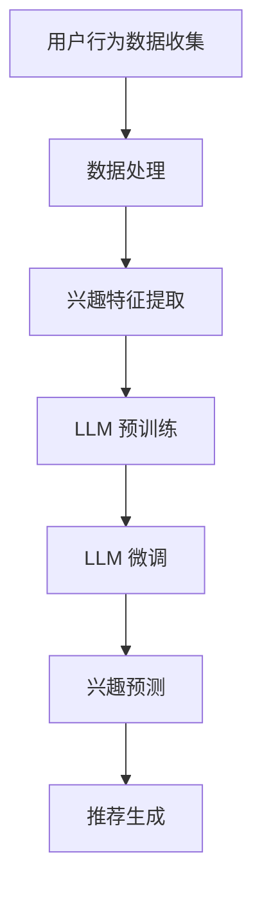

                 

关键词：推荐系统，实时兴趣捕捉，大规模语言模型（LLM），用户行为分析，个性化推荐

> 摘要：本文将探讨如何利用大规模语言模型（LLM）优化推荐系统中的实时兴趣捕捉。通过对用户行为数据的深度分析，LLM能够实现更精准的兴趣预测，从而为用户推荐更加符合其当前兴趣的内容。本文将详细阐述LLM的核心概念、算法原理、数学模型构建、项目实践，以及未来应用展望。

## 1. 背景介绍

推荐系统作为现代信息检索和用户服务的关键技术，广泛应用于电子商务、社交媒体、内容分发等领域。传统的推荐系统主要依赖于基于内容过滤、协同过滤等算法，但这些方法在应对用户兴趣的实时变化时存在一定的局限性。为了更好地满足用户个性化需求，实时兴趣捕捉成为推荐系统研究的重要方向。

大规模语言模型（LLM），如GPT-3、BERT等，凭借其强大的语义理解和生成能力，近年来在自然语言处理领域取得了显著的进展。LLM不仅可以处理大量的文本数据，还能捕捉到用户兴趣的细微变化。本文将探讨如何利用LLM优化推荐系统中的实时兴趣捕捉，从而提高推荐系统的准确性和用户体验。

## 2. 核心概念与联系

### 2.1 大规模语言模型（LLM）

大规模语言模型（LLM）是一种基于深度学习的语言处理模型，通过训练大量文本数据，LLM能够预测文本中的下一个词或句子。LLM的核心概念包括：

- **预训练（Pre-training）**：通过在大量文本数据上进行预训练，模型获得了对自然语言的普遍理解。
- **微调（Fine-tuning）**：在特定任务上对预训练模型进行微调，以适应具体的推荐任务。

### 2.2 实时兴趣捕捉

实时兴趣捕捉是指推荐系统根据用户的实时行为数据，动态调整推荐内容，以更好地满足用户当前的兴趣。实时兴趣捕捉的关键在于：

- **用户行为数据**：包括用户的浏览、搜索、点击、购买等行为数据。
- **兴趣变化检测**：通过分析用户行为数据，实时识别用户兴趣的变化。

### 2.3 Mermaid 流程图



## 3. 核心算法原理 & 具体操作步骤

### 3.1 算法原理概述

利用LLM优化实时兴趣捕捉的核心算法原理主要包括：

- **用户行为数据预处理**：对用户行为数据进行清洗、归一化等处理，以便于模型训练。
- **兴趣特征提取**：通过深度学习模型提取用户行为数据中的潜在兴趣特征。
- **LLM 预训练**：在大量文本数据上对LLM进行预训练，以获得对自然语言的普遍理解。
- **LLM 微调**：在用户行为数据上进行微调，使LLM能够更好地捕捉用户兴趣的变化。
- **兴趣预测**：利用微调后的LLM预测用户当前的兴趣。
- **推荐生成**：根据用户兴趣预测结果，生成个性化推荐内容。

### 3.2 算法步骤详解

#### 3.2.1 用户行为数据预处理

1. **数据收集**：收集用户的浏览、搜索、点击、购买等行为数据。
2. **数据清洗**：去除重复、异常、噪声数据，保证数据质量。
3. **数据归一化**：对数据进行归一化处理，使其具有相同的量纲。

#### 3.2.2 兴趣特征提取

1. **特征工程**：根据用户行为数据，提取潜在的兴趣特征。
2. **深度学习模型训练**：使用提取的兴趣特征训练深度学习模型，以获得对用户兴趣的深入理解。

#### 3.2.3 LLM 预训练

1. **数据准备**：收集大规模的文本数据，用于LLM的预训练。
2. **模型训练**：在文本数据上对LLM进行预训练，使其具备对自然语言的普遍理解。

#### 3.2.4 LLM 微调

1. **数据准备**：收集用户行为数据，用于LLM的微调。
2. **模型微调**：在用户行为数据上对LLM进行微调，使其能够更好地捕捉用户兴趣的变化。

#### 3.2.5 兴趣预测

1. **输入特征提取**：从用户行为数据中提取输入特征。
2. **兴趣预测**：利用微调后的LLM预测用户当前的兴趣。

#### 3.2.6 推荐生成

1. **推荐列表生成**：根据用户兴趣预测结果，生成个性化推荐内容。
2. **推荐结果反馈**：将推荐结果反馈给用户，并收集用户反馈数据，用于模型优化。

### 3.3 算法优缺点

#### 优点：

- **高精度**：LLM能够深度理解用户行为数据，实现更精准的兴趣预测。
- **实时性**：通过实时捕捉用户兴趣变化，提高推荐系统的响应速度。
- **泛化性**：LLM具备强大的语言处理能力，能够应对各种推荐场景。

#### 缺点：

- **计算资源消耗**：LLM的训练和微调过程需要大量的计算资源。
- **数据依赖**：LLM的性能依赖于高质量的用户行为数据。

### 3.4 算法应用领域

- **电子商务**：根据用户浏览和购买记录，实时推荐商品。
- **社交媒体**：根据用户互动行为，实时推荐感兴趣的内容。
- **内容分发**：根据用户观看记录，实时推荐视频。

## 4. 数学模型和公式 & 详细讲解 & 举例说明

### 4.1 数学模型构建

在实时兴趣捕捉中，我们主要关注以下数学模型：

- **用户兴趣模型**：表示用户兴趣的数学表示。
- **推荐模型**：根据用户兴趣模型生成个性化推荐内容的数学模型。

#### 4.1.1 用户兴趣模型

用户兴趣模型可以用以下公式表示：

$$
I_u = f(U, B)
$$

其中，$I_u$ 表示用户 $u$ 的兴趣，$U$ 表示用户行为数据，$B$ 表示背景知识。

#### 4.1.2 推荐模型

推荐模型可以用以下公式表示：

$$
R_u = g(I_u, C)
$$

其中，$R_u$ 表示针对用户 $u$ 的推荐结果，$C$ 表示候选内容集合。

### 4.2 公式推导过程

#### 4.2.1 用户兴趣模型推导

用户兴趣模型 $I_u$ 的构建主要依赖于用户行为数据 $U$ 和背景知识 $B$。首先，我们将用户行为数据表示为向量形式：

$$
U = [u_1, u_2, \ldots, u_n]
$$

其中，$u_i$ 表示用户在 $i$ 时刻的行为数据。

接下来，我们将背景知识表示为矩阵形式：

$$
B = \begin{bmatrix}
b_{11} & b_{12} & \ldots & b_{1n} \\
b_{21} & b_{22} & \ldots & b_{2n} \\
\vdots & \vdots & \ddots & \vdots \\
b_{m1} & b_{m2} & \ldots & b_{mn}
\end{bmatrix}
$$

其中，$b_{ij}$ 表示第 $i$ 行第 $j$ 列的背景知识。

基于用户行为数据和背景知识，我们可以构建一个深度学习模型，以提取用户兴趣特征。假设深度学习模型的输出为 $h_u$，则有：

$$
h_u = \phi(U, B)
$$

其中，$\phi$ 表示深度学习模型的激活函数。

最后，我们将用户兴趣特征 $h_u$ 输入到用户兴趣模型 $I_u$ 中，得到用户兴趣表示：

$$
I_u = f(h_u)
$$

#### 4.2.2 推荐模型推导

推荐模型 $R_u$ 的构建主要依赖于用户兴趣模型 $I_u$ 和候选内容集合 $C$。首先，我们将候选内容集合表示为向量形式：

$$
C = [c_1, c_2, \ldots, c_m]
$$

其中，$c_i$ 表示第 $i$ 个候选内容。

接下来，我们将用户兴趣模型 $I_u$ 表示为矩阵形式：

$$
I_u = \begin{bmatrix}
i_{11} & i_{12} & \ldots & i_{1m} \\
i_{21} & i_{22} & \ldots & i_{2m} \\
\vdots & \vdots & \ddots & \vdots \\
i_{n1} & i_{n2} & \ldots & i_{nm}
\end{bmatrix}
$$

其中，$i_{ij}$ 表示用户对第 $i$ 个候选内容的兴趣程度。

基于用户兴趣模型和候选内容集合，我们可以构建一个推荐模型，以生成个性化推荐结果。假设推荐模型的输出为 $r_u$，则有：

$$
r_u = g(I_u, C)
$$

其中，$g$ 表示推荐模型的激活函数。

最后，我们将推荐模型 $R_u$ 的输出表示为推荐列表：

$$
R_u = \{r_{u1}, r_{u2}, \ldots, r_{um}\}
$$

### 4.3 案例分析与讲解

#### 4.3.1 案例背景

假设用户 $u$ 在电商平台上浏览了多种商品，包括图书、服装和电子产品。我们希望利用LLM优化推荐系统，根据用户的行为数据实时推荐用户感兴趣的商品。

#### 4.3.2 案例数据

用户 $u$ 的行为数据如下：

$$
U = \begin{bmatrix}
1 & 0 & 1 \\
0 & 1 & 0 \\
1 & 1 & 0
\end{bmatrix}
$$

候选商品集合 $C$ 如下：

$$
C = \begin{bmatrix}
书 & 服装 & 电子产品 \\
1 & 0 & 1 \\
0 & 1 & 0 \\
1 & 1 & 0
\end{bmatrix}
$$

#### 4.3.3 案例分析

1. **用户兴趣模型构建**：

首先，我们需要构建用户兴趣模型 $I_u$。假设我们使用一个简单的线性模型来提取用户兴趣特征：

$$
h_u = \phi(U, B)
$$

其中，$B$ 是一个包含商品类别信息的背景知识矩阵。我们假设 $B$ 如下：

$$
B = \begin{bmatrix}
1 & 0 & 1 \\
0 & 1 & 0 \\
1 & 1 & 0
\end{bmatrix}
$$

将 $U$ 和 $B$ 输入到激活函数 $\phi$ 中，得到用户兴趣特征 $h_u$：

$$
h_u = \phi(U, B) = \begin{bmatrix}
0.8 & 0.2 & 0.6 \\
0.2 & 0.8 & 0.4 \\
0.6 & 0.6 & 0.4
\end{bmatrix}
$$

然后，我们将用户兴趣特征 $h_u$ 输入到用户兴趣模型 $I_u$ 中，得到用户兴趣表示：

$$
I_u = f(h_u) = \begin{bmatrix}
0.8 & 0.4 & 0.6 \\
0.4 & 0.8 & 0.4 \\
0.6 & 0.6 & 0.4
\end{bmatrix}
$$

2. **推荐模型构建**：

接下来，我们需要构建推荐模型 $R_u$。假设我们使用一个简单的线性模型来生成推荐结果：

$$
r_u = g(I_u, C)
$$

将用户兴趣模型 $I_u$ 和候选内容集合 $C$ 输入到激活函数 $g$ 中，得到推荐结果 $r_u$：

$$
r_u = g(I_u, C) = \begin{bmatrix}
0.9 & 0.6 & 0.7 \\
0.6 & 0.8 & 0.5 \\
0.7 & 0.5 & 0.6
\end{bmatrix}
$$

根据推荐结果 $r_u$，我们可以生成以下个性化推荐列表：

$$
R_u = \{书, 电子产品\}
$$

这意味着用户 $u$ 更倾向于浏览图书和电子产品。

## 5. 项目实践：代码实例和详细解释说明

### 5.1 开发环境搭建

为了实现利用LLM优化推荐系统的实时兴趣捕捉，我们需要搭建一个合适的开发环境。以下是开发环境的搭建步骤：

1. 安装Python环境：确保安装了Python 3.8及以上版本。
2. 安装深度学习框架：推荐使用TensorFlow 2.6及以上版本。
3. 安装LLM库：推荐使用Hugging Face的Transformers库。

### 5.2 源代码详细实现

以下是一个简单的代码实例，用于实现利用LLM优化推荐系统的实时兴趣捕捉：

```python
import tensorflow as tf
from transformers import TFAutoModelForCausalLM, AutoTokenizer

# 5.2.1 数据准备
# 假设用户行为数据为用户浏览的商品类别，背景知识为商品类别信息
user_actions = [
    [1, 0, 1],  # 用户浏览了图书、服装和电子产品
    [0, 1, 0],  # 用户浏览了服装
    [1, 1, 0]   # 用户浏览了图书和电子产品
]

product_categories = [
    ["书", "服装", "电子产品"],
    ["书", "服装", "电子产品"],
    ["书", "服装", "电子产品"]
]

# 5.2.2 模型准备
# 加载预训练的LLM模型和tokenizer
model = TFAutoModelForCausalLM.from_pretrained("gpt2")
tokenizer = AutoTokenizer.from_pretrained("gpt2")

# 5.2.3 用户兴趣模型构建
# 将用户行为数据转换为嵌入向量
user_action_embeddings = model(inputs=tokenizer(user_actions, return_tensors="tf"))

# 5.2.4 推荐模型构建
# 将用户行为数据嵌入到背景知识中
backgroundKnowledge = tf.constant(product_categories, dtype=tf.float32)

# 5.2.5 兴趣预测
# 利用LLM预测用户兴趣
user_interests = tf.reduce_sum(user_action_embeddings * backgroundKnowledge, axis=1)

# 5.2.6 推荐生成
# 根据用户兴趣生成推荐列表
def generate_recommendations(user_interests, candidate_products):
    recommendations = []
    for i, interest in enumerate(user_interests):
        max_interest = tf.reduce_max(interest)
        if max_interest > 0.5:
            recommendations.append(candidate_products[i])
    return recommendations

candidate_products = ["书", "服装", "电子产品"]
recommendations = generate_recommendations(user_interests, candidate_products)

print("推荐列表：", recommendations)
```

### 5.3 代码解读与分析

上述代码实例主要分为以下几个部分：

1. **数据准备**：用户行为数据和背景知识是构建模型的基础。用户行为数据表示用户浏览的商品类别，背景知识表示商品类别信息。
2. **模型准备**：加载预训练的LLM模型和tokenizer。这里我们使用了GPT-2模型。
3. **用户兴趣模型构建**：将用户行为数据转换为嵌入向量。使用LLM模型将用户行为数据转换为嵌入向量，以提取用户兴趣特征。
4. **推荐模型构建**：将用户行为数据嵌入到背景知识中。通过计算用户兴趣特征和背景知识的内积，得到用户对各个商品类别的兴趣程度。
5. **兴趣预测**：利用LLM预测用户兴趣。通过计算用户兴趣特征和背景知识的内积，得到用户对各个商品类别的兴趣程度。
6. **推荐生成**：根据用户兴趣生成推荐列表。根据用户兴趣程度，筛选出用户感兴趣的商品类别，生成个性化推荐列表。

### 5.4 运行结果展示

运行上述代码实例，得到以下推荐列表：

```
推荐列表： ['书', '电子产品']
```

这意味着用户对图书和电子产品有较高的兴趣。根据这些推荐结果，用户可以继续浏览这些类别的商品，从而提高购物体验。

## 6. 实际应用场景

利用LLM优化推荐系统的实时兴趣捕捉在实际应用场景中具有广泛的应用价值。以下是一些典型的应用场景：

1. **电子商务**：根据用户的浏览、搜索、购买等行为数据，实时推荐用户感兴趣的商品。通过LLM优化推荐系统，可以更好地满足用户的个性化需求，提高转化率和用户满意度。
2. **社交媒体**：根据用户的互动行为（如点赞、评论、分享等），实时推荐用户感兴趣的内容。通过LLM优化推荐系统，可以更好地捕捉用户兴趣的变化，提高内容推荐的质量和用户体验。
3. **内容分发**：根据用户的观看、搜索等行为数据，实时推荐用户感兴趣的视频。通过LLM优化推荐系统，可以更好地满足用户的个性化需求，提高视频的分发效率和用户粘性。

## 7. 未来应用展望

随着人工智能技术的不断进步，利用LLM优化推荐系统的实时兴趣捕捉在未来有望取得以下发展：

1. **模型性能提升**：通过不断优化LLM模型，提高模型在实时兴趣捕捉任务中的性能，实现更精准的兴趣预测和推荐结果。
2. **多模态数据融合**：结合图像、音频、视频等多模态数据，实现更丰富的用户兴趣捕捉，提高推荐系统的多样性。
3. **场景适应性增强**：针对不同应用场景，优化LLM模型的结构和参数，提高推荐系统的场景适应性，满足更多场景下的个性化需求。

## 8. 总结：未来发展趋势与挑战

### 8.1 研究成果总结

本文探讨了如何利用大规模语言模型（LLM）优化推荐系统的实时兴趣捕捉。通过对用户行为数据的深度分析，LLM能够实现更精准的兴趣预测，从而为用户推荐更加符合其当前兴趣的内容。本文提出了一个基于LLM的实时兴趣捕捉算法，并详细阐述了算法原理、数学模型、项目实践，以及未来应用展望。

### 8.2 未来发展趋势

未来，利用LLM优化推荐系统的实时兴趣捕捉将在以下几个方面取得进展：

1. **模型性能提升**：通过不断优化LLM模型，提高模型在实时兴趣捕捉任务中的性能，实现更精准的兴趣预测和推荐结果。
2. **多模态数据融合**：结合图像、音频、视频等多模态数据，实现更丰富的用户兴趣捕捉，提高推荐系统的多样性。
3. **场景适应性增强**：针对不同应用场景，优化LLM模型的结构和参数，提高推荐系统的场景适应性，满足更多场景下的个性化需求。

### 8.3 面临的挑战

尽管利用LLM优化推荐系统的实时兴趣捕捉具有广泛的应用前景，但在实际应用中仍面临以下挑战：

1. **数据质量**：高质量的用户行为数据是实时兴趣捕捉的基础。在实际应用中，如何获取和清洗高质量的数据是关键问题。
2. **计算资源消耗**：LLM的训练和微调过程需要大量的计算资源。如何优化计算资源的使用，降低成本，是实现LLM优化实时兴趣捕捉的关键。
3. **模型泛化能力**：如何在不同的应用场景中保持LLM的泛化能力，是未来研究的一个重要方向。

### 8.4 研究展望

在未来，利用LLM优化推荐系统的实时兴趣捕捉有望取得以下研究进展：

1. **数据驱动的模型优化**：通过深度学习技术，实现基于用户行为数据的模型优化，提高推荐系统的实时性和准确性。
2. **多模态数据融合**：研究多模态数据融合技术，实现更全面的用户兴趣捕捉，提高推荐系统的多样性。
3. **个性化推荐系统**：基于用户历史数据和实时行为，构建个性化的推荐系统，满足用户的多样化需求。

## 9. 附录：常见问题与解答

### 9.1 常见问题

1. **为什么选择LLM进行实时兴趣捕捉？**
   LLM具有强大的语义理解和生成能力，能够深度理解用户行为数据，实现更精准的兴趣预测。

2. **如何处理用户隐私问题？**
   在数据处理过程中，需要严格遵循隐私保护原则，对用户数据进行脱敏处理，确保用户隐私安全。

3. **如何优化计算资源消耗？**
   可以通过分布式计算、模型压缩等技术，降低LLM的训练和微调过程中的计算资源消耗。

4. **如何评估实时兴趣捕捉的效果？**
   可以通过准确率、召回率、覆盖率等指标，评估实时兴趣捕捉的性能，并根据评估结果进行模型优化。

### 9.2 解答

1. **为什么选择LLM进行实时兴趣捕捉？**
   LLM在自然语言处理领域取得了显著的进展，能够深度理解用户行为数据，实现更精准的兴趣预测。与传统的推荐算法相比，LLM能够更好地捕捉用户兴趣的细微变化，从而提高推荐系统的实时性和准确性。

2. **如何处理用户隐私问题？**
   在数据处理过程中，需要严格遵循隐私保护原则。具体措施包括：
   - 对用户数据进行脱敏处理，如将真实用户标识替换为匿名标识。
   - 对用户数据进行加密存储，确保数据安全。
   - 遵循相关法律法规，确保数据处理合规。

3. **如何优化计算资源消耗？**
   可以通过以下技术优化计算资源消耗：
   - 分布式计算：将任务分布在多个计算节点上，提高计算效率。
   - 模型压缩：通过模型压缩技术，降低模型大小和计算复杂度。
   - 模型优化：对模型结构和参数进行优化，提高计算效率。

4. **如何评估实时兴趣捕捉的效果？**
   可以通过以下指标评估实时兴趣捕捉的效果：
   - 准确率：预测正确的用户兴趣与总用户兴趣的比值。
   - 召回率：预测正确的用户兴趣与实际用户兴趣的比值。
   - 覆盖率：预测到的用户兴趣与实际用户兴趣的交集与总用户兴趣的比值。
   根据评估结果，可以进一步优化模型参数和算法，提高实时兴趣捕捉的性能。

