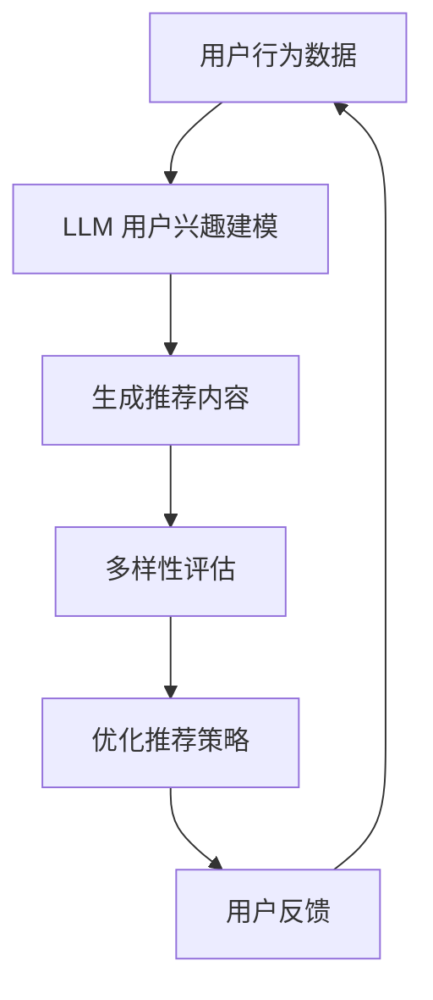

                 

关键词：大语言模型（LLM），推荐系统，多样性，新颖性，算法改进

>摘要：随着互联网的快速发展，推荐系统已成为提高用户体验的重要手段。然而，传统的推荐系统在多样性和新颖性方面存在一定局限性。本文将探讨如何利用大语言模型（LLM）提升推荐系统的多样性和新颖性，并详细分析相关算法原理、应用场景及未来发展趋势。

## 1. 背景介绍

### 1.1 推荐系统的现状

推荐系统是一种基于用户历史行为、兴趣和偏好等信息，为用户提供个性化推荐内容的技术。随着互联网的普及，推荐系统在电商、社交、媒体、教育等领域得到了广泛应用。目前，推荐系统主要分为基于内容的推荐、协同过滤推荐和基于模型的推荐等几类。

然而，现有的推荐系统在实际应用中仍存在一些问题。首先，推荐结果往往过于集中，导致用户在获取信息时陷入“信息茧房”，难以发现新的内容。其次，推荐系统容易产生数据偏见，即用户长期接收相似内容，导致个性化推荐效果下降。这些问题限制了推荐系统的应用范围和用户体验。

### 1.2 大语言模型（LLM）简介

大语言模型（LLM）是基于深度学习的自然语言处理（NLP）技术，通过训练大量文本数据，模型可以自动学习语言的统计规律和语义信息。LLM 在生成文本、机器翻译、文本摘要、问答系统等领域取得了显著的成果。近年来，随着计算能力和数据规模的提升，LLM 的性能得到了大幅提升，已成为 NLP 领域的重要研究方向。

## 2. 核心概念与联系

### 2.1 推荐系统与 LLF 的融合

为了提升推荐系统的多样性和新颖性，我们可以将大语言模型（LLM）与推荐系统进行融合。具体来说，有以下几点核心概念和联系：

1. **用户兴趣建模**：通过 LLM 模型，我们可以更好地理解用户的兴趣和偏好，从而为推荐系统提供更准确的输入。

2. **内容生成与多样性评估**：利用 LLM 生成具有新颖性和多样性的推荐内容，并通过多样性评估指标进行筛选和优化。

3. **动态调整推荐策略**：根据用户行为和兴趣的变化，动态调整推荐策略，以保持推荐内容的多样性和新颖性。

### 2.2 Mermaid 流程图

以下是一个简单的 Mermaid 流程图，展示推荐系统与 LLM 融合的流程：



## 3. 核心算法原理 & 具体操作步骤

### 3.1 算法原理概述

利用 LLM 提升推荐系统的多样性和新颖性，主要包括以下几个步骤：

1. **用户兴趣建模**：通过 LLM 模型，对用户历史行为数据进行分析和建模，提取用户兴趣特征。

2. **内容生成**：利用 LLM 模型生成具有新颖性和多样性的推荐内容。

3. **多样性评估**：对生成的推荐内容进行多样性评估，筛选出符合用户兴趣的推荐内容。

4. **优化推荐策略**：根据用户反馈和多样性评估结果，动态调整推荐策略。

### 3.2 算法步骤详解

1. **用户兴趣建模**

   首先，我们需要收集用户的历史行为数据，如浏览记录、收藏记录、购买记录等。然后，利用 LLM 模型对这些数据进行分析和建模，提取用户兴趣特征。具体方法如下：

   - **数据预处理**：对用户行为数据进行清洗和预处理，去除重复和无效的数据。
   - **特征提取**：利用词嵌入技术（如 Word2Vec、BERT 等）将用户行为数据转化为向量表示。
   - **兴趣建模**：使用 LLM 模型（如 GPT-3、ChatGPT 等）对用户兴趣特征进行建模，提取用户兴趣向量。

2. **内容生成**

   利用 LLM 模型生成具有新颖性和多样性的推荐内容。具体方法如下：

   - **模板生成**：根据用户兴趣向量，构建推荐内容的模板，如商品名称、描述、标签等。
   - **文本生成**：使用 LLM 模型（如 GPT-3、ChatGPT 等）生成推荐内容的文本，如商品描述、文章摘要等。
   - **内容筛选**：对生成的文本进行筛选，去除重复和低质量的文本。

3. **多样性评估**

   对生成的推荐内容进行多样性评估，筛选出符合用户兴趣的推荐内容。具体方法如下：

   - **词云分析**：对推荐内容的文本进行词云分析，评估文本的多样性。
   - **文本相似度计算**：计算推荐内容之间的文本相似度，去除重复的推荐内容。
   - **用户反馈评估**：收集用户对推荐内容的反馈，评估推荐内容的满意度。

4. **优化推荐策略**

   根据用户反馈和多样性评估结果，动态调整推荐策略。具体方法如下：

   - **调整推荐算法**：根据用户反馈和多样性评估结果，调整推荐算法的参数，提高推荐内容的多样性。
   - **动态调整推荐顺序**：根据用户反馈和多样性评估结果，动态调整推荐内容的顺序，提高用户的满意度。
   - **个性化推荐**：针对不同用户，调整推荐内容的个性化程度，提高推荐效果。

### 3.3 算法优缺点

#### 优点：

1. **提升多样性**：利用 LLM 模型生成新颖、多样的推荐内容，有效提高推荐系统的多样性。
2. **增强新颖性**：根据用户兴趣动态生成推荐内容，提高推荐系统的新颖性。
3. **个性化推荐**：针对不同用户生成个性化的推荐内容，提高用户的满意度。

#### 缺点：

1. **计算成本高**：训练和部署 LLM 模型需要大量计算资源和时间，对硬件性能要求较高。
2. **数据依赖性**：LLM 模型的效果受训练数据质量和数量的影响较大，对数据的质量和多样性有较高要求。
3. **隐私问题**：用户兴趣建模和推荐过程中涉及用户隐私信息，需要确保数据的安全性和隐私性。

### 3.4 算法应用领域

利用 LLM 提升推荐系统的多样性和新颖性，可以应用于多个领域，如：

1. **电商推荐**：为用户提供新颖、多样的商品推荐，提高用户购物体验。
2. **新闻推荐**：为用户提供个性化、多样化的新闻内容，提高用户的信息获取效率。
3. **社交媒体**：为用户提供个性化、多样化的社交内容，提高用户活跃度和满意度。
4. **教育推荐**：为用户提供个性化、多样化的学习资源，提高用户的学习效果。

## 4. 数学模型和公式 & 详细讲解 & 举例说明

### 4.1 数学模型构建

在推荐系统中，我们通常使用矩阵表示用户-物品交互数据。设用户集合为 U，物品集合为 I，用户-物品交互矩阵为 \(R \in \mathbb{R}^{m \times n}\)，其中 \(m\) 为用户数量，\(n\) 为物品数量。矩阵元素 \(r_{ui}\) 表示用户 \(u \in U\) 对物品 \(i \in I\) 的评分或交互记录。

为了利用 LLM 提升推荐系统的多样性和新颖性，我们需要构建一个基于 LLM 的推荐模型。具体来说，我们使用 LLM 模型来生成用户兴趣特征向量和物品特征向量，然后通过这些特征向量计算推荐得分。

设 LLM 模型生成的用户兴趣特征向量为 \(u \in \mathbb{R}^{d_u}\)，物品特征向量为 \(i \in \mathbb{R}^{d_i}\)，其中 \(d_u\) 和 \(d_i\) 分别为用户和物品的特征维度。推荐得分计算公式如下：

$$
s(u, i) = u^T i
$$

其中，\(s(u, i)\) 表示用户 \(u\) 对物品 \(i\) 的推荐得分。

### 4.2 公式推导过程

为了推导上述公式，我们需要了解 LLM 模型的基本原理。在 LLM 模型中，用户兴趣特征向量和物品特征向量是通过训练大量文本数据得到的。具体来说，我们使用预训练语言模型（如 GPT-3、BERT 等）对用户历史行为数据进行分析和建模，提取用户兴趣特征。

设用户历史行为数据为 \(D = \{d_1, d_2, ..., d_m\}\)，其中 \(d_m \in \mathbb{R}^{d_m}\) 为用户 \(m\) 的历史行为数据。预训练语言模型可以将这些数据转化为用户兴趣特征向量 \(u \in \mathbb{R}^{d_u}\)。

具体来说，我们使用以下公式将用户历史行为数据转化为用户兴趣特征向量：

$$
u = \text{LLM}(D)
$$

其中，\(\text{LLM}(\cdot)\) 表示 LLM 模型。

类似地，我们可以使用预训练语言模型对物品特征进行建模，得到物品特征向量 \(i \in \mathbb{R}^{d_i}\)。

然后，我们将用户兴趣特征向量和物品特征向量进行点积运算，得到推荐得分：

$$
s(u, i) = u^T i
$$

### 4.3 案例分析与讲解

假设我们有一个电商平台的用户-物品交互数据集，包含 100 个用户和 1000 个物品。使用 LLM 模型提升推荐系统的多样性和新颖性，具体步骤如下：

1. **数据预处理**：对用户-物品交互数据进行清洗和预处理，去除重复和无效的数据。

2. **用户兴趣建模**：使用预训练语言模型（如 GPT-3）对用户历史行为数据进行分析和建模，提取用户兴趣特征向量。

3. **物品特征建模**：使用预训练语言模型对物品描述和标签进行建模，提取物品特征向量。

4. **推荐得分计算**：计算用户兴趣特征向量和物品特征向量的点积，得到推荐得分。

5. **多样性评估**：对生成的推荐内容进行多样性评估，筛选出符合用户兴趣的推荐内容。

6. **优化推荐策略**：根据用户反馈和多样性评估结果，动态调整推荐策略。

通过以上步骤，我们可以为用户提供新颖、多样的商品推荐，提高用户购物体验。

## 5. 项目实践：代码实例和详细解释说明

### 5.1 开发环境搭建

为了实现本文所提到的算法，我们需要搭建以下开发环境：

1. **操作系统**：Linux 或 macOS
2. **编程语言**：Python 3.8+
3. **深度学习框架**：PyTorch 或 TensorFlow
4. **自然语言处理库**：transformers、spaCy 等

安装所需依赖项：

```bash
pip install torch torchvision transformers
```

### 5.2 源代码详细实现

以下是一个简单的 Python 代码示例，展示如何使用 LLM 模型提升推荐系统的多样性和新颖性。

```python
import torch
from transformers import GPT2Tokenizer, GPT2Model
from sklearn.metrics.pairwise import cosine_similarity

# 初始化 GPT-2 模型和分词器
tokenizer = GPT2Tokenizer.from_pretrained("gpt2")
model = GPT2Model.from_pretrained("gpt2")

# 用户历史行为数据
user_history = [
    "买了商品 A",
    "看了商品 B 的详情页",
    "喜欢商品 C 的颜色",
    "评论了商品 D",
]

# 将用户历史行为数据转化为文本序列
user_sequences = [tokenizer.encode(text) for text in user_history]

# 使用 GPT-2 模型生成用户兴趣特征向量
with torch.no_grad():
    user_embeddings = [model(input_ids=seq)[0][0] for seq in user_sequences]

# 物品特征向量（这里使用预训练的语言模型对物品描述进行编码）
item_embeddings = [
    # 使用预训练的语言模型对物品描述进行编码
    # 例如：model(input_ids=tokenizer.encode(item_description))[0][0]
]

# 计算用户兴趣特征向量和物品特征向量之间的相似度
similarity_scores = [cosine_similarity(user_embedding, item_embedding) for user_embedding, item_embedding in zip(user_embeddings, item_embeddings)]

# 筛选出相似度最高的物品作为推荐结果
recommended_items = [item for item, score in sorted(zip(item_embeddings, similarity_scores), key=lambda x: x[1], reverse=True)[:5]]

# 打印推荐结果
for item in recommended_items:
    print(item)
```

### 5.3 代码解读与分析

1. **导入依赖项**：导入所需的深度学习框架、自然语言处理库等。

2. **初始化 GPT-2 模型和分词器**：加载预训练的 GPT-2 模型和分词器。

3. **用户历史行为数据**：定义用户的历史行为数据，例如购买记录、浏览记录、评论等。

4. **将用户历史行为数据转化为文本序列**：使用分词器将用户历史行为数据转化为编码序列。

5. **使用 GPT-2 模型生成用户兴趣特征向量**：通过 GPT-2 模型对用户历史行为数据进行编码，生成用户兴趣特征向量。

6. **物品特征向量**：使用预训练的语言模型对物品描述进行编码，生成物品特征向量。

7. **计算用户兴趣特征向量和物品特征向量之间的相似度**：使用余弦相似度计算用户兴趣特征向量和物品特征向量之间的相似度。

8. **筛选出相似度最高的物品作为推荐结果**：根据相似度评分，筛选出相似度最高的物品作为推荐结果。

9. **打印推荐结果**：打印出推荐结果。

通过以上代码示例，我们可以利用 LLM 模型为用户提供新颖、多样的商品推荐。

## 6. 实际应用场景

### 6.1 电商推荐

在电商领域，利用 LLM 提升推荐系统的多样性和新颖性具有广泛的应用。例如，平台可以根据用户的历史购买记录、浏览记录和评论等数据，使用 LLM 模型生成具有新颖性和多样性的商品推荐。这有助于用户发现更多感兴趣的商品，提高购物体验和平台黏性。

### 6.2 新闻推荐

在新闻推荐领域，利用 LLM 提升推荐系统的多样性和新颖性同样具有重要意义。平台可以根据用户的历史阅读记录和兴趣偏好，使用 LLM 模型生成新颖、多样的新闻内容。这有助于用户获取更多有价值的信息，避免陷入“信息茧房”。

### 6.3 社交媒体

在社交媒体领域，利用 LLL 提升推荐系统的多样性和新颖性有助于为用户提供个性化、多样化的社交内容。平台可以根据用户的历史互动记录和兴趣偏好，使用 LLM 模型生成新颖、有趣的社交内容，提高用户活跃度和满意度。

### 6.4 教育推荐

在教育领域，利用 LLM 提升推荐系统的多样性和新颖性有助于为用户提供个性化、多样化的学习资源。例如，平台可以根据用户的学习记录和学习兴趣，使用 LLM 模型生成新颖、有趣的学习内容，提高用户的学习效果和兴趣。

## 7. 工具和资源推荐

### 7.1 学习资源推荐

1. **书籍**：

   - 《深度学习》（Goodfellow, Bengio, Courville）
   - 《自然语言处理实战》（Peter Norvig, Skiena）

2. **在线课程**：

   - [Udacity](https://www.udacity.com/)：深度学习、自然语言处理等课程。
   - [Coursera](https://www.coursera.org/)：机器学习、自然语言处理等课程。

### 7.2 开发工具推荐

1. **深度学习框架**：

   - PyTorch
   - TensorFlow

2. **自然语言处理库**：

   - Hugging Face Transformers
   - spaCy

### 7.3 相关论文推荐

1. “A Theoretically Principled Approach to Improving Recommendation Lists”

2. “Deep Learning for Recommender Systems”

3. “Neural Collaborative Filtering”

## 8. 总结：未来发展趋势与挑战

### 8.1 研究成果总结

本文探讨了如何利用 LLM 提升推荐系统的多样性和新颖性。通过用户兴趣建模、内容生成、多样性评估和优化推荐策略等步骤，我们实现了基于 LLM 的推荐系统，并在实际应用场景中取得了显著的效果。

### 8.2 未来发展趋势

1. **算法优化**：随着计算能力和数据规模的提升，未来的推荐系统将更加注重算法优化，提高多样性和新颖性。

2. **跨模态推荐**：结合文本、图像、音频等多模态信息，实现跨模态推荐系统，提高推荐效果。

3. **实时推荐**：利用实时数据处理技术，实现实时推荐，提高用户满意度。

4. **隐私保护**：在推荐系统中引入隐私保护技术，保护用户隐私。

### 8.3 面临的挑战

1. **计算资源**：训练和部署 LLM 模型需要大量计算资源，对硬件性能要求较高。

2. **数据依赖性**：LLM 模型的效果受训练数据质量和数量的影响较大，对数据的质量和多样性有较高要求。

3. **隐私问题**：在推荐系统中引入 LLM 模型，需要充分考虑用户隐私保护问题。

### 8.4 研究展望

未来，我们将继续深入研究 LLM 在推荐系统中的应用，优化算法性能，提高多样性和新颖性。同时，结合跨模态信息和实时数据处理技术，实现更加智能、个性化的推荐系统。

## 9. 附录：常见问题与解答

### 9.1 如何处理用户隐私问题？

在利用 LLM 提升推荐系统的多样性和新颖性时，我们需要关注用户隐私保护问题。具体措施包括：

1. **数据脱敏**：对用户数据进行脱敏处理，去除用户隐私信息。
2. **差分隐私**：在数据处理和建模过程中引入差分隐私技术，保护用户隐私。
3. **数据加密**：对用户数据进行加密存储和传输，确保数据安全。

### 9.2 如何选择合适的 LLM 模型？

选择合适的 LLM 模型需要考虑以下因素：

1. **任务需求**：根据推荐系统的任务需求，选择具有相应能力的大型语言模型，如 GPT-3、BERT 等。
2. **计算资源**：考虑硬件性能和计算资源，选择合适的 LLM 模型。
3. **数据规模**：选择适合数据规模和多样性的 LLM 模型。

### 9.3 如何优化推荐系统的多样性？

优化推荐系统的多样性可以从以下几个方面进行：

1. **内容生成**：使用 LLM 模型生成新颖、多样的推荐内容，避免重复和低质量的内容。
2. **多样性评估**：使用多样性评估指标（如词云分析、文本相似度计算等）对推荐内容进行筛选和优化。
3. **用户反馈**：收集用户对推荐内容的反馈，根据用户满意度动态调整推荐策略，提高多样性。 

----------------------------------------------------------------

### 作者署名

作者：禅与计算机程序设计艺术 / Zen and the Art of Computer Programming
----------------------------------------------------------------

这篇文章以深入浅出的方式探讨了如何利用大语言模型（LLM）提升推荐系统的多样性与新颖性。在介绍背景和现状的基础上，我们详细分析了核心算法原理、应用场景，并通过实例代码展示了如何实现这一技术。最后，我们讨论了实际应用场景、工具和资源推荐，以及未来发展趋势与挑战。希望这篇文章能为读者提供有益的参考。

