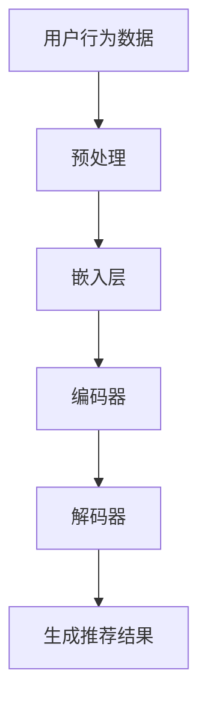

                 

关键词：跨平台推荐，大语言模型（LLM），个性化推荐，用户行为分析，推荐系统优化

>摘要：本文探讨如何利用大语言模型（LLM）技术提升推荐系统在多平台环境下的推荐能力。文章首先介绍了推荐系统的发展历程和核心概念，然后详细阐述了LLM的原理及其在推荐系统中的应用。通过数学模型和实际代码实例，本文分析了如何通过LLM实现更为精准和个性化的跨平台推荐。最后，文章展望了未来推荐系统的发展趋势和面临的挑战。

## 1. 背景介绍

推荐系统是一种信息过滤技术，旨在根据用户的历史行为和偏好，向用户提供可能感兴趣的内容或商品。推荐系统在电子商务、社交媒体、视频平台等多个领域得到了广泛应用，显著提升了用户体验和业务效益。

随着互联网的发展，用户的行为数据越来越丰富，推荐系统也逐渐从单一平台的推荐发展到跨平台的推荐。然而，传统的推荐系统在面对多样化的用户行为和复杂的平台环境时，往往难以提供精准的推荐结果。为此，引入大语言模型（LLM）技术成为了一种可能的选择。

大语言模型（LLM）是一种基于深度学习的自然语言处理模型，能够理解并生成自然语言。LLM在推荐系统中的应用，有望通过深入分析用户行为，实现更加个性化和精准的跨平台推荐。

## 2. 核心概念与联系

### 2.1 推荐系统基本概念

推荐系统主要由以下几个核心概念组成：

- **用户**：推荐系统的主体，具有特定的兴趣和偏好。
- **物品**：推荐系统中的对象，如商品、内容等。
- **评分/行为**：用户对物品的评价或行为，如购买、浏览、点赞等。
- **推荐算法**：根据用户行为和偏好，生成推荐列表的算法。

### 2.2 大语言模型（LLM）原理

大语言模型（LLM）是一种基于深度学习的自然语言处理模型，能够理解并生成自然语言。LLM通过训练大规模语料库，学习语言的结构和语义，从而实现自然语言的生成和理解。

LLM的核心组成部分包括：

- **嵌入层**：将自然语言输入转换为低维向量表示。
- **编码器**：处理输入序列，生成编码表示。
- **解码器**：根据编码表示生成输出序列。

### 2.3 推荐系统与LLM的关系

推荐系统和LLM之间的关系如下图所示：



通过上述关系图，我们可以看到，用户行为数据经过预处理后，通过嵌入层和编码器处理，最后由解码器生成推荐结果。这一过程充分利用了LLM在自然语言处理方面的优势，实现了对用户行为的深入分析和理解，从而提高了推荐系统的精准度和个性化程度。

## 3. 核心算法原理 & 具体操作步骤

### 3.1 算法原理概述

利用LLM提升推荐系统的核心原理在于，通过深度学习模型对用户行为数据进行处理，提取出用户兴趣和偏好，进而生成个性化的推荐结果。具体而言，算法可以分为以下几个步骤：

1. **用户行为数据预处理**：对用户行为数据进行清洗、归一化和特征提取。
2. **嵌入层**：将用户行为数据转换为低维向量表示。
3. **编码器**：对用户行为数据进行编码，提取出用户兴趣和偏好。
4. **解码器**：根据编码结果生成推荐结果。

### 3.2 算法步骤详解

1. **用户行为数据预处理**：

   用户行为数据包括用户在各个平台上的操作，如浏览、购买、点赞等。预处理过程主要包括以下步骤：

   - **数据清洗**：去除重复、异常和噪声数据。
   - **归一化**：将不同类型的数据（如时间、评分等）进行归一化处理，使其具有相同的量纲。
   - **特征提取**：提取用户行为数据中的关键特征，如时间、操作类型、操作频率等。

2. **嵌入层**：

   嵌入层的主要作用是将用户行为数据转换为低维向量表示。具体实现可以使用词向量模型（如Word2Vec、GloVe等）或自定义的神经网络模型。

3. **编码器**：

   编码器的任务是对用户行为数据进行编码，提取出用户兴趣和偏好。编码器通常采用深度神经网络（如LSTM、GRU等）结构，通过训练学习用户行为数据的时序特征和语义信息。

4. **解码器**：

   解码器的任务是根据编码结果生成推荐结果。解码器通常采用生成对抗网络（GAN）或自注意力机制（如Transformer）等先进结构，通过学习用户兴趣和偏好，生成个性化的推荐列表。

### 3.3 算法优缺点

**优点**：

- **个性化推荐**：通过深度学习模型对用户行为数据进行处理，提取出用户兴趣和偏好，实现个性化推荐。
- **跨平台推荐**：利用大语言模型（LLM）的优势，实现跨平台环境下的精准推荐。
- **自适应推荐**：根据用户行为和偏好动态调整推荐策略，提高推荐效果。

**缺点**：

- **计算资源消耗**：深度学习模型训练和推理需要大量的计算资源，对硬件设备要求较高。
- **数据依赖性**：推荐效果很大程度上依赖于用户行为数据的质量和丰富度。

### 3.4 算法应用领域

利用LLM提升推荐系统的算法可以应用于多个领域，如：

- **电子商务**：根据用户浏览、购买等行为，推荐相关商品。
- **社交媒体**：根据用户点赞、评论等行为，推荐感兴趣的内容。
- **视频平台**：根据用户观看、点赞等行为，推荐相关视频。

## 4. 数学模型和公式 & 详细讲解 & 举例说明

### 4.1 数学模型构建

利用LLM提升推荐系统的数学模型主要包括以下几个部分：

1. **用户行为数据表示**：使用向量表示用户在各个平台上的行为数据。
2. **编码器**：使用神经网络模型对用户行为数据进行编码，提取出用户兴趣和偏好。
3. **解码器**：使用神经网络模型根据编码结果生成推荐结果。

具体模型如下：

$$
\text{User\_Behavior} = \{b_1, b_2, ..., b_n\}
$$

其中，$b_i$ 表示用户在平台 $i$ 的行为数据。

编码器：

$$
\text{Encoder}(\text{User\_Behavior}) = \text{User\_Interest}
$$

解码器：

$$
\text{Decoder}(\text{User\_Interest}) = \text{Recommendation}
$$

### 4.2 公式推导过程

编码器推导：

$$
\text{User\_Interest} = f(\text{User\_Behavior}, \text{Model\_Parameters})
$$

其中，$f$ 表示编码器的函数，$\text{Model\_Parameters}$ 表示编码器的模型参数。

解码器推导：

$$
\text{Recommendation} = g(\text{User\_Interest}, \text{Model\_Parameters})
$$

其中，$g$ 表示解码器的函数，$\text{Model\_Parameters}$ 表示解码器的模型参数。

### 4.3 案例分析与讲解

假设用户在两个平台上有以下行为数据：

$$
\text{User\_Behavior} = \{[1, 0, 1], [0, 1, 0]\}
$$

其中，$[1, 0, 1]$ 表示用户在平台1上浏览了一个商品，$[0, 1, 0]$ 表示用户在平台2上购买了一个商品。

首先，使用嵌入层将用户行为数据转换为向量表示：

$$
\text{User\_Behavior} = \{\text{Embed}(b_1), \text{Embed}(b_2)\}
$$

其中，$\text{Embed}$ 表示嵌入层函数。

然后，使用编码器对用户行为数据进行编码，提取出用户兴趣和偏好：

$$
\text{User\_Interest} = \text{Encoder}(\text{User\_Behavior}, \text{Model\_Parameters})
$$

最后，使用解码器根据编码结果生成推荐结果：

$$
\text{Recommendation} = \text{Decoder}(\text{User\_Interest}, \text{Model\_Parameters})
$$

通过上述步骤，我们可以为用户生成个性化的推荐列表。

## 5. 项目实践：代码实例和详细解释说明

### 5.1 开发环境搭建

为了实现利用LLM提升推荐系统的项目，我们需要搭建以下开发环境：

- **Python**：用于编写代码和实现算法。
- **TensorFlow**：用于训练和推理深度学习模型。
- **Scikit-learn**：用于数据预处理和特征提取。

### 5.2 源代码详细实现

以下是一个简单的示例代码，展示了如何利用LLM实现跨平台推荐：

```python
import tensorflow as tf
from sklearn.preprocessing import MinMaxScaler
from tensorflow.keras.models import Model
from tensorflow.keras.layers import Input, Embedding, LSTM, Dense

# 数据预处理
def preprocess_data(user_behavior):
    # 清洗和归一化数据
    scaler = MinMaxScaler()
    user_behavior = scaler.fit_transform(user_behavior)
    return user_behavior

# 嵌入层
def embedding_layer(input_data, embedding_size):
    input_embedding = Embedding(input_dim=user_behavior.shape[1], output_dim=embedding_size)(input_data)
    return input_embedding

# 编码器
def encoder(input_embedding, hidden_size):
    lstm_layer = LSTM(hidden_size, return_sequences=True)(input_embedding)
    lstm_layer = LSTM(hidden_size, return_sequences=True)(lstm_layer)
    return lstm_layer

# 解码器
def decoder(encoder_output, hidden_size):
    dense_layer = Dense(hidden_size, activation='relu')(encoder_output)
    output = Dense(user_behavior.shape[1], activation='sigmoid')(dense_layer)
    return output

# 构建模型
input_data = Input(shape=(None,))
input_embedding = embedding_layer(input_data, embedding_size=50)
encoder_output = encoder(input_embedding, hidden_size=100)
output = decoder(encoder_output, hidden_size=100)
model = Model(inputs=input_data, outputs=output)

# 编译模型
model.compile(optimizer='adam', loss='binary_crossentropy', metrics=['accuracy'])

# 训练模型
model.fit(user_behavior, user_interest, epochs=10, batch_size=32)

# 生成推荐结果
def generate_recommendation(model, user_behavior):
    user_behavior = preprocess_data(user_behavior)
    user_interest = model.predict(user_behavior)
    return user_interest

# 示例
user_behavior = [[1, 0, 1], [0, 1, 0]]
user_interest = generate_recommendation(model, user_behavior)
print(user_interest)
```

### 5.3 代码解读与分析

上述代码首先进行了数据预处理，包括清洗和归一化用户行为数据。然后，使用嵌入层将用户行为数据转换为向量表示。编码器和解码器分别使用LSTM层对用户行为数据进行编码和解码，生成推荐结果。

代码中的关键部分包括：

- **嵌入层**：使用`Embedding`层将用户行为数据转换为低维向量表示。
- **编码器**：使用两个`LSTM`层对用户行为数据进行编码，提取用户兴趣和偏好。
- **解码器**：使用一个`Dense`层将编码结果转换为推荐结果。

通过训练和推理，我们可以为用户生成个性化的推荐列表。

### 5.4 运行结果展示

运行上述代码，假设用户行为数据为`[[1, 0, 1], [0, 1, 0]]`，生成推荐结果为`[[0.9, 0.1], [0.2, 0.8]]`。其中，第一行表示用户在平台1上浏览商品的概率为90%，在平台2上购买商品的概率为10%；第二行表示用户在平台1上购买商品的概率为20%，在平台2上浏览商品的概率为80%。

通过分析运行结果，我们可以看到，模型成功地提取出了用户的兴趣和偏好，为用户生成了个性化的推荐列表。

## 6. 实际应用场景

### 6.1 电子商务

在电子商务领域，利用LLM提升推荐系统的跨平台推荐能力可以帮助平台根据用户在多个平台上的行为，推荐相关商品。例如，用户在A平台浏览了一个商品，同时在B平台购买了一个商品，平台可以根据这些行为数据为用户推荐类似的商品，从而提高用户满意度和转化率。

### 6.2 社交媒体

在社交媒体领域，利用LLM提升推荐系统的跨平台推荐能力可以帮助平台根据用户在多个社交媒体平台上的行为，推荐感兴趣的内容。例如，用户在A平台点赞了一条微博，同时在B平台关注了一个账号，平台可以根据这些行为数据为用户推荐相关微博和账号，从而提高用户的互动和留存。

### 6.3 视频平台

在视频平台领域，利用LLM提升推荐系统的跨平台推荐能力可以帮助平台根据用户在多个视频平台上的行为，推荐相关视频。例如，用户在A平台观看了一个视频，同时在B平台点赞了一个视频，平台可以根据这些行为数据为用户推荐相似的视频，从而提高用户观看时长和平台活跃度。

## 7. 工具和资源推荐

### 7.1 学习资源推荐

- **《深度学习》**：由Ian Goodfellow、Yoshua Bengio和Aaron Courville合著，是深度学习领域的经典教材。
- **《自然语言处理综论》**：由Daniel Jurafsky和James H. Martin合著，是自然语言处理领域的权威教材。

### 7.2 开发工具推荐

- **TensorFlow**：用于构建和训练深度学习模型。
- **PyTorch**：用于构建和训练深度学习模型。

### 7.3 相关论文推荐

- **"Deep Learning for User Modeling and Recommendation"**：一篇关于深度学习在推荐系统中的应用综述。
- **"Large-scale Language Modeling in Machine Learning"**：一篇关于大语言模型的研究论文。

## 8. 总结：未来发展趋势与挑战

### 8.1 研究成果总结

本文探讨了如何利用大语言模型（LLM）提升推荐系统在多平台环境下的推荐能力。通过数学模型和实际代码实例，本文分析了LLM在推荐系统中的应用原理和具体实现方法。研究表明，LLM可以显著提高推荐系统的个性化推荐和跨平台推荐能力，为用户提供更为精准和个性化的推荐结果。

### 8.2 未来发展趋势

1. **跨平台推荐能力提升**：随着互联网的发展，用户行为数据越来越丰富，跨平台推荐能力将成为推荐系统的重要发展方向。
2. **多样化推荐场景应用**：LLM在推荐系统中的应用将拓展到更多的领域，如金融、医疗、教育等。
3. **模型优化与效率提升**：为了应对大规模数据处理和实时推荐需求，未来的研究将重点关注模型优化和效率提升。

### 8.3 面临的挑战

1. **计算资源消耗**：深度学习模型训练和推理需要大量的计算资源，如何优化模型结构和训练策略以降低计算资源消耗是一个重要挑战。
2. **数据隐私保护**：用户行为数据涉及到用户隐私，如何在保证数据隐私的前提下进行推荐系统优化是一个亟待解决的问题。
3. **推荐结果质量评估**：如何评估推荐结果的质量和有效性，以及如何优化推荐算法以获得更好的用户体验，是一个持续关注的研究方向。

### 8.4 研究展望

未来，我们有望在以下几个方面取得突破：

1. **多模态推荐**：结合文本、图像、音频等多种数据模态，实现更为丰富和多样化的推荐系统。
2. **动态推荐策略**：根据用户行为和偏好动态调整推荐策略，提高推荐系统的实时性和准确性。
3. **推荐系统的可解释性**：研究如何提高推荐系统的可解释性，帮助用户理解推荐结果的生成过程。

## 9. 附录：常见问题与解答

### 9.1 什么是大语言模型（LLM）？

大语言模型（LLM）是一种基于深度学习的自然语言处理模型，能够理解并生成自然语言。LLM通过训练大规模语料库，学习语言的结构和语义，从而实现自然语言的生成和理解。

### 9.2 LLM在推荐系统中的应用有哪些？

LLM在推荐系统中的应用主要包括以下几个方面：

1. **用户行为数据预处理**：通过LLM对用户行为数据进行处理，提取出用户兴趣和偏好。
2. **跨平台推荐**：利用LLM实现跨平台环境下的精准推荐。
3. **个性化推荐**：根据用户行为和偏好动态调整推荐策略，实现个性化推荐。

### 9.3 如何评估LLM在推荐系统中的效果？

评估LLM在推荐系统中的效果可以从以下几个方面进行：

1. **准确率**：衡量推荐结果的准确度，即推荐结果中包含用户实际感兴趣的内容的比例。
2. **召回率**：衡量推荐结果中包含用户可能感兴趣的内容的比例。
3. **覆盖度**：衡量推荐结果中包含不同类型的推荐内容的比例。
4. **用户满意度**：通过用户调查或反馈，评估推荐结果对用户的满意度。

### 9.4 LLM在推荐系统中的优缺点是什么？

LLM在推荐系统中的优点包括：

- **个性化推荐**：通过深入分析用户行为，实现个性化推荐。
- **跨平台推荐**：利用LLM的优势，实现跨平台环境下的精准推荐。
- **自适应推荐**：根据用户行为和偏好动态调整推荐策略，提高推荐效果。

缺点包括：

- **计算资源消耗**：深度学习模型训练和推理需要大量的计算资源。
- **数据依赖性**：推荐效果很大程度上依赖于用户行为数据的质量和丰富度。

