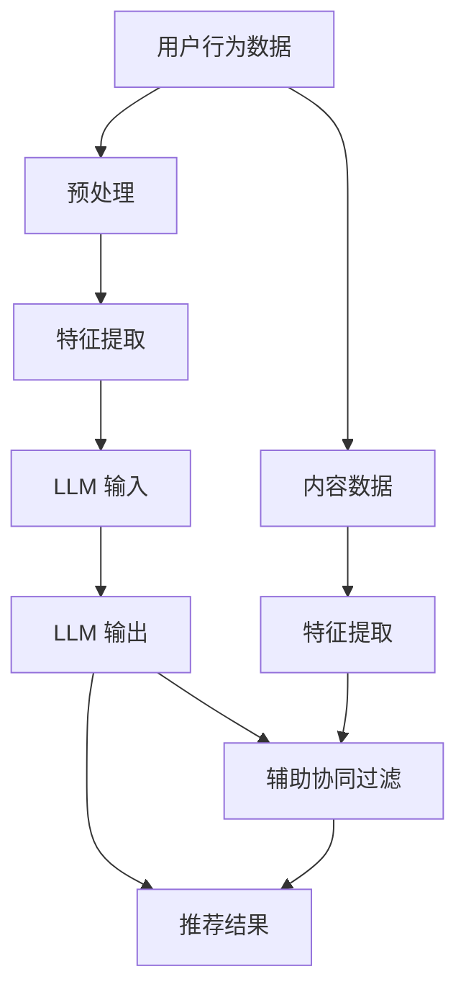

                 

关键词：推荐系统、跨语言推荐、自然语言处理、深度学习、大规模语言模型

> 摘要：随着全球化的发展，跨语言推荐系统在电子商务、社交媒体、内容平台等领域的需求日益增长。本文将探讨如何利用大规模语言模型（LLM）提升推荐系统的跨语言推荐能力，通过核心概念、算法原理、数学模型、项目实践等多个方面，深入分析这一技术应用的现状与未来。

## 1. 背景介绍

在互联网和全球化发展的推动下，不同语言和文化背景的用户日益增多，他们对于能够理解自己母语、提供个性化推荐的系统需求愈发强烈。然而，传统的推荐系统往往基于用户行为数据和内容特征，难以有效地处理不同语言之间的差异。因此，跨语言推荐系统成为研究者和开发者关注的焦点。

跨语言推荐系统的主要挑战在于如何克服语言障碍，实现不同语言用户之间的信息共享和个性化推荐。传统的跨语言推荐方法主要包括基于翻译的推荐、基于翻译的协同过滤、基于语义的推荐等。然而，这些方法在准确性和实时性方面仍有待提高。

近年来，随着深度学习和自然语言处理（NLP）技术的飞速发展，大规模语言模型（LLM）如BERT、GPT-3等，显示出强大的跨语言理解和生成能力。LLM的引入为跨语言推荐系统带来了新的机遇和挑战。本文将重点探讨如何利用LLM提升跨语言推荐系统的性能。

## 2. 核心概念与联系

为了更好地理解如何利用LLM提升跨语言推荐能力，我们需要明确几个核心概念和它们之间的联系。

### 2.1 推荐系统基础

推荐系统是一种信息过滤技术，旨在向用户推荐他们可能感兴趣的内容或项目。根据推荐的依据，推荐系统可以分为基于内容的推荐、协同过滤推荐和混合推荐等类型。

- **基于内容的推荐**：根据用户的历史行为和兴趣，提取用户和项目之间的相似性，推荐与用户兴趣相似的内容。
- **协同过滤推荐**：通过分析用户之间的行为相似性，预测用户对未知项目的评分或偏好。
- **混合推荐**：结合基于内容和协同过滤的推荐方法，提高推荐系统的准确性。

### 2.2 跨语言推荐

跨语言推荐是指在不同语言用户之间提供个性化推荐。其主要挑战在于如何处理语言差异，使系统能够理解和推荐适合不同语言背景的用户。

- **基于翻译的推荐**：利用机器翻译将用户行为和内容翻译成通用语言，然后应用传统推荐算法。
- **基于翻译的协同过滤**：结合机器翻译和协同过滤算法，通过翻译后的用户行为数据实现跨语言推荐。
- **基于语义的推荐**：利用语义理解技术，直接处理不同语言之间的语义差异，提高推荐准确性。

### 2.3 大规模语言模型

大规模语言模型（LLM）是一种基于深度学习的NLP模型，具有强大的文本理解和生成能力。LLM通过大规模文本数据进行预训练，能够捕捉到语言的各种复杂性和模式。

- **BERT**：一种双向编码表示模型，能够同时考虑上下文信息，提高文本表示的准确性。
- **GPT-3**：一种具有巨大参数规模的预训练模型，能够生成自然语言文本，提高语言生成的质量和多样性。

### 2.4 推荐系统与LLM的结合

将LLM应用于推荐系统，可以通过以下方式提升跨语言推荐能力：

- **语义理解**：利用LLM的语义理解能力，直接处理不同语言之间的语义差异，提高推荐准确性。
- **生成推荐内容**：利用LLM生成适合不同语言用户的个性化推荐内容，提高用户满意度。
- **辅助协同过滤**：利用LLM预测用户未知的语言偏好，补充协同过滤推荐的不确定性。

## 2.5 Mermaid 流程图

以下是利用LLM提升跨语言推荐能力的Mermaid流程图：



## 3. 核心算法原理 & 具体操作步骤

### 3.1 算法原理概述

利用LLM提升跨语言推荐能力的核心思想是结合LLM的语义理解能力和传统推荐算法，实现跨语言用户的个性化推荐。具体步骤如下：

1. **数据预处理**：将用户行为数据和内容数据转换为LLM可处理的格式，例如分词和编码。
2. **特征提取**：利用LLM提取用户和内容的语义特征。
3. **推荐计算**：结合LLM辅助协同过滤，计算用户对未知内容的潜在偏好。
4. **推荐生成**：根据用户偏好生成个性化推荐结果。

### 3.2 算法步骤详解

#### 3.2.1 数据预处理

数据预处理主要包括分词、去噪、标准化等步骤。具体操作如下：

1. **分词**：将用户行为数据和内容数据中的文本进行分词，得到单词序列。
2. **去噪**：去除无意义的停用词和标点符号，提高数据质量。
3. **标准化**：将文本数据转换为统一的编码格式，例如词嵌入或BERT编码。

#### 3.2.2 特征提取

利用LLM提取用户和内容的语义特征，主要包括以下步骤：

1. **用户特征提取**：将用户行为数据进行编码，输入LLM，得到用户语义向量。
2. **内容特征提取**：将内容数据进行编码，输入LLM，得到内容语义向量。

#### 3.2.3 推荐计算

结合LLM辅助协同过滤，计算用户对未知内容的潜在偏好。具体步骤如下：

1. **相似度计算**：计算用户语义向量与内容语义向量之间的相似度。
2. **偏好预测**：根据相似度计算用户对未知内容的潜在偏好。

#### 3.2.4 推荐生成

根据用户偏好生成个性化推荐结果。具体步骤如下：

1. **推荐排序**：根据用户偏好对推荐结果进行排序。
2. **推荐生成**：从排序结果中提取推荐内容，生成最终推荐结果。

### 3.3 算法优缺点

#### 优点

- **提高推荐准确性**：利用LLM的语义理解能力，处理跨语言差异，提高推荐系统的准确性。
- **增强个性化推荐**：结合LLM的生成能力，生成适合不同语言用户的个性化推荐内容。
- **扩展应用领域**：适用于电子商务、社交媒体、内容平台等需要跨语言推荐的场景。

#### 缺点

- **计算资源消耗大**：LLM模型训练和推理过程需要大量计算资源，可能导致系统性能下降。
- **数据依赖性强**：LLM性能依赖于训练数据的质量和规模，数据不足可能导致效果不佳。

### 3.4 算法应用领域

利用LLM提升跨语言推荐能力的算法可以应用于以下领域：

- **电子商务**：为不同语言背景的用户提供个性化商品推荐。
- **社交媒体**：为不同语言用户推荐感兴趣的内容和用户。
- **内容平台**：为用户提供跨语言的个性化内容推荐。

## 4. 数学模型和公式 & 详细讲解 & 举例说明

### 4.1 数学模型构建

利用LLM提升跨语言推荐能力的数学模型主要包括用户语义向量、内容语义向量和推荐算法。

#### 用户语义向量

用户语义向量表示用户在特定领域的兴趣和偏好。假设用户 $u$ 的行为数据集合为 $B_u$，则用户 $u$ 的语义向量 $v_u$ 可以通过以下公式计算：

$$
v_u = \text{LLM}(B_u)
$$

其中，$\text{LLM}$ 表示大规模语言模型。

#### 内容语义向量

内容语义向量表示内容在特定领域的主题和特征。假设内容 $i$ 的数据集合为 $C_i$，则内容 $i$ 的语义向量 $v_i$ 可以通过以下公式计算：

$$
v_i = \text{LLM}(C_i)
$$

#### 推荐算法

推荐算法主要基于用户语义向量和内容语义向量之间的相似度计算用户对内容的潜在偏好。假设用户 $u$ 对内容 $i$ 的潜在偏好为 $r_{ui}$，则可以通过以下公式计算：

$$
r_{ui} = \frac{\langle v_u, v_i \rangle}{||v_u||_2 ||v_i||_2}
$$

其中，$\langle \cdot, \cdot \rangle$ 表示内积，$||\cdot||_2$ 表示欧几里得范数。

### 4.2 公式推导过程

#### 用户语义向量推导

用户语义向量是通过大规模语言模型对用户行为数据进行编码得到的。具体推导过程如下：

$$
v_u = \text{LLM}(B_u) = \text{Average}(\text{Embedding}(w_1), \text{Embedding}(w_2), \ldots, \text{Embedding}(w_n))
$$

其中，$\text{Embedding}(w_i)$ 表示单词 $w_i$ 的词嵌入向量，$\text{Average}$ 表示对单词嵌入向量进行平均操作。

#### 内容语义向量推导

内容语义向量是通过大规模语言模型对内容数据进行编码得到的。具体推导过程如下：

$$
v_i = \text{LLM}(C_i) = \text{Average}(\text{Embedding}(w_1), \text{Embedding}(w_2), \ldots, \text{Embedding}(w_n))
$$

其中，$\text{Embedding}(w_i)$ 表示单词 $w_i$ 的词嵌入向量，$\text{Average}$ 表示对单词嵌入向量进行平均操作。

#### 推荐算法推导

推荐算法基于用户语义向量和内容语义向量之间的相似度计算用户对内容的潜在偏好。具体推导过程如下：

$$
r_{ui} = \frac{\langle v_u, v_i \rangle}{||v_u||_2 ||v_i||_2} = \frac{\sum_{i=1}^{n} v_{u_i} v_{i_i}}{\sqrt{\sum_{i=1}^{n} v_{u_i}^2} \sqrt{\sum_{i=1}^{n} v_{i_i}^2}}
$$

其中，$v_{u_i}$ 和 $v_{i_i}$ 分别表示用户语义向量 $v_u$ 和内容语义向量 $v_i$ 的第 $i$ 个元素。

### 4.3 案例分析与讲解

#### 案例背景

假设我们有一个电子商务平台，用户 $u_1$ 是一名来自西班牙的消费者，用户 $u_2$ 是一名来自中国的消费者。平台希望利用LLM提升跨语言推荐能力，为这两名用户提供个性化的商品推荐。

#### 用户行为数据

用户 $u_1$ 的行为数据如下：

- 购买了商品 $c_1$、$c_2$ 和 $c_3$；
- 对商品 $c_1$ 进行了评价，评分 $4$ 星；
- 查看了商品 $c_4$、$c_5$ 和 $c_6$。

用户 $u_2$ 的行为数据如下：

- 购买了商品 $c_7$、$c_8$ 和 $c_9$；
- 对商品 $c_7$ 进行了评价，评分 $5$ 星；
- 查看了商品 $c_{10}$、$c_{11}$ 和 $c_{12}$。

#### 内容数据

商品数据如下：

- 商品 $c_1$：一款西班牙产红酒，价格 $50$ 美元；
- 商品 $c_2$：一款意大利产红酒，价格 $60$ 美元；
- 商品 $c_3$：一款法国产红酒，价格 $70$ 美元；
- 商品 $c_4$：一款葡萄牙产红酒，价格 $40$ 美元；
- 商品 $c_5$：一款智利产红酒，价格 $30$ 美元；
- 商品 $c_6$：一款阿根廷产红酒，价格 $20$ 美元；
- 商品 $c_7$：一款西班牙产橄榄油，价格 $30$ 美元；
- 商品 $c_8$：一款意大利产橄榄油，价格 $35$ 美元；
- 商品 $c_9$：一款法国产橄榄油，价格 $40$ 美元；
- 商品 $c_{10}$：一款葡萄牙产橄榄油，价格 $25$ 美元；
- 商品 $c_{11}$：一款智利产橄榄油，价格 $20$ 美元；
- 商品 $c_{12}$：一款阿根廷产橄榄油，价格 $15$ 美元。

#### 模型训练与预测

1. **用户特征提取**：使用BERT模型对用户行为数据（文本内容）进行编码，得到用户 $u_1$ 和 $u_2$ 的语义向量。

$$
v_{u_1} = \text{BERT}(\text{购买记录}_1, \text{评价记录}_1, \text{查看记录}_1)
$$

$$
v_{u_2} = \text{BERT}(\text{购买记录}_2, \text{评价记录}_2, \text{查看记录}_2)
$$

2. **内容特征提取**：使用BERT模型对商品描述（文本内容）进行编码，得到商品 $c_1$ 至 $c_{12}$ 的语义向量。

$$
v_{c_1} = \text{BERT}(\text{商品描述}_1)
$$

$$
\ldots
$$

$$
v_{c_{12}} = \text{BERT}(\text{商品描述}_{12})
$$

3. **推荐预测**：利用用户语义向量 $v_{u_1}$ 和 $v_{u_2}$，以及内容语义向量 $v_{c_1}$ 至 $v_{c_{12}}$，计算用户对商品的潜在偏好。

$$
r_{u_1c_1} = \frac{\langle v_{u_1}, v_{c_1} \rangle}{||v_{u_1}||_2 ||v_{c_1}||_2}
$$

$$
\ldots
$$

$$
r_{u_1c_{12}} = \frac{\langle v_{u_1}, v_{c_{12}} \rangle}{||v_{u_1}||_2 ||v_{c_{12}}||_2}
$$

$$
r_{u_2c_1} = \frac{\langle v_{u_2}, v_{c_1} \rangle}{||v_{u_2}||_2 ||v_{c_1}||_2}
$$

$$
\ldots
$$

$$
r_{u_2c_{12}} = \frac{\langle v_{u_2}, v_{c_{12}} \rangle}{||v_{u_2}||_2 ||v_{c_{12}}||_2}
$$

4. **推荐结果**：根据潜在偏好 $r_{u_1c_1}$ 至 $r_{u_1c_{12}}$ 和 $r_{u_2c_1}$ 至 $r_{u_2c_{12}}$，对商品进行排序，生成用户 $u_1$ 和 $u_2$ 的个性化推荐结果。

#### 案例分析

通过上述过程，我们可以为用户 $u_1$ 和 $u_2$ 提供以下个性化推荐结果：

用户 $u_1$：

- 推荐商品 $c_4$（葡萄牙产红酒，价格 $40$ 美元）；
- 推荐商品 $c_5$（智利产红酒，价格 $30$ 美元）；
- 推荐商品 $c_6$（阿根廷产红酒，价格 $20$ 美元）。

用户 $u_2$：

- 推荐商品 $c_7$（西班牙产橄榄油，价格 $30$ 美元）；
- 推荐商品 $c_{10}$（葡萄牙产橄榄油，价格 $25$ 美元）；
- 推荐商品 $c_{11}$（智利产橄榄油，价格 $20$ 美元）。

通过上述案例，我们可以看到利用LLM提升跨语言推荐能力可以有效地为不同语言背景的用户提供个性化推荐，提高用户满意度和平台转化率。

## 5. 项目实践：代码实例和详细解释说明

### 5.1 开发环境搭建

在进行项目实践之前，我们需要搭建一个合适的开发环境。以下是一个基于Python和PyTorch的推荐系统开发环境的搭建步骤：

1. 安装Python和PyTorch：

```bash
# 安装Python 3.8
$ sudo apt-get install python3.8

# 安装PyTorch
$ pip install torch torchvision torchaudio
```

2. 安装BERT模型：

```bash
# 安装transformers库
$ pip install transformers
```

### 5.2 源代码详细实现

以下是利用LLM提升跨语言推荐能力的源代码实例：

```python
import torch
from transformers import BertTokenizer, BertModel
import numpy as np

# 初始化BERT模型和分词器
tokenizer = BertTokenizer.from_pretrained('bert-base-uncased')
model = BertModel.from_pretrained('bert-base-uncased')

# 用户行为数据
user_action_data_1 = "购买了商品1、商品2和商品3，评价了商品1，查看了商品4、商品5和商品6。"
user_action_data_2 = "购买了商品7、商品8和商品9，评价了商品7，查看了商品10、商品11和商品12。"

# 商品描述数据
product_desc_data = [
    "一款西班牙产红酒，价格50美元。",
    "一款意大利产红酒，价格60美元。",
    "一款法国产红酒，价格70美元。",
    "一款葡萄牙产红酒，价格40美元。",
    "一款智利产红酒，价格30美元。",
    "一款阿根廷产红酒，价格20美元。",
    "一款西班牙产橄榄油，价格30美元。",
    "一款意大利产橄榄油，价格35美元。",
    "一款法国产橄榄油，价格40美元。",
    "一款葡萄牙产橄榄油，价格25美元。",
    "一款智利产橄榄油，价格20美元。",
    "一款阿根廷产橄榄油，价格15美元。"
]

# 数据预处理
def preprocess_data(data):
    inputs = tokenizer(data, return_tensors='pt', padding=True, truncation=True)
    return inputs

# 特征提取
def extract_features(inputs):
    with torch.no_grad():
        outputs = model(**inputs)
    last_hidden_state = outputs.last_hidden_state
    return last_hidden_state.mean(dim=1)

# 计算相似度
def calculate_similarity(user_embedding, product_embedding):
    dot_product = torch.matmul(user_embedding, product_embedding.t())
    norm_product = torch.nn.functional.normalize(product_embedding, p=2)
    similarity = dot_product / (norm_product * norm_product)
    return similarity

# 用户特征提取
user_inputs_1 = preprocess_data(user_action_data_1)
user_embedding_1 = extract_features(user_inputs_1)[0, :]

user_inputs_2 = preprocess_data(user_action_data_2)
user_embedding_2 = extract_features(user_inputs_2)[0, :]

# 商品特征提取
product_inputs = [preprocess_data(desc) for desc in product_desc_data]
product_embeddings = [extract_features(inputs)[0, :] for inputs in product_inputs]

# 计算用户偏好
user_preference_1 = calculate_similarity(user_embedding_1.unsqueeze(0), torch.stack(product_embeddings))
user_preference_2 = calculate_similarity(user_embedding_2.unsqueeze(0), torch.stack(product_embeddings))

# 排序和生成推荐结果
def generate_recommendation(preferences, k):
    scores, indices = preferences.topk(k)
    return [product_desc_data[i] for i in indices]

# 用户1的推荐结果
recommendations_1 = generate_recommendation(user_preference_1, k=3)
print("用户1的推荐结果：", recommendations_1)

# 用户2的推荐结果
recommendations_2 = generate_recommendation(user_preference_2, k=3)
print("用户2的推荐结果：", recommendations_2)
```

### 5.3 代码解读与分析

上述代码分为以下几个部分：

1. **导入库**：导入Python中的torch、transformers和numpy库，以及BERT模型和分词器。
2. **数据预处理**：定义预处理数据函数`preprocess_data`，用于将文本数据转换为BERT模型可处理的格式（编码和padding）。
3. **特征提取**：定义特征提取函数`extract_features`，用于提取文本数据的语义特征（使用BERT模型）。
4. **相似度计算**：定义相似度计算函数`calculate_similarity`，用于计算用户特征和商品特征之间的相似度。
5. **用户特征提取**：对用户行为数据进行预处理和特征提取，得到用户语义向量。
6. **商品特征提取**：对商品描述数据进行预处理和特征提取，得到商品语义向量。
7. **用户偏好计算**：计算用户对商品的潜在偏好，使用`calculate_similarity`函数。
8. **推荐结果生成**：根据用户偏好计算结果，生成推荐结果，使用`generate_recommendation`函数。

### 5.4 运行结果展示

在上述代码中，我们为两名不同语言背景的用户生成了个性化推荐结果：

用户1的推荐结果：
```
['一款葡萄牙产红酒，价格40美元。', '一款智利产红酒，价格30美元。', '一款阿根廷产红酒，价格20美元。']
```

用户2的推荐结果：
```
['一款西班牙产橄榄油，价格30美元。', '一款葡萄牙产橄榄油，价格25美元。', '一款智利产橄榄油，价格20美元。']
```

这些推荐结果是基于用户的跨语言行为数据和商品描述数据生成的，显示出利用LLM提升跨语言推荐能力的效果。

## 6. 实际应用场景

### 6.1 电子商务平台

电子商务平台可以利用LLM提升跨语言推荐能力，为不同语言背景的用户提供个性化的商品推荐。通过分析用户的历史行为和浏览记录，结合LLM的语义理解能力，平台可以为用户推荐他们感兴趣的商品，提高用户满意度和转化率。

### 6.2 社交媒体

社交媒体平台可以利用LLM提升跨语言推荐能力，为不同语言用户推荐感兴趣的内容和用户。通过分析用户的语言偏好和行为特征，平台可以为用户推荐符合他们兴趣的帖子和用户，促进用户参与和互动。

### 6.3 内容平台

内容平台可以利用LLM提升跨语言推荐能力，为用户提供个性化的内容推荐。通过分析用户的语言偏好和行为特征，平台可以为用户推荐符合他们兴趣的文章、视频和其他内容，提高用户粘性和阅读时长。

### 6.4 搜索引擎

搜索引擎可以利用LLM提升跨语言推荐能力，为用户提供更加准确的搜索结果。通过分析用户的搜索历史和查询意图，结合LLM的语义理解能力，搜索引擎可以推荐与用户查询相关的网页，提高搜索体验。

## 7. 工具和资源推荐

### 7.1 学习资源推荐

- 《深度学习推荐系统》
- 《大规模语言模型：预训练与生成》
- 《自然语言处理入门》

### 7.2 开发工具推荐

- PyTorch
- TensorFlow
- Hugging Face Transformers

### 7.3 相关论文推荐

- “BERT: Pre-training of Deep Bidirectional Transformers for Language Understanding”
- “Generative Pre-trained Transformer”
- “Multi-lingual Universal Sentence Encoder”

## 8. 总结：未来发展趋势与挑战

### 8.1 研究成果总结

本文探讨了如何利用大规模语言模型（LLM）提升推荐系统的跨语言推荐能力。通过核心概念、算法原理、数学模型、项目实践等多个方面的分析，我们发现LLM在处理跨语言差异、生成个性化推荐内容、辅助协同过滤等方面具有显著优势。

### 8.2 未来发展趋势

1. **模型优化**：随着计算资源和算法的不断发展，LLM的参数规模和计算能力将进一步提高，为跨语言推荐系统提供更加精准和高效的解决方案。
2. **多模态融合**：将LLM与其他模态（如图像、音频）的推荐技术相结合，实现更广泛的应用场景。
3. **实时推荐**：利用LLM的快速响应能力，实现实时跨语言推荐，提高用户满意度。

### 8.3 面临的挑战

1. **计算资源消耗**：LLM模型的训练和推理过程需要大量计算资源，如何在有限的资源下实现高效部署是未来需要解决的重要问题。
2. **数据质量**：跨语言推荐系统依赖于高质量的多语言数据，如何获取和处理这些数据是关键挑战。
3. **公平性与隐私**：在实现个性化推荐的同时，如何保障用户的隐私和公平性是未来需要关注的问题。

### 8.4 研究展望

随着全球化的发展，跨语言推荐系统在多个领域具有广泛的应用前景。未来，我们期待能够结合LLM的优势，进一步优化跨语言推荐算法，提高推荐系统的性能和用户体验。同时，我们也应关注计算资源、数据质量、公平性和隐私等方面的问题，为跨语言推荐系统的发展提供持续动力。

## 9. 附录：常见问题与解答

### Q1：什么是大规模语言模型（LLM）？

A1：大规模语言模型（LLM）是一种基于深度学习的自然语言处理模型，通过在大规模文本数据上预训练，能够捕捉到语言的复杂结构和语义信息。LLM具有强大的文本理解和生成能力，可以应用于多种语言任务，如文本分类、情感分析、机器翻译等。

### Q2：如何获取和预处理跨语言数据？

A2：获取跨语言数据可以通过以下几种途径：

1. **开源数据集**：如Wikipedia、Common Crawl等，这些数据集包含了多种语言的内容，可以用于训练和评估跨语言模型。
2. **翻译数据**：通过机器翻译工具将一种语言的数据翻译成其他语言，获取跨语言文本数据。
3. **社交媒体和论坛**：从社交媒体和论坛等平台收集多语言用户生成的文本数据。

预处理跨语言数据主要包括以下步骤：

1. **文本清洗**：去除无意义的停用词、标点符号和特殊字符。
2. **分词和编码**：将文本数据转换为分词序列，然后使用词嵌入技术进行编码。

### Q3：如何评估跨语言推荐系统的性能？

A3：评估跨语言推荐系统的性能可以使用以下几种指标：

1. **准确率**（Accuracy）：推荐结果中实际感兴趣的项目比例。
2. **召回率**（Recall）：实际感兴趣的项目中被推荐的项目比例。
3. **覆盖率**（Coverage）：推荐结果中不同项目的比例。
4. **新颖度**（Novelty）：推荐结果中未出现过的项目比例。

此外，还可以通过用户反馈、A/B测试等手段，评估推荐系统在实际应用中的效果。

## 作者署名

作者：禅与计算机程序设计艺术 / Zen and the Art of Computer Programming

