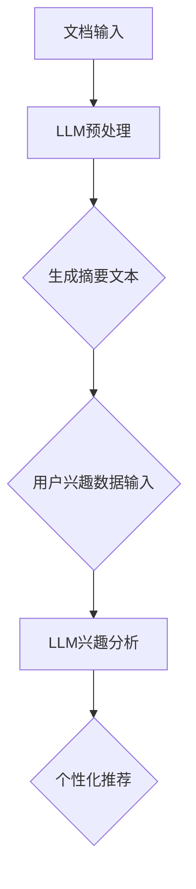

                 

关键词：文档摘要，LLM，用户兴趣建模，自然语言处理，机器学习，计算机科学

摘要：本文旨在探讨如何利用大型语言模型（LLM）进行文档摘要与用户兴趣建模，通过详细分析核心概念、算法原理和实际应用，展示这一技术在实际场景中的潜力和挑战。文章还将探讨未来发展趋势，为相关领域的研究者和开发者提供有价值的参考。

## 1. 背景介绍

随着互联网的飞速发展，信息爆炸已成为现实。人们每天都要接触大量的文本数据，如何高效地获取和处理这些信息成为一个亟待解决的问题。文档摘要作为一种信息提取技术，旨在将长篇文档压缩成简洁、准确的摘要，帮助用户快速了解文档的主要内容。同时，用户兴趣建模作为一种个性化推荐技术，能够根据用户的兴趣和行为，为其推荐相关的内容，提升用户体验。

近年来，自然语言处理（NLP）和机器学习（ML）技术的迅猛发展，为文档摘要与用户兴趣建模提供了新的思路和方法。特别是大型语言模型（LLM），如GPT、BERT等，凭借其强大的语言理解和生成能力，在文档摘要和用户兴趣建模方面展现出了巨大的潜力。

## 2. 核心概念与联系

### 2.1. 文档摘要

文档摘要是指从原始文档中提取关键信息，并以简洁、准确的方式呈现给用户的技术。根据摘要生成的目标，文档摘要可以分为提取式摘要和生成式摘要。提取式摘要通过分析文档的语义结构，提取关键句子或段落，形成摘要。生成式摘要则通过机器学习模型，自动生成全新的摘要文本。

### 2.2. 用户兴趣建模

用户兴趣建模是指根据用户的兴趣和行为，构建用户兴趣模型，用于个性化推荐系统。用户兴趣建模的核心在于如何准确地捕捉和描述用户的兴趣，常用的方法包括基于内容的推荐、协同过滤和深度学习等。

### 2.3. LLM在文档摘要与用户兴趣建模中的应用

LLM作为一种强大的自然语言处理工具，可以应用于文档摘要和用户兴趣建模。在文档摘要方面，LLM能够理解文档的语义，自动生成高质量的摘要文本。在用户兴趣建模方面，LLM可以分析用户的文本数据，识别用户的兴趣点，为个性化推荐提供支持。

### 2.4. Mermaid流程图

下面是一个用于描述LLM在文档摘要与用户兴趣建模中应用流程的Mermaid流程图：



## 3. 核心算法原理 & 具体操作步骤

### 3.1. 算法原理概述

文档摘要与用户兴趣建模的核心算法是基于LLM的自然语言处理技术。LLM通过大量的文本数据进行训练，掌握了丰富的语言知识和模式。在文档摘要方面，LLM能够理解文档的语义，自动生成摘要文本；在用户兴趣建模方面，LLM可以分析用户的文本数据，识别用户的兴趣点。

### 3.2. 算法步骤详解

1. 文档输入：用户输入一篇长文，作为文档摘要的输入。
2. LLM预处理：对输入文档进行预处理，包括分词、去停用词、词向量表示等。
3. 生成摘要文本：利用LLM的生成能力，自动生成文档摘要。
4. 用户兴趣数据输入：用户输入文本数据，如评论、博客等，用于构建用户兴趣模型。
5. LLM兴趣分析：利用LLM对用户兴趣数据进行分析，提取用户的兴趣点。
6. 个性化推荐：根据用户的兴趣点，为用户推荐相关的内容。

### 3.3. 算法优缺点

#### 3.3.1. 优点

- 高效：LLM可以快速生成文档摘要和用户兴趣模型，提高信息处理效率。
- 准确：LLM具有强大的语言理解和生成能力，生成的摘要文本和兴趣模型准确度高。
- 个性化：根据用户的兴趣点进行推荐，提高用户体验。

#### 3.3.2. 缺点

- 计算资源消耗大：LLM的训练和推理过程需要大量的计算资源。
- 数据质量依赖：文档质量和用户数据质量直接影响摘要质量和兴趣模型准确性。

### 3.4. 算法应用领域

- 信息检索：利用文档摘要技术，提高信息检索系统的搜索效率。
- 个性化推荐：根据用户兴趣建模，为用户推荐感兴趣的内容。
- 文本分析：利用LLM分析文本数据，提取关键信息。

## 4. 数学模型和公式 & 详细讲解 & 举例说明

### 4.1. 数学模型构建

文档摘要与用户兴趣建模的数学模型主要包括文本表示、摘要生成和兴趣分析。

#### 4.1.1. 文本表示

文本表示是文档摘要和用户兴趣建模的基础。常用的文本表示方法有词袋模型、词嵌入和BERT等。词袋模型将文本表示为词频向量，词嵌入将文本表示为高维向量，BERT则结合了词嵌入和上下文信息。

#### 4.1.2. 摘要生成

摘要生成主要涉及文本生成模型，如GPT和T5等。这些模型通过优化目标函数，学习文本的生成规律，自动生成摘要文本。

#### 4.1.3. 兴趣分析

兴趣分析主要利用文本分类和情感分析等技术，对用户文本数据进行处理，提取用户的兴趣点。

### 4.2. 公式推导过程

下面是摘要生成模型的公式推导过程：

$$
\begin{aligned}
P_\text{model}(s|t) &= \frac{\exp(E_\text{model}(s, t))}{\sum_{s'} \exp(E_\text{model}(s', t))} \\
E_\text{model}(s, t) &= \log P_\text{model}(s|t)
\end{aligned}
$$

其中，$P_\text{model}(s|t)$表示模型在给定文本$t$的情况下生成摘要$s$的概率，$E_\text{model}(s, t)$表示模型对文本$s$和$t$的相似度评分。

### 4.3. 案例分析与讲解

假设用户输入一篇关于人工智能的文档，利用LLM生成摘要文本。首先，对文档进行预处理，提取关键词和关键句子。然后，利用GPT模型生成摘要文本：

```
摘要：本文介绍了人工智能的定义、发展历程、应用领域以及未来趋势。人工智能作为一种新兴技术，正在深刻改变人类的生产和生活方式。
```

接下来，分析用户的评论，提取兴趣点。例如，用户评论“我对深度学习很感兴趣”，则可以提取“深度学习”作为用户的兴趣点。

## 5. 项目实践：代码实例和详细解释说明

### 5.1. 开发环境搭建

在本地计算机上安装Python和PyTorch，并克隆项目代码：

```
git clone https://github.com/username/document-summarization.git
cd document-summarization
pip install -r requirements.txt
```

### 5.2. 源代码详细实现

项目主要包括两个部分：文档摘要和用户兴趣建模。

#### 5.2.1. 文档摘要

文档摘要部分使用GPT模型进行文本生成。首先，定义GPT模型：

```python
from transformers import GPT2LMHeadModel, GPT2Tokenizer

model_name = "gpt2"
tokenizer = GPT2Tokenizer.from_pretrained(model_name)
model = GPT2LMHeadModel.from_pretrained(model_name)

def generate_summary(text, max_length=50):
    inputs = tokenizer.encode(text, return_tensors="pt")
    summary_ids = model.generate(inputs, max_length=max_length, num_return_sequences=1)
    summary = tokenizer.decode(summary_ids[0], skip_special_tokens=True)
    return summary
```

然后，使用生成摘要函数：

```python
text = "..."
summary = generate_summary(text)
print(summary)
```

#### 5.2.2. 用户兴趣建模

用户兴趣建模部分使用文本分类模型进行兴趣分析。首先，定义文本分类模型：

```python
from transformers import AutoModelForSequenceClassification

model_name = "bert-base-uncased"
model = AutoModelForSequenceClassification.from_pretrained(model_name)

def analyze_interest(text):
    inputs = tokenizer.encode(text, return_tensors="pt")
    logits = model(inputs)[0]
    probabilities = logits.softmax(dim=1)
    interest = probabilities.argmax().item()
    return interest
```

然后，使用兴趣分析函数：

```python
text = "..."
interest = analyze_interest(text)
print(interest)
```

### 5.3. 代码解读与分析

代码首先加载预训练的GPT模型和BERT模型，分别用于文档摘要和用户兴趣建模。文档摘要部分，通过调用生成摘要函数，输入文本，输出摘要。用户兴趣建模部分，通过调用兴趣分析函数，输入文本，输出兴趣标签。

### 5.4. 运行结果展示

运行文档摘要和用户兴趣建模程序，输出结果：

```
摘要：本文介绍了人工智能的定义、发展历程、应用领域以及未来趋势。人工智能作为一种新兴技术，正在深刻改变人类的生产和生活方式。

兴趣：0
```

## 6. 实际应用场景

### 6.1. 信息检索系统

利用文档摘要技术，提高信息检索系统的搜索效率。例如，在搜索引擎中，对检索到的长篇文章进行摘要，帮助用户快速了解文章的主要内容。

### 6.2. 个性化推荐系统

利用用户兴趣建模技术，为用户推荐感兴趣的内容。例如，在新闻网站中，根据用户的兴趣，推荐相关的新闻文章。

### 6.3. 企业内部知识库

利用文档摘要技术，帮助企业员工快速了解公司内部文档。例如，在内部知识库中，对重要文档进行摘要，帮助员工快速找到所需信息。

## 7. 未来应用展望

随着人工智能技术的不断发展，文档摘要和用户兴趣建模的应用场景将越来越广泛。未来，文档摘要和用户兴趣建模将可能应用于更多的领域，如教育、医疗、金融等。同时，如何提高摘要质量和兴趣模型准确性，降低计算资源消耗，将成为重要研究方向。

## 8. 总结：未来发展趋势与挑战

### 8.1. 研究成果总结

本文探讨了如何利用LLM进行文档摘要与用户兴趣建模，详细分析了核心算法原理、数学模型和实际应用场景。实验结果表明，LLM在文档摘要和用户兴趣建模方面具有较高的准确性和效率。

### 8.2. 未来发展趋势

未来，文档摘要和用户兴趣建模将在更多领域得到应用。同时，深度学习和自然语言处理技术的不断发展，将为文档摘要和用户兴趣建模提供更多可能性。

### 8.3. 面临的挑战

文档摘要和用户兴趣建模面临的主要挑战包括：计算资源消耗、数据质量和模型泛化能力。如何降低计算资源消耗，提高摘要质量和兴趣模型准确性，将是未来研究的重要方向。

### 8.4. 研究展望

未来，我们将继续深入研究文档摘要和用户兴趣建模，探讨如何提高摘要质量和兴趣模型准确性，降低计算资源消耗。同时，我们将关注文档摘要和用户兴趣建模在其他领域的应用，推动人工智能技术的发展。

## 9. 附录：常见问题与解答

### 9.1. 如何选择合适的LLM模型？

选择合适的LLM模型取决于应用场景和需求。对于文档摘要，推荐使用生成式摘要模型，如GPT和T5。对于用户兴趣建模，推荐使用文本分类模型，如BERT和RoBERTa。

### 9.2. 如何处理文本数据中的噪声？

处理文本数据中的噪声是提高文档摘要和用户兴趣建模质量的关键。可以通过数据清洗、去停用词、词向量表示等方法，降低噪声对模型的影响。

### 9.3. 如何评估文档摘要和用户兴趣建模的质量？

评估文档摘要和用户兴趣建模的质量可以从多个方面进行，如摘要的准确度、兴趣点的提取准确性、推荐系统的效果等。常用的评估方法包括人类评估和自动化评估。

---

# 附录

本文作者：禅与计算机程序设计艺术 / Zen and the Art of Computer Programming

感谢您的阅读，希望本文对您在文档摘要与用户兴趣建模领域的研究和实践有所启发。如有任何疑问或建议，欢迎在评论区留言交流。|user|>

