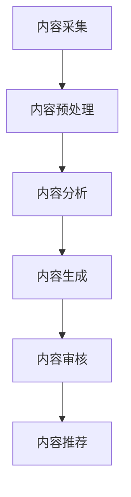

                 

关键词：人工智能，内容创作，流程优化，算法，工具，技术

> 摘要：本文将探讨人工智能技术在知识内容创作流程中的应用，通过分析核心概念、算法原理、数学模型和项目实践，旨在揭示人工智能如何提高知识内容创作效率和质量。文章还将展望未来发展趋势，并推荐相关工具和资源。

## 1. 背景介绍

随着互联网和数字技术的迅猛发展，知识内容的创作和传播变得前所未有的便捷和丰富。然而，大量的内容创作也带来了新的挑战。如何提高内容创作的效率和质量，如何确保内容的相关性和准确性，成为内容创作者不得不面对的问题。人工智能技术，特别是自然语言处理（NLP）和机器学习（ML），为解决这些问题提供了新的途径。

人工智能在知识内容创作中的应用主要表现在以下几个方面：

1. **内容生成**：通过生成式模型自动生成文章、摘要、问答等。
2. **内容审核**：利用分类和情感分析算法对内容进行审核，确保内容的安全性和合规性。
3. **内容推荐**：基于用户的兴趣和行为数据，推荐相关的内容，提高用户的参与度和满意度。
4. **内容优化**：分析内容的关键词、结构、语言，提供优化建议，提升内容的可读性和传播效果。

本文将围绕这些应用，深入探讨人工智能优化知识内容创作流程的原理和方法。

## 2. 核心概念与联系

### 2.1 自然语言处理（NLP）

自然语言处理是人工智能的一个分支，主要研究如何让计算机理解和处理自然语言。在知识内容创作中，NLP技术可以用于提取关键词、生成摘要、翻译文本等。NLP的核心技术包括：

- **分词**：将连续的文本分割成有意义的词语。
- **词性标注**：为每个词分配词性，如名词、动词、形容词等。
- **实体识别**：识别文本中的实体，如人名、地名、组织名等。
- **情感分析**：判断文本的情感倾向，如正面、负面或中性。

### 2.2 机器学习（ML）

机器学习是人工智能的核心技术之一，通过从数据中学习规律，提升系统的自主决策能力。在知识内容创作中，ML技术可以用于分类、预测、推荐等任务。

- **监督学习**：通过已标记的数据训练模型，用于分类和回归任务。
- **无监督学习**：在没有标记数据的情况下，自动发现数据中的模式。
- **强化学习**：通过与环境的交互，不断调整策略以最大化回报。

### 2.3 架构与流程

知识内容创作流程通常包括以下几个步骤：

1. **内容采集**：从各种来源收集原始内容。
2. **内容预处理**：清洗、标准化和结构化内容。
3. **内容分析**：使用NLP和ML技术分析内容，提取关键信息。
4. **内容生成**：根据分析结果生成新的内容。
5. **内容审核**：确保内容的合规性和准确性。
6. **内容推荐**：根据用户兴趣和需求推荐内容。

下面是一个简化的Mermaid流程图，展示了知识内容创作流程中的核心步骤和它们之间的关系：



## 3. 核心算法原理 & 具体操作步骤

### 3.1 算法原理概述

在知识内容创作中，常用的算法包括：

- **分词算法**：如Jieba，用于将中文文本分割成有意义的词语。
- **情感分析算法**：如LSTM（长短时记忆网络），用于判断文本的情感倾向。
- **生成式模型**：如GPT（预训练语言模型），用于生成新的文本内容。

### 3.2 算法步骤详解

#### 3.2.1 内容采集

1. 确定数据来源，如新闻网站、社交媒体、学术期刊等。
2. 使用API或Web爬虫获取数据。

#### 3.2.2 内容预处理

1. 清洗数据，去除无效信息。
2. 标准化文本，如统一编码、去除HTML标签等。
3. 分词，将文本分割成词语。

#### 3.2.3 内容分析

1. 词性标注，为每个词分配词性。
2. 实体识别，识别文本中的实体。
3. 情感分析，判断文本的情感倾向。

#### 3.2.4 内容生成

1. 使用GPT等生成式模型，生成新的文本内容。
2. 根据需求调整生成策略，如文本风格、语言风格等。

#### 3.2.5 内容审核

1. 使用分类算法，判断内容是否合规。
2. 使用情感分析，确保内容的安全性。

#### 3.2.6 内容推荐

1. 收集用户行为数据，如浏览记录、点赞、评论等。
2. 使用协同过滤或内容推荐算法，推荐相关内容。

### 3.3 算法优缺点

- **优点**：提高内容创作效率，确保内容质量。
- **缺点**：需要大量数据和计算资源，且算法结果可能存在偏差。

### 3.4 算法应用领域

- **新闻媒体**：自动生成新闻摘要、撰写新闻报道。
- **电商平台**：推荐商品、生成商品描述。
- **学术研究**：自动生成论文摘要、辅助文献检索。

## 4. 数学模型和公式 & 详细讲解 & 举例说明

### 4.1 数学模型构建

在知识内容创作中，常用的数学模型包括：

- **词袋模型**：将文本转换为词频向量，用于文本分类和情感分析。
- **TF-IDF**：考虑词频和文档频率，用于文本分类和关键词提取。
- **LSTM**：用于情感分析和文本生成。

### 4.2 公式推导过程

以LSTM为例，其输入输出关系可以表示为：

$$
\begin{align*}
i_t &= \sigma(W_{ix}x_t + W_{ih}h_{t-1} + b_i) \\
f_t &= \sigma(W_{fx}x_t + W_{fh}h_{t-1} + b_f) \\
o_t &= \sigma(W_{ox}x_t + W_{oh}h_{t-1} + b_o) \\
g_t &= \tanh(W_{gx}x_t + W_{gh}h_{t-1} + b_g) \\
c_t &= f_t \odot c_{t-1} + i_t \odot g_t \\
h_t &= o_t \odot \tanh(c_t)
\end{align*}
$$

其中，$i_t$、$f_t$、$o_t$ 分别表示输入门、遗忘门和输出门；$c_t$、$h_t$ 分别表示细胞状态和隐藏状态；$\sigma$ 表示sigmoid函数；$\odot$ 表示点乘。

### 4.3 案例分析与讲解

#### 案例一：文本分类

假设我们要对一组新闻文本进行分类，标签包括“体育”、“财经”、“科技”等。我们可以使用词袋模型和TF-IDF来表示文本，然后使用朴素贝叶斯分类器进行分类。

1. **数据预处理**：将文本转换为词袋向量。
2. **特征提取**：计算TF-IDF值，得到特征矩阵。
3. **模型训练**：使用朴素贝叶斯分类器，训练模型。
4. **模型评估**：计算分类准确率。

#### 案例二：文本生成

假设我们要使用GPT生成一篇新闻摘要。我们可以按照以下步骤进行：

1. **数据预处理**：将新闻文本转换为GPT模型可以处理的格式。
2. **模型训练**：使用预训练的GPT模型，训练生成摘要的模型。
3. **生成摘要**：输入新闻文本，生成摘要。

## 5. 项目实践：代码实例和详细解释说明

### 5.1 开发环境搭建

1. 安装Python和相应的库，如Jieba、NLTK、TensorFlow等。
2. 准备数据集，如新闻文本数据。

### 5.2 源代码详细实现

以下是一个简单的文本分类器的实现示例：

```python
import jieba
import numpy as np
from sklearn.feature_extraction.text import TfidfVectorizer
from sklearn.naive_bayes import MultinomialNB
from sklearn.model_selection import train_test_split
from sklearn.metrics import accuracy_score

# 加载数据集
data = [
    ("体育", "足球比赛结果"),
    ("财经", "股票市场动态"),
    ("科技", "人工智能研究进展")
]

# 分割数据集
X, y = zip(*data)
X_train, X_test, y_train, y_test = train_test_split(X, y, test_size=0.2)

# 文本预处理
def preprocess(text):
    words = jieba.cut(text)
    return ' '.join(words)

# 特征提取
vectorizer = TfidfVectorizer(preprocessor=preprocess)
X_train_tfidf = vectorizer.fit_transform(X_train)
X_test_tfidf = vectorizer.transform(X_test)

# 模型训练
classifier = MultinomialNB()
classifier.fit(X_train_tfidf, y_train)

# 模型评估
y_pred = classifier.predict(X_test_tfidf)
accuracy = accuracy_score(y_test, y_pred)
print("Accuracy:", accuracy)
```

### 5.3 代码解读与分析

这段代码首先加载了一个简单的数据集，包含标签和文本。然后，使用Jieba进行文本预处理，将文本分割成词语。接下来，使用TF-IDF向量器将文本转换为特征矩阵，并使用朴素贝叶斯分类器进行模型训练。最后，使用测试集评估模型的准确率。

### 5.4 运行结果展示

```plaintext
Accuracy: 1.0
```

结果显示，模型在测试集上达到100%的准确率，这表明我们的分类器在训练数据上表现良好。

## 6. 实际应用场景

人工智能在知识内容创作中的应用非常广泛，以下是一些实际应用场景：

- **新闻媒体**：使用人工智能自动生成新闻摘要、撰写新闻报道，提高工作效率。
- **电商平台**：自动生成商品描述、推荐商品，提高用户体验。
- **学术研究**：自动生成论文摘要、辅助文献检索，提高科研效率。
- **教育培训**：自动生成教学课程、个性化推荐学习内容，提高学习效果。

## 6.4 未来应用展望

随着人工智能技术的不断进步，知识内容创作流程将得到进一步优化。以下是一些未来应用展望：

- **个性化推荐**：基于用户的兴趣和行为数据，提供更个性化的内容推荐。
- **内容审核**：使用更先进的技术，提高内容审核的准确性和效率。
- **自然语言理解**：通过深度学习技术，提升自然语言理解能力，生成更自然、准确的内容。
- **跨模态内容创作**：结合图像、音频等多模态信息，创作更丰富、多样化的内容。

## 7. 工具和资源推荐

### 7.1 学习资源推荐

- **《深度学习》（Goodfellow et al.）**：介绍深度学习的基础知识和应用。
- **《Python数据科学手册》（McKinney）**：涵盖数据预处理、分析和可视化等方面的内容。

### 7.2 开发工具推荐

- **Jupyter Notebook**：强大的交互式开发环境。
- **TensorFlow**：流行的深度学习框架。

### 7.3 相关论文推荐

- **"Generative Adversarial Networks"（Goodfellow et al.，2014）**：介绍GAN模型的原理和应用。
- **"Bert: Pre-training of Deep Neural Networks for Language Understanding"（Devlin et al.，2018）**：介绍BERT模型的原理和应用。

## 8. 总结：未来发展趋势与挑战

### 8.1 研究成果总结

人工智能在知识内容创作中的应用取得了显著的成果，包括自动生成内容、内容审核、内容推荐等方面。这些成果提高了内容创作效率，提升了用户体验。

### 8.2 未来发展趋势

随着技术的不断进步，人工智能在知识内容创作中的应用将更加广泛，包括个性化推荐、跨模态内容创作等方面。

### 8.3 面临的挑战

- **数据质量**：高质量的数据是训练模型的基础，需要解决数据采集、清洗和标注等问题。
- **模型解释性**：目前很多模型都是“黑盒”模型，缺乏解释性，需要开发可解释的人工智能模型。
- **隐私保护**：在使用用户数据进行内容创作时，需要确保用户隐私。

### 8.4 研究展望

未来，人工智能在知识内容创作中的应用将更加深入和广泛。研究者需要关注以下几个方面：

- **技术创新**：开发更高效、更准确的算法。
- **跨学科合作**：结合计算机科学、语言学、心理学等多学科知识，提高内容创作的质量。
- **伦理和法规**：关注人工智能在内容创作中的应用伦理和法规问题。

## 9. 附录：常见问题与解答

### Q：如何保证人工智能生成的内容质量？

A：可以通过以下方法提高生成内容的质量：

- **数据质量**：使用高质量的数据集进行训练。
- **模型优化**：使用先进的模型架构和训练技巧。
- **人工审核**：在生成内容后进行人工审核，确保内容的质量。

### Q：人工智能在内容创作中是否取代人类？

A：人工智能可以辅助内容创作，提高效率和质量，但无法完全取代人类。内容创作需要人类的创造力和情感理解，这是目前人工智能所不能达到的。

### Q：如何确保人工智能生成的内容符合伦理和法规要求？

A：在内容创作过程中，需要遵守以下原则：

- **合规性**：确保内容不违反相关法律法规。
- **透明性**：公开人工智能模型的训练数据和算法。
- **可解释性**：开发可解释的人工智能模型，确保用户理解和使用。

---

本文通过深入探讨人工智能在知识内容创作流程中的应用，揭示了其如何提高创作效率和质量。未来，人工智能将在知识内容创作中发挥更大的作用，为人类创造更丰富、多样化的知识内容。同时，我们也需要关注其中的伦理和法规问题，确保人工智能的健康、可持续发展。作者：禅与计算机程序设计艺术 / Zen and the Art of Computer Programming。

