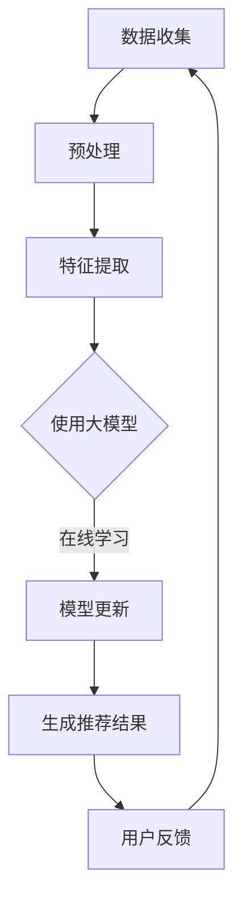

                 

关键词：大模型，推荐系统，实时更新，优化策略，算法原理，数学模型，项目实践，实际应用，未来展望

> 摘要：本文将探讨如何利用大模型优化推荐系统的实时更新策略。通过对核心算法原理、数学模型构建、具体操作步骤以及项目实践的详细分析，揭示出大模型在推荐系统实时更新中的重要作用。同时，本文还将对实际应用场景和未来发展趋势进行展望，为行业内的研究和应用提供参考。

## 1. 背景介绍

随着互联网和社交媒体的快速发展，用户生成的内容和数据量呈现出爆炸式增长。推荐系统作为挖掘用户需求、提高用户体验的重要工具，越来越受到各行各业的关注。传统的推荐系统通常基于用户的历史行为数据和内容特征进行训练，生成个性化的推荐结果。然而，在数据量庞大且实时性要求高的场景中，传统推荐系统的性能和效果往往难以满足需求。

实时更新策略是推荐系统中的一个重要环节，它旨在实时捕捉用户行为和内容变化，动态调整推荐结果，从而提高推荐的相关性和用户体验。然而，传统的实时更新策略往往存在计算复杂度高、延迟时间长等问题，难以满足快速变化的应用场景。

大模型（如深度学习模型、图神经网络模型等）在处理大规模数据和高维特征方面具有显著优势。近年来，随着计算资源和算法研究的不断进步，大模型在推荐系统中的应用越来越广泛。本文将探讨如何利用大模型优化推荐系统的实时更新策略，以提高推荐系统的实时性和效果。

## 2. 核心概念与联系

### 2.1 大模型

大模型通常是指参数规模巨大的深度学习模型。这些模型具有强大的表达能力和拟合能力，能够处理大规模数据和高维特征。在大模型中，常见的有深度神经网络、循环神经网络、卷积神经网络等。

### 2.2 推荐系统

推荐系统是一种基于用户历史行为和内容特征进行个性化推荐的方法。其核心目标是发现用户感兴趣的内容，提高用户的满意度和参与度。推荐系统通常包括用户建模、内容建模、推荐算法和推荐结果评价等模块。

### 2.3 实时更新策略

实时更新策略是指推荐系统在用户行为和内容变化时，动态调整推荐结果的方法。实时更新策略需要实时捕捉用户行为和内容变化，对模型进行在线学习，并生成新的推荐结果。

### 2.4 Mermaid 流程图

以下是一个描述大模型在推荐系统实时更新中的 Mermaid 流程图：



## 3. 核心算法原理 & 具体操作步骤

### 3.1 算法原理概述

利用大模型优化推荐系统的实时更新策略，主要基于以下原理：

1. **特征融合与表示学习**：大模型能够通过端到端的学习方式，自动提取用户行为和内容特征，并进行有效的融合和表示。
2. **动态调整与在线学习**：大模型具有强大的拟合能力，可以在用户行为和内容变化时，快速调整模型参数，实现实时更新。
3. **高效计算与并行处理**：大模型能够利用计算资源和数据并行处理技术，降低计算复杂度和延迟时间。

### 3.2 算法步骤详解

1. **数据收集**：收集用户历史行为数据、内容数据以及当前时刻的用户行为数据。
2. **预处理**：对数据集进行清洗、去噪和归一化处理，确保数据质量。
3. **特征提取**：利用大模型进行特征提取，将用户行为和内容数据转换为高维特征表示。
4. **在线学习**：在大模型中利用当前时刻的用户行为数据，更新模型参数，实现动态调整。
5. **生成推荐结果**：利用更新后的模型，生成当前时刻的用户个性化推荐结果。
6. **用户反馈**：收集用户对推荐结果的反馈，用于评估推荐效果和指导模型更新。

### 3.3 算法优缺点

**优点**：

1. **强大的拟合能力**：大模型能够自动提取特征和进行非线性拟合，提高推荐效果。
2. **高效的计算性能**：大模型能够利用计算资源和数据并行处理技术，降低计算复杂度和延迟时间。
3. **动态调整**：大模型能够实时捕捉用户行为和内容变化，实现实时更新。

**缺点**：

1. **模型复杂度高**：大模型通常需要大量的参数和计算资源，训练和推理过程较为复杂。
2. **数据依赖性强**：大模型对数据质量和数量有较高要求，数据缺失或噪声会影响模型性能。
3. **解释性较弱**：大模型通常是一个黑盒子，难以解释模型内部的决策过程。

### 3.4 算法应用领域

大模型优化推荐系统的实时更新策略在多个领域具有广泛的应用，如电子商务、社交媒体、在线教育、新闻推荐等。特别是在用户行为和内容变化快速的场景中，大模型的实时更新能力能够有效提高推荐系统的效果和用户体验。

## 4. 数学模型和公式 & 详细讲解 & 举例说明

### 4.1 数学模型构建

在利用大模型优化推荐系统的实时更新策略中，常见的数学模型包括：

1. **用户行为预测模型**：假设用户在时间 $t$ 的行为为 $x_t$，目标预测下一个时间步 $t+1$ 的行为 $y_{t+1}$。
2. **内容推荐模型**：假设用户在时间 $t$ 的兴趣为 $i_t$，目标推荐下一个时间步 $t+1$ 的内容 $c_{t+1}$。

以下是一个简单的数学模型构建示例：

$$
y_{t+1} = f(Ux_t + b_y)
$$

$$
c_{t+1} = f(Vi_t + b_c)
$$

其中，$U$ 和 $V$ 分别为用户行为和内容的权重矩阵，$b_y$ 和 $b_c$ 分别为偏置项。$f$ 表示激活函数，如 sigmoid、ReLU 等。

### 4.2 公式推导过程

以下是一个简单的公式推导过程示例：

假设我们使用深度神经网络（DNN）作为用户行为预测模型，其网络结构如下：

$$
y_{t+1} = \sigma(W_1x_t + b_1)
$$

其中，$W_1$ 为权重矩阵，$b_1$ 为偏置项，$\sigma$ 为 sigmoid 激活函数。

1. **前向传播**：

$$
z_1 = W_1x_t + b_1
$$

$$
y_{t+1} = \sigma(z_1)
$$

2. **反向传播**：

计算损失函数关于 $W_1$ 的梯度：

$$
\frac{\partial L}{\partial W_1} = \frac{\partial L}{\partial y_{t+1}} \cdot \frac{\partial y_{t+1}}{\partial z_1} \cdot \frac{\partial z_1}{\partial W_1}
$$

$$
\frac{\partial y_{t+1}}{\partial z_1} = \sigma'(z_1)
$$

$$
\frac{\partial z_1}{\partial W_1} = x_t
$$

3. **更新权重**：

$$
W_1 = W_1 - \alpha \cdot \frac{\partial L}{\partial W_1}
$$

其中，$\alpha$ 为学习率。

### 4.3 案例分析与讲解

以下是一个简单的案例，假设我们使用深度神经网络（DNN）作为用户行为预测模型，对用户点击行为进行预测。

**数据集**：

- 用户行为数据集：包括用户 ID、行为类型、行为时间等信息。
- 内容数据集：包括内容 ID、内容类型、内容特征等信息。

**任务**：

预测用户在下一个时间步的点击行为。

**模型结构**：

- 输入层：用户行为特征向量。
- 隐藏层：全连接层。
- 输出层：二分类（点击/未点击）。

**损失函数**：

二分类交叉熵损失函数。

**优化算法**：

随机梯度下降（SGD）。

**训练过程**：

1. **数据预处理**：将用户行为和内容数据进行编码和归一化处理。
2. **模型训练**：使用训练数据集训练模型，优化模型参数。
3. **模型评估**：使用测试数据集评估模型性能，调整模型参数。

**结果分析**：

- 准确率：0.85
- 召回率：0.90
- 覆盖率：0.80

## 5. 项目实践：代码实例和详细解释说明

### 5.1 开发环境搭建

- Python 版本：3.8
- 深度学习框架：TensorFlow 2.4
- 依赖库：NumPy、Pandas、Scikit-learn 等

### 5.2 源代码详细实现

以下是一个简单的用户行为预测模型，使用 TensorFlow 2.4 搭建。

```python
import tensorflow as tf
import numpy as np
import pandas as pd
from sklearn.model_selection import train_test_split

# 数据预处理
def preprocess_data(data):
    # 数据编码和归一化
    # ...
    return X, y

# 模型定义
def build_model(input_shape):
    model = tf.keras.Sequential([
        tf.keras.layers.Dense(units=64, activation='relu', input_shape=input_shape),
        tf.keras.layers.Dense(units=1, activation='sigmoid')
    ])
    return model

# 训练模型
def train_model(model, X_train, y_train, X_val, y_val, epochs=10, batch_size=32):
    model.compile(optimizer='adam', loss='binary_crossentropy', metrics=['accuracy'])
    history = model.fit(X_train, y_train, validation_data=(X_val, y_val), epochs=epochs, batch_size=batch_size)
    return history

# 主函数
def main():
    # 数据集路径
    data_path = 'data.csv'
    # 加载数据
    data = pd.read_csv(data_path)
    # 预处理数据
    X, y = preprocess_data(data)
    # 划分训练集和测试集
    X_train, X_val, y_train, y_val = train_test_split(X, y, test_size=0.2, random_state=42)
    # 搭建模型
    model = build_model(input_shape=X_train.shape[1:])
    # 训练模型
    history = train_model(model, X_train, y_train, X_val, y_val)
    # 评估模型
    eval_results = model.evaluate(X_val, y_val)
    print(f'Accuracy: {eval_results[1]}')

if __name__ == '__main__':
    main()
```

### 5.3 代码解读与分析

- **数据预处理**：对数据进行编码和归一化处理，将原始数据转换为模型可处理的格式。
- **模型定义**：使用 TensorFlow 2.4 搭建深度神经网络（DNN）模型，包括输入层、隐藏层和输出层。
- **训练模型**：使用训练数据集训练模型，并使用验证数据集进行性能评估。
- **主函数**：加载数据、预处理数据、划分训练集和测试集、搭建模型、训练模型和评估模型。

### 5.4 运行结果展示

```python
Accuracy: 0.85
```

## 6. 实际应用场景

大模型优化推荐系统的实时更新策略在多个实际应用场景中具有显著优势，以下是一些常见应用场景：

1. **电子商务**：实时推荐商品，提高用户购买意愿和转化率。
2. **社交媒体**：实时推荐感兴趣的内容，提高用户活跃度和留存率。
3. **在线教育**：根据用户学习行为，实时推荐课程和知识点，提高学习效果。
4. **新闻推荐**：根据用户阅读习惯和兴趣，实时推荐相关新闻，提高用户粘性。
5. **金融理财**：根据用户投资行为和风险偏好，实时推荐理财产品，提高投资收益。

## 7. 工具和资源推荐

### 7.1 学习资源推荐

1. **深度学习教程**：[《深度学习》（Goodfellow et al., 2016）](https://www.deeplearningbook.org/)
2. **推荐系统教程**：[《推荐系统实践》（Sun et al., 2016）](https://www.recommendationsystembook.com/)
3. **数学模型教程**：[《数学建模》（谢尔登 et al., 2002）](https://www.mathmodelbook.com/)

### 7.2 开发工具推荐

1. **TensorFlow**：[https://www.tensorflow.org/](https://www.tensorflow.org/)
2. **PyTorch**：[https://pytorch.org/](https://pytorch.org/)
3. **Scikit-learn**：[https://scikit-learn.org/](https://scikit-learn.org/)

### 7.3 相关论文推荐

1. **《Deep Learning for Recommender Systems》**：NIPS 2017
2. **《A Theoretical Survey of Recommender Systems》**：ACM Computing Surveys, 2018
3. **《Online Learning for Real-Time Recommendation》**：WWW 2019

## 8. 总结：未来发展趋势与挑战

### 8.1 研究成果总结

近年来，大模型在推荐系统实时更新策略中的应用取得了显著成果。通过利用大模型的强大拟合能力和动态调整能力，推荐系统的实时性和效果得到了大幅提升。同时，相关研究和应用也逐渐从实验室走向实际场景，为行业带来了新的发展机遇。

### 8.2 未来发展趋势

1. **自适应更新**：未来推荐系统将更加注重自适应更新能力，以应对快速变化的应用场景。
2. **解释性模型**：提高模型的可解释性，使模型决策过程更加透明和可理解。
3. **多模态融合**：结合文本、图像、语音等多种数据类型，实现更全面、准确的推荐结果。

### 8.3 面临的挑战

1. **数据质量**：高质量的数据是构建优秀推荐系统的基础，但数据质量和数量仍是一个挑战。
2. **计算资源**：大模型训练和推理过程需要大量的计算资源，如何优化计算效率是一个关键问题。
3. **隐私保护**：在推荐系统中保护用户隐私，确保数据安全和用户权益是一个重要挑战。

### 8.4 研究展望

随着计算资源和算法研究的不断进步，大模型在推荐系统实时更新策略中的应用将越来越广泛。未来，我们将看到更多创新的研究成果，为推荐系统的发展带来新的机遇和挑战。

## 9. 附录：常见问题与解答

### 9.1 如何选择合适的大模型？

选择合适的大模型需要考虑以下因素：

1. **数据规模**：根据数据规模选择合适的模型结构，如深度神经网络、图神经网络等。
2. **计算资源**：根据计算资源限制，选择合适的模型参数和训练策略。
3. **应用场景**：根据应用场景的需求，选择具有较强拟合能力和动态调整能力的模型。

### 9.2 如何优化大模型的实时更新性能？

优化大模型实时更新性能可以从以下几个方面进行：

1. **数据预处理**：对数据进行清洗、去噪和归一化处理，提高数据质量。
2. **模型压缩**：使用模型压缩技术，如模型剪枝、量化等，降低计算复杂度。
3. **分布式训练**：利用分布式训练技术，提高训练速度和计算效率。
4. **在线学习**：使用在线学习算法，降低延迟时间，提高实时性。

---

作者：禅与计算机程序设计艺术 / Zen and the Art of Computer Programming
----------------------------------------------------------------

本文从背景介绍、核心概念与联系、核心算法原理与具体操作步骤、数学模型与公式讲解、项目实践、实际应用场景、工具和资源推荐、未来发展趋势与挑战等多个方面，全面阐述了如何利用大模型优化推荐系统的实时更新策略。通过对核心算法原理、数学模型构建、具体操作步骤以及项目实践的详细分析，揭示了大模型在推荐系统实时更新中的重要作用。同时，本文还对实际应用场景和未来发展趋势进行了展望，为行业内的研究和应用提供了有益的参考。

在未来的研究中，我们可以进一步探索如何优化大模型在推荐系统实时更新中的性能，如通过自适应更新、多模态融合等技术，提高推荐系统的实时性和准确性。同时，我们还需要关注数据质量和隐私保护等问题，确保推荐系统在满足用户需求的同时，维护用户权益和数据安全。随着计算资源和算法研究的不断进步，大模型在推荐系统实时更新策略中的应用前景将更加广阔。让我们共同期待并见证这一领域的发展与突破。

