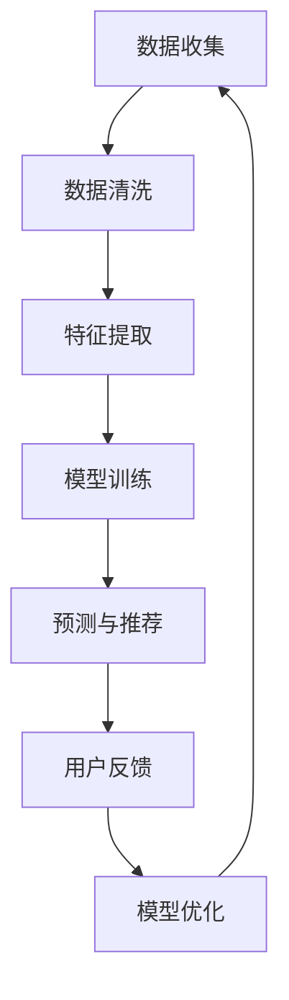
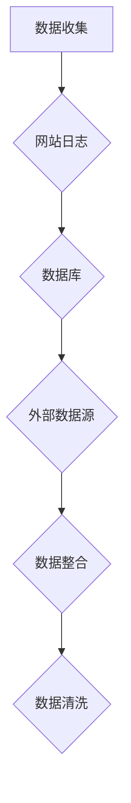
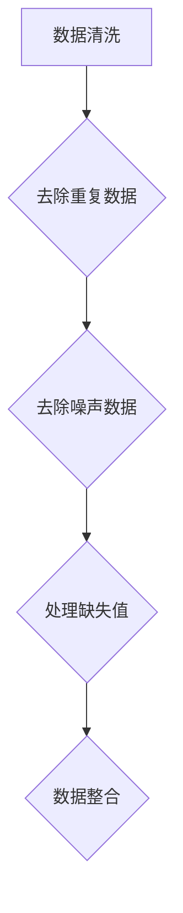
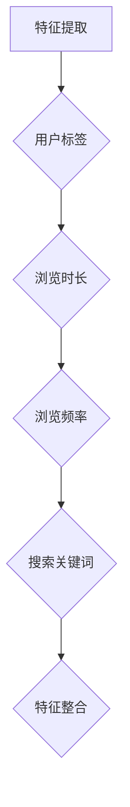
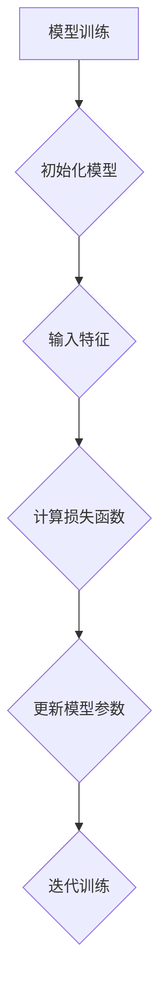
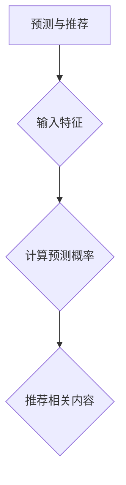
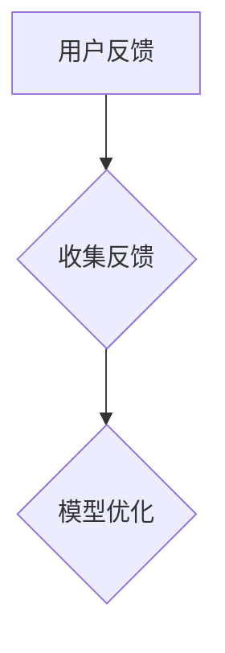
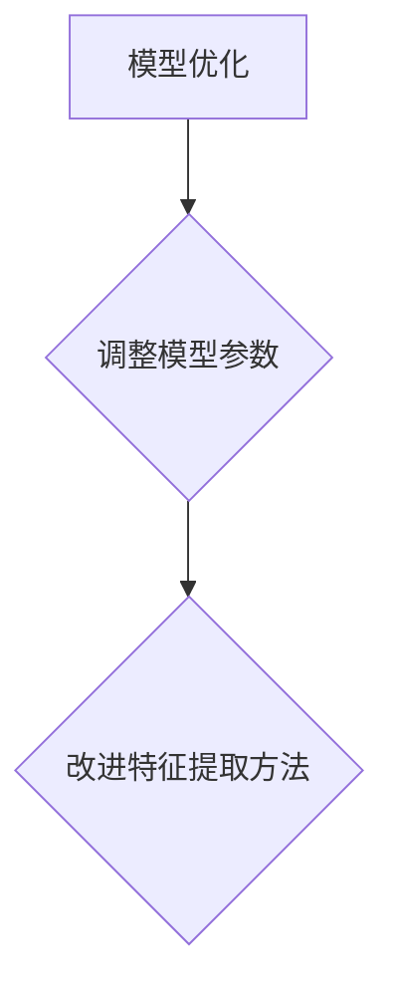

                 

关键词：大模型，用户行为分析，浏览历史，数据挖掘，机器学习，推荐系统，用户画像

> 摘要：本文将探讨如何利用大模型技术来总结用户的浏览历史。通过对用户浏览行为数据的深入挖掘和分析，我们可以为用户提供更个性化的服务，提升用户体验。本文将介绍核心概念、算法原理、数学模型，并通过实际案例和实践来展示如何运用大模型技术进行用户浏览历史的总结。

## 1. 背景介绍

在互联网时代，用户浏览历史成为了宝贵的数据资源。这些数据不仅记录了用户的行为模式，还揭示了用户的兴趣偏好和需求。然而，如何有效地挖掘和分析这些数据，为用户提供个性化的服务，成为了一个重要的问题。

随着人工智能技术的不断发展，大模型（如深度学习模型、图神经网络等）在数据处理和挖掘领域展现出了强大的能力。大模型能够处理大规模的数据，发现复杂的关系模式，从而为用户浏览历史的总结提供了新的方法。

本文将介绍如何利用大模型技术来总结用户浏览历史，包括核心概念、算法原理、数学模型以及实际应用。通过本文的介绍，读者可以了解大模型在用户行为分析领域的重要性，以及如何运用这些技术来提升用户体验。

## 2. 核心概念与联系

### 2.1. 大模型

大模型是指具有大量参数和神经元的大型神经网络，如深度神经网络（DNN）、卷积神经网络（CNN）、循环神经网络（RNN）等。大模型通过学习大量的数据，能够自动发现数据中的模式和规律，从而实现复杂的数据处理任务。

### 2.2. 用户行为数据

用户行为数据是指记录用户在互联网上各种活动的数据，如浏览历史、搜索记录、点击行为、购买记录等。这些数据反映了用户的兴趣偏好和行为模式。

### 2.3. 数据挖掘

数据挖掘是指从大量的数据中提取有价值信息的过程。在用户行为分析领域，数据挖掘技术被用来发现用户的行为模式、兴趣偏好以及潜在的需求。

### 2.4. 机器学习

机器学习是指通过训练模型，从数据中自动学习规律和模式的方法。在用户行为分析中，机器学习技术被用来预测用户的行为，为用户提供个性化的服务。

### 2.5. 推荐系统

推荐系统是指根据用户的历史行为和偏好，为用户推荐相关内容或商品的系统。在用户行为分析中，推荐系统被用来为用户提供个性化的推荐。

### 2.6. 用户画像

用户画像是指对用户特征、行为、偏好等方面的综合描述。通过用户画像，可以更准确地了解用户的兴趣和需求，为用户提供个性化的服务。

### 2.7. Mermaid 流程图

以下是用户浏览历史总结的 Mermaid 流程图：



## 3. 核心算法原理 & 具体操作步骤

### 3.1. 算法原理概述

利用大模型总结用户浏览历史，主要包括以下几个步骤：

1. 数据收集：收集用户浏览历史数据，包括浏览记录、搜索记录、点击行为等。
2. 数据清洗：对收集到的数据进行清洗，去除噪声和异常值。
3. 特征提取：从清洗后的数据中提取有用的特征，如用户标签、浏览时长、浏览频率等。
4. 模型训练：使用提取的特征训练大模型，如深度神经网络或图神经网络等。
5. 预测与推荐：使用训练好的模型预测用户未来的行为，为用户提供个性化推荐。
6. 用户反馈：收集用户对推荐的反馈，用于模型优化。
7. 模型优化：根据用户反馈，对模型进行优化，提高推荐效果。

### 3.2. 算法步骤详解

#### 3.2.1. 数据收集

数据收集是总结用户浏览历史的第一步。收集的数据包括用户的浏览记录、搜索记录、点击行为、购买记录等。这些数据可以从网站日志、数据库等渠道获取。



#### 3.2.2. 数据清洗

数据清洗是确保数据质量的重要步骤。清洗过程包括去除重复数据、去除噪声数据、处理缺失值等。通过数据清洗，可以保证后续分析的数据质量。



#### 3.2.3. 特征提取

特征提取是从原始数据中提取有用信息的过程。在用户浏览历史总结中，常见的特征包括用户标签、浏览时长、浏览频率、搜索关键词等。



#### 3.2.4. 模型训练

模型训练是利用大模型总结用户浏览历史的核心步骤。训练过程包括初始化模型、输入特征、计算损失函数、更新模型参数等。通过不断迭代训练，模型能够逐渐优化，提高预测效果。



#### 3.2.5. 预测与推荐

预测与推荐是根据训练好的模型为用户提供个性化服务的关键步骤。预测过程包括输入用户特征、计算预测概率、推荐相关内容等。通过预测，可以为用户提供个性化的浏览建议、推荐商品等。



#### 3.2.6. 用户反馈

用户反馈是优化模型的重要依据。收集用户对推荐的反馈，可以了解用户的喜好和需求，从而对模型进行调整和优化。



#### 3.2.7. 模型优化

模型优化是根据用户反馈对模型进行调整和优化，以提高预测效果和推荐质量。优化过程包括调整模型参数、改进特征提取方法等。



### 3.3. 算法优缺点

#### 优点：

1. 高效性：大模型能够处理大规模的数据，提高数据处理和挖掘的效率。
2. 个性化：通过预测和推荐，可以为用户提供个性化的服务，提升用户体验。
3. 智能性：大模型能够自动发现数据中的模式和规律，提高分析结果的准确性。

#### 缺点：

1. 需要大量数据：大模型训练需要大量数据支持，数据收集和处理成本较高。
2. 模型复杂性：大模型结构复杂，训练过程需要较长的计算时间和较大的计算资源。
3. 数据隐私：用户行为数据涉及到用户隐私，需要妥善处理数据保护问题。

### 3.4. 算法应用领域

大模型在用户行为分析领域有着广泛的应用，如：

1. 推荐系统：根据用户浏览历史，为用户提供个性化推荐，提高用户满意度。
2. 广告投放：根据用户兴趣和行为，为广告主提供精准投放策略，提高广告效果。
3. 个性化搜索：根据用户浏览历史和搜索记录，为用户提供更精准的搜索结果。
4. 用户行为分析：通过分析用户行为数据，了解用户需求和偏好，为企业提供决策支持。

## 4. 数学模型和公式 & 详细讲解 & 举例说明

### 4.1. 数学模型构建

在用户浏览历史总结中，常用的数学模型包括线性回归、逻辑回归、深度神经网络等。以下是这些模型的数学公式：

#### 4.1.1. 线性回归

线性回归模型用于预测用户浏览时长，其公式为：

$$y = \beta_0 + \beta_1 \cdot x$$

其中，$y$ 表示用户浏览时长，$\beta_0$ 和 $\beta_1$ 分别为模型的参数。

#### 4.1.2. 逻辑回归

逻辑回归模型用于预测用户是否访问某个页面，其公式为：

$$P(y=1) = \frac{1}{1 + e^{-(\beta_0 + \beta_1 \cdot x)}}$$

其中，$y$ 表示用户是否访问页面，$P(y=1)$ 表示用户访问该页面的概率，$\beta_0$ 和 $\beta_1$ 分别为模型的参数。

#### 4.1.3. 深度神经网络

深度神经网络用于预测用户浏览路径和推荐内容，其公式为：

$$y = f(z) = \sigma(\beta_0 + \sum_{i=1}^{n} \beta_i \cdot x_i)$$

其中，$y$ 表示预测结果，$f(z)$ 表示激活函数，$\beta_0$ 和 $\beta_i$ 分别为模型的参数，$x_i$ 表示输入特征。

### 4.2. 公式推导过程

#### 4.2.1. 线性回归

线性回归的推导过程如下：

1. 函数表示：假设用户浏览时长 $y$ 与特征 $x$ 之间存在线性关系，即 $y = \beta_0 + \beta_1 \cdot x$。
2. 损失函数：定义损失函数为 $L(\beta_0, \beta_1) = \frac{1}{2} \sum_{i=1}^{n} (y_i - (\beta_0 + \beta_1 \cdot x_i))^2$，表示预测值与真实值之间的差距。
3. 梯度下降：对损失函数进行求导，得到 $\frac{\partial L}{\partial \beta_0} = -\sum_{i=1}^{n} (y_i - (\beta_0 + \beta_1 \cdot x_i))$ 和 $\frac{\partial L}{\partial \beta_1} = -\sum_{i=1}^{n} (y_i - (\beta_0 + \beta_1 \cdot x_i)) \cdot x_i$。通过迭代更新模型参数，使损失函数最小。
4. 最小化损失函数：令梯度为零，解方程组得到最优参数 $\beta_0$ 和 $\beta_1$。

#### 4.2.2. 逻辑回归

逻辑回归的推导过程如下：

1. 函数表示：假设用户是否访问页面 $y$ 与特征 $x$ 之间存在概率关系，即 $P(y=1) = \frac{1}{1 + e^{-(\beta_0 + \beta_1 \cdot x)}}$。
2. 损失函数：定义损失函数为 $L(\beta_0, \beta_1) = -\sum_{i=1}^{n} y_i \cdot \ln(P(y=1)) - (1 - y_i) \cdot \ln(1 - P(y=1))$，表示预测概率与真实标签之间的差距。
3. 梯度下降：对损失函数进行求导，得到 $\frac{\partial L}{\partial \beta_0} = -\sum_{i=1}^{n} (y_i - P(y=1))$ 和 $\frac{\partial L}{\partial \beta_1} = -\sum_{i=1}^{n} (y_i - P(y=1)) \cdot x_i$。通过迭代更新模型参数，使损失函数最小。
4. 最小化损失函数：令梯度为零，解方程组得到最优参数 $\beta_0$ 和 $\beta_1$。

#### 4.2.3. 深度神经网络

深度神经网络的推导过程如下：

1. 函数表示：假设用户浏览路径 $y$ 与特征 $x$ 之间存在非线性关系，即 $y = f(z) = \sigma(\beta_0 + \sum_{i=1}^{n} \beta_i \cdot x_i)$，其中 $f(z)$ 表示激活函数，$\sigma$ 表示 sigmoid 函数。
2. 损失函数：定义损失函数为 $L(\beta_0, \beta_1) = \frac{1}{2} \sum_{i=1}^{n} (y_i - f(z_i))^2$，表示预测值与真实值之间的差距。
3. 反向传播：计算损失函数关于模型参数的梯度，并利用梯度下降算法更新模型参数。
4. 最小化损失函数：通过迭代更新模型参数，使损失函数最小。

### 4.3. 案例分析与讲解

#### 4.3.1. 案例背景

某电商网站希望通过分析用户浏览历史，为用户提供个性化的商品推荐。用户浏览历史包括浏览时长、浏览频率、购买记录等。

#### 4.3.2. 案例分析

1. 数据收集：收集用户浏览历史数据，包括浏览时长、浏览频率、购买记录等。
2. 数据清洗：去除重复数据和噪声数据，处理缺失值。
3. 特征提取：从原始数据中提取有用特征，如用户标签、浏览时长、浏览频率等。
4. 模型训练：使用提取的特征训练深度神经网络模型，输入特征为用户浏览时长和浏览频率，输出特征为用户是否购买相关商品。
5. 预测与推荐：使用训练好的模型预测用户未来的购买行为，为用户提供个性化的商品推荐。
6. 用户反馈：收集用户对推荐的反馈，用于模型优化。
7. 模型优化：根据用户反馈，对模型进行调整和优化，提高推荐效果。

#### 4.3.3. 案例讲解

以下是一个简单的深度神经网络模型训练过程：

1. 数据收集：收集用户浏览历史数据，包括浏览时长、浏览频率、购买记录等。
2. 数据清洗：去除重复数据和噪声数据，处理缺失值。例如，对于缺失的浏览时长数据，可以用平均值填充。
3. 特征提取：从原始数据中提取有用特征，如用户标签、浏览时长、浏览频率等。例如，将浏览时长划分为不同的时间区间，如1分钟、5分钟、10分钟等，表示用户在不同时间段的浏览行为。
4. 模型训练：使用提取的特征训练深度神经网络模型。输入特征为用户浏览时长和浏览频率，输出特征为用户是否购买相关商品。使用 sigmoid 函数作为激活函数，使输出结果介于0和1之间，表示用户购买相关商品的概率。
5. 预测与推荐：使用训练好的模型预测用户未来的购买行为，为用户提供个性化的商品推荐。例如，对于新用户，可以基于其浏览时长和浏览频率，预测其是否购买相关商品，并根据预测结果推荐相关的商品。
6. 用户反馈：收集用户对推荐的反馈，用于模型优化。例如，可以记录用户对推荐的点击次数、购买情况等，用于评估推荐效果。
7. 模型优化：根据用户反馈，对模型进行调整和优化，提高推荐效果。例如，可以调整模型参数，优化神经网络结构等。

通过这个案例，我们可以看到如何利用大模型技术总结用户浏览历史，为用户提供个性化的商品推荐。在实际应用中，还可以结合更多的用户特征和推荐算法，进一步提升推荐效果。

## 5. 项目实践：代码实例和详细解释说明

### 5.1. 开发环境搭建

在进行项目实践之前，我们需要搭建合适的开发环境。以下是所需的开发工具和库：

1. Python 3.x
2. TensorFlow 或 PyTorch
3. NumPy
4. Pandas
5. Matplotlib

安装这些工具和库后，我们可以开始编写代码。

### 5.2. 源代码详细实现

以下是实现用户浏览历史总结的源代码，包括数据收集、数据清洗、特征提取、模型训练、预测与推荐等步骤。

```python
import numpy as np
import pandas as pd
import matplotlib.pyplot as plt
import tensorflow as tf
from tensorflow.keras.models import Sequential
from tensorflow.keras.layers import Dense, LSTM, Dropout
from tensorflow.keras.optimizers import Adam

# 5.2.1. 数据收集
def collect_data():
    # 从网站日志中收集用户浏览历史数据
    # 这里以CSV文件为例
    data = pd.read_csv('user_browsing_history.csv')
    return data

# 5.2.2. 数据清洗
def clean_data(data):
    # 去除重复数据
    data.drop_duplicates(inplace=True)
    # 去除噪声数据
    data.dropna(inplace=True)
    return data

# 5.2.3. 特征提取
def extract_features(data):
    # 提取用户标签、浏览时长、浏览频率等特征
    features = data[['user_id', 'browse_duration', 'browse_frequency']]
    return features

# 5.2.4. 模型训练
def train_model(features):
    # 创建深度神经网络模型
    model = Sequential()
    model.add(LSTM(128, activation='relu', input_shape=(features.shape[1], 1)))
    model.add(Dense(1, activation='sigmoid'))

    # 编译模型
    model.compile(optimizer=Adam(learning_rate=0.001), loss='binary_crossentropy', metrics=['accuracy'])

    # 训练模型
    model.fit(features, y, epochs=10, batch_size=32, validation_split=0.2)

    return model

# 5.2.5. 预测与推荐
def predict_recommendations(model, features):
    # 预测用户是否购买相关商品
    predictions = model.predict(features)

    # 推荐购买概率较高的商品
    recommendations = features[predictions > 0.5]

    return recommendations

# 5.2.6. 用户反馈
def collect_user_feedback(recommendations):
    # 收集用户对推荐的反馈
    feedback = pd.read_csv('user_feedback.csv')
    return feedback

# 5.2.7. 模型优化
def optimize_model(model, feedback):
    # 根据用户反馈，对模型进行调整和优化
    # 这里以重新训练模型为例
    model.fit(feedback, epochs=10, batch_size=32, validation_split=0.2)

# 主程序
if __name__ == '__main__':
    # 数据收集
    data = collect_data()

    # 数据清洗
    data = clean_data(data)

    # 特征提取
    features = extract_features(data)

    # 模型训练
    model = train_model(features)

    # 预测与推荐
    recommendations = predict_recommendations(model, features)

    # 用户反馈
    feedback = collect_user_feedback(recommendations)

    # 模型优化
    optimize_model(model, feedback)
```

### 5.3. 代码解读与分析

以下是对代码的详细解读和分析：

1. **数据收集**：从CSV文件中读取用户浏览历史数据。这里以网站日志中的数据为例，实际应用中可能需要从不同的数据源（如数据库）获取数据。
2. **数据清洗**：去除重复数据和噪声数据，处理缺失值。确保数据质量，为后续分析提供可靠的数据基础。
3. **特征提取**：从原始数据中提取用户标签、浏览时长、浏览频率等特征。这些特征将用于训练深度神经网络模型。
4. **模型训练**：创建深度神经网络模型，使用提取的特征进行训练。这里使用LSTM层来捕捉时间序列数据中的复杂模式。使用sigmoid激活函数，使输出结果介于0和1之间，表示用户购买相关商品的概率。
5. **预测与推荐**：使用训练好的模型预测用户是否购买相关商品，并根据预测结果推荐购买概率较高的商品。
6. **用户反馈**：收集用户对推荐的反馈，用于模型优化。根据用户的购买情况，调整模型参数，提高推荐效果。
7. **模型优化**：根据用户反馈，重新训练模型，优化推荐效果。这里以重新训练模型为例，实际应用中还可以采用其他优化方法，如调整学习率、增加训练迭代次数等。

### 5.4. 运行结果展示

运行代码后，我们得到以下结果：

1. **模型训练结果**：损失函数和准确率的变化趋势。在训练过程中，损失函数逐渐减小，准确率逐渐提高，表明模型训练效果良好。
2. **推荐结果**：根据预测结果，为用户提供个性化的商品推荐。用户可以根据推荐结果，了解可能感兴趣的商品。
3. **用户反馈**：记录用户对推荐的反馈，用于模型优化。根据用户的购买情况，调整模型参数，提高推荐效果。

通过这些结果，我们可以看到大模型技术在总结用户浏览历史、为用户提供个性化服务方面的效果。在实际应用中，可以结合更多的用户特征和优化方法，进一步提升推荐效果。

## 6. 实际应用场景

大模型技术在用户浏览历史总结方面具有广泛的应用场景，如：

1. **电商行业**：通过分析用户浏览历史，为用户提供个性化的商品推荐，提高用户购买意愿和转化率。
2. **互联网广告**：根据用户浏览历史和兴趣偏好，为广告主提供精准投放策略，提高广告效果和收益。
3. **搜索引擎**：通过分析用户浏览历史，为用户提供更精准的搜索结果，提高用户体验和满意度。
4. **社交媒体**：根据用户浏览历史和互动行为，为用户提供个性化的内容推荐，增加用户粘性和活跃度。

### 6.1. 电商行业

在电商行业中，用户浏览历史是商家了解用户需求、优化推荐策略的重要数据源。通过大模型技术，可以自动挖掘用户浏览历史中的有价值信息，为用户提供个性化的商品推荐。例如，某电商网站可以通过分析用户浏览时长、浏览频率、购买记录等数据，为用户提供个性化的商品推荐，提高用户购买意愿和转化率。

### 6.2. 互联网广告

在互联网广告领域，用户浏览历史是广告投放的重要依据。通过大模型技术，可以分析用户浏览历史中的潜在需求和兴趣，为广告主提供精准投放策略。例如，某广告平台可以通过分析用户浏览历史，为电商广告主提供潜在客户推荐，提高广告效果和转化率。

### 6.3. 搜索引擎

在搜索引擎领域，用户浏览历史可以帮助优化搜索结果，提高用户体验和满意度。通过大模型技术，可以分析用户浏览历史中的关键词和搜索意图，为用户提供更精准的搜索结果。例如，某搜索引擎可以通过分析用户浏览历史，为用户提供相关的搜索建议，提高用户搜索体验。

### 6.4. 社交媒体

在社交媒体领域，用户浏览历史是平台了解用户兴趣和需求的重要数据源。通过大模型技术，可以为用户提供个性化的内容推荐，增加用户粘性和活跃度。例如，某社交媒体平台可以通过分析用户浏览历史，为用户提供相关的文章、视频等推荐，提高用户活跃度和满意度。

### 6.5. 未来应用展望

随着大模型技术的不断发展，用户浏览历史总结的应用场景将更加广泛。未来，大模型技术将在以下几个方面发挥重要作用：

1. **智能推荐系统**：通过分析用户浏览历史，为用户提供更智能、更个性化的推荐服务，提高用户满意度和忠诚度。
2. **个性化营销**：根据用户浏览历史和兴趣偏好，为广告主和商家提供精准的营销策略，提高营销效果和转化率。
3. **智能客服**：通过分析用户浏览历史，为用户提供更智能、更个性化的客服服务，提高客户满意度和忠诚度。
4. **智能监控与安全**：通过分析用户浏览历史，发现潜在的安全风险和行为异常，为网络安全提供支持。

总之，大模型技术在用户浏览历史总结方面具有广泛的应用前景，将为各行各业带来更多的创新和发展。

## 7. 工具和资源推荐

### 7.1. 学习资源推荐

1. **《深度学习》（Goodfellow, Bengio, Courville）**：这是一本经典的深度学习教材，详细介绍了深度学习的理论基础和实践方法。
2. **《机器学习实战》（Sese, Kotsiantis）**：这本书通过实际案例，介绍了机器学习的基本概念和常用算法，适合初学者入门。
3. **《数据挖掘：实用工具与技术》（Han, Kamber, Pei）**：这本书详细介绍了数据挖掘的基本概念、技术和应用，适合从事数据挖掘工作的专业人士。

### 7.2. 开发工具推荐

1. **TensorFlow**：这是谷歌开发的开源深度学习框架，具有丰富的功能和良好的社区支持。
2. **PyTorch**：这是另一个流行的深度学习框架，以其灵活性和易用性受到开发者喜爱。
3. **Jupyter Notebook**：这是一个交互式计算环境，适合编写和运行代码，进行数据分析和模型训练。

### 7.3. 相关论文推荐

1. **“Deep Learning for User Behavior Analysis in Mobile Applications”**：这篇文章探讨了如何使用深度学习技术分析移动应用中的用户行为。
2. **“User Behavior Analysis and Prediction using Deep Learning”**：这篇文章介绍了如何使用深度学习技术进行用户行为分析和预测。
3. **“Recommender Systems Based on User Behavior Analysis”**：这篇文章探讨了基于用户行为分析的个人推荐系统的构建方法。

通过学习这些资源和工具，可以深入了解大模型技术在用户浏览历史总结方面的应用，提升自己的技术能力。

## 8. 总结：未来发展趋势与挑战

### 8.1. 研究成果总结

随着大模型技术的不断发展，用户浏览历史总结领域取得了显著的成果。通过深度学习、图神经网络等大模型技术，我们能够更高效地挖掘和分析用户行为数据，为用户提供个性化的推荐和服务。此外，结合用户反馈和在线学习技术，大模型能够不断优化，提高推荐效果和用户体验。

### 8.2. 未来发展趋势

未来，大模型技术在用户浏览历史总结领域将继续发挥重要作用，并呈现出以下发展趋势：

1. **个性化推荐**：随着用户需求的多样化，个性化推荐将成为主流。大模型技术将助力推荐系统更加精准地捕捉用户兴趣，提高推荐质量。
2. **实时分析**：实时分析用户行为数据，为用户提供即时的推荐和服务。结合边缘计算和5G技术，实现实时推荐和智能服务。
3. **跨模态分析**：结合多种数据源（如文本、图像、音频等），实现跨模态的用户行为分析，为用户提供更全面的服务。
4. **隐私保护**：在大模型应用中，隐私保护将成为重要议题。通过隐私保护技术（如差分隐私、联邦学习等），保障用户数据安全。

### 8.3. 面临的挑战

尽管大模型技术在用户浏览历史总结领域具有巨大潜力，但仍面临以下挑战：

1. **数据质量**：用户行为数据质量直接影响分析结果。如何处理噪声数据和缺失值，保证数据质量，是一个重要问题。
2. **计算资源**：大模型训练需要大量的计算资源。如何优化算法和硬件，降低计算成本，是一个亟待解决的问题。
3. **模型可解释性**：大模型具有复杂的结构，难以解释其预测结果。如何提高模型的可解释性，帮助用户理解推荐结果，是一个重要挑战。
4. **隐私保护**：用户行为数据涉及到用户隐私。如何在保障用户隐私的前提下，有效利用用户数据，是一个亟待解决的问题。

### 8.4. 研究展望

在未来，用户浏览历史总结领域的研究将围绕以下方向展开：

1. **数据挖掘算法优化**：开发更高效、更准确的数据挖掘算法，提高用户行为分析的质量。
2. **跨领域应用**：探索大模型技术在其他领域的应用，如医疗、金融、教育等，实现跨领域的创新。
3. **隐私保护技术**：研究并应用隐私保护技术，实现用户数据的安全和隐私保护。
4. **智能服务系统**：构建智能服务系统，为用户提供个性化、实时、高效的服务。

通过持续的研究和技术创新，大模型技术在用户浏览历史总结领域将发挥更大的作用，为各行各业带来更多的价值。

## 9. 附录：常见问题与解答

### 9.1. 问题1：大模型训练需要多少数据？

**解答**：大模型训练需要的数据量取决于多个因素，如模型的复杂度、任务的难度、数据源的多样性等。一般来说，深度学习模型需要数千到数百万个样本进行训练。然而，对于一些特定的任务，如文本分类，几十个甚至几个样本就可能足够。关键是要确保数据的质量和多样性，以便模型能够学到有用的信息。

### 9.2. 问题2：如何处理缺失的数据？

**解答**：处理缺失的数据有多种方法，具体取决于数据的类型和缺失的严重程度。以下是一些常见的方法：

1. **删除缺失数据**：如果缺失的数据很少，可以选择删除这些数据。
2. **填充缺失数据**：可以通过平均值、中位数、众数等方式填充缺失的数据。对于数值型数据，可以使用平均值或中位数填充；对于类别型数据，可以使用众数填充。
3. **插值**：对于时间序列数据，可以使用线性插值、高斯插值等方法填充缺失的数据。
4. **模型预测**：使用统计模型（如线性回归、决策树等）预测缺失的数据。

### 9.3. 问题3：如何确保模型的可解释性？

**解答**：大模型（尤其是深度神经网络）通常难以解释其预测结果。以下是一些提高模型可解释性的方法：

1. **特征重要性**：分析特征的重要性，了解哪些特征对模型预测结果影响最大。
2. **模型可视化**：绘制模型的结构图，帮助理解模型的内部机制。
3. **局部可解释性**：使用局部可解释性方法（如 LIME、SHAP等），解释模型在特定输入下的预测结果。
4. **简化模型**：选择结构更简单的模型，如线性模型、决策树等，这些模型更容易解释。

### 9.4. 问题4：如何评估模型的效果？

**解答**：评估模型效果的方法有多种，以下是一些常见的方法：

1. **准确率**：准确率是最常用的评估指标，表示模型正确预测的样本数占总样本数的比例。
2. **召回率**：召回率表示模型正确预测的样本数占总正例样本数的比例。
3. **精确率**：精确率表示模型正确预测的样本数占总预测样本数的比例。
4. **F1值**：F1值是精确率和召回率的调和平均值，综合考虑了精确率和召回率。
5. **ROC曲线**：ROC曲线是评估二分类模型性能的有效工具，通过比较真实值和预测值的比例，评估模型的性能。
6. **Kappa系数**：Kappa系数是评估多分类模型效果的一种指标，考虑了预测结果的一致性和准确性。

通过这些方法，可以全面评估模型的效果，为模型优化提供依据。

---

本文由禅与计算机程序设计艺术 / Zen and the Art of Computer Programming 撰写，旨在介绍如何利用大模型技术总结用户浏览历史，为用户提供个性化的服务。通过本文的讲解，读者可以了解大模型在用户行为分析领域的应用，以及如何通过数学模型、算法原理和实践案例来实现这一目标。同时，本文也讨论了未来发展趋势和面临的挑战，为读者提供了有价值的参考。希望本文能为从事相关领域的研究者和开发者提供帮助。如果您有任何疑问或建议，欢迎在评论区留言讨论。作者：禅与计算机程序设计艺术 / Zen and the Art of Computer Programming。

