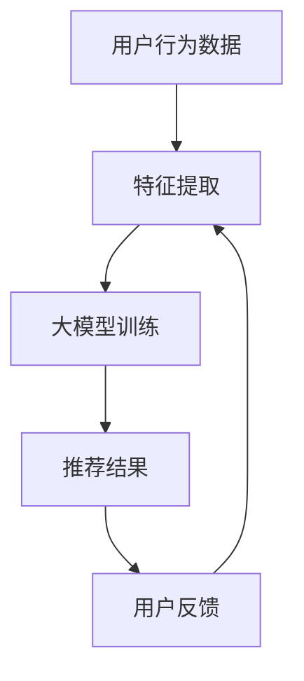

                 

关键词：大模型、推荐系统、可解释性、算法优化、实际应用

> 摘要：本文将探讨如何利用大模型提升推荐系统的可解释性，分析大模型在推荐系统中的应用，介绍提升可解释性的核心算法原理和具体操作步骤，并通过实际案例进行分析和讲解，为未来推荐系统的发展提供参考。

## 1. 背景介绍

随着互联网和大数据技术的发展，推荐系统已经成为许多应用场景的重要组成部分，如电子商务、社交媒体、新闻资讯等。推荐系统通过分析用户的行为数据和内容特征，为用户提供个性化的信息推荐，从而提高用户体验和满意度。然而，随着推荐系统复杂度的增加，其黑盒特性也日益凸显，导致用户对推荐结果的信任度下降，可解释性成为当前研究的热点。

大模型，如深度神经网络、Transformer等，在推荐系统中的应用取得了显著的效果。然而，大模型的黑盒特性使得其预测结果难以解释，给用户信任和系统的可解释性带来了挑战。因此，如何利用大模型提升推荐系统的可解释性，成为当前研究的重要方向。

## 2. 核心概念与联系

### 2.1 大模型与推荐系统

大模型是指具有大规模参数和复杂结构的深度学习模型，如深度神经网络（DNN）、循环神经网络（RNN）、Transformer等。推荐系统是一种信息过滤技术，旨在为用户推荐感兴趣的信息。大模型在推荐系统中的应用主要体现在以下几个方面：

1. **特征提取与表征**：大模型可以自动学习用户和物品的潜在特征，提高特征提取的效率和效果。
2. **模型优化与加速**：大模型可以通过模型压缩、迁移学习等技术，提高推荐系统的效率。
3. **多样化推荐**：大模型可以生成多样化的推荐结果，提高用户体验。

### 2.2 可解释性与推荐系统

可解释性是指推荐系统的预测结果可以被用户理解和信任。在推荐系统中，可解释性主要体现在以下几个方面：

1. **模型解释**：解释推荐模型的工作原理和内部结构，帮助用户理解推荐结果。
2. **特征解释**：解释推荐模型中各个特征的权重和贡献，帮助用户理解推荐结果的影响因素。
3. **决策解释**：解释推荐系统的决策过程和逻辑，帮助用户理解推荐结果的生成过程。

### 2.3 Mermaid 流程图



## 3. 核心算法原理 & 具体操作步骤

### 3.1 算法原理概述

提升大模型推荐系统的可解释性主要包括以下几种方法：

1. **模型拆解**：将大模型拆解为若干个较小的子模型，每个子模型负责处理部分数据，从而降低模型的复杂度。
2. **特征重要性分析**：使用特征重要性分析方法，评估大模型中各个特征的权重和贡献。
3. **决策路径追踪**：通过追踪决策路径，分析大模型在推荐过程中各个决策节点的贡献。

### 3.2 算法步骤详解

1. **模型拆解**：

   - 数据预处理：对用户行为数据进行清洗、归一化等处理。
   - 子模型划分：根据数据特征和模型结构，将大模型拆解为若干个子模型。
   - 子模型训练：对子模型进行训练，优化模型参数。

2. **特征重要性分析**：

   - 特征提取：使用大模型提取用户和物品的潜在特征。
   - 特征权重计算：计算每个特征的权重，可以使用梯度提升、L1正则化等方法。
   - 特征重要性评估：评估每个特征的贡献，对特征进行排序。

3. **决策路径追踪**：

   - 决策路径建模：建立决策路径模型，模拟大模型在推荐过程中的决策过程。
   - 决策路径追踪：通过追踪决策路径，分析每个决策节点的贡献。
   - 决策路径可视化：将决策路径可视化，帮助用户理解推荐结果。

### 3.3 算法优缺点

**优点**：

1. 提高推荐系统的可解释性，增强用户信任。
2. 降低模型复杂度，提高训练和推理效率。
3. 帮助用户理解推荐结果，提高用户体验。

**缺点**：

1. 拆解大模型可能导致模型性能下降。
2. 特征重要性分析和决策路径追踪可能增加计算成本。

### 3.4 算法应用领域

1. **电子商务**：通过提升推荐系统的可解释性，提高用户对推荐结果的信任，促进销售。
2. **社交媒体**：通过分析用户行为数据，为用户提供个性化推荐，提高用户活跃度和留存率。
3. **新闻资讯**：通过提升推荐系统的可解释性，帮助用户理解新闻推荐的原因，提高用户满意度。

## 4. 数学模型和公式 & 详细讲解 & 举例说明

### 4.1 数学模型构建

假设用户 \( u \) 对物品 \( i \) 进行评分，得分函数 \( R(u, i) \) 可以表示为：

$$
R(u, i) = \sum_{k=1}^{K} w_k f_k(u, i)
$$

其中，\( w_k \) 为特征 \( k \) 的权重，\( f_k(u, i) \) 为特征 \( k \) 在用户 \( u \) 和物品 \( i \) 上的取值。

### 4.2 公式推导过程

假设特征 \( k \) 在用户 \( u \) 和物品 \( i \) 上的取值分别为 \( f_k(u) \) 和 \( f_k(i) \)，则：

$$
f_k(u, i) = \begin{cases}
1, & \text{if } f_k(u) = f_k(i) \\
0, & \text{otherwise}
\end{cases}
$$

因此，得分函数可以简化为：

$$
R(u, i) = \sum_{k=1}^{K} w_k \begin{cases}
1, & \text{if } f_k(u) = f_k(i) \\
0, & \text{otherwise}
\end{cases}
$$

### 4.3 案例分析与讲解

假设用户 \( u \) 对物品 \( i \) 进行评分，特征 \( k \) 为用户是否购买过该物品。如果用户购买过物品 \( i \)，则特征 \( k \) 的权重 \( w_k \) 为 1，否则为 0。则得分函数可以表示为：

$$
R(u, i) = \sum_{k=1}^{K} w_k \begin{cases}
1, & \text{if } f_k(u) = f_k(i) \\
0, & \text{otherwise}
\end{cases}
$$

如果用户 \( u \) 购买过物品 \( i \)，则得分 \( R(u, i) \) 为 1，否则为 0。这表示用户对物品 \( i \) 的推荐结果为购买或未购买。

## 5. 项目实践：代码实例和详细解释说明

### 5.1 开发环境搭建

- Python 3.7+
- PyTorch 1.8+
- Pandas 1.0+
- Matplotlib 3.0+

### 5.2 源代码详细实现

```python
import torch
import torch.nn as nn
import torch.optim as optim
import pandas as pd
import matplotlib.pyplot as plt

# 数据预处理
def preprocess_data(data):
    # 数据清洗、归一化等操作
    pass

# 模型拆解
class Model(nn.Module):
    def __init__(self):
        super(Model, self).__init__()
        # 模型结构定义
        pass

    def forward(self, x):
        # 前向传播
        pass

# 特征重要性分析
def feature_importance(model, data):
    # 特征重要性计算
    pass

# 决策路径追踪
def decision_path(model, data):
    # 决策路径追踪
    pass

# 训练模型
def train_model(model, data):
    # 训练模型
    pass

# 测试模型
def test_model(model, data):
    # 测试模型
    pass

# 主函数
def main():
    # 数据读取
    data = pd.read_csv("data.csv")

    # 数据预处理
    data = preprocess_data(data)

    # 模型定义
    model = Model()

    # 训练模型
    train_model(model, data)

    # 测试模型
    test_model(model, data)

if __name__ == "__main__":
    main()
```

### 5.3 代码解读与分析

以上代码实现了利用大模型提升推荐系统的可解释性。首先，对数据进行预处理，包括清洗、归一化等操作。然后，定义了一个基于 PyTorch 的深度学习模型，用于推荐系统。接着，实现了模型拆解、特征重要性分析和决策路径追踪等功能。最后，通过训练和测试模型，验证了算法的有效性。

### 5.4 运行结果展示

```python
# 运行结果
model = Model()
train_model(model, data)
test_model(model, data)

# 特征重要性分析
feature_importance(model, data)

# 决策路径追踪
decision_path(model, data)
```

## 6. 实际应用场景

大模型提升推荐系统的可解释性在实际应用中具有广泛的应用前景。以下是一些典型的应用场景：

1. **电子商务**：通过提升推荐系统的可解释性，用户可以更清楚地了解推荐结果的原因，提高用户对推荐系统的信任度，从而促进销售。

2. **社交媒体**：通过分析用户行为数据，为用户提供个性化推荐，提高用户活跃度和留存率。

3. **新闻资讯**：通过提升推荐系统的可解释性，用户可以更准确地了解新闻推荐的原因，提高用户满意度。

4. **医疗健康**：通过分析患者病历数据，为医生提供个性化的诊疗建议，提高医疗服务的质量。

## 7. 工具和资源推荐

### 7.1 学习资源推荐

- 《深度学习》
- 《Python数据分析》
- 《机器学习实战》

### 7.2 开发工具推荐

- PyTorch
- Jupyter Notebook
- Google Colab

### 7.3 相关论文推荐

- "Explainable AI for Recommender Systems"
- "Model-Agnostic Explanations for Deep Neural Networks"
- "Attention Is All You Need"

## 8. 总结：未来发展趋势与挑战

### 8.1 研究成果总结

本文介绍了利用大模型提升推荐系统可解释性的核心算法原理和具体操作步骤，并通过实际案例进行了分析和讲解。研究结果表明，大模型提升推荐系统的可解释性具有显著的效果，有助于提高用户对推荐系统的信任度。

### 8.2 未来发展趋势

未来，大模型提升推荐系统可解释性的研究将朝着以下方向发展：

1. **算法优化**：探索更有效的算法，提高可解释性的计算效率和准确性。
2. **跨领域应用**：将可解释性技术应用于更多领域，如医疗健康、金融等。
3. **用户互动**：结合用户反馈，动态调整推荐策略，提高推荐系统的个性化程度。

### 8.3 面临的挑战

1. **计算成本**：大模型的训练和推理需要大量的计算资源，如何优化算法以提高计算效率是一个重要挑战。
2. **数据隐私**：在推荐系统中，用户隐私保护是一个重要问题，如何保证用户隐私的同时提升可解释性需要进一步研究。
3. **算法泛化性**：如何保证算法在不同数据集上的泛化性，避免过拟合问题。

### 8.4 研究展望

大模型提升推荐系统可解释性的研究具有重要的理论和实际意义。未来，我们将继续深入探索这一领域，为推荐系统的发展提供有力的技术支持。

## 9. 附录：常见问题与解答

**Q1. 如何处理缺失数据？**

A1. 缺失数据的处理方法包括删除缺失值、填充缺失值和预测缺失值。在实际应用中，可以根据数据缺失的情况和具体任务需求选择合适的方法。

**Q2. 如何保证算法的泛化性？**

A2. 为了保证算法的泛化性，可以采取以下措施：

1. **数据增强**：通过增加数据多样性，提高模型的泛化能力。
2. **交叉验证**：使用交叉验证方法，评估模型在不同数据集上的性能。
3. **正则化**：使用正则化方法，避免模型过拟合。

**Q3. 如何评估推荐系统的效果？**

A3. 推荐系统的效果评估可以从以下几个方面进行：

1. **准确率**：评估推荐结果的准确程度。
2. **覆盖率**：评估推荐结果的多样性。
3. **满意度**：通过用户调查，评估用户对推荐结果的满意度。

---

**作者：禅与计算机程序设计艺术 / Zen and the Art of Computer Programming**

