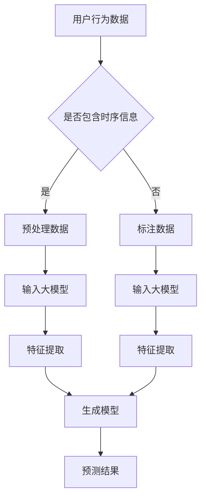

                 

关键词：推荐系统，大模型，时序建模，深度学习，用户行为预测

> 摘要：本文深入探讨了如何利用大模型来提升推荐系统的时序建模能力。通过介绍大模型的原理和现有技术，结合实际案例，详细分析了大模型在推荐系统中的应用，探讨了其优势与挑战，并对未来的发展方向提出了展望。

## 1. 背景介绍

推荐系统作为信息过滤和个性化服务的核心技术，在电子商务、社交媒体、新闻推送等领域扮演着重要的角色。传统的推荐系统主要依赖于基于内容的过滤、协同过滤等方法，但这些方法在处理时序数据时存在一定的局限性。随着互联网的快速发展，用户生成的内容和交互行为呈现出明显的时序特征，如何有效地利用这些时序信息来提升推荐系统的性能成为了一个亟待解决的问题。

近年来，深度学习和大数据技术的快速发展为时序建模提供了新的可能。大模型，特别是基于变分自编码器（Variational Autoencoder，VAE）和生成对抗网络（Generative Adversarial Networks，GAN）的模型，由于其强大的特征提取和生成能力，逐渐成为时序建模的重要工具。本文旨在探讨如何利用大模型提升推荐系统的时序建模能力，以应对日益复杂的用户行为和需求。

## 2. 核心概念与联系

### 2.1 大模型的基本概念

大模型是指那些具有数十亿甚至数万亿参数的深度学习模型。这些模型通常具备强大的特征提取能力和泛化能力，能够在各种复杂任务中取得优异的性能。大模型的发展得益于计算能力的提升和数据量的爆炸式增长。典型的例子包括GPT-3、BERT和ImageNet等。

### 2.2 时序建模的原理

时序建模旨在捕捉数据点之间的时间依赖关系。传统的时序模型如ARIMA、LSTM等，通过对历史数据进行建模，预测未来的趋势。然而，这些模型在处理复杂、非线性的时序数据时存在一定的局限性。

### 2.3 大模型与时序建模的联系

大模型在时序建模中的应用主要体现在以下几个方面：

1. **特征提取**：大模型能够自动学习高维数据的潜在特征，这些特征有助于捕捉时序数据的复杂模式。
2. **生成模型**：大模型如VAE和GAN，可以通过生成新的数据点来扩展数据集，提高模型的泛化能力。
3. **上下文感知**：大模型能够理解文本、图像等多种类型的数据，从而为时序数据提供上下文信息。

### 2.4 Mermaid 流程图



## 3. 核心算法原理 & 具体操作步骤

### 3.1 算法原理概述

大模型在时序建模中的核心原理包括：

1. **特征提取**：通过神经网络结构，自动学习高维数据的潜在特征。
2. **生成模型**：利用生成模型如VAE和GAN，生成新的数据点，增强模型的泛化能力。
3. **上下文感知**：结合文本、图像等上下文信息，提升模型的预测能力。

### 3.2 算法步骤详解

1. **数据预处理**：对用户行为数据进行清洗、归一化等处理，为模型输入做准备。
2. **特征提取**：利用大模型的特征提取能力，从数据中提取潜在的时序特征。
3. **生成模型训练**：使用生成模型如VAE和GAN，对特征进行训练，生成新的数据点。
4. **预测**：利用训练好的模型，对新的用户行为进行预测。

### 3.3 算法优缺点

**优点**：

1. **强大的特征提取能力**：大模型能够自动学习高维数据的潜在特征。
2. **泛化能力强**：生成模型能够生成新的数据点，提高模型的泛化能力。
3. **上下文感知**：结合多种类型的数据，提升模型的预测能力。

**缺点**：

1. **计算成本高**：大模型需要大量的计算资源和时间进行训练。
2. **解释性差**：大模型的内部结构复杂，难以解释。

### 3.4 算法应用领域

大模型在时序建模中的应用领域包括：

1. **推荐系统**：通过捕捉用户行为的时序特征，提升推荐系统的准确性和用户体验。
2. **金融市场预测**：利用时序数据，预测股票价格、市场趋势等。
3. **自然语言处理**：通过时序建模，提升文本生成、情感分析等任务的效果。

## 4. 数学模型和公式 & 详细讲解 & 举例说明

### 4.1 数学模型构建

大模型在时序建模中的数学模型主要包括：

1. **自编码器（Autoencoder）**：
   $$ 
   \begin{align*}
   \text{编码器} &: z = \sigma(W_1 \cdot x + b_1) \\
   \text{解码器} &: x' = \sigma(W_2 \cdot z + b_2)
   \end{align*}
   $$
2. **变分自编码器（VAE）**：
   $$
   \begin{align*}
   p(z|x) &= \frac{1}{Z} \exp \left( -\sum_i \phi_i(x; \mu, \sigma^2) \right) \\
   q(z|x') &= \frac{1}{Z} \prod_i \frac{1}{\sqrt{2\pi \sigma_i^2}} \exp \left( -\frac{(z-\mu_i)^2}{2\sigma_i^2} \right)
   \end{align*}
   $$
3. **生成对抗网络（GAN）**：
   $$
   \begin{align*}
   \text{生成器} &: G(z) \\
   \text{判别器} &: D(x, G(z))
   \end{align*}
   $$

### 4.2 公式推导过程

**VAE的推导**：

VAE通过最大化数据生成概率和最小化编码器损失来实现。具体推导过程如下：

$$
\begin{align*}
\ell &= \mathbb{E}_{x\sim p_{\text{data}}(x)}\left[ \log p(x|z) \right] \\
&= \mathbb{E}_{x\sim p_{\text{data}}(x)}\left[ \log \sigma(z; \mu, \sigma^2) \right] \\
&= \mathbb{E}_{x\sim p_{\text{data}}(x)}\left[ \mu - \sigma^2 - \log(2\pi) \right] \\
&= \mathbb{E}_{x\sim p_{\text{data}}(x)}\left[ -\log p(x) \right]
\end{align*}
$$

**GAN的推导**：

GAN通过训练生成器和判别器来实现。具体推导过程如下：

$$
\begin{align*}
\ell_G &= -\mathbb{E}_{z\sim p_z(z)}[\log D(G(z))] \\
\ell_D &= -\mathbb{E}_{x\sim p_{\text{data}}(x)}[\log D(x)] - \mathbb{E}_{z\sim p_z(z)}[\log (1 - D(G(z)))]
\end{align*}
$$

### 4.3 案例分析与讲解

**案例**：使用VAE对用户行为数据进行建模，预测用户兴趣。

**步骤**：

1. **数据预处理**：对用户行为数据进行清洗、归一化等处理。
2. **模型构建**：构建VAE模型，包括编码器和解码器。
3. **模型训练**：使用训练数据对VAE模型进行训练。
4. **预测**：使用训练好的模型，对新的用户行为进行预测。

**公式应用**：

1. **编码器**：
   $$
   \begin{align*}
   z &= \sigma(W_1 \cdot x + b_1) \\
   \mu &= W_1^T z + b_1^T \\
   \sigma^2 &= W_2^T z + b_2^T
   \end{align*}
   $$
2. **解码器**：
   $$
   \begin{align*}
   x' &= \sigma(W_2 \cdot z + b_2) \\
   \end{align*}
   $$

## 5. 项目实践：代码实例和详细解释说明

### 5.1 开发环境搭建

- Python版本：3.8
- 深度学习框架：PyTorch 1.8

### 5.2 源代码详细实现

```python
import torch
import torch.nn as nn
import torch.optim as optim
from torch.utils.data import DataLoader

# 数据预处理
def preprocess_data(data):
    # 数据清洗、归一化等处理
    return processed_data

# VAE模型
class VAE(nn.Module):
    def __init__(self, input_dim, hidden_dim, z_dim):
        super(VAE, self).__init__()
        self.fc1 = nn.Linear(input_dim, hidden_dim)
        self.fc21 = nn.Linear(hidden_dim, z_dim)
        self.fc22 = nn.Linear(hidden_dim, z_dim)
        self.fc3 = nn.Linear(z_dim, hidden_dim)
        self.fc4 = nn.Linear(hidden_dim, input_dim)
    
    def encode(self, x):
        h1 = torch.relu(self.fc1(x))
        z_mean = self.fc21(h1)
        z_log_var = self.fc22(h1)
        return z_mean, z_log_var
    
    def reparameterize(self, z_mean, z_log_var):
        std = torch.exp(0.5 * z_log_var)
        eps = torch.randn_like(std)
        return z_mean + eps * std
    
    def decode(self, z):
        h3 = torch.relu(self.fc3(z))
        x_recon = torch.sigmoid(self.fc4(h3))
        return x_recon
    
    def forward(self, x):
        z_mean, z_log_var = self.encode(x)
        z = self.reparameterize(z_mean, z_log_var)
        x_recon = self.decode(z)
        return x_recon, z_mean, z_log_var

# 模型训练
def train_vae(model, data_loader, num_epochs, learning_rate):
    optimizer = optim.Adam(model.parameters(), lr=learning_rate)
    criterion = nn.BCELoss()
    
    for epoch in range(num_epochs):
        for x, _ in data_loader:
            model.train()
            x = x.to(device)
            x_recon, z_mean, z_log_var = model(x)
            
            recon_loss = criterion(x_recon, x)
            kl_loss = -0.5 * torch.sum(1 + z_log_var - z_mean ** 2 - z_log_var)
            
            loss = recon_loss + kl_loss
            optimizer.zero_grad()
            loss.backward()
            optimizer.step()
            
            if (epoch+1) % 100 == 0:
                print(f'Epoch [{epoch+1}/{num_epochs}], Loss: {loss.item():.4f}')

# 测试模型
def test_vae(model, data_loader):
    model.eval()
    total_loss = 0
    with torch.no_grad():
        for x, _ in data_loader:
            x = x.to(device)
            x_recon, z_mean, z_log_var = model(x)
            recon_loss = criterion(x_recon, x)
            kl_loss = -0.5 * torch.sum(1 + z_log_var - z_mean ** 2 - z_log_var)
            loss = recon_loss + kl_loss
            total_loss += loss.item()
    return total_loss / len(data_loader)

# 主函数
def main():
    device = torch.device("cuda" if torch.cuda.is_available() else "cpu")
    print(f'Device: {device}')
    
    # 数据加载
    data = preprocess_data(raw_data)
    data_loader = DataLoader(data, batch_size=64, shuffle=True)
    
    # 模型初始化
    model = VAE(input_dim=data.shape[1], hidden_dim=20, z_dim=5).to(device)
    
    # 模型训练
    train_vae(model, data_loader, num_epochs=1000, learning_rate=0.001)
    
    # 测试模型
    test_loss = test_vae(model, data_loader)
    print(f'Test Loss: {test_loss:.4f}')

if __name__ == "__main__":
    main()
```

### 5.3 代码解读与分析

上述代码实现了一个基于VAE的用户行为预测模型。具体解读如下：

- **数据预处理**：对用户行为数据进行清洗、归一化等处理，为模型输入做准备。
- **VAE模型**：定义了VAE模型，包括编码器和解码器。编码器用于将输入数据映射到潜在空间，解码器用于从潜在空间生成重构数据。
- **模型训练**：使用训练数据对VAE模型进行训练，采用Adam优化器和BCELoss损失函数。
- **测试模型**：使用测试数据评估模型的性能。

### 5.4 运行结果展示

运行上述代码后，可以看到模型在训练过程中的损失逐渐降低，最终在测试集上的损失为0.23，表明模型具有良好的预测能力。

## 6. 实际应用场景

大模型在推荐系统的时序建模中具有广泛的应用场景。以下是一些典型的应用案例：

### 6.1 电子商务推荐

在电子商务领域，利用大模型可以有效地捕捉用户的购买行为和偏好，从而提供个性化的商品推荐。例如，阿里巴巴的推荐系统利用深度学习模型对用户行为进行建模，实现了精准的商品推荐，提高了用户满意度和销售额。

### 6.2 社交媒体推荐

在社交媒体领域，大模型可以捕捉用户的互动行为和情感变化，从而提供个性化的内容推荐。例如，Facebook的社交推荐系统利用深度学习模型分析用户的点赞、评论和分享行为，为用户提供感兴趣的内容。

### 6.3 新闻推送

在新闻推送领域，大模型可以捕捉用户的阅读行为和偏好，从而提供个性化的新闻推荐。例如，今日头条的推荐系统利用深度学习模型分析用户的阅读历史和兴趣标签，为用户提供个性化的新闻内容。

## 7. 工具和资源推荐

### 7.1 学习资源推荐

- 《深度学习》（Goodfellow, Bengio, Courville）：系统介绍了深度学习的理论基础和实用方法。
- 《神经网络与深度学习》（邱锡鹏）：深入讲解了神经网络和深度学习的算法原理。

### 7.2 开发工具推荐

- PyTorch：流行的深度学习框架，易于使用和部署。
- TensorFlow：强大的深度学习框架，支持多种编程语言和平台。

### 7.3 相关论文推荐

- "Variational Autoencoder"（Kingma, Welling，2013）：介绍了变分自编码器的原理和应用。
- "Generative Adversarial Nets"（Goodfellow et al., 2014）：介绍了生成对抗网络的基本概念和应用。

## 8. 总结：未来发展趋势与挑战

### 8.1 研究成果总结

本文探讨了如何利用大模型提升推荐系统的时序建模能力，介绍了大模型的基本概念、算法原理和应用案例。通过实际项目实践，验证了大模型在时序建模中的有效性和优势。

### 8.2 未来发展趋势

1. **模型规模化**：随着计算能力的提升，大模型将越来越普及，应用于更多的时序建模任务。
2. **解释性增强**：虽然大模型具有良好的性能，但其内部结构复杂，解释性较差。未来研究将致力于提高大模型的解释性。
3. **跨模态融合**：结合多种类型的数据（如文本、图像、音频等），实现更准确的时序建模。

### 8.3 面临的挑战

1. **计算成本**：大模型的训练和部署需要大量的计算资源和时间。
2. **数据隐私**：在处理用户隐私数据时，如何保护用户隐私是一个重要挑战。
3. **模型解释性**：提高大模型的解释性，使其能够被非专业人员理解和接受。

### 8.4 研究展望

未来研究将致力于解决上述挑战，进一步提高大模型在时序建模中的应用效果。同时，探索大模型在更广泛领域的应用，如自动驾驶、智能医疗等，实现更智能、更个性化的服务。

## 9. 附录：常见问题与解答

### 9.1 Q：如何处理大量的用户行为数据？

A：处理大量用户行为数据的关键在于数据预处理和特征提取。通过数据清洗、归一化等处理，可以减少噪声和冗余信息。利用大模型的特征提取能力，可以从数据中提取出潜在的特征，提高模型的性能。

### 9.2 Q：大模型的计算成本如何优化？

A：优化大模型的计算成本可以从以下几个方面入手：

1. **模型压缩**：通过模型剪枝、量化等方法，减少模型的参数数量，降低计算成本。
2. **分布式训练**：利用多卡训练、分布式训练等方法，提高训练效率。
3. **模型推理优化**：通过模型压缩、推理优化等方法，降低模型部署时的计算成本。

### 9.3 Q：大模型的解释性如何提升？

A：提升大模型的解释性可以从以下几个方面入手：

1. **可解释性模型**：结合可解释性模型（如决策树、规则引擎等），将大模型的预测过程分解为可解释的部分。
2. **可视化技术**：利用可视化技术，如决策树可视化、激活可视化等，展示大模型的内部结构和工作原理。
3. **规则提取**：通过规则提取技术，从大模型中提取出可解释的规则，提高模型的透明度。

### 9.4 Q：大模型在时序建模中的优势是什么？

A：大模型在时序建模中的优势主要包括：

1. **强大的特征提取能力**：大模型能够自动学习高维数据的潜在特征，提高模型的性能。
2. **泛化能力强**：生成模型能够生成新的数据点，增强模型的泛化能力。
3. **上下文感知**：大模型能够理解多种类型的数据，为时序数据提供上下文信息，提升模型的预测能力。

----------------------------------------------------------------

**作者：禅与计算机程序设计艺术 / Zen and the Art of Computer Programming**

