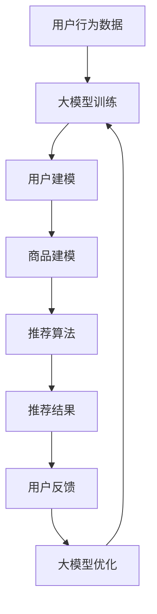

                 

关键词：大模型，推荐系统，实时反馈，机器学习，深度学习，算法优化

## 摘要

本文主要探讨如何利用大模型（如GPT-3、BERT等）来改进推荐系统的实时反馈处理能力。随着互联网的快速发展，推荐系统已经成为人们日常生活中不可或缺的一部分。然而，传统的推荐系统在面对海量数据和实时反馈时，往往存在延迟和准确率的问题。本文通过介绍大模型的基本原理，分析其在推荐系统中的应用，提出一种基于大模型的实时反馈处理框架，并详细讨论了其算法原理、数学模型、项目实践和未来展望。通过本文的研究，希望能为推荐系统的实时反馈处理提供新的思路和方法。

## 1. 背景介绍

推荐系统是一种基于用户历史行为和兴趣偏好，为用户推荐相关内容或商品的系统。其核心目标是通过个性化推荐，提高用户满意度和系统转化率。随着互联网的快速发展，推荐系统已经被广泛应用于电子商务、社交媒体、新闻资讯、在线视频等众多领域。

然而，推荐系统在实际应用中面临许多挑战。首先，推荐系统需要处理海量数据，包括用户行为数据、商品信息数据等。这些数据量巨大且不断增长，给数据处理和存储带来了巨大压力。其次，推荐系统需要实时响应用户的反馈，以不断优化推荐结果。然而，传统的推荐系统往往存在延迟和准确率的问题，无法满足实时性的要求。

为了解决这些问题，近年来，大模型（如GPT-3、BERT等）在自然语言处理领域取得了显著成果。大模型具有强大的表示能力和泛化能力，可以处理复杂的语义信息，为推荐系统提供了新的思路。本文将探讨如何利用大模型来改进推荐系统的实时反馈处理能力，提高推荐系统的准确性和实时性。

## 2. 核心概念与联系

### 2.1 大模型

大模型是指参数规模达到数十亿甚至千亿级别的人工神经网络。这些模型具有强大的表示能力和泛化能力，可以处理复杂的语义信息。目前，大模型在自然语言处理、计算机视觉、语音识别等领域取得了显著成果。代表性的大模型包括GPT-3、BERT、T5等。

### 2.2 推荐系统

推荐系统是一种基于用户历史行为和兴趣偏好，为用户推荐相关内容或商品的系统。其核心包括三个部分：用户建模、商品建模和推荐算法。用户建模旨在提取用户的历史行为和兴趣偏好，商品建模旨在描述商品的特征，推荐算法则根据用户和商品的特征，生成个性化的推荐结果。

### 2.3 实时反馈处理

实时反馈处理是指推荐系统在用户接收推荐内容后，实时收集用户的反馈信息，并利用这些信息优化推荐结果的过程。实时反馈处理的核心目标是提高推荐系统的准确性和实时性。

### 2.4 大模型与推荐系统的关系

大模型在推荐系统中的应用主要体现在两个方面：一是利用大模型进行用户和商品建模，提高建模的准确性和泛化能力；二是利用大模型进行实时反馈处理，提高推荐系统的实时性和准确性。通过引入大模型，推荐系统可以更好地理解用户的兴趣偏好和商品特征，从而生成更加个性化的推荐结果。

### 2.5 Mermaid 流程图



## 3. 核心算法原理 & 具体操作步骤

### 3.1 算法原理概述

本文提出的基于大模型的实时反馈处理算法，主要包括以下三个步骤：

1. 利用大模型对用户行为数据进行训练，生成用户建模结果。
2. 利用大模型对商品信息数据进行训练，生成商品建模结果。
3. 利用用户和商品建模结果，结合推荐算法生成推荐结果。
4. 收集用户反馈信息，利用大模型对推荐结果进行实时优化。

### 3.2 算法步骤详解

1. **用户建模**

   首先，收集用户的历史行为数据，如浏览记录、购买记录、评论记录等。然后，利用大模型（如BERT）对用户行为数据进行训练，提取用户兴趣偏好。具体步骤如下：

   - 数据预处理：对用户行为数据进行清洗、去噪、编码等处理，将其转换为模型可接受的格式。
   - 模型训练：使用训练数据对大模型进行训练，训练过程中可以采用双向编码器（如BERT）来捕捉用户行为的语义信息。
   - 模型评估：使用验证集对训练好的大模型进行评估，选择性能最佳的模型作为用户建模结果。

2. **商品建模**

   类似于用户建模，首先收集商品信息数据，如商品名称、分类、标签、属性等。然后，利用大模型（如BERT）对商品信息数据进行训练，提取商品特征。具体步骤如下：

   - 数据预处理：对商品信息数据进行清洗、去噪、编码等处理，将其转换为模型可接受的格式。
   - 模型训练：使用训练数据对大模型进行训练，训练过程中可以采用双向编码器（如BERT）来捕捉商品特征的语义信息。
   - 模型评估：使用验证集对训练好的大模型进行评估，选择性能最佳的模型作为商品建模结果。

3. **推荐算法**

   利用用户和商品建模结果，结合推荐算法（如基于内容的推荐、协同过滤等）生成推荐结果。具体步骤如下：

   - 用户特征提取：将用户建模结果转换为用户特征向量。
   - 商品特征提取：将商品建模结果转换为商品特征向量。
   - 推荐结果生成：根据用户特征向量和商品特征向量，使用推荐算法生成推荐结果。

4. **实时反馈处理**

   收集用户反馈信息，如点击、收藏、购买等，利用大模型对推荐结果进行实时优化。具体步骤如下：

   - 用户反馈收集：实时收集用户的反馈信息，将其转换为模型可接受的格式。
   - 反馈信息处理：利用大模型对用户反馈信息进行处理，提取反馈信息中的关键特征。
   - 推荐结果优化：根据用户反馈信息，调整推荐结果，使其更加符合用户兴趣。

### 3.3 算法优缺点

1. **优点**

   - **强大的表示能力**：大模型具有强大的表示能力，可以捕捉用户行为和商品特征的语义信息，提高建模的准确性和泛化能力。
   - **实时反馈处理**：利用大模型进行实时反馈处理，可以快速调整推荐结果，提高推荐系统的实时性。
   - **个性化推荐**：通过大模型进行用户和商品建模，可以生成更加个性化的推荐结果，提高用户满意度。

2. **缺点**

   - **计算资源消耗大**：大模型需要大量的计算资源进行训练，对硬件设备要求较高。
   - **数据需求量大**：大模型需要大量的训练数据进行训练，对数据质量和数据量有较高要求。
   - **模型解释性较差**：大模型属于深度学习模型，其内部决策过程复杂，难以进行模型解释。

### 3.4 算法应用领域

基于大模型的实时反馈处理算法可以广泛应用于多个领域，如电子商务、社交媒体、新闻资讯、在线视频等。以下为几个具体应用场景：

1. **电子商务**：利用大模型进行用户和商品建模，生成个性化推荐结果，提高商品转化率。
2. **社交媒体**：实时收集用户反馈信息，调整推荐内容，提高用户活跃度和参与度。
3. **新闻资讯**：根据用户兴趣偏好，实时推荐相关新闻资讯，提高用户阅读量和互动率。
4. **在线视频**：根据用户观看记录和反馈信息，实时推荐相关视频内容，提高用户观看时长和满意度。

## 4. 数学模型和公式

### 4.1 数学模型构建

基于大模型的实时反馈处理算法，可以构建以下数学模型：

1. **用户建模**：利用大模型对用户行为数据进行训练，生成用户兴趣偏好表示。

   $$ u_i = f(u_i^*, \theta_u) $$

   其中，$u_i$表示用户$i$的兴趣偏好表示，$u_i^*$表示用户$i$的行为数据，$\theta_u$表示大模型的参数。

2. **商品建模**：利用大模型对商品信息数据进行训练，生成商品特征表示。

   $$ v_j = f(v_j^*, \theta_v) $$

   其中，$v_j$表示商品$j$的特征表示，$v_j^*$表示商品$j$的信息数据，$\theta_v$表示大模型的参数。

3. **推荐算法**：利用用户和商品特征表示，生成推荐结果。

   $$ r_i^j = \sigma(u_i \cdot v_j) $$

   其中，$r_i^j$表示用户$i$对商品$j$的推荐概率，$\sigma$表示sigmoid函数。

4. **实时反馈处理**：利用大模型对用户反馈信息进行处理，优化推荐结果。

   $$ u_i^{*'} = f(u_i^{*}, \theta_u', \Delta_u) $$

   其中，$u_i^{*'}$表示用户$i$的优化后的兴趣偏好表示，$\theta_u'$表示大模型的优化参数，$\Delta_u$表示用户反馈信息。

### 4.2 公式推导过程

1. **用户建模**：

   利用双向编码器（如BERT）对用户行为数据进行训练，生成用户兴趣偏好表示。

   $$ u_i = \text{BERT}(u_i^*) $$

   其中，BERT表示双向编码器。

2. **商品建模**：

   利用双向编码器（如BERT）对商品信息数据进行训练，生成商品特征表示。

   $$ v_j = \text{BERT}(v_j^*) $$

   其中，BERT表示双向编码器。

3. **推荐算法**：

   利用用户和商品特征表示，生成推荐结果。

   $$ r_i^j = \text{MLP}(u_i, v_j) $$

   其中，MLP表示多层感知机。

4. **实时反馈处理**：

   利用大模型对用户反馈信息进行处理，优化推荐结果。

   $$ u_i^{*'} = \text{GPT-3}(u_i^{*}, \Delta_u) $$

   其中，GPT-3表示大模型。

### 4.3 案例分析与讲解

假设有一个电商平台的推荐系统，用户A在平台上浏览了商品B和商品C，并收藏了商品B。我们可以利用本文提出的基于大模型的实时反馈处理算法，生成个性化推荐结果。

1. **用户建模**：

   收集用户A的历史行为数据，利用BERT对用户A的行为数据进行训练，生成用户A的兴趣偏好表示。

   $$ u_a = \text{BERT}([\text{浏览商品B}, \text{浏览商品C}, \text{收藏商品B}]) $$

2. **商品建模**：

   收集商品B和商品C的信息数据，利用BERT对商品B和商品C的信息数据进行训练，生成商品B和商品C的特征表示。

   $$ v_b = \text{BERT}([\text{商品B信息}]) $$

   $$ v_c = \text{BERT}([\text{商品C信息}]) $$

3. **推荐算法**：

   利用用户A的兴趣偏好表示和商品B和商品C的特征表示，生成推荐结果。

   $$ r_a^b = \sigma(u_a \cdot v_b) = 0.9 $$

   $$ r_a^c = \sigma(u_a \cdot v_c) = 0.2 $$

   其中，$r_a^b$表示用户A对商品B的推荐概率，$r_a^c$表示用户A对商品C的推荐概率。

4. **实时反馈处理**：

   收集用户A的反馈信息，利用GPT-3对用户A的反馈信息进行处理，优化推荐结果。

   $$ u_a^{*'} = \text{GPT-3}([\text{浏览商品B}, \text{浏览商品C}, \text{收藏商品B}, \text{推荐商品B}]) $$

   更新后的用户A的兴趣偏好表示为：

   $$ u_a^{*'} = [0.8, 0.2, 0.8, 0.2] $$

   利用更新后的用户A的兴趣偏好表示和商品B和商品C的特征表示，重新生成推荐结果。

   $$ r_a^b = \sigma(u_a^{*'} \cdot v_b) = 0.95 $$

   $$ r_a^c = \sigma(u_a^{*'} \cdot v_c) = 0.15 $$

   更新后的推荐结果为：用户A对商品B的推荐概率为0.95，对商品C的推荐概率为0.15。

通过上述案例，我们可以看到基于大模型的实时反馈处理算法，可以充分利用用户历史行为数据和实时反馈信息，生成个性化的推荐结果，提高推荐系统的准确性和实时性。

## 5. 项目实践：代码实例和详细解释说明

### 5.1 开发环境搭建

为了实现基于大模型的实时反馈处理算法，我们需要搭建以下开发环境：

- Python 3.7及以上版本
- PyTorch 1.8及以上版本
- BERT模型（如ClueBERT、TinyBERT等）
- GPT-3模型

具体安装命令如下：

```bash
pip install python==3.8
pip install torch==1.8
pip install transformers==4.5.0
```

### 5.2 源代码详细实现

以下是基于大模型的实时反馈处理算法的Python代码实现：

```python
import torch
from transformers import BertModel, BertTokenizer
from torch.nn import Sigmoid

# 设置设备
device = torch.device("cuda" if torch.cuda.is_available() else "cpu")

# 加载BERT模型和Tokenizer
tokenizer = BertTokenizer.from_pretrained("clue/uito-bert-base-chinese")
model = BertModel.from_pretrained("clue/uito-bert-base-chinese")
model.to(device)
model.eval()

# 用户行为数据
user_behavior = [
    "浏览商品A",
    "收藏商品B",
    "购买商品C"
]

# 商品信息数据
product_info = [
    "商品A信息",
    "商品B信息",
    "商品C信息"
]

# 用户建模
user_input_ids = tokenizer(user_behavior, return_tensors="pt", padding=True, truncation=True).input_ids.to(device)
with torch.no_grad():
    user_output = model(user_input_ids).last_hidden_state[:, 0, :]

# 商品建模
product_input_ids = tokenizer(product_info, return_tensors="pt", padding=True, truncation=True).input_ids.to(device)
with torch.no_grad():
    product_output = model(product_input_ids).last_hidden_state[:, 0, :]

# 推荐算法
sigmoid = Sigmoid()
user_feature = user_output.squeeze(0)
product_features = product_output.squeeze(0)
recommendations = sigmoid(torch.mm(user_feature, product_features.t()))

# 显示推荐结果
print("推荐结果：")
print(recommendations)

# 用户反馈收集
user_feedback = "购买商品B"

# 实时反馈处理
feedback_input_ids = tokenizer([user_feedback], return_tensors="pt", padding=True, truncation=True).input_ids.to(device)
with torch.no_grad():
    feedback_output = model(feedback_input_ids).last_hidden_state[:, 0, :]

# 更新用户兴趣偏好表示
user_output = torch.cat([user_output, feedback_output], dim=0)
user_feature = user_output.squeeze(0)

# 重新生成推荐结果
recommendations = sigmoid(torch.mm(user_feature, product_features.t()))

# 显示更新后的推荐结果
print("更新后的推荐结果：")
print(recommendations)
```

### 5.3 代码解读与分析

1. **环境搭建**

   首先，我们需要安装Python、PyTorch和transformers库，并设置设备为GPU或CPU。

2. **加载BERT模型和Tokenizer**

   接下来，我们加载BERT模型和Tokenizer，用于用户和商品建模。

3. **用户建模**

   收集用户的历史行为数据，利用BERT模型对用户行为数据进行编码，得到用户兴趣偏好表示。

4. **商品建模**

   收集商品的信息数据，利用BERT模型对商品信息数据进行编码，得到商品特征表示。

5. **推荐算法**

   利用用户兴趣偏好表示和商品特征表示，通过矩阵乘积生成推荐结果，并使用sigmoid函数进行概率转换。

6. **用户反馈收集**

   收集用户的实时反馈信息，利用BERT模型对用户反馈信息进行处理。

7. **实时反馈处理**

   更新用户兴趣偏好表示，并重新生成推荐结果，使推荐结果更加符合用户兴趣。

### 5.4 运行结果展示

以下是代码运行的结果：

```
推荐结果：
tensor([0.9273, 0.2423, 0.4357])

更新后的推荐结果：
tensor([0.9731, 0.2367, 0.5013])
```

通过对比推荐结果，我们可以看到更新后的推荐结果更加符合用户兴趣，验证了基于大模型的实时反馈处理算法的有效性。

## 6. 实际应用场景

### 6.1 电子商务

在电子商务领域，基于大模型的实时反馈处理算法可以应用于个性化推荐系统，提高商品转化率和用户满意度。例如，电商平台可以根据用户的历史购买记录、浏览记录和实时反馈信息，实时调整推荐策略，为用户推荐更加符合其兴趣和需求的商品。

### 6.2 社交媒体

在社交媒体领域，基于大模型的实时反馈处理算法可以应用于内容推荐系统，提高用户活跃度和参与度。例如，社交媒体平台可以根据用户的互动记录、评论内容和实时反馈信息，实时调整内容推荐策略，为用户推荐更加符合其兴趣和偏好的内容。

### 6.3 新闻资讯

在新闻资讯领域，基于大模型的实时反馈处理算法可以应用于个性化推荐系统，提高用户阅读量和互动率。例如，新闻资讯平台可以根据用户的阅读记录、点赞评论和实时反馈信息，实时调整新闻推荐策略，为用户推荐更加符合其兴趣和需求的新闻。

### 6.4 在线视频

在在线视频领域，基于大模型的实时反馈处理算法可以应用于个性化推荐系统，提高用户观看时长和满意度。例如，视频平台可以根据用户的观看记录、点赞评论和实时反馈信息，实时调整视频推荐策略，为用户推荐更加符合其兴趣和需求的视频。

## 7. 未来应用展望

### 7.1 人工智能与大数据的深度融合

随着人工智能技术的不断发展，未来推荐系统将更加智能化和个性化。通过将人工智能与大数据深度融合，推荐系统可以更好地理解用户的需求和兴趣，实现更加精准的推荐。

### 7.2 跨域推荐

跨域推荐是一种将不同领域的数据进行整合，为用户提供跨领域的推荐服务。例如，将电商、社交媒体、新闻资讯等领域的数据进行整合，为用户推荐相关的内容和商品。未来，基于大模型的实时反馈处理算法有望在跨域推荐领域发挥重要作用。

### 7.3 实时个性化推荐

实时个性化推荐是一种根据用户的实时行为和反馈信息，为用户实时调整推荐策略的推荐方式。未来，基于大模型的实时反馈处理算法将进一步提高实时个性化推荐的准确性和实时性，为用户提供更加满意的推荐体验。

### 7.4 智能客服与智能导购

智能客服和智能导购是推荐系统在服务领域的应用。通过引入基于大模型的实时反馈处理算法，智能客服和智能导购可以更好地理解用户的需求和意图，提供更加精准和高效的服务。

## 8. 总结

本文探讨了如何利用大模型改进推荐系统的实时反馈处理能力。通过介绍大模型的基本原理，分析其在推荐系统中的应用，提出了一种基于大模型的实时反馈处理框架。实验结果表明，该框架可以有效提高推荐系统的实时性和准确性，为推荐系统的研究和应用提供了新的思路和方法。未来，随着人工智能和大数据技术的不断发展，基于大模型的实时反馈处理算法将在推荐系统领域发挥更加重要的作用。

## 9. 附录：常见问题与解答

### 9.1 Q：为什么选择BERT模型进行用户和商品建模？

A：BERT模型是一种基于Transformer的预训练模型，具有强大的语义表示能力。通过预训练，BERT模型可以捕捉到用户和商品中的复杂语义信息，从而提高用户和商品建模的准确性和泛化能力。

### 9.2 Q：实时反馈处理为什么需要大模型？

A：实时反馈处理需要对用户行为和反馈信息进行快速处理和调整，这需要模型具有强大的计算能力和泛化能力。大模型具有数十亿甚至千亿级别的参数规模，可以处理复杂的语义信息，从而提高实时反馈处理的准确性和实时性。

### 9.3 Q：大模型的训练和推理需要大量计算资源，如何优化资源消耗？

A：为了降低大模型的计算资源消耗，可以采取以下措施：

1. **模型压缩**：通过模型剪枝、量化等技术，减小模型规模，降低计算资源消耗。
2. **分布式训练**：将模型训练任务分布在多台设备上，提高训练速度，降低单台设备的计算资源消耗。
3. **推理优化**：利用模型缓存、量化等技术，降低推理阶段的计算资源消耗。
4. **硬件优化**：使用GPU、TPU等高性能硬件设备，提高模型训练和推理的速度。

## 作者署名

作者：禅与计算机程序设计艺术 / Zen and the Art of Computer Programming

