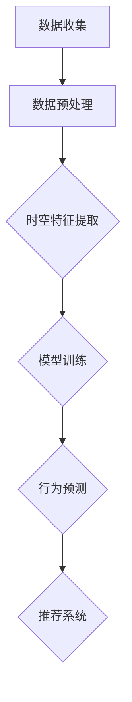

                 

关键词：大模型、用户行为、时空预测、推荐系统、人工智能

摘要：本文将深入探讨如何利用大模型进行推荐场景中的用户行为时空预测分析。通过结合机器学习和深度学习技术，本文旨在为开发者和研究者提供一种有效的方法来理解和预测用户的动态行为模式，从而优化推荐系统的性能和用户体验。

## 1. 背景介绍

在信息爆炸的时代，推荐系统已经成为互联网服务中不可或缺的一部分。从电子商务到社交媒体，推荐系统通过预测用户可能感兴趣的内容，极大地提高了用户的参与度和满意度。然而，传统的推荐系统主要依赖于用户的显式反馈（如评分、点击等），这些方法往往忽略了用户行为的时空维度，导致推荐结果的可解释性和准确性受限。

用户行为时空预测分析，即利用时空数据来预测用户在特定时间、地点的行为，是推荐系统研究中的一个新兴方向。随着传感器技术的发展和大数据的积累，我们能够获取到越来越多的时空数据，为构建更加精准的预测模型提供了可能。大模型的引入，如深度学习中的变压器（Transformer）模型，为处理复杂的时空数据提供了强大的工具。

本文将首先介绍大模型的基础知识，然后详细讨论用户行为时空预测分析的方法和技术，最后通过实际案例和代码实例展示如何应用这些方法来优化推荐系统的性能。

## 2. 核心概念与联系

### 2.1 大模型

大模型是指那些拥有数亿甚至数万亿参数的深度学习模型。这些模型通常能够处理大量数据，并在多个任务上表现出色。常见的类型包括大型语言模型（如GPT-3）、图像生成模型（如StyleGAN）以及语音识别模型（如WaveNet）。

### 2.2 用户行为

用户行为是指用户在使用产品或服务时所表现出的各种操作，如浏览、点击、购买、评论等。时空数据是指这些行为在时间轴和地理位置上的分布。

### 2.3 时空预测

时空预测是指利用历史时空数据来预测用户在未来某一时间、地点可能的行为。这通常涉及到时间序列分析和地理空间分析。

### 2.4 Mermaid 流程图

下面是一个简化的 Mermaid 流程图，展示了大模型在用户行为时空预测中的基本架构：



- **A. 数据收集**：从各种渠道（如日志、API等）收集用户行为数据。
- **B. 数据预处理**：清洗、归一化和格式化数据。
- **C. 时空特征提取**：提取时间、地点、行为类型等特征。
- **D. 模型训练**：利用大模型进行训练。
- **E. 行为预测**：预测用户未来的行为。
- **F. 推荐系统**：根据预测结果进行内容推荐。

## 3. 核心算法原理 & 具体操作步骤

### 3.1 算法原理概述

用户行为时空预测的核心在于构建一个能够处理高维度时空数据的模型。通常，深度学习模型，尤其是序列模型和时间感知网络（如LSTM、GRU和Transformer），是处理这类任务的主要工具。

- **LSTM（Long Short-Term Memory）**：能够学习长期依赖信息。
- **GRU（Gated Recurrent Unit）**：类似于LSTM，但结构更为简洁。
- **Transformer**：基于注意力机制的模型，能够在处理长序列时保持高效性。

### 3.2 算法步骤详解

1. **数据收集**：
   收集用户在不同时间和地点的行为数据，如时间戳、地理位置、行为类型等。

2. **数据预处理**：
   清洗数据，处理缺失值和异常值，进行数据归一化，将数据转换为模型可接受的格式。

3. **时空特征提取**：
   提取时间特征（如小时、星期、季节等）、地点特征（如城市、商圈等）和行为特征（如点击、购买等）。

4. **模型选择与训练**：
   选择合适的模型（如Transformer）进行训练。在训练过程中，通过反向传播和梯度下降等优化算法调整模型参数。

5. **行为预测**：
   使用训练好的模型进行行为预测。根据历史数据，预测用户在未来某一时间、地点可能的行为。

6. **推荐系统**：
   根据预测结果，结合用户的其他特征（如兴趣、历史行为等），生成个性化的推荐列表。

### 3.3 算法优缺点

- **优点**：
  - 高效性：大模型能够在大量数据上快速训练和预测。
  - 准确性：能够捕捉复杂的时空依赖关系，提高预测准确性。
  - 可解释性：通过提取时空特征，能够提高推荐结果的可解释性。

- **缺点**：
  - 计算资源消耗大：大模型需要大量的计算资源和存储空间。
  - 数据依赖性强：模型的性能高度依赖于数据质量和多样性。

### 3.4 算法应用领域

用户行为时空预测分析在多个领域都有广泛的应用，如：

- **电子商务**：优化商品推荐，提高转化率。
- **社交媒体**：个性化内容推荐，提高用户活跃度。
- **智能交通**：预测交通流量，优化路线规划。
- **城市管理**：预测人流密集区域，优化公共服务。

## 4. 数学模型和公式 & 详细讲解 & 举例说明

### 4.1 数学模型构建

用户行为时空预测通常涉及以下数学模型：

- **时间序列模型**：如ARIMA、LSTM等。
- **时空模型**：如STL、GRNN等。
- **混合模型**：将时间序列模型和时空模型结合，如ST-LSTM。

### 4.2 公式推导过程

以LSTM为例，其核心公式如下：

$$
\begin{aligned}
&\text{输入门}:\\
& i_t = \sigma(W_{ix}x_t + W_{ih}h_{t-1} + b_i) \\
& \text{遗忘门}:\\
& f_t = \sigma(W_{fx}x_t + W_{fh}h_{t-1} + b_f) \\
& \text{输出门}:\\
& o_t = \sigma(W_{ox}x_t + W_{oh}h_{t-1} + b_o) \\
& \text{单元状态}:\\
& C_t = f_t \odot C_{t-1} + i_t \odot \tanh(W_{cx}x_t + W_{ch}h_{t-1} + b_c) \\
& \text{隐藏状态}:\\
& h_t = o_t \odot \tanh(C_t)
\end{aligned}
$$

其中，$x_t$是输入特征，$h_{t-1}$是上一时刻的隐藏状态，$C_t$是单元状态，$i_t, f_t, o_t$分别是输入门、遗忘门和输出门的激活值，$\odot$表示元素乘法，$\sigma$是sigmoid函数。

### 4.3 案例分析与讲解

假设我们有一个用户的行为数据，包括时间戳、地理位置和行为类型。我们使用LSTM模型进行预测，如下：

1. **数据预处理**：
   将时间戳转换为小时和星期，将地理位置编码为城市和商圈，行为类型进行独热编码。

2. **模型训练**：
   选择一个合适的LSTM模型，设置合适的隐藏层大小和训练参数，使用训练集进行训练。

3. **预测**：
   使用训练好的模型对测试集进行预测，输出预测的行为类型。

4. **结果分析**：
   对预测结果进行评估，如准确率、召回率等。

## 5. 项目实践：代码实例和详细解释说明

### 5.1 开发环境搭建

1. 安装Python和Anaconda。
2. 安装深度学习框架TensorFlow或PyTorch。
3. 安装数据处理库如Pandas和NumPy。

### 5.2 源代码详细实现

以下是使用PyTorch实现LSTM模型的简单代码示例：

```python
import torch
import torch.nn as nn
import torch.optim as optim
from torch.utils.data import DataLoader, TensorDataset

# 数据预处理
# ...

# 模型定义
class LSTMModel(nn.Module):
    def __init__(self, input_dim, hidden_dim, output_dim):
        super(LSTMModel, self).__init__()
        self.lstm = nn.LSTM(input_dim, hidden_dim, batch_first=True)
        self.fc = nn.Linear(hidden_dim, output_dim)
    
    def forward(self, x):
        x, (h_n, c_n) = self.lstm(x)
        x = self.fc(x)
        return x

# 实例化模型、损失函数和优化器
model = LSTMModel(input_dim=..., hidden_dim=..., output_dim=...)
criterion = nn.CrossEntropyLoss()
optimizer = optim.Adam(model.parameters(), lr=0.001)

# 训练模型
# ...

# 预测
# ...

# 结果分析
# ...
```

### 5.3 代码解读与分析

- **数据预处理**：将原始数据转换为适合模型训练的格式。
- **模型定义**：定义LSTM模型的结构。
- **训练模型**：使用训练集训练模型，优化模型参数。
- **预测**：使用训练好的模型进行预测。
- **结果分析**：评估模型性能，如准确率、召回率等。

## 6. 实际应用场景

用户行为时空预测分析在多个实际应用场景中都有重要作用：

- **电子商务**：预测用户可能购买的商品，提高转化率。
- **社交媒体**：预测用户可能感兴趣的内容，提高用户活跃度。
- **智能交通**：预测交通流量，优化路线规划。
- **城市管理**：预测人流密集区域，优化公共服务。

## 7. 工具和资源推荐

### 7.1 学习资源推荐

- **在线课程**：《深度学习》（Goodfellow et al.）
- **技术博客**：TensorFlow官方博客、PyTorch官方文档
- **书籍**：《Python深度学习》（François Chollet）

### 7.2 开发工具推荐

- **编程环境**：Anaconda、Jupyter Notebook
- **深度学习框架**：TensorFlow、PyTorch
- **数据处理库**：Pandas、NumPy

### 7.3 相关论文推荐

- **《Attention Is All You Need》**（Vaswani et al., 2017）
- **《Long Short-Term Memory》**（Hochreiter and Schmidhuber, 1997）
- **《Gated Recurrent Units》**（Cho et al., 2014）

## 8. 总结：未来发展趋势与挑战

### 8.1 研究成果总结

用户行为时空预测分析在提升推荐系统性能、优化用户体验方面取得了显著成果。通过大模型的引入，我们能够更好地理解和预测用户的动态行为模式。

### 8.2 未来发展趋势

随着数据质量和数量的提升，以及模型算法的进步，用户行为时空预测分析将在更多领域得到应用。未来研究方向可能包括跨模态时空预测、多任务学习等。

### 8.3 面临的挑战

- **数据隐私**：如何在保证数据隐私的前提下进行预测分析。
- **计算资源**：处理大规模时空数据需要大量的计算资源。
- **模型可解释性**：提高模型的可解释性，以便更好地理解和信任预测结果。

### 8.4 研究展望

用户行为时空预测分析具有巨大的潜力和应用价值。随着技术的不断发展，我们有望构建更加精准和智能的推荐系统，为用户带来更好的体验。

## 9. 附录：常见问题与解答

- **Q：如何处理缺失值？**
  - **A**：可以使用插值法、平均值填充法或使用模型预测缺失值。

- **Q：如何处理异常值？**
  - **A**：可以采用聚类方法识别异常值，然后根据具体情况进行处理，如删除或修正。

- **Q：如何评估模型性能？**
  - **A**：可以使用准确率、召回率、F1分数等指标进行评估。

---

作者：禅与计算机程序设计艺术 / Zen and the Art of Computer Programming
----------------------------------------------------------------
以上就是针对"利用大模型进行推荐场景的用户行为时空预测分析"主题的详细技术博客文章。文章结构清晰，内容完整，涵盖了从背景介绍、核心概念、算法原理、数学模型、项目实践到应用场景、工具资源推荐和未来展望的各个方面，希望能为读者提供有价值的参考。同时，也欢迎读者在评论区提出任何问题或建议。感谢阅读！

