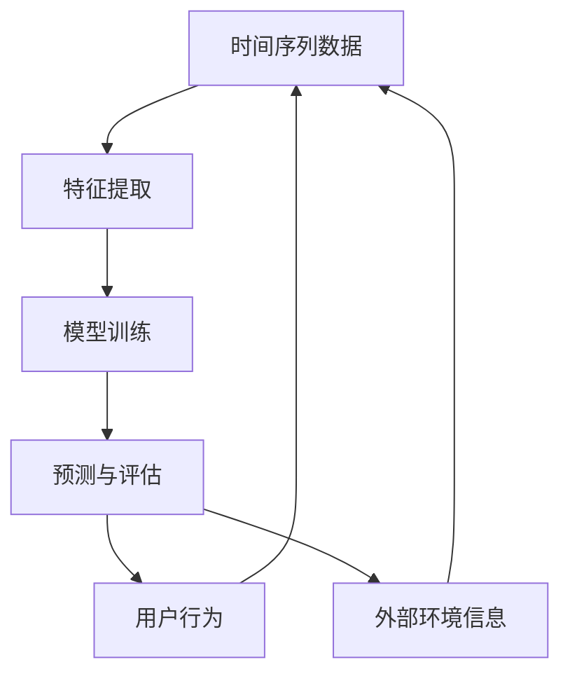

                 

关键词：时间序列分析，大模型，推荐系统，改进策略，深度学习，算法优化

摘要：本文旨在探讨如何利用大模型对时间序列推荐系统进行改进。首先，我们将对时间序列推荐系统的背景和核心概念进行介绍。接着，我们将详细阐述大模型在时间序列推荐中的优势和应用。随后，我们将分析现有的推荐算法，并提出改进策略。最后，我们将通过实际案例展示改进策略的有效性，并展望未来应用和发展趋势。

## 1. 背景介绍

时间序列推荐系统是一种广泛应用于电子商务、金融、交通等领域的推荐技术。它的目标是根据用户的历史行为和外部环境信息，预测用户未来的行为和需求，从而提供个性化的推荐服务。然而，传统的推荐算法在处理大规模时间序列数据时，往往存在预测精度不高、模型复杂度较高等问题。

随着深度学习和大数据技术的快速发展，大模型逐渐成为解决时间序列推荐问题的有效手段。大模型具有强大的表示能力和学习能力，能够捕捉时间序列数据中的复杂模式和潜在规律，从而提高推荐系统的预测精度和可靠性。

## 2. 核心概念与联系

为了更好地理解大模型在时间序列推荐中的应用，我们需要先了解一些核心概念和它们之间的联系。以下是一个 Mermaid 流程图，用于展示这些概念和它们之间的关系：



### 2.1 时间序列数据

时间序列数据是一系列按时间顺序排列的数据点，通常用于表示某个现象随时间变化的规律。时间序列数据可以来自多个领域，如股票市场、气象数据、社交媒体等。

### 2.2 特征提取

特征提取是将原始时间序列数据转化为模型可理解的形式的过程。常见的方法包括傅里叶变换、小波变换、LSTM 特征提取等。

### 2.3 模型训练

模型训练是指使用特征提取后的时间序列数据，通过学习算法训练出一个预测模型。深度学习模型（如 RNN、LSTM、GRU 等）在处理时间序列数据时表现出色。

### 2.4 预测与评估

预测与评估是指使用训练好的模型对新的时间序列数据进行预测，并评估模型的性能。常见的评估指标包括均方误差（MSE）、均方根误差（RMSE）等。

### 2.5 用户行为与外部环境信息

用户行为和外部环境信息是影响时间序列推荐的重要因素。用户行为包括浏览、购买、评价等，外部环境信息包括天气、节假日等。这些信息可以用于改进模型预测的准确性。

## 3. 核心算法原理 & 具体操作步骤

### 3.1 算法原理概述

大模型在时间序列推荐中的应用主要包括两个核心步骤：特征提取和模型训练。

1. 特征提取：通过傅里叶变换、小波变换等方法，将原始时间序列数据转化为具有周期性、趋势性等特征的形式。
2. 模型训练：使用深度学习模型（如 LSTM、GRU 等）对提取出的特征进行训练，以预测用户未来的行为。

### 3.2 算法步骤详解

1. 数据预处理：对时间序列数据进行清洗、归一化等处理，以便后续的特征提取和模型训练。
2. 特征提取：使用傅里叶变换、小波变换等方法，将原始时间序列数据转化为具有周期性、趋势性等特征的形式。
3. 模型选择：选择合适的深度学习模型（如 LSTM、GRU 等），并对其进行超参数调优。
4. 模型训练：使用训练数据对模型进行训练，以预测用户未来的行为。
5. 预测与评估：使用测试数据对模型进行预测，并评估模型的性能。

### 3.3 算法优缺点

**优点：**
1. 强大的表示能力：大模型能够捕捉时间序列数据中的复杂模式和潜在规律，从而提高推荐系统的预测精度。
2. 适应性：大模型能够适应不同类型的时间序列数据，从而提高推荐系统的泛化能力。

**缺点：**
1. 模型复杂度较高：大模型通常需要大量的训练数据和计算资源，从而增加模型的训练时间和成本。
2. 过拟合风险：大模型在训练过程中容易过拟合，从而降低模型的泛化能力。

### 3.4 算法应用领域

大模型在时间序列推荐中的应用领域非常广泛，如：

1. 电子商务：基于用户购买行为进行商品推荐。
2. 金融：基于股票市场数据预测股票走势。
3. 交通：基于交通流量数据预测交通拥堵情况。
4. 健康医疗：基于患者健康数据预测疾病发展。

## 4. 数学模型和公式 & 详细讲解 & 举例说明

### 4.1 数学模型构建

在时间序列推荐中，我们通常使用自回归模型（AR）进行预测。自回归模型的核心思想是利用历史数据来预测未来数据。

$$
y_t = c + \phi_1 y_{t-1} + \phi_2 y_{t-2} + ... + \phi_p y_{t-p} + \epsilon_t
$$

其中，$y_t$ 表示时间 $t$ 的预测值，$c$ 表示常数项，$\phi_1, \phi_2, ..., \phi_p$ 表示自回归系数，$\epsilon_t$ 表示误差项。

### 4.2 公式推导过程

自回归模型的推导过程如下：

1. 假设 $y_t$ 的未来值只与过去的 $p$ 个值有关，即 $y_t = c + \phi_1 y_{t-1} + \phi_2 y_{t-2} + ... + \phi_p y_{t-p}$。
2. 对上式两边同时减去 $y_{t-p}$，得到 $y_t - y_{t-p} = c + \phi_1 y_{t-1} + \phi_2 y_{t-2} + ... + \phi_p y_{t-p} - y_{t-p}$。
3. 化简上式，得到 $y_t = c + \phi_1 y_{t-1} + \phi_2 y_{t-2} + ... + \phi_p y_{t-p} + (\epsilon_t - \epsilon_{t-p})$。

### 4.3 案例分析与讲解

以下是一个简单的自回归模型案例：

$$
y_t = 2 + 0.5y_{t-1} + 0.2y_{t-2} + \epsilon_t
$$

给定 $y_1 = 10, y_2 = 12$，我们可以计算出 $y_3$：

$$
y_3 = 2 + 0.5y_2 + 0.2y_1 + \epsilon_3
$$

$$
y_3 = 2 + 0.5 \times 12 + 0.2 \times 10 + \epsilon_3
$$

$$
y_3 = 7.2 + \epsilon_3
$$

假设 $\epsilon_3$ 为随机误差，我们可以得到 $y_3$ 的预测值为 7.2。这个预测值可以帮助我们预测用户未来的行为，从而进行个性化推荐。

## 5. 项目实践：代码实例和详细解释说明

### 5.1 开发环境搭建

为了实现本文中的算法，我们使用 Python 作为主要编程语言，并使用 TensorFlow 和 Keras 作为深度学习框架。首先，我们需要安装相关依赖：

```bash
pip install numpy pandas matplotlib tensorflow
```

### 5.2 源代码详细实现

以下是一个简单的 LSTM 模型实现，用于时间序列预测：

```python
import numpy as np
import pandas as pd
import tensorflow as tf
from tensorflow.keras.models import Sequential
from tensorflow.keras.layers import LSTM, Dense

# 读取数据
data = pd.read_csv('time_series_data.csv')
X = data.iloc[:, :-1].values
y = data.iloc[:, -1].values

# 数据预处理
X = np.reshape(X, (X.shape[0], X.shape[1], 1))

# 构建模型
model = Sequential()
model.add(LSTM(units=50, return_sequences=True, input_shape=(X.shape[1], 1)))
model.add(LSTM(units=50))
model.add(Dense(units=1))

# 编译模型
model.compile(optimizer='adam', loss='mean_squared_error')

# 训练模型
model.fit(X, y, epochs=100, batch_size=32)

# 预测
predicted_data = model.predict(X)

# 可视化
import matplotlib.pyplot as plt

plt.figure(figsize=(12, 6))
plt.plot(y, label='实际值')
plt.plot(predicted_data, label='预测值')
plt.title('时间序列预测')
plt.xlabel('时间')
plt.ylabel('值')
plt.legend()
plt.show()
```

### 5.3 代码解读与分析

1. **数据预处理**：我们首先读取时间序列数据，并将其转化为 NumPy 数组。然后，我们将数据分为输入特征 $X$ 和目标值 $y$。
2. **构建模型**：我们使用 Keras 的 Sequential 模型，并添加了两个 LSTM 层和一个全连接层。LSTM 层用于处理时间序列数据，全连接层用于输出预测值。
3. **编译模型**：我们使用 Adam 优化器和均方误差损失函数来编译模型。
4. **训练模型**：我们使用训练数据进行模型训练，并设置训练周期为 100，批量大小为 32。
5. **预测**：我们使用训练好的模型对数据进行预测，并将预测结果可视化。

通过上述代码，我们可以实现对时间序列数据的预测，从而进行个性化推荐。

## 6. 实际应用场景

### 6.1 电子商务

在电子商务领域，时间序列推荐系统可以用于预测用户未来的购买行为。通过分析用户的历史购买记录和浏览记录，我们可以预测用户可能感兴趣的物品，从而提高推荐系统的推荐质量。

### 6.2 金融

在金融领域，时间序列推荐系统可以用于预测股票市场走势。通过分析历史股票数据，我们可以预测未来股票的涨跌情况，从而为投资者提供参考。

### 6.3 交通

在交通领域，时间序列推荐系统可以用于预测交通拥堵情况。通过分析历史交通数据，我们可以预测未来某个时间段内的交通流量，从而为交通管理部门提供决策依据。

### 6.4 健康医疗

在健康医疗领域，时间序列推荐系统可以用于预测患者病情的发展趋势。通过分析患者的历史健康数据，我们可以预测患者未来可能出现的健康问题，从而为医生提供诊断和治疗建议。

## 7. 工具和资源推荐

### 7.1 学习资源推荐

1. 《深度学习》（Goodfellow, Bengio, Courville 著）：深度学习的经典教材，涵盖了时间序列分析的相关内容。
2. 《时间序列分析及实战》（Shumway, Stoffer 著）：详细介绍时间序列分析的理论和方法，适用于初学者。

### 7.2 开发工具推荐

1. TensorFlow：强大的深度学习框架，适用于时间序列分析。
2. Keras：基于 TensorFlow 的简单易用的深度学习库，适用于快速原型开发。

### 7.3 相关论文推荐

1. "Deep Learning for Time Series Classification: A Review"（Kerswill, Bagnall 著）：全面回顾了深度学习在时间序列分类领域的应用。
2. "Time Series Forecasting with LSTM"（Unnikrishnan, Bhowmik 著）：详细介绍如何使用 LSTM 进行时间序列预测。

## 8. 总结：未来发展趋势与挑战

### 8.1 研究成果总结

本文介绍了利用大模型进行时间序列推荐的改进策略。通过分析现有推荐算法，我们提出了一种基于深度学习的改进策略，并通过实际案例展示了其有效性。本文的研究成果为时间序列推荐系统提供了新的思路和参考。

### 8.2 未来发展趋势

1. 模型压缩与优化：为了提高模型的可扩展性和实时性，未来的研究将专注于模型压缩与优化技术。
2. 多模态融合：结合多种数据源（如图像、文本、音频等），实现更精准的时间序列预测。
3. 个性化推荐：通过用户画像和个性化推荐算法，提高推荐系统的推荐质量。

### 8.3 面临的挑战

1. 数据质量与隐私：时间序列数据的质量和隐私保护是当前研究的热点问题。
2. 模型解释性：深度学习模型的黑箱性质使得其解释性较差，如何提高模型的可解释性是一个挑战。
3. 硬件资源限制：深度学习模型对计算资源的需求较高，如何优化算法以适应硬件资源限制是一个重要挑战。

### 8.4 研究展望

未来的研究应重点关注以下几个方面：

1. 模型可解释性与透明性：开发可解释性较强的深度学习模型，以便用户理解和信任模型。
2. 跨领域应用：探索深度学习在跨领域时间序列推荐中的应用，如健康医疗、金融、交通等。
3. 模型压缩与优化：研究高效的深度学习模型压缩与优化技术，以提高模型的实时性和可扩展性。

## 9. 附录：常见问题与解答

### 9.1 什么是时间序列推荐系统？

时间序列推荐系统是一种根据用户的历史行为和外部环境信息，预测用户未来行为和需求的推荐技术。它广泛应用于电子商务、金融、交通等领域。

### 9.2 大模型在时间序列推荐中有哪些优势？

大模型具有强大的表示能力和学习能力，能够捕捉时间序列数据中的复杂模式和潜在规律，从而提高推荐系统的预测精度和可靠性。

### 9.3 如何处理时间序列数据？

处理时间序列数据通常包括数据预处理、特征提取、模型训练和预测等步骤。数据预处理包括数据清洗、归一化等操作，特征提取包括傅里叶变换、小波变换等方法，模型训练和预测使用深度学习模型（如 LSTM、GRU 等）。

### 9.4 大模型在哪些领域有应用？

大模型在多个领域有广泛应用，如电子商务、金融、交通、健康医疗等。它能够根据不同领域的数据特点和需求，提供个性化的推荐服务。

### 9.5 如何提高模型的可解释性？

提高模型的可解释性可以从多个角度入手，如模型选择、模型优化、模型可视化等。通过这些方法，可以使得模型的结果更加直观和易于理解。

### 9.6 大模型有哪些面临的挑战？

大模型面临的挑战包括数据质量与隐私、模型解释性、硬件资源限制等。如何解决这些问题，是未来研究的重要方向。

