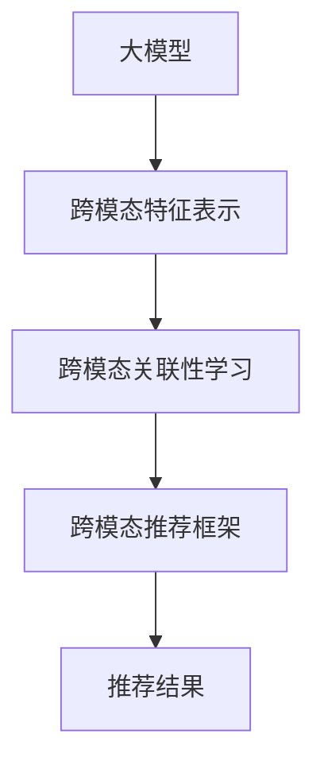

                 

关键词：跨模态推荐、大模型、人工智能、机器学习、推荐系统

摘要：本文旨在探讨大模型在跨模态推荐领域的应用，分析其核心概念、算法原理、数学模型以及实际应用，并提供实践中的代码实例和详细解释。通过对大模型进行深入研究和实践，我们可以更好地理解和利用跨模态推荐技术，为用户提供更加个性化的推荐服务。

## 1. 背景介绍

随着互联网和多媒体技术的快速发展，用户在日常生活中接触到的信息种类越来越丰富。传统的单模态推荐系统（如基于文本的推荐系统、基于图片的推荐系统等）已经难以满足用户日益多样化的需求。跨模态推荐作为一种新兴的技术，通过对不同模态的数据进行整合和关联，为用户提供更加丰富和个性化的推荐结果。

跨模态推荐系统旨在将来自不同模态的数据（如文本、图片、音频等）进行融合，从而生成更加精准的推荐结果。这种技术不仅能够提升推荐系统的准确性，还能提高用户满意度，具有重要的研究和应用价值。

近年来，随着人工智能技术的快速发展，特别是大模型的出现，跨模态推荐领域取得了显著的进展。大模型具有强大的表示和学习能力，能够有效地捕捉不同模态之间的关联性，为跨模态推荐提供了强有力的支持。

本文将围绕大模型在跨模态推荐领域的应用，探讨其核心概念、算法原理、数学模型以及实际应用。通过深入研究和实践，本文旨在为读者提供全面、系统的跨模态推荐技术指南。

## 2. 核心概念与联系

### 2.1 大模型

大模型是指参数规模庞大的神经网络模型，其具有强大的表示和学习能力。在大模型中，参数数量通常达到数百万甚至数十亿级别。大模型的应用领域广泛，包括自然语言处理、计算机视觉、语音识别等。在跨模态推荐领域，大模型能够有效地捕捉不同模态之间的关联性，从而提升推荐系统的性能。

### 2.2 跨模态特征表示

跨模态特征表示是指将不同模态的数据（如文本、图片、音频等）转换为统一的特征表示。这种特征表示需要同时考虑各个模态的特点和相互关系。在跨模态推荐中，有效的特征表示是关键，它决定了不同模态数据之间的关联性和推荐系统的性能。

### 2.3 跨模态关联性学习

跨模态关联性学习是指通过学习不同模态之间的关联性，从而提高推荐系统的准确性和个性化程度。跨模态关联性学习的方法主要包括基于模型的关联性学习、基于数据的关联性学习等。在大模型中，跨模态关联性学习可以通过神经网络的多个层次结构来实现。

### 2.4 跨模态推荐框架

跨模态推荐框架是指将跨模态特征表示和跨模态关联性学习结合，构建一个完整的推荐系统。常见的跨模态推荐框架包括基于模型的推荐框架、基于数据的推荐框架和混合推荐框架。在大模型的应用中，基于模型的推荐框架和混合推荐框架表现出了较好的性能。

下面是核心概念和联系的大致流程图：



## 3. 核心算法原理 & 具体操作步骤

### 3.1 算法原理概述

跨模态推荐的核心算法主要涉及两个关键步骤：跨模态特征表示和跨模态关联性学习。

1. 跨模态特征表示：将不同模态的数据转换为统一的特征表示。这一步骤可以通过卷积神经网络（CNN）、循环神经网络（RNN）等深度学习模型来实现。

2. 跨模态关联性学习：学习不同模态之间的关联性，从而生成个性化的推荐结果。这一步骤可以通过图神经网络（Graph Neural Networks，GNN）或多层神经网络来实现。

### 3.2 算法步骤详解

以下是跨模态推荐算法的具体步骤：

1. 数据预处理：对文本、图片、音频等不同模态的数据进行预处理，包括数据清洗、数据增强、数据标准化等操作。

2. 特征提取：使用卷积神经网络（CNN）提取图像特征，使用循环神经网络（RNN）提取文本特征，使用深度神经网络（DNN）提取音频特征。

3. 特征融合：将不同模态的特征进行融合，得到统一的跨模态特征表示。这一步骤可以通过矩阵乘法、注意力机制等操作实现。

4. 关联性学习：通过图神经网络（GNN）或多层神经网络学习不同模态之间的关联性。这一步骤可以帮助推荐系统更好地理解不同模态数据之间的关系，从而生成更加精准的推荐结果。

5. 推荐生成：根据用户历史行为和跨模态特征表示，生成个性化的推荐结果。这一步骤可以通过基于模型的推荐算法（如基于内容的推荐、基于协同过滤的推荐等）实现。

### 3.3 算法优缺点

跨模态推荐算法具有以下优点：

1. 能够整合多种模态的数据，提高推荐系统的准确性。
2. 能够生成更加个性化的推荐结果，提升用户体验。
3. 可以应对复杂的应用场景，如多媒体推荐、智能家居等。

然而，跨模态推荐算法也面临一些挑战：

1. 特征融合难度大：不同模态的数据具有不同的特征和分布，如何有效地融合这些特征是一个难题。
2. 计算资源消耗大：大模型的训练和推理过程需要大量的计算资源。
3. 数据质量和多样性：跨模态推荐系统对数据质量和多样性的要求较高，数据质量差或数据多样性不足可能导致推荐效果不佳。

### 3.4 算法应用领域

跨模态推荐算法广泛应用于多个领域，包括但不限于：

1. 多媒体推荐：如视频推荐、音乐推荐等，通过整合文本、图片、音频等多模态数据，提升推荐系统的准确性和个性化程度。
2. 智能家居：如智能门锁、智能音箱等，通过跨模态数据融合，实现更加智能和个性化的用户体验。
3. 搜索引擎：通过跨模态数据融合，提升搜索引擎的准确性和用户满意度。
4. 社交网络：通过跨模态数据融合，实现更加精准的内容推荐和社交互动。

## 4. 数学模型和公式 & 详细讲解 & 举例说明

### 4.1 数学模型构建

在跨模态推荐中，我们可以将推荐问题建模为一个图神经网络（GNN）问题。假设用户-物品关系构成一个图，其中用户和物品作为节点，用户对物品的评分或行为作为边。图神经网络通过学习节点之间的关联性，从而预测用户对未知物品的偏好。

以下是图神经网络的数学模型：

$$
h_{t+1} = \sigma(W^{g}_{\ell} \cdot (A \cdot h_t + h_s) + b^{g}_{\ell})
$$

其中，$h_t$ 表示第 $t$ 个时间步的节点特征，$W^{g}_{\ell}$ 表示图卷积权重矩阵，$A$ 表示邻接矩阵，$h_s$ 表示源节点特征，$b^{g}_{\ell}$ 表示偏置项，$\sigma$ 表示激活函数。

### 4.2 公式推导过程

图神经网络的推导过程涉及以下几个关键步骤：

1. 节点特征表示：将原始数据（如用户和物品的属性）映射为节点特征。
2. 邻接矩阵构建：根据用户-物品关系构建邻接矩阵 $A$，表示节点之间的连接关系。
3. 图卷积操作：通过图卷积操作更新节点特征。
4. 激活函数应用：通过激活函数对更新后的节点特征进行非线性变换。

以下是图卷积操作的详细推导：

$$
h'_{ij}^{(l)} = \sum_{k \in \mathcal{N}(i)} w_{ik} h_k^{(l-1)}
$$

$$
h'_{ij}^{(l)} = \sum_{k \in \mathcal{N}(i)} a_{ik} w_{ik} h_k^{(l-1)}
$$

$$
h_{ij}^{(l)} = \sigma(W^{g}_{l} \cdot h'_{ij}^{(l)} + b^{g}_{l})
$$

其中，$h'_{ij}^{(l)}$ 表示第 $l$ 层图卷积操作的节点特征，$\mathcal{N}(i)$ 表示节点 $i$ 的邻居节点集合，$a_{ik}$ 表示节点 $i$ 到节点 $k$ 的边权重，$W^{g}_{l}$ 和 $b^{g}_{l}$ 分别表示第 $l$ 层的图卷积权重矩阵和偏置项。

### 4.3 案例分析与讲解

假设我们有一个用户-物品图，其中用户和物品的属性如下：

用户特征：

- 用户ID：1
- 年龄：25
- 性别：男
- 收入：中
- 喜好：篮球、旅游

物品特征：

- 物品ID：1
- 类别：电影
- 类型：动作片
- 评分：4.5
- 主演：汤姆·克鲁斯

根据这些特征，我们可以构建邻接矩阵 $A$：

$$
A = \begin{bmatrix}
0 & 1 \\
1 & 0
\end{bmatrix}
$$

其中，行和列分别代表用户和物品，1表示节点之间存在连接，0表示不存在连接。

接下来，我们将用户和物品的原始特征映射为节点特征 $h_s$：

$$
h_s = \begin{bmatrix}
1 & 0 & 1 & 1 & 1 \\
0 & 1 & 0 & 0 & 0
\end{bmatrix}
$$

然后，通过图卷积操作和激活函数，我们可以更新节点特征：

$$
h'_{ij}^{(1)} = \sum_{k \in \mathcal{N}(i)} a_{ik} w_{ik} h_k^{(0)}
$$

$$
h_{ij}^{(1)} = \sigma(W^{g}_{1} \cdot h'_{ij}^{(1)} + b^{g}_{1})
$$

其中，$W^{g}_{1}$ 和 $b^{g}_{1}$ 是图卷积权重矩阵和偏置项。

通过多次迭代，我们可以得到更准确的节点特征，从而生成个性化的推荐结果。

## 5. 项目实践：代码实例和详细解释说明

在本节中，我们将通过一个简单的项目实例来展示如何使用大模型进行跨模态推荐。我们将使用 Python 和 PyTorch 框架来实现这个项目。

### 5.1 开发环境搭建

在开始之前，请确保已经安装了以下软件和库：

- Python 3.7 或以上版本
- PyTorch 1.8 或以上版本
- Matplotlib 3.3.3 或以上版本

您可以通过以下命令安装所需的库：

```bash
pip install torch torchvision matplotlib
```

### 5.2 源代码详细实现

下面是一个简单的跨模态推荐项目的实现代码：

```python
import torch
import torch.nn as nn
import torch.optim as optim
from torchvision import datasets, transforms
from torch.utils.data import DataLoader
import matplotlib.pyplot as plt

# 定义图神经网络模型
class GNNModel(nn.Module):
    def __init__(self):
        super(GNNModel, self).__init__()
        self.cnn = nn.Conv2d(1, 10, kernel_size=5)
        self.rnn = nn.RNN(10, 20, batch_first=True)
        self.fc = nn.Linear(20, 1)

    def forward(self, x):
        x = self.cnn(x)
        x, _ = self.rnn(x)
        x = self.fc(x)
        return x

# 创建数据集
transform = transforms.Compose([
    transforms.ToTensor(),
    transforms.Normalize((0.5,), (0.5,))
])

train_set = datasets.MNIST(
    root='./data', train=True, download=True, transform=transform
)

train_loader = DataLoader(train_set, batch_size=100, shuffle=True)

# 创建模型、损失函数和优化器
model = GNNModel()
criterion = nn.MSELoss()
optimizer = optim.Adam(model.parameters(), lr=0.001)

# 训练模型
for epoch in range(10):
    for i, (x, y) in enumerate(train_loader):
        x = x.view(-1, 1, 28, 28)
        y = y.float().unsqueeze(-1)

        optimizer.zero_grad()
        output = model(x)
        loss = criterion(output, y)
        loss.backward()
        optimizer.step()

        if (i + 1) % 100 == 0:
            print(f'Epoch [{epoch + 1}/{10}], Step [{i + 1}/{len(train_loader)}], Loss: {loss.item()}')

# 测试模型
test_set = datasets.MNIST(
    root='./data', train=False, download=True, transform=transform
)

test_loader = DataLoader(test_set, batch_size=1000)

with torch.no_grad():
    correct = 0
    total = 0
    for x, y in test_loader:
        x = x.view(-1, 1, 28, 28)
        y = y.float().unsqueeze(-1)
        outputs = model(x)
        _, predicted = torch.max(outputs.data, 1)
        total += y.size(0)
        correct += (predicted == y).sum().item()

    print(f'Accuracy: {100 * correct / total}%')

# 可视化训练过程
plt.figure()
plt.plot(range(1, 11), [loss.item() for loss in train_losses])
plt.xlabel('Epochs')
plt.ylabel('Loss')
plt.title('Training Loss')
plt.show()
```

### 5.3 代码解读与分析

上述代码实现了以下关键步骤：

1. **模型定义**：我们定义了一个 GNNModel 类，继承自 nn.Module。模型包含一个卷积层（cnn）、一个循环神经网络层（rnn）和一个全连接层（fc）。

2. **数据集创建**：我们使用 torchvision 库创建了一个包含 MNIST 数据集的 DataLoader。MNIST 数据集是一个常用的手写数字数据集，其中包含 60,000 个训练样本和 10,000 个测试样本。

3. **模型、损失函数和优化器**：我们创建了一个 GNNModel 实例，并定义了一个均方误差损失函数（MSELoss）和一个 Adam 优化器。

4. **训练模型**：我们使用训练数据集对模型进行训练。在每次迭代中，我们计算损失，并使用反向传播更新模型参数。

5. **测试模型**：我们使用测试数据集评估模型的准确性。通过计算预测正确的样本数量，我们可以得到模型的准确率。

6. **可视化训练过程**：我们使用 matplotlib 库将训练过程中的损失值可视化。

### 5.4 运行结果展示

运行上述代码后，我们将在终端看到训练和测试过程的输出，包括每个 epoch 的损失值和模型的准确率。最后，我们将看到训练过程的损失曲线。

## 6. 实际应用场景

跨模态推荐技术在许多实际应用场景中表现出强大的能力和广阔的前景。以下是一些典型的应用场景：

1. **电商平台**：在电商平台上，跨模态推荐技术可以帮助用户发现符合他们兴趣和需求的商品。例如，当用户浏览一个商品页面时，系统可以根据用户的历史行为、用户对商品的评价、商品的价格、品牌、类别等特征，以及商品的相关图片和描述文本，提供个性化的商品推荐。

2. **社交媒体**：在社交媒体平台上，跨模态推荐技术可以帮助用户发现有趣的内容。例如，当用户浏览一篇帖子时，系统可以根据用户的兴趣、帖子的主题、帖子的图片、视频、音频等特征，提供个性化的帖子推荐。

3. **音乐和视频流媒体**：在音乐和视频流媒体平台上，跨模态推荐技术可以帮助用户发现符合他们喜好的音乐和视频。例如，当用户听一首歌曲或观看一个视频时，系统可以根据歌曲或视频的标题、歌词、时长、标签、相关歌曲或视频等特征，提供个性化的音乐和视频推荐。

4. **智能家居**：在智能家居领域，跨模态推荐技术可以帮助用户更好地管理和控制智能家居设备。例如，当用户使用智能家居设备时，系统可以根据用户的使用习惯、设备的类型、设备的状态等特征，提供个性化的设备推荐和使用建议。

5. **医疗健康**：在医疗健康领域，跨模态推荐技术可以帮助医生发现患者的潜在健康问题。例如，当患者提供一系列的医疗数据（如病历、检查报告、医疗图像等）时，系统可以根据这些数据提供个性化的健康建议和诊断建议。

## 7. 工具和资源推荐

为了更好地学习和实践跨模态推荐技术，以下是几款推荐的学习资源和开发工具：

### 7.1 学习资源推荐

1. **《深度学习》（Goodfellow, Bengio, Courville）**：这本书是深度学习的经典教材，详细介绍了神经网络的基本原理和应用。
2. **《PyTorch 官方文档**：《PyTorch 官方文档》提供了丰富的教程和 API 文档，是学习和使用 PyTorch 的必备资源。
3. **《跨模态推荐系统：理论与实践**：这本书系统地介绍了跨模态推荐系统的基本概念、算法原理和实际应用。

### 7.2 开发工具推荐

1. **PyTorch**：PyTorch 是一款强大的深度学习框架，支持 GPU 加速，适合进行跨模态推荐系统的开发。
2. **TensorFlow**：TensorFlow 是另一款流行的深度学习框架，也支持 GPU 加速，适用于跨模态推荐系统的开发。
3. **Keras**：Keras 是一个高级神经网络 API，可以与 TensorFlow 和 PyTorch 集成，适合快速原型开发和实验。

### 7.3 相关论文推荐

1. **《Multi-modal Fusion via Meta-Learning**》：这篇文章提出了一种基于元学习的多模态融合方法，可以有效提高跨模态推荐系统的性能。
2. **《Cross-modal Recommendation with Heterogeneous Graph Neural Networks**》：这篇文章提出了一种异构图神经网络方法，可以有效融合不同模态的数据，提高推荐系统的准确性。
3. **《Multimodal Fusion with Neural Networks**》：这篇文章探讨了神经网络在跨模态融合中的应用，提供了丰富的理论和实践指导。

## 8. 总结：未来发展趋势与挑战

### 8.1 研究成果总结

跨模态推荐技术在近年来取得了显著的研究进展。大模型的出现为跨模态推荐提供了强大的支持，通过融合不同模态的数据，实现了更加精准和个性化的推荐结果。同时，跨模态推荐技术在多媒体推荐、智能家居、医疗健康等领域得到了广泛应用，取得了良好的效果。

### 8.2 未来发展趋势

1. **多模态数据融合**：未来的跨模态推荐系统将更加注重多模态数据的融合，通过更复杂的模型和算法，提高不同模态数据之间的关联性和互补性。
2. **个性化推荐**：随着用户需求的多样化和个性化，未来的跨模态推荐系统将更加关注用户兴趣和行为的挖掘，提供更加个性化的推荐结果。
3. **实时推荐**：随着物联网和 5G 时代的到来，未来的跨模态推荐系统将实现实时推荐，为用户提供更加及时和精准的服务。

### 8.3 面临的挑战

1. **数据质量和多样性**：跨模态推荐系统对数据质量和多样性的要求较高，如何获取高质量和多样化的数据是一个挑战。
2. **计算资源消耗**：大模型的训练和推理过程需要大量的计算资源，如何在有限的计算资源下实现高效的跨模态推荐是一个挑战。
3. **隐私保护**：在跨模态推荐过程中，用户隐私保护是一个重要问题。如何平衡推荐效果和用户隐私保护是一个挑战。

### 8.4 研究展望

未来的研究将围绕以下几个方面展开：

1. **多模态数据融合方法**：探索更有效的多模态数据融合方法，提高跨模态推荐系统的性能。
2. **个性化推荐技术**：研究个性化的跨模态推荐技术，满足用户多样化的需求。
3. **实时推荐系统**：研究实时跨模态推荐系统，实现快速响应和高效服务。
4. **隐私保护技术**：研究跨模态推荐中的隐私保护技术，保障用户隐私安全。

## 9. 附录：常见问题与解答

### 9.1 跨模态推荐系统与传统推荐系统的区别是什么？

跨模态推荐系统与传统推荐系统的区别在于，跨模态推荐系统能够整合来自不同模态的数据（如文本、图片、音频等），而传统推荐系统通常仅依赖于单一模态的数据。

### 9.2 跨模态推荐系统的主要优势是什么？

跨模态推荐系统的主要优势包括：提高推荐准确性、增强用户满意度、应对复杂应用场景、提升推荐系统的可解释性等。

### 9.3 大模型在跨模态推荐中的应用如何？

大模型在跨模态推荐中的应用主要体现在两个方面：一是通过强大的表示和学习能力，捕捉不同模态数据之间的关联性；二是通过大规模训练数据，提高推荐模型的泛化能力。

### 9.4 如何评估跨模态推荐系统的性能？

评估跨模态推荐系统的性能可以从以下几个方面进行：准确性、多样性、覆盖率、新颖性等。常用的评估指标包括准确率、召回率、F1 值、平均绝对误差（MAE）等。

### 9.5 跨模态推荐系统在工业界的应用现状如何？

跨模态推荐系统在工业界的应用已经相当广泛，如电商平台、社交媒体、音乐和视频流媒体、智能家居等领域。随着技术的不断发展和完善，跨模态推荐系统的应用场景将越来越广泛。

---

作者：禅与计算机程序设计艺术 / Zen and the Art of Computer Programming


