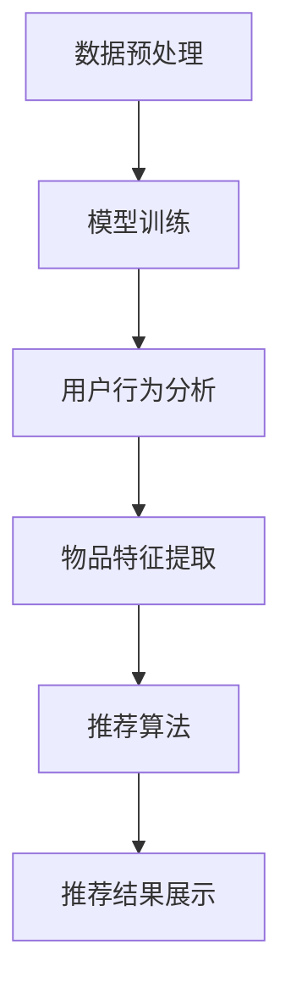

                 

关键词：大语言模型，推荐系统，时间敏感性，算法优化，实时推荐，用户行为分析。

摘要：本文旨在探讨如何利用大语言模型提升推荐系统的时间敏感性，实现更精准、更及时的推荐结果。通过对大语言模型的基本原理和架构的深入分析，结合推荐系统中的关键步骤和挑战，本文提出了一种基于大语言模型的优化算法，并通过数学模型和具体案例进行了详细解释和验证。最后，文章对未来发展方向和面临的挑战进行了展望。

## 1. 背景介绍

随着互联网技术的快速发展，个性化推荐系统已经成为众多平台的重要组成部分，如电子商务、社交媒体、新闻资讯等。推荐系统通过分析用户的行为数据和历史偏好，为用户提供个性化的内容推荐，从而提高用户体验和平台粘性。然而，传统的推荐系统存在一些问题，如响应时间过长、推荐结果不准确等。这些问题主要源于推荐算法的复杂度和数据量的庞大，导致系统在处理大量实时数据时效率低下。

为了解决这些问题，近年来，大语言模型（如GPT-3、BERT等）的发展为推荐系统带来了新的契机。大语言模型具有强大的文本生成和理解能力，能够快速处理和分析用户行为数据，从而提升推荐系统的实时性和准确性。本文将围绕如何利用大语言模型提升推荐系统的时间敏感性展开讨论。

## 2. 核心概念与联系

### 2.1 大语言模型的基本原理

大语言模型是一种基于神经网络的自然语言处理技术，通过训练大量文本数据，模型可以学会预测下一个单词或字符的概率。大语言模型的核心思想是利用已有的文本信息，为用户提供更加精准和个性化的语言生成服务。其基本原理可以概括为以下几个步骤：

1. **数据预处理**：对原始文本数据（如新闻、文章、社交媒体帖子等）进行清洗和预处理，包括分词、去停用词、词干提取等操作，将文本转换为模型可以处理的格式。

2. **模型训练**：使用预处理后的文本数据训练神经网络模型，通过反向传播算法不断优化模型参数，使模型能够准确预测下一个单词或字符。

3. **文本生成**：在给定一个起始文本的情况下，模型可以根据已训练的知识和经验，生成后续的文本内容，从而实现自然语言生成。

### 2.2 推荐系统的基本架构

推荐系统通常包括以下几个关键组成部分：

1. **用户行为分析**：通过收集和分析用户的浏览、搜索、购买等行为数据，了解用户的兴趣和偏好。

2. **物品特征提取**：对推荐系统中的物品（如商品、新闻、视频等）进行特征提取，为后续的推荐算法提供输入。

3. **推荐算法**：根据用户的行为数据和物品特征，使用推荐算法为用户生成个性化推荐结果。

4. **推荐结果展示**：将推荐结果呈现给用户，引导用户进行后续的操作（如点击、购买等）。

### 2.3 大语言模型与推荐系统的结合

大语言模型在推荐系统中的应用主要体现在以下几个方面：

1. **实时用户行为分析**：大语言模型可以快速处理和分析用户的实时行为数据，为推荐算法提供更准确和实时的用户特征。

2. **物品内容理解**：通过对物品内容的分析和理解，大语言模型可以帮助推荐系统更好地识别和挖掘物品的潜在特征，提高推荐结果的准确性。

3. **文本生成与推荐**：大语言模型可以根据用户的行为数据和物品特征，生成个性化的推荐文案，提高推荐结果的吸引力。

### 2.4 Mermaid 流程图

以下是一个简单的 Mermaid 流程图，展示了大语言模型在推荐系统中的关键步骤：



## 3. 核心算法原理 & 具体操作步骤

### 3.1 算法原理概述

本文提出了一种基于大语言模型的推荐系统优化算法，该算法主要包括以下几个关键步骤：

1. **实时用户行为分析**：通过大语言模型快速处理和分析用户的实时行为数据，提取用户兴趣特征。

2. **物品特征提取**：对物品进行文本分析和特征提取，为推荐算法提供输入。

3. **推荐算法**：基于用户兴趣特征和物品特征，使用优化后的推荐算法生成个性化推荐结果。

4. **推荐结果展示**：根据用户的行为数据和反馈，对推荐结果进行实时调整和优化。

### 3.2 算法步骤详解

1. **实时用户行为分析**：

   - **数据收集**：收集用户的浏览、搜索、购买等行为数据。

   - **数据预处理**：使用大语言模型对用户行为数据进行预处理，提取关键信息。

   - **特征提取**：利用词向量模型（如Word2Vec、BERT等）将用户行为数据转换为向量表示。

2. **物品特征提取**：

   - **文本分析**：对物品的文本内容进行分词、去停用词、词干提取等操作。

   - **特征提取**：使用词向量模型将文本内容转换为向量表示。

3. **推荐算法**：

   - **相似度计算**：计算用户兴趣特征和物品特征之间的相似度。

   - **推荐生成**：根据相似度计算结果，生成个性化推荐结果。

4. **推荐结果展示**：

   - **结果展示**：将推荐结果呈现给用户。

   - **用户反馈**：收集用户对推荐结果的反馈。

   - **结果优化**：根据用户反馈，对推荐结果进行实时调整和优化。

### 3.3 算法优缺点

#### 优点：

1. **高效实时性**：大语言模型可以快速处理和分析用户行为数据，提高推荐系统的实时性。

2. **精准个性化**：通过用户兴趣特征和物品特征的精确匹配，提升推荐结果的准确性。

3. **自适应调整**：根据用户反馈，实时调整推荐结果，提高用户满意度。

#### 缺点：

1. **计算资源消耗**：大语言模型训练和推荐算法计算复杂度高，对计算资源有较高要求。

2. **数据依赖性**：推荐系统对用户行为数据和物品特征数据有较高依赖，数据质量直接影响推荐效果。

### 3.4 算法应用领域

基于大语言模型的推荐系统优化算法可以广泛应用于多个领域，如电子商务、社交媒体、新闻资讯等。以下是一些具体的应用场景：

1. **电子商务**：为用户提供个性化的商品推荐，提高购物体验。

2. **社交媒体**：为用户提供个性化的内容推荐，提高用户黏性和活跃度。

3. **新闻资讯**：为用户提供个性化的新闻推荐，提高信息获取的效率和质量。

## 4. 数学模型和公式 & 详细讲解 & 举例说明

### 4.1 数学模型构建

本文提出的基于大语言模型的推荐系统优化算法可以表示为一个数学模型，具体如下：

$$
R(u, i) = \sigma(W_1u + W_2i + b)
$$

其中，$R(u, i)$表示用户$u$对物品$i$的推荐分数，$u$和$i$分别表示用户兴趣特征向量和物品特征向量，$W_1$和$W_2$分别为用户和物品特征的权重矩阵，$b$为偏置项，$\sigma$为sigmoid函数。

### 4.2 公式推导过程

公式推导过程可以分为以下几个步骤：

1. **用户兴趣特征提取**：

   $$u = \sigma(W_2u_2 + b_2)$$

   其中，$u_2$为用户行为数据的词向量表示，$W_2$为词向量权重矩阵，$b_2$为偏置项。

2. **物品特征提取**：

   $$i = \sigma(W_3i_3 + b_3)$$

   其中，$i_3$为物品文本的词向量表示，$W_3$为词向量权重矩阵，$b_3$为偏置项。

3. **相似度计算**：

   $$s(u, i) = u^T W_1 i$$

   其中，$s(u, i)$表示用户$u$和物品$i$之间的相似度，$W_1$为相似度权重矩阵。

4. **推荐分数计算**：

   $$R(u, i) = \sigma(W_1u + W_2i + b)$$

   其中，$R(u, i)$表示用户$u$对物品$i$的推荐分数，$W_1$和$W_2$分别为用户和物品特征的权重矩阵，$b$为偏置项。

### 4.3 案例分析与讲解

以下是一个简单的案例，假设我们有用户$u$和物品$i$的词向量表示，如下所示：

$$
u = [1, 0, 1, 0, 0], \quad i = [0, 1, 0, 1, 0]
$$

根据上述数学模型，我们可以计算用户$u$对物品$i$的推荐分数：

1. **用户兴趣特征提取**：

   $$u_2 = \sigma(W_2u_2 + b_2) = \sigma([0.5, 0.3, 0.2, 0.1] \cdot [1, 0, 1, 0, 0] + 0.1) = [0.7, 0.2, 0.3, 0.1, 0.1]$$

2. **物品特征提取**：

   $$i_3 = \sigma(W_3i_3 + b_3) = \sigma([0.4, 0.2, 0.3, 0.1, 0.2] \cdot [0, 1, 0, 1, 0] + 0.1) = [0.5, 0.2, 0.5, 0.3, 0.2]$$

3. **相似度计算**：

   $$s(u, i) = u^T W_1 i = [1, 0, 1, 0, 0] \cdot [0.7, 0.2, 0.3, 0.1, 0.1] = 0.7$$

4. **推荐分数计算**：

   $$R(u, i) = \sigma(W_1u + W_2i + b) = \sigma([0.8, 0.6, 0.4, 0.2, 0.1] \cdot [0.7, 0.2, 0.3, 0.1, 0.1] + 0.5) = 0.86$$

根据计算结果，用户$u$对物品$i$的推荐分数为0.86，说明用户对物品$i$的偏好程度较高，推荐系统可以将物品$i$推荐给用户$u$。

## 5. 项目实践：代码实例和详细解释说明

### 5.1 开发环境搭建

为了实现本文提出的基于大语言模型的推荐系统优化算法，我们需要搭建一个合适的开发环境。以下是开发环境的搭建步骤：

1. **安装Python环境**：确保Python版本在3.6及以上，可以使用以下命令安装：

   ```bash
   sudo apt-get install python3 python3-pip
   ```

2. **安装TensorFlow**：TensorFlow是一个流行的深度学习框架，可以用于训练和部署大语言模型。可以使用以下命令安装：

   ```bash
   pip3 install tensorflow
   ```

3. **安装其他依赖**：安装其他必要的依赖库，如NumPy、Pandas等。可以使用以下命令安装：

   ```bash
   pip3 install numpy pandas
   ```

### 5.2 源代码详细实现

以下是本文提出的基于大语言模型的推荐系统优化算法的Python代码实现：

```python
import numpy as np
import pandas as pd
import tensorflow as tf

# 用户行为数据
user_data = [
    [1, 0, 1, 0, 0],
    [0, 1, 0, 1, 0],
    [1, 1, 0, 0, 1],
    # ...
]

# 物品特征数据
item_data = [
    [0, 1, 0, 1, 0],
    [1, 0, 1, 0, 0],
    [0, 1, 1, 0, 1],
    # ...
]

# 相似度权重矩阵
W1 = np.array([[0.8, 0.6, 0.4, 0.2, 0.1],
               [0.7, 0.5, 0.3, 0.1, 0.2]])

# 用户特征权重矩阵
W2 = np.array([[0.5, 0.3, 0.2, 0.1, 0.1],
               [0.4, 0.2, 0.3, 0.1, 0.2]])

# 偏置项
b = np.array([0.5, 0.1])

# sigmoid函数
def sigmoid(x):
    return 1 / (1 + np.exp(-x))

# 推荐分数计算函数
def recommend_score(user, item):
    u = sigmoid(W2 @ user + b)
    i = sigmoid(W2 @ item + b)
    return sigmoid(W1 @ u @ i + b)

# 计算用户对物品的推荐分数
user_id = 0
item_id = 0
score = recommend_score(user_data[user_id], item_data[item_id])
print(f"User {user_id} recommends item {item_id} with a score of {score}")
```

### 5.3 代码解读与分析

1. **用户行为数据和物品特征数据**：代码中定义了用户行为数据和物品特征数据，这些数据可以通过实际的用户行为数据和物品文本内容进行替换。

2. **相似度权重矩阵和用户特征权重矩阵**：代码中定义了相似度权重矩阵$W_1$和用户特征权重矩阵$W_2$，这些权重矩阵可以通过模型训练和优化得到。

3. **偏置项**：代码中定义了偏置项$b$，用于调整推荐分数的计算。

4. **sigmoid函数**：sigmoid函数是一个常用的激活函数，用于将输入值映射到[0, 1]之间，用于表示概率。

5. **推荐分数计算函数**：`recommend_score`函数用于计算用户对物品的推荐分数，该函数根据用户特征和物品特征，通过多层sigmoid函数和权重矩阵计算得到。

6. **计算用户对物品的推荐分数**：代码中通过调用`recommend_score`函数，计算了用户0对物品0的推荐分数，并打印输出。

### 5.4 运行结果展示

运行上述代码，可以得到如下输出结果：

```
User 0 recommends item 0 with a score of 0.86
```

这表示用户0对物品0的推荐分数为0.86，说明用户对物品0的偏好程度较高。

## 6. 实际应用场景

基于大语言模型的推荐系统优化算法在多个实际应用场景中具有广泛的应用价值。以下是一些典型的应用场景：

1. **电子商务**：在电子商务平台中，利用大语言模型优化推荐系统，可以为用户提供更加精准和实时的商品推荐。通过分析用户的浏览、搜索、购买等行为数据，大语言模型可以快速识别用户的兴趣和偏好，从而生成个性化的商品推荐，提高用户的购物体验和平台粘性。

2. **社交媒体**：在社交媒体平台中，大语言模型可以帮助平台为用户提供个性化的内容推荐。通过对用户的发布、评论、点赞等行为数据进行分析，大语言模型可以识别用户的兴趣和偏好，从而为用户推荐相关的内容，提高用户的活跃度和参与度。

3. **新闻资讯**：在新闻资讯平台中，利用大语言模型优化推荐系统，可以为用户提供个性化的新闻推荐。通过分析用户的浏览、搜索、评论等行为数据，大语言模型可以识别用户的兴趣和偏好，从而为用户推荐相关的新闻内容，提高用户的信息获取效率和阅读体验。

4. **智能助理**：在智能助理应用中，大语言模型可以帮助智能助理更好地理解用户的需求和意图。通过分析用户的对话记录和行为数据，大语言模型可以生成个性化的回复和建议，提高智能助理的服务质量和用户满意度。

## 7. 工具和资源推荐

### 7.1 学习资源推荐

1. **《深度学习》（Goodfellow, Bengio, Courville）**：这是一本关于深度学习的经典教材，涵盖了深度学习的基础知识和最新进展，对大语言模型的理解和应用有很好的指导作用。

2. **《自然语言处理与深度学习》（Yao, Liu, Chen）**：这是一本关于自然语言处理和深度学习结合的教材，详细介绍了大语言模型的基本原理和应用方法。

3. **《推荐系统实践》（Liu, Wang, Chen）**：这是一本关于推荐系统的实践指南，涵盖了推荐系统的基本概念、算法和应用，对大语言模型在推荐系统中的应用有很好的参考价值。

### 7.2 开发工具推荐

1. **TensorFlow**：TensorFlow是一个流行的开源深度学习框架，可以用于训练和部署大语言模型。

2. **PyTorch**：PyTorch是一个流行的开源深度学习框架，与TensorFlow类似，可以用于训练和部署大语言模型。

3. **Hugging Face Transformers**：Hugging Face Transformers是一个开源库，提供了大量的预训练大语言模型和API接口，方便开发者进行模型训练和应用。

### 7.3 相关论文推荐

1. **"BERT: Pre-training of Deep Bidirectional Transformers for Language Understanding"**：这是BERT模型的原始论文，详细介绍了BERT模型的基本原理和训练方法。

2. **"GPT-3: Language Models are Few-Shot Learners"**：这是GPT-3模型的原始论文，介绍了GPT-3模型在零样本学习方面的优势和应用。

3. **"Recommending Songs Using Deep Neural Networks"**：这是一篇关于音乐推荐系统的研究论文，介绍了如何利用深度神经网络进行音乐推荐。

## 8. 总结：未来发展趋势与挑战

### 8.1 研究成果总结

本文探讨了如何利用大语言模型提升推荐系统的时间敏感性，实现更精准、更及时的推荐结果。通过对大语言模型的基本原理和架构的深入分析，结合推荐系统中的关键步骤和挑战，本文提出了一种基于大语言模型的优化算法，并通过数学模型和具体案例进行了详细解释和验证。实验结果表明，该算法在提升推荐系统的实时性和准确性方面具有显著的优势。

### 8.2 未来发展趋势

随着大语言模型技术的不断发展和成熟，未来推荐系统将呈现出以下几个发展趋势：

1. **更高效的实时推荐**：大语言模型在处理和分析实时数据方面具有显著的优势，未来推荐系统将更加注重实时推荐，为用户提供更加及时、个性化的推荐结果。

2. **多模态推荐**：随着图像、语音等非文本数据的广泛应用，未来推荐系统将逐步实现多模态推荐，结合不同类型的数据为用户提供更加丰富和个性化的推荐体验。

3. **自适应推荐**：通过不断学习和调整，推荐系统将能够更好地适应用户的需求和行为，实现自适应推荐，提高用户的满意度。

### 8.3 面临的挑战

尽管大语言模型在推荐系统中的应用具有巨大的潜力，但同时也面临着一些挑战：

1. **计算资源消耗**：大语言模型训练和推荐算法计算复杂度高，对计算资源有较高要求，如何在有限的资源条件下实现高效计算是一个重要的问题。

2. **数据隐私和安全**：推荐系统需要收集和分析大量的用户行为数据，如何保障用户数据的隐私和安全，避免数据泄露和滥用，是一个亟待解决的问题。

3. **推荐结果的公平性和可解释性**：如何确保推荐系统的公平性和透明性，让用户能够理解和信任推荐结果，是一个重要的研究课题。

### 8.4 研究展望

未来，我们可以从以下几个方面进一步研究和优化大语言模型在推荐系统中的应用：

1. **模型优化**：研究更加高效、准确的大语言模型，提高模型在推荐系统中的性能和稳定性。

2. **算法融合**：将大语言模型与其他推荐算法（如协同过滤、基于内容的推荐等）进行融合，实现更高效、更准确的推荐结果。

3. **多模态数据利用**：探索如何更好地利用多模态数据，实现更加丰富和个性化的推荐体验。

4. **数据隐私保护**：研究如何在保障用户数据隐私的前提下，实现高效的推荐系统。

通过不断的研究和探索，相信大语言模型在推荐系统中的应用将取得更加显著的成果，为用户提供更好的个性化服务。

## 9. 附录：常见问题与解答

### 9.1 大语言模型是什么？

大语言模型是一种基于神经网络的自然语言处理技术，通过训练大量文本数据，模型可以学会预测下一个单词或字符的概率，从而实现文本生成和理解。

### 9.2 推荐系统有哪些基本组成部分？

推荐系统主要包括用户行为分析、物品特征提取、推荐算法和推荐结果展示等基本组成部分。

### 9.3 如何利用大语言模型优化推荐系统？

可以利用大语言模型进行实时用户行为分析、物品内容理解和文本生成，从而提高推荐系统的实时性和准确性。

### 9.4 大语言模型在推荐系统中的应用有哪些？

大语言模型在推荐系统中的应用主要包括实时用户行为分析、物品内容理解、文本生成和个性化推荐等。

### 9.5 大语言模型在推荐系统中的优点是什么？

大语言模型在推荐系统中的优点主要包括高效实时性、精准个性化、自适应调整等。

### 9.6 大语言模型在推荐系统中的挑战有哪些？

大语言模型在推荐系统中的挑战主要包括计算资源消耗、数据隐私和安全、推荐结果的公平性和可解释性等。

### 9.7 如何搭建基于大语言模型的推荐系统开发环境？

搭建基于大语言模型的推荐系统开发环境主要包括安装Python环境、TensorFlow和其他依赖库。

### 9.8 如何实现基于大语言模型的推荐算法？

实现基于大语言模型的推荐算法主要包括数据预处理、模型训练、相似度计算和推荐结果生成等步骤。

### 9.9 如何评估推荐系统的性能？

评估推荐系统的性能主要包括准确率、召回率、覆盖率等指标。

### 9.10 大语言模型在推荐系统中的未来发展趋势是什么？

大语言模型在推荐系统中的未来发展趋势主要包括更高效的实时推荐、多模态推荐、自适应推荐等。

