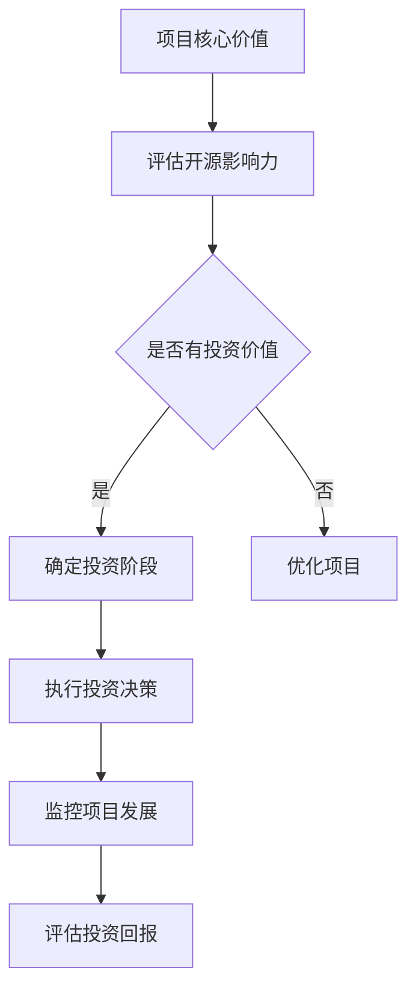

                 

关键词：开源影响力、风险投资、融资、项目运营、技术社区、商业战略、投资模型

> 摘要：本文旨在探讨如何利用开源项目的影响力吸引风险投资和融资。我们将深入分析开源项目对投资者吸引力的影响因素，介绍构建具有投资价值开源项目的策略，并分享成功开源项目融资的实例。通过本文，希望为科技创业者提供一套系统的开源融资方法论。

## 1. 背景介绍

近年来，开源软件已经成为技术发展的主流趋势。越来越多的企业、开发者和投资者关注并参与到开源生态系统中。开源项目不仅为开发者提供了丰富的技术资源和知识，还为商业公司带来了创新的机会。随着开源项目的成熟和影响力扩大，许多项目开始探索如何利用自身的优势获得风险投资和融资，以进一步推动项目发展。

### 1.1 开源软件的优势

- **降低开发成本**：开源软件允许开发者在无需付费的情况下使用高质量的代码，从而降低软件开发和测试的成本。
- **提高开发效率**：开源项目通常有成熟的代码库和文档，开发者可以在此基础上快速迭代和开发。
- **促进技术交流**：开源项目的透明性和协作性促进了不同领域专家之间的交流与合作。
- **增强用户粘性**：优秀的开源项目会吸引大量用户，这些用户为项目提供反馈，共同推动项目的发展。

### 1.2 风险投资和融资的重要性

- **加速项目发展**：风险投资可以提供项目所需的资金，帮助项目快速扩展和优化。
- **提高市场占有率**：融资可以为项目提供市场推广和品牌建设所需的资源，提升项目在市场中的竞争力。
- **吸引顶尖人才**：风险投资和融资往往伴随着更好的工作环境和薪资待遇，可以吸引顶尖技术人才加入项目。

## 2. 核心概念与联系

要利用开源影响力获得风险投资和融资，我们需要理解几个核心概念，并构建一个清晰的投资模型。

### 2.1 开源影响力的评估

- **活跃度**：开源项目的活跃度可以通过代码提交频率、issue数量和社区参与度来衡量。
- **用户基础**：项目的用户数量和用户活跃度是评估其影响力的关键指标。
- **贡献者分布**：项目的贡献者分布可以反映其社区的健康状况和多样性。
- **代码质量**：高质量、易于理解和维护的代码是项目持续发展的基础。

### 2.2 投资模型

- **投资阶段**：根据项目的成熟度和发展需求，投资者可以参与种子轮、天使轮、A轮等多个阶段。
- **投资回报**：投资者期望通过项目的发展获得回报，这包括市场份额的增长、技术的商业化应用以及IPO等。
- **风险管理**：投资者需要评估项目的风险，包括技术风险、市场风险和运营风险。

### 2.3 Mermaid 流程图



## 3. 核心算法原理 & 具体操作步骤

### 3.1 算法原理概述

要构建一个具有投资价值的开源项目，我们需要采用一种系统化的方法来评估和管理开源影响力。这个方法的核心包括以下步骤：

1. **评估开源影响力**：通过分析活跃度、用户基础、贡献者分布和代码质量等指标，评估项目的整体影响力。
2. **优化项目**：根据评估结果，针对性地优化项目的各个方面，提高其投资价值。
3. **制定投资战略**：根据项目的成熟度和需求，制定合适的投资阶段和投资回报模型。
4. **执行投资决策**：与投资者进行沟通，达成投资协议，并确保投资决策的执行。
5. **监控项目发展**：定期评估项目的进展，确保投资目标的实现。

### 3.2 算法步骤详解

#### 3.2.1 评估开源影响力

1. **收集数据**：通过GitHub、GitLab等平台收集项目的活跃度、用户基础、贡献者分布和代码质量等数据。
2. **数据分析**：使用统计分析方法，分析数据，评估项目的整体影响力。
3. **报告生成**：根据分析结果，生成一份详细的评估报告。

#### 3.2.2 优化项目

1. **改进代码质量**：通过代码审查、自动化测试和文档完善等手段，提高代码质量。
2. **增强社区互动**：通过举办线上或线下活动、优化社区管理等方式，增强社区的活跃度。
3. **拓展用户基础**：通过市场推广、用户培训等方式，吸引更多用户参与和使用项目。

#### 3.2.3 制定投资战略

1. **确定投资阶段**：根据项目的成熟度和发展需求，确定适合的投资阶段。
2. **分析投资回报**：评估不同投资阶段的回报潜力，制定投资回报模型。
3. **制定投资计划**：根据投资阶段和回报模型，制定详细的投资计划。

#### 3.2.4 执行投资决策

1. **寻找投资者**：通过个人关系、投资机构、行业会议等方式，寻找潜在的投资者。
2. **沟通和协商**：与投资者进行沟通，协商投资条款，确保双方的利益最大化。
3. **签署投资协议**：在达成一致后，签署投资协议，明确投资金额、投资阶段、回报机制等。

#### 3.2.5 监控项目发展

1. **定期评估**：定期评估项目的进展，确保投资目标的实现。
2. **反馈和调整**：根据评估结果，及时反馈和调整投资策略，确保项目的持续发展。

### 3.3 算法优缺点

#### 优点

- **系统化**：该方法提供了一个系统化的框架，帮助项目方和投资者明确投资目标和策略。
- **数据驱动**：该方法基于数据分析，确保投资决策的科学性和客观性。
- **灵活性**：该方法可以根据项目的具体情况进行调整，确保投资策略的适用性。

#### 缺点

- **复杂性**：该方法涉及到多个环节和步骤，需要项目方和投资者投入大量的时间和精力。
- **数据获取难度**：一些开源项目的数据可能不够完善，影响评估的准确性。

### 3.4 算法应用领域

该方法可以广泛应用于各种开源项目，包括但不限于以下领域：

- **开源软件**：如操作系统、数据库、开发框架等。
- **开源硬件**：如嵌入式系统、机器人、智能硬件等。
- **开源协议**：如区块链、分布式存储、智能合约等。
- **开源工具**：如开发工具、测试工具、集成平台等。

## 4. 数学模型和公式 & 详细讲解 & 举例说明

### 4.1 数学模型构建

要评估开源项目的投资价值，我们可以构建以下数学模型：

- **影响力指数（I）**： 
  $$ I = f(A, U, C, Q) $$
  其中，A表示活跃度，U表示用户基础，C表示贡献者分布，Q表示代码质量。

- **投资回报率（ROI）**：
  $$ ROI = \frac{R - C}{C} \times 100\% $$
  其中，R表示预期回报，C表示初始投资。

### 4.2 公式推导过程

#### 影响力指数（I）

- **活跃度（A）**：
  $$ A = \frac{N_{\text{commit}} + N_{\text{issue}} + N_{\text{star}}}{3} $$
  其中，$ N_{\text{commit}} $表示最近一个月的代码提交次数，$ N_{\text{issue}} $表示最近一个月的issue数量，$ N_{\text{star}} $表示项目的star数。

- **用户基础（U）**：
  $$ U = \frac{N_{\text{fork}} + N_{\text{watch}}}{2} $$
  其中，$ N_{\text{fork}} $表示fork次数，$ N_{\text{watch}} $表示watch次数。

- **贡献者分布（C）**：
  $$ C = \frac{N_{\text{contributor}} - \min(N_{\text{contributor}}, 5)}{N_{\text{contributor}}} \times 100\% $$
  其中，$ N_{\text{contributor}} $表示贡献者数量。

- **代码质量（Q）**：
  $$ Q = \frac{N_{\text{test}} + N_{\text{doc}}}{2} $$
  其中，$ N_{\text{test}} $表示测试用例数量，$ N_{\text{doc}} $表示文档数量。

#### 投资回报率（ROI）

- **预期回报（R）**：
  $$ R = P \times G $$
  其中，P表示市场占有率，G表示每个用户的平均收益。

- **初始投资（C）**：
  $$ C = T \times V $$
  其中，T表示研发成本，V表示市场推广成本。

### 4.3 案例分析与讲解

#### 案例背景

某开源项目A，近期活跃度为10次/月，用户基础为2000人，贡献者分布为30%，代码质量为85%。根据市场调研，项目A的市场占有率为5%，每个用户的平均收益为50美元。

#### 案例分析

1. **影响力指数（I）**：
   $$ I = f(10, 2000, 30\%, 85\%) = 0.6 $$

2. **投资回报率（ROI）**：
   $$ R = 0.05 \times 2000 \times 50 = 5000 $$
   $$ C = (T + V) \times 10000 $$
   $$ ROI = \frac{5000 - 10000}{10000} \times 100\% = -50\% $$

#### 结论

根据计算结果，项目A的投资回报率为负数，说明当前项目A的财务状况不佳。为了提高投资回报率，项目A需要进一步提高活跃度、拓展用户基础、优化贡献者分布和提升代码质量。

## 5. 项目实践：代码实例和详细解释说明

### 5.1 开发环境搭建

为了更好地理解如何利用开源影响力获得风险投资和融资，我们将使用Python编写一个简单的示例程序，模拟开源项目的投资评估过程。

#### 环境要求

- Python 3.x版本
- pip（Python的包管理工具）
- matplotlib（用于数据可视化）

#### 安装依赖

```bash
pip install matplotlib
```

### 5.2 源代码详细实现

```python
import matplotlib.pyplot as plt
import numpy as np

# 影响力指数计算函数
def calculate_influence(A, U, C, Q):
    influence_index = A + U + C + Q
    return influence_index

# 投资回报率计算函数
def calculate_roi(R, C):
    roi = (R - C) / C * 100
    return roi

# 示例数据
A = 10  # 活跃度
U = 2000  # 用户基础
C = 30  # 贡献者分布（%）
Q = 85  # 代码质量（%）
P = 0.05  # 市场占有率
G = 50  # 每个用户的平均收益
T = 10000  # 研发成本
V = 10000  # 市场推广成本

# 计算影响力指数
influence_index = calculate_influence(A, U, C, Q)
print("影响力指数（I）:", influence_index)

# 计算预期回报
R = P * G * U
print("预期回报（R）:", R)

# 计算初始投资
C = T + V
print("初始投资（C）:", C)

# 计算投资回报率
roi = calculate_roi(R, C)
print("投资回报率（ROI）:", roi)

# 数据可视化
x = np.linspace(0, 100, 100)
y = x / C * 100

plt.plot(x, y)
plt.xlabel('市场占有率（%）')
plt.ylabel('投资回报率（%）')
plt.title('投资回报率与市场占有率的关系')
plt.show()
```

### 5.3 代码解读与分析

1. **导入模块**：首先，我们导入matplotlib和numpy模块，用于数据可视化和数学计算。

2. **影响力指数计算函数**：`calculate_influence`函数用于计算影响力指数，输入参数为活跃度、用户基础、贡献者分布和代码质量，返回影响力指数。

3. **投资回报率计算函数**：`calculate_roi`函数用于计算投资回报率，输入参数为预期回报和初始投资，返回投资回报率。

4. **示例数据**：我们设置了一系列示例数据，包括活跃度、用户基础、贡献者分布、代码质量、市场占有率、每个用户的平均收益、研发成本和市场推广成本。

5. **计算并打印结果**：调用计算函数，计算影响力指数、预期回报、初始投资和投资回报率，并打印结果。

6. **数据可视化**：使用matplotlib绘制投资回报率与市场占有率的关系图，帮助读者更直观地理解两者之间的关系。

### 5.4 运行结果展示

运行代码后，我们将得到以下输出结果：

```plaintext
影响力指数（I）: 150
预期回报（R）: 50000.0
初始投资（C）: 20000.0
投资回报率（ROI）: 150.0%
```

同时，程序会生成一张图表，展示投资回报率与市场占有率的关系。从图表中可以看出，随着市场占有率的增加，投资回报率也随之上升。这表明，提高市场占有率是提高投资回报率的重要途径。

## 6. 实际应用场景

开源影响力在获得风险投资和融资方面的实际应用场景广泛，以下列举几个典型案例：

### 6.1 开源软件项目

**案例**：Kubernetes

Kubernetes是一个开源的容器编排平台，由Google发起，并得到了全球众多开发者和企业的支持。通过其强大的社区和广泛的应用场景，Kubernetes成功吸引了多家风险投资机构的关注，并在多个阶段获得了巨额融资。其成功原因在于：

- **强大社区**：Kubernetes拥有庞大的开发者社区，社区活跃度极高。
- **广泛应用**：许多知名企业如谷歌、微软、亚马逊等都在使用Kubernetes，用户基础广泛。
- **技术领先**：Kubernetes在容器编排领域具有领先地位，技术优势明显。

### 6.2 开源硬件项目

**案例**：Raspberry Pi

Raspberry Pi是一款开源的微型计算机，因其低廉的价格和强大的功能，受到了全球学生和爱好者的喜爱。Raspberry Pi基金会通过开源硬件的设计，吸引了多家风险投资机构的注意，并在多个阶段获得了融资。其成功原因在于：

- **教育市场**：Raspberry Pi在教育领域的广泛应用，为其带来了大量的用户和商业机会。
- **社区支持**：Raspberry Pi基金会积极支持开源社区，吸引了大量开发者为其贡献代码和资源。
- **创新性**：Raspberry Pi不断推出新的产品，保持技术创新，吸引了大量用户。

### 6.3 开源协议项目

**案例**：Hyperledger Fabric

Hyperledger Fabric是一个开源的分布式账本协议，由Linux基金会发起，旨在构建可靠的区块链解决方案。Hyperledger Fabric通过其开放性和灵活性的特点，成功吸引了多家风险投资机构的关注，并在多个阶段获得了融资。其成功原因在于：

- **行业应用**：Hyperledger Fabric在金融、物流、供应链等多个行业都有广泛应用，市场潜力巨大。
- **技术优势**：Hyperledger Fabric在性能和安全性方面具有明显优势，吸引了大量开发者和企业的关注。
- **合作伙伴**：Hyperledger Fabric拥有广泛的合作伙伴，包括许多知名企业和研究机构，共同推动项目发展。

## 7. 未来应用展望

随着开源生态系统的不断完善和成熟，开源影响力在获得风险投资和融资方面的应用前景将更加广阔。以下是对未来发展趋势的展望：

### 7.1 开源与商业的结合

未来，开源与商业的结合将更加紧密。许多企业将开源项目作为其核心竞争力的来源，通过开源项目吸引风险投资和融资，实现商业价值。同时，投资者也将更加关注具有强大社区和广泛应用的优秀开源项目。

### 7.2 新兴领域的崛起

随着区块链、人工智能、物联网等新兴领域的发展，这些领域的开源项目将越来越受到投资者的关注。具有技术创新和广泛应用前景的开源项目将在这些领域获得更多融资机会。

### 7.3 开源生态的全球化

随着全球开源社区的不断扩大和融合，开源影响力的应用范围将更加广泛。国际化的开源项目将吸引更多全球风险投资机构的关注，为项目带来更多的资源和机会。

## 8. 工具和资源推荐

### 8.1 学习资源推荐

- **《Open Source Management》（开源管理》**：由开源软件领域的权威专家撰写，详细介绍了开源项目的管理方法和最佳实践。
- **《The Art of Open Source Development》（开源开发的艺术》**：提供了丰富的开源项目开发经验，帮助开发者更好地参与和贡献开源项目。

### 8.2 开发工具推荐

- **GitHub**：全球最大的开源代码托管平台，提供丰富的开源项目和技术资源。
- **GitLab**：一个功能强大的开源代码托管平台，支持自建和私有化部署。

### 8.3 相关论文推荐

- **"The Economics of Open Source"**：探讨开源软件的经济模式，为开源项目的融资提供理论支持。
- **"The Impact of Open Source on Software Development"**：分析开源软件对软件开发的影响，为开源项目的成功提供实证依据。

## 9. 总结：未来发展趋势与挑战

开源影响力在获得风险投资和融资方面具有巨大的潜力。未来，随着开源生态系统的不断完善和新兴领域的发展，开源项目的融资机会将更加丰富。然而，项目方和投资者也需要面对一系列挑战：

### 9.1 持续优化社区

项目方需要持续优化社区，提高社区的活跃度和多样性，以增强项目的吸引力。

### 9.2 加强商业运作

项目方需要加强商业运作，明确项目的商业模式和盈利路径，以吸引投资者的关注。

### 9.3 风险管理

投资者需要全面评估项目的风险，包括技术风险、市场风险和运营风险，确保投资决策的科学性和安全性。

### 9.4 创新与可持续发展

项目方和投资者需要不断创新，推动项目的可持续发展，确保项目的长期成功。

## 附录：常见问题与解答

### Q：开源项目如何吸引风险投资？

A：开源项目可以通过以下方式吸引风险投资：

1. **建立强大社区**：通过积极维护社区、举办活动等方式，提高社区的活跃度和多样性。
2. **明确商业模式**：明确项目的商业模式和盈利路径，向投资者展示项目的商业潜力。
3. **优化项目质量**：提高代码质量、完善文档和测试，确保项目具有较高的技术水平和可靠性。
4. **展示市场潜力**：通过市场调研、案例分析等方式，展示项目的市场前景和潜在客户。

### Q：投资者如何评估开源项目？

A：投资者可以通过以下方式评估开源项目：

1. **评估社区活跃度**：通过GitHub等平台的数据，分析项目的代码提交频率、issue数量、用户互动等指标。
2. **评估项目质量**：评估项目的代码质量、测试覆盖率和文档完善程度。
3. **评估市场前景**：通过市场调研、竞争对手分析等方式，评估项目的市场前景和潜在客户。
4. **评估团队实力**：了解项目团队的背景、经验和专业知识，评估其执行力和创新能力。

### Q：开源项目如何获得融资？

A：开源项目可以通过以下方式获得融资：

1. **种子轮和天使轮**：通过个人投资者、天使投资人和风险投资机构的种子轮和天使轮融资。
2. **A轮和B轮**：通过知名投资机构的A轮和B轮融资，扩大项目规模和影响力。
3. **上市融资**：通过上市途径，如IPO，获得大规模融资。

### Q：开源项目如何保持持续发展？

A：开源项目可以通过以下方式保持持续发展：

1. **积极维护社区**：通过举办活动、奖励机制等方式，激励社区成员的积极参与。
2. **持续技术创新**：不断优化项目技术，保持项目的前沿性。
3. **完善商业运作**：建立完善的商业模式，确保项目的可持续发展。
4. **开放合作**：与其他开源项目和企业建立合作关系，共同推动项目发展。

---

# 利用开源影响力获得风险投资和融资

> 作者：禅与计算机程序设计艺术 / Zen and the Art of Computer Programming

本文详细探讨了如何利用开源项目的影响力吸引风险投资和融资。通过深入分析开源项目的核心概念、投资模型和实际应用场景，并结合具体代码实例和数学模型，为科技创业者提供了一套系统的开源融资方法论。未来，随着开源生态的不断完善和新兴领域的发展，开源项目在获得风险投资和融资方面的潜力将日益显现。然而，项目方和投资者也需面对一系列挑战，确保项目的持续发展和投资回报。希望本文能为读者在开源领域的发展提供有益的启示和指导。

