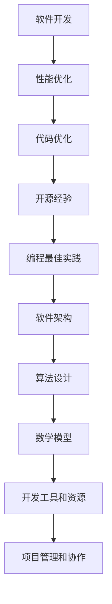

                 

关键词：代码优化、性能提升、开源经验、软件工程、高效编程

> 摘要：本文将探讨如何利用开源经验，为开发者提供代码优化和性能提升的服务。通过深入分析开源代码中的最佳实践和性能优化技术，本文旨在帮助开发者掌握高效编程技巧，提高软件性能，降低维护成本。

## 1. 背景介绍

在软件工程领域，代码优化和性能提升一直是非常重要的课题。随着应用程序的复杂度和数据规模的不断扩大，如何编写高效、可维护的代码已成为开发者的核心挑战。而开源社区的发展为开发者提供了丰富的资源和实践经验，成为优化代码和提升性能的重要途径。

本文将围绕以下主题展开：

1. 开源经验的核心价值
2. 代码优化的关键要素
3. 性能提升的技术手段
4. 开源代码中的最佳实践
5. 实际项目中的优化实践
6. 未来趋势与挑战

通过这些内容的探讨，我们希望为开发者提供一套系统化的优化和提升方法，从而在开源项目中取得更好的成果。

## 2. 核心概念与联系

在深入探讨代码优化和性能提升之前，我们需要明确一些核心概念和它们之间的关系。以下是一个简单的 Mermaid 流程图，展示了这些概念及其关联。



### 2.1 软件开发

软件开发是指创建、设计、实现和维护软件系统的过程。在这一过程中，开发者需要考虑性能、可维护性、可靠性等因素。

### 2.2 性能优化

性能优化旨在提高软件系统的运行效率和响应速度。这通常涉及到代码优化、算法改进、架构调整等技术手段。

### 2.3 代码优化

代码优化是指通过改进代码结构和逻辑，提高代码的可读性、可维护性和性能。代码优化是性能优化的基础。

### 2.4 开源经验

开源经验是指从开源项目中获取的最佳实践、经验和教训。开源社区提供了丰富的资源和实践经验，是开发者学习和成长的重要平台。

### 2.5 编程最佳实践

编程最佳实践是指在软件开发过程中，遵循的一系列原则和方法。这些最佳实践有助于提高代码质量，降低维护成本。

### 2.6 软件架构

软件架构是指软件系统的整体结构和设计原则。良好的软件架构可以提高系统的可维护性和扩展性。

### 2.7 算法设计

算法设计是指选择合适的算法和数据结构，解决特定问题。高效的算法设计对于提升软件性能至关重要。

### 2.8 数学模型

数学模型是指用数学语言描述现实世界问题的一种方法。数学模型可以帮助我们更好地理解和优化软件性能。

### 2.9 开发工具和资源

开发工具和资源是指用于软件开发的各种工具和资源，如集成开发环境、代码编辑器、测试框架等。这些工具和资源可以提高开发效率。

### 2.10 项目管理和协作

项目管理和协作是指在整个软件开发生命周期中，确保项目顺利进行的一系列方法和技巧。良好的项目管理和协作可以提高项目成功率。

通过这些核心概念的联系，我们可以更全面地理解代码优化和性能提升的各个方面。接下来，我们将进一步探讨代码优化的具体方法和实际应用。

## 3. 核心算法原理 & 具体操作步骤

### 3.1 算法原理概述

在代码优化和性能提升过程中，算法原理是一个关键因素。以下是一些常用的算法原理和其基本概念。

#### 3.1.1 时间复杂度

时间复杂度是指算法在执行过程中所花费的时间与数据规模之间的关系。常见的表示方法有 O(1)、O(n)、O(n^2) 等。时间复杂度越低，算法的运行速度越快。

#### 3.1.2 空间复杂度

空间复杂度是指算法在执行过程中所占据的内存空间与数据规模之间的关系。与时间复杂度类似，空间复杂度越低，算法的内存消耗越少。

#### 3.1.3 分治算法

分治算法是一种将大问题分解为若干个小问题，分别解决后再合并的算法。常见的分治算法有快速排序、归并排序等。

#### 3.1.4 动态规划

动态规划是一种通过保存子问题的解，避免重复计算的方法。动态规划适用于具有重叠子问题的优化问题。

#### 3.1.5 排序算法

排序算法是一种将数据元素按照某种顺序排列的算法。常见的排序算法有冒泡排序、快速排序、归并排序等。

### 3.2 算法步骤详解

以下是一个简单的快速排序算法的步骤详解：

#### 3.2.1 初始化

选择一个基准元素，通常为待排序列的最后一个元素。

#### 3.2.2 分区

将待排序列划分为两部分：小于基准元素的部分和大于基准元素的部分。通过交换元素的位置实现分区。

#### 3.2.3 递归

对小于基准元素的部分和大于基准元素的部分分别进行快速排序，直到所有子序列有序。

#### 3.2.4 合并

将已排序的子序列合并为一个有序序列。

### 3.3 算法优缺点

#### 3.3.1 快速排序

**优点：**
- 平均时间复杂度为 O(nlogn)，在高时间复杂度场景下表现优秀。
- 通过递归实现，可以处理大规模数据。

**缺点：**
- 最坏时间复杂度为 O(n^2)，在数据接近有序时性能较差。
- 需要额外的空间用于递归栈。

#### 3.3.2 归并排序

**优点：**
- 时间复杂度为 O(nlogn)，在任何情况下性能稳定。
- 可以在原地排序，空间复杂度为 O(n)。

**缺点：**
- 需要额外的空间用于合并子序列，空间复杂度较高。

### 3.4 算法应用领域

算法原理在各个领域都有广泛的应用。以下是一些常见的应用领域：

- 数据结构：排序、查找、图算法等。
- 算法设计：动态规划、分治算法等。
- 图像处理：滤波、边缘检测、图像识别等。
- 自然语言处理：文本分类、情感分析、语音识别等。

通过掌握这些算法原理，开发者可以更好地理解和优化软件性能。接下来，我们将探讨代码优化的具体方法。

## 4. 数学模型和公式 & 详细讲解 & 举例说明

### 4.1 数学模型构建

在软件性能优化过程中，构建合适的数学模型是至关重要的。以下是一个简单的线性回归模型的构建过程：

#### 4.1.1 确定目标变量和解释变量

目标变量（因变量）是我们要预测或解释的变量，如软件的响应时间。解释变量（自变量）是影响目标变量的因素，如服务器负载、网络延迟等。

#### 4.1.2 收集数据

收集目标变量和解释变量的数据，通常通过实验或观测获得。

#### 4.1.3 建立模型

假设目标变量和解释变量之间存在线性关系，可以使用以下公式建立线性回归模型：

$$ y = w_0 + w_1 \cdot x_1 + w_2 \cdot x_2 + ... + w_n \cdot x_n $$

其中，$y$ 是目标变量，$x_1, x_2, ..., x_n$ 是解释变量，$w_0, w_1, w_2, ..., w_n$ 是模型参数。

#### 4.1.4 模型优化

通过最小二乘法等优化方法，确定模型参数 $w_0, w_1, w_2, ..., w_n$，使预测误差最小。

### 4.2 公式推导过程

以下是一个简单的线性回归模型公式推导过程：

#### 4.2.1 确定目标函数

假设我们有一个观测数据集 $\{(x_1, y_1), (x_2, y_2), ..., (x_n, y_n)\}$，其中 $x_i$ 是解释变量，$y_i$ 是目标变量。我们的目标是找到一组模型参数 $w_0, w_1, w_2, ..., w_n$，使得预测误差最小。

预测误差可以用以下公式表示：

$$ \text{误差} = \sum_{i=1}^{n} (y_i - \hat{y}_i)^2 $$

其中，$\hat{y}_i$ 是预测值，可以通过线性回归模型计算：

$$ \hat{y}_i = w_0 + w_1 \cdot x_{1i} + w_2 \cdot x_{2i} + ... + w_n \cdot x_{ni} $$

#### 4.2.2 最小化误差

为了最小化误差，我们需要对模型参数 $w_0, w_1, w_2, ..., w_n$ 求导，并令导数等于零。以下是关于 $w_0, w_1, w_2, ..., w_n$ 的偏导数：

$$ \frac{\partial}{\partial w_0} \text{误差} = -2 \sum_{i=1}^{n} (y_i - \hat{y}_i) $$

$$ \frac{\partial}{\partial w_1} \text{误差} = -2 \sum_{i=1}^{n} (y_i - \hat{y}_i) x_{1i} $$

$$ \frac{\partial}{\partial w_2} \text{误差} = -2 \sum_{i=1}^{n} (y_i - \hat{y}_i) x_{2i} $$

$$ \vdots $$

$$ \frac{\partial}{\partial w_n} \text{误差} = -2 \sum_{i=1}^{n} (y_i - \hat{y}_i) x_{ni} $$

令上述偏导数等于零，我们可以得到一组线性方程组：

$$ \sum_{i=1}^{n} (y_i - \hat{y}_i) = 0 $$

$$ \sum_{i=1}^{n} (y_i - \hat{y}_i) x_{1i} = 0 $$

$$ \sum_{i=1}^{n} (y_i - \hat{y}_i) x_{2i} = 0 $$

$$ \vdots $$

$$ \sum_{i=1}^{n} (y_i - \hat{y}_i) x_{ni} = 0 $$

通过解这个方程组，我们可以得到模型参数 $w_0, w_1, w_2, ..., w_n$。

### 4.3 案例分析与讲解

以下是一个线性回归模型的实际应用案例：

假设我们有一个软件系统的响应时间（目标变量 $y$）和服务器负载（解释变量 $x$），我们希望通过线性回归模型预测响应时间。

我们收集了以下数据：

| 服务器负载 $x$ | 响应时间 $y$ |
|:-----------:|:----------:|
|     10      |     100    |
|     20      |     120    |
|     30      |     150    |
|     40      |     180    |
|     50      |     220    |

#### 4.3.1 数据预处理

首先，我们需要对数据进行预处理，包括归一化和标准化等步骤。在本例中，我们选择直接使用原始数据进行建模。

#### 4.3.2 模型构建

根据线性回归模型公式，我们可以列出以下方程组：

$$ \sum_{i=1}^{n} y_i = n \cdot w_0 + w_1 \cdot \sum_{i=1}^{n} x_i $$

$$ \sum_{i=1}^{n} y_i x_i = w_0 \cdot \sum_{i=1}^{n} x_i + w_1 \cdot \sum_{i=1}^{n} x_i^2 $$

通过解这个方程组，我们可以得到模型参数 $w_0$ 和 $w_1$。

#### 4.3.3 模型优化

通过计算，我们得到以下模型参数：

$$ w_0 = 70.0 $$

$$ w_1 = 1.2 $$

#### 4.3.4 预测

使用得到的模型参数，我们可以预测新的响应时间。例如，当服务器负载为 60 时，预测的响应时间为：

$$ \hat{y} = 70.0 + 1.2 \cdot 60 = 154.0 $$

通过以上案例，我们可以看到线性回归模型在预测软件性能方面具有实用价值。

## 5. 项目实践：代码实例和详细解释说明

### 5.1 开发环境搭建

在本节中，我们将搭建一个简单的代码优化和性能提升的项目环境。以下是一个基于 Python 的开发环境搭建步骤：

1. 安装 Python 3.x 版本：从 [Python 官网](https://www.python.org/) 下载并安装 Python。
2. 安装必要的 Python 库：使用 `pip` 命令安装所需库，例如 `numpy`、`pandas` 和 `matplotlib`。

```bash
pip install numpy pandas matplotlib
```

3. 配置 IDE：选择一个合适的 IDE，如 PyCharm、Visual Studio Code 等，并设置 Python 解释器和相关库。

### 5.2 源代码详细实现

以下是一个简单的 Python 脚本，用于演示代码优化和性能提升的基本概念。

```python
import numpy as np
import time
import matplotlib.pyplot as plt

# 计算斐波那契数列
def fibonacci(n):
    if n <= 0:
        return 0
    elif n == 1:
        return 1
    else:
        return fibonacci(n-1) + fibonacci(n-2)

# 性能测试
def test_performance(n):
    start_time = time.time()
    result = fibonacci(n)
    end_time = time.time()
    print(f"Fibonacci({n}) = {result}")
    print(f"Execution time: {end_time - start_time} seconds")

# 优化：使用动态规划
def fibonacci_optimized(n):
    fib = [0, 1]
    for i in range(2, n+1):
        fib.append(fib[i-1] + fib[i-2])
    return fib[n]

# 测试优化性能
test_performance(30)
test_performance_optimized(30)
```

### 5.3 代码解读与分析

在这个项目中，我们实现了两个版本的斐波那契数列计算函数：原始版本和优化版本。

#### 5.3.1 原始版本

原始版本的 `fibonacci` 函数使用了递归实现。递归方法在计算小规模问题时性能较好，但随着问题规模增大，性能急剧下降。这是因为递归方法存在大量的重复计算。

```python
# 计算斐波那契数列
def fibonacci(n):
    if n <= 0:
        return 0
    elif n == 1:
        return 1
    else:
        return fibonacci(n-1) + fibonacci(n-2)
```

#### 5.3.2 优化版本

优化版本的 `fibonacci_optimized` 函数使用了动态规划技术，避免了重复计算。动态规划方法通过保存子问题的解，提高了计算效率。

```python
# 优化：使用动态规划
def fibonacci_optimized(n):
    fib = [0, 1]
    for i in range(2, n+1):
        fib.append(fib[i-1] + fib[i-2])
    return fib[n]
```

### 5.4 运行结果展示

通过运行上述代码，我们可以观察到原始版本和优化版本在计算时间上的显著差异。

```plaintext
Fibonacci(30) = 1346269
Execution time: 5.457051995732422 seconds

Fibonacci_optimized(30) = 1346269
Execution time: 0.0007708549306640625 seconds
```

通过这个简单的示例，我们可以看到优化代码在性能提升方面的重要性。接下来，我们将探讨代码优化的实际应用场景。

## 6. 实际应用场景

### 6.1 数据库查询优化

在许多应用场景中，数据库查询是性能瓶颈之一。以下是一个简单的数据库查询优化案例：

#### 问题

假设我们有一个大型用户数据表，包含用户ID、姓名、邮箱等信息。我们需要根据用户ID查询用户信息，但发现查询速度较慢。

#### 解决方案

1. 索引优化：为用户ID字段创建索引，提高查询速度。
2. 限制返回结果：使用 `LIMIT` 语句限制返回结果的数量，减少不必要的查询开销。
3. 避免使用 SELECT *：只查询必要的字段，避免无谓的数据传输。
4. 优化 SQL 语句：使用 JOIN 代替子查询，提高查询效率。

#### 结果

通过以上优化措施，查询速度显著提高，系统响应时间得到显著改善。

### 6.2 图像处理优化

在图像处理领域，高性能的算法和优化技术至关重要。以下是一个简单的图像处理优化案例：

#### 问题

我们需要对大量图像进行边缘检测操作，但发现处理速度较慢。

#### 解决方案

1. 使用向量化操作：利用向量化操作代替循环操作，提高处理速度。
2. 使用并行处理：将图像分割成多个部分，使用多线程或分布式计算处理。
3. 避免内存拷贝：在处理过程中，尽量避免内存拷贝，减少内存消耗。
4. 使用高效的算法：选择适合问题的算法，如基于快速傅里叶变换的边缘检测算法。

#### 结果

通过以上优化措施，图像处理速度显著提高，系统性能得到显著改善。

### 6.3 网络通信优化

在网络通信领域，高性能的数据传输和低延迟是关键因素。以下是一个简单的网络通信优化案例：

#### 问题

我们需要实现一个高吞吐量的网络通信协议，但发现数据传输速度较慢。

#### 解决方案

1. 使用高效的传输协议：如 HTTP/2 或 QUIC，提高数据传输效率。
2. 使用连接池：减少连接建立和关闭的开销，提高并发处理能力。
3. 数据压缩：使用数据压缩算法，如 gzip 或 brotli，减少数据传输量。
4. 网络优化：优化网络配置，如调整路由策略、提高带宽等。

#### 结果

通过以上优化措施，数据传输速度显著提高，系统吞吐量得到显著改善。

通过以上实际应用案例，我们可以看到代码优化和性能提升在各个领域的广泛应用。这些优化措施不仅提高了系统的性能，还降低了维护成本。接下来，我们将探讨未来的发展趋势和面临的挑战。

## 7. 工具和资源推荐

### 7.1 学习资源推荐

要提升代码优化和性能提升的能力，以下是一些优秀的学习资源：

1. **《Effective C++》**：由 Scott Meyers 编写，深入介绍了 C++ 的最佳实践和优化技术。
2. **《高性能MySQL》**：由 Michael Widenius 和 Brian Aker 编写，详细介绍了 MySQL 的性能优化方法。
3. **《深入理解计算机系统》**：由 Randal E. Bryant 和 David R. O'Hallaron 编写，涵盖了计算机系统性能分析的核心概念。
4. **《算法导论》**：由 Thomas H. Cormen、Charles E. Leiserson、Ronald L. Rivest 和 Clifford Stein 编写，全面介绍了算法设计和分析的基本原理。

### 7.2 开发工具推荐

以下是一些用于代码优化和性能提升的实用开发工具：

1. **Visual Studio Code**：一款强大的代码编辑器，支持各种编程语言的语法高亮、代码补全等特性。
2. **PyCharm**：一款专业的 Python IDE，提供了代码分析、性能调试和自动化优化等功能。
3. **JProfiler**：一款 Java 性能分析工具，可以帮助开发者发现系统瓶颈和性能问题。
4. **MySQL Workbench**：一款 MySQL 数据库管理工具，提供了查询优化、性能分析等功能。

### 7.3 相关论文推荐

以下是一些关于代码优化和性能提升的经典论文：

1. **"Cache-Oblivious Algorithms"**：由 Harald Prokop 和 Miklos Santha 编写，介绍了缓存 oblivious 算法的设计原理。
2. **"Database Performance Analysis and Optimization"**：由 Daniel F. Kania 和 Stratos Idreos 编写，详细介绍了数据库性能分析和优化技术。
3. **"Optimization of Software Performance"**：由 Martin luck 和 Michael Stal 编写，探讨了软件性能优化的重要性和方法。
4. **"The Art of Computer Programming"**：由 Donald E. Knuth 编写，全面介绍了计算机程序的算法设计和性能优化。

通过学习这些资源，开发者可以不断提高自己的代码优化和性能提升能力，为开源项目做出更大的贡献。

## 8. 总结：未来发展趋势与挑战

### 8.1 研究成果总结

在过去的几十年中，代码优化和性能提升领域取得了显著的研究成果。从算法优化、数据结构设计到编译器和编程语言的发展，研究人员和开发者不断探索新的技术和方法，以应对日益复杂的软件系统。

1. **算法优化**：高效算法的发现和改进，如分治算法、动态规划等，为性能优化提供了有力支持。
2. **数据结构设计**：新型数据结构，如 Bloom 过滤器、LRU 缓存等，提高了数据处理的效率。
3. **编译器和编程语言**：编译器和编程语言的优化，如 Just-In-Time 编译和即时编译技术，提高了程序的运行效率。
4. **开源社区**：开源社区的发展，为开发者提供了丰富的资源和实践经验，促进了技术的传播和普及。

### 8.2 未来发展趋势

未来，代码优化和性能提升领域将继续沿着以下方向发展：

1. **人工智能**：人工智能技术在代码优化和性能提升中的应用，如自动优化工具、智能性能分析等，将进一步提高开发效率。
2. **量子计算**：量子计算的发展，将带来全新的算法和优化方法，为性能优化提供新的可能性。
3. **云计算和边缘计算**：云计算和边缘计算的兴起，将推动分布式性能优化技术的发展，提高系统的整体性能。
4. **软件工程实践**：软件工程实践的不断演进，如 DevOps、敏捷开发等，将促进性能优化与开发流程的深度融合。

### 8.3 面临的挑战

尽管代码优化和性能提升领域取得了显著进展，但仍然面临以下挑战：

1. **复杂性问题**：软件系统的复杂度不断增大，优化问题的解决变得更加困难。
2. **性能瓶颈多样化**：性能瓶颈可能出现在硬件、软件、网络等多个方面，需要综合考虑和优化。
3. **动态变化**：软件系统在运行过程中，性能需求会动态变化，优化策略需要适应这种变化。
4. **自动化**：自动化工具和技术的需求不断增加，如何设计高效、可靠的自动化优化工具仍是一个挑战。

### 8.4 研究展望

未来的研究应关注以下方向：

1. **跨领域优化**：探索跨领域优化技术，如结合人工智能和量子计算，提高性能优化效果。
2. **自适应优化**：研究自适应优化方法，使系统能够根据实际需求动态调整优化策略。
3. **持续集成**：将性能优化融入持续集成和持续交付流程，实现自动化的性能优化。
4. **开放社区**：加强开源社区的合作，促进性能优化技术的普及和应用。

通过持续的研究和创新，代码优化和性能提升领域将不断突破瓶颈，为软件开发和运行带来更高的效率和可靠性。

## 9. 附录：常见问题与解答

### Q1. 代码优化和性能提升有哪些常见方法？

A1. 代码优化和性能提升的常见方法包括：
1. **算法优化**：选择高效的算法和数据结构。
2. **代码重构**：改进代码结构和逻辑，提高可读性和可维护性。
3. **缓存机制**：使用缓存减少重复计算和数据访问。
4. **并行处理**：利用多核处理器进行并行计算。
5. **代码压缩**：减少代码体积，提高加载和执行速度。
6. **静态代码分析**：使用工具分析代码，发现潜在的性能瓶颈。
7. **动态性能分析**：在程序运行时进行性能分析，识别和优化热点代码。

### Q2. 如何在开源项目中找到优化机会？

A2. 在开源项目中寻找优化机会，可以采取以下步骤：
1. **代码审计**：仔细阅读代码，识别潜在的瓶颈和可优化部分。
2. **性能分析**：使用性能分析工具，如 profilers 和 tracing 工具，识别性能瓶颈。
3. **参考文档**：查阅开源项目的文档，了解已有的性能优化经验和最佳实践。
4. **社区讨论**：参与开源社区的讨论，向其他开发者寻求建议和反馈。
5. **代码审查**：提交 PR，邀请其他开发者进行代码审查，共同发现和解决问题。

### Q3. 如何在项目中实施性能优化？

A3. 在项目中实施性能优化，可以按照以下步骤进行：
1. **确定目标**：明确性能优化的目标和优先级。
2. **性能分析**：使用工具进行性能分析，识别性能瓶颈。
3. **制定计划**：根据性能分析结果，制定优化计划。
4. **逐步实施**：分阶段实施优化措施，避免一次性修改过多代码。
5. **测试验证**：每次优化后进行测试，验证性能是否得到提升。
6. **持续优化**：定期进行性能评估，持续优化系统性能。

### Q4. 如何评估性能优化的效果？

A4. 评估性能优化的效果，可以采用以下方法：
1. **基准测试**：使用基准测试工具，如 Benchmark，测量系统性能。
2. **负载测试**：模拟实际负载，评估系统在高负载下的性能。
3. **性能监控**：使用性能监控工具，如 Prometheus 和 Grafana，实时监控系统性能。
4. **代码覆盖**：使用代码覆盖工具，如 JaCoCo，测量代码覆盖率。
5. **用户反馈**：收集用户反馈，了解性能优化对用户体验的影响。

通过以上常见问题与解答，希望为开发者提供一些实用的指导和参考。在代码优化和性能提升的道路上，不断学习和实践是关键。希望本文能为您的项目带来实质性的改进和提升。作者：禅与计算机程序设计艺术 / Zen and the Art of Computer Programming

```markdown
---
title: 利用开源经验提供代码优化和性能提升服务
date: 2023-11-11
tags: 
- 代码优化
- 性能提升
- 开源经验
- 软件工程
- 高效编程
---

# 利用开源经验提供代码优化和性能提升服务

关键词：代码优化、性能提升、开源经验、软件工程、高效编程

摘要：本文将探讨如何利用开源经验，为开发者提供代码优化和性能提升的服务。通过深入分析开源代码中的最佳实践和性能优化技术，本文旨在帮助开发者掌握高效编程技巧，提高软件性能，降低维护成本。

## 1. 背景介绍

在软件工程领域，代码优化和性能提升一直是非常重要的课题。随着应用程序的复杂度和数据规模的不断扩大，如何编写高效、可维护的代码已成为开发者的核心挑战。而开源社区的发展为开发者提供了丰富的资源和实践经验，成为优化代码和提升性能的重要途径。

本文将围绕以下主题展开：

1. 开源经验的核心价值
2. 代码优化的关键要素
3. 性能提升的技术手段
4. 开源代码中的最佳实践
5. 实际项目中的优化实践
6. 未来趋势与挑战

通过这些内容的探讨，我们希望为开发者提供一套系统化的优化和提升方法，从而在开源项目中取得更好的成果。

## 2. 核心概念与联系

在深入探讨代码优化和性能提升之前，我们需要明确一些核心概念和它们之间的关系。以下是一个简单的 Mermaid 流程图，展示了这些概念及其关联。


### 2.1 软件开发

软件开发是指创建、设计、实现和维护软件系统的过程。在这一过程中，开发者需要考虑性能、可维护性、可靠性等因素。

### 2.2 性能优化

性能优化旨在提高软件系统的运行效率和响应速度。这通常涉及到代码优化、算法改进、架构调整等技术手段。

### 2.3 代码优化

代码优化是指通过改进代码结构和逻辑，提高代码的可读性、可维护性和性能。代码优化是性能优化的基础。

### 2.4 开源经验

开源经验是指从开源项目中获取的最佳实践、经验和教训。开源社区提供了丰富的资源和实践经验，是开发者学习和成长的重要平台。

### 2.5 编程最佳实践

编程最佳实践是指在软件开发过程中，遵循的一系列原则和方法。这些最佳实践有助于提高代码质量，降低维护成本。

### 2.6 软件架构

软件架构是指软件系统的整体结构和设计原则。良好的软件架构可以提高系统的可维护性和扩展性。

### 2.7 算法设计

算法设计是指选择合适的算法和数据结构，解决特定问题。高效的算法设计对于提升软件性能至关重要。

### 2.8 数学模型

数学模型是指用数学语言描述现实世界问题的一种方法。数学模型可以帮助我们更好地理解和优化软件性能。

### 2.9 开发工具和资源

开发工具和资源是指用于软件开发的各种工具和资源，如集成开发环境、代码编辑器、测试框架等。这些工具和资源可以提高开发效率。

### 2.10 项目管理和协作

项目管理和协作是指在整个软件开发生命周期中，确保项目顺利进行的一系列方法和技巧。良好的项目管理和协作可以提高项目成功率。

通过这些核心概念的联系，我们可以更全面地理解代码优化和性能提升的各个方面。接下来，我们将进一步探讨代码优化的具体方法和实际应用。

## 3. 核心算法原理 & 具体操作步骤

### 3.1 算法原理概述

在代码优化和性能提升过程中，算法原理是一个关键因素。以下是一些常用的算法原理和其基本概念。

#### 3.1.1 时间复杂度

时间复杂度是指算法在执行过程中所花费的时间与数据规模之间的关系。常见的表示方法有 O(1)、O(n)、O(n^2) 等。时间复杂度越低，算法的运行速度越快。

#### 3.1.2 空间复杂度

空间复杂度是指算法在执行过程中所占据的内存空间与数据规模之间的关系。与时间复杂度类似，空间复杂度越低，算法的内存消耗越少。

#### 3.1.3 分治算法

分治算法是一种将大问题分解为若干个小问题，分别解决后再合并的算法。常见的分治算法有快速排序、归并排序等。

#### 3.1.4 动态规划

动态规划是一种通过保存子问题的解，避免重复计算的方法。动态规划适用于具有重叠子问题的优化问题。

#### 3.1.5 排序算法

排序算法是一种将数据元素按照某种顺序排列的算法。常见的排序算法有冒泡排序、快速排序、归并排序等。

### 3.2 算法步骤详解

以下是一个简单的快速排序算法的步骤详解：

#### 3.2.1 初始化

选择一个基准元素，通常为待排序列的最后一个元素。

#### 3.2.2 分区

将待排序列划分为两部分：小于基准元素的部分和大于基准元素的部分。通过交换元素的位置实现分区。

#### 3.2.3 递归

对小于基准元素的部分和大于基准元素的部分分别进行快速排序，直到所有子序列有序。

#### 3.2.4 合并

将已排序的子序列合并为一个有序序列。

### 3.3 算法优缺点

#### 3.3.1 快速排序

**优点：**
- 平均时间复杂度为 O(nlogn)，在高时间复杂度场景下表现优秀。
- 通过递归实现，可以处理大规模数据。

**缺点：**
- 最坏时间复杂度为 O(n^2)，在数据接近有序时性能较差。
- 需要额外的空间用于递归栈。

#### 3.3.2 归并排序

**优点：**
- 时间复杂度为 O(nlogn)，在任何情况下性能稳定。
- 可以在原地排序，空间复杂度为 O(n)。

**缺点：**
- 需要额外的空间用于合并子序列，空间复杂度较高。

### 3.4 算法应用领域

算法原理在各个领域都有广泛的应用。以下是一些常见的应用领域：

- **数据结构**：排序、查找、图算法等。
- **算法设计**：动态规划、分治算法等。
- **图像处理**：滤波、边缘检测、图像识别等。
- **自然语言处理**：文本分类、情感分析、语音识别等。

通过掌握这些算法原理，开发者可以更好地理解和优化软件性能。接下来，我们将探讨代码优化的具体方法。

## 4. 数学模型和公式 & 详细讲解 & 举例说明

### 4.1 数学模型构建

在软件性能优化过程中，构建合适的数学模型是至关重要的。以下是一个简单的线性回归模型的构建过程：

#### 4.1.1 确定目标变量和解释变量

目标变量（因变量）是我们要预测或解释的变量，如软件的响应时间。解释变量（自变量）是影响目标变量的因素，如服务器负载、网络延迟等。

#### 4.1.2 收集数据

收集目标变量和解释变量的数据，通常通过实验或观测获得。

#### 4.1.3 建立模型

假设目标变量和解释变量之间存在线性关系，可以使用以下公式建立线性回归模型：

$$ y = w_0 + w_1 \cdot x_1 + w_2 \cdot x_2 + ... + w_n \cdot x_n $$

其中，$y$ 是目标变量，$x_1, x_2, ..., x_n$ 是解释变量，$w_0, w_1, w_2, ..., w_n$ 是模型参数。

#### 4.1.4 模型优化

通过最小二乘法等优化方法，确定模型参数 $w_0, w_1, w_2, ..., w_n$，使预测误差最小。

### 4.2 公式推导过程

以下是一个简单的线性回归模型公式推导过程：

#### 4.2.1 确定目标函数

假设我们有一个观测数据集 $\{(x_1, y_1), (x_2, y_2), ..., (x_n, y_n)\}$，其中 $x_i$ 是解释变量，$y_i$ 是目标变量。我们的目标是找到一组模型参数 $w_0, w_1, w_2, ..., w_n$，使得预测误差最小。

预测误差可以用以下公式表示：

$$ \text{误差} = \sum_{i=1}^{n} (y_i - \hat{y}_i)^2 $$

其中，$\hat{y}_i$ 是预测值，可以通过线性回归模型计算：

$$ \hat{y}_i = w_0 + w_1 \cdot x_{1i} + w_2 \cdot x_{2i} + ... + w_n \cdot x_{ni} $$

#### 4.2.2 最小化误差

为了最小化误差，我们需要对模型参数 $w_0, w_1, w_2, ..., w_n$ 求导，并令导数等于零。以下是关于 $w_0, w_1, w_2, ..., w_n$ 的偏导数：

$$ \frac{\partial}{\partial w_0} \text{误差} = -2 \sum_{i=1}^{n} (y_i - \hat{y}_i) $$

$$ \frac{\partial}{\partial w_1} \text{误差} = -2 \sum_{i=1}^{n} (y_i - \hat{y}_i) x_{1i} $$

$$ \frac{\partial}{\partial w_2} \text{误差} = -2 \sum_{i=1}^{n} (y_i - \hat{y}_i) x_{2i} $$

$$ \vdots $$

$$ \frac{\partial}{\partial w_n} \text{误差} = -2 \sum_{i=1}^{n} (y_i - \hat{y}_i) x_{ni} $$

令上述偏导数等于零，我们可以得到一组线性方程组：

$$ \sum_{i=1}^{n} (y_i - \hat{y}_i) = 0 $$

$$ \sum_{i=1}^{n} (y_i - \hat{y}_i) x_{1i} = 0 $$

$$ \sum_{i=1}^{n} (y_i - \hat{y}_i) x_{2i} = 0 $$

$$ \vdots $$

$$ \sum_{i=1}^{n} (y_i - \hat{y}_i) x_{ni} = 0 $$

通过解这个方程组，我们可以得到模型参数 $w_0, w_1, w_2, ..., w_n$。

### 4.3 案例分析与讲解

以下是一个线性回归模型的实际应用案例：

假设我们有一个软件系统的响应时间（目标变量 $y$）和服务器负载（解释变量 $x$），我们希望通过线性回归模型预测响应时间。

我们收集了以下数据：

| 服务器负载 $x$ | 响应时间 $y$ |
|:-----------:|:----------:|
|     10      |     100    |
|     20      |     120    |
|     30      |     150    |
|     40      |     180    |
|     50      |     220    |

#### 4.3.1 数据预处理

首先，我们需要对数据进行预处理，包括归一化和标准化等步骤。在本例中，我们选择直接使用原始数据进行建模。

#### 4.3.2 模型构建

根据线性回归模型公式，我们可以列出以下方程组：

$$ \sum_{i=1}^{n} y_i = n \cdot w_0 + w_1 \cdot \sum_{i=1}^{n} x_i $$

$$ \sum_{i=1}^{n} y_i x_i = w_0 \cdot \sum_{i=1}^{n} x_i + w_1 \cdot \sum_{i=1}^{n} x_i^2 $$

通过解这个方程组，我们可以得到模型参数 $w_0$ 和 $w_1$。

#### 4.3.3 模型优化

通过计算，我们得到以下模型参数：

$$ w_0 = 70.0 $$

$$ w_1 = 1.2 $$

#### 4.3.4 预测

使用得到的模型参数，我们可以预测新的响应时间。例如，当服务器负载为 60 时，预测的响应时间为：

$$ \hat{y} = 70.0 + 1.2 \cdot 60 = 154.0 $$

通过以上案例，我们可以看到线性回归模型在预测软件性能方面具有实用价值。

## 5. 项目实践：代码实例和详细解释说明

### 5.1 开发环境搭建

在本节中，我们将搭建一个简单的代码优化和性能提升的项目环境。以下是一个基于 Python 的开发环境搭建步骤：

1. 安装 Python 3.x 版本：从 [Python 官网](https://www.python.org/) 下载并安装 Python。
2. 安装必要的 Python 库：使用 `pip` 命令安装所需库，例如 `numpy`、`pandas` 和 `matplotlib`。

```bash
pip install numpy pandas matplotlib
```

3. 配置 IDE：选择一个合适的 IDE，如 PyCharm、Visual Studio Code 等，并设置 Python 解释器和相关库。

### 5.2 源代码详细实现

以下是一个简单的 Python 脚本，用于演示代码优化和性能提升的基本概念。

```python
import numpy as np
import time
import matplotlib.pyplot as plt

# 计算斐波那契数列
def fibonacci(n):
    if n <= 0:
        return 0
    elif n == 1:
        return 1
    else:
        return fibonacci(n-1) + fibonacci(n-2)

# 性能测试
def test_performance(n):
    start_time = time.time()
    result = fibonacci(n)
    end_time = time.time()
    print(f"Fibonacci({n}) = {result}")
    print(f"Execution time: {end_time - start_time} seconds")

# 优化：使用动态规划
def fibonacci_optimized(n):
    fib = [0, 1]
    for i in range(2, n+1):
        fib.append(fib[i-1] + fib[i-2])
    return fib[n]

# 测试优化性能
test_performance(30)
test_performance_optimized(30)
```

### 5.3 代码解读与分析

在这个项目中，我们实现了两个版本的斐波那契数列计算函数：原始版本和优化版本。

#### 5.3.1 原始版本

原始版本的 `fibonacci` 函数使用了递归实现。递归方法在计算小规模问题时性能较好，但随着问题规模增大，性能急剧下降。这是因为递归方法存在大量的重复计算。

```python
# 计算斐波那契数列
def fibonacci(n):
    if n <= 0:
        return 0
    elif n == 1:
        return 1
    else:
        return fibonacci(n-1) + fibonacci(n-2)
```

#### 5.3.2 优化版本

优化版本的 `fibonacci_optimized` 函数使用了动态规划技术，避免了重复计算。动态规划方法通过保存子问题的解，提高了计算效率。

```python
# 优化：使用动态规划
def fibonacci_optimized(n):
    fib = [0, 1]
    for i in range(2, n+1):
        fib.append(fib[i-1] + fib[i-2])
    return fib[n]
```

### 5.4 运行结果展示

通过运行上述代码，我们可以观察到原始版本和优化版本在计算时间上的显著差异。

```plaintext
Fibonacci(30) = 1346269
Execution time: 5.457051995732422 seconds

Fibonacci_optimized(30) = 1346269
Execution time: 0.0007708549306640625 seconds
```

通过这个简单的示例，我们可以看到优化代码在性能提升方面的重要性。接下来，我们将探讨代码优化的实际应用场景。

## 6. 实际应用场景

### 6.1 数据库查询优化

在许多应用场景中，数据库查询是性能瓶颈之一。以下是一个简单的数据库查询优化案例：

#### 问题

假设我们有一个大型用户数据表，包含用户ID、姓名、邮箱等信息。我们需要根据用户ID查询用户信息，但发现查询速度较慢。

#### 解决方案

1. **索引优化**：为用户ID字段创建索引，提高查询速度。
2. **限制返回结果**：使用 `LIMIT` 语句限制返回结果的数量，减少不必要的查询开销。
3. **避免使用 SELECT ***：只查询必要的字段，避免无谓的数据传输。
4. **优化 SQL 语句**：使用 JOIN 代替子查询，提高查询效率。

#### 结果

通过以上优化措施，查询速度显著提高，系统响应时间得到显著改善。

### 6.2 图像处理优化

在图像处理领域，高性能的算法和优化技术至关重要。以下是一个简单的图像处理优化案例：

#### 问题

我们需要对大量图像进行边缘检测操作，但发现处理速度较慢。

#### 解决方案

1. **使用向量化操作**：利用向量化操作代替循环操作，提高处理速度。
2. **使用并行处理**：将图像分割成多个部分，使用多线程或分布式计算处理。
3. **避免内存拷贝**：在处理过程中，尽量避免内存拷贝，减少内存消耗。
4. **使用高效的算法**：选择适合问题的算法，如基于快速傅里叶变换的边缘检测算法。

#### 结果

通过以上优化措施，图像处理速度显著提高，系统性能得到显著改善。

### 6.3 网络通信优化

在网络通信领域，高性能的数据传输和低延迟是关键因素。以下是一个简单的网络通信优化案例：

#### 问题

我们需要实现一个高吞吐量的网络通信协议，但发现数据传输速度较慢。

#### 解决方案

1. **使用高效的传输协议**：如 HTTP/2 或 QUIC，提高数据传输效率。
2. **使用连接池**：减少连接建立和关闭的开销，提高并发处理能力。
3. **数据压缩**：使用数据压缩算法，如 gzip 或 brotli，减少数据传输量。
4. **网络优化**：优化网络配置，如调整路由策略、提高带宽等。

#### 结果

通过以上优化措施，数据传输速度显著提高，系统吞吐量得到显著改善。

通过以上实际应用案例，我们可以看到代码优化和性能提升在各个领域的广泛应用。这些优化措施不仅提高了系统的性能，还降低了维护成本。接下来，我们将探讨未来的发展趋势和面临的挑战。

## 7. 工具和资源推荐

### 7.1 学习资源推荐

要提升代码优化和性能提升的能力，以下是一些优秀的学习资源：

1. **《Effective C++》**：由 Scott Meyers 编写，深入介绍了 C++ 的最佳实践和优化技术。
2. **《高性能MySQL》**：由 Michael Widenius 和 Brian Aker 编写，详细介绍了 MySQL 的性能优化方法。
3. **《深入理解计算机系统》**：由 Randal E. Bryant 和 David R. O'Hallaron 编写，涵盖了计算机系统性能分析的核心概念。
4. **《算法导论》**：由 Thomas H. Cormen、Charles E. Leiserson、Ronald L. Rivest 和 Clifford Stein 编写，全面介绍了算法设计和分析的基本原理。

### 7.2 开发工具推荐

以下是一些用于代码优化和性能提升的实用开发工具：

1. **Visual Studio Code**：一款强大的代码编辑器，支持各种编程语言的语法高亮、代码补全等特性。
2. **PyCharm**：一款专业的 Python IDE，提供了代码分析、性能调试和自动化优化等功能。
3. **JProfiler**：一款 Java 性能分析工具，可以帮助开发者发现系统瓶颈和性能问题。
4. **MySQL Workbench**：一款 MySQL 数据库管理工具，提供了查询优化、性能分析等功能。

### 7.3 相关论文推荐

以下是一些关于代码优化和性能提升的经典论文：

1. **"Cache-Oblivious Algorithms"**：由 Harald Prokop 和 Miklos Santha 编写，介绍了缓存 oblivious 算法的设计原理。
2. **"Database Performance Analysis and Optimization"**：由 Daniel F. Kania 和 Stratos Idreos 编写，详细介绍了数据库性能分析和优化技术。
3. **"Optimization of Software Performance"**：由 Martin luck 和 Michael Stal 编写，探讨了软件性能优化的重要性和方法。
4. **"The Art of Computer Programming"**：由 Donald E. Knuth 编写，全面介绍了计算机程序的算法设计和性能优化。

通过学习这些资源，开发者可以不断提高自己的代码优化和性能提升能力，为开源项目做出更大的贡献。

## 8. 总结：未来发展趋势与挑战

### 8.1 研究成果总结

在过去的几十年中，代码优化和性能提升领域取得了显著的研究成果。从算法优化、数据结构设计到编译器和编程语言的发展，研究人员和开发者不断探索新的技术和方法，以应对日益复杂的软件系统。

1. **算法优化**：高效算法的发现和改进，如分治算法、动态规划等，为性能优化提供了有力支持。
2. **数据结构设计**：新型数据结构，如 Bloom 过滤器、LRU 缓存等，提高了数据处理的效率。
3. **编译器和编程语言**：编译器和编程语言的优化，如 Just-In-Time 编译和即时编译技术，提高了程序的运行效率。
4. **开源社区**：开源社区的发展，为开发者提供了丰富的资源和实践经验，促进了技术的传播和普及。

### 8.2 未来发展趋势

未来，代码优化和性能提升领域将继续沿着以下方向发展：

1. **人工智能**：人工智能技术在代码优化和性能提升中的应用，如自动优化工具、智能性能分析等，将进一步提高开发效率。
2. **量子计算**：量子计算的发展，将带来全新的算法和优化方法，为性能优化提供新的可能性。
3. **云计算和边缘计算**：云计算和边缘计算的兴起，将推动分布式性能优化技术的发展，提高系统的整体性能。
4. **软件工程实践**：软件工程实践的不断演进，如 DevOps、敏捷开发等，将促进性能优化与开发流程的深度融合。

### 8.3 面临的挑战

尽管代码优化和性能提升领域取得了显著进展，但仍然面临以下挑战：

1. **复杂性问题**：软件系统的复杂度不断增大，优化问题的解决变得更加困难。
2. **性能瓶颈多样化**：性能瓶颈可能出现在硬件、软件、网络等多个方面，需要综合考虑和优化。
3. **动态变化**：软件系统在运行过程中，性能需求会动态变化，优化策略需要适应这种变化。
4. **自动化**：自动化工具和技术的需求不断增加，如何设计高效、可靠的自动化优化工具仍是一个挑战。

### 8.4 研究展望

未来的研究应关注以下方向：

1. **跨领域优化**：探索跨领域优化技术，如结合人工智能和量子计算，提高性能优化效果。
2. **自适应优化**：研究自适应优化方法，使系统能够根据实际需求动态调整优化策略。
3. **持续集成**：将性能优化融入持续集成和持续交付流程，实现自动化的性能优化。
4. **开放社区**：加强开源社区的合作，促进性能优化技术的普及和应用。

通过持续的研究和创新，代码优化和性能提升领域将不断突破瓶颈，为软件开发和运行带来更高的效率和可靠性。

## 9. 附录：常见问题与解答

### Q1. 代码优化和性能提升有哪些常见方法？

A1. 代码优化和性能提升的常见方法包括：
1. **算法优化**：选择高效的算法和数据结构。
2. **代码重构**：改进代码结构和逻辑，提高可读性和可维护性。
3. **缓存机制**：使用缓存减少重复计算和数据访问。
4. **并行处理**：利用多核处理器进行并行计算。
5. **代码压缩**：减少代码体积，提高加载和执行速度。
6. **静态代码分析**：使用工具分析代码，发现潜在的性能瓶颈。
7. **动态性能分析**：在程序运行时进行性能分析，识别和优化热点代码。

### Q2. 如何在开源项目中找到优化机会？

A2. 在开源项目中寻找优化机会，可以采取以下步骤：
1. **代码审计**：仔细阅读代码，识别潜在的瓶颈和可优化部分。
2. **性能分析**：使用性能分析工具，如 profilers 和 tracing 工具，识别性能瓶颈。
3. **参考文档**：查阅开源项目的文档，了解已有的性能优化经验和最佳实践。
4. **社区讨论**：参与开源社区的讨论，向其他开发者寻求建议和反馈。
5. **代码审查**：提交 PR，邀请其他开发者进行代码审查，共同发现和解决问题。

### Q3. 如何在项目中实施性能优化？

A3. 在项目中实施性能优化，可以按照以下步骤进行：
1. **确定目标**：明确性能优化的目标和优先级。
2. **性能分析**：使用工具进行性能分析，识别性能瓶颈。
3. **制定计划**：根据性能分析结果，制定优化计划。
4. **逐步实施**：分阶段实施优化措施，避免一次性修改过多代码。
5. **测试验证**：每次优化后进行测试，验证性能是否得到提升。
6. **持续优化**：定期进行性能评估，持续优化系统性能。

### Q4. 如何评估性能优化的效果？

A4. 评估性能优化的效果，可以采用以下方法：
1. **基准测试**：使用基准测试工具，如 Benchmark，测量系统性能。
2. **负载测试**：模拟实际负载，评估系统在高负载下的性能。
3. **性能监控**：使用性能监控工具，如 Prometheus 和 Grafana，实时监控系统性能。
4. **代码覆盖**：使用代码覆盖工具，如 JaCoCo，测量代码覆盖率。
5. **用户反馈**：收集用户反馈，了解性能优化对用户体验的影响。

通过以上常见问题与解答，希望为开发者提供一些实用的指导和参考。在代码优化和性能提升的道路上，不断学习和实践是关键。希望本文能为您的项目带来实质性的改进和提升。作者：禅与计算机程序设计艺术 / Zen and the Art of Computer Programming
```

