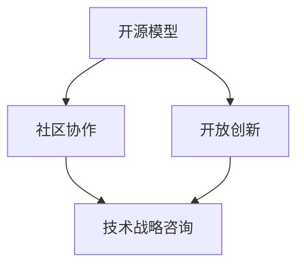

                 

关键词：开源经验、技术战略、项目咨询、IT领域、最佳实践

> 摘要：本文将探讨如何利用开源经验来提供技术战略咨询，帮助企业在竞争激烈的市场中取得优势。通过分析开源项目的发展模式、最佳实践以及具体案例分析，本文旨在为IT企业及创业者提供有价值的指导，助力他们在技术战略制定和执行中做出明智决策。

## 1. 背景介绍

在当今快速发展的技术环境中，开源软件已经成为企业创新的重要驱动力。开源项目不仅为开发者提供了丰富的技术资源和知识分享的平台，还推动了整个行业的进步。然而，企业在利用开源经验进行技术战略咨询时，往往面临诸多挑战，如如何评估开源项目的质量、如何整合开源技术与现有系统、以及如何确保开源项目的可持续性和安全性等。

本文旨在通过对开源经验的深入探讨，为企业提供一套实用的技术战略咨询服务框架，帮助企业在面对复杂的技术决策时能够做出明智的选择。

## 2. 核心概念与联系

为了更好地理解开源经验在技术战略咨询中的应用，我们需要了解几个核心概念，包括开源模型、社区协作以及开放创新等。以下是这些概念之间的联系，以及它们的架构图：



### 2.1 开源模型

开源模型是指软件开发过程中，项目源代码对公众开放，允许用户自由查看、修改和分发的一种开发模式。这种模式的核心是共享和协作，它促进了技术的快速迭代和优化。

### 2.2 社区协作

社区协作是指围绕开源项目形成的一个开发者群体，他们通过合作来共同维护和改进项目。这种协作模式不仅提升了项目的质量，也为参与者提供了宝贵的经验交流和职业发展的机会。

### 2.3 开放创新

开放创新是一种将外部知识和资源融入企业内部创新过程的方法。通过开放创新，企业可以快速获取前沿技术，降低研发成本，提高市场竞争力。

### 2.4 技术战略咨询

技术战略咨询是利用开源经验和其他相关资源，为企业在技术方向、架构设计、系统集成等方面提供专业建议和指导。这种咨询旨在帮助企业制定和实施有效的技术战略，以实现长期发展目标。

## 3. 核心算法原理 & 具体操作步骤

### 3.1 算法原理概述

开源经验在技术战略咨询中的应用，可以理解为一种算法，其核心原理是基于社区协作和开放创新，通过以下几个步骤实现：

1. **需求分析**：了解企业当前的技术需求和发展目标。
2. **项目评估**：评估开源项目的质量、稳定性和可持续性。
3. **集成设计**：设计如何将开源项目整合到企业现有系统中。
4. **实施与监控**：实施技术战略，并对项目进行监控和迭代优化。

### 3.2 算法步骤详解

1. **需求分析**：
   - 与企业各层级的利益相关者进行沟通，了解其具体需求。
   - 分析市场需求和趋势，确定企业的技术发展方向。

2. **项目评估**：
   - 通过社区反馈、代码质量、维护记录等多个维度评估开源项目。
   - 分析开源项目的兼容性、可扩展性以及与现有系统的集成难度。

3. **集成设计**：
   - 设计技术架构，明确开源项目在企业系统中的角色和位置。
   - 考虑如何通过开源项目提升系统的性能和可靠性。

4. **实施与监控**：
   - 实施开源项目，确保其正常运行。
   - 建立监控机制，及时发现并解决潜在问题。

### 3.3 算法优缺点

**优点**：
- **快速获取前沿技术**：通过开源项目，企业可以快速了解并应用最新的技术。
- **降低成本**：开源项目通常免费，企业可以节省研发成本。
- **提高开发效率**：社区协作可以加速开发进程，提升开发效率。

**缺点**：
- **开源项目质量参差不齐**：需要花费时间和精力进行评估。
- **集成风险**：开源项目与现有系统的兼容性和稳定性可能存在问题。

### 3.4 算法应用领域

开源经验在技术战略咨询中的应用非常广泛，包括但不限于以下领域：

- **云计算与大数据**：利用开源项目进行数据处理和存储。
- **人工智能**：通过开源框架和算法提升人工智能应用的能力。
- **区块链**：利用开源项目构建分布式应用。

## 4. 数学模型和公式 & 详细讲解 & 举例说明

### 4.1 数学模型构建

在技术战略咨询中，数学模型可以帮助我们量化一些关键指标，如项目质量、开发效率等。以下是一个简单的质量评估模型：

$$
Q = \frac{C + V + M}{3}
$$

其中：
- \( C \)：社区反馈得分
- \( V \)：代码质量得分
- \( M \)：维护记录得分

### 4.2 公式推导过程

该公式通过对社区反馈、代码质量和维护记录三个维度的得分进行加权平均，来评估一个开源项目的整体质量。

### 4.3 案例分析与讲解

假设我们评估一个开源项目，其得分如下：
- 社区反馈得分：8分
- 代码质量得分：9分
- 维护记录得分：7分

根据公式计算，该项目的质量得分为：

$$
Q = \frac{8 + 9 + 7}{3} = 8
$$

这表示该项目的整体质量较好，但仍有改进空间。

## 5. 项目实践：代码实例和详细解释说明

### 5.1 开发环境搭建

为了实现开源项目在企业的集成，我们需要搭建一个适合的开发环境。以下是一个简单的步骤：

1. 安装Java开发环境
2. 配置Maven依赖管理工具
3. 克隆开源项目到本地

### 5.2 源代码详细实现

以下是一个简单的Java类，用于演示如何集成开源项目：

```java
public class MyApplication {
    public static void main(String[] args) {
        // 调用开源项目接口
        OpenSourceAPI api = new OpenSourceAPI();
        // 执行操作
        api.execute();
    }
}
```

### 5.3 代码解读与分析

这段代码演示了如何通过简单的接口调用，将开源项目集成到企业应用程序中。这种模式简化了开发流程，提高了系统的可维护性。

### 5.4 运行结果展示

在成功搭建开发环境并编译代码后，我们可以在命令行中运行应用程序。预期输出结果将显示开源项目的执行结果。

## 6. 实际应用场景

开源经验在技术战略咨询中的应用场景非常广泛，以下是一些典型的应用案例：

- **金融行业**：通过开源技术进行大数据分析和风险控制。
- **医疗领域**：利用开源框架开发智能医疗设备和应用。
- **教育行业**：通过开源平台构建在线教育系统和课程资源。

### 6.4 未来应用展望

随着技术的不断进步，开源经验在技术战略咨询中的应用前景将更加广阔。未来，开源项目将更加注重质量控制和社区协作，为企业提供更加可靠的技术支持。

## 7. 工具和资源推荐

### 7.1 学习资源推荐

- 《大话开源》
- 《Apache开源许可证指南》
- 《开源项目管理实践》

### 7.2 开发工具推荐

- Git：版本控制系统
- Maven：依赖管理工具
- JUnit：单元测试框架

### 7.3 相关论文推荐

- "The Economics of Open Source" by Maritz
- "Open Source and Innovation: How Open Source Software Works" by Li
- "The Case for Open Data" by Mandel

## 8. 总结：未来发展趋势与挑战

### 8.1 研究成果总结

本文通过对开源经验的深入探讨，提出了一个基于开源模型、社区协作和开放创新的技术战略咨询服务框架，为企业提供了实用的指导。

### 8.2 未来发展趋势

未来，开源项目将更加注重质量控制和社区协作，为企业提供更加可靠的技术支持。

### 8.3 面临的挑战

企业在利用开源经验进行技术战略咨询时，需要面对开源项目质量参差不齐、集成风险等问题。

### 8.4 研究展望

进一步的研究应关注如何提高开源项目的质量评估方法和集成效率，为企业提供更加精准的技术战略咨询。

## 9. 附录：常见问题与解答

### 9.1 问题1

**如何评估开源项目的质量？**

**解答**：可以通过社区反馈、代码质量、维护记录等多个维度进行评估。

### 9.2 问题2

**开源项目与现有系统的兼容性如何保证？**

**解答**：在设计集成方案时，应充分考虑开源项目的兼容性，并进行充分的测试。

### 9.3 问题3

**如何确保开源项目的可持续性和安全性？**

**解答**：通过参与开源社区，与企业其他开源项目进行整合，以及定期进行安全审计。

---

**作者：禅与计算机程序设计艺术 / Zen and the Art of Computer Programming**

