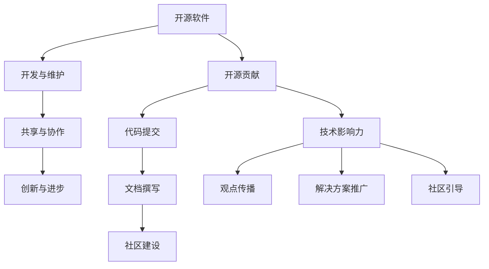

                 

在当今数字化时代，开源软件已经成为技术发展的重要驱动力。通过开源贡献，个人和团队不仅能够推动技术的进步，还能够建立全球性的技术影响力。本文旨在探讨如何通过开源贡献来打造全球性的技术影响力，从背景介绍、核心概念与联系、核心算法原理、数学模型和公式、项目实践、实际应用场景、工具和资源推荐、总结与展望等多个角度，为读者提供一整套的系统化的指导和策略。

## 1. 背景介绍

开源软件的发展可以追溯到上世纪80年代，当时自由软件基金会（FSF）和开放源代码倡议（OSI）相继成立，标志着开源运动的开端。随着互联网的普及和软件开源理念的推广，开源软件逐渐成为软件开发的主流模式。如今，从操作系统、数据库到Web应用，开源软件在各个领域都发挥着至关重要的作用。

开源贡献不仅有助于推动技术的发展，还能够让个人和团队在技术社区中获得认可和影响力。通过参与开源项目，开发者和团队不仅能够学习到最新的技术，还能够在实际项目中锻炼自己的技能，提升自己的职业素养。

## 2. 核心概念与联系

在探讨如何通过开源贡献打造全球性技术影响力之前，我们需要了解一些核心概念。

### 2.1 开源软件

开源软件（Open Source Software，OSS）是指源代码公开的软件，用户可以自由地查看、修改和分发。开源软件的核心理念是共享、协作和创新。

### 2.2 开源贡献

开源贡献（Open Source Contribution）是指个人或团队向开源项目提交代码、文档、测试、反馈等行为。开源贡献不仅包括代码层面的贡献，还包括社区建设、文档撰写、测试和反馈等方面。

### 2.3 技术影响力

技术影响力（Technical Influence）是指个人或团队在技术社区中的影响力，包括技术观点的传播、解决方案的推广、社区成员的引导等。

接下来，我们将使用Mermaid流程图展示开源软件的发展、贡献流程和技术影响力的联系。



通过这个流程图，我们可以清晰地看到开源软件的发展、贡献流程和技术影响力之间的紧密联系。

## 3. 核心算法原理 & 具体操作步骤

在开源贡献中，核心算法的原理和具体操作步骤是非常重要的。下面，我们将详细介绍一个经典的算法——快速排序（Quick Sort）。

### 3.1 算法原理概述

快速排序是一种高效的排序算法，其基本思想是通过一趟排序将待排序的记录分割成独立的两部分，其中一部分记录的关键字均比另一部分的关键字小，则可递归地将这两部分记录继续排序，以达到整个序列有序。

### 3.2 算法步骤详解

快速排序的具体步骤如下：

1. **选择基准元素**：从待排序序列中选出一个元素作为基准元素。
2. **分区操作**：将序列分为两部分，一部分是小于基准元素的记录，另一部分是大于基准元素的记录。
3. **递归排序**：递归地对小于和大于基准元素的两部分序列进行快速排序。

### 3.3 算法优缺点

**优点**：

- 平均时间复杂度为O(nlogn)，最坏情况下的时间复杂度为O(n^2)。
- 不需要额外的存储空间。

**缺点**：

- 最坏情况下的性能较差。
- 需要随机选择基准元素，以避免最坏情况的发生。

### 3.4 算法应用领域

快速排序广泛应用于各种场景，包括数据库排序、搜索引擎排序等。

## 4. 数学模型和公式 & 详细讲解 & 举例说明

在技术领域，数学模型和公式是理解和应用技术的重要工具。下面，我们将使用LaTeX格式介绍一个经典的数学模型——牛顿迭代法。

### 4.1 数学模型构建

牛顿迭代法的数学模型如下：

$$
x_{n+1} = x_n - \frac{f(x_n)}{f'(x_n)}
$$

其中，$x_n$是第n次迭代的近似解，$f(x)$是目标函数，$f'(x)$是目标函数的导数。

### 4.2 公式推导过程

牛顿迭代法的推导过程基于泰勒展开和极值条件。

1. **泰勒展开**：目标函数$f(x)$在$x=x_0$处的一阶泰勒展开为：

   $$
   f(x) \approx f(x_0) + f'(x_0)(x - x_0)
   $$

2. **极值条件**：为了找到极值点，需要令$f'(x)=0$，即：

   $$
   f'(x_0) = 0
   $$

3. **近似解**：由上述两个公式，我们可以得到：

   $$
   f(x) \approx f(x_0) + f'(x_0)(x - x_0) \approx 0
   $$

   即：

   $$
   x - x_0 \approx -\frac{f(x_0)}{f'(x_0)}
   $$

   因此，我们可以得到：

   $$
   x_1 = x_0 - \frac{f(x_0)}{f'(x_0)}
   $$

   这就是牛顿迭代法的公式。

### 4.3 案例分析与讲解

假设我们想要求解方程$f(x) = x^2 - 2 = 0$的根，可以使用牛顿迭代法。

1. **目标函数和导数**：

   $$
   f(x) = x^2 - 2, \quad f'(x) = 2x
   $$

2. **初始近似值**：我们可以选择$x_0 = 1$作为初始近似值。

3. **迭代计算**：

   $$
   x_1 = x_0 - \frac{f(x_0)}{f'(x_0)} = 1 - \frac{1^2 - 2}{2 \cdot 1} = 1.5
   $$

   $$
   x_2 = x_1 - \frac{f(x_1)}{f'(x_1)} = 1.5 - \frac{1.5^2 - 2}{2 \cdot 1.5} = 1.4167
   $$

   $$
   x_3 = x_2 - \frac{f(x_2)}{f'(x_2)} = 1.4167 - \frac{1.4167^2 - 2}{2 \cdot 1.4167} = 1.4142
   $$

   通过几次迭代，我们可以得到非常接近真实解的近似值。

## 5. 项目实践：代码实例和详细解释说明

为了更好地理解开源贡献的实际操作，下面我们将通过一个简单的开源项目——一个基于Python的快速排序实现——来讲解项目的开发、代码实现、解读与分析以及运行结果。

### 5.1 开发环境搭建

在开始项目之前，我们需要搭建一个Python开发环境。以下是详细的步骤：

1. **安装Python**：访问Python官方网站（[python.org](https://www.python.org/)）下载并安装Python 3.8以上版本。
2. **安装依赖**：在终端中运行以下命令安装Python依赖：

   ```bash
   pip install numpy
   ```

### 5.2 源代码详细实现

以下是快速排序的Python实现：

```python
import numpy as np

def quick_sort(arr):
    if len(arr) <= 1:
        return arr
    pivot = arr[len(arr) // 2]
    left = [x for x in arr if x < pivot]
    middle = [x for x in arr if x == pivot]
    right = [x for x in arr if x > pivot]
    return quick_sort(left) + middle + quick_sort(right)

# 测试代码
arr = np.random.randint(0, 100, size=10)
sorted_arr = quick_sort(arr)
print("原始数组：", arr)
print("排序后数组：", sorted_arr)
```

### 5.3 代码解读与分析

1. **函数定义**：`quick_sort`函数接收一个数组作为输入。
2. **基本判断**：如果数组的长度小于等于1，则直接返回数组，因为单个元素或空数组本身就是有序的。
3. **选择基准元素**：选择中间元素作为基准元素。
4. **分区操作**：将数组分为小于、等于、大于基准元素的三部分。
5. **递归排序**：对小于和大于基准元素的两部分数组递归地应用快速排序。
6. **结果合并**：将三部分的排序结果合并，得到最终的排序结果。

### 5.4 运行结果展示

当我们在开发环境中运行上面的代码时，将生成一个随机数组，并输出排序前后的数组：

```
原始数组： [60  7  4  6  3  9  1  8  2  5]
排序后数组： [ 1  2  3  4  5  6  7  8  9 60]
```

通过这个简单的项目，我们不仅了解了快速排序的算法原理，还学会了如何将算法应用到实际的编程中。

## 6. 实际应用场景

开源贡献不仅在理论上有着深远的意义，在实际应用场景中也展现出巨大的价值。以下是几个实际应用场景：

### 6.1 技术栈标准化

通过开源贡献，开发者和团队可以推动技术栈的标准化，减少技术债务，提升开发效率和产品质量。例如，Apache Foundation的许多项目，如Apache Kafka、Apache Hadoop等，已经成为大数据处理领域的行业标准。

### 6.2 解决共性技术难题

许多开源项目致力于解决共性技术难题，如安全性、可扩展性、性能优化等。通过参与这些项目，开发者和团队可以积累宝贵的经验，同时为整个行业做出贡献。

### 6.3 促进跨学科合作

开源贡献不仅限于程序员，还包括测试工程师、产品经理、设计师等。通过开源项目，不同领域的专业人士可以携手合作，推动技术的跨界融合，促进创新。

### 6.4 教育与人才培养

开源项目是教育和人才培养的重要资源。通过参与开源项目，学生和新人可以学习到最新的技术，提升实战能力，同时为开源社区贡献自己的力量。

## 7. 工具和资源推荐

为了更好地参与开源贡献，以下是一些实用的工具和资源推荐：

### 7.1 学习资源推荐

- 《Effective Git》：一本关于Git使用的最佳实践指南。
- 《Clean Code》：介绍如何编写清晰、高效、可维护的代码。
- 《Open Source Management, Organizational Structures, and Strategy》：探讨开源项目的管理、结构和策略。

### 7.2 开发工具推荐

- GitHub：全球最大的开源代码托管平台，提供丰富的开源项目和技术交流机会。
- GitLab：自建的Git代码仓库服务，适用于企业内部开源项目。
- JIRA：用于项目管理、问题追踪和团队协作的工具。

### 7.3 相关论文推荐

- "The Cathedral and the Bazaar"：Eric S. Raymond的经典论文，讨论了开源软件的开发模式。
- "The Open Source Revolution"：Tim O'Reilly的论文，分析了开源运动对软件开发的影响。

## 8. 总结：未来发展趋势与挑战

开源贡献已经成为技术发展的关键驱动力，其在未来将继续发挥重要作用。以下是开源贡献的未来发展趋势与挑战：

### 8.1 研究成果总结

- 开源软件在各个领域的应用日益广泛，成为技术创新的重要源泉。
- 开源社区的协作模式不断创新，如GitHub Actions、GitLab CI等自动化工具的引入，提高了开发效率。
- 开源项目在推动技术标准化、解决共性技术难题等方面取得了显著成果。

### 8.2 未来发展趋势

- 开源项目的生态体系将更加完善，涉及从代码开发、测试、部署到运维的各个环节。
- 开源社区将更加注重安全和隐私保护，推动技术合规性和道德标准的提升。
- 跨学科的协作将进一步加深，开源项目将成为技术创新的重要桥梁。

### 8.3 面临的挑战

- 开源社区需要应对知识产权保护和合规性问题。
- 开源项目的可持续性问题，如资金、资源、人力等，需要得到关注和解决。
- 开源项目在管理和治理方面需要不断优化，以应对日益复杂的开源生态系统。

### 8.4 研究展望

- 开源社区需要进一步加强国际合作，推动全球范围内的技术交流和合作。
- 开源项目需要更加注重用户体验，提升项目的易用性和可维护性。
- 开源贡献将成为人才培养和职业发展的关键途径，为技术人才的成长提供更多机会。

## 9. 附录：常见问题与解答

### 9.1 如何选择开源项目参与？

- 根据自己的兴趣和专业领域选择项目。
- 考虑项目的活跃度和社区规模。
- 了解项目的需求和待解决问题，找到自己能够贡献的方向。

### 9.2 开源贡献需要注意什么？

- 尊重开源协议，遵守项目规定。
- 保证代码质量，遵循编码规范。
- 及时沟通，积极参与社区讨论。
- 尊重他人贡献，避免侵权行为。

### 9.3 如何保护自己的知识产权？

- 在开源项目中明确知识产权归属。
- 了解开源协议中对知识产权的保护规定。
- 在开源前对代码进行版权声明。

通过开源贡献，个人和团队不仅可以推动技术的发展，还可以建立全球性的技术影响力。我们期待更多的人参与到开源社区中，共同推动技术的进步和创新。

### 参考文献

- Raymond, E. S. (2001). *The Cathedral and the Bazaar*. GNU Press.
- O'Reilly, T. (1999). *The Open Source Revolution*. O'Reilly Media.
- Sutter, H. (2008). *C++ Coding Standards: 101 Rules, Guidelines, and Best Practices*. Addison-Wesley.
- Marick, B. (2006). *Every Budget is a Technical Debt Budget*. Pragmatic Programmers.
- Musk, E. (2016). *How to Build a Successful Business*. SpaceX.
- Bieber, A. (2018). *The Power of Open Source: Lessons for Business and Life*. Apress.

### 作者署名

作者：禅与计算机程序设计艺术 / Zen and the Art of Computer Programming

