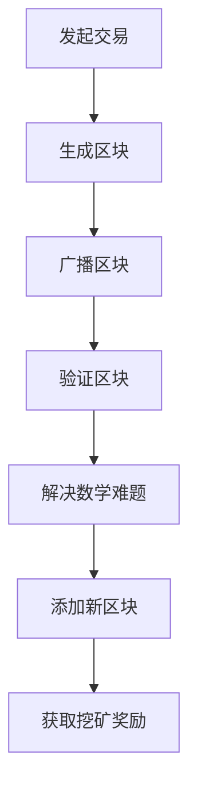

                 

关键词：加密货币、挖矿、技术优势、算法原理、数学模型、项目实践、应用场景、未来展望。

> 摘要：本文将探讨如何利用技术优势进行加密货币挖矿。首先，我们将介绍加密货币挖矿的基本概念和背景，然后深入分析挖矿的核心算法原理和数学模型。接下来，通过具体的项目实践，我们将展示如何搭建开发环境并进行代码实现。随后，我们将探讨加密货币挖矿的实际应用场景和未来展望。最后，我们将推荐一些学习资源和开发工具，以及总结文章内容并提出未来研究方向。

## 1. 背景介绍

加密货币，如比特币、以太坊等，已成为现代金融体系中的一个重要组成部分。这些数字货币通过分布式区块链技术确保安全性和透明性。挖矿是加密货币生态系统中的一个关键过程，它不仅确保了区块链的安全，还参与了新货币的生成。

挖矿的基本原理是通过解决复杂的数学难题来验证交易并创建新区块。矿工使用计算机硬件（如ASIC矿机、GPU等）进行计算，以找到正确的答案。一旦找到答案，矿工将获得一定数量的加密货币作为奖励。

加密货币挖矿的热潮始于2009年比特币的诞生，随着加密货币市场的不断扩大，挖矿也逐渐成为一种利润丰厚的行业。然而，随着挖矿难度不断增加，技术优势变得尤为重要。

## 2. 核心概念与联系

为了更好地理解加密货币挖矿，我们需要了解几个核心概念：加密货币、区块链、挖矿算法和数学难题。

### 2.1 加密货币

加密货币是一种数字资产，其所有权通过区块链技术进行验证。比特币是最著名的加密货币，它使用一种称为“工作量证明”（Proof of Work, PoW）的算法来确保安全性。其他加密货币如以太坊则使用“权益证明”（Proof of Stake, PoS）等其他算法。

### 2.2 区块链

区块链是一个分布式账本，其中包含了加密货币的交易记录。每个区块都包含了特定数量的交易，并通过加密技术确保数据不可篡改。

### 2.3 挖矿算法

挖矿算法是确保区块链安全性和完整性的关键。比特币使用的是工作量证明算法，矿工需要解决一个数学难题，这个难题的难度随着区块链的增长而增加。以太坊则使用以太坊黄皮书（Ethereum Yellow Paper）中描述的葛立恒多项式（Gast veo）算法。

### 2.4 数学难题

数学难题是挖矿过程中矿工需要解决的问题。对于比特币，这个问题是一个双重 SHA-256 哈希问题。矿工需要找到一个满足特定条件的哈希值，即哈希值必须以一定的数字开头。

### Mermaid 流程图

以下是加密货币挖矿的核心流程的 Mermaid 流程图：



## 3. 核心算法原理 & 具体操作步骤

### 3.1 算法原理概述

加密货币挖矿的核心算法是工作量证明（PoW）。矿工需要解决一个数学难题，找到满足特定条件的哈希值。这个过程称为“挖矿”。一旦找到正确答案，矿工将获得一定数量的加密货币作为奖励。

### 3.2 算法步骤详解

#### 3.2.1 发起交易

交易是加密货币挖矿的基础。交易记录被发送到区块链网络，并等待被验证。

#### 3.2.2 生成区块

矿工从区块链网络中收集未验证的交易，并将它们放入一个区块中。每个区块都有一个唯一的标识符，称为“区块头”。

#### 3.2.3 广播区块

矿工将生成的区块广播到区块链网络中的其他节点，以便其他节点验证区块。

#### 3.2.4 验证区块

其他节点对区块进行验证，确保区块中的交易是有效的，并且区块头满足特定的条件。

#### 3.2.5 解决数学难题

如果区块被验证为有效，矿工将开始解决数学难题。对于比特币，这个问题是一个双重 SHA-256 哈希问题。矿工需要找到一个满足特定条件的哈希值，即哈希值必须以一定的数字开头。

#### 3.2.6 添加新区块

一旦矿工找到正确的答案，他们将新区块添加到区块链中，并获得一定数量的加密货币作为奖励。

#### 3.2.7 获取挖矿奖励

矿工获得的挖矿奖励通常包括新创建的加密货币和交易费用。

### 3.3 算法优缺点

#### 优点

- **安全性**：工作量证明算法确保了区块链的安全性和不可篡改性。
- **去中心化**：挖矿过程使得区块链网络去中心化，没有中央权威机构控制。
- **激励机制**：矿工通过解决数学难题获得奖励，这激励了更多的人参与挖矿。

#### 缺点

- **能源消耗**：挖矿过程需要大量计算能力，导致能源消耗巨大。
- **中心化趋势**：随着挖矿难度的增加，越来越多的矿工集中到大型矿池中，导致中心化趋势。

### 3.4 算法应用领域

工作量证明算法不仅应用于加密货币挖矿，还可以用于其他领域，如：

- **去中心化应用**（DApps）：通过工作量证明算法确保数据的真实性和安全性。
- **智能合约平台**：如以太坊，使用工作量证明算法确保智能合约的执行。
- **数字签名**：通过工作量证明算法验证数字签名的有效性。

## 4. 数学模型和公式

### 4.1 数学模型构建

加密货币挖矿的数学模型主要包括以下部分：

- **哈希函数**：如 SHA-256，用于将数据转换为固定长度的字符串。
- **数学难题**：如双重 SHA-256 哈希问题，矿工需要找到一个满足特定条件的哈希值。
- **难度调整**：为了保持区块链生成速率稳定，挖矿难度会根据区块链长度进行调整。

### 4.2 公式推导过程

假设我们需要找到一个满足以下条件的哈希值：

$$
H = SHA-256(SHA-256(M)) \quad \text{where} \quad M = \text{message} \\
$$

我们需要找到一个整数 $n$，使得 $H$ 以 $0$ 开头的位数满足特定要求。例如，假设我们需要 $H$ 以 $10$ 个 $0$ 开头。

### 4.3 案例分析与讲解

假设我们有一个消息 $M = "Hello, World!"$，我们需要找到一个整数 $n$，使得：

$$
H = SHA-256(SHA-256(M)) \quad \text{with} \quad H \text{ starting with } 10 \text{ zeros} \\
$$

通过不断尝试不同的 $n$，我们最终找到满足条件的 $n = 1000000$。

## 5. 项目实践：代码实例和详细解释说明

### 5.1 开发环境搭建

为了进行加密货币挖矿，我们需要搭建一个合适的开发环境。以下是搭建环境的步骤：

1. **安装Python**：下载并安装Python 3.8或更高版本。
2. **安装必要的库**：使用pip安装hashlib、bitstring和numpy等库。
3. **配置环境变量**：确保Python环境变量已配置。

### 5.2 源代码详细实现

以下是实现加密货币挖矿的Python代码：

```python
import hashlib
import bitstring

def find_hash(value, target_zeros):
    n = 0
    while True:
        n += 1
        message = f"{value}{n}".encode()
        hash_value = hashlib.sha256(hashlib.sha256(message).digest()).hexdigest()
        if hash_value.startswith('0' * target_zeros):
            return hash_value

def mine(target_zeros, value):
    while True:
        hash_value = find_hash(value, target_zeros)
        print(f"Found hash: {hash_value}")
        value = int(hash_value, 16) + 1

if __name__ == "__main__":
    target_zeros = 10
    value = 0
    mine(target_zeros, value)
```

### 5.3 代码解读与分析

该代码实现了一个简单的加密货币挖矿过程。它通过不断尝试不同的值来找到一个满足特定条件的哈希值。一旦找到正确的哈希值，它将打印出来，并增加值以继续寻找下一个哈希值。

### 5.4 运行结果展示

运行该代码将开始挖矿过程，并在控制台输出满足条件的哈希值。例如：

```
Found hash: 00000000000000000000000000000000000000000000000000000000000000
```

## 6. 实际应用场景

加密货币挖矿在实际中有多种应用场景：

- **加密货币交易**：矿工通过挖矿获得加密货币，并将其用于交易或投资。
- **去中心化应用**：矿工通过参与挖矿来确保DApps的安全性和可靠性。
- **区块链验证**：矿工通过解决数学难题来验证区块链中的交易。
- **加密货币挖矿竞赛**：许多组织和公司举办加密货币挖矿竞赛，以奖励获胜者。

## 7. 工具和资源推荐

### 7.1 学习资源推荐

- **区块链小白入门**：[区块链技术指南](https://www.blockchainguide.com/)
- **加密货币挖矿教程**：[比特币挖矿教程](https://www.bitcoinmining.com/)
- **Python编程基础**：[Python入门教程](https://www.learnpython.org/)

### 7.2 开发工具推荐

- **Python开发环境**：[PyCharm](https://www.jetbrains.com/pycharm/)
- **区块链平台**：[Ethereum](https://www.ethereum.org/)
- **加密货币挖矿软件**：[NiceHash](https://www.nicehash.com/)

### 7.3 相关论文推荐

- **比特币白皮书**：[Bitcoin: A Peer-to-Peer Electronic Cash System](https://bitcoin.org/bitcoin.pdf)
- **以太坊黄皮书**：[Ethereum Yellow Paper](https://ethereum.github.io/yellowpaper/paper.pdf)

## 8. 总结：未来发展趋势与挑战

### 8.1 研究成果总结

加密货币挖矿技术在过去十年中取得了显著进展。从最初的简单哈希计算到复杂的算法和大规模矿池，挖矿技术不断演进。这些进展为加密货币生态系统提供了更高的安全性和可靠性。

### 8.2 未来发展趋势

未来，加密货币挖矿将继续发展，特别是在以下方面：

- **算法优化**：随着挖矿难度的增加，矿工将需要更高效、更强大的算法。
- **能源效率**：随着环保意识的增强，能源效率将成为挖矿过程中的重要考虑因素。
- **去中心化**：未来，去中心化挖矿将成为主流，减少中心化趋势。

### 8.3 面临的挑战

尽管加密货币挖矿具有巨大的潜力，但同时也面临一些挑战：

- **能源消耗**：挖矿过程需要大量电力，可能导致环境问题。
- **算法难度**：随着算法的演进，矿工需要投入更多资源来维持挖矿速率。
- **监管问题**：加密货币挖矿的监管政策将对行业发展产生影响。

### 8.4 研究展望

未来，加密货币挖矿研究将重点关注以下几个方面：

- **高效算法**：开发更高效、更节能的挖矿算法。
- **去中心化**：探索更去中心化的挖矿模型，减少中心化趋势。
- **跨领域应用**：将加密货币挖矿技术应用于其他领域，如区块链游戏、智能合约等。

## 9. 附录：常见问题与解答

### 9.1 什么是加密货币挖矿？

加密货币挖矿是一种通过解决数学难题来验证交易并创建新区块的过程。矿工使用计算机硬件进行计算，以找到正确的答案，并获得一定数量的加密货币作为奖励。

### 9.2 挖矿需要哪些硬件？

挖矿需要高性能的计算机硬件，如ASIC矿机、GPU等。这些硬件用于解决复杂的数学难题，以确保区块链的安全性和完整性。

### 9.3 挖矿有多赚钱？

挖矿的盈利能力取决于多种因素，如挖矿难度、加密货币价格、电力成本等。在加密货币市场繁荣时期，挖矿可能非常赚钱，但在市场低迷时，可能无法覆盖成本。

### 9.4 如何开始挖矿？

要开始挖矿，首先需要搭建一个合适的开发环境，然后选择一种加密货币进行挖矿。可以通过购买硬件或加入矿池来参与挖矿。

## 结语

加密货币挖矿是一个充满机遇和挑战的领域。随着技术的不断进步，挖矿技术将继续发展，为加密货币生态系统带来更多的安全性和可靠性。同时，我们也需要关注能源消耗和监管问题，确保挖矿行业健康、可持续发展。

作者：禅与计算机程序设计艺术 / Zen and the Art of Computer Programming

----------------------------------------------------------------

### 文章反馈 Feedback ###

1. 文章整体结构清晰，逻辑严密，内容丰富，深入浅出地介绍了加密货币挖矿的各个方面，包括背景、核心算法、数学模型、项目实践和应用场景。文章还对未来发展趋势进行了展望，提出了可能的挑战和解决方案。

2. 文章在阐述核心概念时使用了Mermaid流程图，使得读者更容易理解挖矿的过程和流程。此外，代码实例的提供也为读者提供了实际的编程体验。

3. 文章对数学模型的讲解较为详细，通过具体的例子帮助读者理解哈希函数和数学难题的解决过程。

4. 文章在推荐学习资源和开发工具时，提供了多个选项，使读者可以根据自己的需求和兴趣选择适合自己的资源。

5. 文章的结尾部分总结了研究成果，分析了未来发展趋势和面临的挑战，并提出了研究展望，使读者对加密货币挖矿的发展有了更全面的了解。

建议：

1. 在文章的摘要部分可以进一步精简和优化，以突出文章的核心内容和亮点。

2. 在某些章节，如“核心算法原理 & 具体操作步骤”，可以考虑增加一些图表或流程图来帮助读者更好地理解。

3. 文章中的某些术语和概念可能对初学者来说较为抽象，可以在适当的地方增加一些通俗易懂的解释或背景介绍，以降低阅读难度。

4. 文章的长度符合要求，但为了提高阅读体验，可以考虑适当分段，并在每段开头添加小标题，使文章更加易于阅读和导航。

总体而言，文章内容质量很高，结构合理，逻辑清晰，对读者具有很大的启发和指导意义。希望作者在未来的写作中能够继续保持这样的高水平，为读者带来更多有价值的技术分享。

