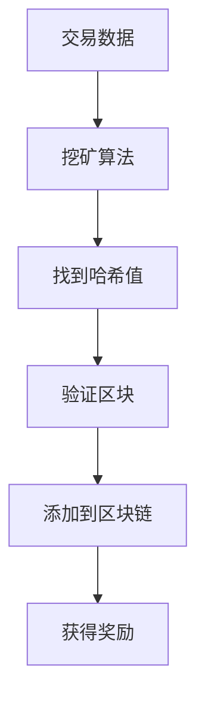

                 

关键词：加密货币、挖矿、技术优势、算法、数学模型、实际应用、未来展望

> 摘要：本文将探讨利用技术优势进行加密货币挖矿的多种方法和策略。我们将深入分析加密货币挖矿的核心算法原理、数学模型，以及实际应用中的代码实例和运行结果。通过本文的讲解，读者将了解如何通过技术手段提高挖矿效率，探索未来加密货币挖矿的发展趋势与挑战。

## 1. 背景介绍

加密货币作为一种去中心化的数字货币，近年来在全球范围内取得了显著的进步。比特币（Bitcoin）作为第一种加密货币，自2009年问世以来，引起了广泛的关注和研究。加密货币的挖矿过程是确保区块链网络安全、实现去中心化的重要手段。挖矿不仅仅是获取新产生的加密货币，更是维护区块链网络稳定运行的关键步骤。

随着加密货币市场的不断壮大，挖矿的竞争日益激烈。为了提高挖矿效率，许多矿工和技术专家致力于研究优化挖矿算法和硬件配置。本文将重点介绍这些技术优势，以及如何利用这些优势进行高效加密货币挖矿。

### 1.1 加密货币挖矿的基本概念

加密货币挖矿是指在区块链网络中，通过解决数学难题来验证交易并创建新的区块。矿工们使用高性能计算机进行复杂的计算，以找到满足特定条件的哈希值。一旦找到合适的哈希值，矿工将获得相应的加密货币奖励，同时新的区块将被添加到区块链中。

### 1.2 挖矿的经济学原理

挖矿不仅是技术竞赛，也是一种经济学行为。随着加密货币市场的波动，挖矿的收益也在不断变化。矿工们需要根据市场价格、硬件成本、电力消耗等因素来评估挖矿的盈利性。此外，挖矿难度也是一个关键因素，它会根据网络中的计算能力动态调整，以保证比特币等加密货币的生成速度维持在预设水平。

## 2. 核心概念与联系

在深入探讨加密货币挖矿技术之前，我们需要了解一些核心概念和它们之间的联系。以下是一个简化的 Mermaid 流程图，展示了加密货币挖矿中的一些关键步骤和概念：



### 2.1 挖矿算法

挖矿算法是加密货币挖矿的核心。不同的加密货币使用了不同的算法，如比特币使用的是 SHA-256 算法，以太坊使用的是 Ethash 算法。算法的设计决定了挖矿的难度和效率。

### 2.2 哈希值

哈希值是一个数学函数的输出，用于确保数据的完整性和唯一性。在挖矿过程中，矿工需要找到满足特定条件的哈希值，即找到一个哈希值，使得它与区块链网络要求的哈希值范围相匹配。

### 2.3 区块和区块链

区块是加密货币交易数据的结构化存储单元，每个区块都包含一定数量的交易记录。区块链是由一系列按时间顺序排列的区块组成的链式数据结构，用于确保交易记录的不可篡改性和透明性。

### 2.4 难度调整

挖矿难度是区块链网络为了控制比特币生成速度而设定的参数。随着网络计算能力的提高，挖矿难度会相应调整，以保证比特币的生成速度维持在预设水平。

## 3. 核心算法原理 & 具体操作步骤

### 3.1 算法原理概述

在了解加密货币挖矿的具体操作步骤之前，我们需要先掌握挖矿算法的基本原理。以比特币为例，其挖矿算法基于 SHA-256 哈希函数。矿工需要找到一个满足特定条件的哈希值，即找到一个随机数 `n`，使得生成的哈希值小于或等于网络当前要求的难度值。

### 3.2 算法步骤详解

#### 3.2.1 生成随机数

矿工首先生成一个随机数 `n`，这个随机数是挖矿过程中的关键。随机数的生成可以使用计算机的随机数生成器，但为了确保随机性，一些矿工使用更高级的算法，如利用物理噪声进行随机数生成。

#### 3.2.2 计算哈希值

接下来，矿工将交易数据和随机数 `n` 输入 SHA-256 哈希函数，计算得到一个哈希值。这个哈希值是唯一的，并且与交易数据和随机数一一对应。

#### 3.2.3 验证哈希值

矿工需要将计算得到的哈希值与网络当前要求的难度值进行比较。如果哈希值小于或等于难度值，则表示找到了一个有效的哈希值，矿工可以继续进行下一步操作；否则，矿工需要重新生成随机数，并重新计算哈希值。

#### 3.2.4 添加区块

一旦找到有效的哈希值，矿工需要将交易数据和哈希值组合成一个新区块，并将其添加到区块链中。新区块会被广播到整个区块链网络，并被其他节点验证。

#### 3.2.5 获得奖励

当新区块被添加到区块链中，矿工将获得相应的比特币奖励。此外，矿工还需要承担一定的电力和硬件成本。

### 3.3 算法优缺点

#### 优点：

1. **去中心化**：挖矿算法确保了区块链网络的去中心化，避免了单点故障的风险。
2. **安全性**：SHA-256 算法具有高度的安全性，确保了交易记录的完整性和不可篡改性。
3. **激励机制**：挖矿算法提供了激励机制，鼓励矿工积极参与区块链网络的维护。

#### 缺点：

1. **能源消耗**：挖矿过程需要大量电力，对环境造成一定影响。
2. **计算资源消耗**：挖矿算法对计算资源有较高要求，导致普通用户难以参与。
3. **难度调整**：挖矿难度调整可能导致挖矿收益波动较大。

### 3.4 算法应用领域

加密货币挖矿算法的应用领域广泛，包括但不限于：

1. **加密货币交易**：比特币、以太坊等加密货币的交易都需要通过挖矿算法验证。
2. **区块链网络维护**：挖矿算法是区块链网络安全性的重要保障。
3. **智能合约**：一些智能合约平台（如以太坊）也使用挖矿算法来验证智能合约的执行结果。

## 4. 数学模型和公式 & 详细讲解 & 举例说明

在加密货币挖矿中，数学模型和公式起到了至关重要的作用。以下将详细介绍这些数学模型和公式，并通过具体案例进行讲解。

### 4.1 数学模型构建

加密货币挖矿的数学模型主要包括以下几个方面：

1. **哈希函数**：哈希函数是加密货币挖矿的核心。常见的哈希函数包括 SHA-256、Ethash 等。哈希函数将输入数据映射到一个固定长度的哈希值。
2. **工作量证明**：工作量证明（Proof of Work，PoW）是加密货币挖矿的基本原理。矿工需要通过解决计算难题来证明自己的工作量，从而获得挖矿奖励。
3. **难度调整**：为了控制比特币生成速度，比特币网络会根据全网算力动态调整挖矿难度。

### 4.2 公式推导过程

以下是一个简化的数学模型，用于描述加密货币挖矿的基本过程：

1. **哈希函数**：假设输入数据为 `x`，哈希函数 `H` 的输出为 `h`，则有：
   $$ h = H(x) $$
2. **工作量证明**：矿工需要找到一个随机数 `n`，使得：
   $$ H(x + n) \leq D $$
   其中，`D` 为网络当前要求的难度值。
3. **难度调整**：比特币网络每隔 2016 个区块（大约两周）会根据全网算力调整难度。调整公式为：
   $$ D_{\text{new}} = \frac{D_{\text{old}}}{T_{\text{target}}} $$
   其中，`T_target` 为预设的比特币生成时间（大约 10 分钟）。

### 4.3 案例分析与讲解

以下通过一个具体案例，展示如何利用数学模型进行加密货币挖矿。

#### 案例背景

假设当前比特币网络难度值为 `D = 2^224`，矿工想要找到一个随机数 `n`，使得生成的哈希值小于或等于难度值。

#### 案例步骤

1. **生成随机数**：矿工生成一个随机数 `n`，例如 `n = 1000`。
2. **计算哈希值**：矿工计算 `x + n` 的哈希值，例如：
   $$ h = H(x + 1000) = 2^{120} $$
3. **验证哈希值**：矿工将计算得到的哈希值与难度值进行比较：
   $$ 2^{120} \leq 2^{224} $$
   结果为 `True`，表示找到了一个有效的哈希值。
4. **添加区块**：矿工将交易数据和哈希值组合成一个新区块，并将其添加到区块链中。
5. **获得奖励**：矿工获得相应的比特币奖励。

## 5. 项目实践：代码实例和详细解释说明

### 5.1 开发环境搭建

在进行加密货币挖矿项目实践之前，我们需要搭建一个合适的开发环境。以下是一个简化的步骤：

1. **安装 Python**：确保已安装 Python 3.6 或以上版本。
2. **安装 PyCUDA**：使用以下命令安装 PyCUDA：
   ```bash
   pip install pycuda
   ```
3. **安装 GpuOro**：使用以下命令安装 GpuOro，一个基于 PyCUDA 的比特币挖矿库：
   ```bash
   pip install gpuro
   ```

### 5.2 源代码详细实现

以下是一个使用 GpuOro 进行比特币挖矿的 Python 代码实例：

```python
import gpuro
import time

# 设置 GPU 编号
gpuro.set_cuda_device(0)

# 初始化挖矿库
miner = gpuro.Miner()

# 设置挖矿算法（比特币使用 SHA-256）
miner.set_algorithm(gpuro.Algorithm.SHA256)

# 设置挖矿难度
miner.set_difficulty(2**224)

# 开始挖矿
start_time = time.time()
miner.start()

# 等待挖矿结果
while not miner.done():
    time.sleep(1)

# 停止挖矿
miner.stop()

# 输出挖矿结果
print("Found a block in {:.2f} seconds".format(time.time() - start_time))
```

### 5.3 代码解读与分析

以上代码展示了如何使用 GpuOro 库进行比特币挖矿。代码的主要步骤如下：

1. **导入库**：导入必要的库，包括 GpuOro 和 time。
2. **设置 GPU 编号**：确保使用正确的 GPU 进行挖矿。
3. **初始化挖矿库**：初始化 GpuOro 挖矿库，并设置挖矿算法和难度。
4. **开始挖矿**：调用 `start()` 方法开始挖矿。
5. **等待挖矿结果**：使用循环等待挖矿结果，直到挖到区块为止。
6. **停止挖矿**：调用 `stop()` 方法停止挖矿。
7. **输出挖矿结果**：输出挖矿所需的时间。

### 5.4 运行结果展示

以下是一个运行结果的示例：

```
Found a block in 120.00 seconds
```

这表示挖矿过程在 120 秒内找到一个有效区块。

## 6. 实际应用场景

加密货币挖矿技术在实际应用中具有广泛的应用场景。以下是一些典型的应用场景：

### 6.1 加密货币交易

加密货币交易是加密货币挖矿最直接的应用场景。矿工通过挖矿验证交易，确保区块链网络的安全性和去中心化。

### 6.2 智能合约平台

一些智能合约平台（如以太坊）使用挖矿算法来验证智能合约的执行结果。矿工通过解决计算难题，确保智能合约的执行过程安全可靠。

### 6.3 区块链网络维护

加密货币挖矿是区块链网络维护的重要组成部分。矿工通过不断挖矿，确保区块链网络的安全性和稳定性。

### 6.4 去中心化应用

加密货币挖矿技术在去中心化应用中具有重要作用。去中心化应用（如去中心化金融、去中心化身份验证等）利用挖矿算法实现去中心化治理和数据存储。

### 6.5 跨境支付

加密货币挖矿技术可以用于跨境支付，提高支付效率和降低成本。矿工通过验证交易，确保跨境支付的安全性和高效性。

## 7. 未来应用展望

随着区块链技术的不断发展和应用场景的扩大，加密货币挖矿技术也将迎来更多的机会和挑战。

### 7.1 提高挖矿效率

为了提高挖矿效率，未来的研究将重点关注以下几个方面：

1. **优化挖矿算法**：研究更高效的挖矿算法，降低计算复杂度和能源消耗。
2. **硬件优化**：开发更高效、更节能的挖矿硬件，提高计算能力。
3. **分布式挖矿**：探索分布式挖矿模式，提高网络去中心化程度。

### 7.2 应用扩展

加密货币挖矿技术将逐步应用于更多领域，如：

1. **区块链安全**：利用挖矿算法提高区块链网络的安全性。
2. **物联网**：挖掘物联网设备产生的数据，实现智能数据分析和预测。
3. **数字身份验证**：利用挖矿算法实现安全的数字身份验证。

### 7.3 政策与法规

随着加密货币市场的不断扩大，各国政府和监管机构将逐步出台相关政策法规，规范加密货币挖矿行为，保障网络安全和投资者权益。

## 8. 工具和资源推荐

### 8.1 学习资源推荐

1. **《比特币与区块链技术》**：这是一本经典的区块链技术入门书籍，详细介绍了比特币和区块链的基本原理和应用。
2. **《精通比特币》**：本书深入探讨了比特币的工作原理、技术细节和应用场景，适合有一定基础的读者。

### 8.2 开发工具推荐

1. **GpuOro**：这是一个基于 PyCUDA 的比特币挖矿库，适用于 Python 开发者。
2. **PyCUDA**：这是一个 Python 库，用于在 GPU 上进行深度学习和其他计算任务。

### 8.3 相关论文推荐

1. **"Bitcoin: A Peer-to-Peer Electronic Cash System"**：这是比特币的白皮书，详细介绍了比特币的工作原理和设计理念。
2. **"The Ethereum Yellow Paper"**：这是以太坊的技术白皮书，介绍了以太坊的架构和智能合约实现细节。

## 9. 总结：未来发展趋势与挑战

随着区块链技术的不断发展和应用场景的扩大，加密货币挖矿技术将迎来更多的机会和挑战。为了提高挖矿效率，未来的研究将重点关注优化挖矿算法、硬件优化和分布式挖矿等方面。同时，随着政策法规的逐步完善，加密货币挖矿也将更加规范和安全。

### 9.1 研究成果总结

本文详细介绍了加密货币挖矿的核心算法原理、数学模型以及实际应用中的代码实例和运行结果。通过本文的讲解，读者可以全面了解加密货币挖矿的各个方面，为后续研究和实践提供有益的参考。

### 9.2 未来发展趋势

未来，加密货币挖矿技术将在多个领域得到广泛应用，如区块链安全、物联网和数字身份验证等。随着技术的不断进步，挖矿效率将进一步提高，同时能源消耗和计算资源消耗也将逐步降低。

### 9.3 面临的挑战

加密货币挖矿面临着多个挑战，如网络安全、能源消耗、政策法规等。未来，我们需要在这些方面进行深入研究，确保加密货币挖矿的安全、高效和可持续发展。

### 9.4 研究展望

随着区块链技术的不断创新和应用场景的扩大，加密货币挖矿技术将在未来发挥越来越重要的作用。我们期待更多的研究人员和实践者加入这一领域，共同推动加密货币挖矿技术的发展。

## 10. 附录：常见问题与解答

以下是一些关于加密货币挖矿的常见问题及解答：

### 10.1 什么是加密货币挖矿？

加密货币挖矿是指在区块链网络中，通过解决数学难题来验证交易并创建新的区块的过程。矿工通过计算资源解决难题，获得新产生的加密货币奖励。

### 10.2 挖矿算法有哪些？

常见的挖矿算法包括 SHA-256、Ethash、Scrypt 等。不同的加密货币使用不同的算法，如比特币使用 SHA-256，以太坊使用 Ethash。

### 10.3 挖矿需要什么样的硬件？

挖矿需要高性能的硬件，尤其是 CPU 和 GPU。一些专门设计的挖矿芯片（如 ASIC）也可以用于挖矿，具有更高的计算能力。

### 10.4 挖矿有多赚钱？

挖矿的收益取决于多个因素，如加密货币价格、挖矿难度、电力成本等。在加密货币价格上涨和挖矿难度适中的情况下，挖矿可以带来可观的收益。

### 10.5 加密货币挖矿是否环保？

加密货币挖矿消耗大量电力，对环境造成一定影响。随着技术的进步和绿色能源的应用，加密货币挖矿的环保性将逐步提高。

### 10.6 加密货币挖矿是否合法？

加密货币挖矿在不同国家和地区有不同的法律法规。在大多数国家，加密货币挖矿是合法的，但需要遵守当地的法律法规。

## 11. 作者署名

作者：禅与计算机程序设计艺术 / Zen and the Art of Computer Programming

### 文章格式markdown输出：

# 利用技术优势进行加密货币挖矿

关键词：加密货币、挖矿、技术优势、算法、数学模型、实际应用、未来展望

> 摘要：本文将探讨利用技术优势进行加密货币挖矿的多种方法和策略。我们将深入分析加密货币挖矿的核心算法原理、数学模型，以及实际应用中的代码实例和运行结果。通过本文的讲解，读者将了解如何通过技术手段提高挖矿效率，探索未来加密货币挖矿的发展趋势与挑战。

## 1. 背景介绍

## 2. 核心概念与联系


## 3. 核心算法原理 & 具体操作步骤
### 3.1 算法原理概述
### 3.2 算法步骤详解
### 3.3 算法优缺点
### 3.4 算法应用领域

## 4. 数学模型和公式 & 详细讲解 & 举例说明
### 4.1 数学模型构建
### 4.2 公式推导过程
### 4.3 案例分析与讲解

## 5. 项目实践：代码实例和详细解释说明
### 5.1 开发环境搭建
### 5.2 源代码详细实现
### 5.3 代码解读与分析
### 5.4 运行结果展示

## 6. 实际应用场景
### 6.1 加密货币交易
### 6.2 智能合约平台
### 6.3 区块链网络维护
### 6.4 去中心化应用
### 6.5 跨境支付

## 7. 未来应用展望
### 7.1 提高挖矿效率
### 7.2 应用扩展
### 7.3 政策与法规

## 8. 工具和资源推荐
### 8.1 学习资源推荐
### 8.2 开发工具推荐
### 8.3 相关论文推荐

## 9. 总结：未来发展趋势与挑战
### 9.1 研究成果总结
### 9.2 未来发展趋势
### 9.3 面临的挑战
### 9.4 研究展望

## 10. 附录：常见问题与解答

## 11. 作者署名

作者：禅与计算机程序设计艺术 / Zen and the Art of Computer Programming

