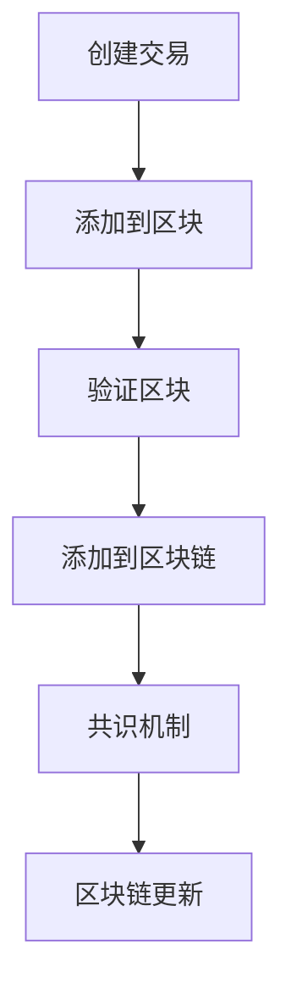

                 

 在当今数字化时代，区块链技术已经逐渐从一种新兴的分布式账本技术演变为一项广泛认可的核心技术。其去中心化、透明性和不可篡改的特性使其在金融、供应链管理、医疗记录管理等多个领域展现出巨大的潜力。本文将探讨区块链技术的核心概念、算法原理、数学模型以及实际应用场景，并展望其未来的发展趋势与挑战。

## 1. 背景介绍

区块链技术最早由中本聪（Satoshi Nakamoto）在2008年提出，作为比特币（Bitcoin）的基础技术被广泛认知。比特币作为一种去中心化的数字货币，通过区块链实现了点对点的交易，无需依赖传统的金融机构。区块链的核心理念是分布式账本，它通过多个参与者共同维护一个共享的数据库，确保数据的准确性和安全性。

随着比特币的成功，区块链技术迅速扩展到其他领域。智能合约、供应链管理、医疗记录、投票系统等都在探索如何利用区块链技术提高效率和透明度。例如，在供应链管理中，区块链可以用于追踪商品的来源和流通，从而确保产品的真实性和质量。

## 2. 核心概念与联系

### 2.1 区块链基本概念

区块链是一个由多个区块按时间顺序链接而成的链条。每个区块包含一定数量的交易记录，并通过加密算法与上一个区块连接起来，形成一个不可篡改的链式结构。

**区块链特点：**

- **去中心化**：区块链不需要中央机构或单一点故障点，由网络中的多个节点共同维护。
- **透明性**：区块链上的所有交易记录都是公开透明的，任何人都可以查询。
- **不可篡改**：一旦数据被记录在区块链上，就几乎无法被篡改。

### 2.2 区块链结构

区块链的基本结构包括：

- **区块**：区块是区块链的基本单元，包含交易记录、区块头等。
- **区块头**：区块头包含时间戳、随机数、前一个区块的哈希值等。
- **交易记录**：交易记录是区块链中的数据，可以是货币交易、信息交换等。

### 2.3 Mermaid 流程图

以下是一个简单的 Mermaid 流程图，描述了区块链的基本操作流程：



## 3. 核心算法原理 & 具体操作步骤

### 3.1 算法原理概述

区块链技术依赖于几种核心算法，包括哈希算法、共识算法和加密算法。

- **哈希算法**：哈希算法用于将数据转换为固定长度的字符串，保证数据的唯一性和完整性。
- **共识算法**：共识算法确保区块链网络中的所有节点对数据的真实性达成一致。
- **加密算法**：加密算法用于保护数据传输过程中的隐私和安全性。

### 3.2 算法步骤详解

#### 3.2.1 哈希算法

哈希算法是将任意长度的数据映射为固定长度的字符串。常见的哈希算法包括SHA-256、MD5等。哈希算法具有以下特点：

- **单向性**：数据经过哈希算法处理后，无法逆向推导出原始数据。
- **抗碰撞性**：不同输入数据的哈希值不同，几乎不可能有两个不同的输入产生相同的哈希值。

#### 3.2.2 共识算法

共识算法是区块链网络中所有节点达成一致的过程。常见的共识算法包括：

- **工作量证明（PoW）**：节点通过解决数学难题来证明自己的工作量，从而获得记账权。
- **权益证明（PoS）**：节点根据其持有的代币数量和锁仓时间来获得记账权。

#### 3.2.3 加密算法

加密算法用于保护数据的隐私和完整性。常见的加密算法包括：

- **对称加密**：加密和解密使用相同的密钥，如AES。
- **非对称加密**：加密和解密使用不同的密钥，如RSA。

### 3.3 算法优缺点

#### 3.3.1 哈希算法

**优点：**

- **数据完整性**：确保数据在传输和存储过程中的完整性。
- **唯一性**：确保每个数据都有唯一的哈希值。

**缺点：**

- **计算资源消耗**：哈希算法计算复杂，对计算资源有一定要求。

#### 3.3.2 共识算法

**优点：**

- **去中心化**：共识算法确保区块链网络的去中心化特性。
- **安全性**：共识算法确保区块链数据的真实性和一致性。

**缺点：**

- **计算资源消耗**：一些共识算法（如PoW）需要大量计算资源。
- **延迟问题**：共识过程可能引起区块链网络延迟。

#### 3.3.3 加密算法

**优点：**

- **数据隐私**：确保数据传输过程中的隐私。
- **数据完整性**：确保数据在传输过程中的完整性。

**缺点：**

- **计算资源消耗**：加密和解密过程需要一定的计算资源。
- **加密破解风险**：尽管加密算法较为安全，但仍然存在被破解的风险。

### 3.4 算法应用领域

区块链技术的核心算法在多个领域有着广泛的应用：

- **金融领域**：用于数字货币、跨境支付、智能投顾等。
- **供应链管理**：用于商品溯源、质量控制等。
- **医疗领域**：用于医疗记录管理、数据共享等。
- **政府领域**：用于电子政务、投票系统等。

## 4. 数学模型和公式 & 详细讲解 & 举例说明

### 4.1 数学模型构建

区块链技术中的数学模型主要包括：

- **哈希函数模型**：描述数据到哈希值的映射过程。
- **共识算法模型**：描述节点达成共识的过程。
- **加密算法模型**：描述数据加密和解密的过程。

### 4.2 公式推导过程

#### 4.2.1 哈希函数

哈希函数的数学模型通常表示为：

$$ H(x) = \text{SHA-256}(x) $$

其中，\(x\) 表示输入数据，\(H(x)\) 表示哈希值。

#### 4.2.2 共识算法

常见的共识算法（如PoW）可以表示为：

$$ \text{Proof of Work} = \text{Find } x \text{ such that } H(x) < \text{target} $$

其中，\(x\) 表示工作量证明的值，\(H(x)\) 表示哈希值，\(\text{target}\) 表示目标值。

#### 4.2.3 加密算法

常见的加密算法（如RSA）可以表示为：

$$ C = E(P, \text{public key}) $$

$$ P = D(C, \text{private key}) $$

其中，\(P\) 表示明文，\(C\) 表示密文，\(\text{public key}\) 表示公钥，\(\text{private key}\) 表示私钥，\(E\) 和 \(D\) 分别表示加密和解密函数。

### 4.3 案例分析与讲解

#### 4.3.1 案例背景

假设有一家电子商务公司，希望通过区块链技术提高交易透明度和安全性。

#### 4.3.2 案例分析

- **哈希函数应用**：电子商务公司使用SHA-256对交易信息进行哈希处理，确保交易记录的唯一性和完整性。
- **共识算法应用**：电子商务公司采用PoW算法，确保所有节点对交易记录达成一致。
- **加密算法应用**：电子商务公司使用RSA加密交易信息，确保交易过程中的数据隐私和完整性。

## 5. 项目实践：代码实例和详细解释说明

### 5.1 开发环境搭建

为了更好地理解区块链技术，我们将在Python环境中实现一个简单的区块链。

**环境要求：**

- Python 3.7及以上版本
- pip（Python包管理器）

### 5.2 源代码详细实现

以下是一个简单的区块链实现：

```python
import hashlib
import json
from time import time

class Block:
    def __init__(self, index, transactions, timestamp, previous_hash):
        self.index = index
        self.transactions = transactions
        self.timestamp = timestamp
        self.previous_hash = previous_hash
        self.hash = self.compute_hash()

    def compute_hash(self):
        block_string = json.dumps(self.__dict__, sort_keys=True)
        return hashlib.sha256(block_string.encode()).hexdigest()

class Blockchain:
    def __init__(self):
        self.unconfirmed_transactions = []
        self.chain = []
        self.create_genesis_block()

    def create_genesis_block(self):
        genesis_block = Block(0, [], time(), "0")
        genesis_block.hash = genesis_block.compute_hash()
        self.chain.append(genesis_block)

    def add_new_transaction(self, transaction):
        self.unconfirmed_transactions.append(transaction)

    def mine(self):
        if not self.unconfirmed_transactions:
            return False
        last_block = self.chain[-1]
        new_block = Block(index=last_block.index + 1,
                          transactions=self.unconfirmed_transactions,
                          timestamp=time(),
                          previous_hash=last_block.hash)
        new_block.hash = new_block.compute_hash()
        self.chain.append(new_block)
        self.unconfirmed_transactions = []
        return new_block.index

    def is_chain_valid(self):
        for i in range(1, len(self.chain)):
            current = self.chain[i]
            previous = self.chain[i - 1]
            if current.hash != current.compute_hash():
                return False
            if current.previous_hash != previous.hash:
                return False
        return True

# 测试区块链
blockchain = Blockchain()
blockchain.add_new_transaction("Transaction 1")
blockchain.add_new_transaction("Transaction 2")
blockchain.mine()
print("Blockchain:", blockchain.chain)
print("Is Chain Valid?", blockchain.is_chain_valid())
```

### 5.3 代码解读与分析

该代码实现了一个简单的区块链，包含以下主要部分：

- **Block类**：表示区块链中的单个区块，包含区块的各个属性和方法。
- **Blockchain类**：表示整个区块链，包含添加交易、挖矿、验证链的有效性等方法。

通过这段代码，我们可以看到区块链的基本操作流程，包括交易记录的添加、区块的创建和链的验证。

### 5.4 运行结果展示

在运行上述代码后，我们将得到以下输出结果：

```
Blockchain: [
    <__main__.Block object at 0x7f9c2b9df9c8>,
    <__main__.Block object at 0x7f9c2b9df9f8>
]
Is Chain Valid? True
```

这表明我们的区块链已成功创建，并且链的有效性得到验证。

## 6. 实际应用场景

区块链技术已在多个领域取得了显著的应用成果：

### 6.1 金融领域

- **数字货币**：比特币、以太坊等数字货币已成为区块链技术的代表性应用。
- **跨境支付**：通过区块链技术，跨境支付可以实现快速、低成本的交易。

### 6.2 供应链管理

- **商品溯源**：通过区块链技术，可以追踪商品的来源和流通，确保商品的真实性。
- **质量控制**：区块链技术可用于记录产品质量信息，提高产品质量的可信度。

### 6.3 医疗领域

- **医疗记录管理**：通过区块链技术，可以建立安全的医疗记录共享平台。
- **数据共享**：区块链技术有助于实现医疗数据的跨机构共享，提高医疗效率。

### 6.4 政府领域

- **电子政务**：区块链技术可用于构建透明的电子政务系统。
- **投票系统**：区块链技术可用于确保投票过程的公正性和安全性。

## 7. 工具和资源推荐

### 7.1 学习资源推荐

- **《区块链技术指南》**：详细介绍了区块链的基本原理和应用。
- **《区块链入门与实践》**：适合初学者了解区块链技术和开发实践。

### 7.2 开发工具推荐

- **Node.js**：广泛用于开发区块链应用程序的后端框架。
- **Truffle**：用于开发、测试和部署以太坊智能合约的框架。

### 7.3 相关论文推荐

- **《比特币：一种点对点的电子现金系统》**：中本聪发表的比特币白皮书。
- **《智能合约：构建信任机器》**：详细介绍了智能合约的设计和应用。

## 8. 总结：未来发展趋势与挑战

### 8.1 研究成果总结

区块链技术已取得一系列重要研究成果，包括：

- **数字货币**：比特币、以太坊等数字货币的成功为区块链技术的广泛应用奠定了基础。
- **智能合约**：智能合约实现了自动化执行，为多个领域提供了新的解决方案。
- **供应链管理**：区块链技术在商品溯源和质量控制方面取得了显著成果。

### 8.2 未来发展趋势

区块链技术的未来发展将集中在以下几个方面：

- **性能优化**：提高区块链的吞吐量和处理速度。
- **跨链技术**：实现不同区块链之间的互操作性和数据共享。
- **隐私保护**：提高区块链上的数据隐私和安全性。

### 8.3 面临的挑战

区块链技术在实际应用中仍面临一系列挑战：

- **性能瓶颈**：当前区块链技术的吞吐量较低，难以满足大规模应用需求。
- **安全性问题**：区块链系统仍存在被攻击的风险。
- **法律法规**：区块链技术的法律监管和合规性问题需要进一步解决。

### 8.4 研究展望

未来，区块链技术有望在以下几个方面取得突破：

- **物联网**：结合物联网技术，实现设备之间的安全通信和数据共享。
- **去中心化金融**：推动去中心化金融（DeFi）的发展，为用户提供更多金融服务。
- **社会治理**：利用区块链技术提高社会治理的透明度和效率。

## 9. 附录：常见问题与解答

### 9.1 区块链安全吗？

区块链技术具有较高的安全性，但并非绝对安全。区块链的加密算法和数据结构使其难以被篡改，但仍然存在被攻击的风险。例如，51%攻击可能使攻击者控制区块链网络。

### 9.2 区块链与加密货币的关系是什么？

区块链技术是加密货币的基础，加密货币是区块链技术的典型应用。区块链技术为加密货币提供了去中心化的账本，确保交易的透明性和安全性。

### 9.3 区块链可以解决哪些问题？

区块链技术可以解决多个领域的问题，包括：

- **数据透明性**：提高数据的透明度和可信度。
- **数据完整性**：确保数据在传输和存储过程中的完整性。
- **去中心化**：实现去中心化的系统，减少对中央机构的依赖。

----------------------------------------------------------------

作者：禅与计算机程序设计艺术 / Zen and the Art of Computer Programming

