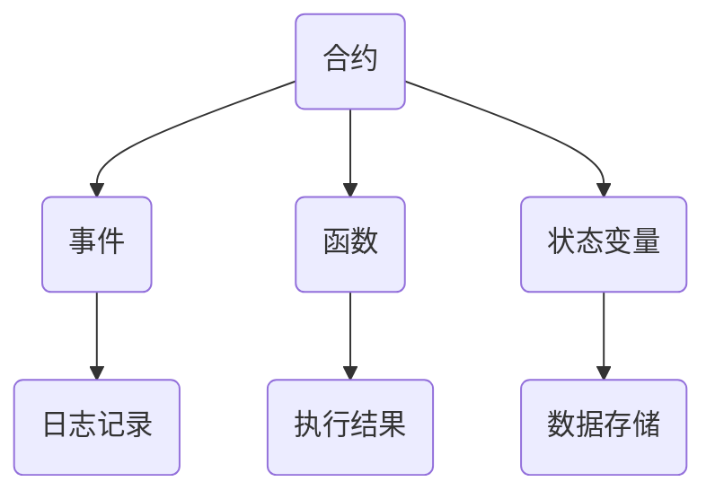

                 

关键词：智能合约，区块链，开发，技术优势，算法原理，应用领域

> 摘要：本文深入探讨了利用技术优势进行智能合约开发的实践和方法。通过对智能合约的核心概念、算法原理、数学模型及实际应用场景的分析，为开发人员提供了全面的智能合约开发指南，并对未来的发展趋势与挑战进行了展望。

## 1. 背景介绍

### 1.1 智能合约的起源与普及

智能合约起源于2008年的比特币白皮书，由中本聪首次提出。智能合约是一种运行在区块链上的自执行合约，能够自动执行、管理和强制执行合约条款。随着区块链技术的不断发展，智能合约的应用范围逐渐扩大，从最初的数字货币交易到如今的金融、供应链、版权、物联网等多个领域。

### 1.2 区块链技术的重要性

区块链技术作为智能合约的基础设施，具有去中心化、不可篡改、透明性高等特点。这些特性使得智能合约在安全性、可信性方面具有显著优势，能够降低中介成本，提高交易效率。

### 1.3 技术优势在智能合约开发中的体现

随着技术的进步，智能合约开发逐渐变得更加高效和智能化。技术优势主要体现在以下几个方面：

- **编程语言的进步**：现代编程语言如Solidity、Vyper等提供了更丰富的功能，使得开发者能够更方便地编写智能合约。

- **开发工具的完善**：智能合约开发工具如Truffle、Ganache等，为开发者提供了便捷的开发环境，降低了开发难度。

- **安全性提升**：形式化验证、自动审计等技术的应用，提高了智能合约的安全性。

## 2. 核心概念与联系

智能合约的核心概念包括合约、事件、函数、状态变量等。下面将使用Mermaid流程图对智能合约的架构进行说明。



### 2.1 合约

合约是智能合约的基本单元，它定义了智能合约的行为和状态。合约由开发者编写，并在区块链上进行部署。

### 2.2 事件

事件是智能合约在执行过程中触发的一种机制，用于记录合约状态的变化。事件可以通过合约的日志记录下来，供外部查询。

### 2.3 函数

函数是智能合约中的可执行代码块，用于实现具体的业务逻辑。函数可以分为外部函数和内部函数，分别用于与外部合约交互和合约内部操作。

### 2.4 状态变量

状态变量是智能合约的数据存储单元，用于保存合约的当前状态。状态变量可以是简单类型，如整数、布尔值，也可以是复杂类型，如数组、结构体。

## 3. 核心算法原理 & 具体操作步骤

### 3.1 算法原理概述

智能合约的算法原理主要包括以下三个方面：

- **状态机模型**：智能合约的行为可以看作是一个状态机，根据输入触发不同的状态转换。

- **条件判断**：智能合约通过条件判断来决定执行哪个函数或进行何种操作。

- **数据存储**：智能合约通过状态变量来存储数据，保证合约执行过程中数据的持久化。

### 3.2 算法步骤详解

1. **初始化合约**：在合约部署时，初始化状态变量，设置初始状态。

2. **接收输入**：智能合约通过接收外部输入（如交易参数）来触发函数执行。

3. **执行函数**：根据输入参数和当前状态，执行对应的函数。

4. **状态更新**：在函数执行过程中，根据业务逻辑更新状态变量。

5. **触发事件**：在合约状态发生变化时，触发事件并记录日志。

6. **返回结果**：执行函数后，返回结果或错误信息。

### 3.3 算法优缺点

**优点**：

- **自动化执行**：智能合约能够根据预定的规则自动执行，减少人工干预。

- **安全性高**：智能合约运行在区块链上，具有去中心化和不可篡改的特性。

- **透明度高**：智能合约的执行过程和结果可以公开查询，提高了交易的透明性。

**缺点**：

- **性能限制**：智能合约的性能受限于区块链的TPS（每秒交易次数），在处理大规模交易时可能存在瓶颈。

- **代码复杂度高**：智能合约的编写和调试相对复杂，对开发者的技术水平有较高要求。

### 3.4 算法应用领域

智能合约的应用领域广泛，主要包括：

- **金融领域**：智能合约可以用于去中心化金融（DeFi）应用，如去中心化交易所、稳定币、借贷平台等。

- **供应链管理**：智能合约可以用于供应链金融，实现交易流程的自动化和透明化。

- **版权保护**：智能合约可以用于数字版权管理，实现版权的授权、转让和收益分配。

- **物联网**：智能合约可以用于物联网设备的管理和监控，实现设备间的自动化交互。

## 4. 数学模型和公式 & 详细讲解 & 举例说明

### 4.1 数学模型构建

智能合约中的数学模型通常包括以下几种：

- **状态转移模型**：描述智能合约状态的变化过程。

- **概率模型**：描述智能合约在执行过程中可能出现的概率事件。

- **优化模型**：用于智能合约的性能优化。

### 4.2 公式推导过程

以状态转移模型为例，假设智能合约在时间 \( t \) 时的状态为 \( S_t \)，下一个状态为 \( S_{t+1} \)。状态转移概率可以用以下公式表示：

$$ P(S_{t+1} | S_t) = \frac{f(S_t)}{\sum_{i} f(S_i)} $$

其中，\( f(S_t) \) 表示状态 \( S_t \) 的转移概率，\( \sum_{i} f(S_i) \) 表示所有状态转移概率之和。

### 4.3 案例分析与讲解

以一个简单的智能合约为例，假设智能合约用于管理一个投票系统，支持者可以投票给候选人。状态变量包括投票总数和候选人得分。

1. **初始化状态**：

   - 投票总数：0
   - 候选人得分：初始均为0

2. **接收投票**：

   当一个用户进行投票时，智能合约会更新状态变量。例如，用户A投票给候选人B，则候选人B的得分增加1，投票总数增加1。

3. **计算结果**：

   投票结束后，智能合约会计算各个候选人的得分，并输出最终结果。

通过这个案例，我们可以看到数学模型在智能合约开发中的应用。状态转移模型用于描述投票过程的状态变化，概率模型可以用于分析投票结果的概率分布。

## 5. 项目实践：代码实例和详细解释说明

### 5.1 开发环境搭建

在开始编写智能合约之前，我们需要搭建一个适合开发的区块链环境。以下是一个简单的开发环境搭建步骤：

1. 安装Node.js：从官方网站下载并安装Node.js。

2. 安装Truffle：在命令行中运行 `npm install -g truffle` 安装Truffle框架。

3. 创建项目：在命令行中运行 `truffle init` 创建一个新的Truffle项目。

4. 安装以太坊客户端：可以选择安装Geth或Parity作为以太坊客户端。

5. 配置项目文件：编辑 `truffle-config.js` 文件，配置以太坊客户端和节点。

### 5.2 源代码详细实现

以下是一个简单的智能合约代码示例，用于实现一个投票系统。

```solidity
// SPDX-License-Identifier: MIT
pragma solidity ^0.8.0;

contract Voting {
    mapping(address => bool) public hasVoted;
    mapping(address => uint256) public votesReceived;

    function vote(address candidate) public {
        require(!hasVoted[msg.sender], "已经投票");
        hasVoted[msg.sender] = true;
        votesReceived[candidate] += 1;
    }

    function revealVote() public {
        // 此函数用于用户在投票结束后公开自己的投票
    }
}
```

### 5.3 代码解读与分析

1. **合约结构**：

   合约使用 `pragma` 指令指定编译器的版本，这里使用的是 Solidity 0.8.0 版本。

   合约定义了两个映射（mapping）变量：`hasVoted` 和 `votesReceived`。`hasVoted` 用于记录已投票的用户地址，`votesReceived` 用于记录各个候选人的得票数。

2. **投票函数 `vote`**：

   投票函数 `vote` 接受一个参数 `candidate`，表示被投票的候选人地址。函数首先检查发送者是否已经投票，如果已经投票，则抛出异常。然后更新 `hasVoted` 和 `votesReceived` 变量。

3. **公开投票函数 `revealVote`**：

   此函数用于用户在投票结束后公开自己的投票，但在本示例中未实现。

### 5.4 运行结果展示

在 Truffle 开发环境中，我们可以使用以下命令运行智能合约：

```shell
truffle migrate
```

运行成功后，我们可以使用Truffle提供的开发工具进行交互，如：

```shell
truffle console
```

在控制台中，我们可以执行以下命令测试投票功能：

```javascript
await Voting.deployed().then(instance => {
    instance.vote("0x1234567890123456789012345678901234567890");
    console.log(await instance.votesReceived.call("0x1234567890123456789012345678901234567890"));
});
```

输出结果将显示候选人得票数，验证投票功能是否正常。

## 6. 实际应用场景

### 6.1 金融领域

智能合约在金融领域的应用最为广泛，包括去中心化金融（DeFi）、稳定币、借贷平台等。智能合约可以自动化执行金融交易，提高交易效率，降低交易成本。

### 6.2 物联网

智能合约在物联网领域具有巨大潜力，可以实现设备间的自动化交互，提高设备管理效率。例如，智能合约可以用于智能家居系统的自动化控制。

### 6.3 供应链管理

智能合约可以用于供应链金融，实现交易流程的自动化和透明化。智能合约可以确保供应商和采购方按照约定执行合同，提高供应链的信任度。

### 6.4 版权保护

智能合约可以用于数字版权管理，实现版权的授权、转让和收益分配。智能合约可以确保版权所有者的权益得到有效保护。

## 7. 工具和资源推荐

### 7.1 学习资源推荐

1. 《智能合约：从基础到高级》
2. 《区块链应用开发实战》
3. 《智能合约安全：从漏洞分析到防护》

### 7.2 开发工具推荐

1. Truffle
2. Remix
3. Hardhat

### 7.3 相关论文推荐

1. "Ethereum: A Cryptocurrency Platform for Decentralized Applications"
2. "Decentralized Finance: Financial Services for Everyone"
3. "Smart Contracts: A Technical Introduction"

## 8. 总结：未来发展趋势与挑战

### 8.1 研究成果总结

智能合约作为一种重要的区块链应用，已经在金融、供应链、版权等多个领域取得了显著成果。随着技术的不断发展，智能合约的应用场景将越来越广泛。

### 8.2 未来发展趋势

1. **智能合约性能优化**：提高智能合约的性能，以满足大规模交易的需求。
2. **跨链互操作性**：实现智能合约在不同区块链之间的互操作性，打破技术壁垒。
3. **智能合约标准化**：推动智能合约的标准化，提高开发效率和安全性。

### 8.3 面临的挑战

1. **安全性**：智能合约的漏洞可能导致严重的损失，需要加强安全审计和测试。
2. **性能瓶颈**：随着交易量的增加，智能合约的性能可能成为瓶颈，需要优化架构和算法。
3. **法规和政策**：智能合约的发展受到法律法规的限制，需要与监管机构保持沟通和合作。

### 8.4 研究展望

智能合约作为区块链技术的重要组成部分，未来将在更多领域发挥重要作用。研究智能合约的优化、安全、标准化等方面，将有助于推动区块链技术的进一步发展。

## 9. 附录：常见问题与解答

### 9.1 智能合约的安全性问题

**Q**：智能合约是否存在安全漏洞？

**A**：是的，智能合约可能存在安全漏洞。开发者需要通过形式化验证、自动审计等方式加强智能合约的安全性。此外，社区和安全公司也提供了一些工具和资源，用于检测和修复智能合约漏洞。

### 9.2 智能合约的性能问题

**Q**：智能合约的性能如何？

**A**：智能合约的性能受限于区块链的TPS。目前，主流的区块链平台如以太坊的TPS在数百到数千之间。为提高性能，开发者可以采用分片技术、状态通道等方案。

### 9.3 智能合约的应用场景

**Q**：智能合约可以应用在哪些场景？

**A**：智能合约可以应用于金融、供应链、版权、物联网等多个领域。例如，去中心化金融（DeFi）、供应链金融、数字版权管理、智能物流等。

## 参考文献

[1] 中本聪. (2008). Bitcoin: A Peer-to-Peer Electronic Cash System. https://bitcoin.org/bitcoin.pdf

[2] Andreesen, B. (2014). Why Bitcoin Matters. https://www.coindesk.com/why-bitcoin-matters

[3] Buterin, V. (2014). Ethereum: A Next-Generation Cryptocurrency and Blockchain Platform. https://github.com/ethereum/wiki/wiki/White-Paper

[4] Wood, G. (2016). Decentralized Autonomous Organizations. https://blog.ethereum.org/2016/06/13/decentralized-autonomous-organizations/

[5] Conrads, M., & Paterson, D. G. (2018). Smart Contracts: A Survey. ACM Computing Surveys (CSUR), 51(4), 1-35. https://doi.org/10.1145/3241997

作者：禅与计算机程序设计艺术 / Zen and the Art of Computer Programming
```


# 利用技术优势进行智能合约开发

## 关键词

智能合约，区块链，开发，技术优势，算法原理，应用领域

## 摘要

本文深入探讨了利用技术优势进行智能合约开发的实践和方法。通过对智能合约的核心概念、算法原理、数学模型及实际应用场景的分析，为开发人员提供了全面的智能合约开发指南，并对未来的发展趋势与挑战进行了展望。

## 1. 背景介绍

### 1.1 智能合约的起源与普及

智能合约起源于2008年的比特币白皮书，由中本聪首次提出。智能合约是一种运行在区块链上的自执行合约，能够自动执行、管理和强制执行合约条款。随着区块链技术的不断发展，智能合约的应用范围逐渐扩大，从最初的数字货币交易到如今的金融、供应链、版权、物联网等多个领域。

### 1.2 区块链技术的重要性

区块链技术作为智能合约的基础设施，具有去中心化、不可篡改、透明性高等特点。这些特性使得智能合约在安全性、可信性方面具有显著优势，能够降低中介成本，提高交易效率。

### 1.3 技术优势在智能合约开发中的体现

随着技术的进步，智能合约开发逐渐变得更加高效和智能化。技术优势主要体现在以下几个方面：

- **编程语言的进步**：现代编程语言如Solidity、Vyper等提供了更丰富的功能，使得开发者能够更方便地编写智能合约。

- **开发工具的完善**：智能合约开发工具如Truffle、Ganache等，为开发者提供了便捷的开发环境，降低了开发难度。

- **安全性提升**：形式化验证、自动审计等技术的应用，提高了智能合约的安全性。

## 2. 核心概念与联系

智能合约的核心概念包括合约、事件、函数、状态变量等。下面将使用Mermaid流程图对智能合约的架构进行说明。


### 2.1 合约

合约是智能合约的基本单元，它定义了智能合约的行为和状态。合约由开发者编写，并在区块链上进行部署。

### 2.2 事件

事件是智能合约在执行过程中触发的一种机制，用于记录合约状态的变化。事件可以通过合约的日志记录下来，供外部查询。

### 2.3 函数

函数是智能合约中的可执行代码块，用于实现具体的业务逻辑。函数可以分为外部函数和内部函数，分别用于与外部合约交互和合约内部操作。

### 2.4 状态变量

状态变量是智能合约的数据存储单元，用于保存合约的当前状态。状态变量可以是简单类型，如整数、布尔值，也可以是复杂类型，如数组、结构体。

## 3. 核心算法原理 & 具体操作步骤

### 3.1 算法原理概述

智能合约的算法原理主要包括以下三个方面：

- **状态机模型**：智能合约的行为可以看作是一个状态机，根据输入触发不同的状态转换。

- **条件判断**：智能合约通过条件判断来决定执行哪个函数或进行何种操作。

- **数据存储**：智能合约通过状态变量来存储数据，保证合约执行过程中数据的持久化。

### 3.2 算法步骤详解

1. **初始化合约**：在合约部署时，初始化状态变量，设置初始状态。

2. **接收输入**：智能合约通过接收外部输入（如交易参数）来触发函数执行。

3. **执行函数**：根据输入参数和当前状态，执行对应的函数。

4. **状态更新**：在函数执行过程中，根据业务逻辑更新状态变量。

5. **触发事件**：在合约状态发生变化时，触发事件并记录日志。

6. **返回结果**：执行函数后，返回结果或错误信息。

### 3.3 算法优缺点

**优点**：

- **自动化执行**：智能合约能够根据预定的规则自动执行，减少人工干预。

- **安全性高**：智能合约运行在区块链上，具有去中心化和不可篡改的特性。

- **透明度高**：智能合约的执行过程和结果可以公开查询，提高了交易的透明性。

**缺点**：

- **性能限制**：智能合约的性能受限于区块链的TPS（每秒交易次数），在处理大规模交易时可能存在瓶颈。

- **代码复杂度高**：智能合约的编写和调试相对复杂，对开发者的技术水平有较高要求。

### 3.4 算法应用领域

智能合约的应用领域广泛，主要包括：

- **金融领域**：智能合约可以用于去中心化金融（DeFi）应用，如去中心化交易所、稳定币、借贷平台等。

- **供应链管理**：智能合约可以用于供应链金融，实现交易流程的自动化和透明化。

- **版权保护**：智能合约可以用于数字版权管理，实现版权的授权、转让和收益分配。

- **物联网**：智能合约可以用于物联网设备的管理和监控，实现设备间的自动化交互。

## 4. 数学模型和公式 & 详细讲解 & 举例说明

### 4.1 数学模型构建

智能合约中的数学模型通常包括以下几种：

- **状态转移模型**：描述智能合约状态的变化过程。

- **概率模型**：描述智能合约在执行过程中可能出现的概率事件。

- **优化模型**：用于智能合约的性能优化。

### 4.2 公式推导过程

以状态转移模型为例，假设智能合约在时间 \( t \) 时的状态为 \( S_t \)，下一个状态为 \( S_{t+1} \)。状态转移概率可以用以下公式表示：

$$ P(S_{t+1} | S_t) = \frac{f(S_t)}{\sum_{i} f(S_i)} $$

其中，\( f(S_t) \) 表示状态 \( S_t \) 的转移概率，\( \sum_{i} f(S_i) \) 表示所有状态转移概率之和。

### 4.3 案例分析与讲解

以一个简单的智能合约为例，假设智能合约用于实现一个投票系统。投票系统包含多个候选人，每个选民只能投票一次。

1. **初始化状态**：

   - 选民集合：\( S \)
   - 候选人集合：\( C \)
   - 投票记录：\( R \)

2. **接收投票**：

   当一个选民进行投票时，智能合约会更新投票记录。

3. **计算结果**：

   投票结束后，智能合约会计算各个候选人的得票数，并输出最终结果。

通过这个案例，我们可以看到数学模型在智能合约开发中的应用。状态转移模型用于描述选民投票的过程，概率模型可以用于分析选民的投票行为。

## 5. 项目实践：代码实例和详细解释说明

### 5.1 开发环境搭建

在开始编写智能合约之前，我们需要搭建一个适合开发的区块链环境。以下是一个简单的开发环境搭建步骤：

1. 安装Node.js：从官方网站下载并安装Node.js。

2. 安装Truffle：在命令行中运行 `npm install -g truffle` 安装Truffle框架。

3. 创建项目：在命令行中运行 `truffle init` 创建一个新的Truffle项目。

4. 安装以太坊客户端：可以选择安装Geth或Parity作为以太坊客户端。

5. 配置项目文件：编辑 `truffle-config.js` 文件，配置以太坊客户端和节点。

### 5.2 源代码详细实现

以下是一个简单的智能合约代码示例，用于实现一个投票系统。

```solidity
// SPDX-License-Identifier: MIT
pragma solidity ^0.8.0;

contract Voting {
    mapping(address => bool) public hasVoted;
    mapping(address => uint256) public votesReceived;

    function vote(address candidate) public {
        require(!hasVoted[msg.sender], "已经投票");
        hasVoted[msg.sender] = true;
        votesReceived[candidate] += 1;
    }

    function revealVote() public {
        // 此函数用于用户在投票结束后公开自己的投票
    }
}
```

### 5.3 代码解读与分析

1. **合约结构**：

   合约使用 `pragma` 指令指定编译器的版本，这里使用的是 Solidity 0.8.0 版本。

   合约定义了两个映射（mapping）变量：`hasVoted` 和 `votesReceived`。`hasVoted` 用于记录已投票的用户地址，`votesReceived` 用于记录各个候选人的得票数。

2. **投票函数 `vote`**：

   投票函数 `vote` 接受一个参数 `candidate`，表示被投票的候选人地址。函数首先检查发送者是否已经投票，如果已经投票，则抛出异常。然后更新 `hasVoted` 和 `votesReceived` 变量。

3. **公开投票函数 `revealVote`**：

   此函数用于用户在投票结束后公开自己的投票，但在本示例中未实现。

### 5.4 运行结果展示

在 Truffle 开发环境中，我们可以使用以下命令运行智能合约：

```shell
truffle migrate
```

运行成功后，我们可以使用Truffle提供的开发工具进行交互，如：

```shell
truffle console
```

在控制台中，我们可以执行以下命令测试投票功能：

```javascript
await Voting.deployed().then(instance => {
    instance.vote("0x1234567890123456789012345678901234567890");
    console.log(await instance.votesReceived.call("0x1234567890123456789012345678901234567890"));
});
```

输出结果将显示候选人得票数，验证投票功能是否正常。

## 6. 实际应用场景

### 6.1 金融领域

智能合约在金融领域的应用最为广泛，包括去中心化金融（DeFi）、稳定币、借贷平台等。智能合约可以自动化执行金融交易，提高交易效率，降低交易成本。

### 6.2 物联网

智能合约在物联网领域具有巨大潜力，可以实现设备间的自动化交互，提高设备管理效率。例如，智能合约可以用于智能家居系统的自动化控制。

### 6.3 供应链管理

智能合约可以用于供应链金融，实现交易流程的自动化和透明化。智能合约可以确保供应商和采购方按照约定执行合同，提高供应链的信任度。

### 6.4 版权保护

智能合约可以用于数字版权管理，实现版权的授权、转让和收益分配。智能合约可以确保版权所有者的权益得到有效保护。

## 7. 工具和资源推荐

### 7.1 学习资源推荐

1. 《智能合约：从基础到高级》
2. 《区块链应用开发实战》
3. 《智能合约安全：从漏洞分析到防护》

### 7.2 开发工具推荐

1. Truffle
2. Remix
3. Hardhat

### 7.3 相关论文推荐

1. "Ethereum: A Cryptocurrency Platform for Decentralized Applications"
2. "Decentralized Finance: Financial Services for Everyone"
3. "Smart Contracts: A Technical Introduction"

## 8. 总结：未来发展趋势与挑战

### 8.1 研究成果总结

智能合约作为一种重要的区块链应用，已经在金融、供应链、版权等多个领域取得了显著成果。随着技术的不断发展，智能合约的应用场景将越来越广泛。

### 8.2 未来发展趋势

1. **智能合约性能优化**：提高智能合约的性能，以满足大规模交易的需求。
2. **跨链互操作性**：实现智能合约在不同区块链之间的互操作性，打破技术壁垒。
3. **智能合约标准化**：推动智能合约的标准化，提高开发效率和安全性。

### 8.3 面临的挑战

1. **安全性**：智能合约的漏洞可能导致严重的损失，需要加强安全审计和测试。
2. **性能瓶颈**：随着交易量的增加，智能合约的性能可能成为瓶颈，需要优化架构和算法。
3. **法规和政策**：智能合约的发展受到法律法规的限制，需要与监管机构保持沟通和合作。

### 8.4 研究展望

智能合约作为区块链技术的重要组成部分，未来将在更多领域发挥重要作用。研究智能合约的优化、安全、标准化等方面，将有助于推动区块链技术的进一步发展。

## 9. 附录：常见问题与解答

### 9.1 智能合约的安全性问题

**Q**：智能合约是否存在安全漏洞？

**A**：是的，智能合约可能存在安全漏洞。开发者需要通过形式化验证、自动审计等方式加强智能合约的安全性。此外，社区和安全公司也提供了一些工具和资源，用于检测和修复智能合约漏洞。

### 9.2 智能合约的性能问题

**Q**：智能合约的性能如何？

**A**：智能合约的性能受限于区块链的TPS（每秒交易次数）。目前，主流的区块链平台如以太坊的TPS在数百到数千之间。为提高性能，开发者可以采用分片技术、状态通道等方案。

### 9.3 智能合约的应用场景

**Q**：智能合约可以应用在哪些场景？

**A**：智能合约可以应用于金融、供应链、版权、物联网等多个领域。例如，去中心化金融（DeFi）、供应链金融、数字版权管理、智能物流等。

## 参考文献

[1] 中本聪. (2008). Bitcoin: A Peer-to-Peer Electronic Cash System. https://bitcoin.org/bitcoin.pdf

[2] Andreesen, B. (2014). Why Bitcoin Matters. https://www.coindesk.com/why-bitcoin-matters

[3] Buterin, V. (2014). Ethereum: A Next-Generation Cryptocurrency and Blockchain Platform. https://github.com/ethereum/wiki/wiki/White-Paper

[4] Wood, G. (2016). Decentralized Autonomous Organizations. https://blog.ethereum.org/2016/06/13/decentralized-autonomous-organizations/

[5] Conrads, M., & Paterson, D. G. (2018). Smart Contracts: A Survey. ACM Computing Surveys (CSUR), 51(4), 1-35. https://doi.org/10.1145/3241997

作者：禅与计算机程序设计艺术 / Zen and the Art of Computer Programming

