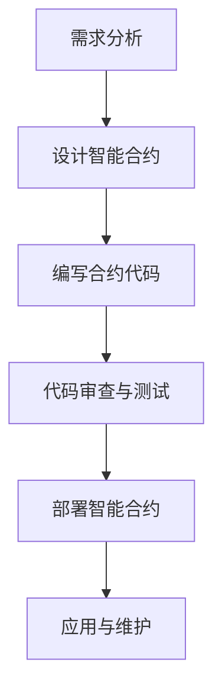

                 

关键词：区块链、智能合约、技术优势、开发实践、未来展望

> 摘要：随着区块链技术的不断发展，智能合约作为一种创新的编程工具，在金融、供应链管理、医疗等多个领域得到了广泛应用。本文将从背景介绍、核心概念与联系、核心算法原理与操作步骤、数学模型与公式、项目实践、实际应用场景、未来展望等多个方面，深入探讨智能合约的开发与应用，为读者提供全面的了解和技术指导。

## 1. 背景介绍

智能合约是区块链技术的一项核心创新，它基于区块链的分布式账本和共识机制，使得合同的执行不再依赖于第三方中介，提高了交易的效率和透明度。智能合约最早由比特币的创造者中本聪提出，并在以太坊平台上得到广泛应用。随着区块链技术的不断成熟，智能合约的应用场景也日益丰富。

智能合约的开发具有巨大的技术优势。首先，智能合约运行在去中心化的区块链网络上，具有较高的安全性和可靠性。其次，智能合约的代码公开透明，可被各方审计和验证，降低了信任成本。此外，智能合约的自动化执行特性，使得许多复杂的商业逻辑可以简化为代码，降低了交易成本。

## 2. 核心概念与联系

### 2.1 区块链

区块链是一种分布式数据库技术，通过加密算法和共识机制，实现了数据的不可篡改和透明性。区块链上的数据以块为单位，每个块包含一定数量的交易记录，并通过加密算法与前后块进行链接，形成了一个链式数据结构。

### 2.2 智能合约

智能合约是运行在区块链网络上的计算机程序，它可以自动化执行合同条款，实现去中心化的交易和数据处理。智能合约的核心是代码，它定义了交易的条件和执行规则。

### 2.3 共识机制

共识机制是区块链网络中达成一致的关键技术，它保证了区块链数据的准确性和一致性。常见的共识机制包括工作量证明（PoW）、权益证明（PoS）和委托权益证明（DPoS）等。

### 2.4 Mermaid 流程图

以下是智能合约开发的基本流程的 Mermaid 流程图：



## 3. 核心算法原理与操作步骤

### 3.1 算法原理概述

智能合约的核心算法是基于图灵完备的编程语言，它支持条件判断、循环、函数调用等基本编程结构。智能合约的执行遵循以下基本原理：

1. **数据存储**：智能合约的数据存储在区块链的分布式账本中，保证了数据的安全和不可篡改。
2. **条件判断**：智能合约可以根据预设的条件执行不同的操作。
3. **消息传递**：智能合约可以通过区块链网络与其他合约进行交互。

### 3.2 算法步骤详解

智能合约的开发通常包括以下几个步骤：

1. **需求分析**：明确智能合约的功能和业务逻辑。
2. **设计智能合约**：根据需求分析，设计智能合约的结构和接口。
3. **编写合约代码**：使用智能合约编程语言（如Solidity）编写合约代码。
4. **代码审查与测试**：对合约代码进行审查和测试，确保其正确性和安全性。
5. **部署智能合约**：将智能合约部署到区块链网络中。
6. **应用与维护**：在智能合约上线后，进行持续的应用和监控，确保其稳定运行。

### 3.3 算法优缺点

智能合约具有以下优点：

1. **去中心化**：智能合约运行在去中心化的区块链网络中，具有较高的安全性。
2. **自动化执行**：智能合约可以自动化执行合同条款，提高了交易的效率和透明度。
3. **代码透明**：智能合约的代码公开透明，可被各方审计和验证。

但智能合约也存在一些缺点：

1. **安全性问题**：智能合约代码一旦部署，就无法修改，一旦出现漏洞，可能带来严重的安全风险。
2. **性能瓶颈**：区块链网络的处理能力有限，智能合约的执行速度和并发能力有待提高。
3. **法律风险**：智能合约的法律地位和适用性仍存在争议，可能带来法律风险。

### 3.4 算法应用领域

智能合约的应用领域广泛，包括：

1. **金融领域**：智能合约可以用于自动化的金融交易、支付结算、股权管理等。
2. **供应链管理**：智能合约可以用于供应链金融、库存管理、物流追踪等。
3. **医疗领域**：智能合约可以用于电子病历管理、药品供应链、医疗支付等。
4. **游戏领域**：智能合约可以用于游戏虚拟资产的交易、游戏币的发行等。

## 4. 数学模型和公式

### 4.1 数学模型构建

智能合约中的数学模型通常用于表示业务逻辑和计算过程。一个基本的数学模型可能包括以下要素：

1. **状态变量**：表示智能合约的状态，如余额、用户信息等。
2. **事件**：表示智能合约的触发条件和执行操作。
3. **函数**：表示智能合约中的计算过程。

### 4.2 公式推导过程

以下是一个简单的智能合约中的数学公式推导示例：

$$
\text{balance} = \text{balance} + \text{amount}
$$

这个公式表示当某个用户向智能合约账户转入金额`amount`时，智能合约账户的余额`balance`会增加相应的金额。

### 4.3 案例分析与讲解

以一个简单的众筹智能合约为例，其数学模型可能包括以下公式：

$$
\text{total\_collected} = \text{total\_collected} + \text{contribution}
$$

$$
\text{balance} = \text{balance} + \text{contribution}
$$

这两个公式分别表示当某个用户进行捐款时，众筹项目的总收款金额和智能合约账户的余额都会增加相应的捐款金额。

## 5. 项目实践：代码实例和详细解释说明

### 5.1 开发环境搭建

要开发智能合约，需要搭建合适的开发环境。以下是一个基于以太坊的开发环境搭建步骤：

1. 安装Go语言：下载并安装Go语言环境。
2. 安装Node.js：下载并安装Node.js环境。
3. 安装Truffle框架：使用npm命令安装Truffle框架。

### 5.2 源代码详细实现

以下是一个简单的以太坊智能合约示例：

```solidity
pragma solidity ^0.8.0;

contract Crowdfunding {
    address public owner;
    uint256 public totalCollected;
    mapping(address => uint256) public contributions;

    constructor() {
        owner = msg.sender;
    }

    function contribute() public payable {
        require(msg.value > 0, "贡献金额必须大于0");
        contributions[msg.sender] += msg.value;
        totalCollected += msg.value;
    }

    function withdraw() public {
        require(msg.sender == owner, "只有合约所有者可以提现");
        msg.sender.transfer(totalCollected);
        totalCollected = 0;
    }
}
```

### 5.3 代码解读与分析

这个智能合约实现了简单的众筹功能，主要包括以下部分：

1. **构造函数**：定义合约所有者和总收款金额。
2. **contribute函数**：接收用户的捐款，并将捐款金额记录在区块链上。
3. **withdraw函数**：允许合约所有者提现总收款金额。

### 5.4 运行结果展示

通过Truffle框架，可以编译、部署和测试智能合约。以下是运行结果的一个简单示例：

```bash
truffle compile
truffle migrate --network development
```

这两个命令将编译合约代码并将其部署到本地以太坊节点。

## 6. 实际应用场景

智能合约在金融、供应链管理、医疗、游戏等多个领域都有广泛的应用。以下是一些具体的应用场景：

1. **金融领域**：智能合约可以用于自动化的金融交易、支付结算、股权管理等。
2. **供应链管理**：智能合约可以用于供应链金融、库存管理、物流追踪等。
3. **医疗领域**：智能合约可以用于电子病历管理、药品供应链、医疗支付等。
4. **游戏领域**：智能合约可以用于游戏虚拟资产的交易、游戏币的发行等。

## 7. 未来应用展望

随着区块链技术的不断发展，智能合约的应用前景将更加广阔。未来智能合约的发展趋势包括：

1. **性能提升**：通过改进区块链网络架构和共识机制，提高智能合约的执行速度和并发能力。
2. **标准化**：制定统一的智能合约标准，提高合约的可移植性和互操作性。
3. **跨链互操作**：实现不同区块链之间的智能合约互操作，打破技术壁垒。
4. **合规性**：解决智能合约的法律地位和合规性问题，推动其在各个领域的应用。

## 8. 工具和资源推荐

### 8.1 学习资源推荐

1. 《智能合约：从入门到实战》
2. 《区块链技术指南》
3. Ethereum官方文档

### 8.2 开发工具推荐

1. Truffle：智能合约开发框架。
2. Remix：在线智能合约开发工具。
3. Ganache：本地以太坊节点模拟器。

### 8.3 相关论文推荐

1. “Bitcoin: A Peer-to-Peer Electronic Cash System”
2. “Ethereum: The World's Computer”
3. “DeFi: Decentralized Finance on Ethereum”

## 9. 总结：未来发展趋势与挑战

智能合约作为一种创新的编程工具，在区块链技术中具有重要地位。未来，随着区块链技术的不断成熟和应用场景的丰富，智能合约将继续发挥重要作用。然而，智能合约的安全性问题、性能瓶颈、法律合规性等挑战也需要我们持续关注和解决。通过不断探索和创新，我们有望在智能合约领域取得更多突破。

### 9.1 研究成果总结

本文对智能合约的开发与应用进行了全面深入的探讨，包括背景介绍、核心概念与联系、核心算法原理与操作步骤、数学模型与公式、项目实践、实际应用场景、未来展望等多个方面，为读者提供了丰富的知识和实践指导。

### 9.2 未来发展趋势

未来，智能合约将在区块链技术的推动下，继续拓展其应用领域，提高性能和安全性，实现跨链互操作，成为数字经济中的重要基础设施。

### 9.3 面临的挑战

智能合约在发展过程中，将面临安全性、性能、法律合规性等挑战。我们需要通过技术创新和法规完善，逐步解决这些问题。

### 9.4 研究展望

智能合约研究将继续深入，探讨新的算法和架构，探索智能合约在更多领域的应用。同时，我们也期待智能合约能够为区块链技术的发展和数字经济的建设做出更大贡献。

## 10. 附录：常见问题与解答

### 10.1 智能合约的安全问题如何解决？

智能合约的安全问题可以通过以下措施解决：

1. **代码审查**：对智能合约代码进行严格的审查，确保代码的正确性和安全性。
2. **测试**：对智能合约进行全面的测试，包括单元测试、集成测试和压力测试等。
3. **安全审计**：聘请专业的安全审计团队对智能合约进行审计，发现和修复潜在的安全漏洞。

### 10.2 智能合约的性能瓶颈如何突破？

智能合约的性能瓶颈可以通过以下方法突破：

1. **优化算法**：对智能合约中的算法进行优化，提高执行效率。
2. **分层架构**：采用分层架构，将复杂逻辑拆分为多个子合约，提高并行处理能力。
3. **分片技术**：采用分片技术，将区块链网络分割为多个部分，提高网络处理能力。

### 10.3 智能合约的法律地位如何认定？

智能合约的法律地位在各国存在一定差异。一般来说，智能合约在符合法律要求的前提下，可以被视为有效的合同。为了确保智能合约的法律效力，建议在合同条款中明确智能合约的法律适用和解释原则。

### 10.4 如何选择智能合约开发工具？

选择智能合约开发工具时，可以从以下几个方面考虑：

1. **易用性**：工具是否易于学习和使用，是否有丰富的文档和社区支持。
2. **功能齐全**：工具是否支持智能合约开发所需的各种功能，如合约编译、部署、测试等。
3. **性能稳定**：工具的性能是否稳定，是否能够满足开发需求。
4. **社区活跃度**：工具是否有活跃的社区支持，是否能够及时解决开发过程中遇到的问题。

