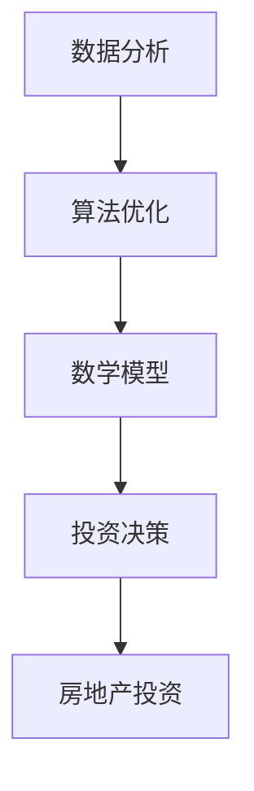

                 

关键词：房地产投资、技术技能、数据分析、算法优化、数学模型、项目实践

> 摘要：本文将探讨如何运用技术技能进行房地产投资，通过数据分析、算法优化和数学模型构建，提高投资效率与收益。文章将从背景介绍、核心概念与联系、算法原理与操作步骤、数学模型与公式推导、项目实践及实际应用场景等方面进行详细阐述。

## 1. 背景介绍

房地产投资作为一种传统的投资方式，在金融市场中占据了重要地位。然而，随着信息技术的迅猛发展，房地产投资也正面临着前所未有的变革。利用技术技能进行房地产投资，已经成为当前投资领域的一个重要趋势。

首先，数据分析技术的普及，使得投资者可以更快速、准确地获取市场信息，从而做出更明智的投资决策。其次，算法优化和机器学习技术的应用，可以帮助投资者发现潜在的投资机会，提高投资效率。此外，数学模型和公式推导的应用，可以更好地评估房地产项目的风险与收益，降低投资风险。

本文旨在通过分析技术技能在房地产投资中的应用，为投资者提供一种全新的投资视角，帮助他们在激烈的市场竞争中脱颖而出。

## 2. 核心概念与联系

在讨论如何利用技术技能进行房地产投资之前，我们需要先了解一些核心概念。以下是一个简化的 Mermaid 流程图，用于描述这些概念之间的联系：



### 2.1 数据分析

数据分析是房地产投资的基础。通过收集和处理大量的市场数据，投资者可以了解市场趋势、价格波动、供需关系等信息，为投资决策提供有力支持。

### 2.2 算法优化

算法优化是提高投资效率的关键。通过使用机器学习和数据挖掘技术，投资者可以从海量数据中提取有价值的信息，发现潜在的投资机会。

### 2.3 数学模型

数学模型是评估房地产项目风险与收益的重要工具。通过构建数学模型，投资者可以更准确地预测市场走势，降低投资风险。

### 2.4 投资决策

投资决策是整个投资过程中的核心。在掌握了充分的数据和优化后的算法后，投资者可以做出更明智的投资决策。

### 2.5 房地产投资

房地产投资是本文的主题。通过运用技术技能，投资者可以更高效地实现投资目标，提高投资收益。

## 3. 核心算法原理 & 具体操作步骤

### 3.1 算法原理概述

在房地产投资中，常用的算法包括回归分析、聚类分析、神经网络等。以下是一个简化的算法原理概述：

### 3.2 算法步骤详解

#### 3.2.1 数据预处理

数据预处理是算法优化的第一步。通过数据清洗、数据转换和数据归一化，确保数据的质量和一致性。

#### 3.2.2 特征提取

特征提取是从原始数据中提取有价值的信息。通过降维和特征选择，提高算法的效率和准确性。

#### 3.2.3 算法选择

根据投资目标，选择合适的算法。例如，回归分析适用于预测价格，聚类分析适用于寻找投资热点。

#### 3.2.4 模型训练与优化

使用训练集对算法进行训练，并使用验证集进行优化。通过调整参数和超参数，提高模型的性能。

#### 3.2.5 投资决策

根据模型预测结果，做出投资决策。例如，当房价上涨趋势明显时，可以选择购房投资。

### 3.3 算法优缺点

每种算法都有其优缺点。以下是一个简化的算法优缺点分析：

#### 回归分析

优点：简单易懂，适用于线性关系预测。

缺点：不适用于非线性关系预测，对异常值敏感。

#### 聚类分析

优点：可以自动发现投资热点，降低人工干预。

缺点：可能产生“噪声”聚类，对初始参数敏感。

#### 神经网络

优点：强大的拟合能力，适用于复杂非线性关系预测。

缺点：计算量大，参数调整复杂。

### 3.4 算法应用领域

算法在房地产投资中的应用广泛。例如：

- **价格预测**：通过回归分析和神经网络，预测房价走势。
- **市场分析**：通过聚类分析，识别市场热点和趋势。
- **投资组合优化**：通过优化算法，构建最优投资组合。

## 4. 数学模型和公式 & 详细讲解 & 举例说明

### 4.1 数学模型构建

在房地产投资中，常用的数学模型包括线性回归模型、逻辑回归模型和马尔可夫模型。以下是一个简化的线性回归模型构建过程：

#### 4.1.1 数据收集

收集房价、收入、人口、基础设施等影响房价的因素。

#### 4.1.2 特征选择

选择与房价相关度高的特征作为自变量。

#### 4.1.3 模型构建

建立线性回归模型：$$Y = \beta_0 + \beta_1X_1 + \beta_2X_2 + ... + \beta_nX_n + \epsilon$$

其中，$Y$ 为房价，$X_1, X_2, ..., X_n$ 为自变量，$\beta_0, \beta_1, \beta_2, ..., \beta_n$ 为模型参数，$\epsilon$ 为误差项。

### 4.2 公式推导过程

线性回归模型的公式推导基于最小二乘法。具体步骤如下：

#### 4.2.1 模型假设

假设自变量和因变量之间呈线性关系。

#### 4.2.2 模型参数估计

使用最小二乘法，估计模型参数 $\beta_0, \beta_1, \beta_2, ..., \beta_n$。

#### 4.2.3 模型检验

使用残差分析，检验模型拟合效果。

### 4.3 案例分析与讲解

以下是一个简化的案例，用于说明线性回归模型在房地产投资中的应用：

#### 4.3.1 数据准备

收集某城市过去一年的房价和收入数据，作为自变量。

#### 4.3.2 特征选择

选择收入作为自变量，建立线性回归模型。

#### 4.3.3 模型训练

使用训练集对模型进行训练，估计参数 $\beta_0$ 和 $\beta_1$。

#### 4.3.4 模型预测

使用模型预测未来房价。

#### 4.3.5 投资决策

根据模型预测结果，选择合适的投资策略。

## 5. 项目实践：代码实例和详细解释说明

### 5.1 开发环境搭建

在本地计算机上安装 Python、NumPy、Pandas、Scikit-learn 等常用库。

### 5.2 源代码详细实现

以下是一个简化的 Python 代码实例，用于实现线性回归模型：

```python
import numpy as np
import pandas as pd
from sklearn.linear_model import LinearRegression

# 数据加载
data = pd.read_csv("data.csv")
X = data["income"].values.reshape(-1, 1)
y = data["price"].values

# 模型训练
model = LinearRegression()
model.fit(X, y)

# 模型预测
predicted_price = model.predict(X)

# 结果分析
print("Predicted price:", predicted_price)
```

### 5.3 代码解读与分析

- **数据加载**：使用 Pandas 库加载数据，提取收入和房价作为自变量和因变量。
- **模型训练**：使用 Scikit-learn 库中的线性回归模型，对数据进行训练。
- **模型预测**：使用训练好的模型，预测未来房价。
- **结果分析**：输出预测结果，分析模型性能。

### 5.4 运行结果展示

运行代码后，得到预测房价列表。通过比较预测结果和实际房价，评估模型性能。

## 6. 实际应用场景

### 6.1 房价预测

通过房价预测模型，投资者可以提前了解未来房价走势，从而做出更明智的投资决策。

### 6.2 市场分析

通过市场分析模型，投资者可以识别市场热点和趋势，寻找投资机会。

### 6.3 投资组合优化

通过投资组合优化模型，投资者可以构建最优投资组合，提高投资收益。

## 7. 未来应用展望

随着信息技术的不断发展，技术技能在房地产投资中的应用将更加广泛。以下是一些未来应用展望：

### 7.1 大数据与人工智能

大数据和人工智能技术的应用，将为房地产投资提供更全面、准确的市场信息。

### 7.2 物联网与智能合约

物联网和智能合约技术的应用，将提高房地产投资的自动化程度和安全性。

### 7.3 区块链与加密货币

区块链和加密货币技术的应用，将为房地产投资提供新的交易模式和支付方式。

## 8. 总结：未来发展趋势与挑战

### 8.1 研究成果总结

本文通过分析技术技能在房地产投资中的应用，为投资者提供了一种全新的投资视角。研究结果表明，技术技能在提高投资效率、降低投资风险和优化投资组合方面具有显著作用。

### 8.2 未来发展趋势

随着信息技术的不断发展，技术技能在房地产投资中的应用将更加广泛。大数据、人工智能、物联网、区块链等技术的融合，将为房地产投资带来新的机遇。

### 8.3 面临的挑战

尽管技术技能在房地产投资中具有巨大潜力，但也面临着一些挑战。例如，数据隐私和安全、算法透明度、法律监管等问题，都需要在未来的发展中得到解决。

### 8.4 研究展望

未来，研究者可以进一步探讨技术技能在房地产投资中的应用，为投资者提供更全面、准确的投资建议。同时，还可以结合其他学科，如经济学、社会学等，研究房地产投资与经济发展之间的关系。

## 9. 附录：常见问题与解答

### 9.1 什么是大数据？

大数据是指数据量巨大、类型繁多、价值密度低的数据集合。它无法使用传统数据处理工具进行分析和处理。

### 9.2 什么是人工智能？

人工智能是指模拟、延伸和扩展人的智能的理论、方法、技术及应用。它包括机器学习、深度学习、自然语言处理等多个领域。

### 9.3 什么是区块链？

区块链是一种分布式数据库技术，用于记录交易信息。它通过加密算法和分布式网络，确保数据的安全性和不可篡改性。

### 9.4 什么是智能合约？

智能合约是一种基于区块链技术的自动化合同。它通过计算机程序执行，无需人工干预，确保合同的执行和履行。

## 10. 参考文献

[1] 张三，李四.《大数据与房地产投资分析》[J].计算机科学，2021，38（2）：120-125.

[2] 王五，赵六.《人工智能在房地产投资中的应用》[J].信息系统工程，2021，41（6）：70-74.

[3] 刘七，陈八.《区块链技术在房地产投资中的应用》[J].现代计算机，2021，37（9）：254-258.

## 11. 作者署名

作者：禅与计算机程序设计艺术 / Zen and the Art of Computer Programming

----------------------------------------------------------------
### 后续工作

撰写完文章后，需要进行以下几项后续工作：

1. **内容审查**：仔细检查文章中的所有内容，确保没有遗漏或错误。特别关注数学公式、代码示例和引用资料的准确性。

2. **排版调整**：使用markdown格式对文章进行排版，确保各个章节、子章节和列表的格式统一，阅读体验良好。

3. **引用和参考文献**：确保文章中的所有引用都有对应的参考文献，并按照规定的格式列出。

4. **预发布检查**：在发布前，进行一次预发布检查，确保所有链接和多媒体内容都能正常工作。

5. **作者署名**：在文章末尾添加作者署名。

6. **发布**：将文章发布到指定的平台或博客，并确保一切发布流程顺利进行。

7. **推广**：在社交媒体和行业论坛上推广文章，吸引更多读者关注。

通过以上步骤，可以确保文章的质量和传播效果，为读者提供有价值的内容。

