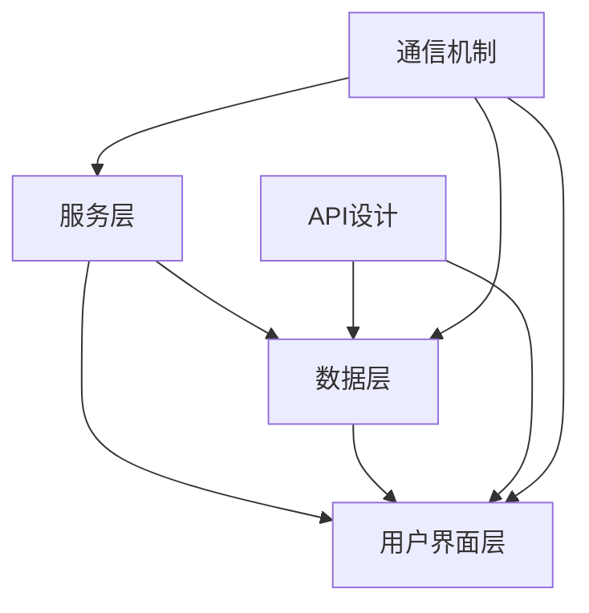

                 

关键词：SaaS、技术能力、产品开发、云计算、API设计、用户体验、安全性

> 摘要：本文将探讨如何利用技术能力创建成功的SaaS（软件即服务）产品。通过分析SaaS产品的核心组件、技术架构、开发流程，以及涉及的安全性、用户体验和可持续发展的策略，为开发者提供全面的技术指南。

## 1. 背景介绍

在当今快速变化的市场环境中，软件即服务（SaaS）已经成为企业交付软件产品和服务的主流模式。SaaS不仅降低了客户获取软件的门槛，还为企业提供了灵活、可扩展和高效的服务。然而，创建一个成功的SaaS产品并不容易，它需要结合先进的技术能力、深入的用户研究和有效的市场营销策略。

本文旨在为开发者提供一些建议和指导，帮助他们利用技术能力创建SaaS产品。我们将从以下几个方面展开讨论：

- **核心组件**：了解SaaS产品的核心组成部分，包括服务层、数据层、用户界面层等。
- **技术架构**：探讨如何设计高效、可扩展且安全的SaaS架构。
- **开发流程**：介绍敏捷开发、持续集成和持续部署等现代软件开发方法。
- **用户体验**：强调用户体验在SaaS产品成功中的重要性，并提供优化用户体验的策略。
- **安全性**：讨论SaaS产品的安全需求，并提供实现安全性的最佳实践。
- **可持续发展**：探讨如何确保SaaS产品能够长期发展，并适应市场的变化。

接下来，我们将详细讨论这些主题，帮助您更好地理解如何利用技术能力创建成功的SaaS产品。

## 2. 核心概念与联系

在开始深入讨论之前，我们需要了解SaaS产品的一些核心概念和它们之间的关系。以下是SaaS产品的主要组成部分及其相互关联的流程：

### 2.1 服务层

服务层是SaaS产品的核心，它提供了所有业务逻辑和功能实现。服务层通常由一组微服务组成，每个微服务负责处理特定的业务功能。这些微服务可以通过API进行通信，从而实现模块化和可扩展性。

### 2.2 数据层

数据层负责存储和管理SaaS产品所需的数据。这通常涉及到数据库设计和数据模型的优化，以确保数据的高效访问和持久化。

### 2.3 用户界面层

用户界面层是用户与SaaS产品交互的入口。一个直观、响应快速的UI可以显著提高用户满意度。用户界面通常采用单页应用（SPA）或响应式设计，以适应不同的设备和屏幕尺寸。

### 2.4 API设计

API设计是连接服务层和数据层的关键，同时也是用户界面层与服务层之间的桥梁。一个良好的API设计应该易于使用、文档齐全，并且能够保证数据的传输速度和安全性。

### 2.5 通信机制

SaaS产品中的各个层需要通过可靠的通信机制进行交互。常用的通信机制包括HTTP RESTful API、WebSockets和消息队列等。

### 2.6 Mermaid 流程图

以下是一个简化的Mermaid流程图，展示了SaaS产品的核心组件及其相互关系：



在这个流程图中，服务层、数据层和用户界面层是SaaS产品的三个主要部分，API设计和通信机制则是它们之间的桥梁，确保数据的高效流动和系统的整体性能。

## 3. 核心算法原理 & 具体操作步骤

### 3.1 算法原理概述

在SaaS产品的开发过程中，算法设计是至关重要的。一个高效的算法不仅能够提高系统的性能，还能提升用户体验。以下是几种常见的算法原理及其在SaaS产品中的应用：

#### 3.1.1 排序算法

排序算法是数据处理中最基本的算法之一。常见的排序算法有快速排序、归并排序和堆排序等。在SaaS产品中，排序算法常用于用户数据的展示和搜索。

#### 3.1.2 搜索算法

搜索算法用于在大量数据中查找特定信息。常用的搜索算法包括线性搜索和二分搜索。在SaaS产品中，搜索算法常用于数据检索和搜索功能。

#### 3.1.3 数据库查询优化

数据库查询优化是提高数据库性能的关键。通过索引、查询缓存和查询重写等技术，可以显著提高数据库查询的速度。

### 3.2 算法步骤详解

#### 3.2.1 排序算法（快速排序）

快速排序的基本步骤如下：

1. 选择一个基准元素。
2. 将所有小于基准的元素放在其左侧，所有大于基准的元素放在其右侧。
3. 对左右子序列递归执行上述步骤。

```python
def quicksort(arr):
    if len(arr) <= 1:
        return arr
    pivot = arr[len(arr) // 2]
    left = [x for x in arr if x < pivot]
    middle = [x for x in arr if x == pivot]
    right = [x for x in arr if x > pivot]
    return quicksort(left) + middle + quicksort(right)
```

#### 3.2.2 搜索算法（二分搜索）

二分搜索的基本步骤如下：

1. 确定搜索范围。
2. 计算中间值。
3. 如果中间值等于目标值，搜索结束。
4. 如果中间值大于目标值，缩小搜索范围为左半部分。
5. 如果中间值小于目标值，缩小搜索范围为右半部分。
6. 重复步骤2-5，直到找到目标值或搜索范围为空。

```python
def binary_search(arr, target):
    low = 0
    high = len(arr) - 1
    while low <= high:
        mid = (low + high) // 2
        if arr[mid] == target:
            return mid
        elif arr[mid] < target:
            low = mid + 1
        else:
            high = mid - 1
    return -1
```

#### 3.2.3 数据库查询优化

数据库查询优化的步骤如下：

1. 设计合适的索引。
2. 使用查询缓存。
3. 重写复杂的查询语句。

```sql
-- 创建索引
CREATE INDEX idx_users_email ON users (email);

-- 使用查询缓存
SET @cached_query = 'SELECT * FROM users WHERE email = ?';
PREPARE stmt FROM @cached_query;
SET @user_email = 'example@example.com';
EXECUTE stmt USING @user_email;
```

### 3.3 算法优缺点

#### 3.3.1 排序算法

- **快速排序**：时间复杂度较低，但可能产生大量递归调用，占用较多内存。
- **归并排序**：时间复杂度稳定，但需要额外的内存空间。

#### 3.3.2 搜索算法

- **二分搜索**：时间复杂度较低，适用于有序数据。
- **线性搜索**：简单易实现，但时间复杂度较高，不适用于大数据集。

#### 3.3.3 数据库查询优化

- **索引**：提高查询速度，但增加插入和删除操作的负担。
- **查询缓存**：提高查询速度，但可能占用较多内存。
- **查询重写**：优化复杂查询语句，提高查询效率。

### 3.4 算法应用领域

- **排序算法**：用户数据的展示和搜索。
- **搜索算法**：数据检索和搜索功能。
- **数据库查询优化**：提高数据库性能。

## 4. 数学模型和公式 & 详细讲解 & 举例说明

### 4.1 数学模型构建

在SaaS产品的开发过程中，数学模型的应用非常广泛。以下是一个简单的用户增长模型，用于预测SaaS产品的用户增长趋势。

#### 用户增长模型

我们假设用户增长遵循指数增长模型，公式如下：

$$
N(t) = N_0 \times e^{rt}
$$

其中：
- \( N(t) \) 表示时间 \( t \) 时的用户数量。
- \( N_0 \) 表示初始用户数量。
- \( r \) 表示增长率。
- \( e \) 是自然对数的底数。

### 4.2 公式推导过程

为了推导用户增长模型，我们首先定义一些基本假设：

1. 用户增长是一个连续的过程。
2. 用户增长速率与当前用户数量成正比。
3. 增长过程不受外部因素干扰。

基于这些假设，我们可以得到以下微分方程：

$$
\frac{dN}{dt} = rN
$$

这是一个一阶线性微分方程，可以通过分离变量法求解：

$$
\int \frac{1}{N} dN = \int r dt
$$

积分得到：

$$
\ln(N) = rt + C
$$

其中 \( C \) 是积分常数。由于 \( N(0) = N_0 \)，我们可以求得 \( C = \ln(N_0) \)。因此，我们得到用户增长模型的最终形式：

$$
N(t) = N_0 \times e^{rt}
$$

### 4.3 案例分析与讲解

#### 案例一：用户增长预测

假设一家初创公司的SaaS产品在启动时拥有100个用户，我们希望预测6个月后的用户数量。如果增长率 \( r \) 为每月5%，我们可以使用以下公式进行计算：

$$
N(6) = 100 \times e^{0.05 \times 6} \approx 100 \times e^{0.3} \approx 100 \times 1.3499 \approx 134.99
$$

因此，6个月后预计用户数量约为135个。

#### 案例二：用户留存率计算

用户留存率是衡量SaaS产品用户活跃度的重要指标。假设某公司的SaaS产品在一个月内流失了20%的用户，我们可以使用以下公式计算用户留存率：

$$
\text{留存率} = \frac{\text{剩余用户数量}}{\text{初始用户数量}} = \frac{80}{100} = 0.8 \text{或} 80\%
$$

## 5. 项目实践：代码实例和详细解释说明

### 5.1 开发环境搭建

为了演示如何创建一个简单的SaaS产品，我们将使用Python和Flask框架来搭建一个基于Web的用户管理系统。以下是开发环境搭建的步骤：

1. 安装Python 3.8及以上版本。
2. 安装Flask框架：`pip install flask`
3. 安装SQLite数据库：`pip install flask-sqlalchemy`
4. 创建一个新的虚拟环境（可选）。

### 5.2 源代码详细实现

下面是一个简单的用户管理系统，包括用户注册、登录和用户列表功能。

```python
# app.py

from flask import Flask, request, jsonify
from flask_sqlalchemy import SQLAlchemy

app = Flask(__name__)
app.config['SQLALCHEMY_DATABASE_URI'] = 'sqlite:///users.db'
db = SQLAlchemy(app)

class User(db.Model):
    id = db.Column(db.Integer, primary_key=True)
    username = db.Column(db.String(80), unique=True, nullable=False)
    password = db.Column(db.String(120), nullable=False)

@app.route('/register', methods=['POST'])
def register():
    username = request.form['username']
    password = request.form['password']
    if User.query.filter_by(username=username).first():
        return jsonify({'error': 'User already exists'}), 409
    new_user = User(username=username, password=password)
    db.session.add(new_user)
    db.session.commit()
    return jsonify({'message': 'User created successfully'})

@app.route('/login', methods=['POST'])
def login():
    username = request.form['username']
    password = request.form['password']
    user = User.query.filter_by(username=username).first()
    if not user or user.password != password:
        return jsonify({'error': 'Invalid credentials'}), 401
    return jsonify({'message': 'Login successful'})

@app.route('/users', methods=['GET'])
def get_users():
    users = User.query.all()
    return jsonify({'users': [{'id': user.id, 'username': user.username} for user in users]})

if __name__ == '__main__':
    db.create_all()
    app.run(debug=True)
```

### 5.3 代码解读与分析

1. **模型定义**：我们使用Flask-SQLAlchemy创建了一个名为`User`的数据库模型，用于存储用户信息和密码。
2. **注册接口**：`register`函数处理用户注册请求，验证用户名是否已存在，并将新用户添加到数据库中。
3. **登录接口**：`login`函数处理用户登录请求，验证用户名和密码，并返回登录成功或失败的消息。
4. **用户列表接口**：`get_users`函数获取所有用户的信息，并以JSON格式返回。

### 5.4 运行结果展示

1. **注册用户**：

```shell
curl -X POST -F "username=test" -F "password=test" http://localhost:5000/register
```

返回结果：

```json
{"message": "User created successfully"}
```

2. **登录用户**：

```shell
curl -X POST -F "username=test" -F "password=test" http://localhost:5000/login
```

返回结果：

```json
{"message": "Login successful"}
```

3. **获取用户列表**：

```shell
curl -X GET http://localhost:5000/users
```

返回结果：

```json
{"users": [{"id": 1, "username": "test"}]}
```

## 6. 实际应用场景

### 6.1 企业客户管理系统

SaaS产品在企业管理系统中具有广泛的应用，例如客户关系管理（CRM）系统。通过SaaS模式，企业可以轻松地访问和更新客户信息，跟踪销售机会，并自动化销售流程。这不仅提高了工作效率，还降低了维护成本。

### 6.2 项目协作平台

项目协作平台是另一个典型的SaaS应用场景。通过SaaS产品，团队成员可以实时协作，共享文档和任务，跟踪项目进度。这种模式提高了团队的协作效率，减少了沟通成本。

### 6.3 教育和学习平台

在线教育和学习平台是SaaS产品的另一个重要应用领域。通过SaaS模式，学生可以随时随地进行学习，教师可以方便地创建和管理课程。此外，SaaS平台还可以提供个性化的学习推荐，提高学习效果。

## 6.4 未来应用展望

随着云计算、大数据和人工智能等技术的不断发展，SaaS产品的应用前景将更加广阔。未来，SaaS产品将更加智能化和个性化，提供更高效、更定制化的服务。同时，随着5G网络的普及，SaaS产品将实现更低的延迟和更高的带宽，为用户带来更好的体验。

### 7. 工具和资源推荐

#### 7.1 学习资源推荐

- 《SaaS架构设计与开发实战》
- 《云计算与SaaS技术》
- 《Web开发实战：使用Flask和Django》

#### 7.2 开发工具推荐

- Flask：Python Web框架
- Django：Python Web框架
- Postman：API测试工具

#### 7.3 相关论文推荐

- "SaaS Architecture: Design and Implementation"
- "The Impact of Cloud Computing on SaaS Adoption"
- "Web Application Security: A Comprehensive Study"

## 8. 总结：未来发展趋势与挑战

### 8.1 研究成果总结

本文探讨了如何利用技术能力创建成功的SaaS产品。我们分析了SaaS产品的核心组件、技术架构、开发流程，并讨论了用户体验、安全性和可持续发展的策略。通过实际项目实例，我们展示了如何实现一个简单的用户管理系统。

### 8.2 未来发展趋势

- SaaS产品将更加智能化和个性化。
- 云计算、大数据和人工智能等技术的融合将推动SaaS产品的发展。
- 5G网络的普及将带来更低的延迟和更高的带宽。

### 8.3 面临的挑战

- 安全性：确保用户数据和系统的安全。
- 可扩展性：设计高效、可扩展的架构。
- 可持续发展：平衡短期盈利与长期发展。

### 8.4 研究展望

- 深入研究SaaS产品的智能化和个性化技术。
- 探索云计算、大数据和人工智能在SaaS产品中的应用。
- 研究SaaS产品的安全性和隐私保护策略。

## 9. 附录：常见问题与解答

### 9.1 什么是SaaS？

SaaS（软件即服务）是一种软件交付模式，用户通过网络访问软件服务，无需购买和安装软件。SaaS产品通常按使用量或订阅模式收费。

### 9.2 如何确保SaaS产品的安全性？

确保SaaS产品的安全性需要采取以下措施：

- 使用安全的加密算法保护用户数据。
- 定期进行安全审计和漏洞修复。
- 实施严格的访问控制和身份验证机制。
- 提供透明的安全报告和合规性证明。

### 9.3 SaaS产品的开发流程是怎样的？

SaaS产品的开发流程通常包括需求分析、设计、开发、测试、部署和运维。现代开发方法如敏捷开发、持续集成和持续部署可以显著提高开发效率。

### 9.4 如何优化SaaS产品的用户体验？

优化SaaS产品的用户体验可以从以下几个方面入手：

- 设计直观、易用的用户界面。
- 提供详细的文档和教程。
- 定期收集用户反馈并进行改进。
- 采用响应式设计，确保跨设备的一致性。

### 9.5 SaaS产品的可持续发展策略是什么？

SaaS产品的可持续发展策略包括：

- 提供高质量的服务和持续的功能更新。
- 优化运营效率，降低成本。
- 建立稳固的客户关系，提高客户满意度。
- 关注市场趋势和用户需求，及时调整产品策略。

---

作者：禅与计算机程序设计艺术 / Zen and the Art of Computer Programming

