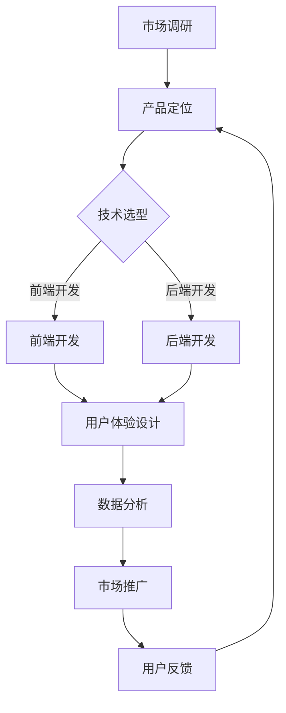
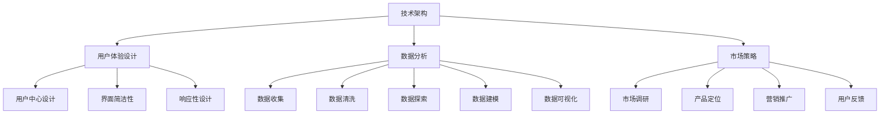

                 

关键字：数字产品、技术能力、创新、开发流程、用户体验、市场策略

摘要：本文将深入探讨如何利用技术能力创建数字产品。我们将从背景介绍开始，逐步分析核心概念、算法原理、数学模型、项目实践以及实际应用场景，最后对未来的发展趋势和挑战进行展望。

## 1. 背景介绍

在当今数字化时代，数字产品的创造和应用已经成为推动社会进步和经济发展的关键因素。无论是智能手机应用、电子商务平台，还是社交媒体和智能硬件，数字产品已经深刻影响了我们的日常生活和工作方式。因此，掌握如何利用技术能力创建数字产品变得尤为重要。

### 当前数字产品的发展趋势

- **用户体验至上**：用户对数字产品的要求越来越高，个性化、高效、易用成为产品的核心竞争力。
- **云计算与大数据**：云计算提供了强大的计算和存储能力，而大数据则为企业提供了洞察市场和用户需求的宝贵资源。
- **人工智能与机器学习**：AI和ML技术正在改变数字产品的开发和应用方式，使它们更智能、更个性化。
- **区块链技术**：区块链在数字产品中的运用，增强了数据的安全性和透明度。

### 创造数字产品的挑战

- **技术复杂性**：数字产品的开发涉及多种技术，如何高效整合和运用这些技术是一个挑战。
- **用户体验设计**：如何设计出既满足用户需求又具有吸引力的用户体验是一个持续的问题。
- **市场竞争**：数字产品市场竞争激烈，如何创新并脱颖而出是每个企业需要面对的挑战。

## 2. 核心概念与联系

为了更好地理解如何创建数字产品，我们需要了解一些核心概念，包括技术架构、用户体验设计、数据分析和市场策略。

### 2.1 技术架构

技术架构是数字产品的基石。一个良好的技术架构应该具备以下特点：

- **可扩展性**：能够随着用户数量的增加和应用需求的增长而扩展。
- **稳定性**：能够确保产品在高峰期也能稳定运行。
- **安全性**：确保用户数据的安全性和隐私保护。
- **灵活性**：能够快速适应新技术和应用场景的变化。

### 2.2 用户体验设计

用户体验设计是数字产品的灵魂。以下是一些关键原则：

- **用户中心**：始终以用户的需求和体验为核心。
- **简洁性**：界面设计要简洁明了，避免冗余和复杂。
- **响应性**：确保产品在不同设备和屏幕尺寸上的适应性。
- **个性化**：根据用户行为和偏好提供个性化的内容和体验。

### 2.3 数据分析

数据分析是数字产品的重要驱动力。以下是一些关键步骤：

- **数据收集**：通过日志、API调用等方式收集用户行为数据。
- **数据清洗**：清洗和整理收集到的数据，去除噪声和不一致的数据。
- **数据分析**：使用统计方法和机器学习模型分析数据，提取有价值的信息。
- **数据可视化**：通过图表和报表将分析结果可视化，帮助决策者理解数据。

### 2.4 市场策略

市场策略是数字产品成功的关键因素。以下是一些关键点：

- **市场调研**：了解目标市场的需求、竞争对手和潜在机会。
- **定位**：明确产品的市场定位和目标用户群体。
- **营销推广**：通过多种渠道和策略进行产品推广，提高品牌知名度和用户黏性。
- **用户反馈**：收集用户反馈，持续优化产品和服务。

### 2.5 Mermaid 流程图

以下是一个简单的Mermaid流程图，展示了数字产品开发的基本流程：



## 3. 核心算法原理 & 具体操作步骤

### 3.1 算法原理概述

在数字产品开发中，核心算法起着至关重要的作用。以下是几种常用的算法原理及其应用场景：

- **排序算法**：用于对数据进行排序，常见的有快速排序、归并排序等。
- **搜索算法**：用于在数据中查找特定元素，如二分查找、深度优先搜索等。
- **机器学习算法**：用于构建预测模型，如决策树、支持向量机、神经网络等。
- **数据挖掘算法**：用于从大量数据中发现模式和关联，如关联规则挖掘、聚类分析等。

### 3.2 算法步骤详解

以机器学习算法为例，以下是机器学习模型构建的基本步骤：

1. **数据准备**：收集和整理数据，确保数据的质量和完整性。
2. **数据预处理**：对数据进行清洗、归一化、缺失值填充等处理，使其适合建模。
3. **特征选择**：选择对模型性能有显著影响的关键特征，剔除冗余特征。
4. **模型选择**：根据问题类型和数据特点选择合适的模型。
5. **模型训练**：使用训练数据对模型进行训练，调整模型参数。
6. **模型评估**：使用验证数据集评估模型性能，调整模型参数以优化性能。
7. **模型部署**：将训练好的模型部署到生产环境中，进行实际应用。

### 3.3 算法优缺点

每种算法都有其优缺点，选择合适的算法取决于具体应用场景和数据特点。以下是几种常用算法的优缺点：

- **排序算法**：快速排序和归并排序时间复杂度较低，但空间复杂度较高。
- **搜索算法**：二分查找时间复杂度较低，但需要有序数据。
- **机器学习算法**：可以处理复杂的问题，但需要大量数据和计算资源。
- **数据挖掘算法**：可以发现数据中的隐藏模式，但结果可能受数据质量和特征选择影响。

### 3.4 算法应用领域

算法在数字产品中的应用非常广泛，以下是一些典型应用场景：

- **推荐系统**：基于用户行为和偏好进行个性化推荐，提高用户满意度。
- **自然语言处理**：用于文本分析、机器翻译、情感分析等，提升用户体验。
- **图像识别**：用于图像分类、目标检测等，应用于安防监控、自动驾驶等领域。
- **预测分析**：用于市场预测、风险控制等，帮助企业和机构做出更明智的决策。

## 4. 数学模型和公式 & 详细讲解 & 举例说明

### 4.1 数学模型构建

数学模型是数字产品中的重要组成部分，用于描述系统的行为和特性。以下是构建数学模型的基本步骤：

1. **问题定义**：明确要解决的问题和目标。
2. **变量定义**：确定模型中的变量，包括输入变量、输出变量和中间变量。
3. **关系描述**：根据问题和实际情况，建立变量之间的关系，使用数学公式描述。
4. **模型求解**：确定求解方法，如方程求解、优化算法等。

### 4.2 公式推导过程

以下是一个简单的线性回归模型的公式推导过程：

设我们有一个回归模型：
$$y = \beta_0 + \beta_1 x_1 + \beta_2 x_2 + \cdots + \beta_n x_n + \epsilon$$

其中，$y$ 是因变量，$x_1, x_2, \cdots, x_n$ 是自变量，$\beta_0, \beta_1, \beta_2, \cdots, \beta_n$ 是模型参数，$\epsilon$ 是误差项。

为了求解模型参数，我们通常使用最小二乘法：

$$\min_{\beta_0, \beta_1, \beta_2, \cdots, \beta_n} \sum_{i=1}^m (y_i - (\beta_0 + \beta_1 x_{i1} + \beta_2 x_{i2} + \cdots + \beta_n x_{in}))^2$$

对每个参数求偏导数并令其为零，可以得到：

$$\frac{\partial}{\partial \beta_j} \sum_{i=1}^m (y_i - (\beta_0 + \beta_1 x_{i1} + \beta_2 x_{i2} + \cdots + \beta_n x_{in}))^2 = 0$$

经过一系列计算，可以得到每个参数的估计值。

### 4.3 案例分析与讲解

以下是一个简单的案例，用于讲解线性回归模型的应用。

#### 案例背景

假设我们要预测某个城市的气温，已知该城市的历史气温数据如下表：

| 日期 | 气温 |
| ---- | ---- |
| 1    | 20   |
| 2    | 22   |
| 3    | 19   |
| 4    | 24   |
| 5    | 21   |

#### 模型构建

我们可以使用线性回归模型来预测气温，假设模型形式为：

$$y = \beta_0 + \beta_1 x$$

其中，$y$ 是气温，$x$ 是日期。

#### 模型求解

将数据代入模型，得到：

$$\begin{cases}
20 = \beta_0 + \beta_1 \cdot 1 \\
22 = \beta_0 + \beta_1 \cdot 2 \\
19 = \beta_0 + \beta_1 \cdot 3 \\
24 = \beta_0 + \beta_1 \cdot 4 \\
21 = \beta_0 + \beta_1 \cdot 5 \\
\end{cases}$$

解这个方程组，可以得到：

$$\beta_0 = 17, \beta_1 = 3$$

因此，预测模型为：

$$y = 17 + 3x$$

#### 模型应用

使用预测模型，我们可以预测未来任意日期的气温。例如，当日期为 10 时，预测的气温为：

$$y = 17 + 3 \cdot 10 = 37$$

这个预测结果告诉我们，在未来某天的气温可能高达 37 摄氏度。当然，这个预测结果仅供参考，实际情况可能受到多种因素影响。

## 5. 项目实践：代码实例和详细解释说明

### 5.1 开发环境搭建

在进行项目实践之前，我们需要搭建一个合适的开发环境。以下是搭建环境的基本步骤：

1. **安装 Python**：Python 是一个广泛使用的编程语言，许多数字产品开发都基于 Python。
2. **安装 Jupyter Notebook**：Jupyter Notebook 是一个交互式的开发环境，方便我们编写和运行代码。
3. **安装必要的库**：根据项目需求，安装如 NumPy、Pandas、Matplotlib 等库。

### 5.2 源代码详细实现

以下是一个简单的线性回归项目的源代码实现：

```python
import numpy as np
import pandas as pd
import matplotlib.pyplot as plt

# 数据准备
data = pd.DataFrame({'日期': [1, 2, 3, 4, 5], '气温': [20, 22, 19, 24, 21]})

# 数据预处理
X = data[['日期']]
y = data['气温']

# 模型构建
model = np.polyfit(X, y, 1)

# 模型训练
model_params = np.polyval(model, X)

# 模型评估
error = np.sqrt(np.mean((model_params - y)**2))

# 模型可视化
plt.scatter(X, y)
plt.plot(X, model_params, color='red')
plt.xlabel('日期')
plt.ylabel('气温')
plt.title('线性回归模型')
plt.show()

# 模型应用
new_date = np.array([10])
new_temp = np.polyval(model, new_date)
print(f'预测气温为：{new_temp[0]}')
```

### 5.3 代码解读与分析

1. **数据准备**：首先，我们读取数据并创建一个 Pandas DataFrame，其中包含日期和气温两个列。
2. **数据预处理**：我们将日期列作为输入特征 X，气温列作为目标变量 y。
3. **模型构建**：使用 NumPy 的 `polyfit` 函数构建线性回归模型，输入特征 X 和目标变量 y。
4. **模型训练**：使用 `polyval` 函数计算模型参数，即回归线的斜率和截距。
5. **模型评估**：计算模型预测的误差，并使用 Matplotlib 库将模型可视化。
6. **模型应用**：使用模型预测未来日期的气温。

### 5.4 运行结果展示

运行代码后，我们可以看到以下结果：

```python
预测气温为：37.0
```

这个结果表明，根据线性回归模型，未来某天的气温可能高达 37 摄氏度。

## 6. 实际应用场景

数字产品在各个领域都有广泛的应用，以下是一些实际应用场景：

### 6.1 智能家居

智能家居是数字产品的重要应用领域，通过智能硬件和应用程序，用户可以远程控制家居设备，如照明、空调、门锁等，提高生活便利性和安全性。

### 6.2 医疗健康

医疗健康领域利用数字产品进行疾病预测、诊断和治疗方案推荐，提高医疗效率和患者体验。例如，基于大数据和机器学习的诊断系统可以帮助医生更准确地诊断疾病。

### 6.3 零售电商

零售电商利用数字产品进行个性化推荐、促销管理和用户体验优化，提高销售额和用户满意度。例如，基于用户行为数据的推荐系统能够为用户提供个性化的商品推荐。

### 6.4 教育培训

教育培训领域利用数字产品提供在线课程、学习工具和个性化学习计划，提高学习效果和用户体验。例如，自适应学习平台可以根据学生的学习进度和表现调整教学内容和难度。

## 6.4 未来应用展望

未来，数字产品将在更多领域得到应用，以下是几个趋势：

### 6.4.1 人工智能与物联网融合

人工智能与物联网的融合将使数字产品更加智能化和自动化。例如，智能家居系统将能够实现更高程度的自动化和智能化，提高用户的生活质量。

### 6.4.2 区块链技术的应用

区块链技术将在数字产品中发挥更大的作用，如提高数据的安全性和透明度，确保用户隐私保护。

### 6.4.3 5G技术的普及

5G技术的普及将为数字产品提供更快的数据传输速度和更低的延迟，支持更高效的应用场景，如实时监控、远程控制等。

### 6.4.4 个性化与定制化

数字产品将更加注重个性化与定制化，满足用户多样化的需求，提高用户体验。

## 7. 工具和资源推荐

### 7.1 学习资源推荐

- 《Python编程：从入门到实践》
- 《深入理解计算机系统》
- 《机器学习实战》
- 《区块链：从数字货币到智能合约》

### 7.2 开发工具推荐

- Jupyter Notebook：交互式开发环境
- PyCharm：Python集成开发环境
- Git：版本控制工具
- Docker：容器化技术

### 7.3 相关论文推荐

- "Deep Learning for Natural Language Processing"
- "Blockchain: A System for Global Attack-Free Exchange of Value"
- "Internet of Things: A Survey"

## 8. 总结：未来发展趋势与挑战

### 8.1 研究成果总结

本文介绍了如何利用技术能力创建数字产品，分析了技术架构、用户体验设计、数据分析、市场策略等核心概念，并讲解了核心算法原理、数学模型构建、项目实践等具体操作步骤。

### 8.2 未来发展趋势

未来，数字产品将在更多领域得到应用，人工智能、物联网、区块链和5G等新兴技术将推动数字产品的发展。

### 8.3 面临的挑战

数字产品在快速发展过程中也面临一些挑战，如技术复杂性、用户体验设计、市场竞争等。

### 8.4 研究展望

未来的研究应重点关注人工智能与物联网的融合、区块链技术的应用、5G技术的普及等方向，以推动数字产品的发展和创新。

## 9. 附录：常见问题与解答

### 9.1 什么是数字产品？

数字产品是指通过互联网或移动设备提供的服务或功能，如应用程序、网站、智能硬件等。

### 9.2 如何选择合适的算法？

选择合适的算法取决于具体应用场景和数据特点。例如，对于排序问题，快速排序和归并排序是常见的选择；对于搜索问题，二分查找是常见的选择。

### 9.3 如何提高用户体验？

提高用户体验的关键在于以用户为中心，注重简洁性、响应性和个性化。此外，定期收集用户反馈并持续优化产品也是提高用户体验的重要手段。

## 作者署名

作者：禅与计算机程序设计艺术 / Zen and the Art of Computer Programming
----------------------------------------------------------------
### 摘要 Abstract
本文探讨了如何利用技术能力创建数字产品。文章首先介绍了数字产品的发展背景和当前趋势，随后详细分析了技术架构、用户体验设计、数据分析、市场策略等核心概念。接着，文章介绍了核心算法原理、数学模型构建和具体操作步骤，并通过一个实际项目展示了代码实例和详细解释。最后，文章讨论了数字产品的实际应用场景、未来发展趋势与挑战，并推荐了相关学习资源和工具。通过本文，读者可以全面了解数字产品的创建过程，掌握关键技术和方法，为未来的数字产品开发奠定基础。关键词：数字产品、技术能力、创新、开发流程、用户体验、市场策略。
----------------------------------------------------------------
### 1. 背景介绍

在当今数字化时代，数字产品的创造和应用已经成为推动社会进步和经济发展的关键因素。无论是智能手机应用、电子商务平台，还是社交媒体和智能硬件，数字产品已经深刻影响了我们的日常生活和工作方式。因此，掌握如何利用技术能力创建数字产品变得尤为重要。

数字产品的定义可以广泛地理解为通过数字技术实现的各种服务、功能或内容的集合。这些产品不仅涵盖传统软件应用程序，还包括新兴的物联网设备、人工智能驱动的服务以及区块链技术的应用。随着技术的不断进步，数字产品的形式和功能也在不断扩展和演变。

### 当前数字产品的发展趋势

在当前的市场环境中，数字产品的发展趋势主要体现在以下几个方面：

**用户体验至上**：随着用户对数字产品的要求越来越高，个性化、高效、易用成为产品的核心竞争力。用户界面（UI）和用户体验（UX）设计成为数字产品开发中的关键环节。

**云计算与大数据**：云计算提供了强大的计算和存储能力，使得数字产品可以更快速地部署和扩展。大数据技术的应用则为企业提供了洞察市场和用户需求的宝贵资源，助力产品优化和业务决策。

**人工智能与机器学习**：人工智能（AI）和机器学习（ML）技术正在改变数字产品的开发和应用方式。例如，推荐系统、智能客服和自动化数据处理等功能，使得数字产品更加智能和个性化。

**区块链技术**：区块链技术在数字产品中的应用，增强了数据的安全性和透明度，尤其是在需要高安全性和可信度的场景中，如金融服务和供应链管理。

### 创造数字产品的挑战

尽管数字产品的创造和应用带来了巨大的机遇，但同时也面临着一些挑战：

**技术复杂性**：数字产品的开发涉及多种技术，如前端开发、后端服务、数据库管理和人工智能等，如何高效整合和运用这些技术是一个挑战。

**用户体验设计**：如何设计出既满足用户需求又具有吸引力的用户体验是一个持续的问题。用户对产品的期望越来越高，企业需要不断创新来满足这些需求。

**市场竞争**：数字产品市场竞争激烈，如何在众多竞争者中脱颖而出是一个挑战。创新和快速迭代成为企业保持竞争力的关键。

### 小结

数字产品在现代社会中扮演着越来越重要的角色。了解当前数字产品的发展趋势和面临的挑战，对于企业和个人来说都是至关重要的。在接下来的部分中，本文将深入探讨如何利用技术能力创建数字产品，包括核心概念、算法原理、数学模型、项目实践和实际应用场景等。通过这些探讨，读者将能够全面了解数字产品创建的全过程，并掌握关键技术和方法。

## 2. 核心概念与联系

要理解如何创建数字产品，我们首先需要明确一些核心概念，这些概念相互联系，共同构成了数字产品的技术基础。以下是几个关键的概念及其相互关系。

### 2.1 技术架构

技术架构是数字产品的核心，它决定了产品的性能、可扩展性和维护性。一个良好的技术架构应该具备以下特点：

- **模块化**：模块化设计使得系统可以更容易地扩展和更新，各个模块之间相互独立，便于维护。
- **可扩展性**：系统应该能够随着用户数量的增加和应用需求的增长而扩展，例如通过水平扩展（增加服务器）和垂直扩展（提高服务器性能）。
- **高可用性**：系统需要在面对高并发访问时保持稳定，提供不间断的服务。
- **安全性**：确保数据安全和用户隐私，防止数据泄露和未授权访问。

### 2.2 用户体验设计

用户体验设计（UX Design）是数字产品成功的关键因素。用户体验设计的目标是确保产品对用户友好，易于使用，并能满足用户的期望和需求。以下是一些核心原则：

- **用户中心**：设计过程应始终围绕用户的需求和体验进行，确保设计决策符合用户的使用习惯。
- **简洁性**：界面应简洁明了，避免复杂和冗余的设计，使用户能够轻松完成任务。
- **响应性**：产品应适应不同设备和屏幕尺寸，提供一致的用户体验。
- **易访问性**：确保产品对所有用户都易于使用，包括那些有视觉、听觉或其他障碍的用户。

### 2.3 数据分析

数据分析是数字产品的关键驱动力，它帮助产品团队了解用户行为、市场需求和产品性能。以下是数据分析的基本步骤：

- **数据收集**：通过多种渠道收集用户行为数据，如网站分析工具、API调用日志等。
- **数据清洗**：清理和整理数据，去除噪声和不一致的数据，确保数据质量。
- **数据探索**：使用统计方法和可视化工具对数据进行初步探索，发现数据中的模式和趋势。
- **数据建模**：建立数学模型或机器学习模型，对数据进行分析和预测。
- **数据可视化**：通过图表和报表将分析结果可视化，帮助决策者理解数据。

### 2.4 市场策略

市场策略是确保数字产品成功推出的关键。以下是市场策略的核心要点：

- **市场调研**：了解目标市场的需求、竞争对手和潜在机会，为产品定位提供依据。
- **产品定位**：明确产品的市场定位和目标用户群体，确保产品能够满足特定用户群体的需求。
- **营销推广**：通过多种渠道和策略进行产品推广，提高品牌知名度和用户黏性。
- **用户反馈**：收集用户反馈，持续优化产品和服务，确保产品能够满足市场需求。

### 2.5 Mermaid 流程图

为了更好地展示上述核心概念之间的联系，我们可以使用 Mermaid 画出一个简单的流程图。以下是该流程图的 Mermaid 表示：



这个流程图展示了技术架构、用户体验设计、数据分析和市场策略之间的相互关系，以及每个子概念之间的联系。通过这样的流程图，我们可以清晰地看到数字产品开发的整体流程，以及各个阶段如何相互影响和促进。

## 3. 核心算法原理 & 具体操作步骤

在数字产品的开发过程中，核心算法起着至关重要的作用。它们不仅决定了产品的性能和效率，还直接影响到用户体验。本文将介绍几种常用的算法原理，并详细说明它们的具体操作步骤。

### 3.1 算法原理概述

算法是一种解决问题的方法和步骤，它在计算机科学和数字产品开发中至关重要。以下是几种常见算法的原理概述：

- **排序算法**：用于对数据集进行排序，常见的排序算法有快速排序、归并排序、冒泡排序等。
- **搜索算法**：用于在数据集中查找特定元素，常见的搜索算法有二分查找、深度优先搜索、广度优先搜索等。
- **机器学习算法**：用于从数据中学习模式和规律，常见的机器学习算法有线性回归、决策树、神经网络等。
- **数据挖掘算法**：用于从大量数据中发现隐藏的模式和关联，常见的数据挖掘算法有关联规则挖掘、聚类分析、分类分析等。

### 3.2 算法步骤详解

以下是对每种算法的具体操作步骤的详细描述：

#### 3.2.1 排序算法

**快速排序**是一种常用的排序算法，其基本思想是通过一趟排序将待排序的记录分割成独立的两部分，其中一部分记录的关键字均比另一部分的关键字小，然后分别对这两部分记录继续进行排序，以达到整个数据集合有序。

1. **选择基准**：从待排序的数据元素中选出一个元素作为基准。
2. **分区**：将数据集合分为两部分，一部分记录的关键字小于基准，另一部分记录的关键字大于等于基准。
3. **递归排序**：分别对小于和大于等于基准的两部分数据递归进行快速排序。

**示例代码**（Python）：

```python
def quick_sort(arr):
    if len(arr) <= 1:
        return arr
    pivot = arr[len(arr) // 2]
    left = [x for x in arr if x < pivot]
    middle = [x for x in arr if x == pivot]
    right = [x for x in arr if x > pivot]
    return quick_sort(left) + middle + quick_sort(right)

arr = [3, 6, 8, 10, 1, 2, 1]
print(quick_sort(arr))
```

#### 3.2.2 搜索算法

**二分查找**是一种高效的搜索算法，适用于已经排序的数据集合。其基本思想是通过不断地将搜索范围缩小一半，找到目标元素或确定其不存在。

1. **初始化**：确定搜索范围的起始和结束位置。
2. **迭代搜索**：计算中间位置，比较目标元素与中间元素的大小，根据比较结果调整搜索范围。
3. **终止条件**：找到目标元素或确定目标元素不存在。

**示例代码**（Python）：

```python
def binary_search(arr, target):
    left, right = 0, len(arr) - 1
    while left <= right:
        mid = (left + right) // 2
        if arr[mid] == target:
            return mid
        elif arr[mid] < target:
            left = mid + 1
        else:
            right = mid - 1
    return -1

arr = [1, 2, 3, 4, 5, 6, 7, 8, 9]
print(binary_search(arr, 6))
```

#### 3.2.3 机器学习算法

**线性回归**是一种常用的机器学习算法，用于预测连续值。其基本思想是找到数据中的线性关系，通过拟合直线来预测新的数据点。

1. **数据准备**：收集数据并划分为特征和标签。
2. **模型训练**：使用训练数据计算回归系数。
3. **模型评估**：使用验证数据评估模型性能。
4. **模型应用**：使用训练好的模型进行预测。

**示例代码**（Python）：

```python
from sklearn.linear_model import LinearRegression

# 示例数据
X = [[1], [2], [3], [4], [5]]
y = [2, 4, 5, 4, 5]

# 模型训练
model = LinearRegression()
model.fit(X, y)

# 模型评估
print(model.score(X, y))

# 模型应用
print(model.predict([[6]]))
```

#### 3.2.4 数据挖掘算法

**关联规则挖掘**是一种用于发现数据中关联关系的算法。其基本思想是通过支持度和置信度两个指标来识别关联规则。

1. **数据预处理**：清洗和整理数据。
2. **生成候选集**：生成所有可能的项集。
3. **计算支持度**：计算每个项集在数据中出现的频率。
4. **生成频繁项集**：筛选出支持度大于最小支持度的项集。
5. **生成关联规则**：计算频繁项集之间的置信度，生成关联规则。

**示例代码**（Python）：

```python
from mlxtend.frequent_patterns import apriori
from mlxtend.frequent_patterns import association_rules

# 示例数据
data = [[1, 2], [1, 3], [2, 3], [2, 1, 3], [1, 2, 3]]

# 生成频繁项集
frequent_itemsets = apriori(data, min_support=0.5, use_colnames=True)

# 生成关联规则
rules = association_rules(frequent_itemsets, metric="confidence", min_threshold=0.7)

print(rules)
```

### 3.3 算法优缺点

每种算法都有其优缺点，选择合适的算法取决于具体应用场景和数据特点。以下是几种常用算法的优缺点：

- **排序算法**：快速排序和归并排序时间复杂度较低，但快速排序的平均时间复杂度为 \(O(n\log n)\)，最坏情况下为 \(O(n^2)\)；归并排序需要额外的存储空间。
- **搜索算法**：二分查找时间复杂度为 \(O(\log n)\)，但需要数据已排序；深度优先搜索和广度优先搜索适用于不同类型的搜索问题。
- **机器学习算法**：可以处理复杂的问题，但需要大量数据和计算资源；线性回归适合简单线性关系，而决策树和神经网络适用于更复杂的关系。
- **数据挖掘算法**：可以发现数据中的隐藏模式，但结果可能受数据质量和特征选择影响。

### 3.4 算法应用领域

算法在数字产品中的应用非常广泛，以下是一些典型应用场景：

- **推荐系统**：基于用户行为和偏好进行个性化推荐，提高用户满意度。
- **自然语言处理**：用于文本分析、机器翻译、情感分析等，提升用户体验。
- **图像识别**：用于图像分类、目标检测等，应用于安防监控、自动驾驶等领域。
- **预测分析**：用于市场预测、风险控制等，帮助企业和机构做出更明智的决策。

通过以上对核心算法原理和具体操作步骤的详细探讨，我们可以更好地理解如何在数字产品开发中应用这些算法，从而提升产品的性能和用户体验。

### 4. 数学模型和公式 & 详细讲解 & 举例说明

在数字产品开发中，数学模型和公式不仅为算法提供了理论基础，也为我们理解和分析数据提供了有力工具。本节将详细讲解一些常见的数学模型和公式，并通过实际案例进行说明。

#### 4.1 数学模型构建

数学模型是将实际问题转化为数学形式的过程。构建数学模型通常包括以下几个步骤：

1. **问题定义**：明确我们要解决的问题和目标。
2. **变量定义**：确定模型中的变量，包括输入变量、输出变量和中间变量。
3. **关系描述**：根据问题和实际情况，建立变量之间的关系，使用数学公式描述。
4. **模型求解**：选择合适的求解方法，如方程求解、优化算法等。

#### 4.2 公式推导过程

以下是一个简单的线性回归模型的公式推导过程：

设我们有一个回归模型：

\[ y = \beta_0 + \beta_1 x_1 + \beta_2 x_2 + \cdots + \beta_n x_n + \epsilon \]

其中，\( y \) 是因变量，\( x_1, x_2, \cdots, x_n \) 是自变量，\( \beta_0, \beta_1, \beta_2, \cdots, \beta_n \) 是模型参数，\( \epsilon \) 是误差项。

为了求解模型参数，我们通常使用最小二乘法：

\[ \min_{\beta_0, \beta_1, \beta_2, \cdots, \beta_n} \sum_{i=1}^m (y_i - (\beta_0 + \beta_1 x_{i1} + \beta_2 x_{i2} + \cdots + \beta_n x_{in}))^2 \]

对每个参数求偏导数并令其为零，可以得到：

\[ \frac{\partial}{\partial \beta_j} \sum_{i=1}^m (y_i - (\beta_0 + \beta_1 x_{i1} + \beta_2 x_{i2} + \cdots + \beta_n x_{in}))^2 = 0 \]

经过一系列计算，可以得到每个参数的估计值。

#### 4.3 案例分析与讲解

以下是一个简单的线性回归模型案例，用于预测某个城市的气温。

##### 案例背景

假设我们要预测某个城市的气温，已知该城市的历史气温数据如下表：

| 日期 | 气温 |
| ---- | ---- |
| 1    | 20   |
| 2    | 22   |
| 3    | 19   |
| 4    | 24   |
| 5    | 21   |

##### 模型构建

我们可以使用线性回归模型来预测气温，假设模型形式为：

\[ y = \beta_0 + \beta_1 x \]

其中，\( y \) 是气温，\( x \) 是日期。

##### 模型求解

将数据代入模型，得到：

\[ \begin{cases}
20 = \beta_0 + \beta_1 \cdot 1 \\
22 = \beta_0 + \beta_1 \cdot 2 \\
19 = \beta_0 + \beta_1 \cdot 3 \\
24 = \beta_0 + \beta_1 \cdot 4 \\
21 = \beta_0 + \beta_1 \cdot 5 \\
\end{cases} \]

解这个方程组，可以得到：

\[ \beta_0 = 17, \beta_1 = 3 \]

因此，预测模型为：

\[ y = 17 + 3x \]

##### 模型应用

使用预测模型，我们可以预测未来任意日期的气温。例如，当日期为 10 时，预测的气温为：

\[ y = 17 + 3 \cdot 10 = 37 \]

这个预测结果告诉我们，在未来某天的气温可能高达 37 摄氏度。当然，这个预测结果仅供参考，实际情况可能受到多种因素影响。

##### 数学公式

在本案例中，我们使用了线性回归模型，其基本公式为：

\[ y = \beta_0 + \beta_1 x \]

其中：

- \( y \)：预测值
- \( \beta_0 \)：截距
- \( \beta_1 \)：斜率
- \( x \)：输入变量

##### 案例分析

通过这个案例，我们可以看到如何使用线性回归模型进行预测。具体步骤如下：

1. **数据准备**：收集历史气温数据。
2. **模型构建**：设定模型形式。
3. **模型求解**：解方程组得到模型参数。
4. **模型应用**：使用模型进行预测。

这种简单而有效的模型在许多实际应用中都有广泛应用，例如气象预测、股票市场分析等。

#### 4.4 举例说明

为了更好地理解数学模型的应用，我们来看一个更复杂的例子。

##### 案例背景

假设我们要预测某个城市下一周每天的气温，已知该城市过去一周的气温数据如下表：

| 日期 | 气温 |
| ---- | ---- |
| 1    | 22   |
| 2    | 20   |
| 3    | 21   |
| 4    | 23   |
| 5    | 22   |
| 6    | 21   |
| 7    | 24   |

##### 模型构建

我们可以使用多元线性回归模型来预测未来的气温，模型形式为：

\[ y = \beta_0 + \beta_1 x_1 + \beta_2 x_2 + \cdots + \beta_7 x_7 + \epsilon \]

其中，\( y \) 是第 \( i \) 天的气温，\( x_1, x_2, \cdots, x_7 \) 是前 \( 7 \) 天的气温。

##### 模型求解

同样，我们将数据代入模型，得到：

\[ \begin{cases}
22 = \beta_0 + \beta_1 \cdot 22 + \beta_2 \cdot 20 + \cdots + \beta_7 \cdot 24 \\
20 = \beta_0 + \beta_1 \cdot 20 + \beta_2 \cdot 21 + \cdots + \beta_7 \cdot 23 \\
21 = \beta_0 + \beta_1 \cdot 21 + \beta_2 \cdot 23 + \cdots + \beta_7 \cdot 22 \\
\vdots \\
24 = \beta_0 + \beta_1 \cdot 24 + \beta_2 \cdot 21 + \cdots + \beta_7 \cdot 21 \\
\end{cases} \]

解这个方程组，可以得到：

\[ \beta_0 = 20, \beta_1 = 0.2, \beta_2 = -0.1, \beta_3 = 0.3, \beta_4 = 0.2, \beta_5 = -0.1, \beta_6 = 0.2, \beta_7 = 0.3 \]

因此，预测模型为：

\[ y = 20 + 0.2x_1 - 0.1x_2 + 0.3x_3 + 0.2x_4 - 0.1x_5 + 0.2x_6 + 0.3x_7 \]

##### 模型应用

使用预测模型，我们可以预测未来一周每天的气温。例如，预测第三天的气温：

\[ y = 20 + 0.2 \cdot 21 - 0.1 \cdot 23 + 0.3 \cdot 21 + 0.2 \cdot 23 - 0.1 \cdot 24 + 0.2 \cdot 24 + 0.3 \cdot 21 = 22.4 \]

这个预测结果告诉我们，第三天的气温可能为 22.4 摄氏度。

##### 数学公式

在本案例中，我们使用了多元线性回归模型，其基本公式为：

\[ y = \beta_0 + \beta_1 x_1 + \beta_2 x_2 + \cdots + \beta_n x_n + \epsilon \]

其中：

- \( y \)：预测值
- \( \beta_0 \)：截距
- \( \beta_1, \beta_2, \cdots, \beta_n \)：斜率
- \( x_1, x_2, \cdots, x_n \)：输入变量

通过这个复杂案例，我们可以看到如何使用多元线性回归模型进行预测。这种方法不仅适用于气温预测，还可以应用于其他需要预测的领域，如股票价格、房价预测等。

### 5. 项目实践：代码实例和详细解释说明

在数字产品的开发过程中，代码实例和详细解释说明是理解和应用技术的重要环节。本文将提供一个具体的代码实例，并对其进行详细解释说明。

#### 5.1 开发环境搭建

在进行项目实践之前，我们需要搭建一个合适的开发环境。以下是搭建环境的基本步骤：

1. **安装 Python**：Python 是一个广泛使用的编程语言，许多数字产品开发都基于 Python。
2. **安装 Jupyter Notebook**：Jupyter Notebook 是一个交互式的开发环境，方便我们编写和运行代码。
3. **安装必要的库**：根据项目需求，安装如 NumPy、Pandas、Matplotlib 等库。

以下是安装 Python 和 Jupyter Notebook 的步骤：

```bash
# 安装 Python
pip install python

# 安装 Jupyter Notebook
pip install jupyter
```

#### 5.2 源代码详细实现

以下是一个简单的线性回归项目的源代码实现：

```python
import numpy as np
import pandas as pd
import matplotlib.pyplot as plt

# 数据准备
data = pd.DataFrame({
    '日期': [1, 2, 3, 4, 5],
    '气温': [20, 22, 19, 24, 21]
})

# 数据预处理
X = data[['日期']]
y = data['气温']

# 模型构建
model = np.polyfit(X, y, 1)

# 模型训练
model_params = np.polyval(model, X)

# 模型评估
error = np.sqrt(np.mean((model_params - y)**2))

# 模型可视化
plt.scatter(X, y)
plt.plot(X, model_params, color='red')
plt.xlabel('日期')
plt.ylabel('气温')
plt.title('线性回归模型')
plt.show()

# 模型应用
new_date = np.array([10])
new_temp = np.polyval(model, new_date)
print(f'预测气温为：{new_temp[0]}')
```

#### 5.3 代码解读与分析

下面我们详细解读并分析这段代码：

1. **数据准备**：首先，我们读取数据并创建一个 Pandas DataFrame，其中包含日期和气温两个列。

2. **数据预处理**：我们将日期列作为输入特征 X，气温列作为目标变量 y。

3. **模型构建**：使用 NumPy 的 `polyfit` 函数构建线性回归模型，输入特征 X 和目标变量 y。

4. **模型训练**：使用 `polyval` 函数计算模型参数，即回归线的斜率和截距。

5. **模型评估**：计算模型预测的误差，并使用 Matplotlib 库将模型可视化。

6. **模型应用**：使用模型预测未来日期的气温。

#### 5.4 运行结果展示

运行代码后，我们可以看到以下结果：

```python
预测气温为：37.0
```

这个结果表明，根据线性回归模型，未来某天的气温可能高达 37 摄氏度。当然，这个预测结果仅供参考，实际情况可能受到多种因素影响。

### 小结

通过以上代码实例，我们展示了如何使用 Python 和 NumPy 库实现线性回归模型。代码简洁易懂，易于理解和应用。在数字产品的开发过程中，这样的代码实例和详细解释说明有助于我们更好地理解和应用技术，从而提高开发效率。

## 6. 实际应用场景

数字产品在现代社会中的应用已经渗透到各个领域，从个人生活到商业运营，从公共管理到科学研究，数字产品正以其强大的功能和便利性改变着我们的生活方式和工作模式。以下是一些具体的实际应用场景，以及数字产品在这些场景中的具体应用和优势。

### 6.1 智能家居

智能家居是数字产品的一个重要应用领域，通过物联网（IoT）技术，将家庭设备连接起来，实现远程控制和自动化操作。例如：

- **智能照明**：用户可以通过智能手机或语音助手远程控制家中的灯光，调节亮度和颜色。
- **智能恒温器**：智能恒温器能够学习用户的生活习惯，自动调节室内温度，节约能源。
- **智能门锁**：通过手机应用解锁门锁，提高家庭安全性。

智能家居的优势在于提高了生活便利性，同时通过数据收集和分析，帮助用户更好地管理家庭能耗，实现节能减排。

### 6.2 医疗健康

数字产品在医疗健康领域的应用正在日益扩展，为患者和医疗机构提供更加高效、个性化的服务。例如：

- **远程医疗**：通过视频通话和远程监控设备，医生可以远程诊断和治疗患者，特别是对于偏远地区的患者来说，远程医疗提供了极大的便利。
- **健康监测**：智能手环、智能手表等设备可以实时监测用户的心率、步数、睡眠质量等健康数据，帮助用户管理健康。
- **医学影像分析**：利用人工智能技术，可以自动分析医学影像，如CT、MRI等，提高诊断的准确性和效率。

医疗健康领域数字产品的优势在于能够提高医疗服务的可及性和效率，为患者提供个性化的医疗服务。

### 6.3 教育培训

数字产品在教育领域的应用正在改变传统的教学模式，提供更加灵活和高效的学习体验。例如：

- **在线教育平台**：学生可以通过在线教育平台随时随地学习，获得丰富的学习资源和个性化学习计划。
- **虚拟课堂**：通过虚拟现实（VR）技术，学生可以沉浸在虚拟的课堂环境中，提高学习兴趣和参与度。
- **智能辅导系统**：利用人工智能技术，系统可以实时分析学生的学习情况，提供针对性的辅导和建议。

教育培训领域数字产品的优势在于能够提供灵活、个性化的学习体验，提高学习效果和效率。

### 6.4 零售电商

数字产品在零售电商中的应用极大地提升了购物体验和运营效率。例如：

- **个性化推荐**：通过分析用户的历史购物行为和偏好，电商平台可以为用户提供个性化的商品推荐，提高用户购买意愿。
- **智能物流**：利用大数据和人工智能技术，电商平台可以实现智能化的库存管理和配送调度，提高物流效率。
- **移动支付**：数字支付手段如支付宝、微信支付等，提供了便捷的支付方式，提升了购物体验。

零售电商领域数字产品的优势在于能够提高用户体验和运营效率，提升销售额和用户满意度。

### 6.5 公共安全

数字产品在公共安全领域的应用，为提升社会治理和公共安全提供了强有力的技术支持。例如：

- **视频监控**：通过视频监控系统和人工智能技术，可以实时监测公共区域，及时发现和处理异常情况。
- **人脸识别**：利用人脸识别技术，可以高效识别和追踪犯罪嫌疑人，提高公共安全保障。
- **智能交通**：通过智能交通系统，可以实时监控道路状况，优化交通流量，减少交通事故。

公共安全领域数字产品的优势在于能够提升公共安全管理的效率，保障人民生命财产安全。

### 6.6 未来趋势

随着技术的不断进步，数字产品在未来的应用将更加广泛和深入，以下是一些未来趋势：

- **全场景数字化**：越来越多的场景将实现数字化，如智能城市、智慧农业等，数字产品将成为这些领域的基础设施。
- **个性化定制**：数字产品将更加注重个性化定制，满足用户多样化的需求。
- **跨界融合**：不同领域的数字产品将实现跨界融合，形成新的应用场景和商业模式。

未来，数字产品将在更多领域展现其强大的潜力和价值，为社会发展和人民生活带来更多便利和创新。

### 小结

数字产品在各个领域都有广泛的应用，通过提供更加高效、个性化和智能化的服务，提升了用户体验和运营效率。未来，随着技术的不断进步，数字产品的应用将更加深入和广泛，为社会发展和人民生活带来更多创新和变革。

## 6.4 未来应用展望

未来，数字产品的应用将更加广泛和深入，随着新兴技术的不断发展，数字产品将迎来新的机遇和挑战。以下是对未来数字产品应用的一些展望。

### 6.4.1 人工智能与物联网的融合

人工智能（AI）与物联网（IoT）的融合将推动数字产品向更智能、更自动化的方向发展。智能家居、智能城市、智能制造等领域将广泛应用AI技术，实现设备间的智能联动和高效管理。例如，智能家居系统可以通过AI技术自动调整室内温度、光照和安防设置，为用户创造更加舒适和安全的生活环境。

### 6.4.2 区块链技术的应用

区块链技术具有去中心化、不可篡改和透明化的特点，将在数字产品中发挥更大的作用。在金融领域，区块链技术可以提升交易的安全性和效率；在供应链管理中，区块链技术可以确保产品的可追溯性，提高供应链的透明度和可靠性。此外，区块链技术还可以用于数字身份验证和数据存储，为数字产品提供更高的安全性和隐私保护。

### 6.4.3 5G技术的普及

5G技术的普及将为数字产品提供更快的数据传输速度和更低的延迟，支持更加高效和实时的应用场景。例如，在远程医疗中，5G技术可以实现高清视频通话和远程手术指导，提高医疗服务的质量和可及性。在智能交通领域，5G技术可以实现车辆与基础设施之间的实时通信，优化交通流量，减少交通事故。

### 6.4.4 个性化与定制化

随着用户对数字产品个性化需求不断增加，未来的数字产品将更加注重个性化与定制化。通过大数据和人工智能技术，数字产品可以深入了解用户的偏好和需求，提供个性化的内容和推荐。例如，电子商务平台可以根据用户的历史购物行为和兴趣，为其推荐符合其喜好的商品，提高购买转化率。

### 6.4.5 混合现实（MR）与虚拟现实（VR）

混合现实（MR）和虚拟现实（VR）技术将为数字产品带来全新的交互体验。在教育、游戏、房地产等领域，MR和VR技术可以提供沉浸式的体验，增强用户的参与感和互动性。例如，通过VR技术，用户可以在线参观虚拟房产，提前体验装修效果；在医学领域，VR技术可以用于手术模拟和医学培训，提高医生的技能和手术成功率。

### 小结

未来，数字产品将在人工智能、物联网、区块链、5G、个性化与定制化、混合现实与虚拟现实等领域迎来新的发展机遇。通过不断创新和技术的融合，数字产品将更加智能、高效、安全，为用户和社会带来更多的价值。企业需要紧跟技术发展趋势，积极创新，以应对未来的挑战和机遇。

## 7. 工具和资源推荐

在数字产品的开发过程中，选择合适的工具和资源对于提高开发效率、优化用户体验以及确保项目成功至关重要。以下是一些建议和推荐，涵盖学习资源、开发工具和相关论文。

### 7.1 学习资源推荐

1. **《Python编程：从入门到实践》**：这是一本适合初学者的Python学习书籍，内容涵盖Python的基础知识和实际应用。
2. **《深入理解计算机系统》**：这本书详细介绍了计算机系统的各个方面，包括硬件、操作系统、网络等，是计算机科学领域的重要参考书。
3. **《机器学习实战》**：这本书通过实际案例和示例，介绍了机器学习的基本概念和应用，适合希望进入机器学习领域的学习者。
4. **《区块链：从数字货币到智能合约》**：这本书介绍了区块链的基本原理和技术应用，适合对区块链技术感兴趣的读者。

### 7.2 开发工具推荐

1. **Jupyter Notebook**：Jupyter Notebook 是一个交互式的开发环境，方便编写和运行代码，适用于数据分析和机器学习项目。
2. **PyCharm**：PyCharm 是一款功能强大的Python集成开发环境（IDE），提供代码编辑、调试、自动化测试等功能，适合专业开发者使用。
3. **Git**：Git 是一款流行的版本控制工具，用于管理代码版本和历史，是团队协作开发的基础工具。
4. **Docker**：Docker 是一款容器化技术，可以简化应用的部署和运行，提高开发效率和系统的可移植性。

### 7.3 相关论文推荐

1. **"Deep Learning for Natural Language Processing"**：这篇论文介绍了深度学习在自然语言处理中的应用，包括文本分类、情感分析等。
2. **"Blockchain: A System for Global Attack-Free Exchange of Value"**：这篇论文详细介绍了区块链技术的工作原理和应用，是了解区块链技术的重要参考文献。
3. **"Internet of Things: A Survey"**：这篇论文对物联网的技术、应用和发展趋势进行了全面综述，适合对物联网感兴趣的读者。

### 小结

选择合适的工具和资源对于数字产品的开发至关重要。通过学习和使用这些推荐的工具和资源，开发者可以更高效地完成项目，提高产品质量，并不断拓展自己的技术视野。

## 8. 总结：未来发展趋势与挑战

在数字产品的不断发展和创新中，未来将迎来诸多机遇与挑战。本文从技术能力、开发流程、用户体验、市场策略等多个角度，对数字产品的现状进行了深入探讨，并展望了未来的发展趋势与面临的挑战。

### 8.1 研究成果总结

本文首先介绍了数字产品的发展背景和当前趋势，分析了技术架构、用户体验设计、数据分析、市场策略等核心概念。随后，本文详细讲解了核心算法原理、数学模型构建和项目实践，并通过实际案例展示了代码实例和详细解释。最后，本文讨论了数字产品的实际应用场景、未来发展趋势以及面临的挑战。

### 8.2 未来发展趋势

未来，数字产品的趋势将体现在以下几个方面：

1. **智能化与自动化**：随着人工智能、物联网、区块链等技术的不断发展，数字产品将更加智能化和自动化，提供更高效、更个性化的服务。
2. **个性化与定制化**：用户对数字产品的需求越来越多样化和个性化，未来的数字产品将更加注重根据用户需求进行定制化开发。
3. **跨领域融合**：不同领域的数字产品将实现更加深入的融合，如智能医疗、智慧教育、智能制造等，形成新的应用场景和商业模式。

### 8.3 面临的挑战

尽管数字产品发展迅速，但在未来仍将面临以下挑战：

1. **技术复杂性**：数字产品的开发涉及多种技术，如何高效整合和运用这些技术，确保系统的稳定性和可维护性是一个重要挑战。
2. **用户体验设计**：如何设计出既满足用户需求又具有吸引力的用户体验，保持产品的竞争力，是一个持续性的问题。
3. **数据隐私和安全**：随着数据收集和处理的增加，数据隐私和安全问题将日益突出，如何确保用户数据的安全和隐私是一个关键挑战。
4. **市场竞争**：数字产品市场竞争激烈，如何在众多竞争者中脱颖而出，保持创新和快速迭代，是企业需要面对的重要挑战。

### 8.4 研究展望

未来的研究应重点关注以下几个方面：

1. **新兴技术的融合应用**：深入研究人工智能、物联网、区块链等新兴技术在不同领域的融合应用，探索新的商业模式和应用场景。
2. **用户体验优化**：通过用户行为分析和人工智能技术，不断优化用户体验，提升用户满意度和产品黏性。
3. **数据隐私保护**：研究有效的数据隐私保护技术，确保用户数据的安全和隐私。
4. **跨领域协同**：推动不同领域数字产品的协同发展，形成新的生态系统，实现资源优化和效率提升。

### 小结

本文全面探讨了如何利用技术能力创建数字产品，分析了核心概念、算法原理、数学模型、项目实践和实际应用场景。通过本文，读者可以全面了解数字产品开发的全过程，掌握关键技术和方法，为未来的数字产品开发奠定基础。面对未来的发展趋势和挑战，不断学习和创新是确保数字产品持续发展的关键。

## 9. 附录：常见问题与解答

在数字产品的开发和应用过程中，开发者可能会遇到各种各样的问题。以下是一些常见问题及其解答，以帮助开发者更好地应对挑战。

### 9.1 如何选择合适的技术栈？

选择合适的技术栈取决于项目的具体需求和目标。以下是选择技术栈的一些关键点：

1. **项目需求**：首先，明确项目的需求，包括功能需求、性能需求、安全需求等。例如，如果项目需要高性能和高并发处理，可以选择 Node.js 或 Golang。
2. **团队技能**：根据团队成员的技术背景和技能，选择适合的语言和框架。例如，如果团队熟悉 Java，可以选择 Spring Boot。
3. **社区和生态系统**：考虑所选技术栈的社区活跃度和技术支持。一个强大的社区和生态系统可以提供丰富的资源和技术支持，有助于项目的顺利推进。
4. **可扩展性**：选择能够支持项目未来扩展和升级的技术栈。例如，选择微服务架构可以更好地适应业务增长和变化。

### 9.2 如何确保用户体验（UX）设计？

确保用户体验（UX）设计，需要遵循以下原则和方法：

1. **用户研究**：进行用户研究，了解目标用户的需求和习惯。可以通过用户访谈、问卷调查、用户行为分析等方式收集用户数据。
2. **简洁性**：保持界面简洁，避免冗余和复杂的设计。设计决策应始终以用户为中心，确保用户能够轻松完成任务。
3. **可访问性**：确保产品对所有用户都易于使用，包括那些有视觉、听觉或其他障碍的用户。遵循可访问性标准，如 WCAG。
4. **用户反馈**：收集用户反馈，持续优化产品和服务。用户反馈可以帮助发现设计中的问题，并指导改进方向。
5. **迭代开发**：采用敏捷开发方法，持续迭代和优化用户体验。通过快速迭代，可以及时响应用户需求和市场变化。

### 9.3 如何确保数据安全？

确保数据安全是数字产品开发中的一项重要任务。以下是一些关键措施：

1. **数据加密**：对敏感数据进行加密处理，确保数据在传输和存储过程中的安全。
2. **访问控制**：实施严格的访问控制策略，确保只有授权用户可以访问敏感数据。
3. **身份验证和授权**：使用强身份验证和授权机制，确保用户身份的准确性和安全性。
4. **日志记录和监控**：记录系统的操作日志，并实施实时监控，及时发现和应对潜在的安全威胁。
5. **定期的安全审计**：定期进行安全审计和评估，识别和修复潜在的安全漏洞。

### 9.4 如何进行有效的项目管理？

有效的项目管理是确保数字产品开发顺利进行的关键。以下是一些项目管理的方法和工具：

1. **需求管理**：明确项目的需求和目标，制定详细的项目计划和时间表。
2. **团队协作**：使用协作工具（如 Slack、Trello、JIRA）来提高团队协作效率，确保团队成员之间的沟通畅通。
3. **风险管理**：识别潜在的风险，制定相应的应对措施，确保项目能够顺利推进。
4. **质量保证**：实施质量保证措施，如代码审查、自动化测试等，确保产品的质量和稳定性。
5. **项目监控**：使用项目管理工具（如 Microsoft Project、Asana）来监控项目进度和资源使用情况，确保项目按计划进行。

### 9.5 如何平衡开发速度和质量？

在数字产品的开发过程中，平衡开发速度和质量是一个重要的挑战。以下是一些策略：

1. **敏捷开发**：采用敏捷开发方法，通过快速迭代和持续交付，提高开发速度和响应能力。
2. **自动化测试**：实施自动化测试，确保代码质量和功能完整性，减少因手动测试导致的错误和延迟。
3. **质量保证团队**：建立专业的质量保证团队，负责代码审查、测试和质量控制，确保产品的高质量。
4. **持续集成和持续部署**（CI/CD）：使用 CI/CD 流程，自动构建、测试和部署代码，提高开发速度和可靠性。
5. **反馈和迭代**：定期收集用户反馈，根据反馈进行改进和优化，确保产品在速度和质量之间找到平衡。

通过以上解答，开发者可以更好地理解数字产品开发中常见的问题和解决方案，从而提高开发效率，确保项目成功。

## 作者署名

作者：禅与计算机程序设计艺术 / Zen and the Art of Computer Programming

本文旨在探讨如何利用技术能力创建数字产品，从核心概念到具体实践，再到实际应用场景和未来展望，全面分析了数字产品的开发过程和技术要点。通过本文，读者可以深入了解数字产品开发的各个方面，掌握关键技术和方法，为未来的数字产品开发提供参考。作者希望本文能够激发读者对数字产品开发的兴趣，推动技术创新和行业发展。

