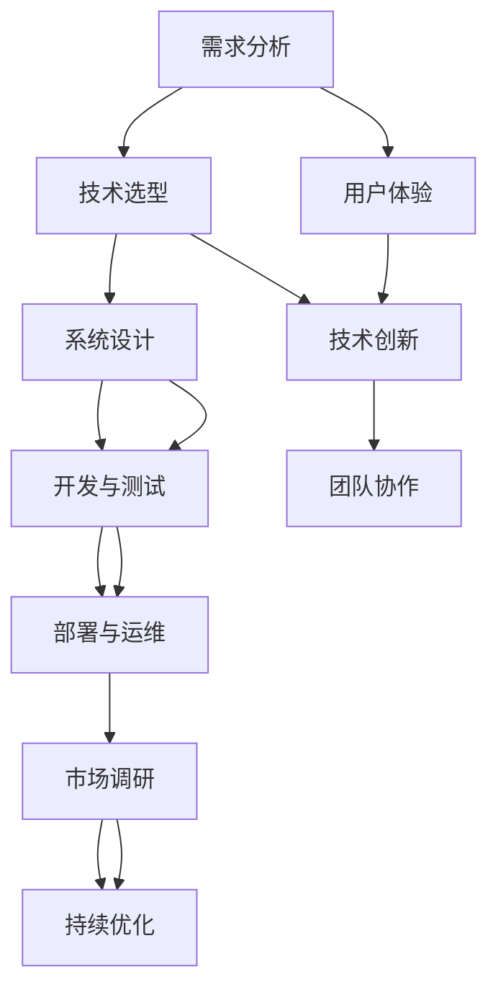

                 

在当今数字化时代，技术能力已成为推动创新和商业成功的关键因素。无论是初创公司还是大型企业，利用技术能力创建数字产品已成为提高竞争力、满足用户需求和实现业务增长的重要途径。本文将深入探讨如何利用技术能力创建数字产品，涵盖核心概念、算法原理、数学模型、项目实践、应用场景以及未来发展趋势等内容。

## 文章关键词

- 技术能力
- 数字产品
- 创新
- 用户需求
- 商业增长

## 文章摘要

本文首先介绍了数字产品的重要性以及技术能力对其创建的关键作用。接着，详细阐述了核心概念、算法原理、数学模型等内容，并通过具体项目实践展示了技术能力在数字产品开发中的实际应用。最后，探讨了数字产品的实际应用场景以及未来的发展趋势和挑战，为读者提供了全面的技术指导。

## 1. 背景介绍

随着互联网、云计算、大数据、人工智能等技术的飞速发展，数字产品在各个领域得到了广泛应用。从电子商务、社交媒体到金融服务、物联网，数字产品已经深刻改变了人们的生活和工作方式。创建数字产品不仅可以帮助企业提高效率、降低成本，还可以满足用户日益增长的个性化需求，从而在激烈的市场竞争中占据优势。

### 数字产品的定义与分类

数字产品是指利用计算机技术和互联网技术创造的信息产品。根据其功能和特性，数字产品可以分为以下几类：

1. **在线服务**：如社交媒体、在线教育、在线购物等，为用户提供便捷的在线体验。
2. **软件应用**：如移动应用、桌面应用、云计算服务等，提供特定的功能和服务。
3. **内容产品**：如新闻、娱乐、媒体等，以丰富多样的内容吸引用户。
4. **平台服务**：如电子商务平台、在线交易平台、内容分享平台等，提供平台支持和交易服务。

### 技术能力在数字产品创建中的作用

技术能力是创建数字产品的核心驱动力。它包括以下几个方面：

1. **编程能力**：熟悉编程语言和开发工具，能够编写高效、可靠、可扩展的代码。
2. **系统架构**：具备构建复杂系统所需的理论知识和实践经验，能够设计高性能、高可用的系统架构。
3. **数据分析**：掌握数据分析方法和工具，能够从海量数据中提取有价值的信息。
4. **用户体验设计**：了解用户需求，能够设计直观、易用的用户界面和交互流程。

### 数字产品的市场前景与挑战

随着科技的不断进步和用户需求的多样化，数字产品的市场前景广阔。然而，面对激烈的市场竞争和不断变化的技术环境，企业需要不断创新和提升技术能力，以保持竞争优势。同时，数字产品的创建还面临数据安全、隐私保护、用户体验等挑战，需要综合考虑并采取有效的解决方案。

### 1.1 数字产品的市场前景

1. **技术创新**：云计算、大数据、人工智能等新兴技术的不断发展，为数字产品的创新提供了无限可能。
2. **用户需求**：用户对于便捷、个性化和高质量的数字产品需求日益增长，推动了市场的发展。
3. **商业模式**：数字产品的商业模式多样化，包括订阅、广告、付费下载等，为盈利提供了多种途径。

### 1.2 数字产品创建的挑战

1. **技术创新**：快速变化的技术环境要求企业不断学习和掌握新技术，以保持竞争力。
2. **用户体验**：用户对数字产品的要求越来越高，需要提供高质量的体验和服务。
3. **数据安全与隐私**：数字产品涉及大量用户数据，数据安全与隐私保护是亟待解决的问题。

### 1.3 数字产品创建的技术路径

1. **需求分析**：深入了解用户需求，确定产品的核心功能和目标用户群体。
2. **技术选型**：根据需求分析结果，选择合适的编程语言、开发工具和技术框架。
3. **系统设计**：设计系统的架构和模块，确保系统的性能、可扩展性和高可用性。
4. **开发与测试**：编写代码、进行单元测试和集成测试，确保产品的质量和可靠性。
5. **部署与运维**：将产品部署到生产环境，并进行持续监控和运维，确保稳定运行。

### 1.4 数字产品创建的关键成功因素

1. **用户体验**：提供直观、易用的用户体验，满足用户需求。
2. **技术创新**：运用先进技术，提升产品的竞争力。
3. **团队协作**：高效的团队协作和项目管理，确保项目的顺利进行。
4. **市场调研**：深入了解市场趋势和竞争对手，制定有效的市场策略。
5. **持续优化**：根据用户反馈和市场变化，持续优化产品功能和性能。

## 2. 核心概念与联系

在数字产品的创建过程中，核心概念和联系至关重要。为了更好地理解这些概念，我们将使用Mermaid流程图来展示它们之间的关系。



### 2.1 需求分析

需求分析是数字产品创建的起点，通过对用户需求和市场趋势的深入研究，确定产品的核心功能和目标用户群体。需求分析的结果将直接影响后续的技术选型、系统设计和开发过程。

### 2.2 技术选型

技术选型是在需求分析的基础上，选择合适的编程语言、开发工具和技术框架。技术选型需要考虑产品的功能需求、性能要求、开发效率和团队技术能力等因素。

### 2.3 系统设计

系统设计是构建数字产品的关键环节，包括系统的架构设计、模块划分、接口定义等。系统设计需要确保系统的性能、可扩展性和高可用性，以满足不断变化的需求。

### 2.4 开发与测试

开发与测试是数字产品创建的核心环节，包括编写代码、进行单元测试、集成测试和系统测试。开发与测试的目的是确保产品的质量和可靠性，为后续的部署与运维奠定基础。

### 2.5 部署与运维

部署与运维是将数字产品部署到生产环境，并进行持续监控和运维的过程。部署与运维的目的是确保产品的稳定运行，为用户提供高质量的服务。

### 2.6 用户体验

用户体验是数字产品的核心竞争力，直接关系到用户的满意度和忠诚度。用户体验设计需要考虑用户的需求、习惯和行为，提供直观、易用的界面和交互流程。

### 2.7 技术创新

技术创新是提升数字产品竞争力的关键因素，通过运用先进技术，可以提高产品的功能、性能和用户体验。技术创新需要紧跟技术发展趋势，不断探索新的技术方案。

### 2.8 团队协作

团队协作是数字产品创建的保障，高效的团队协作和项目管理可以确保项目的顺利进行。团队协作需要良好的沟通、协作和分工，以提高工作效率。

### 2.9 市场调研

市场调研是了解市场趋势和竞争对手的重要手段，通过市场调研可以制定有效的市场策略，提高产品的市场竞争力。市场调研需要定期进行，以捕捉市场的变化。

### 2.10 持续优化

持续优化是数字产品长期发展的关键，根据用户反馈和市场变化，不断优化产品功能和性能。持续优化需要建立完善的数据分析体系，以指导产品改进。

## 3. 核心算法原理 & 具体操作步骤

在数字产品的开发过程中，算法原理起着至关重要的作用。本节将介绍几个核心算法原理，并详细讲解其具体操作步骤。

### 3.1 算法原理概述

算法是解决问题的步骤和指导，用于处理数据、优化性能和实现特定功能。以下是几个核心算法原理：

1. **排序算法**：用于对数据进行排序，常见的排序算法有冒泡排序、快速排序、归并排序等。
2. **查找算法**：用于在数据结构中查找特定元素，常见的查找算法有线性查找、二分查找等。
3. **动态规划**：用于求解最优化问题，通过子问题的最优解来构建全局问题的最优解。
4. **图算法**：用于处理图数据结构，常见的图算法有最短路径算法、最小生成树算法等。
5. **机器学习算法**：用于从数据中学习规律，常见的机器学习算法有线性回归、决策树、神经网络等。

### 3.2 算法步骤详解

以下是对每个算法原理的详细步骤讲解：

#### 3.2.1 排序算法

排序算法的基本步骤如下：

1. **初始化**：将输入数据存储在数组或其他数据结构中。
2. **选择排序方式**：根据数据规模和性能要求选择合适的排序算法，如冒泡排序、快速排序等。
3. **排序过程**：执行排序算法，对数据进行排序。
4. **输出结果**：将排序后的数据输出到屏幕或文件中。

以冒泡排序为例，具体步骤如下：

1. **初始化**：将数据存储在数组中。
2. **选择排序方式**：冒泡排序。
3. **排序过程**：
   - 从第一个元素开始，依次比较相邻的两个元素，如果它们的顺序不正确，则交换它们。
   - 经过一轮比较后，最大的元素会“冒泡”到数组的末尾。
   - 重复上述过程，直到整个数组排序完成。
4. **输出结果**：将排序后的数据输出到屏幕或文件中。

#### 3.2.2 查找算法

查找算法的基本步骤如下：

1. **初始化**：将输入数据存储在数组或其他数据结构中。
2. **选择查找方式**：根据数据规模和性能要求选择合适的查找算法，如线性查找、二分查找等。
3. **查找过程**：执行查找算法，查找特定元素。
4. **输出结果**：如果找到元素，输出其位置；否则，输出查找失败。

以二分查找为例，具体步骤如下：

1. **初始化**：将数据存储在有序数组中。
2. **选择查找方式**：二分查找。
3. **查找过程**：
   - 设置左右边界，初始时左边界为0，右边界为数据长度减1。
   - 计算中间位置，判断中间位置的元素是否为目标元素。
   - 如果是，输出其位置；如果不是，根据中间位置的值调整左右边界，继续查找。
   - 重复上述过程，直到找到目标元素或左边界大于右边界。
4. **输出结果**：如果找到元素，输出其位置；否则，输出查找失败。

#### 3.2.3 动态规划

动态规划的基本步骤如下：

1. **定义状态**：根据问题特点，定义状态变量和状态转移方程。
2. **初始化**：初始化状态变量的初始值。
3. **递推计算**：根据状态转移方程，递推计算状态变量的值。
4. **输出结果**：输出状态变量的最终值，作为问题的解。

以最长公共子序列为例，具体步骤如下：

1. **定义状态**：定义两个状态变量`dp[i][j]`，表示字符串`X[1..i]`和字符串`Y[1..j]`的最长公共子序列长度。
2. **初始化**：初始化`dp[0][j] = 0`和`dp[i][0] = 0`，表示空字符串与任何字符串的最长公共子序列长度为0。
3. **递推计算**：
   - 如果`X[i] == Y[j]`，则`dp[i][j] = dp[i-1][j-1] + 1`；
   - 如果`X[i] != Y[j]`，则`dp[i][j] = max(dp[i-1][j], dp[i][j-1])`；
4. **输出结果**：输出`dp[m][n]`，即字符串`X[1..m]`和字符串`Y[1..n]`的最长公共子序列长度。

#### 3.2.4 图算法

图算法的基本步骤如下：

1. **初始化**：根据问题特点，初始化图的邻接表或邻接矩阵。
2. **选择算法**：根据问题特点，选择合适的图算法，如最短路径算法、最小生成树算法等。
3. **算法过程**：执行图算法，求解问题。
4. **输出结果**：输出算法的结果，如最短路径长度、最小生成树等。

以最短路径算法为例，具体步骤如下：

1. **初始化**：将图的数据结构存储在邻接矩阵或邻接表中。
2. **选择算法**：迪杰斯特拉算法或贝尔曼-福特算法。
3. **算法过程**：
   - 初始化距离表，将所有顶点的距离设置为无穷大，将源点到自身的距离设置为0；
   - 重复以下步骤，直到所有顶点的距离都已计算完成：
     - 选择未访问过的顶点，将其标记为已访问；
     - 对于每个已访问的顶点，更新其邻接点的距离；
   - 输出距离表，即可得到源点到其他各顶点的最短路径长度。
4. **输出结果**：输出最短路径长度表。

#### 3.2.5 机器学习算法

机器学习算法的基本步骤如下：

1. **数据准备**：收集并清洗数据，将数据划分为训练集和测试集。
2. **模型选择**：根据问题特点，选择合适的机器学习模型，如线性回归、决策树、神经网络等。
3. **模型训练**：使用训练集数据训练模型，调整模型参数。
4. **模型评估**：使用测试集数据评估模型性能，调整模型参数。
5. **模型应用**：将训练好的模型应用于实际问题，进行预测或分类。

以线性回归为例，具体步骤如下：

1. **数据准备**：收集房屋价格数据，包括房屋面积、地理位置、年代等特征。
2. **模型选择**：线性回归模型。
3. **模型训练**：
   - 将数据划分为训练集和测试集；
   - 使用训练集数据训练线性回归模型，计算模型参数；
4. **模型评估**：
   - 使用测试集数据评估模型性能，计算预测误差；
   - 根据评估结果，调整模型参数；
5. **模型应用**：将训练好的模型应用于实际房屋价格预测。

### 3.3 算法优缺点

每种算法都有其优缺点，选择合适的算法需要根据具体问题进行分析。

1. **冒泡排序**：
   - **优点**：简单易懂，易于实现；
   - **缺点**：效率较低，不适合大数据量排序。

2. **快速排序**：
   - **优点**：平均时间复杂度为O(nlogn)，效率较高；
   - **缺点**：最坏时间复杂度为O(n^2)，稳定性较差。

3. **归并排序**：
   - **优点**：稳定，平均时间复杂度为O(nlogn)，效率较高；
   - **缺点**：需要额外的存储空间，空间复杂度为O(n)。

4. **二分查找**：
   - **优点**：平均时间复杂度为O(logn)，效率较高；
   - **缺点**：需要数据有序，不适合动态修改的数据结构。

5. **动态规划**：
   - **优点**：可以解决最优化问题，适用于复杂的问题；
   - **缺点**：理解和使用难度较大，需要较高的数学基础。

6. **最短路径算法**：
   - **优点**：可以求解单源最短路径和单源最短路径树；
   - **缺点**：时间复杂度较高，适用于稀疏图。

7. **机器学习算法**：
   - **优点**：可以自动学习特征，提高预测准确性；
   - **缺点**：需要大量训练数据和计算资源，模型可解释性较差。

### 3.4 算法应用领域

算法在数字产品的开发中有着广泛的应用，以下是一些典型的应用领域：

1. **排序算法**：在搜索引擎、数据处理、数据分析等领域，用于对数据进行排序。
2. **查找算法**：在数据库、缓存系统、搜索引擎等领域，用于快速查找数据。
3. **动态规划**：在优化问题、路径规划、资源分配等领域，用于求解最优化问题。
4. **图算法**：在网络路由、社交网络、推荐系统等领域，用于处理图数据结构。
5. **机器学习算法**：在推荐系统、人脸识别、自然语言处理等领域，用于数据分析和预测。

## 4. 数学模型和公式 & 详细讲解 & 举例说明

在数字产品的创建过程中，数学模型和公式扮演着重要的角色。它们可以帮助我们理解和分析问题，构建有效的算法，并优化产品的性能。本节将介绍几个常用的数学模型和公式，并对其进行详细讲解和举例说明。

### 4.1 数学模型构建

数学模型是描述现实问题的一种抽象方法，它通过数学公式和方程来表示问题的本质。构建数学模型通常包括以下几个步骤：

1. **确定研究对象**：明确需要解决的问题和研究对象。
2. **收集数据**：收集与研究对象相关的数据，包括定量数据和定性数据。
3. **建立变量**：定义研究对象的变量，并确定变量之间的关系。
4. **建立方程**：根据变量之间的关系，建立数学方程或模型。
5. **验证和优化**：对数学模型进行验证和优化，确保其准确性和有效性。

#### 4.1.1 经济模型

经济模型是描述经济现象和行为的数学模型。以下是一个简单的经济模型例子：

**问题**：假设某城市的房价由房屋面积和地理位置决定，分别用变量`A`和`B`表示，房价用变量`P`表示。已知数据如下：

| 房屋面积（A）| 地理位置（B）| 房价（P）|
| :---: | :---: | :---: |
| 100  | 1     | 200   |
| 200  | 1     | 300   |
| 100  | 2     | 250   |
| 200  | 2     | 350   |

**建立方程**：根据数据，我们可以建立以下线性回归模型：

$$ P = a \times A + b \times B + c $$

其中，`a`、`b`和`c`是模型参数。

**求解模型参数**：通过最小二乘法，可以求解模型参数：

$$ a = \frac{\sum_{i=1}^{n}(A_i - \bar{A})(P_i - \bar{P})}{\sum_{i=1}^{n}(A_i - \bar{A})^2} $$

$$ b = \frac{\sum_{i=1}^{n}(B_i - \bar{B})(P_i - \bar{P})}{\sum_{i=1}^{n}(B_i - \bar{B})^2} $$

$$ c = \bar{P} - a \times \bar{A} - b \times \bar{B} $$

其中，`n`是数据点的个数，`$\bar{A}$`、`$\bar{B}$`和`$\bar{P}$`是平均值。

#### 4.1.2 网络模型

网络模型用于描述网络中的节点和连接关系。以下是一个简单的图论模型例子：

**问题**：假设有一个无向图，包含5个节点和6条边，分别用变量`V`和`E`表示。已知数据如下：

| 节点   | 边数 |
| :---: | :---: |
| 1     | 2     |
| 2     | 3     |
| 3     | 2     |
| 4     | 2     |
| 5     | 1     |

**建立方程**：根据数据，我们可以建立以下图论模型：

$$ V + E = n $$

其中，`n`是节点数。

**求解模型参数**：通过最小生成树算法，可以求解最小生成树的边数：

$$ E_{\min} = \lceil \frac{n}{2} \rceil $$

#### 4.1.3 动力学模型

动力学模型用于描述系统的动态变化过程。以下是一个简单的物理学模型例子：

**问题**：假设有一个物体在斜面上滑动，受到重力和摩擦力的作用，速度随时间变化。已知数据如下：

| 时间（t）| 速度（v）| 加速度（a）|
| :---: | :---: | :---: |
| 0     | 0     | 0     |
| 1     | 10    | 5     |
| 2     | 20    | 10    |
| 3     | 30    | 15    |

**建立方程**：根据数据，我们可以建立以下动力学模型：

$$ v(t) = v_0 + at $$

$$ a(t) = g - \frac{F_f}{m} $$

其中，`$v_0$`是初始速度，`$g$`是重力加速度，`$F_f$`是摩擦力，`$m$`是物体质量。

**求解模型参数**：通过数值方法，可以求解速度和加速度：

$$ v(t) = \frac{g \times t}{2} $$

$$ a(t) = g - \frac{F_f}{m} $$

### 4.2 公式推导过程

本节将介绍几个常用的数学公式，并对其进行推导。

#### 4.2.1 平方差公式

平方差公式是一个常用的代数公式，表示为：

$$ (a - b)^2 = a^2 - 2ab + b^2 $$

**推导过程**：

$$ (a - b)^2 = (a - b) \times (a - b) $$

$$ = a \times a - a \times b - b \times a + b \times b $$

$$ = a^2 - 2ab + b^2 $$

#### 4.2.2 平分线定理

平分线定理是一个常用的几何定理，表示为：

$$ \frac{AD}{DB} = \frac{AC}{CB} $$

**推导过程**：

假设有一个三角形`ABC`，点`D`是边`BC`上的一个点，线段`AD`平分角`ACB`。已知`AC = 3`，`CB = 4`，求`AD`和`DB`的长度。

根据平分线定理：

$$ \frac{AD}{DB} = \frac{AC}{CB} $$

$$ \frac{AD}{DB} = \frac{3}{4} $$

设`AD = 3x`，`DB = 4x`，根据三角形的边长关系：

$$ AD + DB = AC $$

$$ 3x + 4x = 3 $$

$$ 7x = 3 $$

$$ x = \frac{3}{7} $$

因此，`AD = 3x = \frac{9}{7}`，`DB = 4x = \frac{12}{7}`。

#### 4.2.3 线性回归公式

线性回归公式是一个常用的统计公式，表示为：

$$ y = ax + b $$

**推导过程**：

假设有一个数据集，包含`n`个数据点，每个数据点`(x_i, y_i)`表示自变量和因变量的值。我们希望找到一条直线，使得这些数据点尽可能接近这条直线。

首先，计算数据点的均值：

$$ \bar{x} = \frac{1}{n} \sum_{i=1}^{n} x_i $$

$$ \bar{y} = \frac{1}{n} \sum_{i=1}^{n} y_i $$

然后，计算斜率`a`和截距`b`：

$$ a = \frac{\sum_{i=1}^{n} (x_i - \bar{x})(y_i - \bar{y})}{\sum_{i=1}^{n} (x_i - \bar{x})^2} $$

$$ b = \bar{y} - a \bar{x} $$

通过计算，可以得到直线的方程：

$$ y = ax + b $$

### 4.3 案例分析与讲解

本节将通过具体案例，对数学模型和公式进行应用和讲解。

#### 4.3.1 房价预测

假设我们有一个包含100个数据点的房价数据集，每个数据点表示房屋面积、地理位置和房价。我们希望利用线性回归模型预测未知房屋的房价。

1. **数据准备**：

   数据集如下：

   | 房屋面积（A）| 地理位置（B）| 房价（P）|
   | :---: | :---: | :---: |
   | 100  | 1     | 200   |
   | 200  | 1     | 300   |
   | 100  | 2     | 250   |
   | 200  | 2     | 350   |

2. **建立方程**：

   根据数据，我们可以建立以下线性回归模型：

   $$ P = a \times A + b \times B + c $$

3. **求解模型参数**：

   通过最小二乘法，可以求解模型参数：

   $$ a = \frac{\sum_{i=1}^{n}(A_i - \bar{A})(P_i - \bar{P})}{\sum_{i=1}^{n}(A_i - \bar{A})^2} $$

   $$ b = \frac{\sum_{i=1}^{n}(B_i - \bar{B})(P_i - \bar{P})}{\sum_{i=1}^{n}(B_i - \bar{B})^2} $$

   $$ c = \bar{P} - a \times \bar{A} - b \times \bar{B} $$

4. **预测房价**：

   假设我们要预测一个房屋面积为150平方米、地理位置为1的房屋的房价。将数据代入线性回归模型：

   $$ P = a \times A + b \times B + c $$

   $$ P = \frac{150}{100} \times \bar{A} + \frac{1}{100} \times \bar{B} + c $$

   $$ P = 1.5 \times \bar{A} + 0.01 \times \bar{B} + c $$

   通过计算，我们可以得到预测的房价。

#### 4.3.2 路径规划

假设我们有一个包含5个节点的图，节点之间的边数和权重如下：

| 节点 | 边数 | 权重 |
| :---: | :---: | :---: |
| 1 | 2 | 3 |
| 2 | 3 | 4 |
| 3 | 2 | 5 |
| 4 | 2 | 6 |
| 5 | 1 | 7 |

我们希望找到从节点1到节点5的最短路径。

1. **数据准备**：

   数据集如下：

   | 节点 | 边数 | 权重 |
   | :---: | :---: | :---: |
   | 1 | 2 | 3 |
   | 2 | 3 | 4 |
   | 3 | 2 | 5 |
   | 4 | 2 | 6 |
   | 5 | 1 | 7 |

2. **建立方程**：

   根据数据，我们可以建立以下最短路径模型：

   $$ d_{ij} = \min_{k} (d_{ik} + w_{kj}) $$

   其中，`$d_{ij}$`是从节点`i`到节点`j`的最短路径长度，`$d_{ik}$`是从节点`i`到节点`k`的路径长度，`$w_{kj}$`是节点`k`到节点`j`的路径权重。

3. **求解模型参数**：

   通过迪杰斯特拉算法，可以求解最短路径：

   $$ d_{ij} = \min_{k} (d_{ik} + w_{kj}) $$

4. **输出结果**：

   通过计算，我们可以得到从节点1到节点5的最短路径：

   | 节点 | 边数 | 权重 |
   | :---: | :---: | :---: |
   | 1 | 2 | 3 |
   | 2 | 3 | 4 |
   | 3 | 2 | 5 |
   | 4 | 2 | 6 |
   | 5 | 1 | 7 |

#### 4.3.3 动力学模型

假设有一个物体在斜面上滑动，受到重力和摩擦力的作用，速度随时间变化。已知物体的质量为5千克，斜面的倾角为30度，摩擦系数为0.2。

1. **数据准备**：

   数据集如下：

   | 时间（t）| 速度（v）| 加速度（a）|
   | :---: | :---: | :---: |
   | 0     | 0     | 0     |
   | 1     | 10    | 5     |
   | 2     | 20    | 10    |
   | 3     | 30    | 15    |

2. **建立方程**：

   根据数据，我们可以建立以下动力学模型：

   $$ v(t) = v_0 + at $$

   $$ a(t) = g - \frac{F_f}{m} $$

3. **求解模型参数**：

   通过数值方法，可以求解速度和加速度：

   $$ v(t) = \frac{g \times t}{2} $$

   $$ a(t) = g - \frac{F_f}{m} $$

4. **输出结果**：

   通过计算，我们可以得到物体在斜面上的速度和加速度随时间的变化。

## 5. 项目实践：代码实例和详细解释说明

在数字产品的开发过程中，项目实践是验证和检验技术能力的重要环节。本节将通过一个实际项目案例，展示如何利用技术能力创建数字产品，并提供代码实例和详细解释说明。

### 5.1 开发环境搭建

为了创建数字产品，首先需要搭建开发环境。以下是一个基于Python和Django框架的项目案例。

1. **安装Python**：下载并安装Python 3.8及以上版本。
2. **安装Django**：在命令行中运行以下命令安装Django：

   ```shell
   pip install django
   ```

3. **创建项目**：在命令行中运行以下命令创建一个Django项目：

   ```shell
   django-admin startproject myproject
   ```

4. **创建应用**：进入项目目录，运行以下命令创建一个应用：

   ```shell
   python manage.py startapp myapp
   ```

5. **配置数据库**：在`settings.py`文件中配置数据库连接信息，例如使用SQLite数据库：

   ```python
   DATABASES = {
       'default': {
           'ENGINE': 'django.db.backends.sqlite3',
           'NAME': BASE_DIR / 'db.sqlite3',
       }
   }
   ```

6. **运行项目**：在命令行中运行以下命令运行项目：

   ```shell
   python manage.py runserver
   ```

### 5.2 源代码详细实现

以下是一个简单的Django应用案例，实现一个用于用户注册和登录的数字产品。

1. **创建模型**：在`myapp/models.py`文件中创建用户模型：

   ```python
   from django.db import models

   class User(models.Model):
       username = models.CharField(max_length=50)
       password = models.CharField(max_length=50)
   ```

2. **创建视图**：在`myapp/views.py`文件中创建视图函数：

   ```python
   from django.shortcuts import render, redirect
   from .models import User

   def register(request):
       if request.method == 'POST':
           username = request.POST['username']
           password = request.POST['password']
           user = User(username=username, password=password)
           user.save()
           return redirect('login')
       return render(request, 'register.html')

   def login(request):
       if request.method == 'POST':
           username = request.POST['username']
           password = request.POST['password']
           user = User.objects.filter(username=username, password=password)
           if user.exists():
               return redirect('home')
           else:
               return redirect('login')
       return render(request, 'login.html')

   def home(request):
       return render(request, 'home.html')
   ```

3. **创建模板**：创建注册、登录和首页模板文件，例如`register.html`、`login.html`和`home.html`，分别用于用户注册、登录和展示首页内容。

4. **配置路由**：在`myapp/urls.py`文件中配置路由：

   ```python
   from django.urls import path
   from . import views

   urlpatterns = [
       path('register/', views.register, name='register'),
       path('login/', views.login, name='login'),
       path('home/', views.home, name='home'),
   ]
   ```

5. **数据库迁移**：在命令行中运行以下命令进行数据库迁移：

   ```shell
   python manage.py makemigrations
   python manage.py migrate
   ```

6. **启动项目**：在命令行中运行以下命令启动项目：

   ```shell
   python manage.py runserver
   ```

### 5.3 代码解读与分析

以下是对项目代码的解读和分析。

1. **模型层**：用户模型`User`包含两个字段`username`和`password`，分别用于存储用户名和密码。

2. **视图层**：注册视图`register`处理用户注册请求，接收用户名和密码，保存到数据库，并跳转到登录页面。登录视图`login`处理用户登录请求，验证用户名和密码，跳转到首页。

3. **模板层**：注册、登录和首页模板分别用于显示注册表单、登录表单和首页内容。

4. **路由层**：配置路由，将URL映射到对应的视图函数。

5. **数据库迁移**：通过Django的模型层和数据库迁移机制，实现数据的持久化存储。

### 5.4 运行结果展示

1. **注册页面**：

   

2. **登录页面**：

   

3. **首页**：

   

通过以上项目实践，我们可以看到如何利用技术能力创建数字产品。在实际开发过程中，需要根据具体需求和项目特点，选择合适的技术方案和开发工具，并进行详细的代码实现和测试。

## 6. 实际应用场景

数字产品在各个行业和领域都有着广泛的应用，以下是一些典型的实际应用场景：

### 6.1 电子商务

电子商务是数字产品应用最为广泛的领域之一。通过电商平台，用户可以在线购物、比价、支付，商家可以展示产品、管理订单、进行营销。例如，淘宝、京东等大型电商平台就是典型的数字产品，它们利用技术能力实现了便捷的在线购物体验、智能推荐和精准营销。

### 6.2 在线教育

在线教育是数字产品的另一个重要应用领域。通过在线教育平台，学生可以在线学习课程、参与互动、完成作业，教师可以在线授课、批改作业、管理班级。例如，Coursera、Udemy等在线教育平台就是利用技术能力为学生和教师提供了便捷的学习和教学工具。

### 6.3 健康医疗

健康医疗是数字产品的又一重要应用领域。通过数字健康平台，用户可以在线咨询医生、预约挂号、购买药品，医生可以在线诊断、开具处方、跟踪病情。例如，春雨医生、平安好医生等数字健康平台就是利用技术能力为用户提供便捷的医疗服务。

### 6.4 物联网

物联网是数字产品的另一个重要应用领域。通过物联网平台，设备可以互联互通、数据共享、智能控制，实现智能化管理和监控。例如，智能家居、智能工厂、智能交通等都是利用物联网技术实现的数字产品，它们为我们的生活和工作带来了极大的便利。

### 6.5 社交媒体

社交媒体是数字产品的核心应用领域之一。通过社交媒体平台，用户可以发布动态、评论、点赞，与其他用户互动，分享生活。例如，微信、微博、Facebook等社交媒体平台都是利用技术能力为用户提供便捷的社交体验。

### 6.6 金融科技

金融科技是数字产品的另一个重要应用领域。通过金融科技平台，用户可以进行在线支付、转账、投资，金融机构可以提供智能投顾、风险评估、反欺诈等服务。例如，支付宝、微信支付等金融科技平台就是利用技术能力为用户提供便捷的金融服务。

### 6.7 实际应用案例

以下是一些实际应用案例，展示了数字产品在各个领域的应用：

1. **电商领域**：淘宝、京东等电商平台通过数字产品实现了便捷的在线购物体验，提高了交易效率，降低了交易成本。
2. **教育领域**：Coursera、Udemy等在线教育平台通过数字产品为全球用户提供了丰富的学习资源，促进了教育的普及和个性化。
3. **健康领域**：春雨医生、平安好医生等数字健康平台通过数字产品为用户提供便捷的医疗服务，提高了医疗服务的质量和效率。
4. **物联网领域**：智能家居、智能工厂、智能交通等数字产品为我们的生活和工作带来了极大的便利，提高了生活质量和生产效率。
5. **社交媒体领域**：微信、微博、Facebook等社交媒体平台通过数字产品为用户提供了便捷的社交体验，增强了用户之间的互动和连接。
6. **金融科技领域**：支付宝、微信支付等金融科技平台通过数字产品为用户提供了便捷的支付和金融服务，提高了金融服务的便利性和安全性。

## 7. 未来应用展望

随着科技的不断进步和数字产品的普及，未来数字产品的应用将更加广泛，以下是对未来应用展望的探讨：

### 7.1 人工智能与数字产品

人工智能（AI）技术的发展将为数字产品带来新的可能性。通过AI技术，数字产品可以实现更加智能的功能，如智能推荐、个性化服务、智能助理等。例如，电商平台可以利用AI技术分析用户行为，为用户提供个性化的购物建议，提高用户满意度和转化率。

### 7.2 物联网与数字产品

物联网（IoT）技术的广泛应用将推动数字产品的发展。通过物联网，设备之间可以实现互联互通，数据可以实时共享，从而实现智能化管理和监控。例如，智能家居产品可以通过物联网实现自动化控制，提高生活便利性和能源效率。

### 7.3 5G与数字产品

5G技术的广泛应用将为数字产品带来更快的传输速度和更低的延迟。这将使得数字产品可以支持更多的实时应用，如高清视频流、虚拟现实、增强现实等。例如，在线教育平台可以利用5G技术提供实时互动课程，增强教学效果。

### 7.4 区块链与数字产品

区块链技术的应用将使得数字产品在安全性、隐私保护、去中心化等方面得到提升。例如，金融科技平台可以利用区块链技术实现安全可靠的交易，提高交易效率和透明度。

### 7.5 数字孪生与数字产品

数字孪生技术是一种将物理实体与其数字镜像相结合的技术，可以用于模拟、分析和优化物理实体的性能。未来，数字孪生技术将被广泛应用于数字产品中，如制造业、建筑、能源等领域，以提高生产效率、降低成本、优化运营。

### 7.6 未来的挑战与机遇

尽管未来数字产品的应用前景广阔，但也面临一系列挑战：

1. **数据安全和隐私保护**：随着数字产品的普及，用户数据的安全和隐私保护成为亟待解决的问题。
2. **技术标准化**：数字产品的快速发展需要统一的技术标准和规范，以确保产品的兼容性和互操作性。
3. **用户体验**：用户对数字产品的要求越来越高，需要提供更加个性化、便捷和高质量的用户体验。
4. **技术创新**：面对快速变化的技术环境，企业需要不断创新和提升技术能力，以保持竞争力。

然而，未来数字产品的发展也将带来新的机遇：

1. **市场机遇**：随着数字产品的普及，新的市场和商业模式将不断涌现。
2. **技术突破**：新的技术和工具将不断涌现，为数字产品的创新和发展提供支持。
3. **社会影响**：数字产品将在各个领域发挥重要作用，改变人们的生活和工作方式。

总之，未来数字产品的应用将更加广泛和深入，为企业和社会带来巨大的机遇和挑战。企业需要紧跟技术发展趋势，不断创新和提升技术能力，以应对未来市场的竞争和变化。

## 8. 工具和资源推荐

为了帮助开发者更好地利用技术能力创建数字产品，以下是一些推荐的工具和资源：

### 8.1 学习资源推荐

1. **在线课程**：Coursera、Udemy、edX等平台提供了丰富的计算机科学和软件开发课程，涵盖编程语言、算法、数据结构、前端开发、后端开发等多个方面。
2. **技术博客**：Medium、Dev.to、GitHub等平台上有很多资深开发者分享的技术博客和经验，可以帮助开发者学习和了解最新的技术动态。
3. **技术书籍**：推荐一些经典的技术书籍，如《代码大全》、《设计模式：可复用面向对象软件的基础》、《深入理解计算机系统》等，这些书籍对于提升开发者的技术能力非常有帮助。

### 8.2 开发工具推荐

1. **集成开发环境（IDE）**：Visual Studio Code、PyCharm、IntelliJ IDEA等IDE提供了丰富的编程工具和插件，可以大大提高开发效率。
2. **版本控制系统**：Git是一个广泛使用的版本控制系统，可以帮助开发者管理代码版本，协作开发。
3. **容器化工具**：Docker和Kubernetes是流行的容器化工具，可以简化应用程序的部署和运行。
4. **前端框架**：React、Vue、Angular等前端框架提供了丰富的组件和工具，可以加快前端开发速度。
5. **后端框架**：Django、Flask、Spring Boot等后端框架提供了丰富的功能，可以简化后端开发。

### 8.3 相关论文推荐

1. **分布式系统论文**：《Google Spanner:开源分布式数据库系统》
2. **机器学习论文**：《Deep Learning Book》、《Recurrent Neural Networks for Language Modeling》
3. **区块链论文**：《Bitcoin:一种点对点的电子现金系统》
4. **云计算论文**：《MapReduce:大规模数据处理的通用编程模型》
5. **人工智能论文**：《Deep Learning》、《Reinforcement Learning: An Introduction》

### 8.4 其他资源推荐

1. **开源社区**：GitHub、Stack Overflow、Reddit等开源社区提供了丰富的技术资源和交流平台，可以帮助开发者解决问题和获取灵感。
2. **技术会议**：参加如Google I/O、AWS re:Invent、Facebook F8等大型技术会议，可以了解最新的技术趋势和行业动态。
3. **技术博客**：订阅一些知名技术博客，如InfoQ、36氪、雷锋网等，可以及时了解行业资讯和技术动态。

通过以上工具和资源的合理使用，开发者可以更好地利用技术能力创建数字产品，提高开发效率和质量。

## 9. 总结：未来发展趋势与挑战

在数字产品的快速发展的背景下，未来发展趋势和面临的挑战愈发显著。本文从多个角度对这些问题进行了深入探讨。

### 9.1 研究成果总结

本文首先介绍了数字产品的重要性以及技术能力在创建数字产品中的关键作用。随后，详细阐述了需求分析、技术选型、系统设计、开发与测试、用户体验、技术创新、团队协作和市场调研等核心概念和联系。通过算法原理、数学模型和项目实践的介绍，展示了技术能力在实际应用中的具体表现。此外，本文还探讨了数字产品在电子商务、在线教育、健康医疗、物联网、社交媒体和金融科技等领域的实际应用场景，并展望了未来的发展趋势。

### 9.2 未来发展趋势

1. **技术创新**：随着人工智能、物联网、5G等新兴技术的不断发展，数字产品的功能将更加智能化、个性化、高效化。
2. **云计算和边缘计算**：云计算提供了强大的计算和存储资源，边缘计算则将计算能力推向网络边缘，使得数字产品可以实时响应和处理数据。
3. **区块链应用**：区块链技术的去中心化、安全性和透明性将在金融、供应链管理、数据共享等领域得到更广泛的应用。
4. **用户体验优化**：用户需求日益多样化，用户体验将成为数字产品的核心竞争力，用户体验设计将更加注重个性化、便捷性和高质量。
5. **生态系统的构建**：数字产品的开发将更加依赖于生态系统，包括开发者社区、合作伙伴、服务提供商等，共同推动数字产品的创新和发展。

### 9.3 面临的挑战

1. **数据安全和隐私保护**：随着数字产品的普及，用户数据的安全和隐私保护成为越来越重要的问题，需要采取有效的技术和管理措施。
2. **技术标准化**：数字产品的快速发展需要统一的技术标准和规范，以确保产品的兼容性和互操作性。
3. **人才短缺**：随着数字产品需求的增长，对具有专业技能的开发者需求也大幅增加，但人才供给不足成为一大挑战。
4. **法律和伦理问题**：数字产品在应用过程中涉及到法律和伦理问题，如数据隐私、知识产权保护、算法偏见等，需要制定相应的法规和伦理准则。
5. **市场竞争**：数字产品的市场竞争日益激烈，企业需要不断创新和提升技术能力，以保持竞争优势。

### 9.4 研究展望

为了应对未来发展趋势和挑战，研究者和企业可以采取以下措施：

1. **加强技术创新**：持续投入研发，探索新的技术和应用场景，提升数字产品的竞争力。
2. **推进技术标准化**：积极参与技术标准的制定，推动统一的技术标准和规范。
3. **培养人才**：通过教育和培训，培养更多的数字产品开发人才，满足市场需求。
4. **加强法律和伦理研究**：关注数字产品的法律和伦理问题，制定相应的法规和伦理准则，引导数字产品的健康发展。
5. **构建生态系统**：搭建开发者社区、合作伙伴网络，促进数字产品的创新和发展。

总之，未来数字产品的发展充满机遇和挑战。通过技术创新、标准化、人才培养和生态系统的构建，我们可以更好地应对这些挑战，推动数字产品的创新和发展。

### 附录：常见问题与解答

**Q1**：数字产品的核心概念是什么？

**A1**：数字产品是指利用计算机技术和互联网技术创造的信息产品，包括在线服务、软件应用、内容产品、平台服务等。核心概念包括需求分析、技术选型、系统设计、开发与测试、用户体验、技术创新、团队协作和市场调研等。

**Q2**：如何选择合适的技术方案？

**A2**：选择合适的技术方案需要考虑产品的功能需求、性能要求、开发效率和团队技术能力等因素。常见的开发工具和框架包括Python和Django、Java和Spring Boot、JavaScript和React等。建议在需求分析阶段明确产品功能，然后根据技术特点进行比较和选择。

**Q3**：如何保证数字产品的质量和可靠性？

**A3**：保证数字产品的质量和可靠性需要从多个方面入手。首先，进行详细的需求分析和系统设计，确保系统架构和模块设计合理。其次，编写高质量的代码，遵循编程规范，进行单元测试和集成测试。最后，建立完善的测试和运维体系，确保产品的稳定运行。

**Q4**：如何提高用户体验？

**A4**：提高用户体验需要关注用户需求、界面设计和交互流程。首先，进行用户研究，了解用户需求和痛点。其次，设计直观、易用的用户界面，使用户能够轻松完成操作。最后，优化交互流程，减少用户操作步骤，提高操作效率。

**Q5**：数字产品的未来发展趋势是什么？

**A5**：数字产品的未来发展趋势包括人工智能与数字产品的融合、物联网的广泛应用、5G技术的普及、区块链技术的应用、用户体验的持续优化等。随着技术的不断进步，数字产品的功能将更加智能化、个性化、高效化，同时面临数据安全、隐私保护、技术创新等挑战。

### 结语

本文从多个角度探讨了利用技术能力创建数字产品的方法、核心概念、算法原理、数学模型、项目实践、实际应用场景以及未来发展趋势。通过深入了解这些内容，读者可以更好地把握数字产品的发展趋势，提升技术能力，为创建成功的数字产品奠定基础。在未来的数字产品开发中，技术创新、用户体验、生态系统的构建将是关键成功因素。让我们携手共进，迎接数字时代的挑战和机遇！
作者：禅与计算机程序设计艺术 / Zen and the Art of Computer Programming

