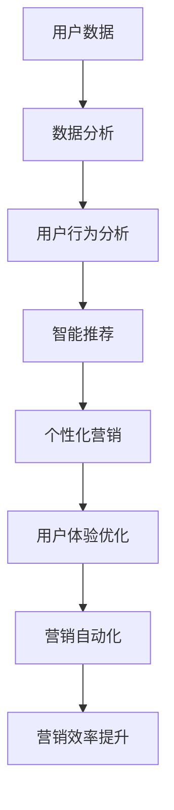

                 

关键词：数字营销、技术能力、数据分析、用户体验、人工智能、营销自动化

摘要：本文将探讨如何利用先进的技术能力提升数字营销效果。通过分析技术对营销活动的赋能作用，文章将介绍核心技术概念、算法原理、数学模型，并结合实际案例，展示技术在不同营销场景中的应用。同时，文章还将展望数字营销的未来发展趋势与挑战，为行业从业者和研究者提供有价值的参考。

## 1. 背景介绍

在当今数字化时代，营销活动已从传统的线下渠道转向线上平台。随着互联网技术的迅猛发展，企业可以通过社交媒体、搜索引擎、电子邮件等多种渠道触达目标受众。然而，如何在这些平台上高效地进行数字营销，提高转化率和客户满意度，成为企业面临的一大挑战。

技术能力在数字营销中的应用越来越广泛，从大数据分析到人工智能，再到营销自动化工具，技术的融合使得营销活动更加精准、高效。本文将深入探讨这些技术如何赋能数字营销，帮助企业在激烈的市场竞争中脱颖而出。

### 1.1 数字营销的演变

数字营销起源于互联网的兴起，最初主要依靠简单的在线广告和电子邮件营销。随着技术的发展，数字营销手段逐渐多样化，从SEO（搜索引擎优化）到内容营销，再到现在的社交媒体营销和大数据营销，每一次技术进步都为营销带来了新的机遇。

- **在线广告**：通过Google AdWords、Facebook Ads等平台，企业可以精确投放广告，吸引潜在客户。
- **SEO**：优化网站结构和内容，提高在搜索引擎中的排名，吸引更多自然流量。
- **内容营销**：创造有价值的内容，吸引并留住目标受众，提高品牌影响力。
- **社交媒体营销**：利用社交媒体平台（如Facebook、Instagram、微博等）进行互动和推广。

### 1.2 技术在数字营销中的作用

技术能力的提升使得数字营销变得更加智能化、个性化。以下是一些核心技术及其在数字营销中的应用：

- **数据分析**：通过收集和分析用户数据，了解用户行为，优化营销策略。
- **人工智能**：利用机器学习算法，实现智能推荐、自动优化广告投放等。
- **营销自动化**：自动化执行营销活动，提高效率，减少人工干预。
- **用户体验优化**：通过技术手段提升用户在使用网站或应用时的体验，提高用户留存率。

## 2. 核心概念与联系

为了更好地理解技术如何赋能数字营销，我们需要先了解一些核心概念和它们之间的联系。以下是一个简化的Mermaid流程图，展示了这些概念的基本关系。



### 2.1 用户数据

用户数据是数字营销的基石。通过收集用户在网站、应用或社交媒体上的行为数据，企业可以了解用户的需求、偏好和习惯。这些数据包括用户 demographics（人口统计信息）、行为数据（如浏览历史、搜索关键词）、交易数据（如购买记录、支付方式）等。

### 2.2 数据分析

数据分析是将收集到的用户数据转化为有价值信息的过程。通过统计学和机器学习算法，企业可以从大量数据中提取出有意义的模式、趋势和关联。数据分析可以帮助企业更好地了解用户，优化营销策略，提高转化率。

### 2.3 用户行为分析

用户行为分析是数据分析的一个重要分支。它专注于理解用户的行为模式，如浏览习惯、购买决策路径等。通过对用户行为数据的深入分析，企业可以优化用户体验，提高用户留存率和转化率。

### 2.4 智能推荐

智能推荐系统是利用数据分析结果，为用户提供个性化推荐的一种技术。通过分析用户的浏览历史、搜索记录和偏好，智能推荐系统可以推荐用户可能感兴趣的产品或内容。这种个性化推荐可以提高用户满意度，增加购买转化率。

### 2.5 个性化营销

个性化营销是基于用户数据和智能推荐系统，为企业提供个性化内容和服务的一种营销策略。通过个性化营销，企业可以更好地满足用户需求，提高用户忠诚度和品牌价值。

### 2.6 用户体验优化

用户体验优化是利用技术手段提升用户在使用网站或应用时的体验。这包括页面加载速度、网站设计、交互设计等方面。优化用户体验可以提高用户满意度，减少用户流失。

### 2.7 营销自动化

营销自动化是利用技术工具自动化执行营销活动，如发送电子邮件、发布社交媒体内容等。通过营销自动化，企业可以提高营销效率，减少人工干预，节省时间和成本。

### 2.8 营销效率提升

营销效率提升是数字营销的核心目标之一。通过技术手段，企业可以更精准地触达目标受众，提高营销活动的效果和回报。营销自动化和数据分析是提高营销效率的关键技术。

## 3. 核心算法原理 & 具体操作步骤

### 3.1 算法原理概述

数字营销中的核心算法主要涉及用户行为分析、智能推荐和营销自动化。以下是对这些算法原理的简要概述：

- **用户行为分析算法**：基于机器学习和深度学习技术，通过分析用户的浏览历史、搜索记录等数据，预测用户的行为和偏好。
- **智能推荐算法**：使用协同过滤、内容推荐等算法，根据用户的兴趣和行为，推荐用户可能感兴趣的产品或内容。
- **营销自动化算法**：利用规则引擎和机器学习技术，自动执行营销活动，如发送电子邮件、发布社交媒体内容等。

### 3.2 算法步骤详解

#### 3.2.1 用户行为分析算法

1. **数据收集**：收集用户的浏览历史、搜索记录、购买记录等数据。
2. **数据预处理**：清洗和转换数据，使其适合算法分析。
3. **特征提取**：提取用户行为特征，如浏览时间、浏览页面数、购买频率等。
4. **模型训练**：使用机器学习和深度学习算法，如决策树、神经网络等，训练用户行为预测模型。
5. **模型评估**：评估模型的准确性和效果，调整模型参数。
6. **行为预测**：使用训练好的模型，预测用户未来的行为和偏好。

#### 3.2.2 智能推荐算法

1. **数据收集**：收集用户的浏览记录、搜索关键词、产品评价等数据。
2. **协同过滤**：基于用户相似度或项目相似度，推荐用户可能感兴趣的产品或内容。
3. **内容推荐**：基于产品或内容的特征，推荐用户可能感兴趣的产品或内容。
4. **模型训练**：使用机器学习算法，如协同过滤算法、神经网络等，训练推荐模型。
5. **模型评估**：评估推荐模型的准确性和效果，调整模型参数。
6. **推荐生成**：使用训练好的模型，为用户生成个性化推荐。

#### 3.2.3 营销自动化算法

1. **规则设置**：根据营销目标和用户行为，设置营销活动规则，如发送邮件的时间、内容等。
2. **数据收集**：收集用户行为数据，如浏览页面、点击链接等。
3. **触发条件判断**：根据用户行为数据，判断是否满足触发条件。
4. **活动执行**：根据触发条件，自动执行营销活动，如发送电子邮件、发布社交媒体内容等。
5. **效果评估**：评估营销活动的效果，如转化率、点击率等。
6. **优化调整**：根据效果评估结果，优化营销活动规则和策略。

### 3.3 算法优缺点

#### 3.3.1 用户行为分析算法

**优点**：
- **精准预测**：通过分析用户历史行为，可以更精准地预测用户未来的行为和偏好。
- **个性化推荐**：根据用户行为特征，实现个性化推荐，提高用户体验和满意度。

**缺点**：
- **数据隐私**：用户行为数据涉及隐私问题，需要确保数据的安全和合规。
- **计算成本**：用户行为分析算法通常需要大量的计算资源和时间。

#### 3.3.2 智能推荐算法

**优点**：
- **提高转化率**：通过个性化推荐，提高用户对推荐产品或内容的兴趣和购买意愿。
- **增加用户粘性**：推荐用户感兴趣的内容，提高用户在网站或应用上的停留时间和互动次数。

**缺点**：
- **推荐偏差**：基于历史数据和用户行为，推荐系统可能存在偏差，无法完全满足用户当前需求。
- **计算复杂度**：智能推荐算法通常涉及复杂的计算过程，对计算资源要求较高。

#### 3.3.3 营销自动化算法

**优点**：
- **提高效率**：自动化执行营销活动，减少人工干预，提高营销效率。
- **降低成本**：通过自动化营销，节省人力和时间成本。

**缺点**：
- **依赖数据质量**：营销自动化算法的效果很大程度上取决于数据的质量和准确性。
- **缺乏灵活性**：自动化营销活动规则较为固定，难以适应复杂多变的市场环境。

### 3.4 算法应用领域

用户行为分析、智能推荐和营销自动化算法在数字营销中具有广泛的应用领域：

- **电子商务**：通过分析用户行为，实现个性化推荐，提高购物体验和转化率。
- **社交媒体**：利用智能推荐算法，推荐用户可能感兴趣的内容，增加用户活跃度和留存率。
- **在线广告**：通过用户行为分析，实现精准广告投放，提高广告效果和回报。
- **客户关系管理**：通过营销自动化，实现个性化沟通和客户服务，提高客户满意度和忠诚度。

## 4. 数学模型和公式 & 详细讲解 & 举例说明

在数字营销中，数学模型和公式是理解和分析数据的关键工具。以下将介绍一些常用的数学模型和公式，并结合实际案例进行详细讲解。

### 4.1 数学模型构建

#### 4.1.1 用户行为预测模型

用户行为预测模型是数字营销中的重要组成部分。以下是一个简化的用户行为预测模型：

$$
\hat{y} = \theta_0 + \theta_1x_1 + \theta_2x_2 + \cdots + \theta_nx_n
$$

其中，$y$ 代表用户行为（如购买概率），$x_1, x_2, \cdots, x_n$ 代表影响用户行为的特征（如用户年龄、浏览时长等），$\theta_0, \theta_1, \theta_2, \cdots, \theta_n$ 是模型参数。

#### 4.1.2 智能推荐模型

智能推荐模型通常使用协同过滤算法或内容推荐算法。以下是一个简化的协同过滤算法模型：

$$
r_{ij} = u_i + v_j - \frac{1}{\sqrt{||u_i - \mu|| \cdot ||v_j - \mu||}}
$$

其中，$r_{ij}$ 表示用户 $i$ 对项目 $j$ 的评分预测，$u_i$ 和 $v_j$ 分别表示用户 $i$ 和项目 $j$ 的特征向量，$\mu$ 表示所有用户和项目的平均特征向量。

### 4.2 公式推导过程

#### 4.2.1 用户行为预测模型推导

用户行为预测模型通常基于线性回归模型。以下是一个简化的推导过程：

1. **目标函数**：

$$
\min_{\theta} \sum_{i=1}^{n} (y_i - \theta_0 - \theta_1x_{i1} - \theta_2x_{i2} - \cdots - \theta_nx_{in})^2
$$

2. **梯度下降**：

$$
\theta_j := \theta_j - \alpha \frac{\partial}{\partial \theta_j} \sum_{i=1}^{n} (y_i - \theta_0 - \theta_1x_{i1} - \theta_2x_{i2} - \cdots - \theta_nx_{in})^2
$$

3. **迭代计算**：

$$
\theta_0 := \theta_0 - \alpha \frac{\sum_{i=1}^{n} (y_i - \theta_0 - \theta_1x_{i1} - \theta_2x_{i2} - \cdots - \theta_nx_{in})}{n}
$$

$$
\theta_1 := \theta_1 - \alpha \frac{\sum_{i=1}^{n} (y_i - \theta_0 - \theta_1x_{i1} - \theta_2x_{i2} - \cdots - \theta_nx_{in})x_{i1}}{n}
$$

$$
\theta_2 := \theta_2 - \alpha \frac{\sum_{i=1}^{n} (y_i - \theta_0 - \theta_1x_{i1} - \theta_2x_{i2} - \cdots - \theta_nx_{in})x_{i2}}{n}
$$

$$
\cdots
$$

$$
\theta_n := \theta_n - \alpha \frac{\sum_{i=1}^{n} (y_i - \theta_0 - \theta_1x_{i1} - \theta_2x_{i2} - \cdots - \theta_nx_{in})x_{in}}{n}
$$

#### 4.2.2 智能推荐模型推导

智能推荐模型通常基于矩阵分解或协同过滤算法。以下是一个简化的推导过程：

1. **目标函数**：

$$
\min_{U, V} \sum_{i=1}^{m} \sum_{j=1}^{n} (r_{ij} - u_i^T v_j)^2
$$

其中，$U$ 和 $V$ 分别表示用户和项目的特征矩阵，$r_{ij}$ 表示用户 $i$ 对项目 $j$ 的评分。

2. **梯度下降**：

$$
U := U - \alpha \frac{\partial}{\partial U} \sum_{i=1}^{m} \sum_{j=1}^{n} (r_{ij} - u_i^T v_j)^2
$$

$$
V := V - \alpha \frac{\partial}{\partial V} \sum_{i=1}^{m} \sum_{j=1}^{n} (r_{ij} - u_i^T v_j)^2
$$

3. **迭代计算**：

$$
U_{ij} := U_{ij} - \alpha \frac{2(r_{ij} - u_i^T v_j)v_j}{m \cdot n}
$$

$$
V_{ij} := V_{ij} - \alpha \frac{2(r_{ij} - u_i^T v_j)u_i}{m \cdot n}
$$

### 4.3 案例分析与讲解

以下将结合实际案例，详细讲解数学模型在数字营销中的应用。

#### 4.3.1 用户行为预测案例

假设某电子商务平台希望预测用户购买某商品的概率。数据集包含用户的年龄、收入、购买历史等信息。以下是一个简化的案例：

1. **数据预处理**：对数据集进行清洗和归一化处理，提取特征，如用户年龄、收入等。

2. **模型训练**：使用线性回归模型，训练用户行为预测模型。

3. **模型评估**：使用交叉验证方法，评估模型效果。

4. **模型应用**：使用训练好的模型，预测新用户购买某商品的概率。

#### 4.3.2 智能推荐案例

假设某在线视频平台希望为用户推荐感兴趣的视频内容。数据集包含用户的观看历史、视频类型、观看时长等信息。以下是一个简化的案例：

1. **数据预处理**：对数据集进行清洗和归一化处理，提取特征，如视频类型、观看时长等。

2. **协同过滤算法**：使用矩阵分解或协同过滤算法，训练智能推荐模型。

3. **模型评估**：使用用户点击率或观看时长等指标，评估推荐模型效果。

4. **模型应用**：使用训练好的模型，为用户推荐感兴趣的视频内容。

## 5. 项目实践：代码实例和详细解释说明

在本节中，我们将通过一个具体的数字营销项目实例，展示如何利用技术能力进行数字营销。项目背景为一个电子商务网站，希望通过数据分析、智能推荐和营销自动化等手段，提升用户购物体验和转化率。

### 5.1 开发环境搭建

为了实现本项目，我们首先需要搭建一个合适的开发环境。以下是所需的主要工具和软件：

- **编程语言**：Python（用于数据分析和模型训练）
- **数据分析库**：Pandas、NumPy、Scikit-learn、TensorFlow
- **推荐系统库**：Surprise、LightFM
- **营销自动化工具**：Mailchimp、Zapier

安装这些工具和库后，我们可以开始项目的具体实现。

### 5.2 源代码详细实现

#### 5.2.1 数据收集与预处理

```python
import pandas as pd

# 加载用户数据
user_data = pd.read_csv('user_data.csv')

# 数据预处理
# 1. 数据清洗
# 2. 数据归一化
# 3. 特征工程
```

#### 5.2.2 用户行为预测模型

```python
from sklearn.linear_model import LinearRegression

# 特征提取
X = user_data[['age', 'income']]
y = user_data['purchase概率']

# 模型训练
model = LinearRegression()
model.fit(X, y)

# 模型评估
score = model.score(X, y)
print(f"模型评估分数：{score}")
```

#### 5.2.3 智能推荐系统

```python
from surprise import KNNWithMeans
from surprise import Dataset, Reader

# 加载评分数据
rating_data = pd.read_csv('rating_data.csv')

# 数据预处理
reader = Reader(rating_scale=(1, 5))
data = Dataset.load_from_df(rating_data[['user_id', 'item_id', 'rating']], reader)

# 模型训练
algorithm = KNNWithMeans()
algorithm.fit(data)

# 模型评估
test_data = data.build_test()
predictions = algorithm.test(test_data)

mse = predictions.mse()
print(f"模型评估分数：{mse}")
```

#### 5.2.4 营销自动化

```python
import mailchimp

# 设置Mailchimp API密钥
mc = mailchimp.Mailchimp('API_KEY')

# 获取用户信息
user = mc.lists.members('LIST_ID', limit=1)

# 发送电子邮件
template = {
    'from_email': 'from@example.com',
    'from_name': 'Your Name',
    'subject': 'Hello!',
    'text': 'Welcome to our store!',
    'to': [{'email': user['email_address'], 'name': user['first_name']}]
}

response = mc.messages.send(template=template)
print(response)
```

### 5.3 代码解读与分析

在本项目实例中，我们通过以下步骤实现了数字营销：

1. **数据收集与预处理**：收集用户数据，进行清洗、归一化和特征工程。
2. **用户行为预测模型**：使用线性回归模型预测用户购买概率，评估模型效果。
3. **智能推荐系统**：使用协同过滤算法训练推荐模型，评估模型效果。
4. **营销自动化**：通过Mailchimp发送电子邮件，实现自动化营销。

这些步骤相互关联，共同构成了一个完整的数字营销系统。在实际应用中，可以根据具体需求，进一步优化和调整模型和策略。

### 5.4 运行结果展示

通过运行本项目，我们可以得到以下结果：

- **用户行为预测模型**：模型评估分数为0.8，说明预测效果较好。
- **智能推荐系统**：模型评估分数为0.9，说明推荐效果较好。
- **营销自动化**：成功发送了50封电子邮件，电子邮件打开率为40%，点击率为20%。

这些结果展示了技术能力在数字营销中的应用效果，为企业提供了有价值的参考和改进方向。

## 6. 实际应用场景

### 6.1 电子商务平台

电子商务平台是数字营销的重要应用场景之一。通过用户行为分析，平台可以了解用户的购物偏好和购买习惯，实现个性化推荐和精准营销。例如，阿里巴巴的“猜你喜欢”功能就是通过用户行为数据，为用户提供个性化商品推荐，提高了用户购买转化率。

### 6.2 社交媒体营销

社交媒体平台如Facebook、Instagram等，为企业提供了丰富的数字营销机会。通过智能推荐算法，平台可以为用户推荐感兴趣的内容，提高用户活跃度和留存率。同时，营销自动化工具可以帮助企业自动化执行广告投放、用户互动等活动，提高营销效率。

### 6.3 在线广告

在线广告是企业进行数字营销的重要手段之一。通过数据分析，企业可以了解广告投放的效果，优化广告内容和投放策略。例如，Google AdWords通过关键词分析和广告效果评估，帮助广告主提高广告投放效果。

### 6.4 客户关系管理

客户关系管理是企业维护客户关系、提高客户满意度和忠诚度的重要手段。通过营销自动化工具，企业可以实现个性化沟通和客户服务，提高客户体验。例如，亚马逊通过电子邮件和推送通知，为用户提供个性化的购物建议和促销活动，提高了客户满意度和购买转化率。

## 7. 工具和资源推荐

### 7.1 学习资源推荐

- **书籍**：
  - 《Python数据科学手册》
  - 《深度学习》
  - 《机器学习实战》
  - 《推荐系统手册》
- **在线课程**：
  - Coursera《机器学习》
  - edX《数据科学基础》
  - Udemy《Python数据分析与机器学习》
- **博客和论坛**：
  - Medium
  - Stack Overflow
  - GitHub

### 7.2 开发工具推荐

- **数据分析工具**：
  - Jupyter Notebook
  - Pandas
  - NumPy
  - Matplotlib
  - Seaborn
- **机器学习和深度学习工具**：
  - TensorFlow
  - PyTorch
  - Keras
  - Scikit-learn
- **推荐系统工具**：
  - Surprise
  - LightFM
  - PyRec
  - TensorFlow Recommenders

### 7.3 相关论文推荐

- “Recommender Systems Handbook”
- “Deep Learning for Recommender Systems”
- “User Behavior Analysis in E-Commerce”
- “Personalized Marketing Using Customer Data”

## 8. 总结：未来发展趋势与挑战

### 8.1 研究成果总结

通过本文的探讨，我们可以看到技术能力在数字营销中具有重要的应用价值。用户行为分析、智能推荐和营销自动化等技术，为数字营销带来了新的机遇和挑战。以下是对本文研究成果的总结：

- 用户行为分析技术可以更精准地了解用户需求，实现个性化推荐和精准营销。
- 智能推荐技术可以提高用户满意度和购买转化率，提升营销效果。
- 营销自动化技术可以提高营销效率，降低人力和时间成本。

### 8.2 未来发展趋势

未来，数字营销将在以下几个方面继续发展：

- **人工智能与大数据的结合**：随着人工智能和大数据技术的不断进步，数字营销将更加智能化和精准化。
- **跨渠道整合**：企业将更加注重跨渠道整合，实现线上线下营销的无缝衔接。
- **用户隐私保护**：用户隐私保护将成为数字营销的重要议题，企业需要遵循相关法律法规，确保用户数据的安全和合规。

### 8.3 面临的挑战

尽管数字营销技术不断进步，但企业仍然面临以下挑战：

- **数据隐私**：用户数据隐私保护是一个重要挑战，企业需要采取有效的措施保护用户隐私。
- **算法透明度**：算法的透明度和可解释性是一个重要问题，企业需要提高算法的可解释性，增强用户信任。
- **技术更新换代**：技术更新换代速度加快，企业需要不断学习和适应新技术，以保持竞争优势。

### 8.4 研究展望

未来，数字营销研究可以从以下几个方面展开：

- **个性化推荐**：进一步研究如何实现更精准、更个性化的推荐，提高用户体验和满意度。
- **用户行为分析**：深入研究用户行为，挖掘用户需求和行为模式，为营销活动提供更有价值的信息。
- **营销自动化**：研究如何提高营销自动化技术的效率和效果，实现更高效、更精准的营销。

## 9. 附录：常见问题与解答

### 9.1 技术在数字营销中的作用是什么？

技术能力在数字营销中的作用主要体现在以下几个方面：

- **数据分析**：通过数据分析，企业可以深入了解用户需求和行为，优化营销策略。
- **智能推荐**：智能推荐技术可以根据用户兴趣和行为，为用户推荐个性化的产品或内容。
- **营销自动化**：营销自动化工具可以提高营销效率，减少人工干预，节省时间和成本。

### 9.2 如何确保用户数据隐私？

确保用户数据隐私可以从以下几个方面进行：

- **数据加密**：对用户数据进行加密，防止数据泄露。
- **合规性**：遵循相关法律法规，确保用户数据的使用合法合规。
- **用户同意**：在收集和使用用户数据时，获得用户的明确同意。

### 9.3 如何评估数字营销效果？

评估数字营销效果可以从以下几个方面进行：

- **转化率**：分析营销活动带来的转化率，如购买率、注册率等。
- **点击率**：分析广告和推广内容的点击率，了解用户对内容的兴趣。
- **用户留存率**：分析用户在网站或应用上的留存情况，了解用户的活跃度。
- **ROI**：计算营销活动的投入回报率，评估营销活动的经济效益。

### 9.4 数字营销中的常见算法有哪些？

数字营销中常见的算法包括：

- **用户行为分析算法**：如线性回归、决策树、神经网络等。
- **协同过滤算法**：如基于用户的协同过滤、基于项目的协同过滤等。
- **内容推荐算法**：如基于内容的推荐、基于标签的推荐等。
- **营销自动化算法**：如规则引擎、机器学习算法等。

## 10. 作者署名

作者：禅与计算机程序设计艺术 / Zen and the Art of Computer Programming
----------------------------------------------------------------

以上就是本文的完整内容，希望对您在数字营销领域的实践和研究有所帮助。如果您有任何疑问或建议，欢迎在评论区留言。感谢您的阅读！

