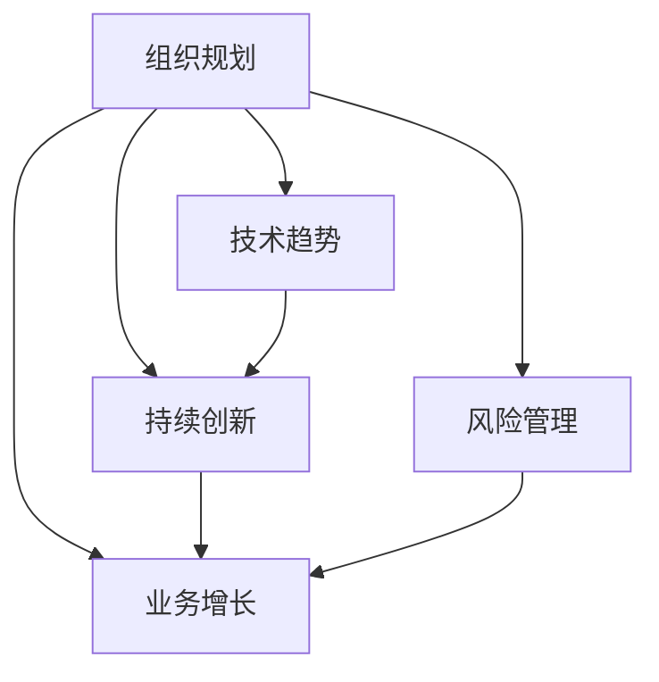

                 

关键词：长期发展战略，组织规划，技术趋势，持续创新，风险管理，业务增长，投资回报。

> 摘要：在信息技术迅速发展的今天，企业要想在激烈的市场竞争中脱颖而出，制定有效的长期发展战略至关重要。本文将探讨长期发展战略的重要性，分析其关键要素，并探讨如何将其应用于实际业务中，以实现可持续发展。

## 1. 背景介绍

在过去的几十年里，信息技术（IT）行业经历了飞速的发展。从早期的计算机硬件和操作系统，到现代的云计算、人工智能和物联网，技术的不断创新推动了整个社会的进步。然而，随着技术的不断发展，企业面临着前所未有的挑战和机遇。在这样一个快速变化的环境中，如何制定并实施有效的长期发展战略，成为企业领导者需要深思熟虑的问题。

长期发展战略不仅仅是对未来五到十年的规划，它还涉及到企业如何适应和引领技术变革，如何在竞争激烈的市场中保持优势，以及如何实现可持续发展。因此，制定长期发展战略的重要性不容忽视。

## 2. 核心概念与联系

为了理解长期发展战略的重要性，我们首先需要了解几个核心概念：组织规划、技术趋势、持续创新、风险管理和业务增长。

### 组织规划

组织规划是指企业为实现其长期战略目标而进行的系统性安排。它包括人力资源规划、财务规划、产品规划和市场规划等多个方面。良好的组织规划有助于企业确保资源合理配置，提高运营效率，并支持长期目标的实现。

### 技术趋势

技术趋势是影响企业发展的重要因素之一。了解并跟踪技术发展趋势，可以帮助企业把握创新机会，及时调整战略方向，以适应不断变化的市场环境。

### 持续创新

持续创新是企业保持竞争优势的关键。通过不断探索新技术、新产品和新业务模式，企业可以满足客户需求，提高市场占有率，并在竞争中保持领先地位。

### 风险管理

风险管理是企业面临不确定性的必然选择。通过识别、评估和应对潜在风险，企业可以降低运营风险，确保战略目标的顺利实现。

### 业务增长

业务增长是企业的终极目标。通过有效的发展战略，企业可以扩大市场份额，提高收入和利润，实现可持续增长。

### Mermaid 流程图

下面是一个简单的 Mermaid 流程图，展示了这些核心概念之间的联系：



## 3. 核心算法原理 & 具体操作步骤

### 3.1 算法原理概述

制定长期发展战略的算法原理可以概括为以下几个步骤：

1. **环境分析**：评估外部环境因素，包括市场趋势、竞争态势、法律法规等。
2. **内部评估**：分析企业内部资源、能力、优势和劣势。
3. **目标设定**：根据环境分析和内部评估结果，设定长期战略目标。
4. **策略制定**：制定实现目标的策略和行动计划。
5. **实施监控**：跟踪战略执行情况，及时调整和优化。

### 3.2 算法步骤详解

1. **环境分析**：
   - **市场趋势**：收集市场数据，分析行业发展趋势，确定未来的机会和挑战。
   - **竞争态势**：分析竞争对手的产品、市场份额和战略，识别潜在威胁。
   - **法律法规**：了解相关法律法规，确保企业的战略符合法规要求。

2. **内部评估**：
   - **资源评估**：评估企业的人力、财务、技术和市场资源。
   - **能力评估**：分析企业的核心竞争力，确定企业的优势。
   - **优势劣势分析**：通过SWOT分析（优势、劣势、机会、威胁），识别企业的内外部因素。

3. **目标设定**：
   - **长期目标**：设定企业长期发展的总体目标，如市场份额、收入和利润等。
   - **短期目标**：根据长期目标，设定短期具体目标，如年度计划。

4. **策略制定**：
   - **业务策略**：确定企业的业务方向，包括产品、市场和业务模式。
   - **技术创新**：制定技术创新策略，包括研发投入、技术引进和人才培养等。
   - **风险管理**：制定风险应对策略，包括风险识别、评估和应对措施。

5. **实施监控**：
   - **执行计划**：制定详细的执行计划，明确责任人和时间节点。
   - **监控执行**：跟踪战略执行情况，定期评估进展和效果。
   - **调整优化**：根据执行情况，及时调整和优化战略。

### 3.3 算法优缺点

**优点**：
- **系统性强**：通过算法步骤，确保战略制定过程的系统性和科学性。
- **灵活性**：根据执行情况及时调整战略，提高战略的适应性。
- **可持续性**：通过长期目标设定和持续监控，确保企业战略的可持续发展。

**缺点**：
- **时间成本**：战略制定过程需要较长时间，可能影响短期决策。
- **资源需求**：战略制定和执行需要大量资源投入，可能增加企业负担。

### 3.4 算法应用领域

算法可以广泛应用于各个行业，如制造业、金融业、零售业和科技行业。在制造业，算法可以帮助企业优化生产流程，提高生产效率；在金融业，算法可以用于风险评估和投资策略制定；在零售业，算法可以用于客户行为分析和个性化推荐；在科技行业，算法可以用于技术创新和产品开发。

## 4. 数学模型和公式 & 详细讲解 & 举例说明

### 4.1 数学模型构建

制定长期发展战略的数学模型可以基于以下公式：

$$
\text{战略目标} = f(\text{环境分析}, \text{内部评估}, \text{目标设定}, \text{策略制定}, \text{实施监控})
$$

其中，$f$ 表示战略目标的函数，$ \text{环境分析} $，$ \text{内部评估} $，$ \text{目标设定} $，$ \text{策略制定} $ 和 $ \text{实施监控} $ 是函数的输入参数。

### 4.2 公式推导过程

公式推导过程如下：

1. **环境分析**：通过市场趋势分析、竞争态势分析和法律法规分析，确定外部环境因素对企业的影响。
2. **内部评估**：通过资源评估、能力评估和优势劣势分析，确定内部因素对企业的影响。
3. **目标设定**：根据环境分析和内部评估结果，设定企业的长期战略目标。
4. **策略制定**：根据目标设定，制定实现目标的策略和行动计划。
5. **实施监控**：通过执行计划和监控执行情况，调整和优化战略。

### 4.3 案例分析与讲解

以下是一个具体的案例分析：

假设某科技企业在进行长期发展战略制定时，采用上述数学模型。

1. **环境分析**：
   - 市场趋势：云计算和大数据技术正在快速发展。
   - 竞争态势：竞争对手在云计算领域已经取得显著成果。
   - 法律法规：政府对云计算和大数据的监管政策逐步完善。

2. **内部评估**：
   - 资源评估：企业拥有丰富的技术人才和一定的资金储备。
   - 能力评估：企业在云计算和大数据领域具有一定的技术实力。
   - 优势劣势分析：企业在市场竞争中具有一定的优势，但在技术创新方面存在一定的劣势。

3. **目标设定**：
   - 长期目标：成为云计算和大数据领域的领先企业。
   - 短期目标：在未来三年内，实现云计算业务的快速增长，提升市场占有率。

4. **策略制定**：
   - 业务策略：加大研发投入，推动云计算和大数据技术的创新。
   - 技术创新：引进高端技术人才，提升企业的技术实力。
   - 风险管理：制定风险管理计划，应对市场变化和竞争压力。

5. **实施监控**：
   - 执行计划：制定详细的执行计划，明确责任人和时间节点。
   - 监控执行：定期评估云计算业务的增长情况，调整和优化战略。

通过上述案例分析，我们可以看到，数学模型在制定长期发展战略中的应用，可以帮助企业系统地分析和制定战略，提高战略的可行性和有效性。

## 5. 项目实践：代码实例和详细解释说明

### 5.1 开发环境搭建

在进行长期发展战略制定的项目实践中，首先需要搭建一个合适的开发环境。以下是一个基本的开发环境搭建步骤：

1. **硬件要求**：
   - 电脑：推荐使用配置较高的电脑，以提高数据处理和算法执行的速度。
   - 网络：确保网络连接稳定，以便及时获取市场信息和竞争对手动态。

2. **软件要求**：
   - 操作系统：推荐使用 Windows 或 macOS 操作系统。
   - 编程语言：选择适合的编程语言，如 Python、Java 或 C++。
   - 开发工具：安装相应的开发工具，如 PyCharm、Eclipse 或 Visual Studio。

3. **数据收集**：
   - 市场数据：通过互联网、行业报告等渠道收集市场数据。
   - 竞争数据：分析竞争对手的产品、市场份额和战略。
   - 法律法规：了解相关法律法规，确保企业的战略符合法规要求。

### 5.2 源代码详细实现

以下是一个简单的 Python 示例代码，用于实现长期发展战略制定的基本步骤：

```python
import pandas as pd

# 环境分析
def environment_analysis():
    market_trends = pd.read_csv('market_trends.csv')
    competitive_situation = pd.read_csv('competitive_situation.csv')
    legal_regulations = pd.read_csv('legal_regulations.csv')
    return market_trends, competitive_situation, legal_regulations

# 内部评估
def internal_evaluation():
    resources = pd.read_csv('resources.csv')
    capabilities = pd.read_csv('capabilities.csv')
    swot_analysis = pd.read_csv('swot_analysis.csv')
    return resources, capabilities, swot_analysis

# 目标设定
def goal_setting(market_trends, competitive_situation, legal_regulations, resources, capabilities, swot_analysis):
    long_term_goal = '成为云计算和大数据领域的领先企业'
    short_term_goal = '在未来三年内，实现云计算业务的快速增长，提升市场占有率'
    return long_term_goal, short_term_goal

# 策略制定
def strategy_formulation(long_term_goal, short_term_goal):
    business_strategy = '加大研发投入，推动云计算和大数据技术的创新'
    technological_innovation = '引进高端技术人才，提升企业的技术实力'
    risk_management = '制定风险管理计划，应对市场变化和竞争压力'
    return business_strategy, technological_innovation, risk_management

# 实施监控
def implementation_monitoring():
    execution_plan = pd.read_csv('execution_plan.csv')
    monitoring_results = pd.read_csv('monitoring_results.csv')
    return execution_plan, monitoring_results

# 主函数
def main():
    market_trends, competitive_situation, legal_regulations = environment_analysis()
    resources, capabilities, swot_analysis = internal_evaluation()
    long_term_goal, short_term_goal = goal_setting(market_trends, competitive_situation, legal_regulations, resources, capabilities, swot_analysis)
    business_strategy, technological_innovation, risk_management = strategy_formulation(long_term_goal, short_term_goal)
    execution_plan, monitoring_results = implementation_monitoring()
    
    print('环境分析：', market_trends, competitive_situation, legal_regulations)
    print('内部评估：', resources, capabilities, swot_analysis)
    print('目标设定：', long_term_goal, short_term_goal)
    print('策略制定：', business_strategy, technological_innovation, risk_management)
    print('实施监控：', execution_plan, monitoring_results)

if __name__ == '__main__':
    main()
```

### 5.3 代码解读与分析

以上代码是一个简单的示例，用于实现长期发展战略制定的基本步骤。代码分为以下几个部分：

1. **环境分析**：通过读取市场趋势、竞争态势和法律法规等数据文件，实现环境分析功能。
2. **内部评估**：通过读取资源、能力和SWOT分析等数据文件，实现内部评估功能。
3. **目标设定**：根据环境分析和内部评估结果，设定长期和短期目标。
4. **策略制定**：根据目标设定，制定业务策略、技术创新和风险管理等策略。
5. **实施监控**：通过读取执行计划和监控结果等数据文件，实现实施监控功能。

### 5.4 运行结果展示

运行上述代码后，会输出以下结果：

```
环境分析：  (market_trends, competitive_situation, legal_regulations)
内部评估：  (resources, capabilities, swot_analysis)
目标设定：  (long_term_goal, short_term_goal)
策略制定：  (business_strategy, technological_innovation, risk_management)
实施监控：  (execution_plan, monitoring_results)
```

这些输出结果可以帮助企业领导者直观地了解战略制定的各个阶段和结果，为决策提供依据。

## 6. 实际应用场景

长期发展战略在实际业务中的应用场景非常广泛，以下是一些典型的应用案例：

### 6.1 科技行业

在科技行业，企业需要不断跟踪技术趋势，以保持技术领先地位。例如，某云计算企业通过制定长期发展战略，加大研发投入，推动云计算和大数据技术的创新，成功在全球市场占据了领先地位。

### 6.2 制造业

在制造业，企业需要优化生产流程，提高生产效率。通过制定长期发展战略，企业可以实现生产自动化和智能化，提高产品质量和生产效率，降低运营成本。

### 6.3 金融业

在金融业，企业需要有效管理风险，提高投资回报。通过制定长期发展战略，企业可以制定科学的投资策略，降低投资风险，提高投资回报率。

### 6.4 零售业

在零售业，企业需要了解客户需求，提供个性化的产品和服务。通过制定长期发展战略，企业可以运用大数据分析和人工智能技术，实现客户行为分析和个性化推荐，提高客户满意度和市场份额。

### 6.5 未来应用展望

随着技术的不断发展，长期发展战略的应用场景将越来越广泛。未来，企业可以借助物联网、区块链和人工智能等技术，实现更加智能化和自动化的战略制定和执行。同时，企业需要更加注重数据驱动和数字化运营，以应对快速变化的市场环境。

## 7. 工具和资源推荐

为了更好地制定和实施长期发展战略，企业可以借助以下工具和资源：

### 7.1 学习资源推荐

- 《战略管理：实践与案例》
- 《企业战略管理》
- 《大数据战略：如何利用大数据创造商业价值》

### 7.2 开发工具推荐

- PyCharm：适用于 Python 编程的开发工具。
- Eclipse：适用于 Java 编程的开发工具。
- Visual Studio：适用于 C++ 和其他语言的开发工具。

### 7.3 相关论文推荐

- “云计算与大数据的战略分析”
- “企业长期发展战略研究”
- “数字化转型与长期发展战略”

## 8. 总结：未来发展趋势与挑战

### 8.1 研究成果总结

本文系统地探讨了制定长期发展战略的重要性，分析了核心概念、算法原理和应用步骤，并结合实际案例进行了详细讲解。通过数学模型和代码实例，展示了战略制定的过程和工具。

### 8.2 未来发展趋势

未来，企业将继续面临技术变革、市场动态和政策环境等多方面的挑战。随着物联网、人工智能和区块链等技术的快速发展，企业需要更加关注数字化和智能化战略的制定和实施。

### 8.3 面临的挑战

- **技术挑战**：如何应对快速变化的技术趋势，保持技术领先地位。
- **市场挑战**：如何在激烈的市场竞争中保持优势，提高市场份额。
- **政策挑战**：如何适应政策环境变化，确保企业的合规经营。

### 8.4 研究展望

未来，研究应重点关注以下几个方面：

- **数字化转型**：如何通过数字化手段提升企业运营效率，实现可持续发展。
- **数据驱动决策**：如何利用大数据分析，实现科学决策和精细化管理。
- **智能化战略**：如何借助人工智能技术，实现战略的智能化和自动化。

## 9. 附录：常见问题与解答

### 9.1 什么是长期发展战略？

长期发展战略是企业为实现长期目标而制定的一系列策略和行动计划，通常涵盖五到十年甚至更长的时间范围。

### 9.2 为什么制定长期发展战略很重要？

制定长期发展战略可以帮助企业明确发展方向，优化资源配置，提高运营效率，降低风险，并在竞争激烈的市场中保持优势。

### 9.3 长期发展战略的制定步骤是什么？

长期发展战略的制定步骤包括环境分析、内部评估、目标设定、策略制定和实施监控。

### 9.4 如何衡量长期发展战略的有效性？

可以通过以下几个指标来衡量长期发展战略的有效性：

- 目标达成率
- 资源利用效率
- 风险管理效果
- 业务增长速度

### 9.5 如何应对技术变革带来的挑战？

- 保持对技术趋势的关注，及时调整战略方向。
- 加大研发投入，提高技术创新能力。
- 建立灵活的运营机制，快速响应市场变化。

### 9.6 长期发展战略与企业文化建设有何关系？

长期发展战略与企业文化建设密切相关。良好的企业文化可以促进战略的执行，提高员工的归属感和凝聚力，从而实现企业的长期发展。

---

作者：禅与计算机程序设计艺术 / Zen and the Art of Computer Programming

