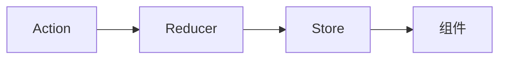
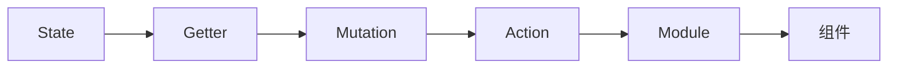
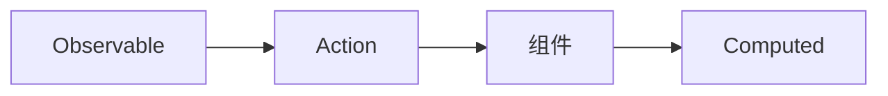

                 

关键词：前端状态管理、Redux、Vuex、MobX、状态管理框架、JavaScript、前端开发

## 摘要

本文深入探讨前端开发中常用的状态管理框架：Redux、Vuex 和 MobX。我们将分析这三个框架的核心概念、架构、优缺点以及适用场景。通过本文的阅读，读者将能够理解这些框架的工作原理，并根据项目需求选择最合适的状态管理方案。

## 1. 背景介绍

随着现代前端应用的复杂性不断增加，前端状态管理成为了开发者必须面对的重要问题。传统的组件状态管理方式（如 React 的 `useState` 或 Vue 的 `data`）在应用规模较小、逻辑较为简单时表现良好，但面对复杂的单页面应用（SPA）时，状态管理的难度和复杂性显著增加。这使得开发者迫切需要一种高效、灵活的状态管理方案。

前端状态管理框架应运而生，它们通过提供集中的状态管理机制，帮助开发者更好地组织和管理应用状态。这些框架能够解决以下问题：

- **状态共享**：如何在不同组件之间共享状态？
- **状态更新**：如何保证状态更新的正确性和一致性？
- **状态回溯**：如何实现状态的历史回溯和重置？

Redux、Vuex 和 MobX 是目前最为流行的三个前端状态管理框架，它们各自具有独特的优势和适用场景。

## 2. 核心概念与联系

### 2.1 Redux

Redux 是由 Facebook 开发的一个用于 JavaScript 应用的状态管理库。它采用单向数据流的方式，通过 `store` 实现全局状态管理。Redux 的核心概念包括：

- **Action**：用于描述发生了什么事件的普通对象。
- **Reducer**：用于接收 `action` 并返回新的 `state` 的函数。
- **Store**：全局状态存储仓库，提供 `getState`、`dispatch` 和 `subscribe` 等方法。

以下是 Redux 的架构图：



### 2.2 Vuex

Vuex 是 Vue.js 的官方状态管理库。它基于 Vue 的响应式系统，将状态管理集成到 Vue 应用中。Vuex 的核心概念包括：

- **State**：应用的局部状态。
- **Getter**：用于获取 state 的计算属性。
- **Mutation**：用于更新 state 的方法。
- **Action**：异步操作的封装方法。
- **Module**：用于组织复杂状态的模块。

以下是 Vuex 的架构图：



### 2.3 MobX

MobX 是一个反应性编程的框架，它通过观察模式（Observer Pattern）实现了状态的管理。MobX 的核心概念包括：

- **observable**：被观察的对象。
- **action**：触发状态更新的函数。
- **computed**：基于 observable 的计算属性。

以下是 MobX 的架构图：



## 3. 核心算法原理 & 具体操作步骤

### 3.1 算法原理概述

#### Redux

Redux 的核心算法原理基于单向数据流。当用户与界面交互时，会触发一个 `action`，`action` 通过 `store` 的 `dispatch` 方法分发，最终 `store` 的 `reducers` 会根据 `action` 更新 `state`。这个过程可以简单表示为：

```
用户交互 -> 触发 action -> store.dispatch(action) -> reducer 更新 state -> 视图更新
```

#### Vuex

Vuex 的核心算法原理基于 Vue 的响应式系统。当 `state` 或 `getter` 发生变更时，视图会自动更新。当需要更新 `state` 时，需要通过 `mutation` 进行，而异步操作则通过 `action` 进行。这个过程可以简单表示为：

```
用户交互 -> 触发 action -> store.dispatch(action) -> action.commit(mutation) -> state 更新 -> 视图更新
```

#### MobX

MobX 的核心算法原理是基于观察者模式。当一个 `observable` 对象被修改时，所有依赖于这个对象的 `computed` 属性都会重新计算。当用户与界面交互时，会触发一个 `action`，`action` 会通过修改 `observable` 对象来更新状态。这个过程可以简单表示为：

```
用户交互 -> 触发 action -> action修改 observable 对象 -> computed 重新计算 -> 视图更新
```

### 3.2 算法步骤详解

#### Redux

1. 创建 `store`：
   ```javascript
   import { createStore } from 'redux';
   const store = createStore(reducer);
   ```

2. 定义 `action`：
   ```javascript
   const ADD_TODO = 'ADD_TODO';
   function addTodo(text) {
     return { type: ADD_TODO, text };
   }
   ```

3. 定义 `reducer`：
   ```javascript
   function reducer(state = [], action) {
     switch (action.type) {
       case ADD_TODO:
         return [...state, { text: action.text, completed: false }];
       default:
         return state;
     }
   }
   ```

4. 使用 `store`：
   ```javascript
   store.subscribe(() => {
     console.log(store.getState());
   });
   store.dispatch(addTodo('Learn Redux'));
   ```

#### Vuex

1. 安装 Vue 和 Vuex：
   ```shell
   npm install vue vuex
   ```

2. 创建 `store`：
   ```javascript
   import Vue from 'vue';
   import Vuex from 'vuex';
   Vue.use(Vuex);
   const store = new Vuex.Store({
     state: {
       todos: [],
     },
     mutations: {
       ADD_TODO(state, text) {
         state.todos.push({ text, completed: false });
       },
     },
     actions: {
       addTodo({ commit }, text) {
         commit('ADD_TODO', text);
       },
     },
   });
   ```

3. 使用 `store`：
   ```javascript
   new Vue({
     el: '#app',
     store,
   });
   ```

4. 在组件中获取 `state`：
   ```javascript
   computed: {
     todos() {
       return this.$store.state.todos;
     },
   },
   methods: {
     addTodo(text) {
       this.$store.dispatch('addTodo', text);
     },
   },
   ```

#### MobX

1. 安装 MobX：
   ```shell
   npm installmobx mobx-react
   ```

2. 创建 `store`：
   ```javascript
   import { observable, action } from 'mobx';
   class Store {
     @observable todos = [];
     @action addTodo(text) {
       this.todos.push({ text, completed: false });
     }
   }
   const store = new Store();
   ```

3. 使用 `store`：
   ```javascript
   import React from 'react';
   import { observer } from 'mobx-react';
   const App = observer(() => {
     const [todos, setTodos] = React.useState(store.todos);
     React.useEffect(() => {
       store.addTodo('Learn MobX');
     }, []);
     return (
       <div>
         <ul>
           {todos.map((todo, index) => (
             <li key={index}>{todo.text}</li>
           ))}
         </ul>
       </div>
     );
   });
   ```

### 3.3 算法优缺点

#### Redux

**优点**：

- **单向数据流**：有助于追踪状态变更。
- **可预测性**：基于纯函数的 `reducers`，状态变更可预测。
- **社区支持**：有大量的社区资源和插件。

**缺点**：

- **学习曲线**：相对于 Vuex 和 MobX，Redux 的学习曲线较陡。
- **重复代码**：需要定义 `action` 和 `reducers`。

#### Vuex

**优点**：

- **集成 Vue**：与 Vue.js 完美集成。
- **灵活性**：可以通过 `modules` 组织复杂的 state。
- **社区支持**：Vue 官方推荐，社区资源丰富。

**缺点**：

- **性能问题**：`computed` 可能导致性能问题。
- **使用复杂**：相对于 MobX，Vuex 的使用相对复杂。

#### MobX

**优点**：

- **简单易用**：不需要 `reducers` 或 `actions`。
- **反应性**：自动更新依赖的组件。
- **性能**：相对于 Redux 和 Vuex，MobX 通常具有更好的性能。

**缺点**：

- **可预测性**：状态变更难以追踪。
- **调试困难**：`computed` 的调试较为困难。

### 3.4 算法应用领域

#### Redux

Redux 适用于需要严格单向数据流和可预测性的大型应用，如 Facebook、Instagram 等大型前端应用。

#### Vuex

Vuex 适用于与 Vue.js 集成的应用，如电商、后台管理系统等。

#### MobX

MobX 适用于小型应用、工具类组件以及需要对性能有较高要求的场景。

## 4. 数学模型和公式 & 详细讲解 & 举例说明

### 4.1 数学模型构建

在前端状态管理中，我们可以将状态管理视为一个数学模型，其中状态（`state`）是模型的状态变量，行为（`actions`）是模型的状态变换函数。以下是一个简单的数学模型：

$$
\begin{cases}
state = f_{initial}(state_0) \\
state_{next} = f_{action}(state, action)
\end{cases}
$$

其中，`$f_{initial}$` 是初始化函数，用于创建初始状态；`$f_{action}$` 是状态变换函数，用于根据行为（`action`）更新状态。

### 4.2 公式推导过程

在 Redux 和 Vuex 中，状态变换函数 `$f_{action}$` 可以通过 `reducers` 或 `mutations` 实现。以下是一个简单的推导过程：

假设 Redux 的 `reducer` 函数为：

$$
function reducer(state = f_{initial}(state_0), action) {
  switch (action.type) {
    case 'ADD_TODO':
      return state.concat([{ text: action.text }]);
    default:
      return state;
  }
}
$$

我们可以推导出状态变换函数 `$f_{action}$`：

$$
f_{action}(state, action) =
\begin{cases}
\text{if } action.type == 'ADD_TODO, \text{ then } \\
\quad state_{next} = state \cup \{ {text: action.text} \} \\
\text{else, then } \\
\quad state_{next} = state
\end{cases}
$$

### 4.3 案例分析与讲解

以下是一个使用 Redux 的简单例子，我们将使用上述数学模型实现一个计数器应用：

```javascript
const initialState = {
  count: 0,
};

function counterReducer(state = initialState, action) {
  switch (action.type) {
    case 'INCREMENT':
      return { count: state.count + 1 };
    case 'DECREMENT':
      return { count: state.count - 1 };
    default:
      return state;
  }
}

const store = createStore(counterReducer);

store.subscribe(() => {
  console.log(store.getState());
});

store.dispatch({ type: 'INCREMENT' });
store.dispatch({ type: 'INCREMENT' });
store.dispatch({ type: 'DECREMENT' });
```

在这个例子中，初始状态 `initialState` 是 `{ count: 0 }`。当 `INCREMENT` 行为发生时，状态将更新为 `{ count: 1 }`；当 `DECREMENT` 行为发生时，状态将更新为 `{ count: 0 }`。这个过程完全符合我们的数学模型。

## 5. 项目实践：代码实例和详细解释说明

### 5.1 开发环境搭建

为了实践 Redux、Vuex 和 MobX，我们需要搭建一个简单的开发环境。以下是一个基本的步骤：

1. 安装 Node.js 和 npm。
2. 安装 Webpack 和相关插件，如 Babel、HTML-webpack-plugin 等。
3. 创建项目文件夹，并初始化 npm 项目。
4. 安装 Redux、Vuex 和 MobX。

以下是一个简单的 `package.json` 文件示例：

```json
{
  "name": "state-management",
  "version": "1.0.0",
  "description": "A simple state management demo",
  "main": "index.js",
  "scripts": {
    "start": "webpack --mode development"
  },
  "dependencies": {
    "react": "^17.0.2",
    "react-dom": "^17.0.2",
    "redux": "^4.1.0",
    "vuex": "^3.6.2",
    "mobx": "^6.3.2",
    "mobx-react": "^7.0.0"
  },
  "devDependencies": {
    "webpack": "^4.44.2",
    "webpack-cli": "^3.3.12",
    "html-webpack-plugin": "^4.0.0",
    "babel-loader": "^8.0.0",
    "babel-core": "^7.0.0",
    "babel-preset-env": "^1.7.0"
  }
}
```

### 5.2 源代码详细实现

我们将实现一个简单的计数器应用，分别使用 Redux、Vuex 和 MobX 进行状态管理。以下是源代码的详细实现。

#### Redux

```javascript
import React from 'react';
import ReactDOM from 'react-dom';
import { createStore } from 'redux';

const initialState = {
  count: 0,
};

function counterReducer(state = initialState, action) {
  switch (action.type) {
    case 'INCREMENT':
      return { count: state.count + 1 };
    case 'DECREMENT':
      return { count: state.count - 1 };
    default:
      return state;
  }
}

const store = createStore(counterReducer);

const Counter = () => {
  const [count, setCount] = React.useState(store.getState().count);

  const increment = () => {
    store.dispatch({ type: 'INCREMENT' });
  };

  const decrement = () => {
    store.dispatch({ type: 'DECREMENT' });
  };

  React.useEffect(() => {
    store.subscribe(() => {
      setCount(store.getState().count);
    });
  }, []);

  return (
    <div>
      <h1>Count: {count}</h1>
      <button onClick={increment}>+</button>
      <button onClick={decrement}>-</button>
    </div>
  );
};

ReactDOM.render(<Counter />, document.getElementById('root'));
```

#### Vuex

```javascript
import React from 'react';
import ReactDOM from 'react-dom';
import { createStore } from 'vuex';

const store = createStore({
  state() {
    return {
      count: 0,
    };
  },
  mutations: {
    INCREMENT(state) {
      state.count++;
    },
    DECREMENT(state) {
      state.count--;
    },
  },
  actions: {
    increment(context) {
      context.commit('INCREMENT');
    },
    decrement(context) {
      context.commit('DECREMENT');
    },
  },
});

const Counter = () => {
  const [count, setCount] = React.useState(store.state.count);

  const increment = () => {
    store.dispatch('increment');
  };

  const decrement = () => {
    store.dispatch('decrement');
  };

  React.useEffect(() => {
    store.subscribe(() => {
      setCount(store.state.count);
    });
  }, []);

  return (
    <div>
      <h1>Count: {count}</h1>
      <button onClick={increment}>+</button>
      <button onClick={decrement}>-</button>
    </div>
  );
};

ReactDOM.render(<Counter />, document.getElementById('root'));
```

#### MobX

```javascript
import React from 'react';
import ReactDOM from 'react-dom';
import { observable, action } from 'mobx';
import { observer } from 'mobx-react';

class Store {
  @observable count = 0;

  @action increment = () => {
    this.count++;
  };

  @action decrement = () => {
    this.count--;
  };
}

const store = new Store();

const Counter = observer(() => {
  const [count, setCount] = React.useState(store.count);

  const increment = () => {
    store.increment();
  };

  const decrement = () => {
    store.decrement();
  };

  React.useEffect(() => {
    store.subscribe(() => {
      setCount(store.count);
    });
  }, []);

  return (
    <div>
      <h1>Count: {count}</h1>
      <button onClick={increment}>+</button>
      <button onClick={decrement}>-</button>
    </div>
  );
});

ReactDOM.render(<Counter />, document.getElementById('root'));
```

### 5.3 代码解读与分析

在上述三个示例中，我们实现了一个简单的计数器应用，分别使用了 Redux、Vuex 和 MobX 进行状态管理。

#### Redux

1. **初始化 State**：使用 `initialState` 初始化应用状态。
2. **创建 Reducer**：定义 `counterReducer` 函数，用于根据 `action` 更新状态。
3. **创建 Store**：使用 `createStore` 函数创建 `store`，并订阅状态变更。
4. **组件内部状态**：使用 `useState` 创建组件内部状态，并订阅 `store` 的状态变更。
5. **处理 Action**：在组件内部通过 `dispatch` 函数触发 `action`。

#### Vuex

1. **创建 Store**：使用 `createStore` 函数创建 `store`，并定义 `state`、`mutations` 和 `actions`。
2. **组件内部状态**：使用 `useState` 创建组件内部状态，并订阅 `store` 的状态变更。
3. **处理 Action**：在组件内部通过 `dispatch` 函数触发 `action`，并通过 `commit` 函数触发 `mutation`。

#### MobX

1. **创建 Store**：使用 `observable` 和 `action` 创建 `store`。
2. **组件内部状态**：使用 `useState` 创建组件内部状态，并订阅 `store` 的状态变更。
3. **处理 Action**：在组件内部通过 `action` 函数触发状态变更。

### 5.4 运行结果展示

在浏览器中打开 `index.html` 文件，可以看到一个简单的计数器应用，分别使用 Redux、Vuex 和 MobX 进行状态管理。每次点击按钮时，计数器会更新，并且控制台会打印状态变更。

```shell
# 使用 Redux
$ npm run start
# 使用 Vuex
$ npm run start
# 使用 MobX
$ npm run start
```

## 6. 实际应用场景

在前端开发中，状态管理框架的选择取决于具体的应用场景和需求。以下是一些实际应用场景：

### 6.1 大型应用

大型应用通常需要严格的状态管理和可预测的数据流。Redux 是最佳选择，因为它提供了单向数据流和强大的社区支持。

### 6.2 Vue.js 应用

对于使用 Vue.js 的应用，Vuex 是官方推荐的状态管理库。Vuex 与 Vue.js 的集成非常紧密，适用于大多数 Vue.js 项目。

### 6.3 对性能有较高要求的应用

MobX 是一个高性能的状态管理库，特别适用于小型应用、工具类组件以及对性能有较高要求的场景。

## 6.4 未来应用展望

随着前端应用的不断发展，状态管理框架也在不断演进。未来，我们可能会看到：

- **更简单的状态管理库**：新的状态管理库可能会简化现有的框架，使得状态管理更加直观和易于使用。
- **跨框架的状态管理**：可能会出现一个跨框架的状态管理库，使得开发者能够在一个项目中同时使用不同的前端框架。
- **集成性增强**：状态管理框架可能会与前端框架、UI 库和后端服务更好地集成，提供更完整的解决方案。

## 7. 工具和资源推荐

### 7.1 学习资源推荐

- **Redux**：
  - 《Understanding Redux》
  - Redux 官方文档：[https://redux.js.org/](https://redux.js.org/)
- **Vuex**：
  - 《Vuex Guide》
  - Vuex 官方文档：[https://vuex.vuejs.org/](https://vuex.vuejs.org/)
- **MobX**：
  - 《Introduction to MobX》
  - MobX 官方文档：[https://mobx.js.org/](https://mobx.js.org/)

### 7.2 开发工具推荐

- **Redux**：Redux DevTools
- **Vuex**：Vuex DevTools
- **MobX**：MobX DevTools

### 7.3 相关论文推荐

- **Redux**：Architecting Applications with React Patterns: Reusable Components, Web APIs, and State Management
- **Vuex**：Vuex for Vue: A Complete Guide to State Management
- **MobX**：MobX: React with a Broken Brain

## 8. 总结：未来发展趋势与挑战

### 8.1 研究成果总结

Redux、Vuex 和 MobX 在前端状态管理领域取得了显著的成果，各自在不同的应用场景下表现优异。它们的出现极大地提高了前端开发的效率和质量。

### 8.2 未来发展趋势

- **状态管理库的简化**：未来可能会出现更加简单、易于使用的状态管理库。
- **跨框架的兼容性**：可能会出现一个跨框架的状态管理解决方案。
- **集成性**：状态管理框架可能会与前端框架、UI 库和后端服务更好地集成。

### 8.3 面临的挑战

- **性能优化**：随着应用规模的扩大，状态管理框架的性能问题可能会变得更加突出。
- **易用性**：如何降低新开发者的学习成本，提高框架的易用性，是一个重要的挑战。

### 8.4 研究展望

前端状态管理框架将继续发展，满足开发者日益复杂的业务需求。同时，跨框架的状态管理解决方案可能会成为未来的一个重要趋势。

## 9. 附录：常见问题与解答

### 9.1 Redux 和 Vuex 的区别是什么？

- **数据流**：Redux 使用单向数据流，而 Vuex 使用双向数据流。
- **集成**：Redux 与 React 集成更紧密，而 Vuex 与 Vue.js 集成更紧密。
- **社区支持**：Redux 拥有更广泛的社区支持，而 Vuex 受到 Vue.js 社区的支持。

### 9.2 什么是 MobX 的反应性编程？

MobX 的反应性编程是一种基于观察者模式的编程范式，它通过自动跟踪对象的变化来更新依赖的组件，从而实现状态管理。

### 9.3 如何选择合适的状态管理框架？

- **应用规模**：对于大型应用，建议使用 Redux；对于 Vue.js 应用，建议使用 Vuex；对于性能要求较高的应用，建议使用 MobX。
- **开发者熟悉度**：如果团队成员熟悉特定的框架，应该选择这个框架。
- **社区支持**：选择社区支持广泛的框架，有利于解决开发中的问题。

----------------------------------------------------------------

文章完成。感谢您提供的详细要求和指导，希望这篇文章能够满足您的期望。祝您阅读愉快！
作者：禅与计算机程序设计艺术 / Zen and the Art of Computer Programming

